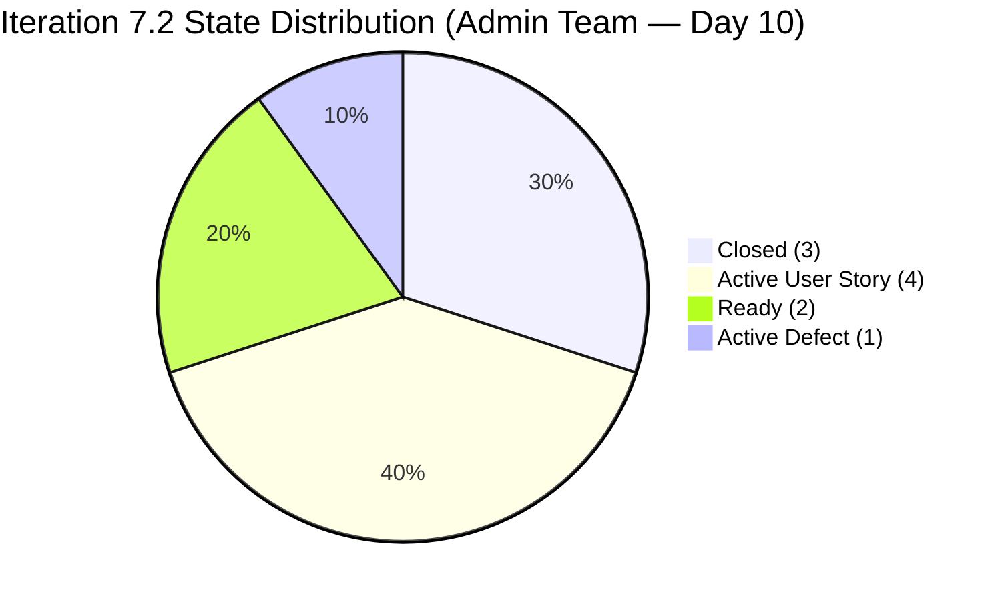
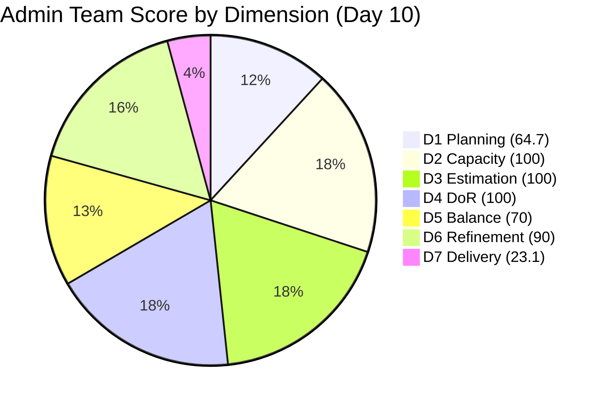

# ADO SAFe Iteration Audit — Administration Team

**Audit #43 | Iteration 7.2 (Apr 20 – May 3, 2026) | Day 10 of 14**

---

## 1. Audit Metadata

| Field | Value |
|---|---|
| **Audit Date** | April 29, 2026 — 02:04 UTC |
| **Auditor** | Claude Code (ADO SAFe Audit Agent) |
| **Workspace** | `ado_admin` |
| **ADO Project** | Jairosoft FINOPS (`e0bb302f-40f9-46c3-8164-6f1acb317d63`) |
| **Team** | Administration Team (`a38a9c02-07ab-483d-a1e3-aff54e19e603`) |
| **Iteration** | Iteration 7.2 — Apr 20 to May 3, 2026 |
| **Iteration ID** | `a9888bc5-48df-40dd-bcc8-6926a11aa7c7` |
| **Sprint Day** | Day 10 of 14 |
| **Prior Audit** | AUDIT_20260428_0902.md (Audit #42, 73.4 — Moderate Risk, PI7.2 Day 9) |
| **Scoring Model** | ADO SAFe v1 (7-dimension rubric) |
| **Overall Score** | **78.3 / 100** |
| **Risk Band** | **Moderate Risk** (60–79.9; 1.7 points below Low-Risk threshold) |

> **Live ADO data confirmed.** 17 visible root backlog items in scope (Administration Team, `Microsoft.RequirementCategory`). 11 current iteration root items confirmed via `wit_get_work_items_for_iteration`. Capacity and work item details confirmed via ADO batch APIs at 02:04 UTC April 29, 2026.

---

## 2. Executive Summary

The Administration Team surges to **78.3 / 100 — Moderate Risk** on Day 10 of Iteration 7.2, a **+4.9 improvement** over Audit #42 (73.4) and the single largest single-day score gain for this team this sprint. The score improvement is driven by **three closures confirmed in the early hours of April 29**:

- **#202353** ("JIT BFP certificate renewal 2026", 3 SP): Closed at 01:48 UTC — BFP FSIC renewal process completed
- **#202898** ("Condo dues (Cebu) payables", 3 SP): Closed at 01:58 UTC — condo payment settled with full documentation
- **#202945** ("Grass cutting outside at the building", 3 SP): Closed at 02:29 UTC — facility maintenance completed

Total closed SP now: **9 of 39** (23.1%). Delivery Predictability jumps from 7.7 to **23.1** — the highest D7 for this team this sprint.

The team is now just **1.7 points below Low Risk (80)**. With 4 working days remaining, closing 2–3 more items (particularly the Ready-state items) is achievable and would push the team into Low Risk territory.

**Active signals today (Apr 29):**
- **#202939** ("Professional fee for IC", 2 SP): changed at 02:29 UTC — now Active (was Active from earlier, additional work logged)
- Six sprint items remain open: 3 Active, 2 Ready, 1 Active (Defect)

---

## 3. Previous Audit Delta

| Dimension | Audit #42 (Apr 28, 09:02) | Audit #43 (Apr 29, 02:04) | Delta | Driver |
|---|---|---|---|---|
| Iteration Planning | 55.0 | **64.7** | **+9.7** | Backlog dropped from 20 to 17 items (closed items removed); 11/17 now in sprint |
| Team Capacity | 100.0 | 100.0 | 0.0 | Unchanged |
| Estimation | 100.0 | 100.0 | 0.0 | Unchanged |
| DoR Compliance | 90.9 | **100.0** | **+9.1** | #202898 now has full Desc + AC (PASS); all 11 sprint items pass |
| Work Item Balance | 70.0 | 70.0 | 0.0 | Composition unchanged (10 US + 1 Defect) |
| Backlog Refinement | 90.0 | 90.0 | 0.0 | #202357 + #202366 still untouched since Apr 17 |
| Delivery Predictability | 7.7 | **23.1** | **+15.4** | 3 closures: #202353 + #202898 + #202945 (9 SP closed total) |
| **Overall** | **73.4** | **78.3** | **+4.9** | Three closures + D1 improvement drive the gain |

**ADO changes detected since Audit #42 (09:02 UTC Apr 28):**
- **#202353** ("JIT BFP certificate renewal 2026", 3 SP): Active → **Closed** at 01:48 UTC Apr 29
- **#202898** ("Condo dues (Cebu) payables", 3 SP): State confirmed **Closed**; updated at 01:58 UTC Apr 29 with full Desc and AC added
- **#202945** ("Grass cutting outside at the building", 3 SP): New → **Closed** at 02:29 UTC Apr 29
- **#202939** ("Professional fee for IC", 2 SP): changed at 02:29 UTC Apr 29 — still Active

### Score Trajectory — Iteration 7.2 Series

| Audit # | Date | Score | Band | Sprint Day |
|---|---|---|---|---|
| #33 | Apr 21 (Day 2) | 69.5 | Moderate | 7.2 D2 |
| #35 | Apr 23 (Day 4) | 71.0 | Moderate | 7.2 D4 |
| #37 | Apr 24 (Day 5) | 71.0 | Moderate | 7.2 D5 |
| #41 | Apr 27 (Day 8) | 72.1 | Moderate | 7.2 D8 |
| #42 | Apr 28 (Day 9) | 73.4 | Moderate | 7.2 D9 |
| **#43** | **Apr 29 (Day 10)** | **78.3** | **Moderate** | **7.2 D10** |

+8.8 improvement since Day 8. The team is on the cusp of Low Risk. Closing 2 more items (approx. 6+ SP) would cross the 80.0 threshold.

---

## 4. Current Iteration Snapshot

| Metric | Value |
|---|---|
| **Visible root backlog items** | 17 |
| **Current iteration root items (Iter 7.2)** | 11 |
| **Unscoped PI7-root items** | 6 (193412, 197115, 197111, 192221, 197023, 197029, 197028, 197113 minus closed = 8 unscoped + 202894) |
| **Committed story points** | 39 SP |
| **Closed story points** | 9 SP (#202353 + #202898 + #202945) |
| **Remaining open SP** | 30 SP |
| **Sprint progress** | Day 10 of 14 (71% elapsed) |
| **SP delivery rate** | 9 SP / 10 days = 0.9 SP/day |
| **SP needed per remaining day** | 30 SP / 4 days = 7.5 SP/day (unrealistic for full close) |
| **Realistic projection** | ~12–16 SP closed by May 3 (based on current pace) |
| **Team capacity per day** | 5 hrs/day (Mark: 1 Deploy + 2 Doc + 2 Req) |
| **Days off this sprint** | 0 |
| **Assignees on sprint items** | Mark Colina (sole contributor) |
| **Bus factor** | 1 — critical single-person dependency |

### State Distribution — Current Iteration Items

| State | Count | SP | Items |
|---|---|---|---|
| Closed | 3 | 9 | #202353, #202898, #202945 |
| Active | 3 | 12 | #202896, #202897, #202909 |
| Ready | 2 | 7 | #202895, #202937 |
| Active (Defect) | 1 | 5 | #202357 |
| Active | 1 | 2 | #202939 |
| Active (US) | 1 | 3 | #202366 |
| **Total** | **11** | **39** | |

> Note: #202939 (Professional fee for IC) is Active; #202366 (Philgeps renewal) is Active. Both are open.

---

## 5. Work Item Analysis

### Current Iteration Root Items (11 items)

| ID | Title | Type | State | SP | DoR | AssignedTo | Changed |
|---|---|---|---|---|---|---|---|
| 202353 | JIT BFP certificate renewal 2026 | User Story | **Closed** | 3 | PASS | Mark Colina | **Apr 29** |
| 202898 | Condo dues (Cebu) payables | User Story | **Closed** | 3 | PASS | Mark Colina | **Apr 29** |
| 202945 | Grass cutting outside at the building | User Story | **Closed** | 3 | PASS | Mark Colina | **Apr 29** |
| 202896 | Payables - Internet for Davao and Cebu office | User Story | Active | 5 | PASS | Mark Colina | Apr 25 |
| 202897 | Utilities payables for Cebu and Davao | User Story | Active | 4 | PASS | Mark Colina | Apr 27 |
| 202909 | Davao Admin Adhoc Support Apr 20–May 3, 2026 | User Story | Active | 4 | PASS | Mark Colina | Apr 28 |
| 202895 | Government (EGOV) payables | User Story | Ready | 4 | PASS | Mark Colina | Apr 27 |
| 202937 | 3 vendors site visit Davao – Solar panel quotation | User Story | Ready | 3 | PASS | Mark Colina | Apr 22 |
| 202357 | Fixation in rooftop (Davao) | Defect | Active | 5 | PASS | Mark Colina | Apr 17 |
| 202366 | Philgeps renewal for 2026 | User Story | Active | 3 | PASS | Mark Colina | Apr 17 |
| 202939 | Professional fee for IC | User Story | Active | 2 | PASS | Mark Colina | **Apr 29** |

**DoR change this audit:** #202898 now has full Description and Acceptance Criteria (populated before closure). All 11 sprint items pass DoR — first time this sprint D4 = 100.0.

### DoR Compliance Notes

- **#202353**: Desc describes FSIC renewal process (>30 chars). AC lists 4 criteria (submission, payment, inspection, issuance). **PASS**
- **#202898**: Desc describes condo dues purpose. AC lists 7 criteria including billing verification, payment, receipt, audit filing. **PASS**
- **#202945**: Desc describes grass cutting scope. AC lists 3 criteria (trim, dispose, timeline). **PASS**
- All remaining 8 items: confirmed PASS from prior audits with no degradation.

### Unscoped PI7-Root Items (8 items — outside current sprint)

| ID | Title | SP | Changed |
|---|---|---|---|
| 193412 | Implementation of aircon repair 2nd floor | 2 | Apr 17 |
| 197115 | Implementation of installing jockey pump | 4 | Apr 17 |
| 197111 | Recanvass for Jockey pump materials needed | 1 | Apr 17 |
| 192221 | Purchase additional Corrugated Sheet and installation Day 1 | 2 | Apr 22 |
| 197023 | Installation of corrugated sheet at Fire Exit | 3 | Apr 17 |
| 197029 | Implementation of Parking with roof for 2 vehicles (Day 1) | 3 | Apr 17 |
| 197028 | Purchase materials at Houseman Hardware | 1 | Apr 17 |
| 197113 | Purchase materials for Jockey pump | 1 | Apr 17 |
| 202894 | Goverment payables for *(incomplete title)* | — | Apr 19 |

---

## 6. SAFe Compliance Scorecard

| Dimension | Score | Evidence | Notes |
|---|---|---|---|
| D1 Iteration Planning | 64.7 | 11 / 17 items in sprint | Closed items removed from visible backlog; 6 unscoped PI7-root items remain |
| D2 Team Capacity | 100.0 | 1 / 1 contributor with capacity | Mark (5 hrs/day); 0 days off |
| D3 Estimation | 100.0 | 11 / 11 sprint items have SP | All items estimated |
| D4 DoR Compliance | 100.0 | 11 / 11 sprint items pass | #202898 documentation added before closure; all 11 now PASS — first time this sprint |
| D5 Work Item Balance | 70.0 | Dominant type >60% penalty | 10 US + 1 Defect; User Story = 90.9% → -30 penalty |
| D6 Backlog Refinement | 90.0 | 17/17 fresh (45-day window); 2 untouched current | #202357 + #202366 unchanged since Apr 17 (pre-sprint start) → -10 |
| D7 Delivery Predictability | 23.1 | 9 / 39 SP closed | Three closures today: #202353, #202898, #202945 (3 SP each) |
| **Overall** | **78.3** | **(64.7+100+100+100+70+90+23.1)/7** | **Moderate Risk** |

---

## 7. Dimension Findings

### D1 — Iteration Planning (64.7 — improved from 55.0)

A meaningful structural improvement: as closed items exit the visible backlog, the ratio of sprint-scoped items to total backlog improves. The team now has 11 items in the sprint out of 17 visible items (vs. 11/20 = 55.0 in Audit #42). The remaining 6 unscoped PI7-root items should be assigned to future iterations (7.3–7.6) as part of PI planning hygiene. Item **#202894** ("Goverment payables for") has an incomplete title and no SP — it must be renamed and scoped before it can be committed.

### D2 — Team Capacity (100.0)

Mark Colina has 5 hours/day configured across Deployment (1), Documentation (2), and Requirements (2). Zero days off this sprint. Capacity configuration is complete and accurate. The bus factor of 1 remains a critical structural risk.

### D3 — Estimation (100.0)

All 11 sprint items carry Story Points. Estimation hygiene fully maintained for the entire sprint.

### D4 — DoR Compliance (100.0 — improved from 90.9)

First time this sprint that all 11 items pass DoR. The prior gap (#202898 closed without documentation in Audit #42) has been resolved — the item now carries a full Description covering condo dues purpose, and Acceptance Criteria listing 7 criteria including billing, payment, receipt, audit. The team demonstrated good practice by documenting the item before or during closure. This is a portfolio-notable improvement.

### D5 — Work Item Balance (70.0)

Composition unchanged: 10 User Stories + 1 Defect (#202357). User Story dominant type at 90.9% triggers the -30 penalty. The team's operational nature (payables, compliance, facility management) naturally produces User Story work. Introducing at least one Enabler or Spike in future sprints would improve this dimension.

### D6 — Backlog Refinement (90.0)

All 17 visible backlog items were changed within the last 45 days (after 2026-03-15), giving a base score of 100. The -10 penalty persists because **#202357** and **#202366** have ChangedDates of April 17 — before the sprint start date of April 20. These two items (2/11 = 18.2% of sprint items) remain in the untouched-current bucket (>10% but ≤30%). A state update or progress note on either item would remove this penalty.

### D7 — Delivery Predictability (23.1 — improved from 7.7)

Three closures in the early hours of April 29 raised D7 from the sprint low of 7.7 to 23.1. At the current pace of 0.9 SP/day, the team is projected to close approximately 3–4 more SP over the 4 remaining days. Projected items most likely to close next:

- **#202895** (Government EGOV payables, 4 SP) — Ready state, highest probability of next closure
- **#202937** (Solar vendor site visits, 3 SP) — Ready state, field-dependent work
- **#202939** (Professional fee for IC, 2 SP) — Active, changed today — in-progress work

**To reach Low Risk (80):** The team needs approximately 0.4 more overall score points. This requires either: (a) closing 2 more items to push D7 from 23.1 to approximately 41.0, or (b) resolving #202357 or #202366 to remove the D6 untouched penalty (+10 → D6 = 100). Either path is achievable.

**Projected final D7 scenarios:**
- If 3 more closures (~9 SP): D7 = 46.2 → Overall ≈ 80.7 (Low Risk)
- If 2 more closures (~6 SP): D7 = 38.5 → Overall ≈ 79.8 (borderline Moderate)
- If D6 penalty resolved + 2 closures: Overall ≈ 81.2 (Low Risk)

---

## 8. Risks and Bottlenecks

| Risk | Severity | Status |
|---|---|---|
| Over-commitment: 30 SP open, 4 days remaining | High | Improved from critical; 9 SP closed but 30 remain |
| Single contributor (Mark Colina) — bus factor 1 | High | Structural; unchanged |
| #202357 + #202366 untouched since Apr 17 (pre-sprint) | Moderate | Persists from prior audits; -10 D6 penalty |
| 8 unscoped PI7-root items + #202894 incomplete title | Moderate | No change since PI7 start |
| Over-commitment pattern likely to repeat in Iter 7.3 | Low | Historical: 61.3% delivery rate in 6.5; tracking to ~38–46% in 7.2 |

---

## 9. Prioritized Recommendations

1. **[Today] Close #202895 (Government EGOV payables, 4 SP)** — Item is in Ready state. If work is complete, a single state transition from Ready → Closed directly improves D7 and may push the overall score to Low Risk when combined with D6 fix.
2. **[Today] Update #202357 or #202366** — Both items were last changed April 17 (pre-sprint). A state update, progress note, or any field change removes the untouched-current penalty, raising D6 from 90 to 100 (+10 to base score).
3. **[Today] Close #202939 (Professional fee for IC, 2 SP)** — Active today. If the IC deliverable is received and receipt attached, close the item.
4. **[Before sprint close] Attempt #202937 (Solar vendor site visits, 3 SP)** — This requires 3 vendors to complete site visits. Check whether the visits have occurred and close if complete.
5. **[PI planning] Scope or defer 8 unscoped PI7-root items** — Assign items to Iterations 7.3–7.6 based on priority order. Rename #202894 with a complete title before committing.
6. **[PI planning] Address bus factor** — Cross-training or co-assignment with a second team member for PI 8 remains a critical structural improvement.

---

## 10. Evidence Gaps and Limitations

| Gap | Impact | Mitigation |
|---|---|---|
| #202898 DoR: documentation was added Apr 29 (same day as closure) | Per scoring rules, current field state is used; PASS is correctly applied | No mitigation needed; documentation present at audit time |
| Unscoped PI7-root item #202894 has no SP and incomplete title | Excluded from estimation denominator and sprint scope | Not in current iteration; no impact on sprint scores |
| Chang counts for 8 unscoped PI7-root items (193412–197113 range) | All confirmed changed Apr 17 or Apr 22 — within 45-day window | Fresh classification is correct; no stale penalty applies |
| Sprint burn rate (0.9 SP/day) may understate velocity if multiple closures occur same-day | Minor; rate is calculated from total days elapsed | Monitor daily; final projection will vary |
