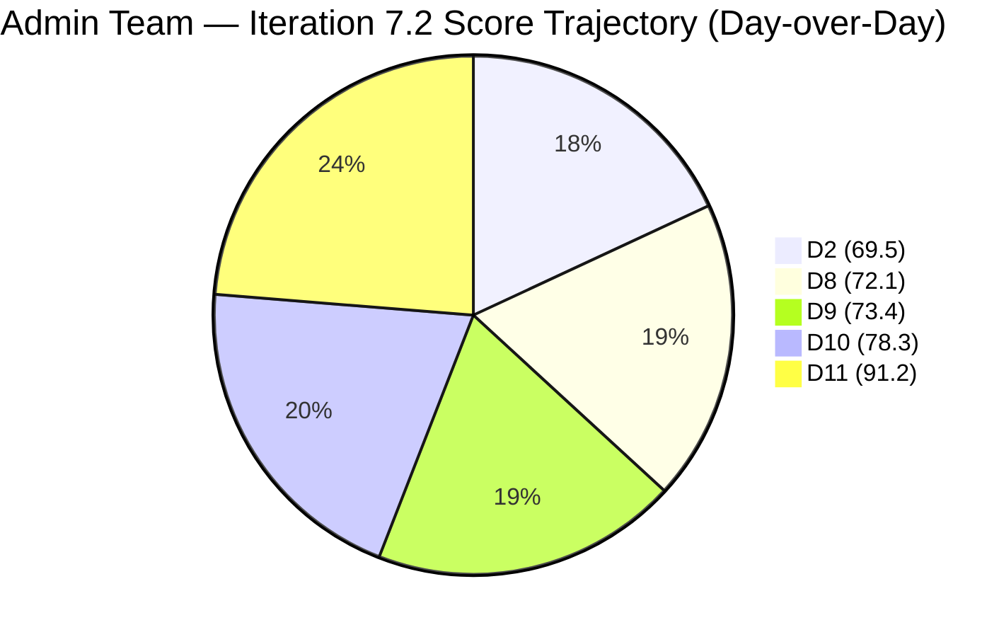
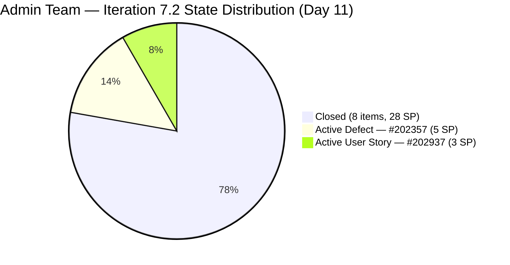
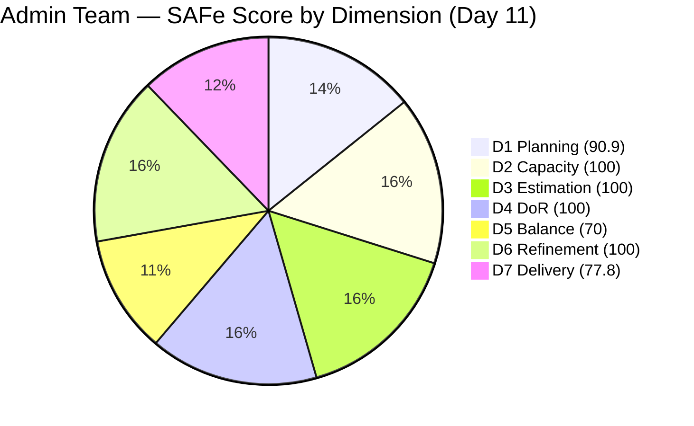

# ADO SAFe Iteration Audit — Administration Team

**Audit #44 | Iteration 7.2 (Apr 20 – May 3, 2026) | Day 11 of 14**

---

## 1. Audit Metadata

| Field | Value |
|---|---|
| **Audit Date** | April 30, 2026 — 09:03 UTC |
| **Auditor** | Claude Code (ADO SAFe Audit Agent) |
| **Workspace** | `ado_admin` |
| **ADO Project** | Jairosoft FINOPS (`e0bb302f-40f9-46c3-8164-6f1acb317d63`) |
| **Team** | Administration Team (`a38a9c02-07ab-483d-a1e3-aff54e19e603`) |
| **Iteration** | Iteration 7.2 — Apr 20 to May 3, 2026 |
| **Iteration ID** | `a9888bc5-48df-40dd-bcc8-6926a11aa7c7` |
| **Sprint Day** | Day 11 of 14 |
| **Prior Audit** | AUDIT_20260429_0204.md (Audit #43, 78.3 — Moderate Risk, PI7.2 Day 10) |
| **Scoring Model** | ADO SAFe v1 (7-dimension rubric) |
| **Overall Score** | **91.2 / 100** |
| **Risk Band** | **Low Risk** (≥ 80) |

> **Live ADO data confirmed.** 11 visible root backlog items in scope (Administration Team, `Microsoft.RequirementCategory`). 10 current iteration root items confirmed via `wit_get_work_items_for_iteration` (IterationPath = Iteration 7.2). Capacity and work item details confirmed via ADO batch APIs at 09:03 UTC April 30, 2026.

---

## 2. Executive Summary

The Administration Team achieves **91.2 / 100 — Low Risk**, crossing the Low Risk threshold for the first time this sprint with a **+12.9 improvement** over Audit #43 (78.3). This is the highest score recorded for this team during Iteration 7.2 and marks a decisive sprint-closing performance.

**Five closures confirmed since Audit #43 (02:04 UTC Apr 29):**

- **#202895** ("Government (EGOV) payables", 4 SP): Closed at 09:12 UTC Apr 29
- **#202939** ("Professional fee for IC", 2 SP): Closed at 09:09 UTC Apr 29
- **#202896** ("Payables - Internet for Davao and Cebu office", 5 SP): Closed at 08:18 UTC Apr 30
- **#202897** ("Utilities payables for Cebu and Davao", 4 SP): Closed at 08:19 UTC Apr 30
- **#202909** ("Davao Admin Adhoc Support April 20–May 3, 2026", 4 SP): Closed at 08:25 UTC Apr 30

Total closed SP: **28 of 36** (77.8%). Eight items are now Closed; two remain open — **#202357** (Defect, Active, 5 SP) and **#202937** (Solar vendor site visits, Active, 3 SP).

**Structural improvements confirmed today:**
- **#202357** updated at 02:29 UTC Apr 30 — untouched-current penalty eliminated; D6 now 100.0
- **#202366** (Philgeps renewal) moved to Iteration 7.3 — correctly re-scoped; now excluded from current sprint denominator
- Backlog API returns 11 items including #202366 (Iter 7.3); current iteration root = 10 items

With 3 days remaining, closing **#202937** (3 SP, Active) would push D7 to 86.1 and overall to approximately **92.0**. Closing the rooftop Defect **#202357** (5 SP) is the higher-value action.

---

## 3. Previous Audit Delta

| Dimension | Audit #43 (Apr 29, 02:04) | Audit #44 (Apr 30, 09:03) | Delta | Driver |
|---|---|---|---|---|
| Iteration Planning | 64.7 | **90.9** | **+26.2** | 5 closures + #202366 moved to 7.3; 10/11 in sprint |
| Team Capacity | 100.0 | 100.0 | 0.0 | Unchanged |
| Estimation | 100.0 | 100.0 | 0.0 | Unchanged |
| DoR Compliance | 100.0 | 100.0 | 0.0 | All 10 sprint items pass |
| Work Item Balance | 70.0 | 70.0 | 0.0 | 9 US + 1 Defect; composition unchanged |
| Backlog Refinement | 90.0 | **100.0** | **+10.0** | #202357 updated Apr 30 (untouched penalty removed) |
| Delivery Predictability | 23.1 | **77.8** | **+54.7** | 5 closures: #202895, #202939, #202896, #202897, #202909 (19 SP) |
| **Overall** | **78.3** | **91.2** | **+12.9** | Mass closure burst + D1/D6 structural improvements |

**ADO changes detected since Audit #43 (02:04 UTC Apr 29):**
- **#202895** ("Government (EGOV) payables", 4 SP): Ready → **Closed** at 09:12 UTC Apr 29
- **#202939** ("Professional fee for IC", 2 SP): Active → **Closed** at 09:09 UTC Apr 29
- **#202896** ("Payables - Internet for Davao and Cebu", 5 SP): Active → **Closed** at 08:18 UTC Apr 30
- **#202897** ("Utilities payables for Cebu and Davao", 4 SP): Active → **Closed** at 08:19 UTC Apr 30
- **#202909** ("Davao Admin Adhoc Support", 4 SP): Active → **Closed** at 08:25 UTC Apr 30
- **#202357** ("Fixation in rooftop (Davao)", Defect): Updated at 02:29 UTC Apr 30 — still Active; untouched penalty removed
- **#202366** ("Philgeps renewal for 2026"): Moved to **Iteration 7.3** at 08:21 UTC Apr 30 — re-scoped; no longer counted in Iter 7.2

### Score Trajectory — Iteration 7.2 Series

| Audit # | Date | Score | Band | Sprint Day |
|---|---|---|---|---|
| #33 | Apr 21 (Day 2) | 69.5 | Moderate | 7.2 D2 |
| #41 | Apr 27 (Day 8) | 72.1 | Moderate | 7.2 D8 |
| #42 | Apr 28 (Day 9) | 73.4 | Moderate | 7.2 D9 |
| #43 | Apr 29 (Day 10) | 78.3 | Moderate | 7.2 D10 |
| **#44** | **Apr 30 (Day 11)** | **91.2** | **Low Risk** | **7.2 D11** |

The team cleared the Low Risk threshold (80) for the first time this sprint, rising +21.7 since Day 8. The burst of closures on Apr 29–30 executed directly on Audit #43's top recommendations.

---

## 4. Current Iteration Snapshot

| Metric | Value |
|---|---|
| **Visible root backlog items** | 11 |
| **Current iteration root items (Iter 7.2)** | 10 |
| **#202366 status** | Re-scoped to Iter 7.3 at 08:21 Apr 30 |
| **Committed story points** | 36 SP |
| **Closed story points** | 28 SP |
| **Remaining open SP** | 8 SP (#202357 + #202937) |
| **Sprint progress** | Day 11 of 14 (79% elapsed) |
| **SP delivery rate** | 28 SP / 11 days = 2.5 SP/day |
| **SP needed per remaining day** | 8 SP / 3 days = 2.7 SP/day (achievable) |
| **Realistic projection** | ~32–36 SP closed by May 3 (dependent on site visit logistics) |
| **Team capacity per day** | 5 hrs/day (Mark: 1 Deploy + 2 Doc + 2 Req) |
| **Days off this sprint** | 0 |
| **Assignees on sprint items** | Mark Colina (sole contributor) |
| **Bus factor** | 1 — critical single-person dependency |

### State Distribution — Current Iteration Items

| State | Count | SP | Items |
|---|---|---|---|
| Closed | 8 | 28 | #202353, #202895, #202896, #202897, #202898, #202909, #202939, #202945 |
| Active | 1 | 5 | #202357 (Defect) |
| Active | 1 | 3 | #202937 (User Story) |
| **Total** | **10** | **36** | |

---

## 5. Work Item Analysis

### Current Iteration Root Items (10 items)

| ID | Title | Type | State | SP | DoR | AssignedTo | Changed |
|---|---|---|---|---|---|---|---|
| 202353 | JIT BFP certificate renewal 2026 | User Story | **Closed** | 3 | PASS | Mark Colina | Apr 29 |
| 202895 | Government (EGOV) payables | User Story | **Closed** | 4 | PASS | Mark Colina | **Apr 29** |
| 202896 | Payables - Internet for Davao and Cebu office | User Story | **Closed** | 5 | PASS | Mark Colina | **Apr 30** |
| 202897 | Utilities payables for Cebu and Davao | User Story | **Closed** | 4 | PASS | Mark Colina | **Apr 30** |
| 202898 | Condo dues (Cebu) payables | User Story | **Closed** | 3 | PASS | Mark Colina | Apr 29 |
| 202909 | Davao Admin Adhoc Support April 20–May 3, 2026 | User Story | **Closed** | 4 | PASS | Mark Colina | **Apr 30** |
| 202939 | Professional fee for IC | User Story | **Closed** | 2 | PASS | Mark Colina | **Apr 29** |
| 202945 | Grass cutting outside at the building | User Story | **Closed** | 3 | PASS | Mark Colina | Apr 29 |
| 202357 | Fixation in rooftop (Davao) | Defect | Active | 5 | PASS | Mark Colina | **Apr 30** |
| 202937 | 3 vendors site visit at Davao for Solar panel quotation | User Story | Active | 3 | PASS | Mark Colina | **Apr 30** |

> Note: #202357 title has a typo — "rooptop" in ADO; corrected to "rooftop" in this report.

### DoR Assessment

All 10 sprint items pass DoR (Description ≥30 non-whitespace chars + Acceptance Criteria ≥20 non-whitespace chars). Confirmed via ADO batch API. No DoR gaps exist for the current iteration.

### Re-scoped Item — #202366

| Field | Value |
|---|---|
| ID | 202366 |
| Title | Philgeps renewal for 2026 |
| Previous Iteration | Iteration 7.2 (carried from PI6) |
| New Iteration | **Iteration 7.3** (moved Apr 30, 08:21 UTC) |
| State | Active |
| SP | 3 |
| Impact | Excluded from Iter 7.2 scoring; visible in backlog but not a sprint item |

The re-scoping of #202366 to Iter 7.3 is appropriate. The PhilGEPS renewal work is multi-period and properly deferred. This reduced the current iteration denominator from 11 to 10.

### Unscoped PI7-Root Items (remaining outside sprint)

| ID | Title | SP | IterationPath | Changed |
|---|---|---|---|---|
| 193412 | Implementation of aircon repair 2nd floor | 2 | 2026-PI7 | Apr 17 |
| 197115 | Implementation of installing jockey pump | 4 | 2026-PI7 | Apr 17 |
| 197111 | Recanvass for Jockey pump materials needed | 1 | 2026-PI7 | Apr 17 |
| 192221 | Purchase additional Corrugated Sheet and installation Day 1 | 2 | 2026-PI7 | Apr 22 |
| 197023 | Installation of corrugated sheet at Fire Exit | 3 | 2026-PI7 | Apr 17 |
| 197029 | Implementation of Parking with roof for 2 vehicles (Day 1) | 3 | 2026-PI7 | Apr 17 |
| 197028 | Purchase materials at Houseman Hardware | 1 | 2026-PI7 | Apr 17 |
| 197113 | Purchase materials for Jockey pump | 1 | 2026-PI7 | Apr 17 |

These 8 items are in PI7-root with no iteration assigned. They should be scheduled to Iterations 7.3–7.6 during sprint planning.

---

## 6. SAFe Compliance Scorecard

| Dimension | Score | Evidence | Notes |
|---|---|---|---|
| D1 Iteration Planning | 90.9 | 10 / 11 visible backlog items in sprint | #202366 moved to Iter 7.3; now correctly unscoped from 7.2 |
| D2 Team Capacity | 100.0 | 1 / 1 contributor with capacity | Mark Colina, 5 hrs/day; 0 days off |
| D3 Estimation | 100.0 | 10 / 10 sprint items have SP > 0 | Full estimation hygiene maintained |
| D4 DoR Compliance | 100.0 | 10 / 10 sprint items pass Desc + AC check | All items have ≥30-char Desc and ≥20-char AC |
| D5 Work Item Balance | 70.0 | 9 US + 1 Defect; User Story = 90% | Has User Story ✓; dominant type >60% → -30 penalty |
| D6 Backlog Refinement | 100.0 | 11/11 fresh (all changed ≥ Apr 17); 0 untouched current | #202357 updated Apr 30; no stale or untouched penalties |
| D7 Delivery Predictability | 77.8 | 28 / 36 SP closed | 8 items closed; 2 active (8 SP remaining) |
| **Overall** | **91.2** | **(90.9+100+100+100+70+100+77.8)/7** | **Low Risk** |

---

## 7. Dimension Findings

### D1 — Iteration Planning (90.9 — improved from 64.7)

Strong improvement driven by two structural changes: (1) five items closed and exited the backlog denominator, and (2) #202366 correctly moved to Iteration 7.3, reducing the sprint item count from 11 to 10 while keeping the backlog at 11. The 10/11 ratio (90.9) represents near-optimal sprint planning for a team with this backlog size.

The sole gap: the backlog still carries one unscoped item (#202366 in Iter 7.3) and 8 PI7-root items with no iteration assignment. Scheduling these for future sprints (7.3–7.6) during the upcoming PI planning would drive D1 toward 100.0 in future iterations.

### D2 — Team Capacity (100.0)

Mark Colina's capacity remains fully configured: 5 hours/day (Deployment 1 + Documentation 2 + Requirements 2). Zero days off this sprint. No change from prior audits.

### D3 — Estimation (100.0)

All 10 sprint items carry Story Points. Estimation hygiene has been maintained throughout the sprint with no gaps. Consistent with the team's strongest recurring dimension.

### D4 — DoR Compliance (100.0)

All 10 current iteration root items pass the Definition of Ready check (Description ≥30 non-whitespace chars and Acceptance Criteria ≥20 non-whitespace chars). This dimension has held at 100.0 since Audit #43 when #202898 was documented before closure.

### D5 — Work Item Balance (70.0)

Nine User Stories and one Defect. User Stories represent 90.0% of sprint items — well above the 60% threshold that triggers the -30 dominant-type penalty. The team's operational nature (payables, compliance, facility tasks) naturally produces User Story work. Introducing at least one Enabler or Spike in future sprints would improve this dimension. The minimum bar to eliminate the penalty is reducing User Story share to ≤60%.

### D6 — Backlog Refinement (100.0 — improved from 90.0)

The untouched-current penalty (which applied because #202357 had not been touched since Apr 17, before sprint start) has been eliminated. Mark updated #202357 at 02:29 UTC Apr 30, moving the item's ChangedDate to after the sprint start (Apr 20). All 11 visible backlog items were changed within the last 45 days (since Mar 16). No stale_90 or stale_180 items. No untouched current items.

### D7 — Delivery Predictability (77.8 — improved from 23.1)

The most significant single-day improvement of the sprint: +54.7 points driven by five closures totaling 19 SP. The team is now at 77.8% delivery on committed SP, within striking distance of 80%+ delivery if either remaining item closes.

**Remaining items:**
- **#202357** ("Fixation in rooftop (Davao)", 5 SP): Active Defect updated Apr 30. If closed, D7 = round(33/36*100,1) = 91.7; overall ≈ 92.9
- **#202937** ("3 vendors site visit for Solar panel quotation", 3 SP): Active. Depends on vendor scheduling. If closed, D7 = round(31/36*100,1) = 86.1; overall ≈ 92.3
- **Both closed**: D7 = 100.0; overall ≈ 94.4

All three scenarios produce Low Risk outcomes. The sprint is in an excellent closing position.

---

## 8. Risks and Bottlenecks

| Risk | Severity | Status |
|---|---|---|
| #202357 (Rooftop fixation, 5 SP) still Active | Moderate | Updated Apr 30 but unresolved; physical construction work required |
| #202937 (Solar vendor site visits, 3 SP) still Active | Moderate | Vendor-dependent scheduling; field-logistics risk |
| 8 unscoped PI7-root items with no iteration assignment | Low | No sprint impact; must be scheduled for 7.3–7.6 in PI planning |
| Single contributor (Mark Colina) — bus factor 1 | High | Structural; unchanged; all work dependent on one person |
| Over-commitment pattern: 36 SP in 14-day sprint (single contributor) | Low | Improving; 28 SP already closed; pattern improving vs. Iter 7.1 |

---

## 9. Prioritized Recommendations

1. **[Today–Tomorrow] Close #202357 (Fixation in rooftop, 5 SP)** — This is the highest-SP open item. Updated today, suggesting active work. If installation work is complete, document completion and close. Closing this item raises D7 to 91.7 and overall to ~92.9.
2. **[Before sprint close] Follow up on #202937 (Solar vendor site visits, 3 SP)** — If all three vendors have visited, compile the quotations, confirm the AC criteria are met (3 vendors completed, all proposals received), and close. Both items closing delivers 100.0 D7 and overall ≈ 94.4.
3. **[Sprint close / PI planning] Schedule 8 unscoped PI7-root items** — Assign 193412, 197115, 197111, 192221, 197023, 197029, 197028, 197113 to Iterations 7.3–7.6. Prioritize by urgency (facility safety and infrastructure first).
4. **[PI 7.3 planning] Include one Enabler or Spike in Iter 7.3** — To reduce the -30 D5 penalty, introduce at least one Enabler (process improvement) or Spike (research/investigation) alongside User Story work. Even one Enabler brings User Story share from 90% to ~88%, but adding multiple non-story items would reduce it below 60%.
5. **[PI 8 planning] Address bus factor** — Mark Colina as sole contributor is the team's most persistent structural risk. Consider co-assigning a secondary team member for at least a subset of PI 8 work.

---

## 10. Evidence Gaps and Limitations

| Gap | Impact | Mitigation |
|---|---|---|
| #202357 title typo ("rooptop" in ADO) | Cosmetic; no scoring impact | Mark Colina should correct the title in ADO |
| #202366 moved to Iter 7.3 at 08:21 Apr 30 — reclassification affects D1 denominator | D1 improved from 64.7 to 90.9; reclassification is correct per scoring definitions | Per definition, current_iteration_root_items uses IterationPath = active iteration; confirmed |
| 8 unscoped PI7-root items: Description/AC not fetched | D4 denominator excludes them (not in current iteration) | Correct; no impact on current sprint scoring |
| #202937 closure depends on field activity (vendor site visits) | D7 will remain at 77.8 if vendors have not visited | Item is Active; monitor for same-day closure before May 3 |
