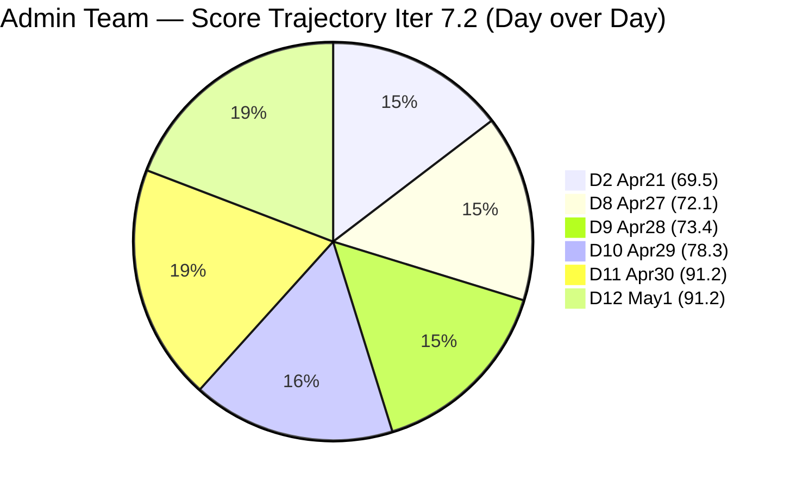
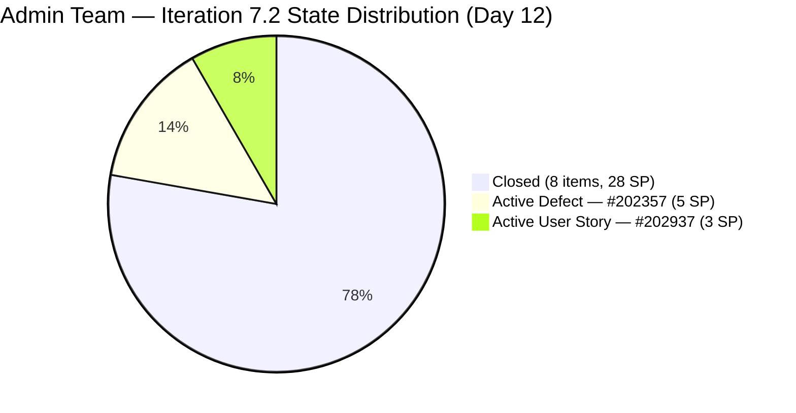
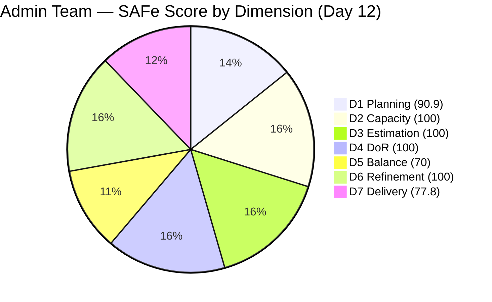

# ADO SAFe Iteration Audit — Administration Team

**Audit #45 | Iteration 7.2 (Apr 20 – May 3, 2026) | Day 12 of 14**

---

## 1. Audit Metadata

| Field | Value |
|---|---|
| **Audit Date** | May 1, 2026 — 09:03 UTC |
| **Auditor** | Claude Code (ADO SAFe Audit Agent) |
| **Workspace** | `ado_admin` |
| **ADO Project** | Jairosoft FINOPS (`e0bb302f-40f9-46c3-8164-6f1acb317d63`) |
| **Team** | Administration Team (`a38a9c02-07ab-483d-a1e3-aff54e19e603`) |
| **Iteration** | Iteration 7.2 — Apr 20 to May 3, 2026 |
| **Iteration ID** | `a9888bc5-48df-40dd-bcc8-6926a11aa7c7` |
| **Sprint Day** | Day 12 of 14 |
| **Prior Audit** | AUDIT_20260430_0903.md (Audit #44, 91.2 — Low Risk, PI7.2 Day 11) |
| **Scoring Model** | ADO SAFe v1 (7-dimension rubric) |
| **Overall Score** | **91.2 / 100** |
| **Risk Band** | **Low Risk** (≥ 80) |

> **Live ADO data confirmed.** 11 visible root backlog items in scope (Administration Team, `Microsoft.RequirementCategory`). 10 current iteration root items confirmed via `wit_get_work_items_for_iteration` (IterationPath = Iteration 7.2). Capacity and work item details confirmed via ADO batch APIs at 09:03 UTC May 1, 2026.

---

## 2. Executive Summary

The Administration Team holds at **91.2 / 100 — Low Risk** on Day 12 of Iteration 7.2, **unchanged from Audit #44** (91.2). No new closures have occurred since the Apr 29–30 burst. The sprint remains in excellent closing position with only 2 active items remaining.

**Current sprint position:**
- 8 of 10 sprint items Closed (28 of 36 SP = 77.8% delivery)
- **#202357** ("Fixation in rooftop (Davao)", Defect, 5 SP): Active — last changed Apr 30, 02:29 UTC. Physical construction work in progress.
- **#202937** ("3 vendors site visit at Davao for Solar panel quotation", User Story, 3 SP): Active — last changed Apr 30, 00:15 UTC. Vendor-dependent scheduling.

With 2 days remaining (May 2–3), closing **both** items delivers D7 = 100.0 and overall ≈ **94.4** (sprint ceiling). Closing only #202357 (5 SP) brings D7 = 91.7 and overall ≈ 92.9.

The team is on track to close Iteration 7.2 in Low Risk regardless of remaining closures, provided no regressions occur.

---

## 3. Previous Audit Delta

| Dimension | Audit #44 (Apr 30, 09:03) | Audit #45 (May 1, 09:03) | Delta | Driver |
|---|---|---|---|---|
| Iteration Planning | 90.9 | 90.9 | 0.0 | No change in backlog scope |
| Team Capacity | 100.0 | 100.0 | 0.0 | Unchanged |
| Estimation | 100.0 | 100.0 | 0.0 | Unchanged |
| DoR Compliance | 100.0 | 100.0 | 0.0 | All 10 sprint items pass |
| Work Item Balance | 70.0 | 70.0 | 0.0 | 9 US + 1 Defect; composition unchanged |
| Backlog Refinement | 100.0 | 100.0 | 0.0 | No new stale items; no new untouched |
| Delivery Predictability | 77.8 | 77.8 | 0.0 | No new closures since Apr 30 morning |
| **Overall** | **91.2** | **91.2** | **0.0** | Stable — sprint holding Low Risk |

**ADO changes detected since Audit #44 (09:03 UTC Apr 30):**
- **None confirmed.** #202357 and #202937 remain Active with no state transitions detected. Last changes remain Apr 30, 02:29 and Apr 30, 00:15 respectively.

### Score Trajectory — Iteration 7.2 Series

| Audit # | Date | Score | Band | Sprint Day |
|---|---|---|---|---|
| #33 | Apr 21 (Day 2) | 69.5 | Moderate | 7.2 D2 |
| #41 | Apr 27 (Day 8) | 72.1 | Moderate | 7.2 D8 |
| #42 | Apr 28 (Day 9) | 73.4 | Moderate | 7.2 D9 |
| #43 | Apr 29 (Day 10) | 78.3 | Moderate | 7.2 D10 |
| #44 | Apr 30 (Day 11) | 91.2 | Low Risk | 7.2 D11 |
| **#45** | **May 1 (Day 12)** | **91.2** | **Low Risk** | **7.2 D12** |

The team entered and is maintaining Low Risk territory. The plateau at 91.2 is expected — the only remaining improvement path is closing #202357 and/or #202937.

---

## 4. Current Iteration Snapshot

| Metric | Value |
|---|---|
| **Visible root backlog items** | 11 |
| **Current iteration root items (Iter 7.2)** | 10 |
| **Committed story points** | 36 SP |
| **Closed story points** | 28 SP |
| **Remaining open SP** | 8 SP (#202357 + #202937) |
| **Sprint progress** | Day 12 of 14 (86% elapsed) |
| **SP delivery rate** | 28 SP / 12 days = 2.3 SP/day |
| **SP needed per remaining day** | 8 SP / 2 days = 4.0 SP/day (aggressive but feasible) |
| **Realistic projection** | 28–36 SP closed by May 3 (logistics-dependent) |
| **Team capacity per day** | 5 hrs/day (Mark: 1 Deploy + 2 Doc + 2 Req) |
| **Days off this sprint** | 0 |
| **Assignees on sprint items** | Mark Colina (sole contributor) |
| **Bus factor** | 1 — critical single-person dependency |

### State Distribution — Current Iteration Items

| State | Count | SP | Items |
|---|---|---|---|
| Closed | 8 | 28 | #202353, #202895, #202896, #202897, #202898, #202909, #202939, #202945 |
| Active (Defect) | 1 | 5 | #202357 |
| Active (User Story) | 1 | 3 | #202937 |
| **Total** | **10** | **36** | |

---

## 5. Work Item Analysis

### Current Iteration Root Items (10 items)

| ID | Title | Type | State | SP | DoR | AssignedTo | Changed |
|---|---|---|---|---|---|---|---|
| 202353 | JIT BFP certificate renewal 2026 | User Story | **Closed** | 3 | PASS | Mark Colina | Apr 29 |
| 202895 | Government (EGOV) payables | User Story | **Closed** | 4 | PASS | Mark Colina | Apr 29 |
| 202896 | Payables - Internet for Davao and Cebu office | User Story | **Closed** | 5 | PASS | Mark Colina | Apr 30 |
| 202897 | Utilities payables for Cebu and Davao | User Story | **Closed** | 4 | PASS | Mark Colina | Apr 30 |
| 202898 | Condo dues (Cebu) payables | User Story | **Closed** | 3 | PASS | Mark Colina | Apr 29 |
| 202909 | Davao Admin Adhoc Support April 20–May 3, 2026 | User Story | **Closed** | 4 | PASS | Mark Colina | Apr 30 |
| 202939 | Professional fee for IC | User Story | **Closed** | 2 | PASS | Mark Colina | Apr 29 |
| 202945 | Grass cutting outside at the building | User Story | **Closed** | 3 | PASS | Mark Colina | Apr 29 |
| 202357 | Fixation in rooftop (Davao) [typo: "rooptop" in ADO] | Defect | Active | 5 | PASS | Mark Colina | Apr 30 |
| 202937 | 3 vendors site visit at Davao for Solar panel quotation | User Story | Active | 3 | PASS | Mark Colina | Apr 30 |

### DoR Assessment

All 10 sprint items pass DoR (Description ≥ 30 non-whitespace chars + Acceptance Criteria ≥ 20 non-whitespace chars). Confirmed via ADO batch API. No DoR gaps exist for the current iteration.

### Delivery Projection Scenarios

| Scenario | D7 | Overall | Band |
|---|---|---|---|
| Both items remain Active (current) | 77.8 | 91.2 | Low Risk |
| #202357 closes only (5 SP) | 91.7 | 92.9 | Low Risk |
| #202937 closes only (3 SP) | 86.1 | 92.3 | Low Risk |
| Both items close | 100.0 | 94.4 | Low Risk |

All four scenarios produce Low Risk outcomes. Sprint close is secured.

### Unscoped PI7-Root Items (outside sprint)

| ID | Title | SP | IterationPath | Changed |
|---|---|---|---|---|
| 193412 | Implementation of aircon repair 2nd floor | 2 | 2026-PI7 | Apr 17 |
| 197115 | Implementation of installing jockey pump | 4 | 2026-PI7 | Apr 17 |
| 197111 | Recanvass for Jockey pump materials needed | 1 | 2026-PI7 | Apr 17 |
| 192221 | Purchase additional Corrugated Sheet and installation Day 1 | 2 | 2026-PI7 | Apr 22 |
| 197023 | Installation of corrugated sheet at Fire Exit | 3 | 2026-PI7 | Apr 17 |
| 197029 | Implementation of Parking with roof for 2 vehicles (Day 1) | 3 | 2026-PI7 | Apr 17 |
| 197028 | Purchase materials at Houseman Hardware | 1 | 2026-PI7 | Apr 17 |
| 197113 | Purchase materials for Jockey pump | 1 | 2026-PI7 | Apr 17 |

These 8 items are in PI7-root with no iteration assigned. Schedule for Iterations 7.3–7.6 during sprint planning.

---

## 6. SAFe Compliance Scorecard

| Dimension | Score | Evidence | Notes |
|---|---|---|---|
| D1 Iteration Planning | 90.9 | 10 / 11 visible backlog items in sprint | #202366 in Iter 7.3; correctly excluded from sprint denominator |
| D2 Team Capacity | 100.0 | 1 / 1 contributor with positive capacity | Mark Colina, 5 hrs/day; 0 days off; fully configured |
| D3 Estimation | 100.0 | 10 / 10 sprint items have SP > 0 | Full estimation hygiene maintained all sprint |
| D4 DoR Compliance | 100.0 | 10 / 10 sprint items pass Desc + AC check | All items have ≥30-char Desc and ≥20-char AC |
| D5 Work Item Balance | 70.0 | 9 US + 1 Defect; User Story = 90% | Has User Story ✓; dominant type >60% → -30 penalty applied |
| D6 Backlog Refinement | 100.0 | 11/11 fresh (all changed ≥ Apr 17); 0 stale; 0 untouched | No stale_90 or stale_180; no untouched-current penalties |
| D7 Delivery Predictability | 77.8 | 28 / 36 SP closed | 8 items Closed; 2 Active (#202357 5 SP + #202937 3 SP = 8 SP open) |
| **Overall** | **91.2** | **(90.9+100+100+100+70+100+77.8)/7** | **Low Risk** |

---

## 7. Dimension Findings

### D1 — Iteration Planning (90.9 — unchanged)

Ten of 11 visible backlog items are in the sprint (90.9%). #202366 (Philgeps renewal) was correctly re-scoped to Iteration 7.3 on Apr 30. The remaining 8 PI7-root items have no iteration assignment and are not impacting this sprint's D1 score.

For Iteration 7.3, scheduling the 8 unscoped PI7-root items will drive D1 improvement in the next sprint.

### D2 — Team Capacity (100.0 — unchanged)

Mark Colina fully configured: 5 hours/day (Deployment 1 + Documentation 2 + Requirements 2). Zero days off. No change from prior audits. With 2 days remaining, ~10 hours of capacity remain.

### D3 — Estimation (100.0 — unchanged)

All 10 sprint items carry Story Points. Estimation hygiene has been maintained throughout the sprint without interruption.

### D4 — DoR Compliance (100.0 — unchanged)

All 10 current iteration root items pass the DoR check. This dimension has remained at 100.0 since early in the sprint, reflecting consistent item documentation standards.

### D5 — Work Item Balance (70.0 — unchanged)

Nine User Stories and one Defect. User Story share = 90.0%, well above the 60% threshold that triggers the -30 dominant-type penalty. The operational nature of the Admin team's work (payables, compliance, facility tasks) naturally skews toward User Story type. Introducing Enablers or Spikes in Iteration 7.3 (infrastructure improvements, process research) would reduce the penalty.

### D6 — Backlog Refinement (100.0 — unchanged)

All 11 visible backlog items have ChangedDates within the 45-day fresh window (Apr 17 or later). No stale_90, no stale_180 items. No untouched-current items (both #202357 and #202937 were updated Apr 30). The penalty-free score is maintained.

### D7 — Delivery Predictability (77.8 — unchanged)

No new closures since the Apr 29–30 burst. The 8-SP gap (two remaining active items) persists at Day 12. With 2 days remaining, both items are physically achievable:

- **#202357** (Fixation in rooftop, 5 SP): Physical construction work. If installation is complete and all inspection criteria are met (stability, waterproofing, cleanup), the item should be closed today.
- **#202937** (Solar vendor site visits, 3 SP): Requires 3 vendors to complete site visits and submit proposals. If all 3 visits have occurred, close this item.

The final sprint day push can reach 94.4 overall if both close.

---

## 8. Risks and Bottlenecks

| Risk | Severity | Status |
|---|---|---|
| #202357 (Rooftop fixation, 5 SP) still Active — now 31+ hours since last update | Moderate | Physical construction work; update needed to confirm progress |
| #202937 (Solar vendor site visits, 3 SP) still Active — now 33+ hours since last update | Moderate | Vendor scheduling risk; 2 days left to confirm all 3 vendors visited |
| Both items have not been touched since Apr 30 morning (>24 hrs silence) | Moderate | Mark should update both items with current status regardless of closure |
| 8 unscoped PI7-root items with no iteration assignment | Low | No sprint impact; must be scheduled for 7.3–7.6 |
| Single contributor (Mark Colina) — bus factor 1 | High | Structural; unchanged; all work dependent on one person |
| Sprint close May 3 = Sunday; confirm completion timing | Low | Unusual sprint end day; ensure Mark completes any pending closure before end-of-business May 2 |

---

## 9. Prioritized Recommendations

1. **[Today — Close #202357 (Fixation in rooftop, 5 SP)]** — This is the highest-SP open item and the highest-leverage action available. If rooftop installation work is complete, document final inspection and close immediately. Closing this alone raises D7 to 91.7 and overall to 92.9.
2. **[Today — Close #202937 (Solar vendor site visits, 3 SP)]** — If all 3 vendors have completed site visits and submitted proposals, compile the materials and close. Both items closing delivers D7 = 100.0, overall ≈ 94.4 — the sprint ceiling.
3. **[Update if not closing today]** — Even if physical work is not yet complete, Mark should post a progress comment on #202357 and #202937 today. Both items have been silent for >24 hours. Updating the ChangedDate helps maintain D6 discipline and gives visibility to stakeholders.
4. **[Sprint close / Iter 7.3 planning] Schedule 8 unscoped PI7-root items** — Assign 193412, 197115, 197111, 192221, 197023, 197029, 197028, 197113 to Iterations 7.3–7.6 during PI planning. Prioritize facility safety and infrastructure items first.
5. **[Iter 7.3 planning] Include at least one Enabler or Spike** — Reduce the D5 -30 penalty by introducing a non-User Story work item in the next sprint. An infrastructure improvement or process research Spike would lower User Story share below 60%.
6. **[PI 8 planning] Address bus factor** — Mark Colina as sole contributor is the team's most persistent structural risk. Consider co-assigning a secondary team member for at least a subset of PI 8 work.

---

## 10. Evidence Gaps and Limitations

| Gap | Impact | Mitigation |
|---|---|---|
| #202357 and #202937 not updated since Apr 30 (~09:03 UTC prior audit window) | D7 correctly held at 77.8; no false evidence of closure | Mark should post a progress comment today to re-confirm active work |
| #202357 title typo ("rooptop" in ADO) | Cosmetic; no scoring impact | Mark should correct the title in ADO |
| 8 unscoped PI7-root items: Description/AC not fetched | D4 denominator excludes them (not in current iteration); no scoring impact | Correct per definition; will need DoR review before sprint commitment |
| Sprint end date (May 3) falls on a Sunday | D7 closure window depends on Mark completing work before weekend shutdown | Confirm Monday May 4 is not the effective closure deadline |
