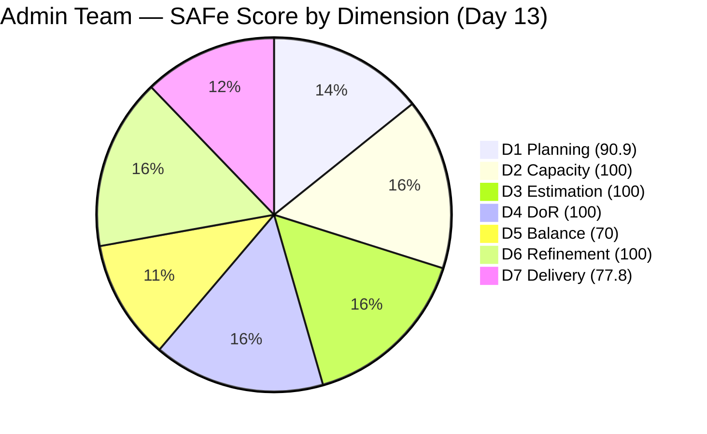
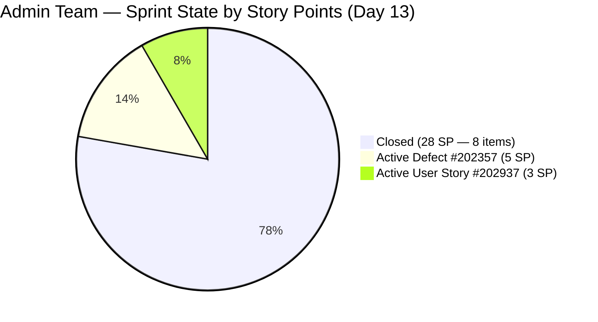

# ADO SAFe Iteration Audit — Administration Team

**Audit #46 | Iteration 7.2 (Apr 20 – May 3, 2026) | Day 13 of 14**

---

## 1. Audit Metadata

| Field | Value |
|---|---|
| **Audit Date** | May 2, 2026 — 09:02 UTC |
| **Auditor** | Claude Code (ADO SAFe Audit Agent) |
| **Workspace** | `ado_admin` |
| **ADO Project** | Jairosoft FINOPS (`e0bb302f-40f9-46c3-8164-6f1acb317d63`) |
| **Team** | Administration Team (`a38a9c02-07ab-483d-a1e3-aff54e19e603`) |
| **Iteration** | Iteration 7.2 — Apr 20 to May 3, 2026 |
| **Iteration ID** | `a9888bc5-48df-40dd-bcc8-6926a11aa7c7` |
| **Sprint Day** | Day 13 of 14 |
| **Prior Audit** | AUDIT_20260501_0903.md (Audit #45, 91.2 — Low Risk, PI7.2 Day 12) |
| **Scoring Model** | ADO SAFe v1 (7-dimension rubric) |
| **Overall Score** | **91.2 / 100** |
| **Risk Band** | **Low Risk** (≥ 80) |

> **Live ADO data confirmed.** 11 visible root backlog items in scope (Administration Team, `Microsoft.RequirementCategory`). 10 current iteration root items confirmed via `wit_get_work_items_for_iteration` (IterationPath = Iteration 7.2). Capacity and work item details confirmed via ADO batch APIs at 09:02 UTC May 2, 2026.

---

## 2. Executive Summary

The Administration Team holds at **91.2 / 100 — Low Risk** on Day 13 of Iteration 7.2, **unchanged from Audit #45** (91.2). This is the final full working day of the sprint (May 3 is a Sunday). No new closures have been detected since the Apr 29–30 burst.

**Critical — final day window:**
- **#202357** ("Fixation in rooptop (Davao)", Defect, 5 SP): Still Active. Last changed Apr 30, 02:29 UTC — now **48+ hours since last update**. Physical construction work. Today is the final opportunity to close before sprint end.
- **#202937** ("3 vendors to site visit at Davao office for Solar panel quotation", User Story, 3 SP): Still Active. Last changed Apr 30, 00:15 UTC — now **48+ hours since last update**. Vendor scheduling. Today is the final opportunity if all 3 vendor site visits have been completed.

**Sprint ceiling scenarios (final day):**
- Close both: D7 = 100.0; overall ≈ **94.4** (sprint maximum)
- Close #202357 only (5 SP): D7 = 91.7; overall ≈ **92.9**
- Close #202937 only (3 SP): D7 = 86.1; overall ≈ **92.3**
- Neither closes: D7 = 77.8; overall stays at **91.2**

All four scenarios end in Low Risk. The sprint close is secured regardless.

---

## 3. Previous Audit Delta

| Dimension | Audit #45 (May 1, 09:03) | Audit #46 (May 2, 09:02) | Delta | Driver |
|---|---|---|---|---|
| Iteration Planning | 90.9 | 90.9 | 0.0 | No change in backlog scope |
| Team Capacity | 100.0 | 100.0 | 0.0 | Unchanged |
| Estimation | 100.0 | 100.0 | 0.0 | Unchanged |
| DoR Compliance | 100.0 | 100.0 | 0.0 | All 10 sprint items pass |
| Work Item Balance | 70.0 | 70.0 | 0.0 | 9 US + 1 Defect; composition unchanged |
| Backlog Refinement | 100.0 | 100.0 | 0.0 | No new stale; no new untouched |
| Delivery Predictability | 77.8 | 77.8 | 0.0 | No new closures since Apr 30 morning |
| **Overall** | **91.2** | **91.2** | **0.0** | Stable at sprint close — Low Risk maintained |

**ADO changes detected since Audit #45 (09:03 UTC May 1):**
- **None confirmed.** #202357 and #202937 remain Active with no state transitions. Last changes remain Apr 30, 02:29 and Apr 30, 00:15 respectively. The sprint board is unchanged for 48+ hours on the two open items.

### Score Trajectory — Iteration 7.2 Series

| Audit # | Date | Score | Band | Sprint Day |
|---|---|---|---|---|
| #33 | Apr 21 (Day 2) | 69.5 | Moderate | 7.2 D2 |
| #41 | Apr 27 (Day 8) | 72.1 | Moderate | 7.2 D8 |
| #42 | Apr 28 (Day 9) | 73.4 | Moderate | 7.2 D9 |
| #43 | Apr 29 (Day 10) | 78.3 | Moderate | 7.2 D10 |
| #44 | Apr 30 (Day 11) | 91.2 | Low Risk | 7.2 D11 |
| #45 | May 1 (Day 12) | 91.2 | Low Risk | 7.2 D12 |
| **#46** | **May 2 (Day 13)** | **91.2** | **Low Risk** | **7.2 D13** |

The team entered Low Risk on Day 11 and has held the position for three consecutive audits. The sprint closes tomorrow (May 3 = Sunday). Today is the final working day.

---

## 4. Current Iteration Snapshot

| Metric | Value |
|---|---|
| **Visible root backlog items** | 11 |
| **Current iteration root items (Iter 7.2)** | 10 |
| **Committed story points** | 36 SP |
| **Closed story points** | 28 SP |
| **Remaining open SP** | 8 SP (#202357 + #202937) |
| **Sprint progress** | Day 13 of 14 (93% elapsed) |
| **Effective work window remaining** | Today (May 2) — final working day before Sunday close |
| **SP needed to hit 100% delivery** | 8 SP in 5 hrs capacity (5 hrs/day × 1 day) |
| **SP delivery rate (cumulative)** | 28 SP / 12 working days = 2.3 SP/day |
| **Team capacity per day** | 5 hrs/day (Mark: 1 Deploy + 2 Doc + 2 Req) |
| **Days off this sprint** | 0 |
| **Assignees on sprint items** | Mark Colina (sole contributor) |
| **Bus factor** | 1 — critical single-person dependency |

### State Distribution — Current Iteration Items

| State | Count | SP | Items |
|---|---|---|---|
| Closed | 8 | 28 | #202353, #202895, #202896, #202897, #202898, #202909, #202939, #202945 |
| Active (Defect) | 1 | 5 | #202357 |
| Active (User Story) | 1 | 3 | #202937 |
| **Total** | **10** | **36** | |

---

## 5. Work Item Analysis

### Current Iteration Root Items (10 items)

| ID | Title | Type | State | SP | DoR | AssignedTo | Changed | Silence |
|---|---|---|---|---|---|---|---|---|
| 202353 | JIT BFP certificate renewal 2026 | User Story | **Closed** | 3 | PASS | Mark Colina | Apr 29 | — |
| 202895 | Government (EGOV) payables | User Story | **Closed** | 4 | PASS | Mark Colina | Apr 29 | — |
| 202896 | Payables - Internet for Davao and Cebu office | User Story | **Closed** | 5 | PASS | Mark Colina | Apr 30 | — |
| 202897 | Utilities payables for Cebu and Davao | User Story | **Closed** | 4 | PASS | Mark Colina | Apr 30 | — |
| 202898 | Condo dues (Cebu) payables | User Story | **Closed** | 3 | PASS | Mark Colina | Apr 29 | — |
| 202909 | Davao Admin Adhoc Support Apr 20–May 3, 2026 | User Story | **Closed** | 4 | PASS | Mark Colina | Apr 30 | — |
| 202939 | Professional fee for IC | User Story | **Closed** | 2 | PASS | Mark Colina | Apr 29 | — |
| 202945 | Grass cutting outside at the building | User Story | **Closed** | 3 | PASS | Mark Colina | Apr 29 | — |
| 202357 | Fixation in rooptop (Davao) | Defect | **Active** | 5 | PASS | Mark Colina | Apr 30 | **48+ hrs** |
| 202937 | 3 vendors site visit at Davao for Solar panel quotation | User Story | **Active** | 3 | PASS | Mark Colina | Apr 30 | **48+ hrs** |

### DoR Assessment

All 10 sprint items pass DoR. Description and Acceptance Criteria both exceed minimum character thresholds on all items. No DoR gaps in the current sprint.

### Final Day Delivery Scenarios

| Scenario | Closed SP | D7 | Overall | Band |
|---|---|---|---|---|
| Current (both Active) | 28/36 | 77.8 | 91.2 | Low Risk |
| #202357 closes only (+5 SP) | 33/36 | 91.7 | 92.9 | Low Risk |
| #202937 closes only (+3 SP) | 31/36 | 86.1 | 92.3 | Low Risk |
| Both close (+8 SP) | 36/36 | 100.0 | 94.4 | Low Risk |

### Unscoped PI7-Root Items (outside current sprint)

| ID | SP | IterationPath | Last Changed |
|---|---|---|---|
| 193412 | 2 | 2026-PI7 | Apr 17 |
| 197115 | 4 | 2026-PI7 | Apr 17 |
| 197111 | 1 | 2026-PI7 | Apr 17 |
| 192221 | 2 | 2026-PI7 | Apr 22 |
| 197023 | 3 | 2026-PI7 | Apr 17 |
| 197029 | 3 | 2026-PI7 | Apr 17 |
| 197028 | 1 | 2026-PI7 | Apr 17 |
| 197113 | 1 | 2026-PI7 | Apr 17 |
| 202366 | — | Iter 7.3 | Apr 30 |

Eight items remain in PI7-root without iteration assignment. Must be scheduled for Iterations 7.3–7.6 during Iteration 7.3 Planning.

---

## 6. SAFe Compliance Scorecard

| Dimension | Score | Evidence | Notes |
|---|---|---|---|
| D1 Iteration Planning | 90.9 | 10 / 11 visible backlog items in sprint | #202366 scoped to Iter 7.3; 8 PI7-root items unscoped |
| D2 Team Capacity | 100.0 | 1 / 1 contributor with positive capacity | Mark Colina 5 hrs/day; 0 days off; fully configured |
| D3 Estimation | 100.0 | 10 / 10 sprint items have SP > 0 | Full estimation hygiene throughout sprint |
| D4 DoR Compliance | 100.0 | 10 / 10 sprint items pass Desc + AC check | All items meet ≥30-char Desc and ≥20-char AC |
| D5 Work Item Balance | 70.0 | 9 US + 1 Defect; User Story = 90% of sprint | Has User Story ✓; dominant type > 60% → -30 penalty |
| D6 Backlog Refinement | 100.0 | 11/11 visible items changed Apr 17 or later; 0 stale; 0 untouched | No stale_90, stale_180 items; both active items touched Apr 30 |
| D7 Delivery Predictability | 77.8 | 28 / 36 SP closed | 8 Closed; 2 Active (#202357 5SP + #202937 3SP) |
| **Overall** | **91.2** | **(90.9+100+100+100+70+100+77.8)/7** | **Low Risk** |

---

## 7. Dimension Findings

### D1 — Iteration Planning (90.9 — unchanged)

Ten of 11 visible backlog items are assigned to Iteration 7.2 (90.9%). Item #202366 (Philgeps renewal) is correctly scoped to Iteration 7.3. The 8 PI7-root items with no iteration assignment do not affect D1 denominator — only items appearing in the visible backlog API count. D1 will remain 90.9 for the sprint close.

### D2 — Team Capacity (100.0 — unchanged)

Mark Colina is fully configured: 5 hours/day (Deployment 1 + Documentation 2 + Requirements 2). Zero days off. Today is the final working day with approximately 5 hours of available capacity.

### D3 — Estimation (100.0 — unchanged)

All 10 sprint items carry Story Points. Estimation hygiene has been perfect throughout the entire sprint.

### D4 — DoR Compliance (100.0 — unchanged)

All 10 current iteration root items pass DoR. This dimension has been at 100.0 since early in the sprint. Consistent documentation standards throughout.

### D5 — Work Item Balance (70.0 — unchanged, structurally locked)

Nine User Stories and one Defect. User Story share = 90.0%, well above the 60% threshold that triggers the -30 dominant-type penalty. This is structurally locked for this sprint. For Iteration 7.3: introducing an Enabler or Spike alongside User Story work would reduce the penalty.

**Formula check:** 100 (base) - 30 (dominant_type_share > 60%) = 70. Has User Story ✓ (no -40 penalty). Spike share = 0% (no -20 penalty). Result = 70.

### D6 — Backlog Refinement (100.0 — unchanged)

All 11 visible backlog items have ChangedDates on or after Apr 17, well within the 45-day fresh window (cutoff: Mar 18, 2026). No stale_90 (no items unchanged since Feb 1), no stale_180 items. Both active current items (#202357 Apr 30, #202937 Apr 30) were updated after the sprint start date (Apr 20) — no untouched-current penalty. Score: 100.0.

**Refinement forward risk:** If #202357 and #202937 are not updated again by May 5, their Apr 30 ChangedDates will remain fresh through mid-June, well inside the 45-day window. No immediate D6 risk for Iter 7.3.

### D7 — Delivery Predictability (77.8 — unchanged, final day window)

No new closures since the Apr 29–30 burst. #202357 and #202937 have been silent for 48+ hours. Today (May 2) is the final working day. The two items totaling 8 SP are the only improvement levers.

- **#202357 (Fixation in rooftop, 5 SP):** Physical construction work. If rooftop structural reinforcement is complete, passed inspection, work area cleaned, and supervisor approved — close today. This is a 5-SP item that drives a +13.9 point D7 improvement.
- **#202937 (Solar vendor site visits, 3 SP):** If all three vendors have completed their site visits and submitted proposals — compile the materials and close today. With 3 SP, this adds +8.3 points to D7.

---

## 8. Risks and Bottlenecks

| Risk | Severity | Status |
|---|---|---|
| #202357 (Rooftop fixation, 5 SP) silent 48+ hrs — final working day | **High** | Physical construction; if complete, close today. If still in progress, confirm status with Mark. |
| #202937 (Solar vendor visits, 3 SP) silent 48+ hrs — final working day | **High** | Vendor-dependent; if all 3 visits done and proposals received, close today. |
| May 3 = Sunday sprint close; effective work window ends today (May 2) | **High** | Mark must close any completable items today. No recovery possible after today. |
| Single contributor (Mark Colina) — bus factor 1 | High | Structural; unchanged all sprint |
| 8 unscoped PI7-root items with no iteration assignment | Low | No current sprint impact; must be scheduled for Iter 7.3–7.6 |
| D5 capped at 70 — no Enabler/Spike in sprint | Low | Structural; resolved in Iter 7.3 planning |

---

## 9. Prioritized Recommendations

1. **[TODAY — CRITICAL] Close #202357 (Fixation in rooftop, Defect, 5 SP) if work is complete** — This is the final working day. If rooftop structural work is finished, all acceptance criteria are met (no gaps, no leaks, debris cleared, supervisor sign-off), and safety inspection is done — close the item immediately. D7 rises to 91.7; overall to 92.9.
2. **[TODAY — CRITICAL] Close #202937 (Solar vendor site visits, User Story, 3 SP) if visits are complete** — If all three vendor proposals have been received, compile them and close the item today. D7 rises to 86.1 (stand-alone) or 100.0 (if both items close); overall reaches up to 94.4.
3. **[TODAY] Update #202357 and #202937 even if not closing** — 48+ hours of silence. At minimum, Mark should post a status comment on both items today. Even if work is not yet complete, documenting current status protects the audit trail and confirms active engagement.
4. **[Iter 7.3 Sprint Planning] Schedule 8 unscoped PI7-root items** — Assign #193412, #197115, #197111, #192221, #197023, #197029, #197028, #197113 to Iterations 7.3–7.6. Prioritize safety and infrastructure items first. This will also improve D1 for Iter 7.3.
5. **[Iter 7.3 Planning] Include at least one Enabler or Spike** — Reduces the D5 -30 penalty. Even one non-User-Story item (Enabler, Spike, or Defect) when combined with ≤5 User Stories reduces the dominant-type share below 60%, eliminating the penalty.
6. **[PI 8 Planning] Address bus factor** — Mark Colina as the sole team member is the team's most persistent structural risk. Cross-training or co-assignment for a subset of PI 8 work should be planned.

---

## 10. Evidence Gaps and Limitations

| Gap | Impact | Mitigation |
|---|---|---|
| #202357 not updated since Apr 30, 02:29 UTC (48+ hrs) | D7 correctly reflects 28/36 SP; construction work status unknown | Mark must update or close today |
| #202937 not updated since Apr 30, 00:15 UTC (48+ hrs) | D7 correctly reflects 28/36 SP; vendor scheduling status unknown | Mark must update or close today |
| #202357 title typo in ADO ("rooptop" instead of "rooftop") | Cosmetic; no scoring impact | Mark should correct the title in ADO |
| 8 unscoped PI7-root items: Description/AC not individually fetched | D4 denominator correctly excludes them (not in current iteration) | No scoring impact this sprint; DoR review required before Iter 7.3 commitment |
| Sprint end May 3 = Sunday | Effective close window is today (May 2) | Mark should complete all possible closures before end of business today |
| D6 forward risk: Both active items last touched Apr 30; no update May 1 or May 2 | No D6 scoring impact this sprint (both within 45-day window) | Update today to maintain ADO hygiene and activity evidence |
