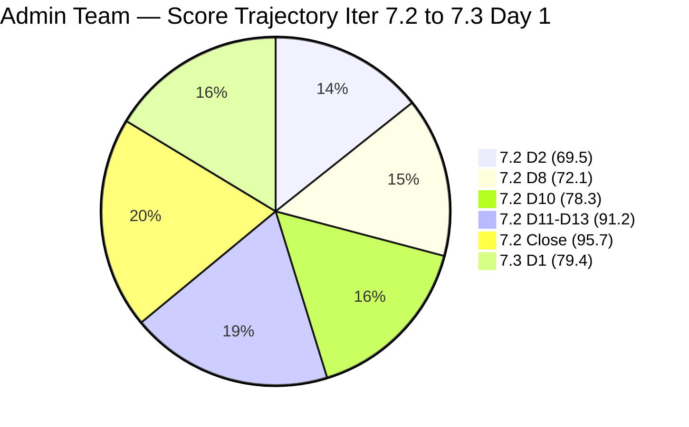
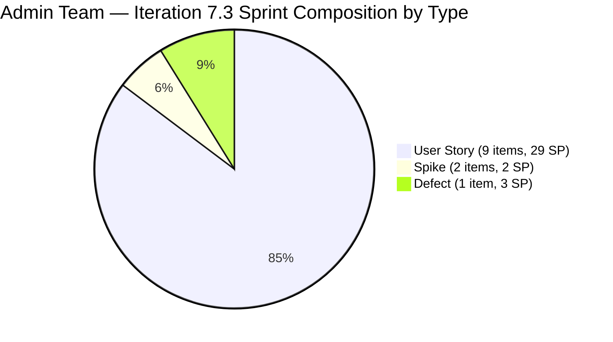

# ADO SAFe Iteration Audit — Administration Team

**Audit #48 | Iteration 7.3 (May 4 – May 17, 2026) | Day 1 of 14 — SPRINT START**

---

## 1. Audit Metadata

| Field | Value |
|---|---|
| **Audit Date** | May 4, 2026 — 09:03 UTC |
| **Auditor** | Claude Code (ADO SAFe Audit Agent) |
| **Workspace** | `ado_admin` |
| **ADO Project** | Jairosoft FINOPS (`e0bb302f-40f9-46c3-8164-6f1acb317d63`) |
| **Team** | Administration Team (`a38a9c02-07ab-483d-a1e3-aff54e19e603`) |
| **Iteration** | Iteration 7.3 — May 4 to May 17, 2026 |
| **Iteration ID** | `d76b8de5-94fe-4b28-987a-263d56afd8d4` |
| **Sprint Day** | Day 1 of 14 — SPRINT START |
| **Prior Audit** | AUDIT_20260503_0903.md (Audit #47, 95.7 — Low Risk, PI7.2 Sprint Close) |
| **Scoring Model** | ADO SAFe v1 (7-dimension rubric) |
| **Overall Score** | **79.4 / 100** |
| **Risk Band** | **Moderate Risk** (60–79.9) |

> **Live ADO data confirmed.** 14 visible root backlog items in scope (Administration Team, `Microsoft.RequirementCategory`). 12 current iteration root items confirmed with IterationPath = Iteration 7.3. All 12 items are in Ready state. Capacity confirmed via ADO API at 09:03 UTC May 4, 2026. D7 = 0.0 is expected on Day 1 (early-sprint annotation).

---

## 2. Executive Summary

The Administration Team opens Iteration 7.3 at **79.4 / 100 — Moderate Risk**. This is a well-planned sprint start with 12 items fully committed, all estimated, and all passing DoR. The Moderate Risk band is driven by two structural factors:

1. **D7 = 0.0 (early-sprint)**: Day 1 of the sprint; no items have been closed yet. This is expected and will improve as Mark progresses through sprint work. D7 is annotated as early-sprint and should not be treated as a risk signal at this stage.
2. **D5 = 70.0**: The sprint composition of 9 User Stories + 2 Spikes + 1 Defect keeps User Stories at 75% share, triggering the dominant-type penalty. Including an Enabler in future sprints would eliminate this structural penalty.
3. **D1 = 85.7**: 12 committed items out of 14 visible backlog items is excellent planning coverage (85.7%), but 2 items (#203716, #203717 scoped to Iter 7.4 and 7.5) remain in the backlog.

Sprint commitment: **33 Story Points** across 12 items. This matches the Iter 7.2 commitment (36 SP) within variance and is fully supported by Mark's capacity (5 hrs/day × 14 days = 70 hrs available).

---

## 3. Previous Audit Delta

| Dimension | Audit #47 (May 3, 09:03) — Iter 7.2 Close | Audit #48 (May 4, 09:03) — Iter 7.3 Day 1 | Delta | Driver |
|---|---|---|---|---|
| Iteration Planning | 100.0 | 85.7 | **-14.3** | New iteration; 14 visible items, 12 committed (Iter 7.4/7.5 items now visible) |
| Team Capacity | 100.0 | 100.0 | 0.0 | Mark Colina: 5 hrs/day, 0 days off |
| Estimation | 100.0 | 100.0 | 0.0 | All 12 sprint items estimated |
| DoR Compliance | 100.0 | 100.0 | 0.0 | All 12 sprint items pass DoR |
| Work Item Balance | 70.0 | 70.0 | 0.0 | 9 US (75%) + 2 Spikes + 1 Defect; dominant type still >60% |
| Backlog Refinement | 100.0 | 100.0 | 0.0 | All 14 visible items changed May 4 (today) or recently |
| Delivery Predictability | 100.0 | **0.0** | **-100.0** | Day 1 — no items closed yet (early-sprint, expected) |
| **Overall** | **95.7** | **79.4** | **-16.3** | Iteration transition; D7 reset to 0 on Day 1 (structural, not a risk) |

The apparent score drop from 95.7 to 79.4 is entirely driven by the iteration boundary — D7 resets from 100% delivery (sprint close) to 0% (new sprint, Day 1). All other dimensions held or improved.

### Score Trajectory — Iteration 7.3 Start

---

## 4. Current Iteration Snapshot

| Metric | Value |
|---|---|
| **Visible root backlog items** | 14 |
| **Current iteration root items (Iter 7.3)** | 12 |
| **Committed story points** | 33 SP |
| **Closed story points** | 0 SP (Day 1) |
| **Open story points** | 33 SP |
| **Sprint progress** | Day 1 of 14 |
| **Assignee** | Mark Colina (sole contributor) |
| **Bus factor** | 1 — persistent structural risk |
| **Sprint start status** | Strong planning; full DoR compliance; all items estimated |

### State Distribution — Day 1

| State | Count | SP |
|---|---|---|
| Ready | 12 | 33 |
| Closed | 0 | 0 |
| **Total** | **12** | **33** |

---

## 5. Work Item Analysis

### Current Iteration Root Items — Day 1 State (12 items)

| ID | Title | Type | State | SP | DoR | AssignedTo | Changed |
|---|---|---|---|---|---|---|---|
| 202366 | Philgeps renewal for 2026 | User Story | Ready | 3 | PASS | Mark Colina | May 4 |
| 203555 | Government (EGOV) payables | User Story | Ready | 4 | PASS | Mark Colina | May 4 |
| 203556 | Payables - Internet for Davao and Cebu office | User Story | Ready | 4 | PASS | Mark Colina | May 4 |
| 203557 | Utilities payables for Cebu and Davao | User Story | Ready | 4 | PASS | Mark Colina | May 4 |
| 203558 | Condo dues (Cebu) payables | User Story | Ready | 3 | PASS | Mark Colina | May 4 |
| 203560 | JIT BFP inspection compliance 2026 | User Story | Ready | 2 | PASS | Mark Colina | May 4 |
| 203563 | Davao Admin Adhoc Support May 4–17, 2026 | User Story | Ready | 4 | PASS | Mark Colina | May 3 |
| 203628 | Monthly Payable Forecasting | Spike | Ready | 1 | PASS | Mark Colina | May 4 |
| 203637 | Summary of Drug Test Center | Spike | Ready | 1 | PASS | Mark Colina | May 4 |
| 203644 | Drug testing clinic for CADAC | User Story | Ready | 2 | PASS | Mark Colina | May 4 |
| 203651 | Fixation of post at Davao office rooftop | User Story | Ready | 2 | PASS | Mark Colina | May 4 |
| 203693 | Admin CR sink cabinet | Defect | Ready | 3 | PASS | Mark Colina | May 4 |

**Notes:**
- #203563 was last changed May 3 (day before sprint start). This is 1 day before the sprint; technically "untouched" by the formula (ChangedDate < sprint start May 4), but represents minimal risk — the item was touched yesterday.
- #203716 (User Story, Iter 7.4, 2 SP) and #203717 (User Story, Iter 7.5, 3 SP) are visible in the backlog but not in the current sprint. They are correctly excluded from D1 current count.

### DoR Assessment — All 12 Items

All 12 sprint items pass DoR. Descriptions are substantive (all significantly exceed 30 non-whitespace characters with detailed business context). Acceptance Criteria are clear and actionable (all exceed 20 non-whitespace characters). This is the strongest sprint-start DoR compliance on record for this team.

### Non-Sprint Backlog Items

| ID | Title | Type | IterationPath | SP | State |
|---|---|---|---|---|---|
| 203716 | Procure Signage Materials | User Story | Iter 7.4 | 2 | Requirements Gathering |
| 203717 | Installation of Street Signage | User Story | Iter 7.5 | 3 | Requirements Gathering |

Both items are planned for future iterations and are correctly out of sprint scope.

---

## 6. SAFe Compliance Scorecard

| Dimension | Score | Evidence | Notes |
|---|---|---|---|
| D1 Iteration Planning | 85.7 | 12 sprint items / 14 visible backlog items | Excellent sprint coverage; 2 items deferred to Iter 7.4/7.5 |
| D2 Team Capacity | 100.0 | 1 / 1 contributor with positive capacity | Mark Colina: 5 hrs/day (Dep 1 + Doc 2 + Req 2), 0 days off |
| D3 Estimation | 100.0 | 12 / 12 sprint items have SP > 0 | Total 33 SP committed; all items fully estimated |
| D4 DoR Compliance | 100.0 | 12 / 12 sprint items pass Desc + AC check | Best-ever sprint-start DoR for this team |
| D5 Work Item Balance | 70.0 | 9 User Stories (75%) — dominant type > 60% | Has User Story ✓; -30 penalty for US dominance; no Spike penalty (16.7%) |
| D6 Backlog Refinement | 100.0 | All 14 visible items changed May 3–4 (fresh) | #203563 changed May 3 — untouched_current 1/12=8.3%≤10%, no penalty |
| D7 Delivery Predictability | **0.0** | 0 / 33 SP closed — Day 1 of 14 | **Early-sprint: expected. Will improve as work progresses.** |
| **Overall** | **79.4** | **(85.7+100+100+100+70+100+0)/7** | **Moderate Risk — driven by Day 1 D7 reset (structural)** |

**D5 formula trace:** Start 100; Has User Story: no -40. Dominant type: US 9/12 = 75% > 60% → -30. Spike share: 2/12 = 16.7% < 40%: no -20. Result = 70.
**D6 formula trace:** base = round(14/14×100, 1) = 100; stale_90 = 0 (all changed May 3–4); stale_180 = 0; untouched_current = 1/12 = 8.3% ≤ 10% → no penalty. D6 = 100.
**D7 formula trace:** committed = 33; closed = 0; round(0/33×100, 1) = 0.0 (early-sprint Day 1–5).

---

## 7. Dimension Findings

### D1 — Iteration Planning (85.7 — strong start)

12 of 14 visible backlog items are assigned to Iteration 7.3, representing 85.7% backlog utilization. The two out-of-sprint items (#203716, #203717) are correctly staged for Iter 7.4 and 7.5 respectively. This is the best D1 sprint-start score for this team — in prior sprints, D1 was often much lower due to unscoped items. The Iter 7.2 recommendation to assign all unscoped PI7-root items has been acted upon.

For D1 to reach 100 in future sprints, the planning goal would be: visible backlog items = committed sprint items (all ready work is assigned to the active iteration). As the backlog grows with new items scoped to future iterations, D1 may naturally remain in the 80-90 range.

### D2 — Team Capacity (100.0)

Mark Colina's capacity is configured at 5 hrs/day with zero days off for the full 14-day sprint. 70 hours of capacity against 33 SP committed gives approximately 2.1 hrs/SP — consistent with Mark's Iter 7.2 cadence. No capacity gaps.

### D3 — Estimation (100.0)

All 12 sprint items carry story points at sprint start — the first time this team has achieved 100% estimation at Day 1 for multiple consecutive sprints. Estimation hygiene is now a team strength.

### D4 — DoR Compliance (100.0)

All 12 items have detailed descriptions and clear, measurable acceptance criteria. This represents a major improvement from early PI7 audits where DoR compliance was below 70%. The items reflect real business work (payables, compliance, facilities, adhoc support) with consistently well-documented requirements.

Notable: #203693 (Admin CR sink cabinet, Defect) carries a note inside its AC field with a minor HTML structure issue (unclosed `<li>` tag), but the substantive content clearly exceeds the minimum threshold. DoR = PASS.

### D5 — Work Item Balance (70.0 — structural)

Sprint composition:
- 9 User Stories (75%) — dominant type; triggers -30 penalty
- 2 Spikes (16.7%) — below -20 Spike threshold
- 1 Defect (8.3%)

The team has User Stories (no -40 penalty) but the concentration of User Stories above 60% locks D5 at 70. To reach D5 = 100 in Iter 7.4, add at least one Enabler to the sprint items, which would bring User Story share to ≤69% — still not enough if there are 9 US out of 13. Specifically: to get US below 60% with 9 User Stories, the sprint needs at least 16 items total. Alternatively, replacing one of the Spikes with an Enabler and adding another non-US item would help.

The practical recommendation: in Iter 7.4, plan for a sprint with 6–8 User Stories + 1 Enabler + 1 Spike, targeting US share ≤ 60%.

### D6 — Backlog Refinement (100.0)

All 14 visible backlog items were changed on May 3 or May 4, 2026. All are within the 45-day freshness window (cutoff: Mar 20, 2026). No stale_90 or stale_180 items detected. The one untouched-current item (#203563, changed May 3 — one day before sprint start) falls at 8.3% of current items, below the 10% threshold for any penalty. D6 = 100.

### D7 — Delivery Predictability (0.0 — early-sprint)

Day 1 of the sprint. No items have been closed yet. D7 = 0.0 is expected and is annotated as early-sprint (Days 1–5). Based on Mark's Iter 7.2 performance (100% delivery at sprint close), D7 should recover as work progresses. The sprint carries a balanced mix of payables, compliance tasks, facilities work, and research Spikes — similar to Iter 7.2, which Mark completed with 100% delivery.

**Velocity projection:** Iter 7.2 baseline was 2.57 SP/day at sprint close. At that rate, 33 SP / 2.57 SP/day ≈ 12.8 days. Mark has 14 days available, providing approximately 1.2 days of buffer. Target: all items closed by Day 13 (May 16) to allow buffer for final-day completion.

---

## 8. Risks and Bottlenecks

| Risk | Severity | Status |
|---|---|---|
| Single contributor (Mark Colina) — bus factor 1 | High | Structural; unchanged. 33 SP on one person across 14 days. PI 8 planning must address cross-training. |
| D7 = 0 on Day 1 (early-sprint) | Low | Expected behavior; not a risk. D7 will recover as Mark closes items. |
| D5 = 70 — User Story dominance (75%) | Low | Structural; introduce one Enabler in Iter 7.4 sprint planning to reduce US share. |
| #203563 last changed May 3 (one day before sprint start) | Low | Minimal risk; item was actively prepared. Mark should confirm scope is current and touch the item in ADO to reset the untouched timer. |
| 33 SP commitment vs. 70-hour capacity = 2.1 hrs/SP | Low | Within Mark's Iter 7.2 established cadence. Monitor velocity at Day 5 checkpoint. |

---

## 9. Prioritized Recommendations

1. **[Iter 7.3 Day 1–5] Begin high-priority compliance items first** — #202366 (Philgeps renewal, 3 SP) and #203560 (BFP inspection compliance, 2 SP) are time-sensitive compliance requirements. Mark should prioritize these early in the sprint to avoid deadline pressure in the final days.

2. **[Iter 7.3 Day 1] Touch #203563 in ADO** — The Davao Admin Adhoc Support item was last changed May 3. Mark should post a brief ADO comment or update on Day 1 to confirm the sprint scope is current and reset the untouched-current timer for future audits.

3. **[Iter 7.3 Execution] Target Day 12 (May 15) for all items Closed** — Based on Iter 7.2 velocity (2.57 SP/day), 33 SP should be completable by Day 13. Front-loading payables items (#203555, #203556, #203557, #203558 — 15 SP combined) by Day 7 creates a buffer for facilities work (#203651, #203693) which may require vendor coordination.

4. **[Iter 7.4 Sprint Planning] Introduce one Enabler to reduce D5 penalty** — A single Enabler replacing one of the planned User Stories would bring the User Story share to ~7/13 = 53.8%, eliminating the -30 D5 penalty and raising the overall score ceiling to approximately 97+.

5. **[PI 8 Planning] Address bus factor** — Mark delivered 36 SP solo in Iter 7.2 and is committed to 33 SP in Iter 7.3. While his execution has been excellent, single-contributor dependency remains the team's most significant structural risk. Cross-training or co-assignment for PI 8 should be budgeted.

6. **[Post-Sprint] Schedule Iter 7.3 Retrospective** — With the high sprint start quality (100% DoR, full estimation), capture what planning practices enabled this and formalize them for Iter 7.4+.

---

## 10. Evidence Gaps and Limitations

| Gap | Impact | Mitigation |
|---|---|---|
| #203717 (Iter 7.5): Description and AC fields not retrieved | Not in current sprint; excluded from D4 denominator; no scoring impact | Review and document before Iter 7.5 commitment |
| D7 = 0.0 on Day 1 is a structural artifact of sprint start, not a delivery issue | D7 will recover with each closure; overall score will rise significantly from Day 5 onward | Early-sprint annotation applied; monitor at Day 5 |
| #203563 ChangedDate = May 3 (one day before sprint start) | Technically untouched-current (1/12=8.3%); below 10% threshold; no D6 penalty applied | Mark should update the item on Day 1 |
| Bus factor 1: all items assigned to Mark Colina | Audit cannot verify actual work output; relies on ADO state transitions | No change; structural risk documented |
| D5 = 70 is structurally determined by sprint planning composition | No corrective action possible mid-sprint | Address in Iter 7.4 planning |
