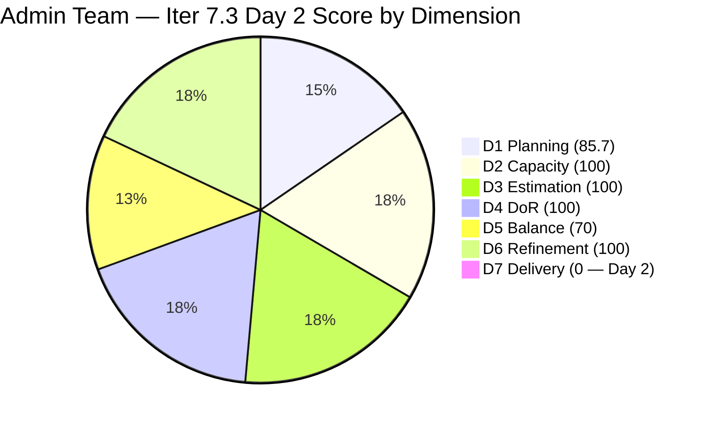
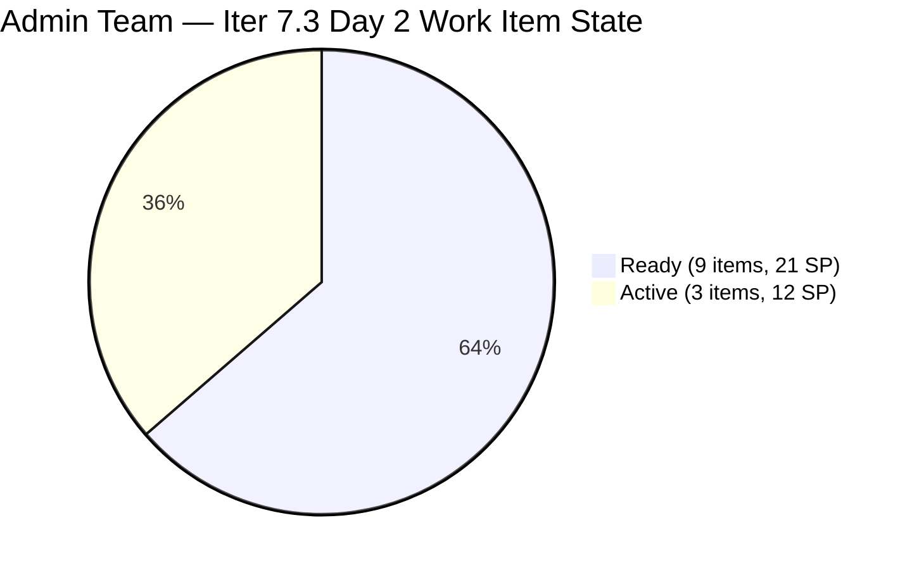

# ADO SAFe Iteration Audit — Administration Team

**Audit #49 | Iteration 7.3 (May 4 – May 17, 2026) | Day 2 of 14**

---

## 1. Audit Metadata

| Field | Value |
|---|---|
| **Audit Date** | May 5, 2026 — 09:02 UTC |
| **Auditor** | Claude Code (ADO SAFe Audit Agent) |
| **Workspace** | `ado_admin` |
| **ADO Project** | Jairosoft FINOPS (`e0bb302f-40f9-46c3-8164-6f1acb317d63`) |
| **Team** | Administration Team (`a38a9c02-07ab-483d-a1e3-aff54e19e603`) |
| **Iteration** | Iteration 7.3 — May 4 to May 17, 2026 |
| **Iteration ID** | `d76b8de5-94fe-4b28-987a-263d56afd8d4` |
| **Sprint Day** | Day 2 of 14 |
| **Prior Audit** | AUDIT_20260504_0903.md (Audit #48, 79.4 — Moderate Risk, Iter 7.3 Day 1) |
| **Scoring Model** | ADO SAFe v1 (7-dimension rubric) |
| **Overall Score** | **79.4 / 100** |
| **Risk Band** | **Moderate Risk** (60–79.9) |

> **Live ADO data confirmed.** 14 visible root backlog items (Administration Team, `Microsoft.RequirementCategory`). 12 current iteration root items confirmed (IterationPath = Iteration 7.3). #203709 (Task) is a child item and excluded from root scoring. 3 items (203556, 203557, 203563) transitioned from Ready → Active since Day 1. Capacity unchanged. D7 = 0.0 expected on Day 2 (early-sprint, Days 1–5). Score is stable at 79.4 — identical to Day 1 as no items have been closed yet.

---

## 2. Executive Summary

The Administration Team holds at **79.4 / 100 — Moderate Risk** on Day 2 of Iteration 7.3. The score is structurally identical to Day 1 — no items have closed yet (D7 = 0.0, expected for Day 2) and the underlying planning quality (D1–D6) is unchanged.

**Positive signal since Day 1:** Three items moved to Active on May 5, indicating Mark has begun sprint work:
- **#203556** (Payables — Internet for Davao and Cebu, 4 SP) → Active at 08:47 UTC
- **#203557** (Utilities payables for Cebu and Davao, 4 SP) → Active at 08:44 UTC
- **#203563** (Davao Admin Adhoc Support, 4 SP) → Active at 08:51 UTC

**12 SP now In-Progress** (3 items Active). Based on Mark's Iter 7.2 velocity (2.57 SP/day), the team is on track to begin closing items before the Day 5 early-sprint window ends.

**Structural issue (unchanged):** D5 = 70.0 due to User Story dominance (75%). This is a planning-level issue that cannot be resolved mid-sprint. The team should plan to reduce US dominance in Iter 7.4.

---

## 3. Previous Audit Delta

| Dimension | Audit #48 (May 4) — Iter 7.3 Day 1 | Audit #49 (May 5) — Iter 7.3 Day 2 | Delta | Driver |
|---|---|---|---|---|
| Iteration Planning | 85.7 | 85.7 | 0.0 | No change — 12/14 items committed |
| Team Capacity | 100.0 | 100.0 | 0.0 | Mark Colina: 5 hrs/day, 0 days off |
| Estimation | 100.0 | 100.0 | 0.0 | All 12 sprint items estimated |
| DoR Compliance | 100.0 | 100.0 | 0.0 | All 12 sprint items pass DoR |
| Work Item Balance | 70.0 | 70.0 | 0.0 | US dominance 75% structural |
| Backlog Refinement | 100.0 | 100.0 | 0.0 | All items fresh (changed May 4–5) |
| Delivery Predictability | 0.0 | **0.0** | 0.0 | Day 2 — no closures yet (early-sprint) |
| **Overall** | **79.4** | **79.4** | **0.0** | Stable — day 2 is structurally identical to day 1 |

Score held steady. The three Active transitions (#203556, #203557, #203563) confirm Mark is executing but no closures have occurred yet.

### Score Trend — Iteration 7.3

| Audit | Overall | Risk Band |
|---|---|---|
| 7.2 Close (May 3) | 95.7 | Low |
| 7.3 Day 1 (May 4) | 79.4 | Moderate |
| 7.3 Day 2 (May 5) | 79.4 | Moderate |

---

## 4. Current Iteration Snapshot

| Metric | Value |
|---|---|
| **Visible root backlog items** | 14 |
| **Current iteration root items (Iter 7.3)** | 12 |
| **Committed story points** | 33 SP |
| **Active story points** | 12 SP (3 items in progress) |
| **Closed story points** | 0 SP (Day 2) |
| **Sprint progress** | Day 2 of 14 — execution underway |
| **Assignee** | Mark Colina (sole contributor) |
| **Bus factor** | 1 — persistent structural risk |
| **Sprint activity** | 3 items transitioned to Active on May 5 |

### State Distribution — Day 2

| State | Count | SP |
|---|---|---|
| Ready | 9 | 21 |
| Active | 3 | 12 |
| Closed | 0 | 0 |
| **Total** | **12** | **33** |

---

## 5. Work Item Analysis

### Current Iteration Root Items — Day 2 State (12 items)

| ID | Title | Type | State | SP | DoR | AssignedTo | Changed |
|---|---|---|---|---|---|---|---|
| 202366 | Philgeps renewal for 2026 | User Story | Ready | 3 | PASS | Mark Colina | May 4 |
| 203555 | Government (EGOV) payables | User Story | Ready | 4 | PASS | Mark Colina | May 4 |
| **203556** | **Payables — Internet for Davao and Cebu office** | **User Story** | **Active** | 4 | PASS | Mark Colina | **May 5** |
| **203557** | **Utilities payables for Cebu and Davao** | **User Story** | **Active** | 4 | PASS | Mark Colina | **May 5** |
| 203558 | Condo dues (Cebu) payables | User Story | Ready | 3 | PASS | Mark Colina | May 4 |
| 203560 | JIT BFP inspection compliance 2026 | User Story | Ready | 2 | PASS | Mark Colina | May 4 |
| **203563** | **Davao Admin Adhoc Support May 4–17, 2026** | **User Story** | **Active** | 4 | PASS | Mark Colina | **May 5** |
| 203628 | Monthly Payable Forecasting | Spike | Ready | 1 | PASS | Mark Colina | May 4 |
| 203637 | Summary of Drug Test Center | Spike | Ready | 1 | PASS | Mark Colina | May 4 |
| 203644 | Drug testing clinic for CADAC | User Story | Ready | 2 | PASS | Mark Colina | May 4 |
| 203651 | Fixation of post at Davao office rooftop | User Story | Ready | 2 | PASS | Mark Colina | May 4 |
| 203693 | Admin CR sink cabinet | Defect | Ready | 3 | PASS | Mark Colina | May 5 |

**Active items note:** #203556 and #203557 are utility/internet payables — appropriate to work simultaneously as both involve similar billing processes. #203563 (Adhoc Support) is the sprint's standing support story. #203693 updated May 5 (likely a comment or task update) but still Ready.

### Non-Sprint Backlog Items (correctly deferred)

| ID | Title | Type | IterationPath | SP | State |
|---|---|---|---|---|---|
| 203716 | Procure Signage Materials | User Story | Iter 7.4 | 2 | Requirements Gathering |
| 203717 | Installation of Street Signage | User Story | Iter 7.5 | 3 | Requirements Gathering |

Both items were touched May 5 (203716 at 01:02, 203717 at 00:59), suggesting Mark is actively managing future-iteration planning alongside sprint execution.

### DoR Assessment — All 12 Sprint Items

All 12 items pass DoR. Descriptions are detailed and business-contextual. Acceptance Criteria are clear and measurable. No change from Day 1 DoR status.

---

## 6. SAFe Compliance Scorecard

| Dimension | Score | Evidence | Notes |
|---|---|---|---|
| D1 Iteration Planning | 85.7 | 12 sprint items / 14 visible backlog items | 2 items correctly deferred to Iter 7.4/7.5 |
| D2 Team Capacity | 100.0 | 1 / 1 contributor with positive capacity | Mark: 5 hrs/day (Dep 1 + Doc 2 + Req 2), 0 days off |
| D3 Estimation | 100.0 | 12 / 12 sprint items have SP > 0 | All items estimated at sprint start |
| D4 DoR Compliance | 100.0 | 12 / 12 sprint items pass Desc + AC check | Strong descriptions and measurable AC throughout |
| D5 Work Item Balance | 70.0 | 9 User Stories (75%) — dominant type > 60% | Has User Story ✓; -30 dominant-type penalty; Spike 16.7% < 40% ✓ |
| D6 Backlog Refinement | 100.0 | All 14 visible items changed May 4–5 | untouched_current = 0/12 = 0%; no stale items |
| D7 Delivery Predictability | **0.0** | 0 / 33 SP closed — Day 2 of 14 | **Early-sprint (Days 1–5). 3 items Active. Expected.** |
| **Overall** | **79.4** | **(85.7+100+100+100+70+100+0)/7** | **Moderate Risk — driven by Day 2 D7=0 (structural)** |

**D1:** round(12/14×100, 1) = 85.7
**D5 trace:** Start 100; US present (no -40); US 9/12=75%>60% → -30; Spike 2/12=16.7%<40% (no -20). D5=70.
**D6 trace:** base=100; stale_90=0; stale_180=0; untouched_current=0/12=0% (all items changed ≥May 4 00:00 UTC). D6=100.
**D7 trace:** committed=33 SP; closed=0 SP; D7=0.0. Early-sprint annotation Days 1–5.

---

## 7. Dimension Findings

### D1 — Iteration Planning (85.7 — strong, stable)

12 of 14 visible backlog items committed to Iter 7.3. No change from Day 1. The 2 deferred items (#203716 Iter7.4, #203717 Iter7.5) are both actively being refined — both were touched May 5, indicating Mark is conducting proactive future-sprint preparation during Iter 7.3 execution. This is excellent planning discipline.

### D2 — Team Capacity (100.0)

Mark Colina: 5 hrs/day, 0 days off. Capacity unchanged and confirmed via ADO API. 70 hours of total capacity against 33 SP committed = 2.12 hrs/SP. Consistent with Iter 7.2 cadence.

### D3 — Estimation (100.0)

All 12 sprint items have story points. No change. Estimation hygiene remains a team strength.

### D4 — DoR Compliance (100.0)

All 12 items pass DoR. Rich business context in descriptions. Acceptance criteria are explicit and verifiable. DoR standard maintained from Day 1.

### D5 — Work Item Balance (70.0 — structural)

Sprint composition is unchanged: 9 User Stories (75%), 2 Spikes (16.7%), 1 Defect (8.3%). The 75% US share triggers the -30 dominant-type penalty. This is a structural planning issue that cannot be corrected mid-sprint. The score ceiling for this sprint is approximately 93.7 even at 100% delivery (D7=100): round((85.7+100+100+100+70+100+100)/7,1)=93.7.

To achieve Low Risk close-out: Mark must close all 33 SP by sprint end, which would bring D7 to 100.0 and overall to 93.7.

### D6 — Backlog Refinement (100.0)

All 14 visible backlog items were changed May 4 or May 5. The two future-sprint items (#203716, #203717) were updated May 5 — adding detail for Iter 7.4/7.5 planning. Zero stale items. Untouched_current = 0 (all 12 sprint items changed after May 4 00:00 UTC start). D6 = 100 is fully earned.

### D7 — Delivery Predictability (0.0 — early-sprint, normal)

Day 2. Three items are Active (12 SP in progress), but none have been closed. D7 = 0.0 is expected for Days 1–5. Mark's established velocity of 2.57 SP/day from Iter 7.2 predicts first closures around Day 2–3. The three Active items (#203556 + #203557 + #203563 = 12 SP) are the payables cluster — typically completed in sequence. First closures expected by Day 3–4 (May 6–7).

**Projected score trajectory:**
- Day 5 (May 8): If 10 SP closed → D7 = round(10/33×100,1) = 30.3 → Overall ≈ 83.7 (Low Risk threshold crossed)
- Day 10 (May 13): If 25 SP closed → D7 = 75.8 → Overall ≈ 90.2
- Day 14 (May 17): If 33 SP closed → D7 = 100.0 → Overall ≈ 93.7

---

## 8. Risks and Bottlenecks

| Risk | Severity | Status |
|---|---|---|
| Single contributor (Mark Colina) — bus factor 1 | High | Structural; unchanged. 33 SP on one person. PI 8 planning must address cross-training. |
| D5 = 70 — User Story dominance (75%) | Low | Structural; sprint planning issue. Score ceiling = 93.7 at full delivery. |
| D7 = 0 on Day 2 (early-sprint) | Low | Expected; 3 items Active. First closures expected Day 3–4. |
| 12 SP simultaneously Active (3 items) | Low | Monitor that Mark doesn't become blocked across all three. Recommend closing one before opening another. |
| #203716, #203717 touched May 5 (Iter 7.4/7.5) | Info | Positive signal — proactive planning. No risk. |

---

## 9. Prioritized Recommendations

1. **[Day 2–3] Close internet/utility payables cluster first** — #203556 (Internet, 4 SP) and #203557 (Utilities, 4 SP) are both Active. Mark should close both by Day 3 (May 6) to begin accumulating D7 momentum. These are recurring payment processes with established workflows — they should be completable in 1–2 days.

2. **[Day 3] Focus Active items serially, not in parallel** — Three items Active simultaneously (203556 + 203557 + 203563 = 12 SP) increases context-switching risk. Recommend: close #203556 and #203557 by Day 3, then continue #203563 (Adhoc Support, ongoing sprint-spanning story).

3. **[Day 3] Start compliance-critical items: #202366 and #203560** — PhilGEPS renewal (#202366, 3 SP) and BFP inspection (#203560, 2 SP) are time-sensitive compliance items. If government deadlines fall before May 17, Mark should confirm and escalate to ADO description/AC. Start these by Day 3 to allow time for external dependencies.

4. **[Iter 7.4 Planning — pre-sprint] Reduce User Story share** — To eliminate the D5 -30 penalty in Iter 7.4: plan a sprint with ≤60% User Stories. With 12 items total, that means ≤7 User Stories. Adding 1 Enabler while keeping 6 User Stories + 3 Spikes + 1 Defect + 1 Enabler = 6/12 = 50% US share → D5 = 100.

5. **[PI 8 Planning] Address bus factor** — Mark has delivered 33+ SP solo in consecutive sprints. Cross-training or co-assignment for PI 8 remains the team's most significant structural risk.

---

## 10. Evidence Gaps and Limitations

| Gap | Impact | Mitigation |
|---|---|---|
| D7 = 0.0 on Day 2 — structural early-sprint artifact | Score appears Moderate Risk but will improve significantly from Day 5 onward | Early-sprint annotation applied; monitor at Day 5 |
| #203709 (Task — "Complete Claude CPN 4 Courses") appears in iteration work items but is not a root backlog item | Excluded from all scoring per rules (Task type in TaskCategory, not RequirementCategory) | No scoring impact; Mark has a certification goal logged as a Task |
| D5 = 70 is structurally determined by sprint planning | No corrective action possible mid-sprint | Address in Iter 7.4 planning |
| Bus factor 1: all items assigned to Mark | Audit cannot verify actual work output; relies on ADO state transitions | Structural risk; documented in every audit |
| #203716 and #203717 DoR not fully re-verified for Iter 7.4/7.5 | Not in current sprint; excluded from D4 denominator | Both have sufficient Desc and AC visible in ADO |
