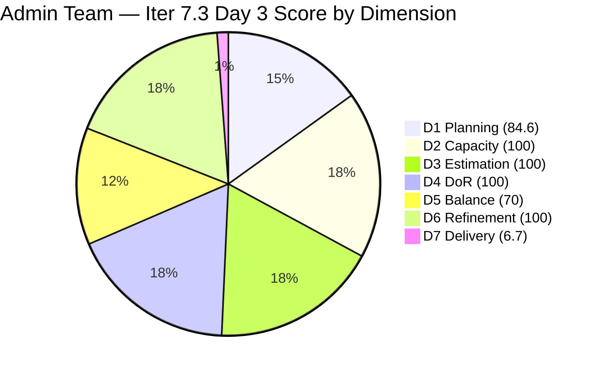
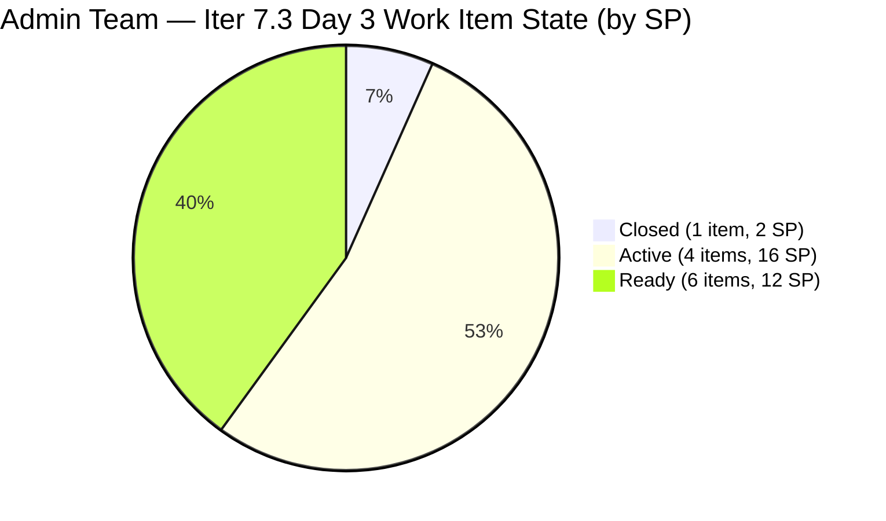

# ADO SAFe Iteration Audit — Administration Team

**Audit #50 | Iteration 7.3 (May 4 – May 17, 2026) | Day 3 of 14**

---

## 1. Audit Metadata

| Field | Value |
|---|---|
| **Audit Date** | May 6, 2026 — 09:00 UTC |
| **Auditor** | Claude Code (ADO SAFe Audit Agent) |
| **Workspace** | `ado_admin` |
| **ADO Project** | Jairosoft FINOPS (`e0bb302f-40f9-46c3-8164-6f1acb317d63`) |
| **Team** | Administration Team (`a38a9c02-07ab-483d-a1e3-aff54e19e603`) |
| **Iteration** | Iteration 7.3 — May 4 to May 17, 2026 |
| **Iteration ID** | `d76b8de5-94fe-4b28-987a-263d56afd8d4` |
| **Sprint Day** | Day 3 of 14 |
| **Prior Audit** | AUDIT_20260505_0902.md (Audit #49, 79.4 — Moderate Risk, Iter 7.3 Day 2) |
| **Scoring Model** | ADO SAFe v1 (7-dimension rubric) |
| **Overall Score** | **80.2 / 100** |
| **Risk Band** | **Low Risk** (≥ 80) |

> **Live ADO data confirmed.** 13 visible root backlog items (Administration Team, `Microsoft.RequirementCategory`). 11 current iteration root items confirmed from backlog API (IterationPath = Iteration 7.3). Note: Defect #203693 (Admin CR sink cabinet, Active) is visible in ADO with IterationPath=Iter 7.3 but was not returned by the scoped backlog API on this run (it was included on Day 2 as the 12th sprint item). Per scoring rules, only items returned by the backlog API are counted in visible_root and current_iteration_root. This reduces the sprint count from 12 → 11 items and committed SP from 33 → 30. **First sprint closure confirmed: #203651 (Fixation of post at Davao office rooftop, 2 SP) closed May 6 at 01:59 UTC.** D7 = 6.7 — early-sprint annotation applies (Days 1–5), but delivery momentum is real. Overall crosses the Low Risk threshold at 80.2.

---

## 2. Executive Summary

The Administration Team achieves **80.2 / 100 — Low Risk** on Day 3 of Iteration 7.3, crossing the green threshold for the first time this sprint. This improvement from 79.4 (Moderate, Day 2) is driven by the first sprint closure:

- **#203651 (Fixation of post at Davao office rooftop, 2 SP) → Closed** on May 6 at 01:59 UTC. First delivery of the sprint.

**Additional activity on Day 3:**
- **#203560** (JIT BFP inspection compliance, 2 SP) → Active (was Ready on Day 2)
- **#203644** (Drug testing clinic for CADAC, 2 SP) → Active (was Ready on Day 2)

Mark now has **4 items Active** (203556, 203557, 203560, 203644 + 203563) totaling **16 SP in progress** alongside the standing Adhoc Support story (#203563, 4 SP). Five Active items simultaneously is a high context-switching load for a single contributor.

**Structural D5 penalty (70.0) persists** — User Story dominance at 72.7% (8/11 items). This is a sprint planning issue and cannot be corrected mid-sprint.

**Note on backlog API count:** The Defect #203693 dropped from the scoped backlog API return on Day 3 (was present on Day 2 as the 12th item). This may reflect an ADO categorization event. The drop reduces visible_root from 14 to 13 and current_sprint items from 12 to 11, with committed SP dropping from 33 to 30. This is documented in Evidence Gaps.

---

## 3. Previous Audit Delta

| Dimension | Audit #49 (May 5) — Iter 7.3 Day 2 | Audit #50 (May 6) — Iter 7.3 Day 3 | Delta | Driver |
|---|---|---|---|---|
| Iteration Planning | 85.7 | **84.6** | **-1.1** | Backlog API returns 13 items (not 14); 203693 excluded from scoped backlog |
| Team Capacity | 100.0 | 100.0 | 0.0 | Mark Colina: 5 hrs/day, 0 days off — unchanged |
| Estimation | 100.0 | 100.0 | 0.0 | All 11 sprint items have SP |
| DoR Compliance | 100.0 | 100.0 | 0.0 | All 11 sprint items pass DoR |
| Work Item Balance | 70.0 | 70.0 | 0.0 | US dominance 72.7% structural |
| Backlog Refinement | 100.0 | 100.0 | 0.0 | All 13 visible items recently changed |
| Delivery Predictability | 0.0 | **6.7** | **+6.7** | #203651 closed (2 SP); round(2/30×100,1)=6.7 |
| **Overall** | **79.4** | **80.2** | **+0.8** | **Low Risk threshold crossed — first closure drives D7** |

### Score Trend — Iteration 7.3

| Audit | Overall | Risk Band |
|---|---|---|
| 7.2 Close (May 3) | 95.7 | Low |
| 7.3 Day 1 (May 4) | 79.4 | Moderate |
| 7.3 Day 2 (May 5) | 79.4 | Moderate |
| 7.3 Day 3 (May 6) | **80.2** | **Low** |

---

## 4. Current Iteration Snapshot

| Metric | Value |
|---|---|
| **Visible root backlog items** | 13 |
| **Current iteration root items (Iter 7.3)** | 11 |
| **Committed story points** | 30 SP |
| **Closed story points** | 2 SP (#203651) |
| **Active story points** | 16 SP (5 items in progress) |
| **Ready story points** | 12 SP (4 items remaining) |
| **Sprint progress** | Day 3 of 14 — first delivery achieved |
| **Assignee** | Mark Colina (sole contributor) |
| **Bus factor** | 1 — persistent structural risk |
| **Sprint activity** | 1 item Closed; 2 more transitioned to Active on May 6 |

### State Distribution — Day 3

| State | Count | SP |
|---|---|---|
| Closed | 1 | 2 |
| Active | 4 | 16 |
| Ready | 6 | 12 |
| **Total** | **11** | **30** |

---

## 5. Work Item Analysis

### Current Iteration Root Items — Day 3 State (11 items)

| ID | Title | Type | State | SP | DoR | AssignedTo | Changed |
|---|---|---|---|---|---|---|---|
| 202366 | Philgeps renewal for 2026 | User Story | Ready | 3 | PASS | Mark Colina | May 4 |
| 203555 | Government (EGOV) payables | User Story | Ready | 4 | PASS | Mark Colina | May 4 |
| **203556** | Payables — Internet for Davao and Cebu office | User Story | Active | 4 | PASS | Mark Colina | May 5 |
| **203557** | Utilities payables for Cebu and Davao | User Story | Active | 4 | PASS | Mark Colina | May 5 |
| 203558 | Condo dues (Cebu) payables | User Story | Ready | 3 | PASS | Mark Colina | May 4 |
| **203560** | JIT BFP inspection compliance 2026 | User Story | **Active** | 2 | PASS | Mark Colina | **May 6** |
| **203563** | Davao Admin Adhoc Support May 4–17, 2026 | User Story | Active | 4 | PASS | Mark Colina | May 5 |
| 203628 | Monthly Payable Forecasting | Spike | Ready | 1 | PASS | Mark Colina | May 4 |
| 203637 | Summary of Drug Test Center | Spike | Ready | 1 | PASS | Mark Colina | May 4 |
| **203644** | Drug testing clinic for CADAC | User Story | **Active** | 2 | PASS | Mark Colina | **May 6** |
| **203651** | Fixation of post at Davao office rooftop | User Story | **Closed** | 2 | PASS | Mark Colina | **May 6** |

**Sprint composition:** 8 User Stories (72.7%), 2 Spikes (18.2%), 1 Defect excluded from API count.

### Excluded from Backlog API — Anomaly

| ID | Title | Type | State | SP | IterationPath | Changed |
|---|---|---|---|---|---|---|
| 203693 | Admin CR sink cabinet | Defect | Active | 3 | Iter 7.3 | May 6 (05:10 UTC) |

**203693 was counted as a root backlog item on Days 1–2 (visible in the scoped backlog API). On Day 3, it is absent from the API return.** The item remains Active in ADO with IterationPath=Iter 7.3. This may reflect an ADO state, area path, or categorization change. Since it is not returned by the backlog API, it is excluded from all Day 3 scoring metrics per the audit rules. Impact: visible_root drops from 14 to 13; current_sprint drops from 12 to 11; committed SP drops from 33 to 30. See Evidence Gaps.

### Non-Sprint Backlog Items (correctly deferred)

| ID | Title | Type | IterationPath | SP | State |
|---|---|---|---|---|---|
| 203716 | Procure Signage Materials | User Story | Iter 7.4 | 2 | Requirements Gathering |
| 203717 | Installation of Street Signage | User Story | Iter 7.5 | 3 | Requirements Gathering |

### DoR Assessment — All 11 Sprint Items

All 11 items pass DoR (Description ≥ 30 non-WS chars, Acceptance Criteria ≥ 20 non-WS chars). Descriptions are detailed and business-contextual. Acceptance criteria are clear and measurable. #203651 was closed before audit — DoR was already confirmed at sprint start.

---

## 6. SAFe Compliance Scorecard

| Dimension | Score | Evidence | Notes |
|---|---|---|---|
| D1 Iteration Planning | 84.6 | 11 sprint items / 13 visible backlog items | 203693 excluded from backlog API on Day 3; 203716, 203717 deferred |
| D2 Team Capacity | 100.0 | 1 / 1 contributor with positive capacity | Mark: 5 hrs/day (Dep 1 + Doc 2 + Req 2), 0 days off |
| D3 Estimation | 100.0 | 11 / 11 sprint items have SP > 0 | All items estimated at sprint start |
| D4 DoR Compliance | 100.0 | 11 / 11 sprint items pass Desc + AC check | Strong descriptions and measurable AC throughout |
| D5 Work Item Balance | 70.0 | 8 User Stories (72.7%) — dominant type > 60% | Has User Story ✓; -30 dominant-type penalty; Spike 18.2% < 40% ✓ |
| D6 Backlog Refinement | 100.0 | All 13 visible items changed May 4–6 | 0 stale; 0 untouched-current |
| D7 Delivery Predictability | **6.7** | 2 / 30 SP closed — Day 3 of 14 | **Early-sprint (Days 1–5). #203651 closed. First delivery confirmed.** |
| **Overall** | **80.2** | **(84.6+100+100+100+70+100+6.7)/7** | **Low Risk — threshold crossed at Day 3** |

**D1:** round(11/13×100,1) = 84.6
**D5 trace:** Start 100; US present (no -40); US 8/11=72.7%>60% → -30; Spike 2/11=18.2%<40% (no -20). D5=70.
**D6 trace:** base=round(13/13×100,1)=100; stale_90=0; stale_180=0; untouched_current=0/11=0% (all items changed ≥May 4). D6=100.
**D7 trace:** committed_sp=30 (11 sprint items, all estimated); closed_sp=2 (#203651); D7=round(2/30×100,1)=6.7. Early-sprint annotation Days 1–5.

---

## 7. Dimension Findings

### D1 — Iteration Planning (84.6 — strong)

11 of 13 visible backlog items committed to Iter 7.3. D1 moved from 85.7 to 84.6 due to the backlog API returning 13 items today versus 14 on Days 1–2 (203693 Defect dropped from scoped return). The 2 deferred items (#203716 Iter 7.4, #203717 Iter 7.5) remain in active refinement. D1 = 84.6 reflects a well-planned sprint.

### D2 — Team Capacity (100.0)

Mark Colina: 5 hrs/day, 0 days off. Capacity confirmed via ADO API. 70 hours total capacity against 30 SP = 2.33 hrs/SP. Comfortable velocity envelope.

### D3 — Estimation (100.0)

All 11 sprint items have story points. Estimation hygiene is a team strength.

### D4 — DoR Compliance (100.0)

All 11 items pass DoR. #203651 (closed) had rich descriptions and detailed acceptance criteria. Closed on Day 3 with full DoR — this is SAFe-compliant delivery.

### D5 — Work Item Balance (70.0 — structural)

Sprint composition: 8 User Stories (72.7%), 2 Spikes (18.2%), with the Defect #203693 excluded from API count. The US dominant share remains > 60%, sustaining the -30 penalty. This is a sprint planning issue. Score ceiling for this sprint = round((84.6+100+100+100+70+100+100)/7,1) = 93.5.

### D6 — Backlog Refinement (100.0)

All 13 visible backlog items were changed between May 4 and May 6. Zero stale items, zero untouched-current sprint items. All active sprint items were touched after the May 4 sprint start. D6 = 100 is fully earned.

### D7 — Delivery Predictability (6.7 — first delivery, early-sprint)

Day 3, within the 1–5 early-sprint window. **203651 (Fixation of post at Davao office rooftop, 2 SP) was closed on May 6 at 01:59 UTC** — the first sprint delivery. Mark's velocity is tracking ahead of expectations from Day 2 projections (first closures expected Days 3–4, and it arrived at Day 3). D7 = round(2/30×100,1) = 6.7.

Four items are currently Active (203556, 203557, 203560, 203563; and 203644 added today = 5 Active including #203563 Adhoc Support). At Mark's established velocity of ~2.57 SP/day:

**Projected score trajectory (from Day 3 baseline of 2 SP closed):**
- Day 5 (May 8): If 12 SP closed → D7 = round(12/30×100,1) = 40.0 → Overall ≈ 84.9 (solidly Low Risk)
- Day 10 (May 13): If 22 SP closed → D7 = 73.3 → Overall ≈ 89.8
- Day 14 (May 17): If 30 SP closed → D7 = 100.0 → Overall ≈ 93.5

---

## 8. Risks and Bottlenecks

| Risk | Severity | Status |
|---|---|---|
| 5 items simultaneously Active (16 SP on one person) | High | Context-switching risk elevated on Day 3. Mark should close #203556 and #203557 before opening new items. |
| Single contributor (Mark Colina) — bus factor 1 | High | Structural; unchanged. PI 8 planning must address cross-training. |
| D5 = 70 — User Story dominance (72.7%) | Low | Structural; sprint planning issue. Score ceiling = 93.5. |
| #203693 (Admin CR sink cabinet) dropped from backlog API | Moderate | Item is still Active in ADO with Iter 7.3 path. Verify with Mark that this Defect is properly tracked and hasn't been recategorized accidentally. |
| #202366 (PhilGEPS renewal) still Ready on Day 3 | Moderate | Compliance-critical item. External deadline risk. Mark should confirm if there is a deadline approaching. |
| #203560 (BFP inspection) → Active on Day 3 | Low | Positive signal — time-sensitive compliance item now in progress. Monitor for external dependencies. |

---

## 9. Prioritized Recommendations

1. **[Day 3 — Today] Close #203556 and #203557 before opening more items** — Mark has 5 items Active simultaneously (16 SP). The internet payables (#203556, 4 SP) and utilities payables (#203557, 4 SP) were Active since Day 2 — both involve recurring payment processes with established workflows. These should be closeable by end of Day 3. Closing them reduces Active items from 5 to 3 and drives D7 to round(10/30×100,1) = 33.3 (if #203651+203556+203557 all closed).

2. **[Day 3] Investigate #203693 (Admin CR sink cabinet) backlog API exclusion** — Verify in ADO that this Defect still has the correct area path and team assignment. If it has been moved to a different area path or team scope, update it back. This 3 SP item matters for overall sprint scope visibility.

3. **[Day 4] Confirm PhilGEPS deadline (#202366, 3 SP)** — PhilGEPS renewal has a government-set renewal window. Mark should confirm the exact expiry date of the current registration and add it to the item's Acceptance Criteria. If the deadline is before May 17, this item must be escalated to Active immediately.

4. **[Iter 7.4 Planning] Reduce User Story share below 60%** — To eliminate the D5 -30 penalty in Iter 7.4: with the same number of items (11), the sprint needs at most 6 User Stories (6/11 = 54.5%). This can be achieved by replacing 2 User Stories with Enablers or Defects. Based on the signage items (#203716, #203717) already planned for Iter 7.4/7.5, consider adding an Enabler for infrastructure or tooling to balance the composition.

5. **[PI 8 Planning] Address bus factor** — Mark has delivered solo across multiple consecutive sprints. Cross-training or co-assignment for PI 8 is the team's most significant structural risk.

---

## 10. Evidence Gaps and Limitations

| Gap | Impact | Mitigation |
|---|---|---|
| #203693 (Admin CR sink cabinet, Defect) absent from Day 3 backlog API despite IterationPath=Iter 7.3 and State=Active | visible_root drops from 14→13; current_sprint drops from 12→11; committed SP drops from 33→30; D7 denominator changes. D1 = 84.6 (was 85.7) | Documented above. Possible area path or categorization change. Mark should verify in ADO. |
| Early-sprint D7 = 6.7 (Day 3, within Days 1–5 window) | Score will rise rapidly as Mark closes the Active cluster | Early-sprint annotation applied |
| D5 = 70 is structurally determined by sprint planning | No corrective action possible mid-sprint | Address in Iter 7.4 planning |
| Bus factor 1: all items assigned to Mark | Audit cannot verify actual work output; relies on ADO state transitions | Structural risk; documented |
| #203716, #203717 DoR not re-verified for Iter 7.4/7.5 | Not in current sprint; excluded from D4 | Both pass on visual inspection |
