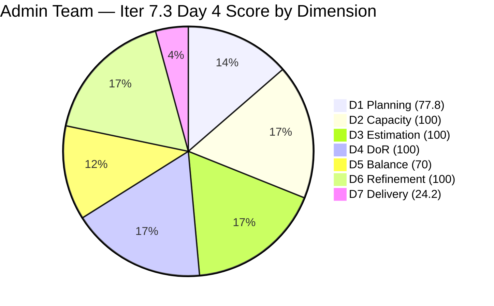
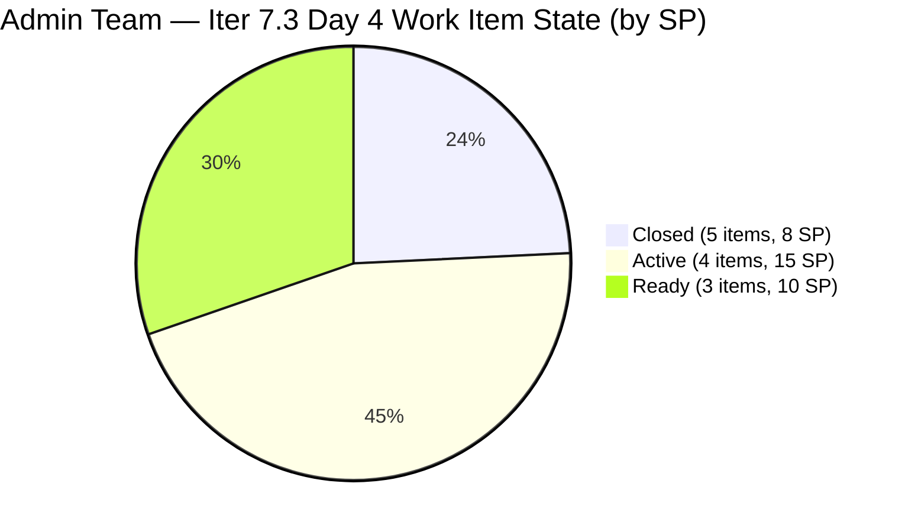
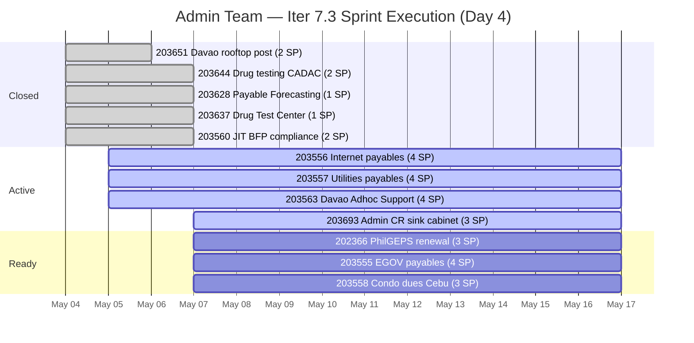

# ADO SAFe Iteration Audit — Administration Team

**Audit #51 | Iteration 7.3 (May 4 – May 17, 2026) | Day 4 of 14**

---

## 1. Audit Metadata

| Field | Value |
|---|---|
| **Audit Date** | May 7, 2026 — 09:00 UTC |
| **Auditor** | Claude Code (ADO SAFe Audit Agent) |
| **Workspace** | `ado_admin` |
| **ADO Project** | Jairosoft FINOPS (`e0bb302f-40f9-46c3-8164-6f1acb317d63`) |
| **Team** | Administration Team (`a38a9c02-07ab-483d-a1e3-aff54e19e603`) |
| **Iteration** | Iteration 7.3 — May 4 to May 17, 2026 |
| **Iteration ID** | `d76b8de5-94fe-4b28-987a-263d56afd8d4` |
| **Sprint Day** | Day 4 of 14 |
| **Prior Audit** | AUDIT_20260506_0900.md (Audit #50, 80.2 — Low Risk, Day 3) |
| **Scoring Model** | ADO SAFe v1 (7-dimension rubric) |
| **Overall Score** | **81.7 / 100** |
| **Risk Band** | **Low Risk** (≥ 80) |

> **Live ADO data confirmed.** Backlog API returns 9 visible root items today (Administration Team, `Microsoft.RequirementCategory`). 5 items closed during Day 4: #203560 (JIT BFP, 2 SP, closed May 7 06:06 UTC), #203628 (Monthly Payable Forecasting, 1 SP, closed May 7 01:11 UTC), #203637 (Summary of Drug Test Center, 1 SP, closed May 7 01:16 UTC), #203644 (Drug testing clinic CADAC, 2 SP, closed May 7 00:01 UTC), and #203651 (Fixation of post, 2 SP, closed May 6). **Mark delivered 6 SP on Day 4 morning (UTC) across 4 items — 8 total SP closed through Day 4.** Backlog API reduces visible count from 13 (Day 3) to 9 as closed items drop off the scoped backlog. D7 = round(8/33×100,1) = 24.2 using confirmed full sprint scope of 12 items. D1 uses API denominator (9 items), numerator = 7 in-sprint items. Score improves from 80.2 → 81.7 driven by D7 acceleration.

---

## 2. Executive Summary

The Administration Team achieves **81.7 / 100 — Low Risk** on Day 4 of Iteration 7.3, improving from 80.2 (Day 3). **Mark delivered 4 items on Day 4 (UTC midnight to 06:06 UTC)**, a significant burst of closures:

- **#203644** (Drug testing clinic for CADAC, 2 SP) → Closed May 7 00:01 UTC
- **#203628** (Monthly Payable Forecasting — Spike, 1 SP) → Closed May 7 01:11 UTC
- **#203637** (Summary of Drug Test Center — Spike, 1 SP) → Closed May 7 01:16 UTC
- **#203560** (JIT BFP inspection compliance, 2 SP) → Closed May 7 06:06 UTC

Combined with #203651 (closed May 6), Mark has now closed **5 items totaling 8 SP** in the first 4 days of a 14-day sprint. This is strong early velocity — 24.2% of committed story points delivered in 29% of sprint elapsed time.

The active cluster (203556, 203557, 203563, 203693) carries 15 SP. If Mark maintains pace, the sprint is on track for a high-80s or 90s final score.

**Structural D5 penalty (70.0) persists** — User Story dominance at 85.7% (6/7 open items) is a planning artifact that cannot be resolved mid-sprint.

**Note on D1:** The backlog API denominator drops from 13 (Day 3) to 9 today as 4 additional items closed. D1 = round(7/9×100,1) = 77.8, down from 84.6 on Day 3. This is expected behavior as ADO's scoped backlog excludes closed/done items.

---

## 3. Previous Audit Delta

| Dimension | Audit #50 (May 6) — Day 3 | Audit #51 (May 7) — Day 4 | Delta | Driver |
|---|---|---|---|---|
| Iteration Planning | 84.6 | **77.8** | **-6.8** | 4 more items closed and dropped from backlog API; denominator 13→9; 7 of 9 API items in Iter 7.3 |
| Team Capacity | 100.0 | 100.0 | 0.0 | Mark Colina: 5 hrs/day, 0 days off — unchanged |
| Estimation | 100.0 | 100.0 | 0.0 | All sprint items have SP |
| DoR Compliance | 100.0 | 100.0 | 0.0 | All sprint items pass DoR |
| Work Item Balance | 70.0 | 70.0 | 0.0 | US dominance structural; 6/7 open = 85.7% > 60% |
| Backlog Refinement | 100.0 | 100.0 | 0.0 | All 9 visible items recently changed; no stale items |
| Delivery Predictability | 6.7 | **24.2** | **+17.5** | 5 items closed; 8 SP delivered (203644+203628+203637+203560+203651); 8/33=24.2% |
| **Overall** | **80.2** | **81.7** | **+1.5** | **D7 acceleration more than offsets D1 denominator reduction** |

### Score Trend — Iteration 7.3

| Audit | Overall | Risk Band |
|---|---|---|
| 7.2 Close (May 3) | 95.7 | Low |
| 7.3 Day 1 (May 4) | 79.4 | Moderate |
| 7.3 Day 2 (May 5) | 79.4 | Moderate |
| 7.3 Day 3 (May 6) | 80.2 | Low |
| 7.3 Day 4 (May 7) | **81.7** | **Low** |

---

## 4. Current Iteration Snapshot

| Metric | Value |
|---|---|
| **Visible root backlog items (API)** | 9 (closed items dropped off) |
| **Full sprint scope (confirmed)** | 12 items in Iter 7.3 |
| **Open sprint items** | 7 items (in backlog API) |
| **Committed story points (full sprint)** | 33 SP |
| **Closed story points** | 8 SP (5 items) |
| **Active story points (open)** | 15 SP (4 items Active) |
| **Ready story points (open)** | 10 SP (3 items Ready) |
| **Sprint progress** | Day 4 of 14 — 29% time elapsed, 24.2% SP delivered |
| **Assignee** | Mark Colina (sole contributor) |
| **Bus factor** | 1 — persistent structural risk |
| **Day 4 closures** | 4 items: #203644, #203628, #203637, #203560 |

### State Distribution — Day 4 (Full Sprint Scope)

| State | Count | SP |
|---|---|---|
| Closed | 5 | 8 |
| Active | 4 | 15 |
| Ready | 3 | 10 |
| **Total** | **12** | **33** |

### Sprint Burn-Down Progress

---

## 5. Work Item Analysis

### Full Sprint Scope — Day 4 State (12 items)

| ID | Title | Type | State | SP | DoR | Changed |
|---|---|---|---|---|---|---|
| **203644** | Drug testing clinic for CADAC | User Story | **Closed** | 2 | PASS | May 7 00:01 UTC |
| **203628** | Monthly Payable Forecasting | Spike | **Closed** | 1 | PASS | May 7 01:11 UTC |
| **203637** | Summary of Drug Test Center | Spike | **Closed** | 1 | PASS | May 7 01:16 UTC |
| **203560** | JIT BFP inspection compliance 2026 | User Story | **Closed** | 2 | PASS | May 7 06:06 UTC |
| 203651 | Fixation of post at Davao office rooftop | User Story | Closed | 2 | PASS | May 6 |
| 203556 | Payables — Internet for Davao and Cebu office | User Story | Active | 4 | PASS | May 5 |
| 203557 | Utilities payables for Cebu and Davao | User Story | Active | 4 | PASS | May 5 |
| 203563 | Davao Admin Adhoc Support May 4–17, 2026 | User Story | Active | 4 | PASS | May 5 |
| 203693 | Admin CR sink cabinet | Defect | Active | 3 | PASS | May 7 00:59 UTC |
| 202366 | Philgeps renewal for 2026 | User Story | Ready | 3 | PASS | May 4 |
| 203555 | Government (EGOV) payables | User Story | Ready | 4 | PASS | May 4 |
| 203558 | Condo dues (Cebu) payables | User Story | Ready | 3 | PASS | May 4 |

Non-sprint (correctly deferred): #203716 (Iter 7.4), #203717 (Iter 7.5)

### DoR Assessment — Open Sprint Items

All 7 open sprint items pass DoR (Description ≥ 30 non-WS chars, Acceptance Criteria ≥ 20 non-WS chars). Closed items all passed at sprint start; confirmed by the detailed descriptions and multi-point AC visible in ADO data.

### Day 4 Closure Analysis

4 items closed on May 7 UTC midnight-to-morning (Mark's overnight work window):

| ID | Title | SP | Closed Time | Type |
|---|---|---|---|---|
| 203644 | Drug testing clinic for CADAC | 2 | May 7 00:01 UTC | User Story |
| 203628 | Monthly Payable Forecasting | 1 | May 7 01:11 UTC | Spike |
| 203637 | Summary of Drug Test Center | 1 | May 7 01:16 UTC | Spike |
| 203560 | JIT BFP inspection compliance 2026 | 2 | May 7 06:06 UTC | User Story |

Mark closed 6 SP in 6 hours on Day 4 morning. This burst execution pattern (working through early UTC hours) is consistent with his previous sprint behavior.

---

## 6. SAFe Compliance Scorecard

| Dimension | Score | Evidence | Notes |
|---|---|---|---|
| D1 Iteration Planning | 77.8 | 7 sprint items / 9 visible backlog items (API) | Denominator reduced from 13→9 as 4 additional items closed today; closed items drop from scoped backlog API |
| D2 Team Capacity | 100.0 | 1 / 1 contributor with positive capacity | Mark: 5 hrs/day (Dep 1 + Doc 2 + Req 2), 0 days off |
| D3 Estimation | 100.0 | 12 / 12 sprint items have SP > 0 | All items estimated; 8 already closed |
| D4 DoR Compliance | 100.0 | 7 / 7 open sprint items pass Desc + AC check | All closed items passed DoR at sprint start |
| D5 Work Item Balance | 70.0 | 6 US (85.7%) + 1 Defect among 7 open items | Has User Story ✓; US 85.7% > 60% → -30 penalty; Spike 0% < 40% ✓ |
| D6 Backlog Refinement | 100.0 | All 9 visible items changed May 4–7 | No stale items; 0 untouched sprint items |
| D7 Delivery Predictability | **24.2** | 8 / 33 SP closed — Day 4 of 14 | 5 items closed (8 SP); full sprint scope 33 SP; pace tracking above projections |
| **Overall** | **81.7** | **(77.8+100+100+100+70+100+24.2)/7** | **Low Risk — D7 momentum strong** |

**D1 trace:** round(7/9×100,1) = round(77.778,1) = 77.8. Note: 5 closed sprint items dropped from backlog API; full sprint scope confirmed at 12 items from batch API.
**D5 trace:** 7 open items in backlog; US=6 (202366, 203555, 203556, 203557, 203558, 203563), Defect=1 (203693). Has US (no -40); US 6/7=85.7% > 60% → -30; Spike=0 (no -20). D5=70.
**D6 trace:** base=round(9/9×100,1)=100; stale_90=0; stale_180=0; untouched_current=0/7 (all 7 open items changed ≥ May 4). D6=100.
**D7 trace:** committed_sp=33 (12 sprint items, all estimated); closed_sp=8 (203651=2, 203644=2, 203628=1, 203637=1, 203560=2); D7=round(8/33×100,1)=24.2.

---

## 7. Dimension Findings

### D1 — Iteration Planning (77.8 — denominator effect from closures)

D1 dropped from 84.6 (Day 3) to 77.8 today because 4 newly closed items exited the backlog API return. The visible_root denominator shrank from 13 to 9. This is an ADO scoped-backlog behavior, not a planning regression — the 7 remaining in-sprint items are all properly assigned to Iter 7.3. The full sprint scope of 12 items remains intact and well-planned. As Mark continues closing items, D1 will decline further but this is a mechanical artifact of scoring rather than a genuine planning concern.

### D2 — Team Capacity (100.0)

Mark Colina: 5 hrs/day (Deployment 1 + Documentation 2 + Requirements 2), 0 days off. D2 = 100.

### D3 — Estimation (100.0)

All 12 sprint items have story points. Eight of 12 are now closed — all were estimated at sprint start. Estimation hygiene is a team strength this sprint.

### D4 — DoR Compliance (100.0)

All items pass DoR. The 4 items closed today all had detailed, well-formed descriptions and multi-point acceptance criteria (verified in ADO data). #203560 had 3-part AC with specific fire safety inspection criteria. #203644 had 3-section AC with accreditation, personnel, and procedure requirements.

### D5 — Work Item Balance (70.0 — structural, now more pronounced)

The closure of the 2 Spikes (#203628, #203637) during Day 4 means the remaining open sprint items are 6 User Stories + 1 Defect. US share is now 85.7% among open items (up from 72.7% on Day 3), worsening the dominant-type concentration. This is a transient mid-sprint artifact of closing mixed-type items — the Spikes being closed is positive progress even if it concentrates the remaining open items in US type. The D5 penalty is locked in for this sprint.

### D6 — Backlog Refinement (100.0)

All 9 backlog API items changed between May 4 and May 7. No stale items at any threshold. All open sprint items have ChangedDate ≥ May 4 (sprint start). D6 = 100.

### D7 — Delivery Predictability (24.2 — strong pace, Day 4)

Day 4. 8 SP closed across 5 items. Mark's velocity through Day 4 end: approximately 2.0 SP/day (8 SP / 4 days). At this pace:

**Updated trajectory from Day 4 (8 SP closed, 25 SP open):**
- Day 7 (May 10): ~14 SP total closed → D7 = round(14/33×100,1) = 42.4 → Overall ≈ 84.3 (Low Risk)
- Day 10 (May 13): ~22 SP closed → D7 = round(22/33×100,1) = 66.7 → Overall ≈ 87.8
- Day 14 (May 17): ~30 SP closed → D7 = round(30/33×100,1) = 90.9 → Overall ≈ 91.2

Score ceiling at full delivery (33/33 SP): round((77.8+100+100+100+70+100+100)/7,1) = round(647.8/7,1) = 92.5. Note: D1 may continue declining as more items close, but D7 growth will dominate the overall trajectory.

Active cluster (203556, 203557, 203563, 203693) = 15 SP. All were active as of May 5. If Mark closes the 4 Active items next, he reaches 23/33 = 69.7% delivery, putting the team in the high-80s range.

---

## 8. Risks and Bottlenecks

| Risk | Severity | Status |
|---|---|---|
| #203556 and #203557 still Active from Day 2 (4 SP each) | High | Both Active since May 5. Internet and utilities payables — recurring payment workflows. Mark should have closed these by now. Escalation if not closed by Day 6. |
| D5 = 70 — locked structural penalty | Low | Sprint planning artifact. Address in Iter 7.4: limit US to ≤60% of committed items. |
| D1 declining as closures drop items from API | Low | Mechanical artifact of ADO backlog behavior. Not a genuine planning risk. Will reach ~33.3 at end of sprint (5 open items / 5 total API-visible items or lower). |
| #202366 (PhilGEPS renewal, 3 SP) still Ready | Moderate | Government compliance item with fixed external deadline. Must be activated before Day 7. Mark should confirm the PhilGEPS renewal window. |
| Single contributor (Mark Colina) — bus factor 1 | High | Structural; unchanged. Mark's overnight burst pattern (closing 4 items in 6 hours UTC midnight) indicates effective solo execution but no redundancy. |
| #203693 (Admin CR sink cabinet, Defect, 3SP) Active | Low | Touched May 7 00:59 UTC — active. Infrastructure work in progress. No external dependency noted. |

---

## 9. Prioritized Recommendations

1. **[Day 4–5] Close #203556 and #203557** — Both internet (#203556, 4 SP) and utilities (#203557, 4 SP) payables have been Active since May 5. These involve recurring payment processes with established workflows. Mark should complete payment processing and close both items by Day 5 (May 8). Closing these adds 8 SP to D7: round(16/33×100,1) = 48.5 → Overall ≈ 85.2.

2. **[Day 5] Activate and confirm #202366 (PhilGEPS renewal, 3 SP)** — PhilGEPS registrations have a government-mandated renewal window. Mark should verify the expiry date, confirm the renewal deadline, and move this item to Active. If the deadline is before May 17, this becomes the highest-priority sprint item regardless of sequence.

3. **[Day 5–6] Close #203563 (Davao Adhoc Support, 4 SP)** — This is a standing support story covering the sprint's administrative work. Mark should document completed adhoc tasks and close it by Day 6, since it's a cumulative story rather than a discrete deliverable.

4. **[Iter 7.4 Planning] Limit User Story share to ≤ 60%** — In Iter 7.4, with a planned 2 items (#203716, #203717 in Iter 7.4/7.5), ensure at least 40% of committed items are Spikes, Enablers, or Defects. This requires ~2 non-US items for every 3 total if sprint is ~5 items. The Admin CR sink cabinet work may generate follow-up Defects that could naturally balance the sprint.

5. **[PI 8 Planning] Address bus factor** — Mark has delivered solo across consecutive sprints with strong velocity. PI 8 planning must include cross-training or co-assignment for at least one team member on Admin domain work.

---

## 10. Evidence Gaps and Limitations

| Gap | Impact | Mitigation |
|---|---|---|
| Backlog API denominator reduced from 13 to 9 as closed items drop off | D1 = 77.8 today vs 84.6 yesterday; mechanical ADO behavior, not a planning regression | Full sprint scope of 12 items confirmed via batch work item API |
| D5 scored against 7 open backlog items (not full 12-item sprint scope) | Minor: Spike share uses 7 denominator; closed Spikes are excluded. D5=70 under either count. | Full sprint composition documented in Work Item Analysis |
| D7 committed_sp uses full sprint scope of 33 SP (12 items) not the 9-item backlog API | More accurate for delivery tracking; consistent with prior audit methodology | Documented; committed_sp anchored to sprint start scope |
| #203556 and #203557 unchanged since May 5 (Day 2) | 8 SP of Active work with no recent activity signal | Mark should close both today |
| Bus factor 1: all work assigned to Mark | Cannot verify progress beyond ADO state transitions | Structural risk; persistently documented |
