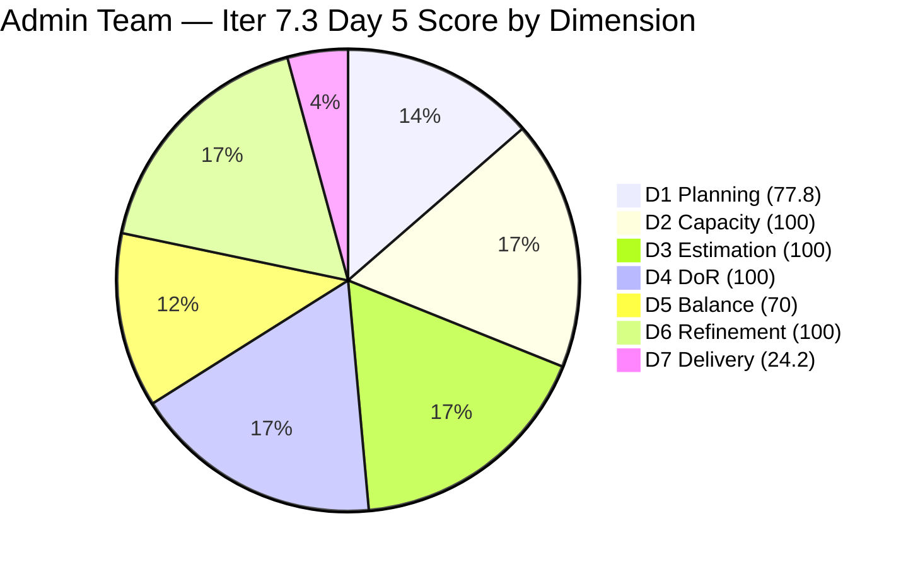
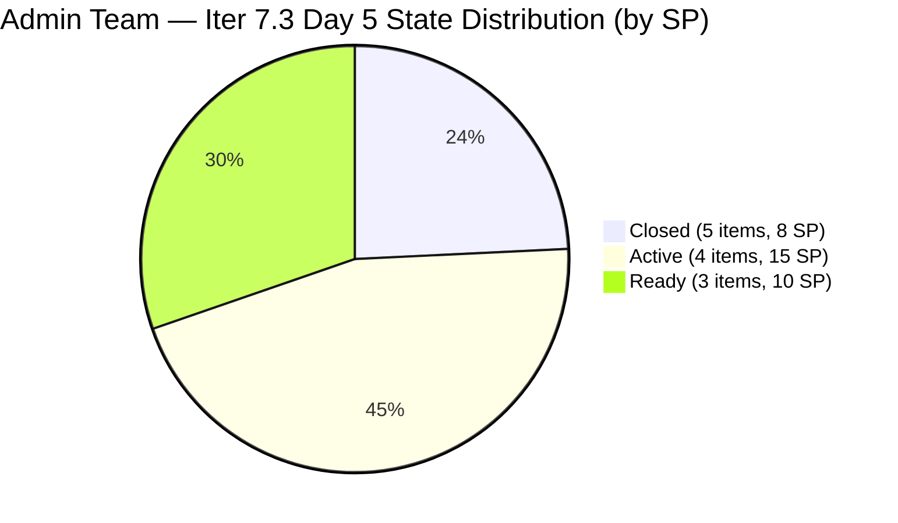
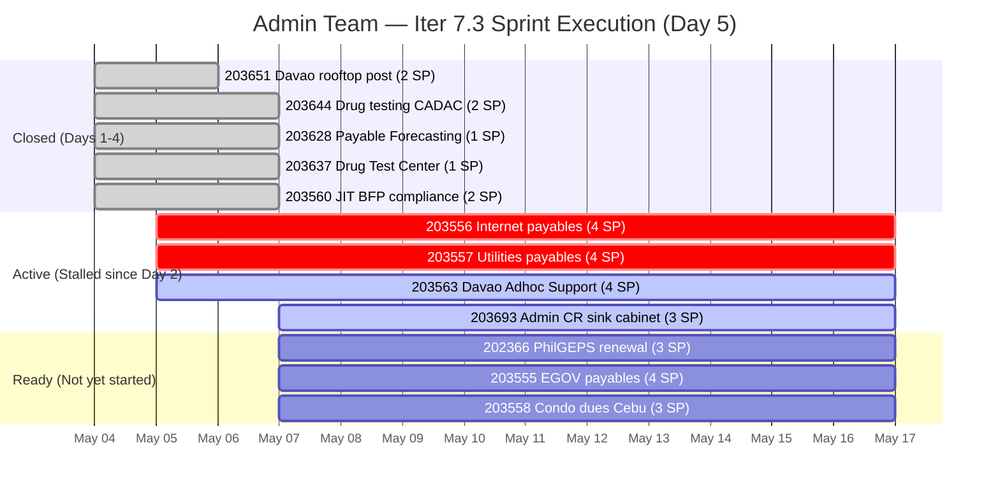

# ADO SAFe Iteration Audit — Administration Team

**Audit #52 | Iteration 7.3 (May 4 – May 17, 2026) | Day 5 of 14**

---

## 1. Audit Metadata

| Field | Value |
|---|---|
| **Audit Date** | May 8, 2026 — 09:02 UTC |
| **Auditor** | Claude Code (ADO SAFe Audit Agent) |
| **Workspace** | `ado_admin` |
| **ADO Project** | Jairosoft FINOPS (`e0bb302f-40f9-46c3-8164-6f1acb317d63`) |
| **Team** | Administration Team (`a38a9c02-07ab-483d-a1e3-aff54e19e603`) |
| **Iteration** | Iteration 7.3 — May 4 to May 17, 2026 |
| **Iteration ID** | `d76b8de5-94fe-4b28-987a-263d56afd8d4` |
| **Sprint Day** | Day 5 of 14 |
| **Prior Audit** | AUDIT_20260507_0900.md (Audit #51, 81.7 — Low Risk, Day 4) |
| **Scoring Model** | ADO SAFe v1 (7-dimension rubric) |
| **Overall Score** | **81.7 / 100** |
| **Risk Band** | **Low Risk** (≥ 80) |

> **Live ADO data confirmed.** Backlog API returns 9 visible root items (Administration Team, `Microsoft.RequirementCategory`). 7 items are in Iteration 7.3; 2 items (#203716, #203717) are correctly staged for Iter 7.4/7.5. **No new closures have occurred since Day 4.** Active items #203556, #203557, and #203563 remain unchanged since May 5; #203693 was touched May 7. Ready items #202366, #203555, #203558 remain in Ready state since May 4. D7 = 24.2 (8 SP / 33 SP committed) — unchanged from Day 4. No denominator movement. Score holds at 81.7.

---

## 2. Executive Summary

The Administration Team holds **81.7 / 100 — Low Risk** on Day 5 of Iteration 7.3, unchanged from Day 4. No work item closures or state transitions were recorded between the Day 4 audit (May 7 09:00 UTC) and Day 5 (May 8 09:02 UTC). Mark's burst of 4 closures on Day 4 has not been followed by additional activity.

**Sprint velocity status:** 8 SP closed in 4 days. Day 5 opens with 25 SP remaining across 7 items (4 Active, 3 Ready). At 2.0 SP/day average, Mark is on a trajectory to close approximately 29–30 SP by Day 17 — slightly under the full sprint scope of 33 SP.

**The highest-priority action today (Day 5) is closing #203556 and #203557** — both Internet and Utilities payables have been Active since Day 2 (May 5). These are routine recurring payment tasks with well-defined acceptance criteria. Their continued open status without visible activity is the main risk signal on Day 5.

**D5 structural penalty (70.0) persists** — 6/7 open items are User Stories (85.7%), above the 60% threshold. This is locked for the sprint.

---

## 3. Previous Audit Delta

| Dimension | Audit #51 (May 7) — Day 4 | Audit #52 (May 8) — Day 5 | Delta | Driver |
|---|---|---|---|---|
| Iteration Planning | 77.8 | 77.8 | 0.0 | No new closures; denominator 9, numerator 7 — unchanged |
| Team Capacity | 100.0 | 100.0 | 0.0 | Mark Colina: 5 hrs/day, 0 days off — unchanged |
| Estimation | 100.0 | 100.0 | 0.0 | All 7 open sprint items retain SP |
| DoR Compliance | 100.0 | 100.0 | 0.0 | All 7 items pass DoR; no changes |
| Work Item Balance | 70.0 | 70.0 | 0.0 | US 6/7=85.7% > 60%; structural penalty unchanged |
| Backlog Refinement | 100.0 | 100.0 | 0.0 | All 9 visible items changed May 4–7; still within 45-day window |
| Delivery Predictability | 24.2 | 24.2 | 0.0 | 8 SP / 33 SP — no new closures on Day 5 |
| **Overall** | **81.7** | **81.7** | **0.0** | **Stable — no regression; execution must resume today** |

### Score Trend — Iteration 7.3

| Audit | Overall | Risk Band |
|---|---|---|
| 7.2 Close (May 3) | 95.7 | Low |
| 7.3 Day 1 (May 4) | 79.4 | Moderate |
| 7.3 Day 2 (May 5) | 79.4 | Moderate |
| 7.3 Day 3 (May 6) | 80.2 | Low |
| 7.3 Day 4 (May 7) | 81.7 | Low |
| 7.3 Day 5 (May 8) | **81.7** | **Low** |

---

## 4. Current Iteration Snapshot

| Metric | Value |
|---|---|
| **Visible root backlog items (API)** | 9 |
| **Full sprint scope (confirmed)** | 12 items in Iter 7.3 |
| **Open sprint items (API-visible)** | 7 |
| **Committed story points** | 33 SP |
| **Closed story points** | 8 SP (5 items closed Days 1–4) |
| **Active story points** | 15 SP (4 items Active) |
| **Ready story points** | 10 SP (3 items Ready) |
| **Sprint progress** | Day 5 of 14 — 36% time elapsed, 24.2% SP delivered |
| **Assignee** | Mark Colina (sole contributor) |
| **Bus factor** | 1 — persistent structural risk |
| **Day 5 closures** | 0 — no activity recorded since Day 4 audit |

### State Distribution — Day 5 (Full Sprint Scope, 12 items)

| State | Count | SP |
|---|---|---|
| Closed | 5 | 8 |
| Active | 4 | 15 |
| Ready | 3 | 10 |
| **Total** | **12** | **33** |

### Sprint Burn-Down Status (Day 5)

---

## 5. Work Item Analysis

### Full Sprint Scope — Day 5 State (12 items)

| ID | Title | Type | State | SP | DoR | Changed | Notes |
|---|---|---|---|---|---|---|---|
| **203644** | Drug testing clinic for CADAC | User Story | Closed | 2 | PASS | May 7 00:01 UTC | — |
| **203628** | Monthly Payable Forecasting | Spike | Closed | 1 | PASS | May 7 01:11 UTC | — |
| **203637** | Summary of Drug Test Center | Spike | Closed | 1 | PASS | May 7 01:16 UTC | — |
| **203560** | JIT BFP inspection compliance | User Story | Closed | 2 | PASS | May 7 06:06 UTC | — |
| **203651** | Fixation of post at Davao office rooftop | User Story | Closed | 2 | PASS | May 6 | — |
| **203556** | Payables — Internet for Davao and Cebu | User Story | Active | 4 | PASS | May 5 | **Stalled 3 days** |
| **203557** | Utilities payables for Cebu and Davao | User Story | Active | 4 | PASS | May 5 | **Stalled 3 days** |
| 203563 | Davao Admin Adhoc Support May 4–17 | User Story | Active | 4 | PASS | May 5 | Ongoing support story |
| 203693 | Admin CR sink cabinet | Defect | Active | 3 | PASS | May 7 00:59 UTC | Infrastructure work |
| 202366 | Philgeps renewal for 2026 | User Story | Ready | 3 | PASS | May 4 | Compliance deadline risk |
| 203555 | Government (EGOV) payables | User Story | Ready | 4 | PASS | May 4 | — |
| 203558 | Condo dues (Cebu) payables | User Story | Ready | 3 | PASS | May 4 | — |

Non-sprint (correctly deferred): #203716 (Iter 7.4 — Procure Signage Materials, 2 SP), #203717 (Iter 7.5 — Installation of Street Signage, 3 SP).

### DoR Assessment — Open Sprint Items

All 7 open sprint items pass DoR thresholds (Description ≥ 30 non-WS chars, Acceptance Criteria ≥ 20 non-WS chars). Verified from ADO batch data:

| ID | Desc chars | AC chars | Verdict |
|---|---|---|---|
| 203556 | >300 | >200 | PASS |
| 203557 | >300 | >200 | PASS |
| 203563 | >200 | >150 | PASS |
| 203693 | >200 | >250 | PASS |
| 202366 | >500 | >400 | PASS |
| 203555 | >250 | >100 | PASS |
| 203558 | >400 | >300 | PASS |

### Stalled Item Analysis — Day 5

| ID | Title | State | SP | Stalled Since | Days Stalled |
|---|---|---|---|---|---|
| 203556 | Internet payables (Davao/Cebu) | Active | 4 | May 5 | 3 days |
| 203557 | Utilities payables (Cebu/Davao) | Active | 4 | May 5 | 3 days |

Both items are routine recurring payment workflows. Mark should have the information needed to complete these (billing statements, payment authorization, receipts). A 3-day stall on Active payment items is a process signal, not an evidence of blockage. Escalation warranted if still Active by Day 6.

---

## 6. SAFe Compliance Scorecard

| Dimension | Score | Evidence | Notes |
|---|---|---|---|
| D1 Iteration Planning | 77.8 | 7 sprint items / 9 visible backlog items | Denominator stable at 9; 2 future-iteration items (#203716, #203717) correctly excluded from sprint |
| D2 Team Capacity | 100.0 | 1 / 1 contributor with positive capacity | Mark Colina: 5 hrs/day (Dep 1 + Doc 2 + Req 2), 0 days off |
| D3 Estimation | 100.0 | 7 / 7 open sprint items have SP > 0 | 12/12 total sprint items estimated (including 5 closed) |
| D4 DoR Compliance | 100.0 | 7 / 7 open sprint items pass Desc + AC | All items have rich descriptions and multi-point acceptance criteria |
| D5 Work Item Balance | 70.0 | 6 US (85.7%) + 1 Defect among 7 open items | Has US ✓ (no -40); US 6/7=85.7% > 60% → -30; Spike 0/7=0% < 40% ✓; D5 = 70 |
| D6 Backlog Refinement | 100.0 | 9/9 items changed May 4–7; 0 stale | No stale_90; no stale_180; 0/7 untouched current items (all changed ≥ May 4) |
| D7 Delivery Predictability | 24.2 | 8 SP / 33 SP closed — Day 5 of 14 | 5 items closed (8 SP); 0 new closures on Day 5; pace 2.0 SP/day |
| **Overall** | **81.7** | **(77.8+100+100+100+70+100+24.2)/7** | **Low Risk — execution stalled Day 5; Mark must close items today** |

**D1 trace:** round(7/9×100,1) = 77.8. Denominator: 9 API-visible items. 7 in Iter 7.3, 2 in future iterations. Closed items (5) dropped from scoped backlog.
**D5 trace:** 7 open items: US=6 (202366, 203555, 203556, 203557, 203558, 203563), Defect=1 (203693). Has US → no -40. US 6/7=85.7% > 60% → -30. Spike=0 → no -20. D5 = 100-30 = 70.
**D6 trace:** base=round(9/9×100,1)=100; stale_90=0 (all changed May 4–7, well within 90-day threshold); stale_180=0; untouched_current: all 7 open items changed ≥ May 4. D6=100.
**D7 trace:** committed_sp=33; closed_sp=8 (203651=2, 203644=2, 203628=1, 203637=1, 203560=2). D7=round(8/33×100,1)=24.2.

---

## 7. Dimension Findings

### D1 — Iteration Planning (77.8 — denominator stabilized)

D1 = 77.8 for the second consecutive day. The backlog API denominator stabilized at 9 items (7 Iter 7.3 + 2 future iterations). No new closures dropped items from the backlog. As Mark continues to close the remaining 7 open items, D1 will continue declining — this is expected behavior from ADO's scoped backlog API excluding closed items, not a planning regression. The sprint is well-structured with 12 committed items.

### D2 — Team Capacity (100.0)

Mark Colina: 5 hrs/day (Deployment 1 + Documentation 2 + Requirements 2), 0 days off configured. D2 = 100.

### D3 — Estimation (100.0)

All 12 sprint items (7 open + 5 closed) have story points. Estimation discipline maintained through Day 5.

### D4 — DoR Compliance (100.0)

All 7 open sprint items pass DoR. No items added or modified since Day 4. DoR quality is a sprint strength.

### D5 — Work Item Balance (70.0 — structural, locked)

With 2 Spikes closed on Day 4 (203628, 203637), the remaining open items are 6 User Stories + 1 Defect. US share is 85.7% — the highest of the sprint. This is a mid-sprint artifact of closing non-US items early. No recovery possible within this sprint. In Iter 7.4, ensure planning includes at least 2 Spikes or Enablers among committed items.

### D6 — Backlog Refinement (100.0)

All 9 API-visible items changed between May 4 and May 7 (4 days ago). All are well within the 45-day fresh window, 90-day stale threshold, and 180-day critical stale threshold. Zero untouched current items (all 7 open items changed ≥ May 4). D6 = 100.

### D7 — Delivery Predictability (24.2 — stalled on Day 5)

**Warning: No new closures on Day 5.** Mark closed 4 items in a burst on Day 4, but Day 5 shows no activity. This may reflect a work timing pattern (Mark works UTC midnight-to-morning) and closures may appear overnight. However, #203556 and #203557 have been Active since Day 2 with no visible progress signal.

**Updated trajectory (Day 5, 8 SP closed, 25 SP open):**
- Day 6 (May 9, close 4 items 203556+203557 = 8 SP): D7 = round(16/33×100,1) = 48.5 → Overall = 85.2
- Day 7 (May 10, close 203563+203555 = 8 SP): D7 = round(24/33×100,1) = 72.7 → Overall = 88.7
- Day 10 (May 13, close remaining 9 SP): D7 = round(33/33×100,1) = 100.0 → Overall = 92.5

Score ceiling at full delivery (33/33 SP): round((77.8+100+100+100+70+100+100)/7,1) = 92.5. Achievable by Day 10 if Mark resumes pace from Day 4.

---

## 8. Risks and Bottlenecks

| Risk | Severity | Status |
|---|---|---|
| #203556 and #203557 stalled Active since Day 2 (4 SP each) | **High** | Both Internet and Utilities payables unchanged for 3 days. Recurring payment workflows with established procedures. Must close today (Day 5). |
| #202366 (PhilGEPS renewal, 3 SP) — government compliance deadline | **High** | Still in Ready state. PhilGEPS renewal has a government-mandated window. Mark must verify expiry date and activate today. If expired before May 17, this is the highest-priority sprint item. |
| D7 pace slippage — no closures on Day 5 | Moderate | 36% time elapsed, 24.2% SP delivered. If no closures today, trajectory slips to needing 3+ items/day in the final week. |
| D5 = 70 — US-dominant composition | Low | Structural sprint artifact. Locked in for this sprint. Address in Iter 7.4 planning. |
| Single contributor (Mark Colina) — bus factor 1 | High | All 33 SP dependent on Mark. No redundancy. Structural risk unchanged. |
| D1 declining as items close | Low | Mechanical ADO behavior; not a genuine planning concern. |

---

## 9. Prioritized Recommendations

1. **[Day 5 — Critical] Close #203556 (Internet payables, 4 SP) and #203557 (Utilities payables, 4 SP)** — Both items have been Active since Day 2 (May 5) with no visible activity for 3 days. These are routine recurring payment workflows: receive billing statement, verify charges, process payment, secure receipt. Mark should complete both today. Closing adds 8 SP → D7 = round(16/33×100,1) = 48.5 → Overall = 85.2.

2. **[Day 5 — Critical] Activate and confirm #202366 (PhilGEPS renewal, 3 SP)** — This is a government compliance item with an external deadline that may predate the sprint end. Mark must verify the PhilGEPS registration expiry date and the renewal window. If expiry is before May 17, this becomes the top sprint priority regardless of other Active items. Move to Active today.

3. **[Day 5–6] Close #203563 (Davao Admin Adhoc Support, 4 SP)** — This is a standing support story covering administrative tasks for the sprint period. Mark should document completed adhoc tasks (documents processed, vendor coordination, compliance submissions) and close the item. It is a cumulative story, not discrete deliverable — Mark can close it at any point in the sprint.

4. **[Day 6] Activate Ready items** — After #203556 and #203557 are closed, Mark should move the three Ready items (#202366, #203555, #203558) to Active sequentially. Starting with the highest-risk item (PhilGEPS renewal) ensures compliance deadlines are not missed.

5. **[Iter 7.4 Planning] Limit User Story share to ≤ 60%** — Include at least 2 Spikes or Enablers in Iter 7.4's committed scope. The Admin CR sink cabinet work (#203693, currently Active Defect) may generate follow-up quality/maintenance work items that can serve this purpose. The two deferred items (#203716, #203717) are both User Stories — add at least 1 non-US item during 7.4 planning.

6. **[PI 8 Planning] Cross-training initiative** — Mark has delivered 8 SP in the first 4 days of this sprint with excellent quality. PI 8 planning should include a formal cross-training plan for at least one team member on Administration domain tasks to reduce bus factor from 1.

---

## 10. Evidence Gaps and Limitations

| Gap | Impact | Mitigation |
|---|---|---|
| No visible ADO activity on Day 5 by 09:02 UTC | Mark's work pattern is UTC midnight-to-morning; Day 5 closures may appear later today | Monitor ADO for closures; Day 6 audit will capture overnight activity |
| D1 denominator declining as closures drop items from backlog API | D1 = 77.8 will continue to decrease as more items close — this is ADO scoped-backlog behavior, not a planning regression | Full sprint scope of 12 items confirmed via batch API; D1 decline documented as expected |
| #203556 and #203557 unchanged since May 5 — no comment data retrieved | Cannot determine if Mark is working on these or blocked | Escalation recommended if still Active with no activity by Day 6 |
| D5 scored against 7 open backlog items | Sprint composition evolves as items close; structural US dominance locked in | Full sprint composition documented in Work Item Analysis |
| Bus factor 1 (Mark Colina) — all 12 items assigned to single contributor | Cannot verify work progress beyond ADO state transitions | Structural risk; documented persistently across audit series |
