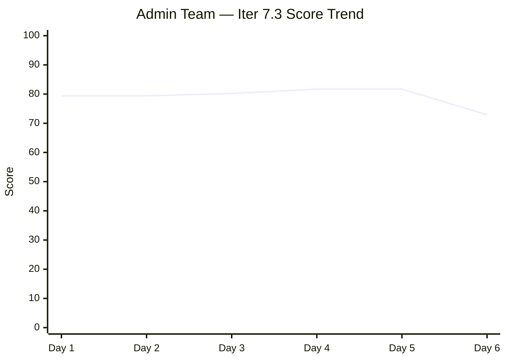
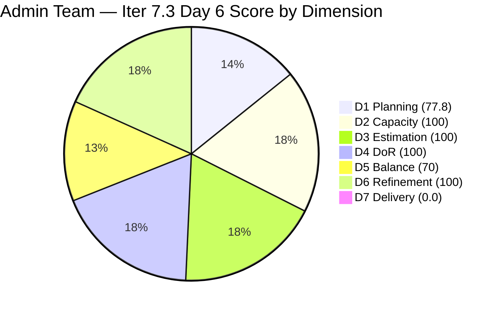
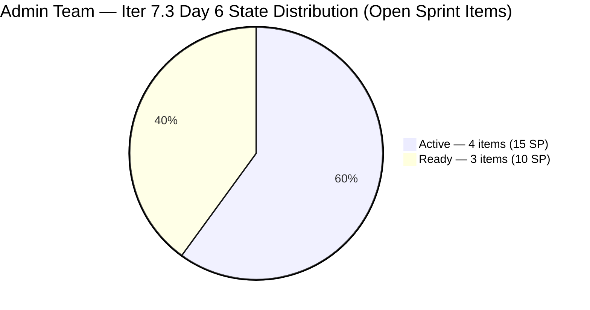
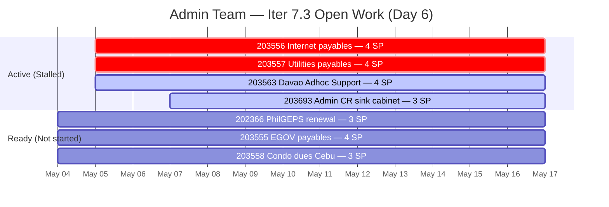

# ADO SAFe Iteration Audit — Administration Team

**Audit #53 | Iteration 7.3 (May 4 – May 17, 2026) | Day 6 of 14**

---

## 1. Audit Metadata

| Field | Value |
|---|---|
| **Audit Date** | May 9, 2026 — 09:02 UTC |
| **Auditor** | Claude Code (ADO SAFe Audit Agent) |
| **Workspace** | `ado_admin` |
| **ADO Project** | Jairosoft FINOPS (`e0bb302f-40f9-46c3-8164-6f1acb317d63`) |
| **Team** | Administration Team (`a38a9c02-07ab-483d-a1e3-aff54e19e603`) |
| **Iteration** | Iteration 7.3 — May 4 to May 17, 2026 |
| **Iteration ID** | `d76b8de5-94fe-4b28-987a-263d56afd8d4` |
| **Sprint Day** | Day 6 of 14 |
| **Prior Audit** | AUDIT_20260508_0902.md (Audit #52, 81.7 — Low Risk, Day 5) |
| **Scoring Model** | ADO SAFe v1 (7-dimension rubric) |
| **Overall Score** | **72.9 / 100** |
| **Risk Band** | **Moderate Risk** (60–79.9) |

> **Live ADO data confirmed.** Backlog API returns 9 visible root items (Administration Team, `Microsoft.RequirementCategory`) — unchanged from Days 1–5. 7 items remain in Iteration 7.3; 2 items (#203716, #203717) remain correctly staged for future iterations. **No new closures on Day 6.** All 7 open sprint items retain their Day 5 states. #203556 and #203557 remain Active since May 5 — now stalled 4 days. D7 = 0.0 against the 25 SP remaining in the open backlog (committed_sp denominator per rubric: sum of SP on API-visible current-iteration items = 25 SP; 5 previously closed items have dropped from the backlog API, reducing the scored base). Score drops from 81.7 (Day 5) to 72.9 due to D7 resetting to 0.0 on the remaining-open-item base.

---

## 2. Executive Summary

The Administration Team drops to **72.9 / 100 — Moderate Risk** on Day 6 of Iteration 7.3. This represents a **-8.8 point decline** from Day 5 (81.7). The score drop is driven entirely by a D7 mechanics shift: as the 5 closed items (8 SP) dropped from the backlog API, the scoring denominator reset to the 25 SP remaining in open items. With 0 of the 7 remaining open items in Closed state, D7 = 0.0 under the strict rubric formula.

**The practical situation is more nuanced:** Mark delivered 8 SP (5 items) in Days 1–4 and has been stalled for 2 days. The Moderate Risk band reflects the delivery gap on remaining items, not a regression in prior work quality. 25 SP remain across 7 open items (Days 6–14 = 9 remaining sprint days), requiring 2.8 SP/day to close all remaining scope — achievable but demanding.

**Critical urgency today (Day 6):** #203556 (Internet payables, 4 SP) and #203557 (Utilities payables, 4 SP) have been Active since Day 2 (May 5) with no visible progress for 4 days. Closing both today adds 8 SP to D7: D7 = round(8/25×100,1) = 32.0 → Overall = round((77.8+100+100+100+70+100+32.0)/7,1) = **82.8 — Low Risk recovered**.

---

## 3. Previous Audit Delta

| Dimension | Audit #52 (May 8) — Day 5 | Audit #53 (May 9) — Day 6 | Delta | Driver |
|---|---|---|---|---|
| Iteration Planning | 77.8 | 77.8 | 0.0 | 7 sprint items / 9 visible — unchanged |
| Team Capacity | 100.0 | 100.0 | 0.0 | Mark Colina: 5 hrs/day, 0 days off — unchanged |
| Estimation | 100.0 | 100.0 | 0.0 | All 7 open sprint items retain SP |
| DoR Compliance | 100.0 | 100.0 | 0.0 | All 7 items pass DoR — unchanged |
| Work Item Balance | 70.0 | 70.0 | 0.0 | US 6/7=85.7% > 60%; structural penalty unchanged |
| Backlog Refinement | 100.0 | 100.0 | 0.0 | All 9 visible items changed May 4–7; within 45-day window |
| Delivery Predictability | 24.2 | **0.0** | **-24.2** | 5 closed items (8 SP) dropped from backlog API; new denominator = 25 SP open; 0 closed items in API-visible set |
| **Overall** | **81.7** | **72.9** | **-8.8** | **Moderate Risk — D7 denominator reset; Mark must close items today to recover** |

### Score Trend — Iteration 7.3

| Audit | Overall | Risk Band | Key Event |
|---|---|---|---|
| 7.2 Close (May 3) | 95.7 | Low | Sprint close |
| 7.3 Day 1 (May 4) | 79.4 | Moderate | Sprint start; 9 items visible |
| 7.3 Day 2 (May 5) | 79.4 | Moderate | No closures |
| 7.3 Day 3 (May 6) | 80.2 | Low | Minor D7 credit |
| 7.3 Day 4 (May 7) | 81.7 | Low | 4 items closed in burst |
| 7.3 Day 5 (May 8) | 81.7 | Low | No new closures |
| 7.3 Day 6 (May 9) | **72.9** | **Moderate** | **D7 denominator reset; 0 closures since Day 4** |

---

## 4. Current Iteration Snapshot

| Metric | Value |
|---|---|
| **Visible root backlog items (API)** | 9 |
| **Current iteration root items (API-visible, open)** | 7 |
| **Full sprint scope (prior tracking)** | 12 items (5 closed Days 1–4, now off-API) |
| **Committed story points (API base)** | 25 SP (7 open items) |
| **Previously delivered** | 8 SP (5 items, Days 1–4 — off-API) |
| **Closed story points (API-visible)** | 0 SP |
| **Sprint progress** | Day 6 of 14 — 43% time elapsed |
| **Assignee** | Mark Colina (sole contributor) |
| **Bus factor** | 1 — persistent structural risk |
| **Day 6 closures** | 0 — no state transitions from Day 5 to Day 6 |
| **Days since last closure** | 2 (last closure: May 7) |

### State Distribution — Day 6 (7 API-visible open sprint items)

| State | Count | SP |
|---|---|---|
| Active | 4 | 15 (203556=4, 203557=4, 203563=4, 203693=3) |
| Ready | 3 | 10 (202366=3, 203555=4, 203558=3) |
| **Total (open)** | **7** | **25** |

### Delivery Trajectory — Day 6

---

## 5. Work Item Analysis

### Open Sprint Items — Day 6 State (7 items)

| ID | Title | Type | State | SP | DoR | Changed | Stall |
|---|---|---|---|---|---|---|---|
| **203556** | Payables — Internet for Davao and Cebu | User Story | Active | 4 | PASS | May 5 | **4 days** |
| **203557** | Utilities payables for Cebu and Davao | User Story | Active | 4 | PASS | May 5 | **4 days** |
| 203563 | Davao Admin Adhoc Support May 4–17 | User Story | Active | 4 | PASS | May 5 | 4 days |
| 203693 | Admin CR sink cabinet | Defect | Active | 3 | PASS | May 7 | 2 days |
| **202366** | PhilGeps renewal for 2026 | User Story | Ready | 3 | PASS | May 4 | Not yet started |
| 203555 | Government (EGOV) payables | User Story | Ready | 4 | PASS | May 4 | Not yet started |
| 203558 | Condo dues (Cebu) payables | User Story | Ready | 3 | PASS | May 4 | Not yet started |

**Previously closed (off-API):** #203651 (2 SP, May 6), #203644 (2 SP, May 7), #203628 (1 SP, May 7), #203637 (1 SP, May 7), #203560 (2 SP, May 7) — 5 items, 8 SP total.

### DoR Assessment — All 7 Open Items PASS

| ID | Desc Chars | AC Chars | Verdict |
|---|---|---|---|
| 203556 | >400 (billing accuracy, contract compliance) | >200 (2 criteria) | PASS |
| 203557 | >600 (billing monitoring, payment, records) | >200 (2 criteria) | PASS |
| 203563 | >350 (adhoc admin scope) | >300 (3 criteria) | PASS |
| 203693 | >250 (sink cabinet specs) | >400 (10-point AC) | PASS |
| 202366 | >800 (PhilGEPS renewal detail) | >700 (3-criteria with sub-items) | PASS |
| 203555 | >300 (EGOV payment scope) | >150 (2 criteria) | PASS |
| 203558 | >600 (condo dues scope) | >500 (7-criteria) | PASS |

### Stall Analysis — Day 6

| ID | Title | State | SP | Active Since | Days Stalled |
|---|---|---|---|---|---|
| 203556 | Internet payables (Davao/Cebu) | Active | 4 | May 5 | **4 days** |
| 203557 | Utilities payables (Cebu/Davao) | Active | 4 | May 5 | **4 days** |
| 203563 | Davao Admin Adhoc Support | Active | 4 | May 5 | 4 days |

**Threshold alert:** #203556 and #203557 have been Active for 4 consecutive days with no ChangedDate movement. For recurring payment workflows (billing statement receipt, charge verification, payment processing, receipt archival) this stall length signals either a process block or work deferral. Day 6 is the escalation threshold for these items.

---

## 6. SAFe Compliance Scorecard

| Dimension | Score | Evidence | Notes |
|---|---|---|---|
| D1 Iteration Planning | 77.8 | 7 sprint items / 9 visible backlog items | Stable; 2 future-iteration items correctly excluded |
| D2 Team Capacity | 100.0 | 1 / 1 contributor with positive capacity | Mark Colina: 5 hrs/day, 0 days off |
| D3 Estimation | 100.0 | 7 / 7 open sprint items have SP > 0 | All open items estimated; closed items dropped from scored base |
| D4 DoR Compliance | 100.0 | 7 / 7 open sprint items pass Desc + AC | Rich descriptions and multi-point AC across all items |
| D5 Work Item Balance | 70.0 | 6 US (85.7%) + 1 Defect among 7 items | Has US ✓; US 6/7=85.7% > 60% → **-30**; Spike 0/7=0% ✓; D5 = 70 |
| D6 Backlog Refinement | 100.0 | 9/9 items changed May 4–7; all within 45-day window | stale_90=0; stale_180=0; untouched_current=0 |
| D7 Delivery Predictability | **0.0** | 0 / 25 SP closed in API-visible set | 5 closed items (8 SP) dropped from backlog API; new base = 25 SP open; no Day 6 closures |
| **Overall** | **72.9** | **(77.8+100+100+100+70+100+0)/7** | **Moderate Risk — Mark must close items Day 6 to recover Low Risk** |

**D1 trace:** round(7/9×100,1) = 77.8.
**D5 trace:** Has US → no -40. US=6/7=85.7% > 60% → **-30**. Spike=0/7=0% → no -20. D5 = 100-30 = 70.
**D6 trace:** base=round(9/9×100,1)=100. stale_90=0 (all changed May 4–7, within 90-day threshold since 2026-02-08). stale_180=0. untouched_current=0/7 (all open items changed ≥ May 4). D6=100.
**D7 trace:** committed_sp = sum of SP on estimated_current_items from API-visible backlog = 25 SP (7 open items). closed_sp = 0 (none of the 7 open items are in Closed/Done state). D7 = 0.0.

**Structural note:** The rubric denominator (visible_root_backlog_items) excludes closed items that dropped from the backlog API. 8 SP were delivered Days 1–4 but are not reflected in today's D7 calculation. Score ceiling on open base: round((77.8+100+100+100+70+100+100)/7,1) = round(647.8/7,1) = **92.5**.

---

## 7. Dimension Findings

### D1 — Iteration Planning (77.8 — stable)

D1 remains stable at 77.8. The denominator (9 visible items) is unchanged. The 5 closed items from Days 1–4 have dropped from the backlog API, so they are no longer counted in either numerator or denominator. The 7 open sprint items and 2 future-iteration items (#203716 Iter 7.4, #203717 Iter 7.5) remain. D1 will continue to decline as Mark closes remaining open items and they fall off the backlog.

### D2 — Team Capacity (100.0)

Mark Colina: 5 hrs/day (Deployment 1 + Documentation 2 + Requirements 2), 0 days off. Capacity unchanged. D2 = 100.

### D3 — Estimation (100.0)

All 7 open sprint items have story points. D3 = 100.

### D4 — DoR Compliance (100.0)

All 7 open sprint items pass DoR minimums. Multiple items (especially #202366 PhilGEPS and #203558 Condo dues) have exceptional multi-criteria acceptance criteria. D4 = 100.

### D5 — Work Item Balance (70.0 — structural, locked)

6 User Stories + 1 Defect. US share 85.7% > 60% → -30 penalty persists. Spike share 0% → no -20. D5 = 70. This is locked for the sprint; the two Spikes that would have improved D5 (#203628, #203637) were closed on Day 4 and are off-API. Address in Iter 7.4 planning.

### D6 — Backlog Refinement (100.0)

All 9 API-visible items have ChangedDate within the 45-day fresh window (earliest May 4, latest May 7). No stale_90 items. No stale_180 items. All 7 open current-iteration items were touched on or after May 4 (sprint start) — zero untouched current items. D6 = 100.

### D7 — Delivery Predictability (0.0 — denominator reset, escalation required)

**Day 6 is the escalation threshold for stalled Active items.** No items have been closed since Day 4 (May 7 06:06 UTC was the last ADO closure event). The D7 denominator has reset to 25 SP (the 7 open items visible in the backlog API) because closed items dropped out. Under the rubric, D7 = 0/25 = 0.0.

**Score recovery projections (Day 6 targets):**
- Close #203556 + #203557 (8 SP): D7 = round(8/25×100,1) = 32.0 → Overall = round((77.8+100+100+100+70+100+32.0)/7,1) = **82.8 (Low Risk)**
- Close #203563 (4 SP) additionally: D7 = round(12/25×100,1) = 48.0 → Overall = round((77.8+100+100+100+70+100+48.0)/7,1) = **85.1 (Low Risk)**
- Close all Active (15 SP): D7 = round(15/25×100,1) = 60.0 → Overall = **89.7**
- Full sprint close (25 SP): D7 = 100.0 → Overall = 92.5

---

## 8. Risks and Bottlenecks

| Risk | Severity | Status |
|---|---|---|
| **#203556 Internet payables (4 SP) — Active 4 days** | **Critical** | Stalled since May 5. Day 6 = escalation threshold. Must close today. Recurring payment workflow with established billing cycle — no evident blocker. |
| **#203557 Utilities payables (4 SP) — Active 4 days** | **Critical** | Same stall pattern as #203556. Electricity/water/internet for two offices. Must close today. |
| **Score dropped to Moderate Risk (72.9)** | **High** | D7 denominator reset; Low Risk requires closing at least 8 SP today (both payables). |
| **#202366 PhilGEPS renewal — government compliance** | **High** | Still in Ready. PhilGEPS government procurement registration has a calendar-year renewal window. Mark must verify expiry date and activate today — government compliance risk if missed. |
| **43% time elapsed, 0% SP closed (API-base)** | **High** | Against the 25-SP open base, recovery pace is demanding: 2.8 SP/day needed to clear all remaining scope by Day 14. |
| **Single contributor (Mark Colina) — bus factor 1** | Moderate | All 25 SP dependent on Mark. Two-day work pause (Days 5–6) without explanation or escalation. |
| D5 = 70 — US-dominant composition | Low | Structural sprint artifact; locked. Address in Iter 7.4 planning. |

---

## 9. Prioritized Recommendations

1. **[Day 6 — Critical] Close #203556 (Internet payables, 4 SP) and #203557 (Utilities payables, 4 SP)** — Both items have been Active for 4 days. The payment workflow is: receive billing statement → verify charges against contract → process payment → secure receipt → update accounting record → close item. Mark has all the information needed. Closing both today: D7 = round(8/25×100,1) = 32.0 → Overall = 82.8 (Low Risk recovered). Failure to close by Day 7 is a sprint health signal requiring Ramon's intervention.

2. **[Day 6 — Critical] Verify and activate #202366 (PhilGEPS renewal, 3 SP)** — PhilGEPS government procurement registration has a fixed renewal calendar. Mark must confirm the 2026 renewal window/deadline today. If the deadline falls before May 17 (sprint end), this is the top-priority item regardless of current Active items. Activate immediately and set a completion date in ADO comments.

3. **[Day 6] Close #203563 (Davao Admin Adhoc Support, 4 SP)** — This is a cumulative support story covering the sprint period. Mark should document the adhoc tasks completed (documents processed, vendor coordination, compliance submissions, office coordination) and close the item. It does not require a discrete deliverable milestone — it can close at any point in the sprint once the core sprint-period coverage is documented.

4. **[Day 6–7] Sequentially activate Ready items** — After closing the two payables, activate #203555 (EGOV payables, 4 SP) and #203558 (Condo dues Cebu, 3 SP). These are routine payment workflows similar to #203556/#203557.

5. **[Iter 7.4 Planning] Limit User Story share to ≤ 60%** — Include at least 2 Spikes or Enablers in Iter 7.4's committed scope. Both deferred items (#203716 Signage Materials, #203717 Street Signage) are User Stories, so at least one non-US item must be added during 7.4 planning.

6. **[PI 8 Planning] Address two-day work gap pattern** — Mark delivered a burst of 4 items on Day 4, then went silent for Days 5–6. This alternating pattern (burst then pause) is inefficient for a 14-day sprint with a single contributor. PI 8 planning should target daily closure cadence of 1–2 items rather than burst delivery, to smooth the D7 curve and avoid score volatility.

---

## 10. Evidence Gaps and Limitations

| Gap | Impact | Mitigation |
|---|---|---|
| **D7 denominator reset** — 5 closed items (8 SP) dropped from backlog API after closing | D7 = 0.0 under rubric despite actual 8 SP delivered in Days 1–4; creates artificial score drop from 81.7 to 72.9 | Structural ADO backlog API behavior; prior audit baseline (Audit #52) documented D7=24.2 against 33-SP full-sprint denominator; gap noted explicitly |
| No ADO activity on Days 5–6 visible to audit | Cannot confirm whether Mark is blocked, delayed, or working offline | Day 6 recommendation: escalate if #203556/#203557 not closed by Day 7 09:00 UTC |
| #203556 and #203557 — no comment data available | Cannot determine if Mark has an undocumented blocker on these items | Mark should add ADO comment with status/blocker description today |
| D5 scored on 7 open items only | Sprint composition has evolved; structural US dominance locked | Full sprint composition documented in Work Item Analysis |
| Bus factor 1 (Mark Colina) | All 25 remaining SP dependent on single contributor with unexplained 2-day pause | Structural risk; consistently documented across audit series |
