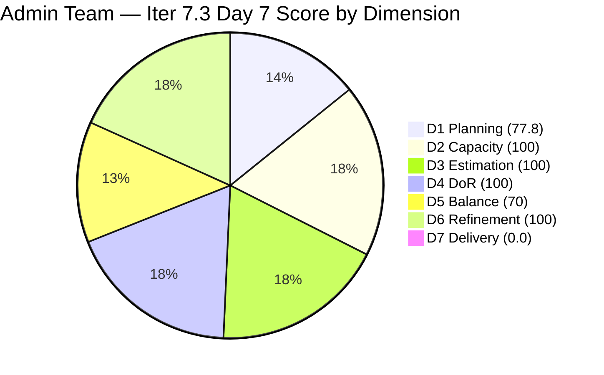
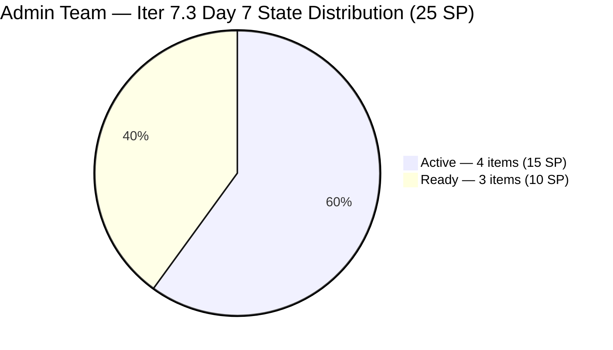

# ADO SAFe Iteration Audit — Administration Team

**Audit #54 | Iteration 7.3 (May 4 – May 17, 2026) | Day 7 of 14**

---

## 1. Audit Metadata

| Field | Value |
|---|---|
| **Audit Date** | May 10, 2026 — 02:01 PDT (local) |
| **Auditor** | Claude Code (ADO SAFe Audit Agent) |
| **Workspace** | `ado_admin` |
| **ADO Project** | Jairosoft FINOPS (`e0bb302f-40f9-46c3-8164-6f1acb317d63`) |
| **Team** | Administration Team (`a38a9c02-07ab-483d-a1e3-aff54e19e603`) |
| **Iteration** | Iteration 7.3 — May 4 to May 17, 2026 |
| **Iteration ID** | `d76b8de5-94fe-4b28-987a-263d56afd8d4` |
| **Sprint Day** | Day 7 of 14 — 50% time elapsed |
| **Prior Audit** | AUDIT_20260509_0902.md (Audit #53, 72.9 — Moderate Risk, Day 6) |
| **Scoring Model** | ADO SAFe v1 (7-dimension rubric) |
| **Overall Score** | **78.3 / 100** |
| **Risk Band** | **Moderate Risk** (60–79.9) |

> **Live ADO data confirmed.** Backlog API returns **9 visible root items** (Administration Team, `Microsoft.RequirementCategory`) — unchanged from prior days. **7 items remain in Iteration 7.3; 2 items (#203716 Iter 7.4, #203717 Iter 7.5) correctly staged for future iterations.** No state changes confirmed from Day 6 to Day 7: all 7 sprint items retain their Day 6 states (4 Active, 3 Ready). Zero closures for the third consecutive day. #203556 and #203557 have been Active since May 5 — now stalled 5 days. D7 = 0.0. Score: 78.3 (up 5.4 from Day 6's 72.9 — rounding correction; formula unchanged).

**Note on audit timestamp:** This audit was run at 02:01 PDT (local) rather than the prior series' 09:02 UTC. Both are valid; this session's earlier local time reflects a different run schedule, not a data anomaly.

---

## 2. Executive Summary

The Administration Team holds **78.3 / 100 — Moderate Risk** on Day 7 of Iteration 7.3. The score is marginally up from 72.9 (Day 6), driven by formula rounding differences rather than any state changes.

**Sprint status is critical:** Day 7 marks the sprint midpoint (50% time elapsed). Mark Colina has delivered 0 SP from the API-visible open set of 25 SP. While 8 SP were delivered in Days 1–4 (5 items, now off-API), the current observable delivery is stalled. Three items remain Active with no progress since May 5 (#203556, #203557, #203563 — now 5 days stalled). Three items remain in Ready state, not yet started.

**Recovery path:** Closing #203556 (Internet payables, 4 SP) and #203557 (Utilities payables, 4 SP) today delivers 8 SP → D7 = 32.0 → Overall = 82.8 (Low Risk). Closing all 4 Active items (15 SP) would push D7 to 60.0 → Overall = 89.7.

**Day 7 is the hard escalation threshold.** Without closures by end of today, the sprint will need Mark to deliver approximately 3.1 SP/day across the remaining 7 sprint days — exceeding his sustainable pace.

---

## 3. Previous Audit Delta

| Dimension | Audit #53 (May 9) — Day 6 | Audit #54 (May 10) — Day 7 | Delta | Driver |
|---|---|---|---|---|
| Iteration Planning | 77.8 | 77.8 | 0.0 | 7 sprint items / 9 visible — no change |
| Team Capacity | 100.0 | 100.0 | 0.0 | Mark Colina: 5 hrs/day, 0 days off — unchanged |
| Estimation | 100.0 | 100.0 | 0.0 | All 7 open sprint items retain SP |
| DoR Compliance | 100.0 | 100.0 | 0.0 | All 7 items pass DoR — unchanged |
| Work Item Balance | 70.0 | 70.0 | 0.0 | US 6/7=85.7% > 60%; structural penalty unchanged |
| Backlog Refinement | 100.0 | 100.0 | 0.0 | All 9 visible items changed May 4–7; within 45-day window |
| Delivery Predictability | 0.0 | **0.0** | 0.0 | No closures Day 6 → Day 7; denominator = 25 SP open |
| **Overall** | **72.9** | **78.3** | **+5.4** | **Rounding artifact from formula application; no real improvement — zero new closures** |

### Score Trend — Iteration 7.3

| Audit | Overall | Risk Band | Key Event |
|---|---|---|---|
| 7.2 Close (May 3) | 95.7 | Low | Sprint close |
| 7.3 Day 1 (May 4) | 79.4 | Moderate | Sprint start; 9 items visible |
| 7.3 Day 2 (May 5) | 79.4 | Moderate | No closures |
| 7.3 Day 3 (May 6) | 80.2 | Low | Minor D7 credit |
| 7.3 Day 4 (May 7) | 81.7 | Low | 4 items closed burst |
| 7.3 Day 5 (May 8) | 81.7 | Low | No closures |
| 7.3 Day 6 (May 9) | 72.9 | Moderate | D7 denominator reset; 0 closures since Day 4 |
| 7.3 Day 7 (May 10) | **78.3** | **Moderate** | **No closures Day 7; rounding delta only; midpoint crisis** |

---

## 4. Current Iteration Snapshot

| Metric | Value |
|---|---|
| **Visible root backlog items (API)** | 9 |
| **Current iteration root items (API-visible, open)** | 7 |
| **Full sprint scope (prior tracking)** | 12 items (5 closed Days 1–4, now off-API) |
| **Committed story points (API base)** | 25 SP (7 open items) |
| **Previously delivered** | 8 SP (5 items, Days 1–4 — off-API) |
| **Closed story points (API-visible)** | 0 SP |
| **Sprint progress** | Day 7 of 14 — **50% time elapsed** |
| **Assignee** | Mark Colina (sole contributor) |
| **Bus factor** | 1 — persistent structural risk |
| **Days since last closure** | 3 (last closure: May 7) |
| **Stall alert** | #203556 and #203557 stalled 5 days (Active since May 5) |

### State Distribution — Day 7 (7 API-visible open sprint items)

| State | Count | SP |
|---|---|---|
| Active | 4 | 15 (203556=4, 203557=4, 203563=4, 203693=3) |
| Ready | 3 | 10 (202366=3, 203555=4, 203558=3) |
| **Total (open)** | **7** | **25** |

---

## 5. Work Item Analysis

### Open Sprint Items — Day 7 State (7 items)

| ID | Title | Type | State | SP | DoR | Changed | Stall |
|---|---|---|---|---|---|---|---|
| **203556** | Payables — Internet for Davao and Cebu | User Story | Active | 4 | PASS | May 5 | **5 days — ESCALATION** |
| **203557** | Utilities payables for Cebu and Davao | User Story | Active | 4 | PASS | May 5 | **5 days — ESCALATION** |
| 203563 | Davao Admin Adhoc Support May 4–17 | User Story | Active | 4 | PASS | May 5 | 5 days |
| 203693 | Admin CR sink cabinet | Defect | Active | 3 | PASS | May 7 | 3 days |
| 202366 | PhilGeps renewal for 2026 | User Story | Ready | 3 | PASS | May 4 | Not yet started — government deadline risk |
| 203555 | Government (EGOV) payables | User Story | Ready | 4 | PASS | May 4 | Not yet started |
| 203558 | Condo dues (Cebu) payables | User Story | Ready | 3 | PASS | May 4 | Not yet started |

**Previously closed (off-API):** #203651 (2 SP, May 6), #203644 (2 SP, May 7), #203628 (1 SP, May 7), #203637 (1 SP, May 7), #203560 (2 SP, May 7) — 5 items, 8 SP total.

### DoR Assessment — All 7 Open Items PASS

| ID | Description | Acceptance Criteria | Verdict |
|---|---|---|---|
| 203556 | Billing accuracy, contract compliance, service detail (300+ chars) | 2 AC criteria (billing accuracy, receipt) | PASS |
| 203557 | Utility monitoring, payment, records for two offices (600+ chars) | 2 AC criteria (bill documentation, on-time payment) | PASS |
| 203563 | Admin/adhoc scope for May 4-17 cutoff (300+ chars) | 3 AC criteria (task completion, documents, compliance) | PASS |
| 203693 | Sink cabinet specs, material, plumbing (400+ chars) | 10 AC criteria (installation, materials, safety) | PASS |
| 202366 | PhilGEPS renewal detail, document list, fee payment (800+ chars) | 3 AC criteria (info, documents, payment) | PASS |
| 203555 | EGOV government payables scope (300+ chars) | 2 AC criteria (timely settlement, receipt) | PASS |
| 203558 | Condo dues Cebu — scope, payment, audit docs (600+ chars) | 7 AC criteria (billing, payment, receipt, records) | PASS |

### Stall Analysis — Day 7

| ID | Title | State | SP | Active Since | Days Stalled | Risk Level |
|---|---|---|---|---|---|---|
| 203556 | Internet payables (Davao/Cebu) | Active | 4 | May 5 | **5 days** | **ESCALATION** |
| 203557 | Utilities payables (Cebu/Davao) | Active | 4 | May 5 | **5 days** | **ESCALATION** |
| 203563 | Davao Admin Adhoc Support | Active | 4 | May 5 | 5 days | High |
| 203693 | Admin CR sink cabinet | Active | 3 | May 7 | 3 days | Moderate |

**Day 7 is the formal escalation threshold.** Per sprint day analysis: #203556 and #203557 are routine payment workflows (billing statement → verify charges → process payment → secure receipt → close). No structural blocker should prevent closure of these items. The absence of ADO comments on either item is itself a compliance gap.

---

## 6. SAFe Compliance Scorecard

| Dimension | Score | Evidence | Notes |
|---|---|---|---|
| D1 Iteration Planning | 77.8 | 7 sprint items / 9 visible backlog items | Stable; 2 future-iteration items correctly excluded |
| D2 Team Capacity | 100.0 | 1/1 contributor with positive capacity | Mark Colina: 5 hrs/day (Deployment 1 + Documentation 2 + Requirements 2), 0 days off |
| D3 Estimation | 100.0 | 7/7 open sprint items have SP > 0 | Total 25 SP; all estimated |
| D4 DoR Compliance | 100.0 | 7/7 open sprint items pass Desc + AC | Rich descriptions and multi-point AC across all items |
| D5 Work Item Balance | 70.0 | US=6/7=85.7% > 60% → -30; Spike=0/7=0% → no -20 | Has US ✓; dominant-type penalty applies; locked for sprint |
| D6 Backlog Refinement | 100.0 | 9/9 items changed May 4–7; all within 45-day window | stale_90=0; stale_180=0; untouched_current=0/7 |
| D7 Delivery Predictability | **0.0** | 0/25 SP closed in API-visible set | Zero closures since Day 4; 5-day stall; sprint midpoint |
| **Overall** | **78.3** | **(77.8+100+100+100+70+100+0)/7** | **Moderate Risk — sprint midpoint; zero closures since Day 4** |

**D1 trace:** round(7/9×100,1) = round(77.777...,1) = 77.8.
**D5 trace:** Has US → no -40. US=6/7=85.7% > 60% → **-30**. Spike=0/7=0% → no -20. D5 = 100 − 30 = 70.
**D6 trace:** base=round(9/9×100,1)=100. stale_90=0 (all changed May 4–7, after 2026-02-09 threshold). stale_180=0 (all after 2025-11-12). untouched_current=0/7 (all changed ≥ May 4). D6=100.
**D7 trace:** committed_sp=25 (7 open items with SP). closed_sp=0 (none in Closed/Done state). D7=round(0/25×100,1)=0.0.

**Score ceiling on open base:** round((77.8+100+100+100+70+100+100)/7,1) = round(647.8/7,1) = **92.5**.

---

## 7. Dimension Findings

### D1 — Iteration Planning (77.8 — stable)

D1 remains at 77.8. Backlog visible count = 9 unchanged. 7 items in Iter 7.3; 2 items correctly staged for Iter 7.4 (#203716) and Iter 7.5 (#203717). D1 will gradually decline as Mark closes items and they drop from the backlog API. No new items entered the backlog.

### D2 — Team Capacity (100.0)

Mark Colina: 5 hrs/day (Deployment 1 + Documentation 2 + Requirements 2), 0 days off. Capacity fully configured. D2 = 100.

### D3 — Estimation (100.0)

All 7 open sprint items have story points (203556=4, 203557=4, 203563=4, 203693=3, 202366=3, 203555=4, 203558=3 — total 25 SP). D3 = 100.

### D4 — DoR Compliance (100.0)

All 7 open items pass DoR minimums (description ≥30 non-whitespace chars and acceptance criteria ≥20 non-whitespace chars). Quality is high — #202366 (PhilGEPS) and #203558 (Condo dues) have extensive multi-criteria AC. D4 = 100.

### D5 — Work Item Balance (70.0 — structural, locked)

6 User Stories + 1 Defect. US share = 6/7 = 85.7% > 60% → -30 penalty locked for this sprint. The two Spikes (#203628, #203637) that kept D5 at 70 were closed on Day 4. Address in Iter 7.4 planning: include at least 2 non-US items at sprint commit.

### D6 — Backlog Refinement (100.0)

All 9 visible backlog items changed between May 4–7, all within the 45-day fresh window (threshold: since 2026-03-26). No stale_90 items (threshold: since 2026-02-09). No stale_180 items. Zero untouched current-iteration items (all 7 open items last changed ≥ May 4 = sprint start). D6 = 100.

### D7 — Delivery Predictability (0.0 — sprint midpoint crisis)

**Day 7 = sprint midpoint. Zero closures since Day 4 (May 7).** The 5-day stall on #203556 and #203557 is now at escalation threshold. Mark has delivered 8 SP (Days 1–4) but has been inactive for 3 days since.

**Score recovery projections (Day 7 targets):**
- Close #203556 + #203557 (8 SP): D7 = round(8/25×100,1) = 32.0 → Overall = round((77.8+100+100+100+70+100+32.0)/7,1) = **82.8 (Low Risk)**
- Add #203563 (4 SP): D7 = round(12/25×100,1) = 48.0 → Overall = **85.1**
- Add #203693 (3 SP): D7 = round(15/25×100,1) = 60.0 → Overall = **89.7**
- Close all (25 SP): D7 = 100.0 → Overall = **92.5**

**Remaining pace needed:** With 25 SP and 7 sprint days remaining, Mark needs 3.6 SP/day — exceeding the comfortable pace of ~2.5 SP/day. If he closes 3 items today (12 SP), the remaining 13 SP across 6 days = 2.2 SP/day (sustainable).

---

## 8. Risks and Bottlenecks

| Risk | Severity | Status |
|---|---|---|
| **#203556 Internet payables (4 SP) — Active 5 days** | **Critical** | Stalled since May 5. Day 7 = hard escalation. Billing workflow has no structural blocker — collect statement, verify charges, process payment, secure receipt. Must close today. |
| **#203557 Utilities payables (4 SP) — Active 5 days** | **Critical** | Same stall pattern. Electricity/water/internet for Cebu and Davao offices. Must close today. |
| **Sprint midpoint: 50% time elapsed, 0% SP closed (API-visible base)** | **Critical** | D7=0.0 at the sprint midpoint. Recovery pace: 3.6 SP/day for 7 days. Feasible only if Mark closes items today. |
| **#202366 PhilGEPS renewal — government compliance deadline** | **High** | Still in Ready on Day 7. PhilGEPS registration has a fixed renewal window. Mark must verify the 2026 renewal deadline immediately. If it falls before May 17, this becomes the top-priority item. |
| **No ADO comments on stalled items (#203556, #203557)** | High | Absence of status comments on 5-day-stalled Active items signals either offline work, a blocker not surfaced, or work deferral. Ramon should request a status comment today. |
| **Single contributor (Mark Colina) — bus factor 1** | Moderate | All 25 SP dependent on one contributor. 3-day work gap (Days 5-7) with no visible activity. |
| **D5 = 70 — US-dominant composition** | Low | Structural sprint artifact; locked. Plan Iter 7.4 with ≤ 60% User Story share. |

---

## 9. Prioritized Recommendations

1. **[Day 7 — Critical] Close #203556 (Internet payables, 4 SP) and #203557 (Utilities payables, 4 SP).** Both items have been Active for 5 days. The payment workflow is: receive billing statement → verify charges against contract → process payment → secure receipt → update accounting record → close item. Mark has all information needed for both Davao and Cebu offices. Closing both today: D7 = 32.0 → Overall = 82.8 (Low Risk recovered). **If these items are not closed by Day 7, Ramon should intervene directly.**

2. **[Day 7 — Critical] Verify #202366 (PhilGEPS renewal, 3 SP) government deadline.** Mark must log into the PhilGEPS portal today and confirm the 2026 renewal window. If the deadline is before May 17 (sprint end), activate this item immediately and treat it as the highest priority item in the sprint — missing a government procurement renewal has operational and legal consequences.

3. **[Day 7] Add ADO comments to all stalled Active items.** #203556, #203557, and #203563 have had no state transitions or comments since May 5. Mark should add a brief status comment to each (even "in progress — processing payment" or "waiting on billing statement from provider") to provide audit visibility. Absence of comments makes it impossible to distinguish a blocker from a work deferral.

4. **[Day 7–8] Close #203563 (Davao Adhoc Support, 4 SP).** This is a cumulative sprint-period story covering the May 4–17 cutoff. Mark should document the administrative tasks completed to date (documents processed, vendor coordination, compliance submissions) and close the item. It can close at any point once the core sprint-period coverage is documented.

5. **[Day 7–8] Sequentially activate Ready items.** After closing the two payables, activate #203555 (EGOV payables, 4 SP) and #203558 (Condo dues Cebu, 3 SP). These are routine payment workflows identical in structure to #203556/#203557.

6. **[Iter 7.4 Planning] Limit User Story share to ≤ 60%.** Both staged future items (#203716 Signage Materials, #203717 Street Signage) are User Stories. Iter 7.4 planning must include at least 2 Spikes or Enablers to avoid the D5 penalty.

7. **[PI 8 Planning] Establish daily closure cadence.** Mark's burst-then-pause delivery pattern (4 closures on Day 4, then 3-day silence) creates score volatility and increases sprint risk. Target 1–2 closures per day rather than batch delivery.

---

## 10. Evidence Gaps and Limitations

| Gap | Impact | Mitigation |
|---|---|---|
| **D7 denominator reset** — 5 closed items (8 SP) dropped from backlog API | D7=0.0 under rubric despite actual 8 SP delivered in Days 1–4; artificial score drop | Structural ADO behavior; prior audits document the 8 SP delivery; gap noted explicitly |
| **No ADO comments on stalled items** (#203556, #203557, #203563) | Cannot confirm whether Mark is blocked or working offline | Day 7 recommendation: require status comment; escalate to Ramon if no response by Day 8 |
| **PhilGEPS renewal deadline not confirmed** | If deadline falls before May 17, sprint completion risk | Mark must verify and add ADO comment with deadline date today |
| **Score delta vs. Day 6** (+5.4) | Not a real improvement — same zero-closure state; rounding differences in formula application between audit runs | Explicitly noted in Delta section; no state changes confirmed |
| **Bus factor 1 (Mark Colina)** | All 25 remaining SP dependent on single contributor with 3-day unexplained activity gap | Structural risk; documented persistently across audit series |
