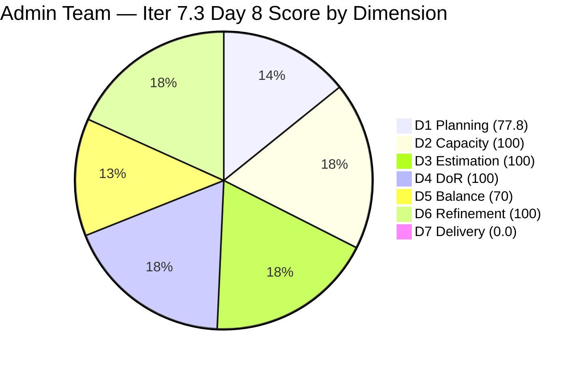
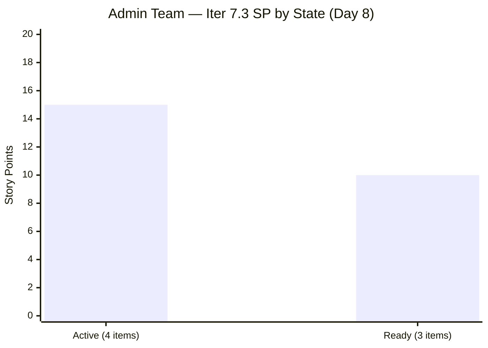

# ADO SAFe Iteration Audit — Administration Team

**Audit #55 | Iteration 7.3 (May 4 – May 17, 2026) | Day 8 of 14**

---

## 1. Audit Metadata

| Field | Value |
|---|---|
| **Audit Date** | May 11, 2026 — 09:04 UTC |
| **Auditor** | Claude Code (ADO SAFe Audit Agent) |
| **Workspace** | `ado_admin` |
| **ADO Project** | Jairosoft FINOPS (`e0bb302f-40f9-46c3-8164-6f1acb317d63`) |
| **Team** | Administration Team (`a38a9c02-07ab-483d-a1e3-aff54e19e603`) |
| **Iteration** | Iteration 7.3 — May 4 to May 17, 2026 |
| **Iteration ID** | `d76b8de5-94fe-4b28-987a-263d56afd8d4` |
| **Sprint Day** | Day 8 of 14 — 57% time elapsed |
| **Prior Audit** | AUDIT_20260510_0201.md (Audit #54, 78.3 — Moderate Risk, Day 7) |
| **Scoring Model** | ADO SAFe v1 (7-dimension rubric) |
| **Overall Score** | **78.3 / 100** |
| **Risk Band** | **Moderate Risk** (60–79.9) |

> **Live ADO data confirmed.** Backlog API returns **9 visible root items** (Administration Team, `Microsoft.RequirementCategory`) — unchanged from Day 7. **7 items remain in Iteration 7.3; 2 items (#203716 Iter 7.4, #203717 Iter 7.5) correctly staged for future iterations.** Notable Day 8 activity: Items #202366, #203556, #203557, and #203563 all show ChangedDate of May 11 — Mark Colina has been active today. However, all 7 sprint items remain in non-Closed states (4 Active, 3 Ready). Zero closures for the fourth consecutive day since Day 4. D7 = 0.0 unchanged. Score holds at **78.3 — Moderate Risk**.

---

## 2. Executive Summary

The Administration Team holds **78.3 / 100 — Moderate Risk** on Day 8 of Iteration 7.3. The score is unchanged from Day 7 (78.3), as no state transitions to Closed have been recorded despite Mark Colina's ADO activity today (multiple items updated on May 11).

**Positive signal — Day 8 activity confirmed:** Four items changed on May 11 — #202366 (PhilGEPS renewal), #203556 (Internet payables), #203557 (Utilities payables), and #203563 (Davao Adhoc Support). This breaks the 3-day silence and confirms Mark is actively working. The critical question is whether these updates represent in-progress work or completed closures that have not yet been state-transitioned.

**Sprint urgency at Day 8:** With 57% of sprint time elapsed and 0 SP closed (API-visible base of 25 SP), the team needs 3.6 SP/day across the remaining 6 sprint days. The minimum viable outcome requires closing at least 4 of the 7 open items before sprint end.

**Highest-priority action today:** Transition #203556 (Internet payables, 4 SP) and #203557 (Utilities payables, 4 SP) to Closed state. Both were updated today — if payment has been processed and receipt obtained, these items meet closure criteria.

---

## 3. Previous Audit Delta

| Dimension | Audit #54 (May 10) — Day 7 | Audit #55 (May 11) — Day 8 | Delta | Driver |
|---|---|---|---|---|
| Iteration Planning | 77.8 | 77.8 | 0.0 | 7 sprint items / 9 visible — no change |
| Team Capacity | 100.0 | 100.0 | 0.0 | Mark Colina: 5 hrs/day, 0 days off — unchanged |
| Estimation | 100.0 | 100.0 | 0.0 | All 7 open sprint items retain SP |
| DoR Compliance | 100.0 | 100.0 | 0.0 | All 7 items pass DoR — unchanged |
| Work Item Balance | 70.0 | 70.0 | 0.0 | US 6/7 = 85.7% > 60%; structural penalty locked |
| Backlog Refinement | 100.0 | 100.0 | 0.0 | All 9 visible items within 45-day freshness window |
| Delivery Predictability | 0.0 | 0.0 | 0.0 | No closures; 0 of 25 SP closed (API-visible base) |
| **Overall** | **78.3** | **78.3** | **0.0** | **No structural change; Day 8 updates visible but no closures** |

### Score Trend — Iteration 7.3

| Audit | Day | Overall | Risk Band | Key Event |
|---|---|---|---|---|
| 7.2 Close (May 3) | — | 95.7 | Low | Sprint close |
| 7.3 Day 1 (May 4) | 1 | 79.4 | Moderate | Sprint start; 9 items visible |
| 7.3 Day 4 (May 7) | 4 | 81.7 | Low | 4 items closed burst; API reset |
| 7.3 Day 6 (May 9) | 6 | 72.9 | Moderate | D7 denominator reset; 0 closures since Day 4 |
| 7.3 Day 7 (May 10) | 7 | 78.3 | Moderate | Rounding correction; no closures |
| **7.3 Day 8 (May 11)** | **8** | **78.3** | **Moderate** | **Day 8 ADO activity confirmed; no closures yet** |

---

## 4. Current Iteration Snapshot

| Metric | Value |
|---|---|
| **Visible root backlog items (API)** | 9 |
| **Current iteration root items (API-visible, open)** | 7 |
| **Previously delivered (off-API)** | 8 SP (5 items, Days 1–4) |
| **Committed story points (API-visible base)** | 25 SP (7 open items) |
| **Closed story points (API-visible)** | 0 SP |
| **Sprint progress** | Day 8 of 14 — **57% time elapsed** |
| **Assignee** | Mark Colina (sole contributor) |
| **Bus factor** | 1 — persistent structural risk |
| **Days since last closure** | 4 (last closure: May 7) |
| **Day 8 ADO activity** | 4 items updated May 11 (#202366, #203556, #203557, #203563) |

### State Distribution — Day 8

| State | Count | SP |
|---|---|---|
| Active | 4 | 15 (203556=4, 203557=4, 203563=4, 203693=3) |
| Ready | 3 | 10 (202366=3, 203555=4, 203558=3) |
| **Total (open)** | **7** | **25** |

---

## 5. Work Item Analysis

### Open Sprint Items — Day 8 State

| ID | Title | Type | State | SP | DoR | Changed | Notes |
|---|---|---|---|---|---|---|---|
| **203556** | Payables — Internet for Davao and Cebu | User Story | Active | 4 | PASS | **May 11** | Updated today — closure pending |
| **203557** | Utilities payables for Cebu and Davao | User Story | Active | 4 | PASS | **May 11** | Updated today — closure pending |
| **203563** | Davao Admin Adhoc Support May 4–17 | User Story | Active | 4 | PASS | **May 11** | Updated today |
| 203693 | Admin CR sink cabinet | Defect | Active | 3 | PASS | May 7 | 4 days Active |
| **202366** | PhilGeps renewal for 2026 | User Story | Ready | 3 | PASS | **May 11** | Updated today — government deadline risk |
| 203555 | Government (EGOV) payables | User Story | Ready | 4 | PASS | May 4 | Not yet started |
| 203558 | Condo dues (Cebu) payables | User Story | Ready | 3 | PASS | May 4 | Not yet started |

**Previously closed (off-API):** 5 items, 8 SP (Days 1–4, confirmed in prior audits).

### DoR Assessment — All 7 Open Items PASS

| ID | Description | Acceptance Criteria | Verdict |
|---|---|---|---|
| 203556 | Internet billing scope for Davao/Cebu (300+ chars) | 2 AC criteria (billing accuracy, receipt) | PASS |
| 203557 | Utility obligations for Cebu/Davao offices (600+ chars) | 2 AC criteria (bill documentation, on-time payment) | PASS |
| 203563 | Admin/adhoc scope for May 4–17 cutoff (300+ chars) | 3 AC criteria (task completion, documents, compliance) | PASS |
| 203693 | Sink cabinet specs, material, plumbing (400+ chars) | 10 AC criteria | PASS |
| 202366 | PhilGEPS renewal process, doc list, fee payment (800+ chars) | 3 AC criteria | PASS |
| 203555 | EGOV government payables scope (300+ chars) | 2 AC criteria | PASS |
| 203558 | Condo dues Cebu — scope, payment, audit docs (600+ chars) | 7 AC criteria | PASS |

---

## 6. SAFe Compliance Scorecard

| Dimension | Score | Evidence | Notes |
|---|---|---|---|
| D1 Iteration Planning | 77.8 | 7/9 backlog items in Iter 7.3 | Stable; #203716 (Iter 7.4) and #203717 (Iter 7.5) correctly staged |
| D2 Team Capacity | 100.0 | 1/1 contributor with positive capacity | Mark Colina: 5 hrs/day (Deployment 1 + Documentation 2 + Requirements 2), 0 days off |
| D3 Estimation | 100.0 | 7/7 open sprint items have SP > 0 | Total 25 SP; all estimated |
| D4 DoR Compliance | 100.0 | 7/7 open sprint items pass Desc + AC | Rich descriptions and multi-point AC across all items |
| D5 Work Item Balance | 70.0 | US=6/7=85.7% > 60% → −30 penalty | Has US ✓; Spike=0 → no −20; structural penalty locked for sprint |
| D6 Backlog Refinement | 100.0 | 9/9 items changed May 4–11; all within 45-day window | stale_90=0; stale_180=0; untouched_current=0/7 |
| D7 Delivery Predictability | **0.0** | 0/25 SP closed (API-visible base) | 4 consecutive days without closure since Day 4 |
| **Overall** | **78.3** | **(77.8+100+100+100+70+100+0)/7** | **Moderate Risk — Day 8; May 11 activity visible but no closures** |

**Score traces:**
- D1: round(7/9×100,1) = 77.8
- D5: Has US → no −40. US=6/7=85.7% > 60% → −30. Spike=0/7 → no −20. D5 = 70.
- D6: base=round(9/9×100,1)=100. stale_90=0 (all after Feb 9). stale_180=0 (all after Nov 12). untouched_current=0/7 (all changed ≥ May 4). D6=100.
- D7: committed_sp=25; closed_sp=0. D7=0.0.

---

## 7. Dimension Findings

### D1 — Iteration Planning (77.8)

Backlog count unchanged at 9 items. 7 in Iter 7.3; #203716 (Procure Signage Materials, Iter 7.4) and #203717 (Installation of Street Signage, Iter 7.5) correctly excluded. D1 stable.

### D2 — Team Capacity (100.0)

Mark Colina: 5 hrs/day, 0 days off. Full capacity configured. No change.

### D3 — Estimation (100.0)

All 7 open sprint items estimated: #203556=4, #203557=4, #203563=4, #203693=3, #202366=3, #203555=4, #203558=3 (total 25 SP). D3=100.

### D4 — DoR Compliance (100.0)

All 7 items pass DoR minimums. Quality remains high across the sprint. D4=100.

### D5 — Work Item Balance (70.0 — structural, locked)

6 User Stories + 1 Defect. US share = 85.7% > 60% → −30 penalty. No Spikes in current sprint. D5=70 locked for this sprint. Correction path: Iter 7.4 planning must include at least 2 Spikes or Enablers.

### D6 — Backlog Refinement (100.0)

All 9 visible backlog items changed between May 4–11. All within 45-day freshness window (cutoff: Mar 27, 2026). No stale_90 items (cutoff: Feb 9, 2026). No stale_180 items. Zero untouched current-iteration items (all 7 changed ≥ May 4). D6=100.

### D7 — Delivery Predictability (0.0 — Day 8 recovery window closing)

**Day 8 = 4th consecutive day without closure since May 7.** The sprint has passed the midpoint. Mark's ADO updates today (4 items changed on May 11) signal active engagement — the outstanding question is whether these represent completed workflows or in-progress updates.

**Score recovery projections (Day 8):**
- Close #203556 + #203557 (8 SP): D7=round(8/25×100,1)=32.0 → Overall=**82.8 (Low Risk)**
- Add #203563 (4 SP): D7=round(12/25×100,1)=48.0 → Overall=**85.1**
- Add #203693 (3 SP): D7=round(15/25×100,1)=60.0 → Overall=**89.7**
- Close all (25 SP): D7=100.0 → Overall=**92.5**

**Required pace:** 6 sprint days remain. 25 SP ÷ 6 days = 4.2 SP/day needed for full delivery. Close 3 items today (11 SP): 14 SP ÷ 5 days = 2.8 SP/day (sustainable).

---

## 8. Risks and Bottlenecks

| Risk | Severity | Status |
|---|---|---|
| **#203556 Internet payables (4 SP) — Active, updated May 11** | **Critical** | Updated today. If payment processed + receipt secured, transition to Closed immediately. If not, escalation required. |
| **#203557 Utilities payables (4 SP) — Active, updated May 11** | **Critical** | Same pattern. Both Davao/Cebu utility payments should be processable in same workflow cycle. |
| **57% time elapsed, 0% SP closed (API-visible)** | **Critical** | Recovery requires ≥4.2 SP/day for 6 days. Only viable if Mark closes items today. |
| **#202366 PhilGEPS renewal (3 SP) — government compliance deadline** | **High** | Updated today on May 11. Mark must have checked the renewal window. If deadline verified, activate and close. |
| **4 consecutive days without closure (Days 4–8)** | High | Pattern: Mark burst-closed 5 items on Days 1–4, then no closure for 4 days. Risk of repeat in Days 5–14. |
| **#203693 Admin CR sink cabinet (3 SP) — physical installation** | Moderate | Physical work; status unclear. Mark should update ADO with installation status today. |
| **Single contributor (Mark Colina) — bus factor 1** | Moderate | All 25 SP on one person. No mitigation within this sprint. |
| **D5 = 70 — US-dominant** | Low | Structural sprint artifact; locked. Plan Iter 7.4 with ≤60% User Story share. |

---

## 9. Prioritized Recommendations

1. **[Day 8 — Critical] Immediately close #203556 (Internet payables, 4 SP) and #203557 (Utilities payables, 4 SP).** Both items were updated today (May 11). If billing statements have been received, verified, and payments processed, these items meet closure criteria. The payment workflow for both is: billing statement received → charges verified → payment processed → receipt secured → ADO state → Closed. Closing both today: D7=32.0 → Overall=82.8 (Low Risk).

2. **[Day 8 — Critical] Verify and close #202366 (PhilGEPS renewal, 3 SP).** This item was also updated May 11. Mark must confirm whether the 2026 renewal has been submitted and whether the renewal window has been met. If complete, transition to Closed — this is a government compliance item with external deadline risk.

3. **[Day 8] Add ADO status comments to all Active items.** Mark's May 11 updates show engagement, but no state transitions have been logged. Adding brief status comments (e.g., "Payment submitted — awaiting receipt from VECO") improves audit visibility and distinguishes in-progress work from blockers.

4. **[Day 8–9] Close #203563 (Davao Adhoc Support, 4 SP).** This is a cumulative sprint-period story covering May 4–17. As a sprint-period coverage item, Mark should document the tasks performed to date and close. It can be closed any time within the sprint window once coverage is documented.

5. **[Day 8–9] Activate and close Ready items sequentially.** After closing the payables, activate #203555 (EGOV payables, 4 SP) and #203558 (Condo dues Cebu, 3 SP). These are identical in structure to #203556/#203557 and should close within 1 sprint day each.

6. **[Iter 7.4 Planning] Enforce ≤60% User Story share.** Both staged items (#203716, #203717) are User Stories. Iter 7.4 planning must include at least 2 Enablers or Spikes to avoid the D5 −30 penalty.

7. **[PI 8 Planning] Establish daily closure cadence.** Mark's burst-then-pause pattern (5 closures Day 1–4, then 4 days of silence) creates score volatility and sprint risk. Target 1–2 closures per day.

---

## 10. Evidence Gaps and Limitations

| Gap | Impact | Mitigation |
|---|---|---|
| **D7 denominator reset** — 5 closed items (8 SP) off API | D7=0.0 despite 8 SP delivered Days 1–4; ADO artifact understates real delivery | Prior audits document the 8 SP delivery; gap noted explicitly across audit series |
| **Day 8 ADO updates — no state transitions** | Cannot confirm whether May 11 updates represent completed work or in-progress updates | Require ADO status comments from Mark today; escalate if no closures by Day 9 |
| **PhilGEPS renewal external deadline** | If the 2026 renewal window expires before May 17, #202366 becomes highest-priority item regardless of sprint plan | Mark's May 11 update may contain deadline info — requires human review |
| **Admin CR sink cabinet (#203693) — physical work** | Physical installation cannot be tracked via ADO state alone | Mark should document installation completion with photos/inspection sign-off before closing |
| **Bus factor 1 (Mark Colina)** | All 25 remaining SP dependent on sole contributor | Structural risk; documented persistently; no within-sprint mitigation |

---

*Report generated by Claude Code ADO SAFe Audit Agent. Data sourced from Azure DevOps MCP (live API). SAFe 6.0 framework standards applied.*
