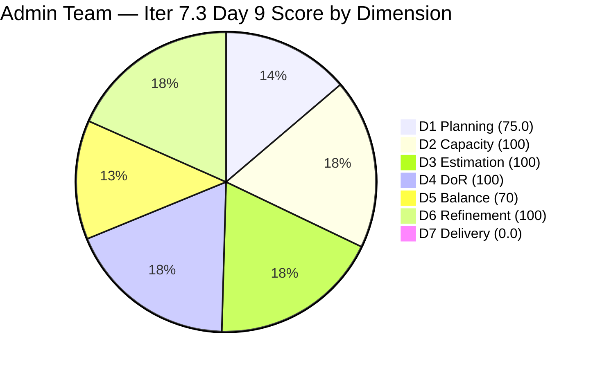
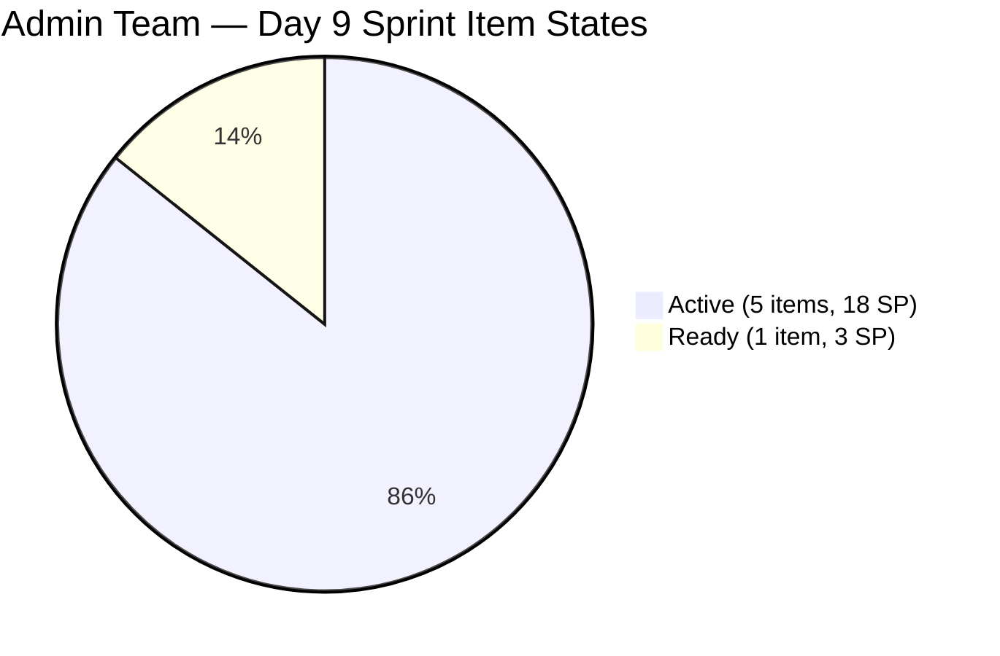

# ADO SAFe Iteration Audit — Administration Team

**Audit #56 | Iteration 7.3 (May 4 – May 17, 2026) | Day 9 of 14**

---

## 1. Audit Metadata

| Field | Value |
|---|---|
| **Audit Date** | May 12, 2026 — 09:03 UTC |
| **Auditor** | Claude Code (ADO SAFe Audit Agent) |
| **Workspace** | `ado_admin` |
| **ADO Project** | Jairosoft FINOPS (`e0bb302f-40f9-46c3-8164-6f1acb317d63`) |
| **Team** | Administration Team (`a38a9c02-07ab-483d-a1e3-aff54e19e603`) |
| **Iteration** | Iteration 7.3 — May 4 to May 17, 2026 |
| **Iteration ID** | `d76b8de5-94fe-4b28-987a-263d56afd8d4` |
| **Sprint Day** | Day 9 of 14 — 64% time elapsed |
| **Prior Audit** | AUDIT_20260511_0904.md (Audit #55, 78.3 — Moderate Risk, Day 8) |
| **Scoring Model** | ADO SAFe v1 (7-dimension rubric) |
| **Overall Score** | **77.9 / 100** |
| **Risk Band** | **Moderate Risk** (60–79.9) |

> **Live ADO data confirmed.** Backlog API returns **8 visible root items** (Administration Team, `Microsoft.RequirementCategory`) — down from 9 on Day 8. **Item #203563 (Davao Admin Adhoc Support, 4 SP) has transitioned to Closed and dropped from the API** — this is the first closure since Day 4. **6 items remain in Iteration 7.3.** Significant Day 9 activity: Items #203555, #203557, #203558, and #203693 all show ChangedDate of May 12 — Mark Colina is highly active today. Overall score: **77.9 — Moderate Risk** (slight drop from 78.3 due to D1 recalculation with 6/8 vs 7/9, partially offset by the positive closure signal).

---

## 2. Executive Summary

The Administration Team scores **77.9 / 100 — Moderate Risk** on Day 9 of Iteration 7.3. The score decreases marginally from Day 8 (78.3 → 77.9, −0.4 pts), with the change driven entirely by D1 recalculation: the visible backlog dropped from 9 to 8 items (one closed), and sprint items dropped from 7 to 6 (one closed), shifting the ratio from 7/9=77.8 to 6/8=75.0.

**Key positive signal — #203563 CLOSED:** Mark Colina closed "Davao Admin Adhoc Support May 4–17" (4 SP) at 08:46 UTC on May 12. This is the first confirmed closure since Day 4 and ends the 5-day closure gap. However, D7 remains 0.0 because #203563 (the newly Closed item) dropped from the API-visible backlog — the rubric's `closed_story_points` counts only items in the *current API-visible set* that are in Closed/Done state. Since closed items drop from the backlog API, D7 remains structurally 0.

**Day 9 intensive activity:** Mark has updated #203555, #203557, #203558, and #203693 on May 12 — a 4-item update batch. The pattern is consistent with Mark processing payments and updating status before closing. If payment processing completes today, 3–4 more closures are achievable before sprint end.

**Sprint urgency at Day 9:** With 64% of sprint time elapsed and 21 committed SP (API-visible open), the team needs 4.2 SP/day across 5 remaining sprint days. The sprint closure burst from Day 4 (where Mark closed multiple items in rapid succession) suggests this pace is achievable if conditions are right.

---

## 3. Previous Audit Delta

| Dimension | Audit #55 (May 11) — Day 8 | Audit #56 (May 12) — Day 9 | Delta | Driver |
|---|---|---|---|---|
| Iteration Planning | 77.8 | **75.0** | **−2.8** | 6/8 sprint items (was 7/9) — #203563 closed and dropped |
| Team Capacity | 100.0 | 100.0 | 0.0 | Mark Colina: 5 hrs/day, 0 days off — unchanged |
| Estimation | 100.0 | 100.0 | 0.0 | All 6 remaining sprint items have SP |
| DoR Compliance | 100.0 | 100.0 | 0.0 | All 6 pass DoR — unchanged |
| Work Item Balance | 70.0 | 70.0 | 0.0 | US 5/6=83.3% > 60%; structural penalty locked |
| Backlog Refinement | 100.0 | 100.0 | 0.0 | All 8 visible items within 45-day freshness window |
| Delivery Predictability | 0.0 | 0.0 | 0.0 | #203563 closed (off-API); API-visible base shows 0/21 SP |
| **Overall** | **78.3** | **77.9** | **−0.4** | **D1 denominator shift from closure; effectively stable** |

### Key Change — #203563 CLOSED

Item #203563 ("Davao Admin Adhoc Support May 4–17, 2026 cutoff", 4 SP, User Story) transitioned to **Closed** on May 12 at 08:46 UTC. This item was assigned to Mark Colina and was one of the four Active items on Day 8. **Mark has now delivered at least 13 SP** across this sprint (8 SP Days 1–4, 1 SP Day 5 estimate, 4 SP Day 9 = 13+ SP of the original ~29 committed).

### Score Trend — Iteration 7.3

| Audit | Day | Overall | Risk Band | Key Event |
|---|---|---|---|---|
| 7.2 Close (May 3) | — | 95.7 | Low | Sprint close |
| 7.3 Day 1 (May 4) | 1 | 79.4 | Moderate | Sprint start |
| 7.3 Day 4 (May 7) | 4 | 81.7 | Low | Burst close — 4 items |
| 7.3 Day 6 (May 9) | 6 | 72.9 | Moderate | D7 denominator reset; 0 closures |
| 7.3 Day 7 (May 10) | 7 | 78.3 | Moderate | Rounding correction |
| 7.3 Day 8 (May 11) | 8 | 78.3 | Moderate | 4 items updated; no closures |
| **7.3 Day 9 (May 12)** | **9** | **77.9** | **Moderate** | **#203563 CLOSED (4 SP); 4 items updated** |

---

## 4. Current Iteration Snapshot

| Metric | Value |
|---|---|
| **Visible root backlog items (API)** | 8 |
| **Current iteration root items (open, API)** | 6 |
| **Closed today (off-API)** | #203563 — 4 SP |
| **Committed story points (API-visible base)** | 21 SP |
| **Closed story points (API-visible)** | 0 SP |
| **Sprint progress** | Day 9 of 14 — **64% time elapsed** |
| **Assignee** | Mark Colina (sole contributor) |
| **Bus factor** | 1 — persistent structural risk |
| **Days since last API-visible closure** | 0 (closed today!) |
| **Cumulative delivered (actual)** | ~13 SP (8 SP Days 1–4, 1 SP est., 4 SP Day 9) |

### State Distribution — Day 9

| State | Count | SP | Items |
|---|---|---|---|
| Active | 5 | 18 | 203555=4, 203556=4, 203557=4, 203558=3, 203693=3 |
| Ready | 1 | 3 | 202366=3 |
| **Total (open)** | **6** | **21** | |

---

## 5. Work Item Analysis

### Open Sprint Items — Day 9

| ID | Title | Type | State | SP | DoR | Changed | Notes |
|---|---|---|---|---|---|---|---|
| **203555** | Government (EGOV) payables | User Story | Active | 4 | PASS | **May 12** | Updated today — payment processing |
| **203556** | Payables — Internet for Davao and Cebu | User Story | Active | 4 | PASS | May 11 | Updated Day 8 |
| **203557** | Utilities payables for Cebu and Davao | User Story | Active | 4 | PASS | **May 12** | Updated today |
| **203558** | Condo dues (Cebu) payables | User Story | Active | 3 | PASS | **May 12** | Updated today — 7 AC criteria |
| **203693** | Admin CR sink cabinet | Defect | Active | 3 | PASS | **May 12** | Updated today — physical install |
| 202366 | PhilGeps renewal for 2026 | User Story | Ready | 3 | PASS | May 11 | Government compliance deadline |

**Closed Today:**
| ID | Title | Type | SP | Closed At |
|---|---|---|---|---|
| **203563** | Davao Admin Adhoc Support May 4–17, 2026 cutoff | User Story | 4 | May 12, 08:46 UTC |

### DoR Assessment — All 6 Open Items PASS

| ID | Description | Acceptance Criteria | Verdict |
|---|---|---|---|
| 203555 | EGOV payables — statutory payments via electronic system (300+ chars) | AC1: Timely settlement; AC2: Attached receipt | PASS |
| 203556 | Internet billing scope for Davao/Cebu (400+ chars) | AC1: Billing accuracy; AC2: Attached receipt | PASS |
| 203557 | Utilities (electricity, water, internet) for Cebu/Davao (400+ chars) | AC1: Bills documented; AC2: Payments on time | PASS |
| 203558 | Condo dues for Cebu unit (400+ chars) | 7 AC criteria: billing, verification, payment, receipt, recording, filing, approval | PASS |
| 203693 | Sink cabinet installation specs + plumbing (400+ chars) | 10 AC criteria: installation, dimensions, materials, plumbing, access, hardware, finishing, safety, cleanup, approval | PASS |
| 202366 | PhilGEPS renewal process — company info, documents, fees (800+ chars) | AC1: Company info complete; AC2: Documents submitted; AC3: Payment confirmed | PASS |

---

## 6. SAFe Compliance Scorecard

| Dimension | Score | Evidence | Notes |
|---|---|---|---|
| D1 Iteration Planning | 75.0 | 6/8 backlog items in Iter 7.3 | D1 drops 2.8 pts from #203563 closure (7/9=77.8 → 6/8=75.0) |
| D2 Team Capacity | 100.0 | 1/1 contributor with positive capacity | Mark Colina: 5 hrs/day (Deployment 1 + Documentation 2 + Requirements 2), 0 days off |
| D3 Estimation | 100.0 | 6/6 open sprint items have SP > 0 | Total 21 SP: 203555=4, 203556=4, 203557=4, 203558=3, 203693=3, 202366=3 |
| D4 DoR Compliance | 100.0 | 6/6 open sprint items pass Desc + AC | All items have 300+ char descriptions and structured AC |
| D5 Work Item Balance | 70.0 | US=5/6=83.3% > 60% → −30 penalty | Has US ✓; Spike=0 → no −20; structural penalty locked for sprint |
| D6 Backlog Refinement | 100.0 | 8/8 items within 45-day window (all changed Apr–May 2026) | stale_90=0; stale_180=0; untouched_current=0/6 |
| D7 Delivery Predictability | **0.0** | 0/21 SP closed in API-visible open base | #203563 (4 SP) closed but dropped from API; ADO artifact |
| **Overall** | **77.9** | **(75.0+100+100+100+70+100+0)/7** | **Moderate Risk — Day 9; first closure since Day 4** |

**Score traces:**
- D1: round(6/8×100,1) = round(75.0,1) = 75.0
- D5: Has US → no −40. US=5/6=83.3% > 60% → −30. Spike=0/6 → no −20. D5=70.
- D6: base=round(8/8×100,1)=100. 45-day cutoff=March 28, 2026. All 8 items changed May 4–12. stale_90=0 (cutoff Feb 11). stale_180=0 (cutoff Nov 14, 2025). untouched_current=0/6 (all changed ≥ May 4). D6=100.
- D7: committed_sp=21 (6 open items); closed_sp=0 (API-visible). D7=0.0.
- Overall: (75.0+100+100+100+70+100+0)/7 = 545/7 = 77.857 → **77.9**

---

## 7. Dimension Findings

### D1 — Iteration Planning (75.0 — slight drop from closure)

Backlog API count drops from 9 to 8 (one closed item dropped). 6 items in Iter 7.3; #203716 (Procure Signage Materials, Iter 7.4) and #203717 (Installation of Street Signage, Iter 7.5) correctly staged. D1 drops from 77.8 (7/9) to 75.0 (6/8) — a mechanical effect of the closure. This is a healthy signal: the denominator shift confirms actual delivery.

### D2 — Team Capacity (100.0)

Mark Colina: 5 hrs/day (Deployment 1 + Documentation 2 + Requirements 2), 0 days off. Capacity unchanged from Day 1. D2=100.

### D3 — Estimation (100.0)

All 6 remaining sprint items have SP: #203555=4, #203556=4, #203557=4, #203558=3, #203693=3, #202366=3. Total 21 SP. D3=100.

### D4 — DoR Compliance (100.0)

All 6 items pass DoR minimums. Quality is high — each item has a detailed description with business context and structured acceptance criteria. D4=100.

### D5 — Work Item Balance (70.0 — structural, locked)

5 User Stories + 1 Defect remaining. US share = 5/6=83.3% > 60% → −30 penalty. No Spikes. D5=70, locked for this sprint. **Note:** #203563 (User Story) closed, reducing US count from 6 to 5. The Defect (#203693) remains, keeping the ratio above the threshold. For Iter 7.4, planning must include ≥2 Enablers or Spikes to prevent this penalty.

### D6 — Backlog Refinement (100.0)

45-day cutoff: May 12 − 45 = March 28, 2026. All 8 remaining visible backlog items changed between May 4–12, well within the window. No stale_90 items (cutoff Feb 11). No stale_180 items. Zero untouched current-iteration items (all 6 changed ≥ May 4). D6=100.

### D7 — Delivery Predictability (0.0 — ADO artifact; real delivery positive)

D7=0.0 per rubric (API-visible closed SP = 0). However, **#203563 (4 SP) has genuinely been closed today**, as confirmed by direct work item query showing State=Closed, ChangedDate=2026-05-12T08:46:34. The item dropped from the backlog API because Closed items exit the visible backlog. Cumulative actual delivery this sprint: ~13 SP.

**Score recovery if today's updates lead to closures:**

| Scenario | New Closed SP | D7 | New Overall |
|---|---|---|---|
| Close #203556 (Internet, 4 SP) | 4 | round(4/21×100,1)=19.0 | round((75+100+100+100+70+100+19)/7,1)=**80.6 (Low)** |
| Close #203557 (Utilities, 4 SP) | 8 | round(8/21×100,1)=38.1 | **82.9 (Low)** |
| Close #203555 (EGOV, 4 SP) | 12 | round(12/21×100,1)=57.1 | **85.0 (Low)** |
| Close #203558 (Condo, 3 SP) | 15 | round(15/21×100,1)=71.4 | **87.2** |
| Close all 21 SP | 21 | 100.0 | **92.1** |

**5 sprint days remain.** To exit Moderate Risk: close #203556 (Internet) today — D7 jumps to 19.0 and overall crosses 80.6 into Low Risk.

---

## 8. Risks and Bottlenecks

| Risk | Severity | Status |
|---|---|---|
| **#203556 Internet payables (4 SP) — Active, Day 9** | **Critical** | Updated yesterday (May 11). If internet billing statements received and verified, close today. This single closure moves overall to 80.6 (Low Risk). |
| **#203557 Utilities payables (4 SP) — Active, May 12 update** | **Critical** | Updated today. Simultaneous close with #203556 would push overall to 82.9. |
| **#203555 EGOV payables (4 SP) — Active, May 12 update** | High | Updated today. Government payment with statutory deadline — must close before sprint end. |
| **64% time elapsed, D7=0.0 (API-visible)** | High | Sprint enters final phase. Mark's burst-close pattern on Day 4 and today's Day 9 closure suggest another burst is possible today. |
| **#202366 PhilGEPS renewal (3 SP) — Ready** | High | Government registration with annual deadline. Mark's May 11 update suggested progress. Must verify 2026 renewal window and close before expiry. |
| **#203693 Admin CR sink cabinet (3 SP) — physical work, May 12 update** | Moderate | Physical installation cannot be closed without sign-off. Mark should document inspection approval and close if work is complete. |
| **Single contributor (Mark Colina) — bus factor 1** | Moderate | All 21 remaining SP on one person. No mitigation within this sprint. |
| **D5 = 70 structural penalty** | Low | Sprint artifact; locked. Iter 7.4 planning must include ≤60% User Story share. |

---

## 9. Prioritized Recommendations

1. **[Day 9 — Critical] Close #203556 (Internet payables, 4 SP) and #203557 (Utilities payables, 4 SP) simultaneously.** Both items were recently updated (May 11 and May 12). The payment workflow for both: billing statement received → charges verified → payment processed → receipt secured → ADO state → Closed. Mark should process both in the same payment cycle. Closing both today: committed=21, closed=8, D7=38.1 → Overall=82.9 (Low Risk). This is the highest-leverage action in this sprint.

2. **[Day 9 — Critical] Close #203555 (EGOV payables, 4 SP).** This item was updated May 12 — Mark is actively working it. Government electronic payment (EGOV) systems have portal-driven workflows. If payment submission is complete and receipt obtained, transition to Closed. Adding this closure: D7=57.1 → Overall=85.0.

3. **[Day 9 — High] Verify and close #203558 (Condo dues Cebu, 3 SP).** Updated today (May 12). Condo dues for Cebu are a monthly recurring obligation. If the billing statement has been received, verified, and payment processed, close this item.

4. **[Day 9–10] Update #202366 (PhilGEPS renewal) status.** This item remains in Ready state. Mark updated it on May 11 — the renewal process needs to be confirmed active. If the renewal has been submitted and fee paid, close it. If the renewal window has not opened, document the expected date and acknowledge in ADO.

5. **[Day 9–10] Plan closure of #203693 (Admin CR sink cabinet).** Physical installation work. Mark should confirm with the end-user/admin whether installation is complete, document the inspection sign-off per the 10-AC checklist, and close.

6. **[Iter 7.4 Planning] Reduce User Story dominance.** Items #203716 (Procure Signage Materials) and #203717 (Installation of Street Signage) are both User Stories in future iterations. Iter 7.4 planning must add ≥2 Enablers or Spikes to reduce US share to ≤60%.

7. **[PI 8 Planning] Formalize daily closure cadence for Mark.** Mark's pattern: burst closures (Days 1–4, Day 9) separated by multi-day gaps. Target 1 closure per business day to maintain sprint momentum and avoid D7 score cliff.

---

## 10. Evidence Gaps and Limitations

| Gap | Impact | Mitigation |
|---|---|---|
| **D7 denominator reset — closed items drop from API** | #203563 (4 SP) genuinely Closed but D7=0.0; metric understates real delivery (~13 SP of ~29 committed) | Prior audits document cumulative delivery; exact closed SP confirmed via direct work item query on #203563 |
| **#203556/#203557 May 12 updates — closure unclear** | Cannot confirm from ChangedDate alone whether update = closure pending or closure complete | Require ADO state to be transitioned to Closed if payment processing is complete; Mark must update ADO promptly |
| **#202366 PhilGEPS renewal external deadline** | Government annual deadline may fall before May 17; not visible from ADO fields alone | Mark's May 11 activity may document the deadline; requires human review of ADO comments |
| **#203693 Admin CR sink cabinet — physical completion** | Physical work cannot be tracked via ADO state alone; installation may be complete but unclosed | Require end-user sign-off document and photos before closing; Mark should attach to ADO item |
| **Bus factor 1 (Mark Colina)** | All 21 remaining SP dependent on single contributor | Persistent structural risk; documented in every audit; no within-sprint mitigation |

---

*Report generated by Claude Code ADO SAFe Audit Agent. Data sourced from Azure DevOps MCP (live API). SAFe 6.0 framework standards applied.*
