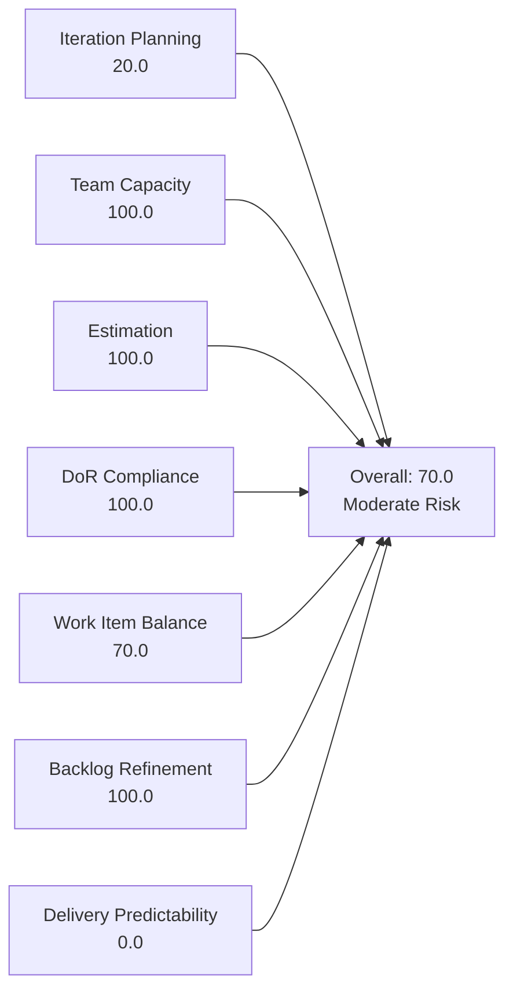
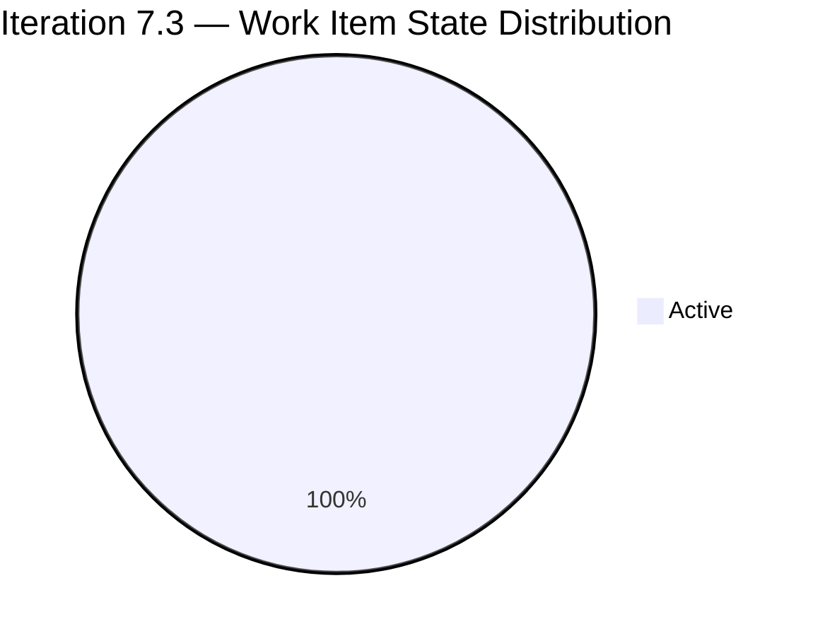
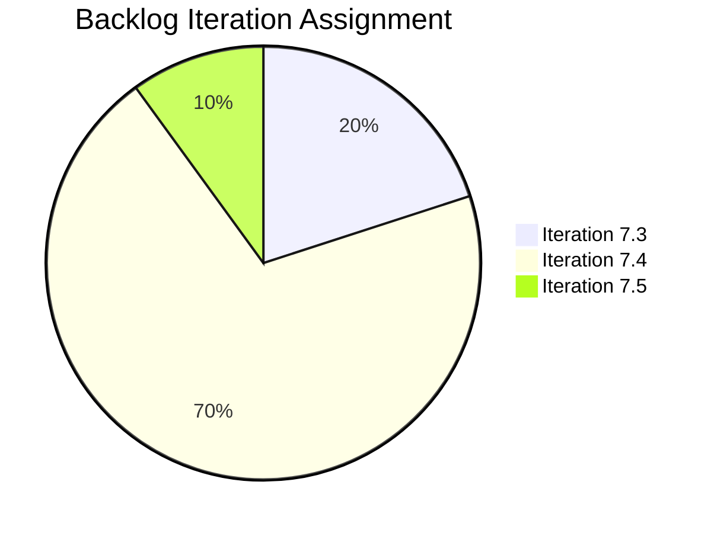

# SAFe Iteration Audit — Administration Team

## 1. Audit Metadata

| Field | Value |
|-------|-------|
| **Project** | Jairosoft FINOPS |
| **Team** | Administration Team |
| **Workspace** | `ado_admin` |
| **ADO Team ID** | a38a9c02-07ab-483d-a1e3-aff54e19e603 |
| **Iteration** | Iteration 7.3 |
| **Iteration Start** | 2026-05-04 |
| **Iteration Finish** | 2026-05-17 |
| **Audit Date** | 2026-05-13 (PHT, UTC+8) |
| **Audit Day** | Day 10 of 14 |
| **Prior Audit** | AUDIT_20260512_0903.md (Audit #56, 77.9 — Moderate Risk, Day 9) |
| **Overall Score** | **70.0 / 100** |
| **Risk Band** | **Moderate Risk** |

---

## 2. Executive Summary

The Administration Team enters Day 10 of Iteration 7.3 with a score of **70.0 / 100 (Moderate Risk)**. The team excels in team capacity configuration, estimation coverage, DoR compliance, and backlog freshness — all scoring 100. The iteration planning load is low (only 2 of 10 backlog items are assigned to this sprint), and delivery predictability is zero because both active sprint items remain in-progress with four days left. The single-contributor bus factor (Mark Colina handles all items) remains a persistent structural risk. The dominant work item type is User Story only, creating a minor balance penalty.

---

## 3. Previous Audit Delta

**Prior audit:** AUDIT_20260512_0903.md — Day 9, Score 77.9 / 100 (Moderate Risk)

| Dimension | Day 9 (May 12) | Day 10 (May 13) | Delta | Driver |
|-----------|---------------|----------------|-------|--------|
| Iteration Planning | 75.0 | **20.0** | **−55.0** | Visible backlog grew (8→10 items); sprint items reduced (6→2); Mark moved items 203555, 203558, 203693 and others from 7.3 to 7.4 |
| Team Capacity | 100.0 | 100.0 | 0.0 | Unchanged |
| Estimation | 100.0 | 100.0 | 0.0 | Unchanged |
| DoR Compliance | 100.0 | 100.0 | 0.0 | Unchanged |
| Work Item Balance | 70.0 | 70.0 | 0.0 | Unchanged — all US |
| Backlog Refinement | 100.0 | 100.0 | 0.0 | All items refreshed |
| Delivery Predictability | 0.0 | 0.0 | 0.0 | No new closures visible in API |
| **Overall** | **77.9** | **70.0** | **−7.9** | Sprint scope reduction drove D1 collapse |

**Key finding:** Between Day 9 and Day 10, Mark Colina moved multiple items from Iteration 7.3 to Iteration 7.4 (203555, 203558, 203693, 203716, 204135, 204136), reducing the sprint commitment from 6 items to 2. This is a significant mid-sprint scope reduction. The two remaining items (203556, 203557) are both active. The prior audit's #203563 (Davao Admin Adhoc Support) closed and dropped from the API prior to this audit.

---

## 4. Current Iteration Snapshot

| Attribute | Value |
|-----------|-------|
| Active Iteration | Iteration 7.3 |
| Sprint Duration | 2026-05-04 to 2026-05-17 (14 days) |
| Audit Day | Day 10 |
| Current Iteration Items | 2 |
| Total Visible Backlog Items | 10 |
| Sprint Load % | 20% |
| Total Committed Story Points | 8 SP |
| Closed Story Points | 0 SP |
| Active Team Members (sprint) | 1 (Mark Colina) |
| Capacity Configured | Yes (5 hrs/day) |

---

## 5. Work Item Analysis

### Current Iteration Items (Iteration 7.3)

| ID | Title | Type | State | Assignee | SP | Description | AC |
|----|-------|------|-------|----------|----|-------------|-----|
| 203556 | Payables - Internet for Davao and Cebu office | User Story | Active | Mark Colina | 4 | ✓ | ✓ |
| 203557 | Utilities payables for Cebu and Davao | User Story | Active | Mark Colina | 4 | ✓ | ✓ |

### Backlog Items Outside Iteration 7.3

| ID | Title | Type | Iteration | State |
|----|-------|------|-----------|-------|
| 202366 | Philgeps renewal for 2026 | User Story | 7.4 | New |
| 203555 | Government (EGOV) payables | User Story | 7.4 | New |
| 203558 | Condo dues (Cebu) payables | User Story | 7.4 | New |
| 203693 | Admin CR sink cabinet | Defect | 7.4 | New |
| 203716 | Procure Signage Materials | User Story | 7.4 | Requirements Gathering |
| 204135 | Canvass at least 3 vendors for panaflex signage | User Story | 7.4 | Requirements Gathering |
| 204136 | Canvass at least 3 vendors for flag pole | User Story | 7.4 | Requirements Gathering |
| 203717 | Installation of Street Signage | User Story | 7.5 | Requirements Gathering |

**Observations:**
- Items 204135 and 204136 are missing both Description and Acceptance Criteria — DoR gap for future sprints.
- All 10 backlog items are assigned to Mark Colina (single contributor).
- Item 203693 is a Defect type classified under Iteration 7.4 admin work — appropriate backlog grooming noted.
- The sprint carries only 8 story points across 2 items, indicating light sprint loading.

---

## 6. SAFe Compliance Scorecard

| Dimension | Score | Evidence | Notes |
|-----------|-------|----------|-------|
| Iteration Planning | 20.0 | 2 of 10 backlog items in Iteration 7.3 | Only 20% of backlog committed this sprint; 8 items deferred to 7.4–7.5 |
| Team Capacity | 100.0 | Mark Colina configured: 1 Deployment + 2 Documentation + 2 Requirements = 5 hrs/day | Single member, fully configured |
| Estimation | 100.0 | Both current items have Story Points (4 SP each) | 2/2 point-eligible items estimated |
| DoR Compliance | 100.0 | Both items have Description ≥30 chars AND Acceptance Criteria ≥20 chars | Full DoR coverage on sprint items |
| Work Item Balance | 70.0 | User Story (2/2 = 100%) — dominant type > 60% penalty -30 | No Spike items; no other types present in sprint |
| Backlog Refinement | 100.0 | All 10 backlog items changed within last 45 days; 0 stale >90 days; 0 untouched in sprint | Excellent refinement hygiene |
| Delivery Predictability | 0.0 | 0 of 8 committed SP closed as of Day 10 | Both items still Active; 4 days remain to close |
| **Overall** | **70.0** | Average of 7 dimensions | **Moderate Risk** |

---

## 7. Dimension Findings

### 7.1 Iteration Planning — 20.0 (High Risk)

Only 2 of 10 backlog items (20%) are committed to Iteration 7.3. The remaining 8 items are staged for Iterations 7.4 and 7.5. While this may reflect intentional sprint scoping, the low commitment ratio limits the team's demonstrated iteration capacity and raises questions about whether more could be pulled forward. On a positive note, all 10 items have been actively maintained.

**Recommendation:** Consider pulling additional ready items from 7.4 into 7.3 if capacity permits, or confirm this 2-item sprint load is intentional and proportionate to Mark's actual availability.

### 7.2 Team Capacity — 100.0 (Low Risk)

Mark Colina is the sole team member with fully configured capacity (5 hrs/day across Deployment, Documentation, and Requirements activities). No days off are recorded for this sprint.

**Risk:** Single-contributor dependency creates bus factor = 1. Any unplanned absence halts all sprint delivery.

### 7.3 Estimation — 100.0 (Low Risk)

Both sprint items are estimated at 4 SP each (8 SP total). Estimation is complete and consistent.

### 7.4 DoR Compliance — 100.0 (Low Risk)

Both sprint items meet the Definition of Ready:
- 203556 has detailed billing accuracy criteria and proof-of-payment AC.
- 203557 has utility coverage criteria and payment deadline AC.

**Note:** Items 204135 ("Canvass at least 3 vendors for panaflex signage") and 204136 ("Canvass at least 3 vendors for flag pole") currently have no Description or AC — these must be groomed before they can enter a future sprint.

### 7.5 Work Item Balance — 70.0 (Moderate Risk)

The sprint consists entirely of User Story items (100% share), triggering a -30 penalty for dominant type share exceeding 60%. This is a minor structural issue — operationally, User Stories are appropriate for administrative payables work. No Spike items are present.

### 7.6 Backlog Refinement — 100.0 (Low Risk)

All 10 backlog items have been updated within the last 45 days. No items are stale at 90 or 180 days. Both current sprint items were updated after the sprint start date (no untouched items). Backlog hygiene is excellent.

### 7.7 Delivery Predictability — 0.0 (Critical — Day 10 status)

As of Day 10, both sprint items (203556 and 203557) remain in "Active" state with 0 SP closed. The team has 4 business days remaining to close 8 SP. Given Mark's 5 hrs/day capacity and the administrative nature of the work (processing payables), closure by May 17 is feasible but requires action now.

This score will recover to 100% if both items are closed before sprint end.

---

## 8. Risks and Bottlenecks

| Risk | Severity | Description |
|------|----------|-------------|
| Bus Factor = 1 | High | Mark Colina is the sole contributor. All work halts if he is unavailable. |
| Late delivery risk | Moderate | 8 SP in Active state on Day 10 with 4 days remaining |
| DoR gap in backlog | Moderate | Items 204135 and 204136 lack Description and AC — not sprint-ready |
| Low iteration commitment | Low | Only 20% of backlog assigned to current sprint |
| Type monoculture | Low | 100% User Story — no engineering or architectural diversity in Admin backlog |

---

## 9. Prioritized Recommendations

1. **Close both active items before May 17.** Items 203556 and 203557 are fully described, acceptance criteria are clear. Mark should prioritize completing both payable tasks to recover Delivery Predictability to 100%.

2. **Groom items 204135 and 204136 before they enter Iteration 7.4.** Add Description (≥30 non-whitespace chars) and Acceptance Criteria (≥20 non-whitespace chars) to both "Canvass vendors" stories now.

3. **Address bus factor risk.** Document a backup process: identify who can take over administrative tasks (payables, vendor management) if Mark is unavailable. Even documenting a manual handover process mitigates risk.

4. **Review sprint load for 7.4.** Seven items are queued for 7.4. Confirm that 7.4 capacity can absorb this load and pre-groom all items with DoR fields before the next sprint planning.

5. **Consider adding a second team member or cross-training.** Even part-time involvement of another person on Admin tasks reduces the single-point-of-failure risk.

---

## 10. Evidence Gaps and Limitations

| Gap | Impact |
|-----|--------|
| No prior PI 7 audit on file | Delta comparison limited to CLAUDE.md historical notes (PI 6 ~55/100) |
| Delivery Predictability is 0 on Day 10 | Not indicative of final sprint outcome — score may recover to 100% by May 17 |
| Items 204135 and 204136 missing Description/AC | These items could not be assessed for DoR; flagged for grooming |

---

## Appendix — Score Visualization

