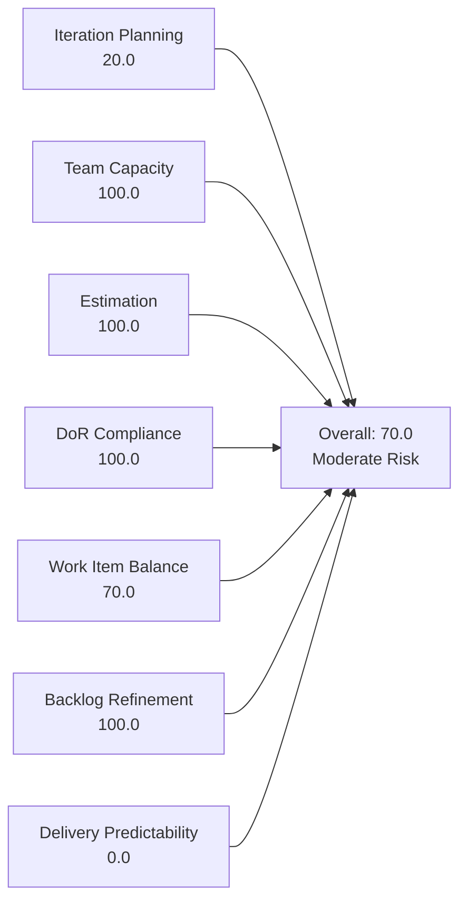
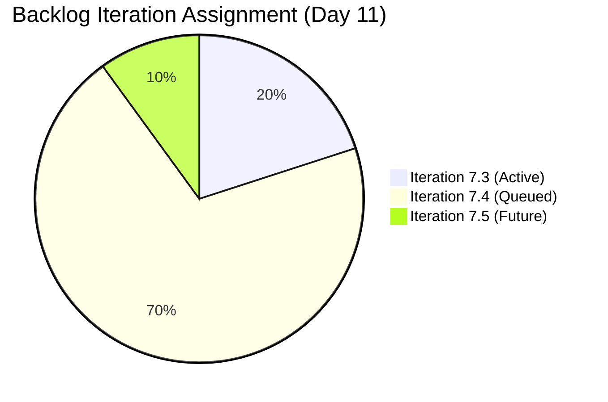
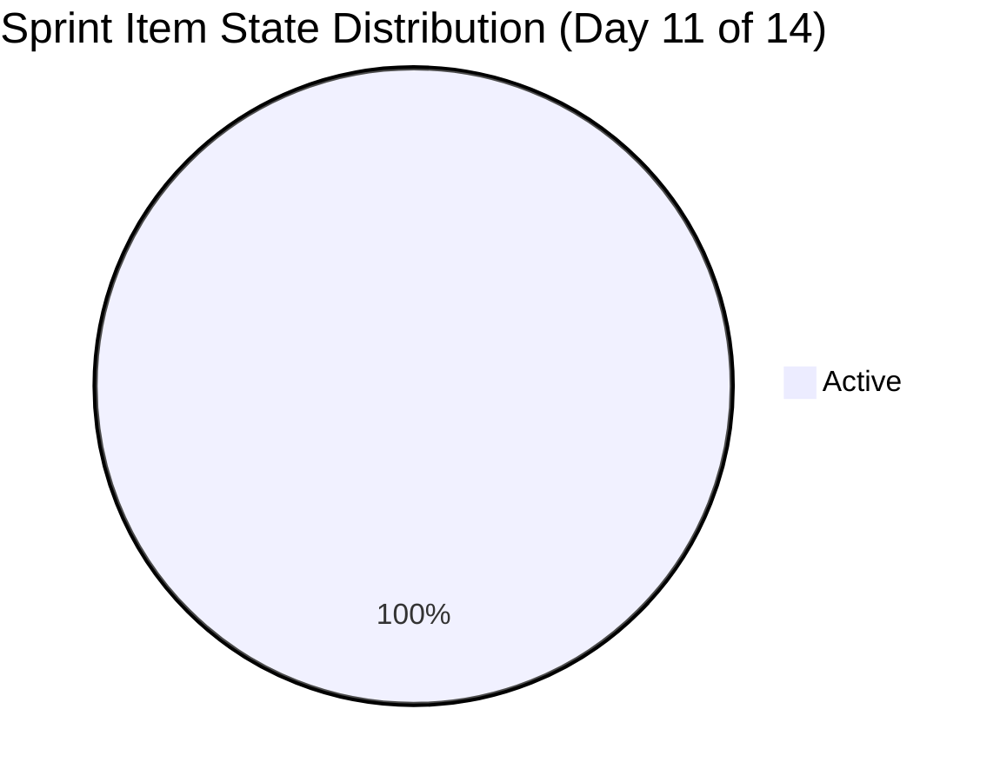

# SAFe Iteration Audit — Administration Team

## 1. Audit Metadata

| Field | Value |
|-------|-------|
| **Project** | Jairosoft FINOPS |
| **Team** | Administration Team |
| **Workspace** | `ado_admin` |
| **ADO Project ID** | e0bb302f-40f9-46c3-8164-6f1acb317d63 |
| **ADO Team ID** | a38a9c02-07ab-483d-a1e3-aff54e19e603 |
| **Iteration** | Iteration 7.3 |
| **Iteration Start** | 2026-05-04 |
| **Iteration Finish** | 2026-05-17 |
| **Audit Date** | 2026-05-14 (CDT) |
| **Audit Day** | Day 11 of 14 |
| **Prior Audit** | AUDIT_20260513_1200.md (Day 10, 70.0 — Moderate Risk) |
| **Overall Score** | **70.0 / 100** |
| **Risk Band** | **Moderate Risk** |

---

## 2. Executive Summary

The Administration Team holds at **70.0 / 100 (Moderate Risk)** on Day 11 of Iteration 7.3 — unchanged from Day 10. The two sprint items (203556 and 203557) remain in Active state with three days left to close 8 SP. Team Capacity, Estimation, DoR Compliance, and Backlog Refinement all remain at 100. Iteration Planning stays at 20.0 due to the same 2-of-10 commitment ratio established after Mark Colina moved items to 7.4 on Day 9. Delivery Predictability remains at 0.0 — the most critical risk entering the final three days of the sprint. The single-contributor bus factor (Mark Colina) is the persistent structural risk.

Items 204135 and 204136, which were missing Description and AC in yesterday's audit, now have both fields populated — a positive grooming improvement.

---

## 3. Previous Audit Delta

**Prior audit:** AUDIT_20260513_1200.md — Day 10, Score 70.0 / 100 (Moderate Risk)

| Dimension | Day 10 (May 13) | Day 11 (May 14) | Delta | Driver |
|-----------|----------------|----------------|-------|--------|
| Iteration Planning | 20.0 | **20.0** | 0.0 | No change in backlog or sprint scope (2 of 10) |
| Team Capacity | 100.0 | **100.0** | 0.0 | Mark Colina configured; unchanged |
| Estimation | 100.0 | **100.0** | 0.0 | Both sprint items estimated; unchanged |
| DoR Compliance | 100.0 | **100.0** | 0.0 | Both sprint items pass DoR |
| Work Item Balance | 70.0 | **70.0** | 0.0 | User Story monoculture; unchanged |
| Backlog Refinement | 100.0 | **100.0** | 0.0 | All 10 items fresh; 204135 and 204136 now have Description + AC |
| Delivery Predictability | 0.0 | **0.0** | 0.0 | Both sprint items still Active; 0 SP closed |
| **Overall** | **70.0** | **70.0** | **0.0** | No change |

**Key finding (Day 11):** Items 204135 ("3 vendors for panaflex signage") and 204136 ("3 vendors for flag pole") — flagged yesterday as DoR gaps — now have Description and Acceptance Criteria. This is a positive backlog grooming action by Mark. Both items remain in Iteration 7.4. No new closures were recorded; the sprint ends on May 17 with 8 SP still open.

---

## 4. Current Iteration Snapshot

| Attribute | Value |
|-----------|-------|
| Active Iteration | Iteration 7.3 |
| Sprint Duration | 2026-05-04 to 2026-05-17 (14 days) |
| Audit Day | Day 11 |
| Current Iteration Root Items | 2 |
| Total Visible Backlog Root Items | 10 |
| Sprint Load % | 20.0% |
| Total Committed Story Points | 8 SP |
| Closed Story Points | 0 SP |
| Active Team Members (sprint) | 1 (Mark Colina) |
| Capacity Configured | Yes (5 hrs/day: 1 Deployment + 2 Documentation + 2 Requirements) |
| Days Off | 0 |

---

## 5. Work Item Analysis

### Current Iteration Items (Iteration 7.3)

| ID | Title | Type | State | Assignee | SP | Description | AC | Changed |
|----|-------|------|-------|----------|----|-------------|-----|---------|
| 203556 | Payables - Internet for Davao and Cebu office | User Story | Active | Mark Colina | 4 | ✓ | ✓ | 2026-05-11 |
| 203557 | Utilities payables for Cebu and Davao | User Story | Active | Mark Colina | 4 | ✓ | ✓ | 2026-05-13 |

**Notes:**
- 203556 was last changed May 11 (Day 8); no update recorded since then. Closure requires processing and attaching proof of payment.
- 203557 was last changed May 13 (Day 10); shows recent activity. Same closure requirement.
- Both items have clear, verifiable acceptance criteria: billing accuracy check and receipt attachment.

### Backlog Items Outside Iteration 7.3

| ID | Title | Type | Iteration | State | SP | Changed |
|----|-------|------|-----------|-------|----|---------|
| 202366 | Philgeps renewal for 2026 | User Story | 7.4 | New | 3 | 2026-05-13 |
| 203555 | Government (EGOV) payables | User Story | 7.4 | New | 4 | 2026-05-13 |
| 203558 | Condo dues (Cebu) payables | User Story | 7.4 | New | 3 | 2026-05-13 |
| 203693 | Admin CR sink cabinet | Defect | 7.4 | New | 3 | 2026-05-13 |
| 203716 | Procure Signage Materials | User Story | 7.4 | Requirements Gathering | 2 | 2026-05-05 |
| 204135 | 3 vendors for panaflex signage | User Story | 7.4 | Requirements Gathering | 1 | 2026-05-14 |
| 204136 | 3 vendors for flag pole | User Story | 7.4 | Requirements Gathering | 1 | 2026-05-14 |
| 203717 | Installation of Street Signage | User Story | 7.5 | Requirements Gathering | 3 | 2026-05-05 |

**Grooming improvement:** Items 204135 and 204136 (flagged yesterday as DoR gaps) now have both Description and Acceptance Criteria as of today (May 14). Both are now sprint-ready for Iteration 7.4.

---

## 6. SAFe Compliance Scorecard

| Dimension | Score | Evidence | Notes |
|-----------|-------|----------|-------|
| Iteration Planning | 20.0 | 2 of 10 backlog items in Iteration 7.3 | Low commitment ratio; 8 items deferred to 7.4–7.5 |
| Team Capacity | 100.0 | Mark Colina: 1 Deployment + 2 Documentation + 2 Requirements = 5 hrs/day | Single contributor, fully configured, no days off |
| Estimation | 100.0 | 203556 = 4 SP, 203557 = 4 SP | 2/2 point-eligible items estimated |
| DoR Compliance | 100.0 | Both sprint items have Description ≥30 chars AND AC ≥20 chars | Full DoR coverage on active sprint items |
| Work Item Balance | 70.0 | User Story: 2/2 = 100% — dominant type >60% penalty −30 | No Spikes; no other types in sprint |
| Backlog Refinement | 100.0 | All 10 items changed within last 45 days; 0 stale >90d; 0 untouched in sprint | 204135 and 204136 groomed today; excellent hygiene |
| Delivery Predictability | 0.0 | 0 of 8 committed SP closed as of Day 11 | Both items Active; 3 days remain |
| **Overall** | **70.0** | Average of 7 dimensions | **Moderate Risk** |

---

## 7. Dimension Findings

### 7.1 Iteration Planning — 20.0 (High Risk)

Two of 10 backlog items (20%) are committed to Iteration 7.3. This ratio has been flat since Day 9 when Mark moved items 203555, 203558, 203693, 203716, 204135, and 204136 from 7.3 to 7.4. The remaining sprint scope is intentionally minimal — 2 payable items — and the team appears to be managing a deliberately light sprint close. With 3 days remaining and 0 SP closed, the priority must be delivery rather than additional planning adjustment.

### 7.2 Team Capacity — 100.0 (Low Risk)

Mark Colina is the sole team member with capacity fully configured at 5 hrs/day across three activity types. No days off in the sprint. Capacity planning is complete and appropriate.

**Persistent structural risk:** Bus factor = 1. Any absence by Mark halts all Administration Team delivery. This has been flagged across multiple audits with no mitigation documented.

### 7.3 Estimation — 100.0 (Low Risk)

Both sprint items are estimated at 4 SP each (total 8 SP committed). Estimation is consistent and complete.

### 7.4 DoR Compliance — 100.0 (Low Risk)

Both active sprint items meet the Definition of Ready with substantive Description and clear Acceptance Criteria. Item 203557 has billing verification and payment documentation criteria. Item 203556 includes billing accuracy and proof-of-payment requirements. Both are verifiable and actionable.

**Positive development:** Items 204135 and 204136 — flagged yesterday as DoR gaps — now have both Description and AC. This proactive grooming action clears the DoR blockers for 7.4.

### 7.5 Work Item Balance — 70.0 (Moderate Risk)

The sprint consists entirely of User Story items (100% share), triggering the dominant type penalty (−30). For an administrative team handling payables and compliance work, User Story is the natural work item type. No Spike items or engineering work is expected in the Admin backlog. The penalty is structural, not a process deficiency.

### 7.6 Backlog Refinement — 100.0 (Low Risk)

All 10 backlog items have ChangedDate values within the last 45 days (oldest: 203716 and 203717, changed May 5 = 9 days ago). No items are stale at 90 or 180 days. Both sprint items were updated after the sprint start date. Today's grooming of 204135 and 204136 further reinforces excellent backlog hygiene.

### 7.7 Delivery Predictability — 0.0 (Critical)

Both sprint items (203556 and 203557) remain in "Active" state on Day 11 with zero SP closed. With 3 business days remaining (May 14–17), Mark must complete both payable tasks to recover Delivery Predictability to 100% and the overall score to 81.4 (Low Risk).

**Risk:** Item 203556 (Internet payables for Davao and Cebu) was last changed May 11 — 3 days ago with no visible progress recorded. Immediate action required.

---

## 8. Risks and Bottlenecks

| Risk | Severity | Description |
|------|----------|-------------|
| Zero delivery on Day 11 | High | 8 SP Active with 3 days remaining; no closures recorded this sprint |
| Bus Factor = 1 | High | Mark Colina is the sole contributor; any absence halts all delivery |
| 203556 stale since May 11 | Moderate | Internet payables item has not been updated in 3 days; may be blocked or deprioritized |
| 7.4 capacity overload risk | Low | 7 items queued for 7.4 (24+ SP); without an additional contributor, 7.4 over-commitment is likely |
| Type monoculture | Low | 100% User Stories across all 10 backlog items; no architectural or improvement work represented |

---

## 9. Prioritized Recommendations

1. **Close 203556 and 203557 today (May 14).** Both payable tasks are fully specified with clear AC. Mark should process the payments, attach receipts, and move both items to Closed. This recovers Delivery Predictability from 0.0 to 100.0 and the overall score from 70.0 to 81.4 (Low Risk).

2. **Investigate 203556 (Internet payables) — no update since May 11.** This item is 3 days idle. Determine whether it is blocked (e.g., vendor invoice not received) or simply incomplete. If blocked, flag it in ADO with a comment and escalate.

3. **Validate 7.4 capacity before sprint planning.** Seven items are queued for 7.4 (total ~17 SP). With Mark at 5 hrs/day and a 14-day sprint, confirm whether this load is feasible or requires trimming.

4. **Document bus factor mitigation.** Define who can cover Administration tasks (payables processing, PhilGEPS compliance, vendor management) if Mark is unavailable. Even a documented escalation path reduces risk exposure.

5. **Confirm DoR on 202366 (Philgeps renewal) before 7.4 planning.** This item has a detailed Description and AC — verify that all required documents are staged and the registration portal is accessible ahead of the sprint start.

---

## 10. Evidence Gaps and Limitations

| Gap | Impact |
|-----|--------|
| 203556 no update since May 11 | Cannot determine if item is blocked or in progress — no ADO comment visible in API |
| Delivery Predictability = 0.0 on Day 11 | Score will recover to 100.0 if both items close by May 17; not indicative of final outcome |
| Single-contributor team | All metrics reflect one person's work; team-level aggregation has no meaning here |

---

## Appendix — Score Visualization

