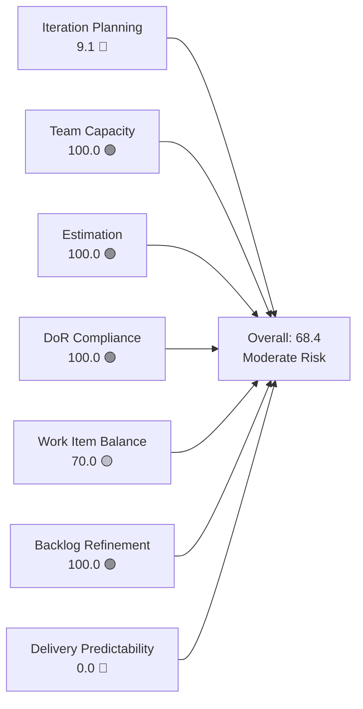
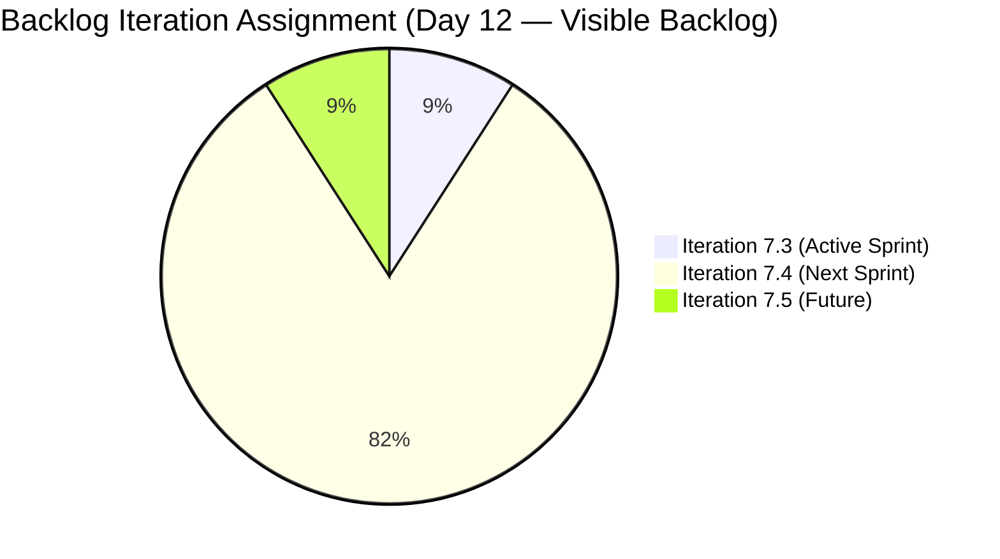
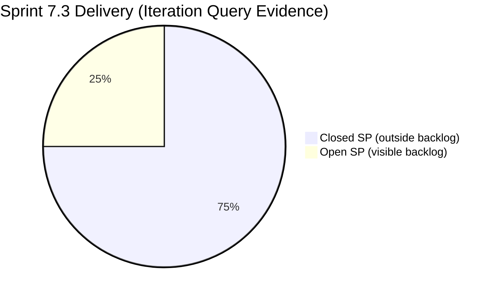
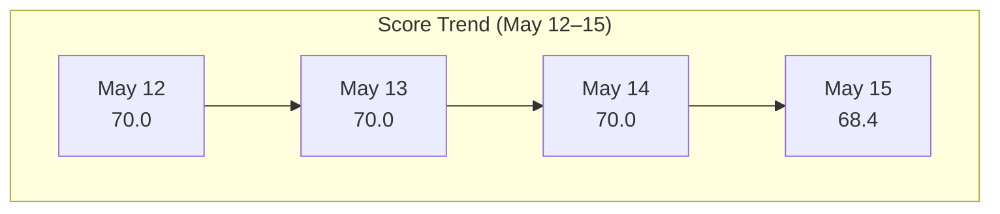

# SAFe Iteration Audit — Administration Team

## 1. Audit Metadata

| Field | Value |
|-------|-------|
| **Project** | Jairosoft FINOPS |
| **Team** | Administration Team |
| **Workspace** | `ado_admin` |
| **ADO Project ID** | e0bb302f-40f9-46c3-8164-6f1acb317d63 |
| **ADO Team ID** | a38a9c02-07ab-483d-a1e3-aff54e19e603 |
| **Iteration** | Iteration 7.3 |
| **Iteration Start** | 2026-05-04 |
| **Iteration Finish** | 2026-05-17 |
| **Audit Date** | 2026-05-15 (CDT) |
| **Audit Day** | Day 12 of 14 |
| **Prior Audit** | AUDIT_20260514_0207.md (Day 11, 70.0 — Moderate Risk) |
| **Overall Score** | **68.4 / 100** |
| **Risk Band** | **Moderate Risk** |

---

## 2. Executive Summary

The Administration Team scores **68.4 / 100 (Moderate Risk)** on Day 12 of Iteration 7.3 — a slight decline from 70.0 yesterday driven by a change in sprint scope. Item 203557 (Utilities payables for Cebu and Davao, 4 SP) has been moved from Iteration 7.3 to Iteration 7.4, leaving only 203556 (Payables - Internet for Davao and Cebu office, 4 SP) as the sole open item in the current visible backlog committed to this sprint.

Six items that were committed to Iteration 7.3 have been completed and closed during this sprint: 203560, 203563, 203628, 203637, 203644, and 203651. However, because closed items no longer appear in the Stories and Deliverables backlog view, they fall outside the rubric's `visible_root_backlog_items` definition and cannot be scored as `current_iteration_root_items`. This is an evidence gap documented in Section 10.

The single remaining open sprint item (203556) is fully estimated, DoR-compliant, and assigned to Mark Colina. With 2 days remaining (May 15–17), closure of this item is the critical action to recover Delivery Predictability.

---

## 3. Previous Audit Delta

**Prior audit:** AUDIT_20260514_0207.md — Day 11, Score 70.0 / 100 (Moderate Risk)

| Dimension | Day 11 (May 14) | Day 12 (May 15) | Delta | Driver |
|-----------|----------------|----------------|-------|--------|
| Iteration Planning | 20.0 | **9.1** | −10.9 | 203557 moved to 7.4; visible sprint pool reduced from 10→11, sprint items from 2→1 |
| Team Capacity | 100.0 | **100.0** | 0.0 | Mark Colina configured; unchanged |
| Estimation | 100.0 | **100.0** | 0.0 | 203556 estimated 4 SP |
| DoR Compliance | 100.0 | **100.0** | 0.0 | 203556 passes DoR |
| Work Item Balance | 70.0 | **70.0** | 0.0 | User Story monoculture persists |
| Backlog Refinement | 100.0 | **100.0** | 0.0 | All 11 backlog items fresh; 204198 added today with no DoR gap penalizing refinement |
| Delivery Predictability | 0.0 | **0.0** | 0.0 | 203556 still Active; 0 SP closed in visible backlog |
| **Overall** | **70.0** | **68.4** | **−1.6** | 203557 scope move reduces planning ratio |

**Key finding (Day 12):** Item 203557 was moved out of Iteration 7.3 to 7.4 (IterationPath confirmed in ADO). A new item, 204198 (Philgeps payment), was added to the backlog today (May 15) with no Description or Acceptance Criteria — a DoR risk for future iterations. Six items closed during this sprint (203560, 203563, 203628, 203637, 203644, 203651) represent 12 SP of actual delivery, but are not visible in the current backlog and cannot be scored under the rubric — see Section 10.

---

## 4. Current Iteration Snapshot

| Attribute | Value |
|-----------|-------|
| Active Iteration | Iteration 7.3 |
| Sprint Duration | 2026-05-04 to 2026-05-17 (14 days) |
| Audit Day | Day 12 |
| Current Iteration Root Items (visible backlog) | 1 |
| Total Visible Backlog Root Items | 11 |
| Sprint Load % | 9.1% |
| Total Committed Story Points (visible) | 4 SP |
| Closed Story Points (visible) | 0 SP |
| Closed Items (iteration, outside backlog view) | 6 items / 12 SP closed |
| Active Team Members (sprint) | 1 (Mark Colina) |
| Capacity Configured | Yes (5 hrs/day: 1 Deployment + 2 Documentation + 2 Requirements) |
| Days Off | 0 |

---

## 5. Work Item Analysis

### 5.1 Current Iteration Items — Visible in Backlog (Iteration 7.3)

| ID | Title | Type | State | Assignee | SP | DoR | Changed |
|----|-------|------|-------|----------|----|-----|---------|
| 203556 | Payables - Internet for Davao and Cebu office | User Story | Active | Mark Colina | 4 | ✓ | 2026-05-14 |

### 5.2 Closed Iteration Items — Outside Backlog View (Completed in 7.3)

These items were committed to Iteration 7.3 and closed during the sprint. They are not visible in the Stories and Deliverables backlog query and are excluded from rubric scoring per the `visible_root_backlog_items` definition. Documented here for delivery context only.

| ID | Title | Type | State | SP | Closed Date |
|----|-------|------|-------|----|------------|
| 203560 | JIT BFP inspection compliance 2026 | User Story | Closed | 2 | ~2026-05-07 |
| 203563 | Davao Admin Adhoc Support May 4-17, 2026 cutoff | User Story | Closed | 4 | ~2026-05-12 |
| 203628 | Monthly Payable Forcasting | Spike | Closed | 1 | ~2026-05-13 |
| 203637 | Summary of Drug Test Center | Spike | Closed | 1 | ~2026-05-13 |
| 203644 | Drug testing clinic for CADAC | User Story | Closed | 2 | ~2026-05-07 |
| 203651 | Fixation of post at Davao office rooftop | User Story | Closed | 2 | ~2026-05-06 |
| **Total** | | | | **12 SP** | |

### 5.3 Backlog Items Outside Iteration 7.3

| ID | Title | Type | Iteration | State | SP | DoR | Changed |
|----|-------|------|-----------|-------|----|-----|---------|
| 202366 | Philgeps renewal for 2026 | User Story | 7.4 | New | 3 | ✓ | 2026-05-15 |
| 203555 | Government (EGOV) payables | User Story | 7.4 | New | 4 | ✓ | 2026-05-13 |
| 203557 | Utilities payables for Cebu and Davao | User Story | 7.4 | Active | 4 | ✓ | 2026-05-14 |
| 203558 | Condo dues (Cebu) payables | User Story | 7.4 | New | 3 | ✓ | 2026-05-13 |
| 203693 | Admin CR sink cabinet | Defect | 7.4 | New | 3 | ✓ | 2026-05-13 |
| 203716 | Procure Signage Materials | User Story | 7.4 | Req. Gathering | 2 | ✓ | 2026-05-05 |
| 204135 | 3 vendors for panaflex signage | User Story | 7.4 | Req. Gathering | 1 | ✓ | 2026-05-14 |
| 204136 | 3 vendors for flag pole | User Story | 7.4 | Req. Gathering | 1 | ✓ | 2026-05-14 |
| 203717 | Installation of Street Signage | User Story | 7.5 | Req. Gathering | 3 | ✓ | 2026-05-05 |
| 204198 | Philgeps payment | User Story | 7.4 | New | — | ✗ | 2026-05-15 |

**DoR alert:** Item 204198 (Philgeps payment) was added today with no Description or Acceptance Criteria. Must be groomed before Iteration 7.4 planning.

---

## 6. SAFe Compliance Scorecard

| Dimension | Score | Evidence | Notes |
|-----------|-------|----------|-------|
| Iteration Planning | 9.1 | 1 of 11 backlog items in Iteration 7.3 | 203557 moved to 7.4; 6 closed items outside backlog view; denominator grew to 11 with 204198 |
| Team Capacity | 100.0 | Mark Colina: 5 hrs/day configured, 0 days off | Single contributor, fully configured |
| Estimation | 100.0 | 203556 = 4 SP (1/1 eligible items estimated) | All visible sprint items estimated |
| DoR Compliance | 100.0 | 203556: Description ≥30 chars ✓, AC ≥20 chars ✓ | 1/1 sprint items DoR-compliant |
| Work Item Balance | 70.0 | User Story: 1/1 = 100% — dominant type >60% penalty −30 | No Spikes in visible sprint scope; type monoculture structural |
| Backlog Refinement | 100.0 | All 11 items changed within 45 days; 0 stale >90d; 0 stale >180d; 0 untouched current items | Excellent hygiene; 204198 has no DoR but refinement age check passes |
| Delivery Predictability | 0.0 | 0 of 4 committed SP closed in visible backlog | 203556 Active; 12 SP closed outside backlog view (evidence gap) |
| **Overall** | **68.4** | (9.1+100+100+100+70+100+0) / 7 | **Moderate Risk** |

---

## 7. Dimension Findings

### 7.1 Iteration Planning — 9.1 (Critical)

Only 1 of 11 visible backlog items (9.1%) is committed to Iteration 7.3. This is a significant drop from yesterday's 20.0 (2/10) driven by two changes: (1) item 203557 was moved from 7.3 to 7.4, and (2) item 204198 was added to the backlog today. The actual delivery picture is more complete when the 6 closed items are included (7 of 17 total items committed to 7.3 = 41%), but those items are not visible in the backlog query.

The planning score reflects the rubric's strict definition. The team did commit more work this sprint than is visible — the score is a structural artifact of how closed items leave the ADO backlog view.

### 7.2 Team Capacity — 100.0 (Low Risk)

Mark Colina remains the sole team member with capacity fully configured at 5 hrs/day across three activity types. No days off. Capacity planning is complete.

**Persistent structural risk:** Bus factor = 1. All Administration Team delivery depends on Mark Colina. No documented backup or escalation path exists despite repeated audit flags.

### 7.3 Estimation — 100.0 (Low Risk)

The single visible sprint item (203556) is estimated at 4 SP. Estimation is complete for all visible sprint scope.

### 7.4 DoR Compliance — 100.0 (Low Risk)

Item 203556 (Payables - Internet for Davao and Cebu office) has a detailed Description covering billing rationale, payment scope, and operational impact. Acceptance Criteria specify billing accuracy verification and receipt attachment. Both fields satisfy the minimum thresholds with substantial content.

### 7.5 Work Item Balance — 70.0 (Moderate Risk)

The single visible sprint item is a User Story — no Spike penalty applies. However, with only 1 item, the dominant type share is 100% (> 60%), triggering the −30 penalty. The structural monoculture across the Administration backlog (primarily payables and compliance work items typed as User Stories) means this penalty persists.

### 7.6 Backlog Refinement — 100.0 (Low Risk)

All 11 visible backlog items were changed within the last 45 days (oldest: 203716 and 203717, changed May 5 = 10 days ago). No items are stale at 90 or 180 days. The sole visible sprint item (203556) was changed May 14 — after the sprint start (May 4) — so no untouched penalty applies.

**DoR watch:** 204198 (Philgeps payment, added today) has no Description or Acceptance Criteria. This does not penalize refinement scoring today (age is 0 days), but must be addressed before 7.4 sprint planning.

### 7.7 Delivery Predictability — 0.0 (Critical)

Item 203556 remains in Active state on Day 12 with zero SP closed in the visible backlog. With 2 days remaining (May 15–17), closing this item is the single highest-priority action.

**Contextual note:** The iteration query reveals 6 closed items (12 SP delivered) within Iteration 7.3 that are no longer visible in the backlog. If included, the adjusted delivery ratio would be 12/16 SP = 75.0% — a High Risk score rather than Critical. This evidence is documented but cannot be scored under the rubric (see Section 10).

---

## 8. Risks and Bottlenecks

| Risk | Severity | Description |
|------|----------|-------------|
| 203556 still Active on Day 12 | Critical | 4 SP must close by May 17; 2 days remaining |
| Delivery Predictability = 0.0 (visible) | High | Score will remain 0 unless 203556 closes before sprint end |
| Bus Factor = 1 | High | Mark Colina is the sole contributor; no documented backup |
| 204198 added with no DoR | Moderate | Philgeps payment item has no Description or AC — blocks 7.4 sprint readiness |
| 7.4 capacity overload | Moderate | 9 items queued for 7.4 (203557 moved + 8 existing = ~21 SP); feasibility unconfirmed |
| Type monoculture | Low | 100% User Stories in visible sprint scope; structural for Admin team |

---

## 9. Prioritized Recommendations

1. **Close 203556 today (May 15).** Process the Davao and Cebu internet payable, attach the receipt, and move the item to Closed. This recovers Delivery Predictability to 100.0 and the overall score to 81.4 (Low Risk).

2. **Groom 204198 (Philgeps payment) before 7.4 planning.** Add Description (min 30 chars) and Acceptance Criteria (min 20 chars). This item has zero content — it cannot enter sprint planning without meeting DoR.

3. **Validate 7.4 sprint capacity before planning.** Nine items are queued for 7.4 (including 203557 with 4 SP). At 5 hrs/day for 10 working days, Mark's total capacity is ~50 hrs; confirm that the 7.4 SP load is feasible and trim if necessary.

4. **Document bus factor mitigation.** Define who can process payables, manage PhilGEPS compliance, or handle vendor coordination if Mark is unavailable. A documented escalation path must be established to address this recurring audit finding.

5. **Review 203557 (Utilities payables) scope in 7.4.** This item was Active in 7.3 but moved to 7.4. Confirm that payment deadlines are still met and that the move does not cause service interruption or penalties.

---

## 10. Evidence Gaps and Limitations

| Gap | Impact on Scoring |
|-----|------------------|
| 6 closed sprint items (12 SP) not in visible backlog | Delivery Predictability scores 0.0 instead of the contextual 75.0; Iteration Planning scores 9.1 instead of ~41% if closed items were included |
| 203556 ChangedDate = May 14 (day before audit) | Cannot confirm current payment processing status — may be in progress without an ADO state change |
| 204198 has no Description or AC | Not in Iteration 7.3 so does not affect DoR scoring today; risk deferred to 7.4 |
| Single-contributor team | All metrics reflect one person; team-level aggregation has limited diagnostic value |

**Methodology note:** The SAFe rubric defines `current_iteration_root_items` as a strict subset of `visible_root_backlog_items`. Closed items that exit the ADO backlog view are excluded from all denominator/numerator calculations regardless of their actual sprint commitment. This is a known structural limitation for teams with high sprint-close velocity. The six closed items are documented in Section 5.2 as contextual evidence only.

---

## Appendix — Score Visualization

