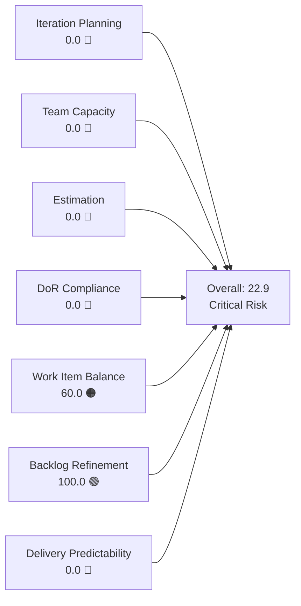
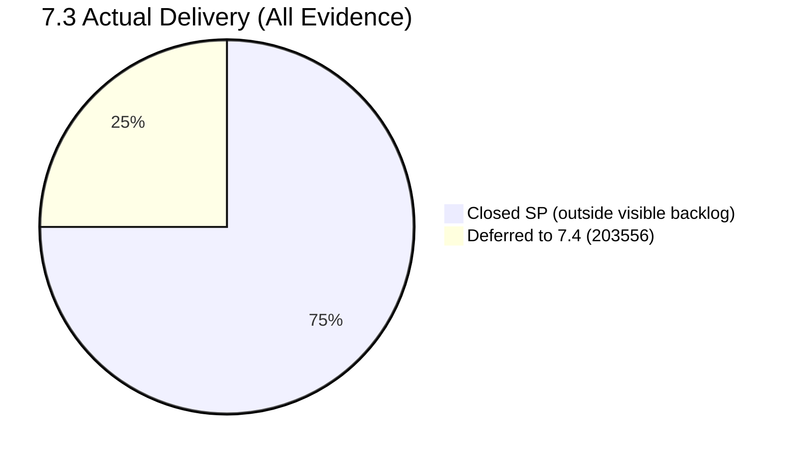
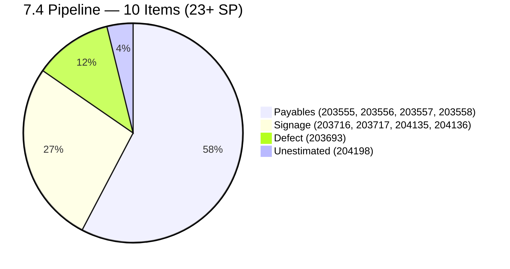
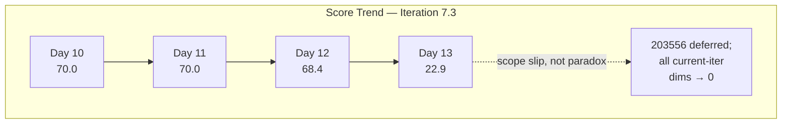
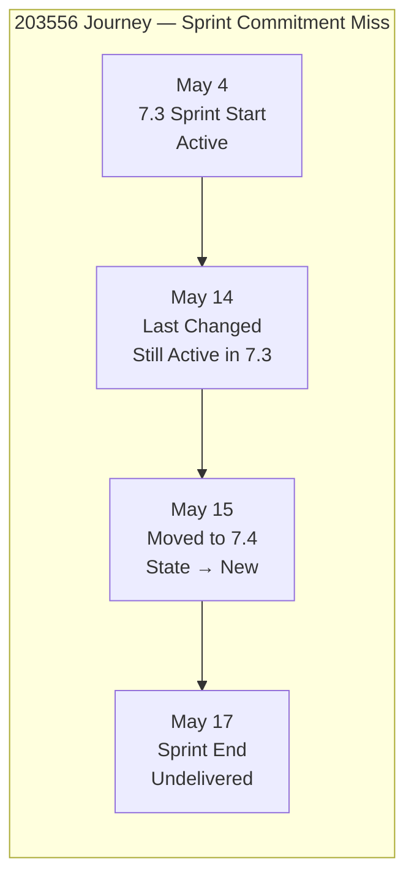

# SAFe Iteration Audit — Administration Team

## 1. Audit Metadata

| Field | Value |
|-------|-------|
| **Project** | Jairosoft FINOPS |
| **Team** | Administration Team |
| **Workspace** | `ado_admin` |
| **ADO Project ID** | e0bb302f-40f9-46c3-8164-6f1acb317d63 |
| **ADO Team ID** | a38a9c02-07ab-483d-a1e3-aff54e19e603 |
| **Iteration** | Iteration 7.3 |
| **Iteration Start** | 2026-05-04 |
| **Iteration Finish** | 2026-05-17 |
| **Audit Date** | 2026-05-16 (CDT) |
| **Audit Day** | Day 13 of 14 |
| **Prior Audit** | AUDIT_20260515_0202.md (Day 12, 68.4 — Moderate Risk) |
| **Overall Score** | **22.9 / 100** |
| **Risk Band** | **Critical Risk** |

---

## 2. Executive Summary

The Administration Team drops to **22.9 / 100 (Critical Risk)** on Day 13 of Iteration 7.3 — a severe decline from yesterday's 68.4 driven by a real scope event, not a measurement paradox.

Item **203556 (Payables - Internet for Davao and Cebu office, 4 SP)** — the only sprint item still open in yesterday's visible backlog — has been moved from Iteration 7.3 to **Iteration 7.4** and its State reset to "New." This confirms that a committed sprint item was not delivered and has been formally deferred one iteration. The move is distinct from the mass-closure paradox observed in other teams: this item did not close; it slipped.

The visible backlog now contains **zero items assigned to Iteration 7.3**. All current-iteration-dependent rubric dimensions (Team Capacity, Estimation, DoR Compliance, and Delivery Predictability) score 0.0 as a direct consequence of the empty sprint scope. Work Item Balance scores 60.0 from the structural "no User Story in current iter" penalty.

**Actual 7.3 delivery context:** Six items totaling 12 SP were closed during this sprint (203560, 203563, 203628, 203637, 203644, 203651) and are no longer visible in the backlog. Including 203556 as a deliberate scope slip, the team completed 12 of approximately 16 committed SP — a **75% delivery rate**. This does not overcome the critical score but materially changes the operational interpretation.

**The one remaining day (May 17) is the final opportunity** to close 203556 if the payment can be processed before sprint close. Given that its state is now "New" in Iteration 7.4, doing so would require moving it back to 7.3, which is unlikely to happen procedurally.

---

## 3. Previous Audit Delta

**Prior audit:** AUDIT_20260515_0202.md — Day 12, Score 68.4 / 100 (Moderate Risk)

| Dimension | Day 12 (May 15) | Day 13 (May 16) | Delta | Driver |
|-----------|----------------|----------------|-------|--------|
| Iteration Planning | 9.1 | **0.0** | **−9.1** | 203556 moved from 7.3 to 7.4; visible sprint items drop from 1 to 0 |
| Team Capacity | 100.0 | **0.0** | **−100.0** | contributors_with_current_work = 0; formula returns 0 when denominator = 0 |
| Estimation | 100.0 | **0.0** | **−100.0** | No point-eligible current iteration items |
| DoR Compliance | 100.0 | **0.0** | **−100.0** | No current iteration items; numerator and denominator both 0 |
| Work Item Balance | 70.0 | **60.0** | **−10.0** | No User Story in current iter (−40); no dominant/spike penalties on empty set; was 70 due to 1 User Story |
| Backlog Refinement | 100.0 | **100.0** | 0.0 | All 11 items remain fresh; no new stale items |
| Delivery Predictability | 0.0 | **0.0** | 0.0 | No visible committed SP; formula returns 0 on zero committed |
| **Overall** | **68.4** | **22.9** | **−45.5** | 203556 scope slip empties the sprint and collapses all current-iter dimensions |

**Key finding (Day 13):** 203556 was confirmed in ADO with IterationPath = `Jairosoft FINOPS\2026-PI7\Iteration 7.4` and State = "New" — meaning it was explicitly moved and reset, not merely carried over. This is a deliberate deferred commitment, not a scoring artifact. The team entered Day 13 with no open sprint items, marking Iteration 7.3 effectively closed from a visible backlog standpoint with one carried-over item.

---

## 4. Current Iteration Snapshot

| Attribute | Value |
|-----------|-------|
| Active Iteration | Iteration 7.3 |
| Sprint Duration | 2026-05-04 to 2026-05-17 (14 days) |
| Audit Day | Day 13 |
| Current Iteration Root Items (visible backlog) | **0** |
| Total Visible Backlog Root Items | 11 |
| Sprint Load % | **0.0%** |
| Total Committed Story Points (visible) | 0 SP |
| Closed Story Points (visible) | 0 SP |
| Closed Items (iteration, outside backlog view) | 6 items / 12 SP closed |
| Deferred Items (moved to 7.4) | 1 item / 4 SP (203556) |
| Active Team Members (sprint) | 1 (Mark Colina) |
| Capacity Configured | Yes (5 hrs/day: 1 Deployment + 2 Documentation + 2 Requirements) |
| Days Off | 0 |

---

## 5. Work Item Analysis

### 5.1 Current Iteration Items — Visible in Backlog (Iteration 7.3)

**None.** All items have exited Iteration 7.3 — either closed (6 items) or moved to 7.4 (1 item).

### 5.2 Deferred Sprint Item — Moved from 7.3 to 7.4

This item was committed to Iteration 7.3 and was Active in yesterday's backlog. It was moved to 7.4 today with State reset to "New." This represents a real scope slip, not a measurement artifact.

| ID | Title | Type | State | SP | Old Iteration | New Iteration | Changed |
|----|-------|------|-------|----|---------------|---------------|---------|
| 203556 | Payables - Internet for Davao and Cebu office | User Story | New | 4 | 7.3 | **7.4** | 2026-05-15 |

**Risk note:** The internet payable for Davao and Cebu offices covers operational connectivity. Deferring this payment to a future sprint raises the risk of service interruption or late-payment penalties if the billing deadline has passed.

### 5.3 Closed Sprint Items — Outside Backlog View (Completed in 7.3)

| ID | Title | Type | State | SP | Closed Date (approx.) |
|----|-------|------|-------|----|----------------------|
| 203560 | JIT BFP inspection compliance 2026 | User Story | Closed | 2 | ~2026-05-07 |
| 203563 | Davao Admin Adhoc Support May 4-17 cutoff | User Story | Closed | 4 | ~2026-05-12 |
| 203628 | Monthly Payable Forecasting | Spike | Closed | 1 | ~2026-05-13 |
| 203637 | Summary of Drug Test Center | Spike | Closed | 1 | ~2026-05-13 |
| 203644 | Drug testing clinic for CADAC | User Story | Closed | 2 | ~2026-05-07 |
| 203651 | Fixation of post at Davao office rooftop | User Story | Closed | 2 | ~2026-05-06 |
| **Total** | | | | **12 SP** | |

### 5.4 Full Visible Backlog (11 Items — All Assigned to 7.4 or 7.5)

| ID | Title | Type | Iteration | State | SP | DoR | Changed |
|----|-------|------|-----------|-------|----|-----|---------|
| 204198 | Philgeps payment | User Story | 7.4 | New | — | ✗ | 2026-05-15 |
| 204136 | 3 vendors for flag pole | User Story | 7.4 | Req. Gathering | 1 | ✓ | 2026-05-14 |
| 204135 | 3 vendors for panaflex signage | User Story | 7.4 | Req. Gathering | 1 | ✓ | 2026-05-14 |
| 202366 | Philgeps renewal for 2026 | User Story | 7.4 | New | ✓ | ✓ | 2026-05-15 |
| 203555 | Government (EGOV) payables | User Story | 7.4 | New | 4 | ✓ | 2026-05-13 |
| 203557 | Utilities payables for Cebu and Davao | User Story | 7.4 | Active | 4 | ✓ | 2026-05-15 |
| 203556 | Payables - Internet for Davao and Cebu office | User Story | 7.4 | New | 4 | ✓ | 2026-05-15 |
| 203558 | Condo dues (Cebu) payables | User Story | 7.4 | New | 3 | ✓ | 2026-05-13 |
| 203693 | Admin CR sink cabinet | Defect | 7.4 | New | 3 | ✓ | 2026-05-13 |
| 203716 | Procure Signage Materials | User Story | 7.4 | Req. Gathering | 2 | ✓ | 2026-05-05 |
| 203717 | Installation of Street Signage | User Story | 7.5 | Req. Gathering | 3 | ✓ | 2026-05-05 |

**DoR alert:** 204198 (Philgeps payment) still has no Description or Acceptance Criteria. It is now 1 day older than yesterday with no grooming activity.

**Capacity concern for 7.4:** Ten items are queued for 7.4 (including the newly moved 203556), with estimated SP totaling at minimum 23 SP (204198 unestimated). At Mark's configured 5 hrs/day, this load likely exceeds feasible capacity for a single contributor in a 14-day sprint.

---

## 6. SAFe Compliance Scorecard

| Dimension | Score | Evidence | Notes |
|-----------|-------|----------|-------|
| Iteration Planning | 0.0 | 0 of 11 backlog items in Iteration 7.3 | 203556 formally moved to 7.4; sprint effectively closed |
| Team Capacity | 0.0 | No contributors with current iteration work | Formula: contributors_with_work = 0 → score = 0; capacity configuration unchanged |
| Estimation | 0.0 | No point-eligible items in current iteration | Empty sprint scope; formula returns 0 when point_eligible = 0 |
| DoR Compliance | 0.0 | No items in current iteration | Formula: current_iter = 0 → score = 0 |
| Work Item Balance | 60.0 | No User Story in current iter → −40; no spike or dominant-type penalties on empty set | 100 − 40 = 60; structural artifact of empty sprint |
| Backlog Refinement | 100.0 | All 11 items changed within 45 days; 0 stale ≥ 90d; 0 stale ≥ 180d; 0 untouched current items | Oldest: 203716/203717 (May 5 = 11 days); excellent hygiene |
| Delivery Predictability | 0.0 | committed_points = 0 → formula returns 0 | Structural: 12 SP delivered outside visible backlog (evidence gap) |
| **Overall** | **22.9** | (0+0+0+0+60+100+0) / 7 = 160/7 | **Critical Risk** |

---

## 7. Dimension Findings

### 7.1 Iteration Planning — 0.0 (Critical)

Zero of 11 visible backlog items are assigned to Iteration 7.3. This is a confirmed score of zero resulting from a real scope event: item 203556, the last open sprint commitment, was formally deferred to 7.4. Unlike the scoring paradox observed in high-velocity teams (where closures drain the visible sprint pool), this score reflects a genuine planning outcome — one sprint commitment was not delivered.

**Operational context:** When the six closed items are included (12 SP delivered + 4 SP deferred = 16 SP total committed), the team completed approximately 75% of its sprint commitment. The visible-backlog rubric cannot capture this; it is documented in Section 5.3 as contextual evidence.

### 7.2 Team Capacity — 0.0 (Critical — Structural)

The rubric formula returns 0 when `contributors_with_current_work` equals 0. With no visible sprint items, no assignee qualifies as a "contributor with current work." Mark Colina's capacity remains fully configured at 5 hrs/day, and the underlying configuration has not changed. This score is entirely a structural consequence of the empty sprint and should not be interpreted as a capacity planning failure.

### 7.3 Estimation — 0.0 (Critical — Structural)

No point-eligible items exist in the current iteration. The formula returns 0 when the denominator is 0. This is a rubric artifact; all 11 backlog items carry story point estimates (except 204198).

### 7.4 DoR Compliance — 0.0 (Critical — Structural)

No items are assigned to Iteration 7.3. The formula returns 0 when `current_iter = 0`. DoR quality of the 7.4 pipeline is high (10 of 11 items pass) with one outstanding exception (204198).

### 7.5 Work Item Balance — 60.0 (Moderate Risk)

With zero current iteration items, no User Story is present in the sprint, triggering the −40 penalty (start 100 − 40 = 60). The dominant type share and spike share calculations are undefined over an empty set and do not generate additional penalties. Score of 60.0 is a structural minimum for any team with an empty current iteration, not a process signal.

### 7.6 Backlog Refinement — 100.0 (Low Risk)

All 11 visible backlog items have ChangedDate values within the last 45 days. The oldest items (203716 and 203717, changed May 5) are 11 days old. No items are stale at 90 or 180 days. No untouched current items (empty sprint). Backlog hygiene is excellent.

**Persistent DoR gap:** Item 204198 (Philgeps payment) has been in the backlog for 2 days with no Description or Acceptance Criteria. The refinement score is not affected (item is fresh by age), but the DoR gap must be resolved before 7.4 sprint planning.

### 7.7 Delivery Predictability — 0.0 (Critical)

`committed_points = 0` in the visible backlog — the formula returns 0.0. This does not reflect the team's actual delivery. Six items (12 SP) were closed during Iteration 7.3 and are outside the rubric's scope. Item 203556 (4 SP) was deferred rather than closed.

**Contextual delivery assessment:** 12 SP closed / ~16 SP committed = 75% delivery rate. By operational standards this is a High Risk outcome (Delivery Predictability would score 75.0 if closed items were included), not Critical. The gap between the rubric score (0.0) and the operational reality (75.0) is the largest evidence gap in this audit.

---

## 8. Risks and Bottlenecks

| Risk | Severity | Description |
|------|----------|-------------|
| 203556 deferred to 7.4 | High | Internet payable for Davao/Cebu not delivered; if billing deadline has passed, service interruption or late fees may result |
| Score collapse to Critical (22.9) | High | All current-iter dimensions score 0; downstream stakeholders will see Critical Risk without the operational context |
| 7.4 overload risk | High | 10 items (~23+ SP) queued for 7.4; Mark's 5 hrs/day = ~50 hrs capacity over 10 working days; load likely exceeds sustainable delivery rate |
| 204198 DoR gap (2nd day) | Moderate | Philgeps payment item entered backlog May 15 with no Description or AC; entering 7.4 sprint planning without grooming will break DoR compliance |
| Bus Factor = 1 | High | Mark Colina is the sole Administration Team contributor; no documented escalation or backup path |
| 203557 Active in 7.4 | Moderate | Utilities payables item is in "Active" state in 7.4 — this means it was in progress during 7.3 but not closed; needs status clarification |

---

## 9. Prioritized Recommendations

1. **Verify 203556 payment deadline immediately (May 16).** The internet payable for Davao and Cebu was deferred to 7.4, but the billing due date may not have moved with it. Check the billing statement due date. If the payment window is still open today (May 16) or tomorrow (May 17), process the payment and close the item as a 7.3 completion — even retroactively as a backlog item.

2. **Groom 204198 (Philgeps payment) before 7.4 sprint planning.** This item has been in the backlog for 2 days with zero content. Add Description (minimum 30 non-whitespace characters describing the payment scope and amount) and Acceptance Criteria (minimum 20 characters covering receipt confirmation and PhilGEPS portal update). This is a blocking action for 7.4 sprint readiness.

3. **Right-size the 7.4 sprint commitment.** Ten items are currently queued for 7.4, with an estimated load of 23+ SP. At Mark's 5 hrs/day × 10 working days = 50 hrs capacity, this load should be capped at 8–10 SP to avoid repeating the 7.3 over-commitment pattern. Identify and defer lower-priority items to 7.5.

4. **Clarify 203557 (Utilities payables) Active state.** This item is in "Active" state in Iteration 7.4 — it appears work was started in 7.3 without being completed. Confirm whether any payments have been partially processed, update the item's description with current status, and ensure the billing deadline is visible.

5. **Conduct Iteration 7.3 retrospective.** Six items were delivered; one was deferred. Identify what prevented 203556 from closing (billing delay, vendor unresponsiveness, or capacity constraint) and apply the lesson to 7.4 planning. The retrospective should also address the over-commitment pattern (6.5, 7.3, and now 7.4 are all loaded beyond Mark's realistic throughput).

6. **Document bus factor mitigation plan.** This finding has appeared in every audit for this team. Define a specific named escalation contact for: (a) internet/utility payables, (b) PhilGEPS filings, and (c) government compliance submissions, should Mark be unavailable.

---

## 10. Evidence Gaps and Limitations

| Gap | Impact on Scoring |
|-----|------------------|
| 6 closed sprint items (12 SP) not in visible backlog | Delivery Predictability scores 0.0 instead of contextual 75.0; Iteration Planning scores 0.0 instead of contextual ~44% if closed items included |
| 203556 moved to 7.4 — billing deadline status unknown | Cannot confirm whether deferral creates a financial penalty risk; payment due date not visible in ADO item |
| 203557 is "Active" in 7.4 with no comment | Unclear if partial payment occurred during 7.3; ADO state change not accompanied by notes |
| 204198 has no Description or AC (Day 2) | Item not in current iteration so does not affect DoR scoring; represents a 7.4 readiness risk |
| Single-contributor team | All rubric dimensions reflect one person's workload and status; team-level aggregation is not meaningful for diagnostic purposes |

**Score interpretation note:** The 22.9 Critical score is the mathematically correct rubric result given the empty visible sprint. It is NOT an accurate operational assessment of team performance. The Administration Team delivered 12 SP (75% of committed) during Iteration 7.3 — a materially better outcome than the rubric captures. Stakeholders should interpret the score in conjunction with the contextual delivery data in Section 5.3.

---

## Appendix — Score Visualization

