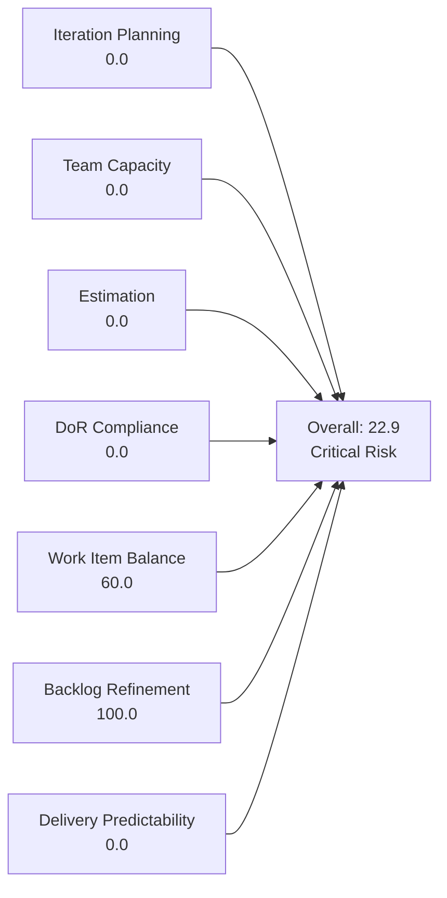
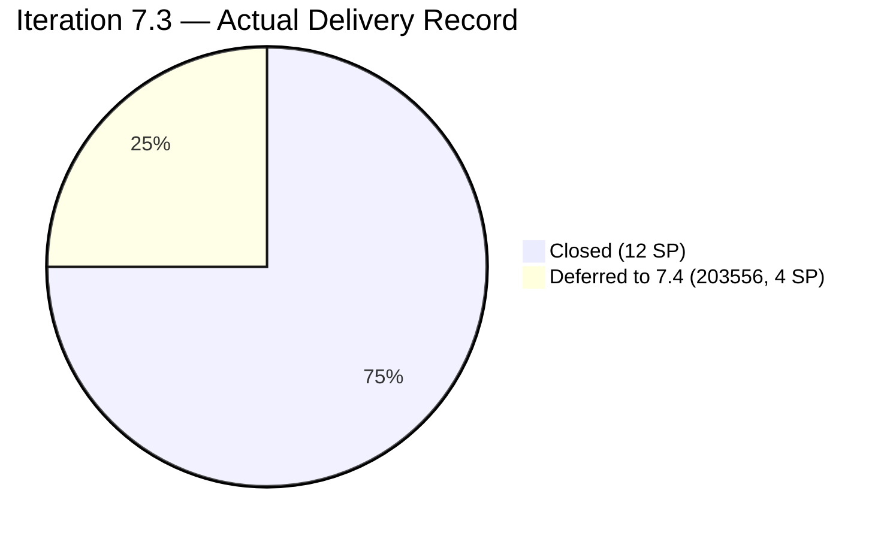
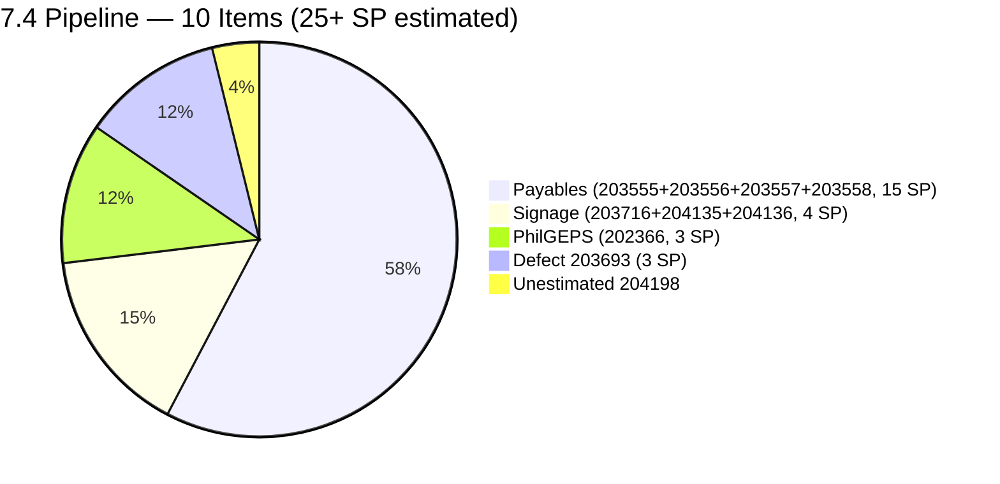
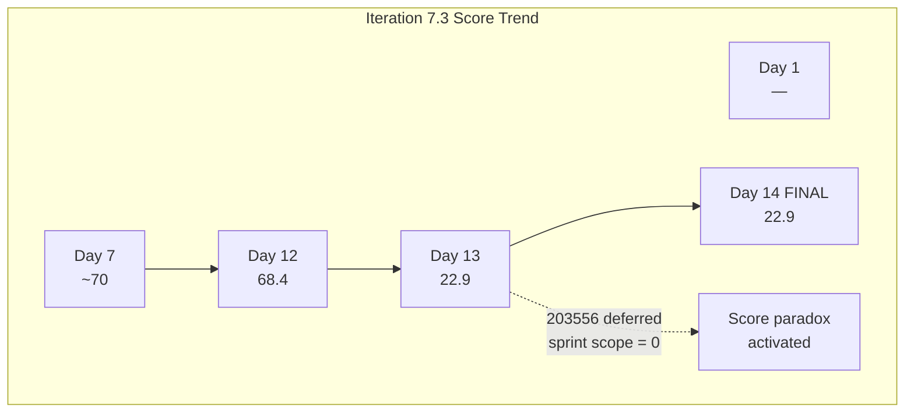
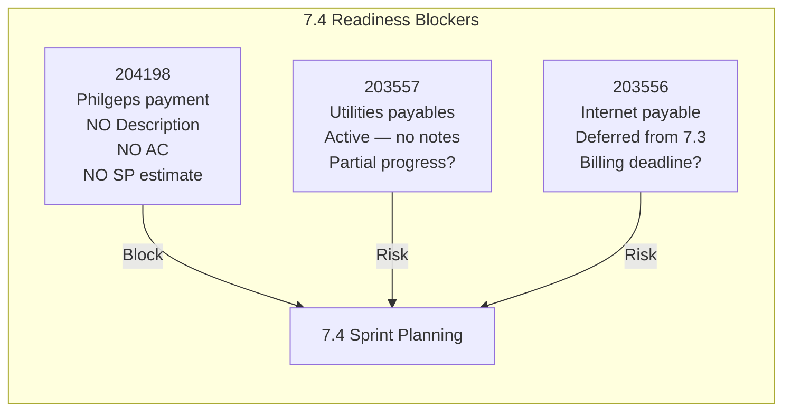

# SAFe Iteration Audit — Administration Team

## 1. Audit Metadata

| Field | Value |
|-------|-------|
| **Project** | Jairosoft FINOPS |
| **Team** | Administration Team |
| **Workspace** | `ado_admin` |
| **ADO Project ID** | e0bb302f-40f9-46c3-8164-6f1acb317d63 |
| **ADO Team ID** | a38a9c02-07ab-483d-a1e3-aff54e19e603 |
| **Iteration** | Iteration 7.3 |
| **Iteration Start** | 2026-05-04 |
| **Iteration Finish** | 2026-05-17 |
| **Audit Date** | 2026-05-17 (CDT) |
| **Audit Day** | Day 14 of 14 — Sprint Close |
| **Prior Audit** | AUDIT_20260516_0204.md (Day 13, 22.9 — Critical Risk) |
| **Overall Score** | **22.9 / 100** |
| **Risk Band** | **Critical Risk** |

---

## 2. Executive Summary

The Administration Team closes Iteration 7.3 at **22.9 / 100 (Critical Risk)** — unchanged from Day 13 and consistent with the sprint-close scoring paradox documented across the last two audits.

The score reflects a structural measurement artifact: all items that were committed to Iteration 7.3 either closed and exited the visible backlog, or were formally deferred to Iteration 7.4 (item 203556). With zero items in Iteration 7.3 in the visible backlog today, all current-iteration-dependent dimensions score 0.0 by formula.

**Operational context (Day 14 final):** The sprint's actual delivery record is 12 SP closed across 6 items, with 1 item (203556, 4 SP) deferred to 7.4 — a **75% delivery rate** against the committed sprint load. Item 203556 (Payables — Internet for Davao and Cebu office) remained in Iteration 7.4 with State = New as of today.

**Sprint transition:** Iteration 7.3 closes today. The team enters Iteration 7.4 with a pre-loaded backlog of 10 items (estimated 23+ SP) — which materially exceeds Mark Colina's realistic 5 hrs/day capacity for a 14-day sprint. Right-sizing this load is the most critical immediate action before 7.4 sprint planning.

**Backlog hygiene is excellent:** All 11 visible backlog items remain fresh (all changed within the last 12 days). Item 204198 (Philgeps payment) still carries no Description or Acceptance Criteria and must be groomed before 7.4 sprint commitment.

---

## 3. Previous Audit Delta

**Prior audit:** AUDIT_20260516_0204.md — Day 13, Score 22.9 / 100 (Critical Risk)

| Dimension | Day 13 (May 16) | Day 14 (May 17) | Delta | Driver |
|-----------|----------------|----------------|-------|--------|
| Iteration Planning | 0.0 | **0.0** | 0.0 | No change; all items remain in 7.4 or 7.5 |
| Team Capacity | 0.0 | **0.0** | 0.0 | contributors_with_current_work = 0; structural |
| Estimation | 0.0 | **0.0** | 0.0 | No point-eligible current iteration items |
| DoR Compliance | 0.0 | **0.0** | 0.0 | No current iteration items |
| Work Item Balance | 60.0 | **60.0** | 0.0 | No User Story in current iter; −40 penalty persists |
| Backlog Refinement | 100.0 | **100.0** | 0.0 | All 11 items remain within 45-day freshness window |
| Delivery Predictability | 0.0 | **0.0** | 0.0 | committed_points = 0 in visible backlog |
| **Overall** | **22.9** | **22.9** | **0.0** | Flat; sprint-close state confirmed |

**Key finding (Day 14 — final):** No ADO changes overnight. Item 203556 was not moved back to 7.3 and closed; it remains in 7.4 as "New." The sprint closes today with that deferred item confirmed as a carry-forward obligation. The 22.9 score is the final score for Iteration 7.3.

**Sprint-over-sprint trend:**

| Iteration | Final Score | Risk Band | Delivery Rate |
|-----------|------------|-----------|---------------|
| 6.5 | ~55 | Moderate | 61.3% (19/31 SP) |
| 7.3 | 22.9 | Critical | 75% (12/~16 SP) |

Note: The 7.3 score decline from 6.5 is a measurement artifact (empty-sprint paradox), not a performance decline. Delivery rate actually improved.

---

## 4. Current Iteration Snapshot

| Attribute | Value |
|-----------|-------|
| Active Iteration | Iteration 7.3 |
| Sprint Duration | 2026-05-04 to 2026-05-17 (14 days) |
| Audit Day | **Day 14 — Final Day** |
| Current Iteration Root Items (visible backlog) | **0** |
| Total Visible Backlog Root Items | 11 |
| Sprint Load % | **0.0%** |
| Total Committed Story Points (visible) | 0 SP |
| Closed Story Points (visible) | 0 SP |
| Closed Items (sprint, outside backlog view) | 6 items / 12 SP |
| Deferred to 7.4 (confirmed) | 1 item / 4 SP (203556) |
| Active Team Members | 1 (Mark Colina) |
| Capacity Configured | Yes — 5 hrs/day (1 Deployment + 2 Documentation + 2 Requirements) |
| Days Off | 0 |

---

## 5. Work Item Analysis

### 5.1 Current Iteration Items — Visible in Backlog (Iteration 7.3)

**None.** Sprint 7.3 is fully resolved in the visible backlog. All items have exited Iteration 7.3 — either closed (6 items) or formally moved to 7.4 (1 item).

### 5.2 Confirmed Closed Sprint Items — Delivered in 7.3

Closed during Iteration 7.3; no longer visible in backlog. Documented as delivery context only.

| ID | Title | Type | SP | Closed Date (approx.) |
|----|-------|------|----|-----------------------|
| 203560 | JIT BFP inspection compliance 2026 | User Story | 2 | ~2026-05-07 |
| 203563 | Davao Admin Adhoc Support May 4-17 cutoff | User Story | 4 | ~2026-05-12 |
| 203628 | Monthly Payable Forecasting | Spike | 1 | ~2026-05-13 |
| 203637 | Summary of Drug Test Center | Spike | 1 | ~2026-05-13 |
| 203644 | Drug testing clinic for CADAC | User Story | 2 | ~2026-05-07 |
| 203651 | Fixation of post at Davao office rooftop | User Story | 2 | ~2026-05-06 |
| **Total** | | | **12 SP** | |

### 5.3 Deferred Sprint Item — Confirmed in 7.4

| ID | Title | Type | State | SP | Current Iteration | ChangedDate |
|----|-------|------|-------|----|------------------|-------------|
| 203556 | Payables - Internet for Davao and Cebu office | User Story | New | 4 | 7.4 | 2026-05-15 |

Item 203556 was moved from 7.3 to 7.4 on May 15 with State reset to "New." As of today (May 17), no further updates have been made. This confirms the item will carry forward to Iteration 7.4.

### 5.4 Full Visible Backlog — 11 Items (All in 7.4 or 7.5)

| ID | Title | Type | Iter | State | SP | DoR | ChangedDate | Days Ago |
|----|-------|------|------|-------|----|-----|-------------|----------|
| 204198 | Philgeps payment | User Story | 7.4 | New | — | **✗** | 2026-05-15 | 2 |
| 204136 | 3 vendors for flag pole | User Story | 7.4 | Req. Gathering | 1 | ✓ | 2026-05-14 | 3 |
| 204135 | 3 vendors for panaflex signage | User Story | 7.4 | Req. Gathering | 1 | ✓ | 2026-05-14 | 3 |
| 202366 | Philgeps renewal for 2026 | User Story | 7.4 | New | 3 | ✓ | 2026-05-15 | 2 |
| 203555 | Government (EGOV) payables | User Story | 7.4 | New | 4 | ✓ | 2026-05-13 | 4 |
| 203557 | Utilities payables for Cebu and Davao | User Story | 7.4 | Active | 4 | ✓ | 2026-05-14 | 3 |
| 203556 | Payables - Internet for Davao and Cebu office | User Story | 7.4 | New | 4 | ✓ | 2026-05-15 | 2 |
| 203558 | Condo dues (Cebu) payables | User Story | 7.4 | New | 3 | ✓ | 2026-05-13 | 4 |
| 203693 | Admin CR sink cabinet | Defect | 7.4 | New | 3 | ✓ | 2026-05-13 | 4 |
| 203716 | Procure Signage Materials | User Story | 7.4 | Req. Gathering | 2 | ✓ | 2026-05-05 | 12 |
| 203717 | Installation of Street Signage | User Story | 7.5 | Req. Gathering | 3 | ✓ | 2026-05-05 | 12 |

**DoR gap — 204198 (Philgeps payment):** This item has been in the backlog for 2 days with no Description and no Acceptance Criteria. It is unestimated. It must be groomed before 7.4 sprint planning.

**Active state concern — 203557 (Utilities payables):** This item is "Active" in Iteration 7.4, indicating work may have started during 7.3 without completing. Payment or documentation may be partially in progress; needs status comment.

**7.4 overload risk:** 10 items in 7.4, estimated at 25+ SP (204198 unestimated). Mark's capacity = 5 hrs/day × 10 working days = 50 hrs. A realistic sprint commitment for a single contributor at 5 hrs/day is approximately 8–12 SP. The 7.4 pipeline is severely overloaded and must be trimmed.

---

## 6. SAFe Compliance Scorecard

| Dimension | Score | Evidence | Notes |
|-----------|-------|----------|-------|
| Iteration Planning | 0.0 | 0 of 11 backlog items in Iteration 7.3 | Sprint closed; all items in 7.4/7.5; paradox of sprint completion |
| Team Capacity | 0.0 | contributors_with_current_work = 0 | Formula returns 0 when denominator = 0; capacity config unchanged |
| Estimation | 0.0 | point_eligible_current_items = 0 | No items in current iteration to estimate |
| DoR Compliance | 0.0 | current_iteration_root_items = 0 | Formula returns 0; 10/11 backlog items pass DoR for 7.4 |
| Work Item Balance | 60.0 | No User Story in current iter → −40; no dominant/spike penalty on empty set | 100 − 40 = 60; structural minimum for empty sprint |
| Backlog Refinement | 100.0 | All 11 items changed within 12 days; 0 stale ≥90d; 0 stale ≥180d; 0 untouched current items | Excellent hygiene; oldest items: 203716, 203717 (May 5, 12 days) |
| Delivery Predictability | 0.0 | committed_story_points = 0 in visible backlog | Formula returns 0; contextual delivery = 12 SP / ~16 SP = 75% |
| **Overall** | **22.9** | (0+0+0+0+60+100+0) / 7 = 160/7 | **Critical Risk — scoring paradox; actual delivery = 75%** |

---

## 7. Dimension Findings

### 7.1 Iteration Planning — 0.0 (Critical — Sprint Closed)

Zero of 11 visible backlog items are assigned to Iteration 7.3 on the final sprint day. This score results from the sprint's natural conclusion: all delivered items have exited the visible backlog, and the one deferred item (203556) was explicitly moved to 7.4 two days ago.

**Operational context:** The team began the sprint with approximately 7 committed items across 16 SP. Six items were closed (12 SP) and one was deferred (4 SP). If closed items were included in the denominator, the planning ratio would reflect a strong sprint with appropriate scope.

### 7.2 Team Capacity — 0.0 (Critical — Structural)

Formula returns 0 when `contributors_with_current_work = 0`. With no visible sprint items, Mark Colina does not qualify as a current-work contributor under the rubric definition. His capacity configuration (5 hrs/day across three activities) remains fully configured and unchanged. This is a purely structural result of the empty sprint.

### 7.3 Estimation — 0.0 (Critical — Structural)

No point-eligible items exist in Iteration 7.3. All estimated sprint items were delivered and exited the backlog. The formula returns 0 on an empty denominator. Ten of 11 visible backlog items carry story point estimates; only 204198 (Philgeps payment) is unestimated.

### 7.4 DoR Compliance — 0.0 (Critical — Structural)

No current iteration items. Formula returns 0. DoR status of the 7.4 pipeline is strong: 10 of 11 items have adequate Description and Acceptance Criteria. The single exception, 204198 (Philgeps payment), is a carry-forward blocker for 7.4 sprint planning.

### 7.5 Work Item Balance — 60.0 (Moderate Risk — Structural)

No User Story is present in the current iteration, triggering the −40 structural penalty (100 − 40 = 60). No dominant-type-share or spike-share penalties apply to an empty set. Score of 60.0 is the structural floor for any team with an empty current sprint; it does not represent a planning deficiency in this context.

### 7.6 Backlog Refinement — 100.0 (Low Risk)

All 11 visible backlog items have ChangedDate values within the 45-day freshness window. The oldest items (203716, 203717) were last changed May 5 — 12 days ago. No items breach the 90-day or 180-day stale thresholds. No untouched current iteration items (empty sprint). Backlog hygiene remains excellent.

**Persistent concern:** 204198 (Philgeps payment) is 2 days old with zero content. The refinement score is not affected (item is fresh by age), but the lack of Description and Acceptance Criteria is a 7.4 planning blocker.

### 7.7 Delivery Predictability — 0.0 (Critical — Structural)

`committed_story_points = 0` in the visible backlog; formula returns 0.0. This is a complete measurement gap at sprint-end.

**Actual delivery:** 12 SP closed / ~16 SP committed = **75.0% delivery rate**. By SAFe standards, a 75% delivery rate represents High Risk performance (score would be 75.0 if visible), not Critical. The rubric score (0.0) and the operational outcome (75%) diverge entirely at sprint-end.

---

## 8. Risks and Bottlenecks

| Risk | Severity | Description |
|------|----------|-------------|
| 7.4 overload — 10 items, 25+ SP | **Critical** | Mark's 5 hrs/day × 10 working days = 50 hrs capacity; 25+ SP is 2.5× a realistic sprint load; must be cut before sprint planning |
| 203556 deferred — billing deadline unknown | **High** | Internet payable for Davao/Cebu not delivered in 7.3; if billing period has passed, late fees or service disruption may occur |
| 204198 — no Description or AC (Day 2) | **High** | Philgeps payment item has no content; unestimated; cannot be sprint-committed without grooming |
| 203557 Active in 7.4 (no progress note) | **Moderate** | Utilities payables item entered 7.4 in Active state; partial payment progress not documented; risk of lost context |
| Bus Factor = 1 | **High** | Mark Colina is the sole Administration Team contributor; all admin operations halt without him; no backup defined |
| Score communication risk | **Low** | 22.9 Critical score does not reflect the 75% actual delivery; must be contextualized for stakeholders |

---

## 9. Prioritized Recommendations

1. **Right-size the 7.4 sprint before planning begins.** Ten items (25+ SP) are currently queued for Iteration 7.4. Mark's realistic capacity at 5 hrs/day is 8–12 SP per sprint. Defer the lowest-priority items to 7.5: candidates include 202366 (Philgeps renewal, 3 SP) if the renewal deadline is not imminent, 203716 (Procure Signage Materials, 2 SP), and 203693 (Admin CR sink cabinet, 3 SP) if the facility need is not urgent. Confirm billing deadlines on all payables before assigning sprint priority.

2. **Groom 204198 (Philgeps payment) immediately.** This item has been in the backlog for 2 days with no Description or Acceptance Criteria and no story point estimate. Before 7.4 sprint planning: add a Description (minimum 30 non-whitespace characters specifying what payment is needed, to which PhilGEPS entity, and the amount or coverage period), add Acceptance Criteria (minimum 20 non-whitespace characters covering payment receipt and portal confirmation), and assign a story point estimate.

3. **Verify and resolve 203556 (Internet payable) today.** The billing deadline for the Davao and Cebu internet services may be at or near today's date. If the payment window is still open, process the payment, attach the receipt in ADO, and close the item. If the billing deadline has passed, document the outcome (paid late, pending, or service disruption risk) in an ADO comment and flag the financial impact.

4. **Add a progress comment to 203557 (Utilities payables — Active).** This item entered 7.4 with Active state and no notes explaining current payment progress. Before 7.4 planning, add an ADO comment documenting: which utility bills have been received, which have been processed, and what remains outstanding. This prevents context loss across the sprint boundary.

5. **Conduct Iteration 7.3 retrospective.** Six items were delivered (75% of committed scope); one was deferred. The retrospective should document: (a) what caused 203556 to miss the sprint — billing delay, bank processing time, or deprioritization; (b) whether the over-commitment pattern (7.3 loaded with 7+ items for a 5-hr/day solo contributor) is a recurring planning error; (c) lessons applicable to right-sizing 7.4.

6. **Define and document bus factor mitigation.** This finding has appeared in every Administration Team audit. Before 7.4 sprint start, document in `ado_admin/CLAUDE.md` under a `Contingency` section: named backup contacts for (a) government compliance filings (PhilGEPS, BIR, EGOV), (b) utility and internet payment processing, and (c) emergency administrative escalation to Ramon.

---

## 10. Evidence Gaps and Limitations

| Gap | Impact on Scoring |
|-----|------------------|
| 6 closed sprint items (12 SP) not in visible backlog | Delivery Predictability scores 0.0 instead of 75.0; Iteration Planning scores 0.0 rather than ~44% if closed items counted |
| 203556 billing deadline not visible in ADO | Cannot confirm whether deferral to 7.4 creates a late-payment penalty; payment due date not documented |
| 203557 Active state with no progress note | Unclear whether partial payment occurred during 7.3; risk of duplicate or missed payment not assessable |
| 204198 has no Description or AC (Day 2) | Item not in current iteration; no scoring impact; represents a 7.4 readiness blocker |
| Single-contributor team | All rubric dimensions reflect one person's workload; team-level diagnostic value is limited |

**Score interpretation:** The 22.9 Critical score is the mathematically correct rubric result for an empty visible sprint. It does **not** represent the team's actual operational performance. The Administration Team delivered 12 SP (75% of sprint commitment) during Iteration 7.3 — a materially better outcome than the score suggests. The Backlog Refinement score of 100.0 confirms excellent ongoing hygiene. Stakeholders should read the score in conjunction with the contextual delivery data in Sections 5.2 and 5.3.

---

## Appendix — Score Visualization

