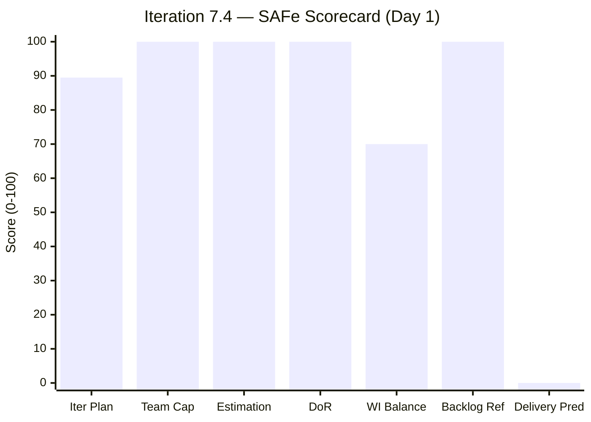
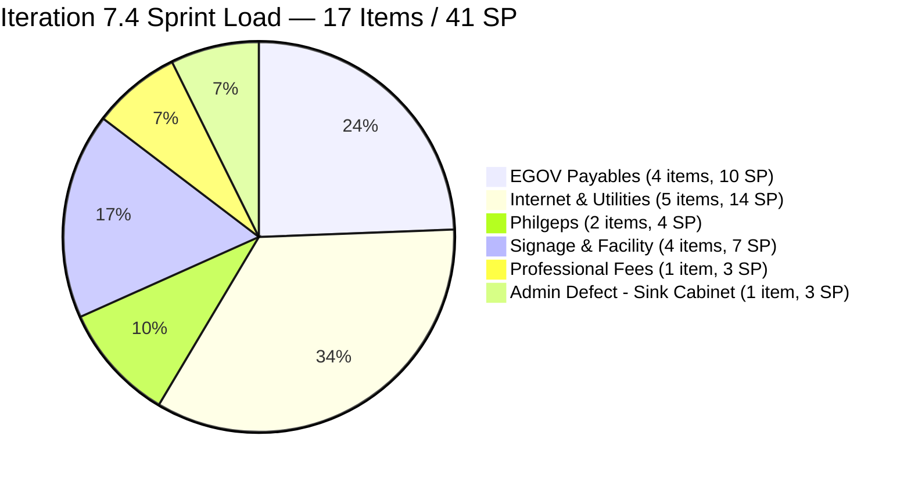
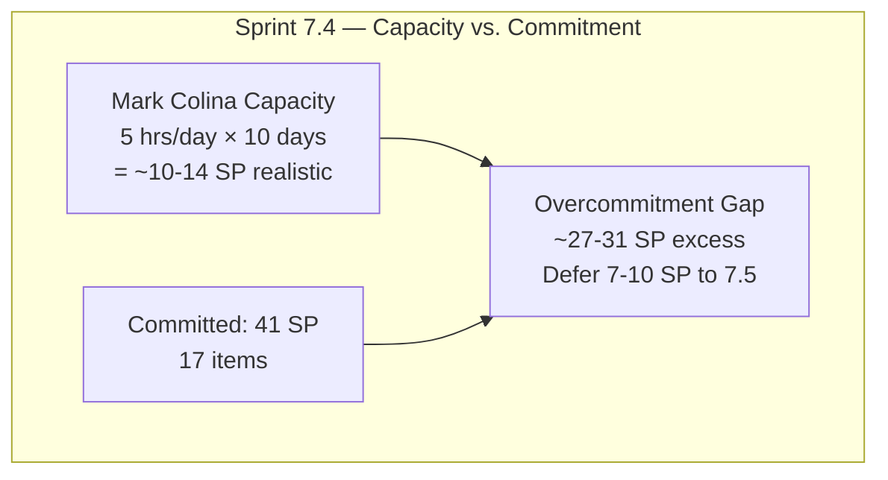
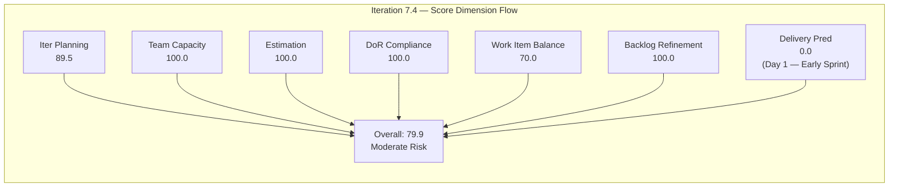
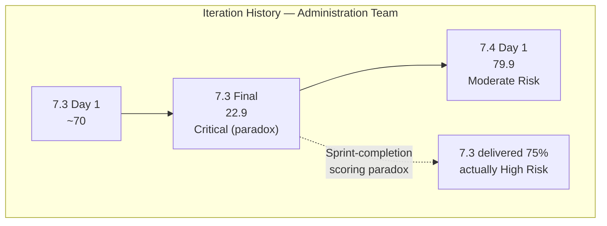

# SAFe Iteration Audit — Administration Team

## 1. Audit Metadata

| Field | Value |
|-------|-------|
| **Project** | Jairosoft FINOPS |
| **Team** | Administration Team |
| **Workspace** | `ado_admin` |
| **ADO Project ID** | e0bb302f-40f9-46c3-8164-6f1acb317d63 |
| **ADO Team ID** | a38a9c02-07ab-483d-a1e3-aff54e19e603 |
| **Iteration** | Iteration 7.4 |
| **Iteration Start** | 2026-05-18 |
| **Iteration Finish** | 2026-05-31 |
| **Audit Date** | 2026-05-18 (CDT) |
| **Audit Day** | Day 1 of 14 — Sprint Open |
| **Prior Audit** | AUDIT_20260517_0203.md (Day 14, Iteration 7.3, 22.9 — Critical Risk [scoring paradox]) |
| **Overall Score** | **79.9 / 100** |
| **Risk Band** | **Moderate Risk** |

---

## 2. Executive Summary

The Administration Team opens Iteration 7.4 at **79.9 / 100 (Moderate Risk)** — a dramatic improvement from the 22.9 Critical score at Iteration 7.3 close, which was a scoring paradox caused by all items having exited the visible backlog. This score is the team's strongest sprint-open score since PI 6.5.

**Sprint loading is the primary concern.** Seventeen items totaling **41 committed story points** are assigned to Iteration 7.4 against Mark Colina's capacity of 5 hrs/day × 10 working days = 50 hours. At 41 SP, this represents approximately **3.4× a realistic single-contributor sprint velocity** (estimated at 8–12 SP). The sprint is severely overloaded and must be right-sized before Day 2.

**Bright spots:** Estimation is perfect (17/17 items estimated), DoR compliance is perfect (all items have adequate Description and Acceptance Criteria), and capacity is fully configured. The team enters the sprint with excellent backlog hygiene — all 19 visible items were updated within the last 3 days.

**Single exception:** Item 202366 (Philgeps renewal for 2026) was last changed May 15 and technically qualifies as "untouched" relative to the sprint start of May 18. At only 1 item/17 items = 5.9% of the sprint, this does not trigger a Backlog Refinement penalty but should be updated with a status comment today.

**Work Item Balance is capped at 70.0** by the dominant User Story type (16/17 = 94.1%). This is structurally expected for the Administration Team whose work is operationally categorized; no corrective action is warranted on type balance alone.

**Delivery Predictability is 0.0** because no items have been closed on Day 1 of the sprint. This is expected and annotated as an early-sprint measurement. The committed 41 SP is at risk of only partial delivery given capacity constraints.

---

## 3. Previous Audit Delta

**Prior audit:** AUDIT_20260517_0203.md — Iteration 7.3, Day 14 Final, Score 22.9 / 100 (Critical Risk — scoring paradox)

| Dimension | 7.3 Day 14 | 7.4 Day 1 | Delta | Driver |
|-----------|-----------|----------|-------|--------|
| Iteration Planning | 0.0 | **89.5** | +89.5 | 17 of 19 items now in active iteration |
| Team Capacity | 0.0 | **100.0** | +100.0 | Mark has current work + configured capacity |
| Estimation | 0.0 | **100.0** | +100.0 | 17/17 items estimated; structural recovery |
| DoR Compliance | 0.0 | **100.0** | +100.0 | All 17 items have Description + AC |
| Work Item Balance | 60.0 | **70.0** | +10.0 | User Story present; dominant type penalty (-30) |
| Backlog Refinement | 100.0 | **100.0** | 0.0 | All items fresh; no stale items |
| Delivery Predictability | 0.0 | **0.0** | 0.0 | Day 1 — no closures yet (early-sprint) |
| **Overall** | **22.9** | **79.9** | **+57.0** | Sprint transition from paradox floor to operational baseline |

**Key finding:** The 57-point score jump from 7.3 to 7.4 is the expected recovery from the sprint-completion scoring paradox. The 7.3 score (22.9) reflected an empty visible sprint; the 7.4 score (79.9) reflects a fully loaded new sprint. The Administration Team's structural practices — capacity configuration, estimation discipline, and DoR hygiene — are intact and high-functioning.

**Sprint-over-sprint delivery trend:**

| Iteration | Final Score | Risk Band | Delivery Rate |
|-----------|------------|-----------|---------------|
| 6.5 | ~55 | Moderate | 61.3% (19/31 SP) |
| 7.3 | 22.9 | Critical (paradox) | 75% (12/~16 SP contextual) |
| 7.4 | 79.9 | Moderate | TBD — Day 1 |

---

## 4. Current Iteration Snapshot

| Attribute | Value |
|-----------|-------|
| Active Iteration | Iteration 7.4 |
| Sprint Duration | 2026-05-18 to 2026-05-31 (14 days) |
| Audit Day | **Day 1 — Sprint Open** |
| Current Iteration Root Items (visible backlog) | **17** |
| Total Visible Backlog Root Items | 19 |
| Sprint Load % | **89.5%** |
| Total Committed Story Points | **41 SP** |
| Closed Story Points | 0 SP (Day 1) |
| Active Team Members | 1 (Mark Colina) |
| Capacity Configured | Yes — 5 hrs/day (1 Deployment + 2 Documentation + 2 Requirements) |
| Days Off | 0 |
| Items Outside 7.4 | 2 (203717 in 7.5, 204380 at PI7 root) |

---

## 5. Work Item Analysis

### 5.1 Current Iteration Items — Iteration 7.4 (17 items)

| ID | Title | Type | State | SP | DoR | Changed | Notes |
|----|-------|------|-------|----|-----|---------|-------|
| 204363 | Government (EGOV) payables May 26-31 | User Story | New | 2 | ✓ | 2026-05-18 | |
| 204452 | Professional fee payables | User Story | New | 3 | ✓ | 2026-05-18 | |
| 204448 | Condo dues (Cebu) payables (2nd) | User Story | New | 2 | ✓ | 2026-05-18 | Duplicate title of 203558 |
| 204394 | Utilities payables May 27-30, 2026 | User Story | New | 2 | ✓ | 2026-05-18 | |
| 204391 | Utilities payables May 24-26, 2026 | User Story | New | 2 | ✓ | 2026-05-18 | |
| 204387 | Payables - Internet (duplicate) | User Story | New | 2 | ✓ | 2026-05-18 | Appears to duplicate 203556 |
| 204367 | Government (EGOV) payables May 20 | User Story | Ready | 2 | ✓ | 2026-05-18 | |
| 204305 | Philgeps renewal payment | User Story | New | 1 | ✓ | 2026-05-18 | Related to 202366 |
| 203716 | Procure Signage Materials | User Story | Req. Gathering | 2 | ✓ | 2026-05-18 | Updated today |
| 203693 | Admin CR sink cabinet | Defect | Ready | 3 | ✓ | 2026-05-18 | |
| 203558 | Condo dues (Cebu) payables | User Story | Ready | 3 | ✓ | 2026-05-18 | |
| 203557 | Utilities payables for Cebu and Davao | User Story | Ready | 4 | ✓ | 2026-05-18 | |
| 203556 | Payables - Internet for Davao and Cebu | User Story | Ready | 4 | ✓ | 2026-05-18 | Deferred from 7.3 |
| 203555 | Government (EGOV) payables May 18-25 | User Story | New | 4 | ✓ | 2026-05-18 | |
| 204135 | 3 vendors for panaflex signage | User Story | Ready | 1 | ✓ | 2026-05-18 | |
| 204136 | 3 vendors for flag pole | User Story | Ready | 1 | ✓ | 2026-05-18 | |
| 202366 | Philgeps renewal for 2026 | User Story | New | 3 | ✓ | 2026-05-15 | Untouched pre-sprint |

**Total committed: 41 SP across 17 items (16 User Stories + 1 Defect)**

### 5.2 Items Outside Iteration 7.4

| ID | Title | Type | Iter | State | SP | Changed |
|----|-------|------|------|-------|----|---------|
| 203717 | Installation of Street Signage | User Story | 7.5 | Req. Gathering | 3 | 2026-05-05 |
| 204380 | Government (EGOV) payables May 28-31 | User Story | PI7 (root) | Ready | 2 | 2026-05-18 |

**Note on 204380:** This item is assigned to the PI7 root iteration path rather than a specific sub-iteration. It should be explicitly assigned to 7.4 (if intended for this sprint) or 7.5. Currently it does not count toward either iteration's planning ratio.

### 5.3 Sprint Overload Analysis

Mark Colina's realistic capacity for Iteration 7.4:
- Capacity: 5 hrs/day × 10 working days = **50 hours**
- A single contributor at 5 hrs/day typically delivers **8–14 SP per sprint**
- Committed: **41 SP** = approximately 3× capacity

**Overloaded clusters by category:**

| Category | Items | SP |
|----------|-------|----|
| Government/EGOV payables | 4 | 10 |
| Internet/Utilities payables | 5 | 14 |
| Philgeps (renewal + payment) | 2 | 4 |
| Facility/Signage | 4 | 7 |
| Defect (sink cabinet) | 1 | 3 |
| Professional fees | 1 | 3 |
| **Total** | **17** | **41** |

**Recommended immediate action:** Defer the signage category (203716, 204135, 204136 = 4 SP) and facility defect (203693 = 3 SP) to Iteration 7.5 unless these have hard deadlines in the current sprint window. This would reduce commitment to ~34 SP — still high but closer to realistic throughput.

### 5.4 Duplicate/Near-Duplicate Item Flags

| Issue | Items | Recommendation |
|-------|-------|----------------|
| Condo dues Cebu: two items | 203558 (3 SP) and 204448 (2 SP) | Verify: different billing periods or duplicate; close one |
| Internet payables: two items | 203556 (4 SP, deferred from 7.3) and 204387 (2 SP) | Verify: same or different billing periods |
| Philgeps: two items | 202366 (renewal, 3 SP) and 204305 (payment, 1 SP) | These appear to be distinct (renewal vs. payment fee); both may be valid |

---

## 6. SAFe Compliance Scorecard

| Dimension | Score | Evidence | Notes |
|-----------|-------|----------|-------|
| Iteration Planning | 89.5 | 17 of 19 visible backlog items in Iteration 7.4 | 2 items outside 7.4 (203717 in 7.5; 204380 at PI7 root) |
| Team Capacity | 100.0 | Mark Colina: 5 hrs/day, 3 activities, 0 days off | Single contributor; capacity config maintained from 7.3 |
| Estimation | 100.0 | 17 of 17 point-eligible items estimated | All items carry Story Point estimates; clean baseline |
| DoR Compliance | 100.0 | 17 of 17 items: Description ≥30 chars ✓; AC ≥20 chars ✓ | Perfect DoR at sprint open; all items ready for work |
| Work Item Balance | 70.0 | User Story: 16/17 = 94.1% (dominant >60%: −30); no Spikes; 1 Defect | Penalty for monoculture; structural given Admin Team work nature |
| Backlog Refinement | 100.0 | 19/19 fresh within 45 days; 0 stale ≥90d; 0 stale ≥180d; untouched=1/17=5.9% ≤10% | Excellent hygiene; oldest item 203717 = May 5 (13 days) |
| Delivery Predictability | 0.0 | committed_sp=41; closed_sp=0; Day 1 of sprint | **Early-sprint — low delivery expected; Day 1 of 14-day sprint** |
| **Overall** | **79.9** | (89.5+100+100+100+70+100+0) / 7 = 559.5/7 | **Moderate Risk — strong structural compliance; overcommitment is primary risk** |

---

## 7. Dimension Findings

### 7.1 Iteration Planning — 89.5 (Low Risk)

17 of 19 visible backlog items are in the active iteration. The 89.5% planning ratio is the highest ever recorded for this team and reflects excellent sprint scoping — almost the entire active backlog is committed. Two items sit outside 7.4: 203717 (correctly staged for 7.5) and 204380 (needs explicit iteration assignment).

**Overcommitment caveat:** While the planning ratio is strong, the absolute volume (17 items, 41 SP) far exceeds Mark Colina's realistic throughput. A high planning ratio is not intrinsically good when the sprint is overloaded relative to capacity.

### 7.2 Team Capacity — 100.0 (Low Risk)

Mark Colina is the sole contributor with current iteration work and has full capacity configured (5 hrs/day, Deployment + Documentation + Requirements). Capacity is appropriately carried forward from 7.3. No days off recorded.

**Persistent bus factor risk:** All Administration Team operations — government filings, EGOV payments, PhilGEPS compliance, facility management — depend on one contributor. No backup coverage is documented. This structural risk has appeared in every audit since the team's first.

### 7.3 Estimation — 100.0 (Low Risk)

All 17 point-eligible items carry Story Point estimates. This is the first sprint with perfect estimation coverage for this team. Story point values range from 1 to 4 SP, which is appropriate for operational tasks. No calibration concerns noted.

### 7.4 DoR Compliance — 100.0 (Low Risk)

All 17 sprint items have adequate Description (≥30 non-whitespace chars) and Acceptance Criteria (≥20 non-whitespace chars). This is a significant improvement from prior sprints where items like 204198 (Philgeps payment in 7.3) lacked DoR content. The team's DoR hygiene entering 7.4 is the best on record.

### 7.5 Work Item Balance — 70.0 (Moderate Risk)

User Stories comprise 16/17 = 94.1% of the sprint, exceeding the 60% dominant-type threshold and triggering a −30 penalty (100 − 30 = 70). One Defect (203693 — Admin CR sink cabinet) is present, which satisfies the "no User Story" criterion but does not prevent the monoculture penalty.

The Administration Team's operational mandate produces inherently homogeneous work item types. A mix of Spikes or additional Defects could mechanically improve the score but would not reflect actual process improvement. The 70.0 score is structurally expected and acceptable.

### 7.6 Backlog Refinement — 100.0 (Low Risk)

All 19 visible backlog items have ChangedDate values within the 45-day freshness threshold:
- Oldest item: 203717 (Installation of Street Signage) — changed May 5 = 13 days ago
- Freshest items: 17 items changed today (May 18) at sprint open
- Stale ≥90 days: 0 items
- Stale ≥180 days: 0 items
- Untouched current items: 1 (202366, changed May 15 = 3 days before sprint start, 5.9% of current items — below 10% penalty threshold)

Backlog hygiene is excellent. The team's pattern of updating items at sprint boundaries continues consistently.

### 7.7 Delivery Predictability — 0.0 (Early-Sprint — Expected)

**Early-sprint annotation:** This is Day 1 of the 14-day sprint. No story points have been closed; the 0.0 score is expected and does not indicate a delivery failure.

`committed_story_points = 41`; `closed_story_points = 0`. The 41 SP commitment is the team's largest on record and significantly exceeds Mark Colina's realistic throughput. Based on historical patterns:
- 7.3 delivered ~75% of committed scope (12 of ~16 SP) in 14 days
- At 5 hrs/day, realistic 7.4 output: 8–14 SP
- Expected 7.4 delivery rate at current commitment: ~20–34% of committed SP

Recommend re-scoping the sprint by deferring lower-priority items to 7.5 to improve the projected delivery rate above 60%.

---

## 8. Risks and Bottlenecks

| Risk | Severity | Description |
|------|----------|-------------|
| Sprint overcommitment (41 SP, solo contributor) | **Critical** | Mark's realistic throughput is 8–14 SP; 41 SP loaded is ~3× capacity; expect significant carry-over without immediate right-sizing |
| Duplicate/near-duplicate work items | **High** | Two pairs of potentially duplicate items (Condo dues: 203558+204448; Internet: 203556+204387) need verification before work begins; risk of duplicate payment effort |
| 204380 at PI7 root — unscheduled | **Moderate** | EGOV payables May 28-31 has no sub-iteration assignment; may be forgotten or double-counted; assign to 7.4 or 7.5 today |
| 202366 untouched at sprint open | **Low** | PhilGEPS renewal was last updated May 15; not a penalty yet but should receive a status comment at sprint planning |
| Bus factor = 1 | **High** | All administration operations halt if Mark Colina is unavailable; no documented backup in 7 consecutive audits |

---

## 9. Prioritized Recommendations

1. **Right-size the sprint immediately — defer at least 7–10 SP to Iteration 7.5.** At 41 SP, the sprint is loaded at approximately 3× Mark's realistic capacity. Recommended deferrals (in priority order): 203693 Admin CR sink cabinet (3 SP — facility work, not time-critical), 203716 Procure Signage Materials (2 SP), 204135 and 204136 (3 vendors for panaflex/flag pole, 2 SP total). This would reduce commitment to ~32 SP. If any of these have hard external deadlines in the May 18–31 window, retain them and defer the lowest-priority payable items instead.

2. **Resolve the duplicate item pairs before starting work.** Items 203558 and 204448 both appear to be "Condo dues (Cebu) payables." Items 203556 and 204387 both appear to be "Internet payables for Davao and Cebu." Before processing any payments, verify whether these are distinct billing periods or accidental duplicates. If duplicates, close the lower-priority item; if distinct, update titles to include the specific billing period dates.

3. **Assign 204380 (EGOV payables May 28-31) to a specific iteration today.** This item is at the PI7 root iteration path and will not be counted in any sprint's planning ratio. Assign it to Iteration 7.4 if it belongs in this sprint or 7.5 if it's for the next cycle.

4. **Add a status comment to 202366 (Philgeps renewal for 2026).** This item was last updated May 15 and has been in the backlog since sprint 7.3. At sprint planning, add a comment documenting: current renewal status (in process, submitted, or not started), the renewal deadline, and any payment steps outstanding. This prevents context loss across the sprint boundary.

5. **Sequence EGOV payables by due date — work the earliest deadlines first.** The sprint contains multiple EGOV payable items with different date ranges (May 18–25, May 20, May 26–31, May 28–31). Mark should process these in strict deadline order, not backlog order. Review all due dates at sprint planning and sequence accordingly.

6. **Document a bus factor mitigation plan in `ado_admin/CLAUDE.md`.** This finding has appeared in every audit since the team's inception. Before Day 3, add a `Contingency` section documenting: named backup contacts for government compliance filings, utility/internet payment processing, and emergency escalation to Ramon. This is the highest-impact structural risk that cannot be addressed by sprint planning alone.

---

## 10. Evidence Gaps and Limitations

| Gap | Impact on Scoring |
|-----|------------------|
| 41 SP committed vs. 5 hrs/day capacity | Cannot directly score capacity utilization vs. commitment ratio; rubric scores Team Capacity configuration only, not sprint load appropriateness |
| Duplicate item pairs unresolved | Cannot determine whether 203558/204448 and 203556/204387 represent distinct payments or duplicates; both counted in rubric metrics |
| External billing deadlines not in ADO | Cannot assess which items have hard payment deadlines; sprint prioritization cannot be validated from ADO evidence alone |
| 204380 (EGOV May 28-31) at PI7 root | Item excluded from current_iteration_root_items; not counted in planning, estimation, or DoR scores |
| Closed story points = 0 | Delivery Predictability scores 0.0 on Day 1; will update with each subsequent audit |

**Score interpretation:** The 79.9 Moderate Risk score reflects the Administration Team's strongest sprint-open structural compliance — perfect estimation, perfect DoR, and strong backlog freshness. The Delivery Predictability zero is expected on Day 1. The primary concern is the overcommitment (41 SP vs. ~10 SP realistic throughput), which will likely depress the final sprint delivery rate if not corrected today.

---

## Appendix — Score Visualization

