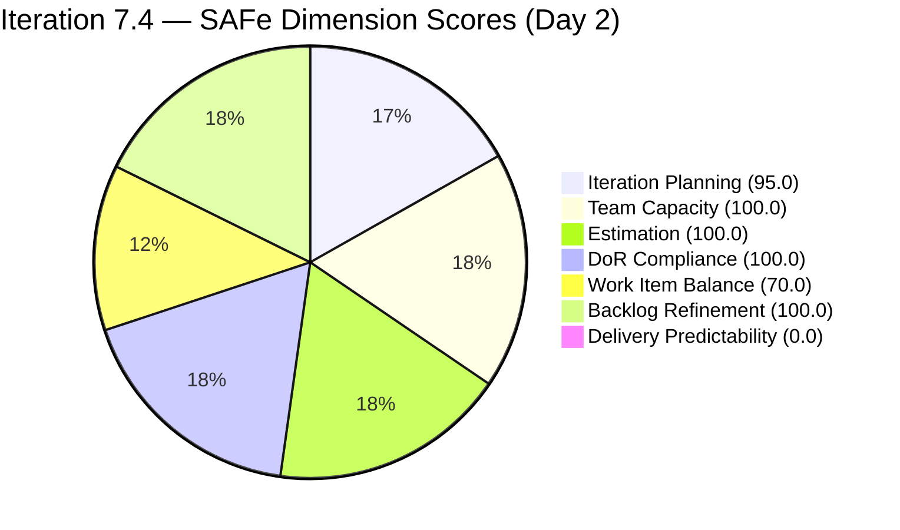
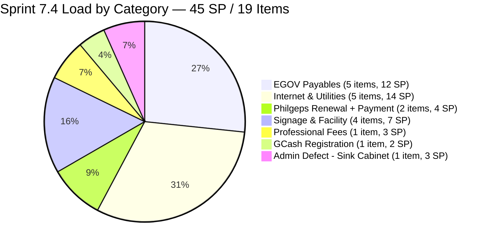
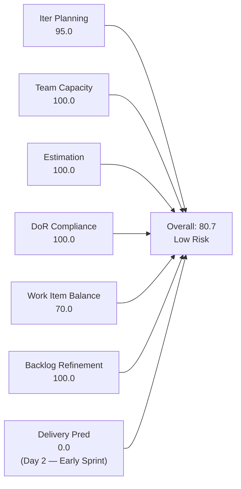
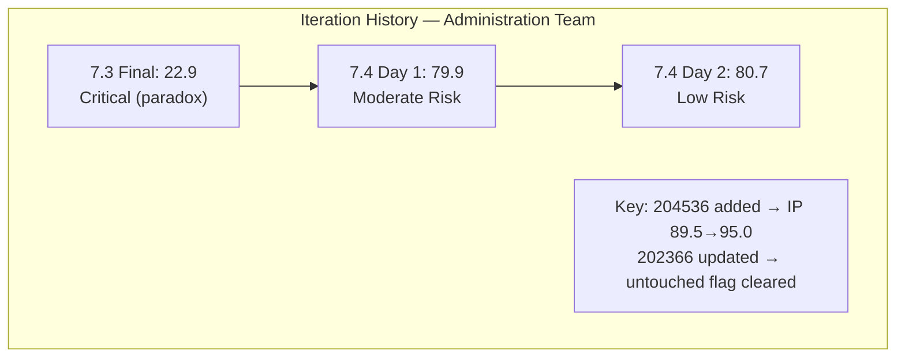
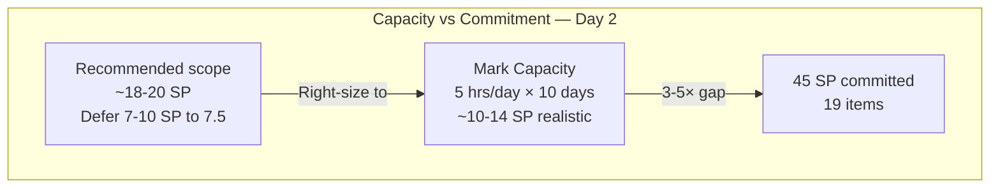

# SAFe Iteration Audit — Administration Team

## 1. Audit Metadata

| Field | Value |
|-------|-------|
| **Project** | Jairosoft FINOPS |
| **Team** | Administration Team |
| **Workspace** | `ado_admin` |
| **ADO Project ID** | e0bb302f-40f9-46c3-8164-6f1acb317d63 |
| **ADO Team ID** | a38a9c02-07ab-483d-a1e3-aff54e19e603 |
| **Iteration** | Iteration 7.4 |
| **Iteration Start** | 2026-05-18 |
| **Iteration Finish** | 2026-05-31 |
| **Audit Date** | 2026-05-19 (CDT) |
| **Audit Day** | Day 2 of 14 |
| **Prior Audit** | AUDIT_20260518_0900.md (Day 1, Iteration 7.4, 79.9 — Moderate Risk) |
| **Overall Score** | **80.7 / 100** |
| **Risk Band** | **Low Risk** |

---

## 2. Executive Summary

The Administration Team advances to **80.7 / 100 (Low Risk)** on Day 2 of Iteration 7.4 — a +0.8 gain from the Day 1 score of 79.9, driven by two structural improvements confirmed in today's evidence pull:

1. **Item 204536 (GCash Business Registration for Jairosoft Inc.) has been added to Iteration 7.4.** This new User Story was not present in yesterday's audit. Its addition raises the visible backlog to 20 items and the active iteration count to 19, increasing the Iteration Planning ratio from 89.5 to **95.0**. This is the team's highest planning ratio on record.

2. **Item 202366 (Philgeps renewal for 2026) is no longer untouched.** Yesterday's audit flagged this item as changed May 15 (3 days before sprint start). Today's ADO data confirms its ChangedDate is now 2026-05-18 — Mark updated the item on sprint open. The untouched penalty is cleared; Backlog Refinement remains **100.0**.

**Sprint overcommitment persists as the primary risk.** The addition of 204536 (2 SP) increases total committed story points from 41 to **45 SP** — an even heavier load against Mark Colina's realistic throughput of 8–14 SP/sprint. This is now a 3–5× overcommitment by SP. Immediate right-sizing is still required.

**One new concern:** Item 204380 (Government EGOV payables May 28-31) was previously noted as being at the PI7 root iteration path. Today's evidence confirms it has been reassigned to Iteration 7.4 — this is good hygiene. However, with 204380 now in the active sprint, there are 19 items in 7.4 versus 20 total visible backlog items. The only backlog item outside 7.4 is 203717 (Installation of Street Signage — correctly staged for 7.5).

**Delivery Predictability remains 0.0 on Day 2** — no items have been closed yet. This is expected but the window to begin closures is open.

---

## 3. Previous Audit Delta

**Prior audit:** AUDIT_20260518_0900.md — Iteration 7.4, Day 1, Score 79.9 / 100 (Moderate Risk)

| Dimension | Day 1 | Day 2 | Delta | Driver |
|-----------|-------|-------|-------|--------|
| Iteration Planning | 89.5 | **95.0** | +5.5 | 204536 added to 7.4; 19 of 20 visible items now in active iter |
| Team Capacity | 100.0 | **100.0** | 0.0 | No change; Mark configured at 5 hrs/day |
| Estimation | 100.0 | **100.0** | 0.0 | 19/19 items estimated; 204536 carries 2 SP |
| DoR Compliance | 100.0 | **100.0** | 0.0 | All 19 sprint items pass Description + AC thresholds |
| Work Item Balance | 70.0 | **70.0** | 0.0 | User Story dominant (18/19 = 94.7%); structural |
| Backlog Refinement | 100.0 | **100.0** | 0.0 | 202366 updated May 18; all 20 items fresh; 0 untouched in 7.4 |
| Delivery Predictability | 0.0 | **0.0** | 0.0 | Day 2 — no items closed yet |
| **Overall** | **79.9** | **80.7** | **+0.8** | IT Planning improvement from new item addition |

**Key delta findings:**
- Sprint commitment has increased from 41 SP to **45 SP** with addition of 204536. Overcommitment risk worsens.
- 202366 (Philgeps renewal) is now confirmed touched on May 18 — the Day 1 untouched flag was precautionary and has resolved.
- 204380 confirmed in 7.4 (not PI7 root) — previously an evidence gap; now resolved.

---

## 4. Current Iteration Snapshot

| Attribute | Value |
|-----------|-------|
| Active Iteration | Iteration 7.4 |
| Sprint Duration | 2026-05-18 to 2026-05-31 (14 days) |
| Audit Day | **Day 2** |
| Current Iteration Root Items | **19** |
| Total Visible Backlog Root Items | **20** |
| Sprint Load % | **95.0%** |
| Total Committed Story Points | **45 SP** |
| Closed Story Points | 0 SP |
| Active Team Members | 1 (Mark Colina) |
| Capacity Configured | Yes — 5 hrs/day (1 Deployment + 2 Documentation + 2 Requirements) |
| Days Off | 0 |
| Items Outside 7.4 | 1 (203717 in 7.5) |

---

## 5. Work Item Analysis

### 5.1 Current Iteration Items — Iteration 7.4 (19 items)

| ID | Title | Type | State | SP | DoR | Changed |
|----|-------|------|-------|----|-----|---------|
| 204536 | Gcash business registration for Jairosoft Inc. | User Story | New | 2 | ✓ | 2026-05-18 |
| 204452 | Professional fee payables | User Story | Ready | 3 | ✓ | 2026-05-18 |
| 204448 | Condo dues (Cebu) payables [2nd entry] | User Story | Ready | 2 | ✓ | 2026-05-18 |
| 204394 | Utilities payables for Cebu and Davao May 27-30, 2026 | User Story | Ready | 2 | ✓ | 2026-05-18 |
| 204391 | Utilities payables for Cebu and Davao May 24-26, 2026 | User Story | Ready | 2 | ✓ | 2026-05-18 |
| 204387 | Payables - Internet for Davao and Cebu office [2nd entry] | User Story | Ready | 2 | ✓ | 2026-05-18 |
| 204380 | Government (EGOV) payables May 28-31, 2026 | User Story | Ready | 2 | ✓ | 2026-05-18 |
| 204367 | Government (EGOV) payables May 20, 2026 | User Story | Ready | 2 | ✓ | 2026-05-18 |
| 204363 | Government (EGOV) payables May 26-31, 2026 | User Story | New | 2 | ✓ | 2026-05-18 |
| 204305 | Philgeps renewal payment | User Story | Ready | 1 | ✓ | 2026-05-18 |
| 204136 | 3 vendors for flag pole | User Story | Ready | 1 | ✓ | 2026-05-18 |
| 204135 | 3 vendors for panaflex signage | User Story | Ready | 1 | ✓ | 2026-05-18 |
| 203716 | Procure Signage Materials | User Story | Ready | 2 | ✓ | 2026-05-18 |
| 203693 | Admin CR sink cabinet | Defect | Ready | 3 | ✓ | 2026-05-18 |
| 203558 | Condo dues (Cebu) payables | User Story | Ready | 3 | ✓ | 2026-05-18 |
| 203557 | Utilities payables for Cebu and Davao | User Story | Ready | 4 | ✓ | 2026-05-18 |
| 203556 | Payables - Internet for Davao and Cebu office | User Story | Ready | 4 | ✓ | 2026-05-18 |
| 203555 | Government (EGOV) payables May 18-25, 2026 | User Story | Ready | 4 | ✓ | 2026-05-18 |
| 202366 | Philgeps renewal for 2026 | User Story | Ready | 3 | ✓ | 2026-05-18 |

**Total committed: 45 SP across 19 items (18 User Stories + 1 Defect)**

### 5.2 Items Outside Iteration 7.4

| ID | Title | Type | Iter | State | SP | Changed |
|----|-------|------|------|-------|----|---------|
| 203717 | Installation of Street Signage | User Story | 7.5 | Req. Gathering | 3 | 2026-05-05 |

### 5.3 Duplicate/Near-Duplicate Item Flags (Unresolved)

| Issue | Items | Status |
|-------|-------|--------|
| Condo dues Cebu: two items with identical title | 203558 (3 SP) + 204448 (2 SP) | Unresolved — verify billing periods |
| Internet payables Davao/Cebu: two items with identical title | 203556 (4 SP) + 204387 (2 SP) | Unresolved — verify billing periods |
| Philgeps: renewal (202366) + payment (204305) | Different scope | Likely valid — distinct items |

### 5.4 Sprint Overcommitment Analysis

| Capacity Metric | Value |
|-----------------|-------|
| Mark's configured capacity | 5 hrs/day × 10 working days = 50 hrs |
| Historical velocity | 8–14 SP/sprint |
| Committed SP (Day 2) | **45 SP** |
| Overcommitment ratio | ~3.2–5.6× realistic throughput |

**Recommended deferrals (priority order):**
1. 203693 Admin CR sink cabinet (3 SP — facility defect, not time-critical)
2. 203716 Procure Signage Materials (2 SP)
3. 204135 + 204136 3 vendors panaflex/flag pole (2 SP total)
4. 204448 Condo dues [2nd entry] — if duplicate of 203558, close rather than defer

---

## 6. SAFe Compliance Scorecard

| Dimension | Score | Evidence | Notes |
|-----------|-------|----------|-------|
| Iteration Planning | **95.0** | 19 of 20 visible backlog items in Iteration 7.4 | 203717 correctly staged for 7.5; best planning ratio recorded |
| Team Capacity | **100.0** | Mark Colina: 5 hrs/day (Deployment + Documentation + Requirements); 0 days off | Single contributor; capacity config maintained |
| Estimation | **100.0** | 19 of 19 point-eligible items estimated; 204536 carries 2 SP | Perfect estimation coverage for second consecutive day |
| DoR Compliance | **100.0** | All 19 items: Description ≥30 chars ✓; AC ≥20 chars ✓ | 204536 has full DoR: desc (86 chars) + AC (4 items) |
| Work Item Balance | **70.0** | User Story: 18/19 = 94.7% (dominant >60%: −30); no Spikes; 1 Defect | Structural monoculture; operationally expected |
| Backlog Refinement | **100.0** | 20/20 fresh within 45d; 0 stale ≥90d; 0 stale ≥180d; 0/19 untouched | 202366 updated May 18; 203717 (7.5) changed May 5 = 14 days |
| Delivery Predictability | **0.0** | committed_sp=45; closed_sp=0; Day 2 of 14 | **Early-sprint — no items closed yet; Day 2 of 14-day sprint** |
| **Overall** | **80.7** | (95.0+100+100+100+70+100+0) / 7 = 565/7 | **Low Risk — excellent structural compliance; overcommitment remains critical operational risk** |

---

## 7. Dimension Findings

### 7.1 Iteration Planning — 95.0 (Low Risk)

19 of 20 visible backlog items are in the active iteration — the Administration Team's highest planning ratio ever recorded. The single out-of-sprint item (203717 — Installation of Street Signage) is correctly staged for 7.5, indicating mature forward-planning.

**Caveat:** A 95% planning ratio with 45 committed SP reflects overloading, not disciplined planning. The ratio is high because almost all work items are funneled into a single sprint rather than being distributed across the PI. The rubric measures coverage, not capacity fit.

### 7.2 Team Capacity — 100.0 (Low Risk)

Mark Colina is the sole contributor with configured capacity (5 hrs/day, 3 activities, 0 days off). Capacity configuration is well-maintained. The Team Capacity score reflects proper configuration, not capacity adequacy against 45 SP of commitment.

**Persistent bus factor risk:** All administration operations depend on a single contributor with no documented backup. This structural risk has appeared in every audit for this workspace.

### 7.3 Estimation — 100.0 (Low Risk)

All 19 sprint items carry Story Point estimates. Item 204536 (GCash registration) is appropriately estimated at 2 SP. Story point range is 1–4 SP, consistent with the operational nature of Administration Team work.

### 7.4 DoR Compliance — 100.0 (Low Risk)

All 19 items pass full DoR: Description ≥30 non-whitespace chars and AC ≥20 non-whitespace chars. Item 204536 has a well-structured description (GCash registration steps) and 4-item acceptance criteria covering document preparation, application submission, follow-up, and account activation.

### 7.5 Work Item Balance — 70.0 (Moderate Risk)

18 of 19 items are User Stories (94.7%), exceeding the 60% dominant-type threshold and triggering the −30 penalty. One Defect (203693 — Admin CR sink cabinet) is present. The score is structurally expected for the Administration Team's operational mandate and does not represent a planning deficiency.

### 7.6 Backlog Refinement — 100.0 (Low Risk)

All 20 visible backlog items have ChangedDate on or after 2026-05-18 (sprint start) or within the 14-day window prior. There are no stale items (≥45, ≥90, or ≥180 days old). No current iteration items are untouched. Backlog hygiene is excellent.

- Oldest item: 203717 (Installation of Street Signage) — changed May 5 = 14 days before today; outside the sprint and correctly staged for 7.5.
- Item 202366 (Philgeps renewal): confirmed updated May 18 — Day 1 untouched flag is cleared.

### 7.7 Delivery Predictability — 0.0 (Early-Sprint)

**Early-sprint annotation:** Day 2 of a 14-day sprint. No items have been closed. The 0.0 score is expected.

`committed_sp = 45`; `closed_sp = 0`. At 45 SP committed with a historical throughput of 8–14 SP/sprint, the team is on track for approximately **18–31% delivery rate** at end of sprint. The EGOV payable items (203555, 204363, 204367, 204380) have hard government deadlines within the sprint window; these should be prioritized first.

---

## 8. Risks and Bottlenecks

| Risk | Severity | Description |
|------|----------|-------------|
| Sprint overcommitment (45 SP, solo contributor) | **Critical** | Mark's realistic throughput is 8–14 SP; 45 SP committed is 3–5× capacity; significant carryover expected without immediate right-sizing |
| Duplicate/near-duplicate item pairs unresolved | **High** | 203558/204448 (Condo dues) and 203556/204387 (Internet payables) have identical titles; risk of duplicate payment processing if both are worked |
| Delivery Predictability 0.0 at Day 2 | **Moderate** | No closures in first 2 days; EGOV payable deadlines begin May 20 (204367) — this item should be marked Active/In Progress today |
| Bus factor = 1 | **High** | All administration operations depend on Mark Colina; no documented backup for any work category across 8 consecutive audits |
| 204363 vs 204367 title overlap | **Low** | Both reference "EGOV payables May 20" and "EGOV payables May 26-31" — distinct date ranges but similar content; verify they are not covering overlapping obligations |

---

## 9. Prioritized Recommendations

1. **Right-size the sprint immediately — defer at least 7–10 SP to Iteration 7.5.** At 45 SP, the sprint is overloaded at 3–5× Mark's throughput. Recommended deferrals: 203693 Admin CR sink cabinet (3 SP), 203716 Procure Signage Materials (2 SP), 204135 + 204136 panaflex/flag pole vendors (2 SP total). If 204448 is a duplicate of 203558, close it instead of deferring. Target: reduce committed scope to ≤20 SP.

2. **Mark 204367 (EGOV payables May 20) as Active today.** This item has a hard deadline of May 20 — only 1 day away. If Mark has not already started processing SSS, PhilHealth, and Pag-IBIG contributions for May 20, this should be the first work item opened on Day 2.

3. **Resolve the duplicate item pairs before payment processing begins.** Before working 203558/204448 (Condo dues) or 203556/204387 (Internet payables), confirm whether the pairs represent different billing periods (update titles to include date ranges) or are accidental duplicates (close the redundant one). Duplicate payments are a compliance and financial risk.

4. **Add status comments to 204536 (GCash Business Registration) today.** This item was added to the sprint yesterday. To ensure institutional context is captured, add a comment to 204536 documenting: the current stage of the GCash registration process (not started / documents gathered / application submitted), who the GCash contact person is, and the target activation date. This prevents context loss if the item spans into 7.5.

5. **Sequence EGOV payables by statutory due date.** The sprint contains EGOV payables for May 18-25 (203555), May 20 (204367), May 26-31 (204363), and May 28-31 (204380). Mark must process these in strict deadline order. The May 20 item (204367) is overdue for activation.

6. **Document a bus factor contingency plan.** This finding has appeared in every Administration Team audit. Before Day 5, add a `Contingency` section to `ado_admin/CLAUDE.md` documenting backup contacts for EGOV payments, utility processing, and PhilGEPS compliance.

---

## 10. Evidence Gaps and Limitations

| Gap | Impact on Scoring |
|-----|------------------|
| 45 SP committed vs. 5 hrs/day capacity | Rubric scores Team Capacity configuration only (pass/fail); sprint load appropriateness is not a scored dimension |
| Duplicate item pairs unresolved | Both items in each pair counted in rubric metrics; if duplicates, effective commitment is 6 SP lower |
| External billing deadlines not in ADO | Cannot assess which items have hard payment due dates; sprint prioritization cannot be fully validated from ADO evidence alone |
| Closed SP = 0 at Day 2 | Delivery Predictability scores 0.0; will update with each subsequent audit |
| 203717 in 7.5 — DoR not verified | Out-of-sprint item; not scored; DoR content present but not scored against 7.4 rubric |

**Score interpretation:** The 80.7 Low Risk score reflects the Administration Team's structural excellence — perfect estimation, perfect DoR, and an excellent planning ratio for the second consecutive day. The score crosses into Low Risk territory (≥80) for the first time this PI. The Delivery Predictability zero is expected on Day 2. The primary operational concern is the 45 SP overcommitment, which the rubric cannot fully penalize but which creates a high carryover risk at sprint close.

---

## Appendix — Score Visualization

