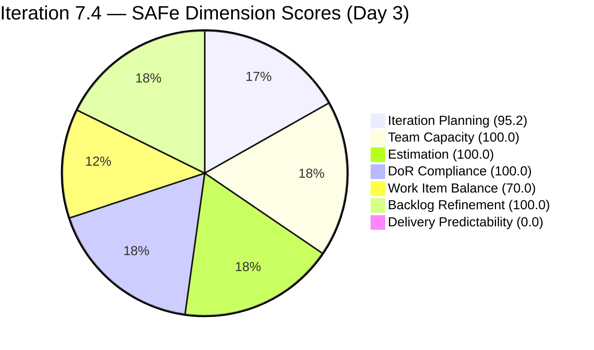
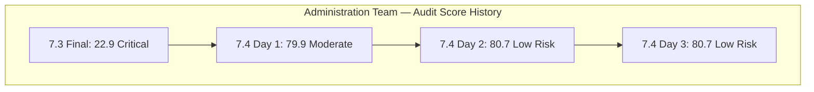
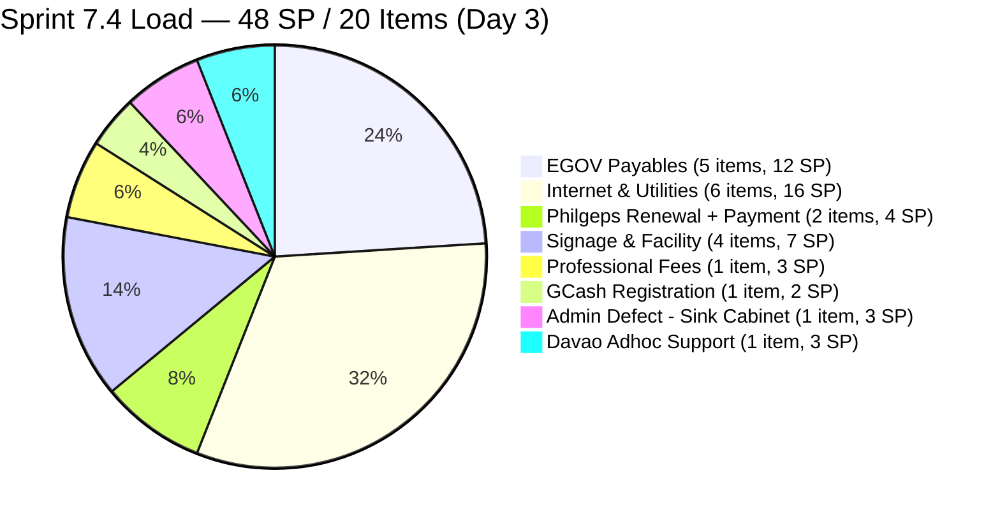
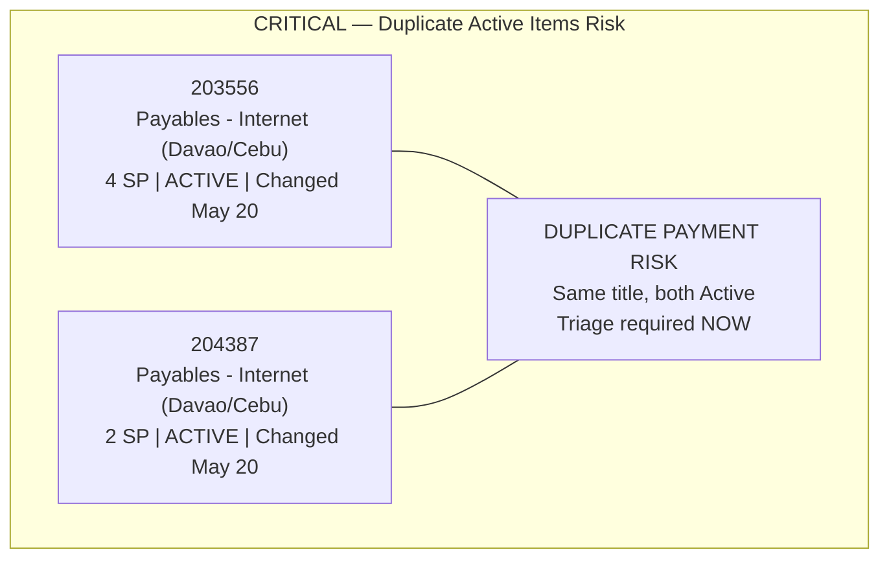
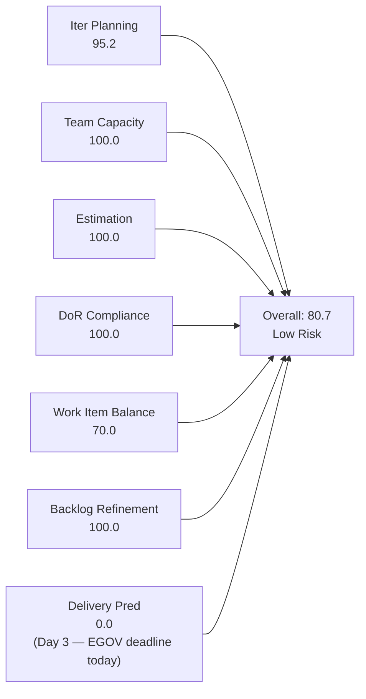

# SAFe Iteration Audit — Administration Team

## 1. Audit Metadata

| Field | Value |
|-------|-------|
| **Project** | Jairosoft FINOPS |
| **Team** | Administration Team |
| **Workspace** | `ado_admin` |
| **ADO Project ID** | e0bb302f-40f9-46c3-8164-6f1acb317d63 |
| **ADO Team ID** | a38a9c02-07ab-483d-a1e3-aff54e19e603 |
| **Iteration** | Iteration 7.4 |
| **Iteration Start** | 2026-05-18 |
| **Iteration Finish** | 2026-05-31 |
| **Audit Date** | 2026-05-20 (CDT) |
| **Audit Day** | Day 3 of 14 |
| **Prior Audit** | AUDIT_20260519_0205.md (Day 2, Iteration 7.4, 80.7 — Low Risk) |
| **Overall Score** | **80.7 / 100** |
| **Risk Band** | **Low Risk** |

---

## 2. Executive Summary

The Administration Team holds steady at **80.7 / 100 (Low Risk)** on Day 3 of Iteration 7.4. The score is numerically identical to Day 2 despite two material changes:

1. **New item 204675 (Davao Admin Adhoc Support May 18-31) has been added to Iteration 7.4.** This User Story was created on 2026-05-19, is in Active state, has 3 SP, and carries full DoR. Its addition increases the visible backlog to 21 items and the iteration count to 20 items, shifting the Iteration Planning ratio from 95.0 to **95.2** — a marginal +0.2 change. Committed story points rise from 45 SP to **48 SP**.

2. **Items 203556 and 204387 are both now in Active state.** Both Internet payables items (Davao and Cebu) show a ChangedDate of 2026-05-20 — Mark has opened at least one of these for active work today. This is a positive delivery signal, though no items have been Closed/Done.

**Sprint overcommitment worsens slightly.** Adding 204675 (3 SP) raises total committed SP to 48 — now 3.4–6× Mark's realistic throughput of 8–14 SP/sprint. The recommendation to right-size the sprint from Day 2 is even more urgent.

**Duplicate internet payables concern elevated.** Two items with identical titles are both now in Active state (203556 and 204387 — both "Payables - Internet for Davao and Cebu office"). This is the highest-risk state for the duplicate pair: if Mark processes payment for both, the company may pay twice. Immediate triage is required today.

**Delivery Predictability remains 0.0** — no items Closed/Done yet on Day 3. Mark must begin closing items in the next 2–3 days to avoid a velocity deficit at sprint end.

---

## 3. Previous Audit Delta

**Prior audit:** AUDIT_20260519_0205.md — Iteration 7.4, Day 2, Score 80.7 / 100 (Low Risk)

| Dimension | Day 2 | Day 3 | Delta | Driver |
|-----------|-------|-------|-------|--------|
| Iteration Planning | 95.0 | **95.2** | +0.2 | 204675 added to 7.4; 20 of 21 visible items now in active iter |
| Team Capacity | 100.0 | **100.0** | 0.0 | Mark configured at 5 hrs/day; no change |
| Estimation | 100.0 | **100.0** | 0.0 | 20/20 items estimated; 204675 carries 3 SP |
| DoR Compliance | 100.0 | **100.0** | 0.0 | All 20 sprint items pass Description + AC thresholds |
| Work Item Balance | 70.0 | **70.0** | 0.0 | 19 US + 1 Defect = 95% User Story; structural |
| Backlog Refinement | 100.0 | **100.0** | 0.0 | All 21 items fresh (203717 in 7.5 updated May 19); 0 untouched in 7.4 |
| Delivery Predictability | 0.0 | **0.0** | 0.0 | Day 3 — 2 items Active; no Closed/Done yet |
| **Overall** | **80.7** | **80.7** | **0.0** | No structural scoring change; operational risk worsens |

**Key delta findings:**
- 204675 added: sprint commitment now 48 SP (was 45 SP). Overcommitment worsens.
- 203556 and 204387 both Active simultaneously. Both have identical titles ("Payables - Internet for Davao and Cebu office"). Dual-Active state on duplicate-titled items creates payment duplication risk.
- 203717 (7.5 staging item) updated May 19 — backlog hygiene maintained on out-of-sprint item.

---

## 4. Current Iteration Snapshot

| Attribute | Value |
|-----------|-------|
| Active Iteration | Iteration 7.4 |
| Sprint Duration | 2026-05-18 to 2026-05-31 (14 days) |
| Audit Day | **Day 3** |
| Current Iteration Root Items | **20** |
| Total Visible Backlog Root Items | **21** |
| Sprint Load % | **95.2%** |
| Total Committed Story Points | **48 SP** |
| Closed Story Points | 0 SP |
| Active Items | 3 (203556, 204387, 204675) |
| Active Team Members | 1 (Mark Colina) |
| Capacity Configured | Yes — 5 hrs/day (1 Deployment + 2 Documentation + 2 Requirements) |
| Days Off | 0 |
| Items Outside 7.4 | 1 (203717 in 7.5) |

---

## 5. Work Item Analysis

### 5.1 Current Iteration Items — Iteration 7.4 (20 items)

| ID | Title | Type | State | SP | DoR | Changed |
|----|-------|------|-------|----|-----|---------|
| 204675 | Davao Admin Adhoc Support May 18-31, 2026 cutoff | User Story | **Active** | 3 | ✓ | 2026-05-19 |
| 204536 | Gcash business registration for Jairosoft Inc. | User Story | Ready | 2 | ✓ | 2026-05-19 |
| 204452 | Professional fee payables | User Story | Ready | 3 | ✓ | 2026-05-18 |
| 204448 | Condo dues (Cebu) payables [2nd entry] | User Story | Ready | 2 | ✓ | 2026-05-18 |
| 204394 | Utilities payables for Cebu and Davao May 27-30, 2026 | User Story | Ready | 2 | ✓ | 2026-05-18 |
| 204391 | Utilities payables for Cebu and Davao May 24-26, 2026 | User Story | Ready | 2 | ✓ | 2026-05-18 |
| 204387 | Payables - Internet for Davao and Cebu office [2nd entry] | User Story | **Active** | 2 | ✓ | 2026-05-20 |
| 204380 | Government (EGOV) payables May 28-31, 2026 | User Story | Ready | 2 | ✓ | 2026-05-18 |
| 204367 | Government (EGOV) payables May 20, 2026 | User Story | Ready | 2 | ✓ | 2026-05-18 |
| 204363 | Government (EGOV) payables May 26-31, 2026 | User Story | Ready | 2 | ✓ | 2026-05-19 |
| 204305 | Philgeps renewal payment | User Story | Ready | 1 | ✓ | 2026-05-18 |
| 204136 | 3 vendors for flag pole | User Story | Ready | 1 | ✓ | 2026-05-18 |
| 204135 | 3 vendors for panaflex signage | User Story | Ready | 1 | ✓ | 2026-05-18 |
| 203716 | Procure Signage Materials | User Story | Ready | 2 | ✓ | 2026-05-18 |
| 203693 | Admin CR sink cabinet | Defect | Ready | 3 | ✓ | 2026-05-18 |
| 203558 | Condo dues (Cebu) payables | User Story | Ready | 3 | ✓ | 2026-05-18 |
| 203557 | Utilities payables for Cebu and Davao | User Story | Ready | 4 | ✓ | 2026-05-18 |
| 203556 | Payables - Internet for Davao and Cebu office | User Story | **Active** | 4 | ✓ | 2026-05-20 |
| 203555 | Government (EGOV) payables May 18-25, 2026 | User Story | Ready | 4 | ✓ | 2026-05-18 |
| 202366 | Philgeps renewal for 2026 | User Story | Ready | 3 | ✓ | 2026-05-18 |

**Total committed: 48 SP across 20 items (19 User Stories + 1 Defect)**

### 5.2 Items Outside Iteration 7.4

| ID | Title | Type | Iter | State | SP | Changed |
|----|-------|------|------|-------|----|---------|
| 203717 | Installation of Street Signage | User Story | 7.5 | Ready | 3 | 2026-05-19 |

### 5.3 CRITICAL: Duplicate Items Both Active — Payment Risk

| Pair | Item A | Item B | Status |
|------|--------|--------|--------|
| Internet payables (Davao/Cebu) | 203556 (4 SP, Active, changed May 20) | 204387 (2 SP, Active, changed May 20) | **CRITICAL — Both Active today** |
| Condo dues Cebu | 203558 (3 SP, Ready) | 204448 (2 SP, Ready) | High — both Ready |

**Both 203556 and 204387 carry the same title and both are Active as of today.** If Mark processes payment for both without reconciling that they are the same obligation, the company may execute a duplicate internet payment for Davao and Cebu offices. This is a financial compliance risk.

### 5.4 Sprint Overcommitment Analysis

| Capacity Metric | Value |
|-----------------|-------|
| Mark's configured capacity | 5 hrs/day × 10 working days = 50 hrs |
| Historical velocity | 8–14 SP/sprint |
| Committed SP (Day 3) | **48 SP** |
| Overcommitment ratio | ~3.4–6× realistic throughput |

**Day 3 delivery status:** 3 items Active, 0 Closed. At this pace, Mark needs to begin closing items today.

---

## 6. SAFe Compliance Scorecard

| Dimension | Score | Evidence | Notes |
|-----------|-------|----------|-------|
| Iteration Planning | **95.2** | 20 of 21 visible backlog items in Iteration 7.4 | 204675 added Day 2; 203717 correctly staged for 7.5; highest planning ratio on record |
| Team Capacity | **100.0** | Mark Colina: 5 hrs/day (Deployment + Documentation + Requirements); 0 days off | Single contributor; capacity maintained |
| Estimation | **100.0** | 20 of 20 point-eligible items estimated; 204675 carries 3 SP; committed_sp = 48 | Perfect estimation coverage for third consecutive day |
| DoR Compliance | **100.0** | All 20 items: Description ≥30 chars ✓; AC ≥20 chars ✓ | 204675: desc ≥30 chars ✓, AC 3 criteria ✓ |
| Work Item Balance | **70.0** | User Story: 19/20 = 95% (dominant >60%: −30); no Spikes; 1 Defect | Structural monoculture; operationally expected for Admin team |
| Backlog Refinement | **100.0** | 21/21 fresh within 45d; 0 stale ≥90d; 0 stale ≥180d; 0/20 untouched | 203717 (7.5) updated May 19 = 1 day old; all in-sprint items changed ≥ May 18 |
| Delivery Predictability | **0.0** | committed_sp=48; closed_sp=0; Day 3 | Day 3 of 14-day sprint — 3 items Active; closures expected soon |
| **Overall** | **80.7** | (95.2+100+100+100+70+100+0) / 7 = 565.2/7 | **Low Risk — structural compliance maintained; duplicate-Active payment items are the critical operational risk** |

---

## 7. Dimension Findings

### 7.1 Iteration Planning — 95.2 (Low Risk)

20 of 21 visible backlog items are in Iteration 7.4. The addition of 204675 raised the active item count from 19 to 20 and the visible backlog from 20 to 21. The ratio edges from 95.0 to 95.2 — negligible scoring effect but significant operational effect (48 SP is a heavier load than 45 SP for a single contributor).

**Interpretation caveat:** A 95.2% planning ratio with 48 SP committed reflects sprint overloading, not disciplined planning. Almost all work is funneled into one sprint.

### 7.2 Team Capacity — 100.0 (Low Risk)

Mark Colina remains the sole contributor with configured capacity (5 hrs/day, 3 activities, 0 days off). The Team Capacity score reflects proper configuration, not capacity adequacy against 48 SP. Bus factor = 1 remains the structural risk.

### 7.3 Estimation — 100.0 (Low Risk)

All 20 sprint items carry Story Point estimates. Item 204675 (Davao Admin Adhoc Support) is estimated at 3 SP, appropriate for a 14-day operational support scope. Committed total is 48 SP — the highest in this PI for the Administration Team.

### 7.4 DoR Compliance — 100.0 (Low Risk)

All 20 sprint items pass DoR. Item 204675 has a substantive description (covers day-to-day tasks, vendor coordination, document processing, office supplies, compliance requirements) and 3 specific acceptance criteria. Full DoR pass.

### 7.5 Work Item Balance — 70.0 (Moderate Risk)

19 of 20 items are User Stories (95%), triggering the −30 dominant-type penalty. One Defect (203693) is present. The Work Item Balance score is structurally fixed at 70.0 for the Administration Team's sprint composition and is not a planning deficiency.

### 7.6 Backlog Refinement — 100.0 (Low Risk)

All 21 visible backlog items are fresh (ChangedDate within 45 days). No stale items. No untouched sprint items (all 20 items in 7.4 have ChangedDate on or after May 18). Item 203717 (7.5 staging) was updated May 19 — excellent hygiene on out-of-sprint item.

Zero penalties applied → Backlog Refinement = 100.0 for the third consecutive day.

### 7.7 Delivery Predictability — 0.0 (Day 3)

No items have been Closed or Done. Three items are Active (203556, 204387, 204675). The window to demonstrate delivery is narrowing — with 14 days in the sprint, Day 3 is the latest point at which zero closures is acceptable without flagging a delivery risk.

`committed_sp = 48`; `closed_sp = 0`. At historical throughput of 8–14 SP, projected end-of-sprint delivery is 17–29% of committed SP. EGOV payables with government deadlines (203555 — May 18-25; 204367 — May 20) must be closed today or tomorrow.

---

## 8. Risks and Bottlenecks

| Risk | Severity | Description |
|------|----------|-------------|
| Dual-Active duplicate internet payables (203556 + 204387) | **Critical** | Both items have identical titles and are both Active as of today; risk of duplicate payment processing for Davao and Cebu internet — financial and compliance risk |
| Sprint overcommitment (48 SP, solo contributor) | **Critical** | Mark's realistic throughput is 8–14 SP; 48 SP = 3.4–6× capacity; significant carryover expected without sprint right-sizing |
| 204367 EGOV payables May 20 — TODAY is the deadline | **Critical** | This item has a statutory government deadline of May 20, 2026 (today). SSS, PhilHealth, Pag-IBIG contributions due. Item is still in Ready state — not yet Active or Closed |
| 203555 EGOV payables May 18-25 — window closing | **High** | May 25 deadline is 5 days away; item in Ready state; must be activated by no later than May 22 |
| Condo dues duplicate pair (203558 + 204448) unresolved | **High** | Two items with identical titles (Condo dues Cebu payables) still both Ready; need triage before either moves to Active |
| Delivery Predictability 0.0 on Day 3 | **High** | Zero closures in first 3 days; government deadline items must close today |
| Bus factor = 1 | **High** | All administration operations depend on Mark Colina; no documented backup |

---

## 9. Prioritized Recommendations

1. **URGENT TODAY: Close item 204367 (EGOV payables May 20, 2026).** The statutory deadline for SSS, PhilHealth, and Pag-IBIG contributions is May 20 — today. This item must be in Active state now and moved to Closed by end of business today. This is the highest-priority compliance action in the sprint.

2. **Immediately resolve the dual-Active duplicate internet payables (203556 + 204387).** Both items share the title "Payables - Internet for Davao and Cebu office" and are both Active. Before processing any internet payment, determine: (a) Are these the same obligation for the same billing period? If yes, close the duplicate. (b) Are these different billing periods (e.g., different ISPs for Davao vs. Cebu)? If yes, update the titles to include the provider name and location. Do not allow both items to reach Closed/Done without this triage — duplicate payment risk is real.

3. **Right-size the sprint — defer at least 10 SP to Iteration 7.5.** At 48 SP against Mark's ~10-14 SP throughput, the sprint is critically overloaded. Recommended deferrals: 203693 Admin CR sink cabinet (3 SP), 203716 Procure Signage Materials (2 SP), 204135 + 204136 panaflex/flag pole vendors (2 SP), 204448 Condo dues 2nd entry if duplicate of 203558 (2 SP). Target: reduce committed scope to ≤25 SP.

4. **Triage new item 204675 (Davao Admin Adhoc Support).** This general-purpose adhoc support item (3 SP) adds commitment without a specific deliverable milestone. Ensure its AC criteria have specific, verifiable completion points — current AC language ("all assigned tasks completed") is acceptable for DoR but weak for sprint tracking. Add a comment documenting the specific top 3 tasks expected before May 31.

5. **Activate and sequence EGOV payables by statutory deadline.** Sprint contains EGOV items for: May 18-25 (203555 — 4 SP), May 20 (204367 — 2 SP), May 26-31 (204363 — 2 SP), May 28-31 (204380 — 2 SP). Mark must process these in strict deadline order. May 20 item is at immediate risk.

6. **Document bus factor contingency.** This finding appears in every Administration Team audit. By Day 5, add a `Contingency` section to `ado_admin/CLAUDE.md` with backup contacts for EGOV payments, utility processing, and PhilGEPS compliance if Mark is unavailable.

---

## 10. Evidence Gaps and Limitations

| Gap | Impact on Scoring |
|-----|------------------|
| Duplicate item pairs unresolved | Both items in each pair counted in rubric metrics; if duplicates, effective commitment is 5 SP lower |
| 48 SP committed vs. 5 hrs/day capacity | Rubric scores Team Capacity configuration only; sprint load appropriateness is not a scored dimension |
| External billing deadlines not in ADO | Cannot assess which items have imminent government payment due dates from ADO evidence alone |
| Closed SP = 0 at Day 3 | Delivery Predictability scores 0.0; EGOV May 20 deadline mandates closure today |
| 204675 specific tasks not in ADO | General adhoc support scope; individual tasks within the cutoff period not enumerated in ADO; closure criteria dependent on self-reporting |

**Score interpretation:** The 80.7 Low Risk score reflects the Administration Team's sustained structural compliance — perfect estimation, perfect DoR, excellent planning ratio. The score has held at 80.7 for two consecutive days. The Delivery Predictability zero is expected on Day 3 but is approaching the edge of the acceptable early-sprint window. The critical operational risk today is the EGOV May 20 payable deadline and the dual-Active duplicate internet payables. Neither affects the structural score today but will suppress Delivery Predictability at sprint close if not resolved promptly.

---

## Appendix — Score Visualization

