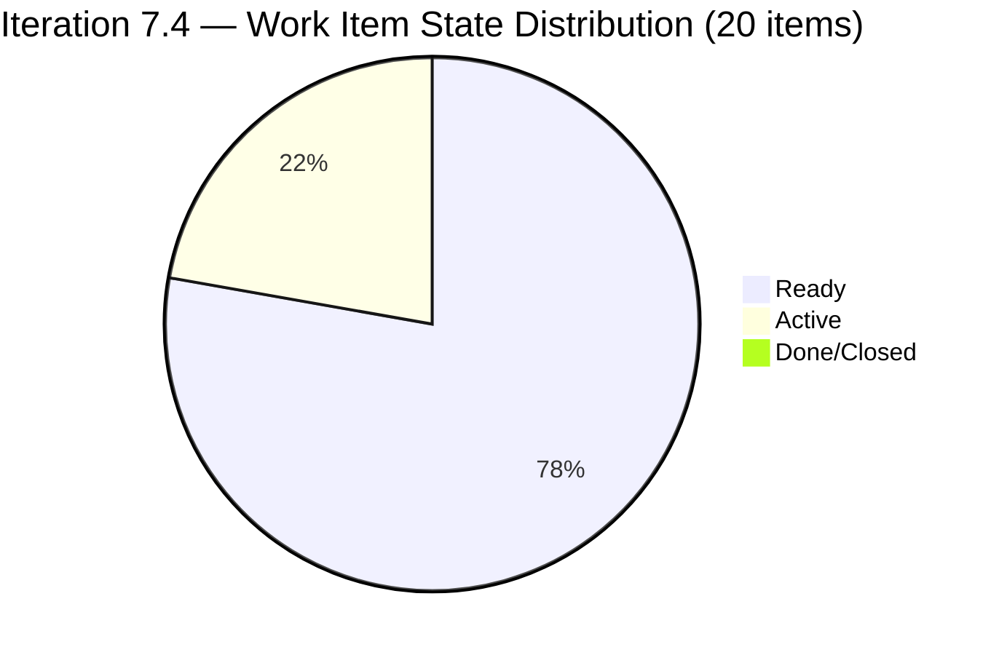
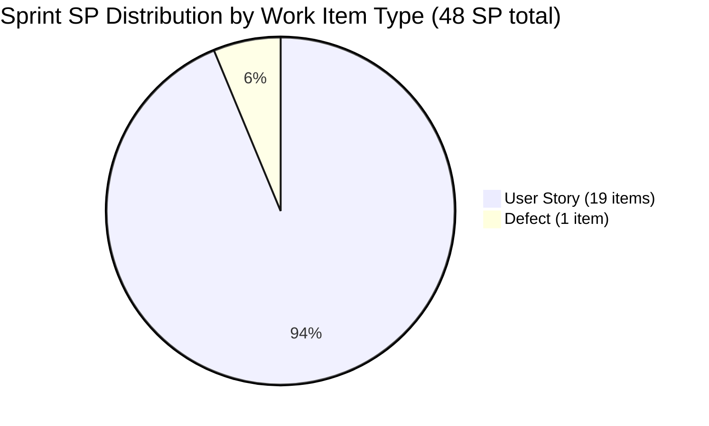

# SAFe Iteration Audit — Administration Team

## 1. Audit Metadata

| Field | Value |
|-------|-------|
| **Project** | Jairosoft FINOPS |
| **Team** | Administration Team |
| **Workspace** | `ado_admin` |
| **ADO Project ID** | e0bb302f-40f9-46c3-8164-6f1acb317d63 |
| **ADO Team ID** | a38a9c02-07ab-483d-a1e3-aff54e19e603 |
| **Iteration** | Iteration 7.4 |
| **Iteration Start** | 2026-05-18 |
| **Iteration Finish** | 2026-05-31 |
| **Audit Date** | 2026-05-21 |
| **Audit Day** | Day 4 of 14 |
| **Prior Audit** | AUDIT_20260520_0204.md (Day 3, Iteration 7.4, 80.7 — Low Risk) |
| **Overall Score** | **80.7 / 100** |
| **Risk Band** | **Low Risk** |

---

## 2. Executive Summary

The Administration Team holds at **80.7 / 100 (Low Risk)** on Day 4 of Iteration 7.4. The score is structurally unchanged from Day 3. The visible backlog remains at 21 items, all 20 sprint items retain full story point estimates and DoR compliance, and Mark Colina has continued active work (item 204135, "3 vendors for panaflex signage," updated to Active state on 2026-05-21).

**Positive movement on Day 4:** Item 204135 was updated today — its ChangedDate is 2026-05-21, confirming Mark is actively working the sprint. This is the fourth consecutive day with activity, a healthy pattern.

**Critical risks unchanged:**

1. **Overcommitment persists.** 20 items / 48 SP committed against 1 contributor (Mark) at 5 hrs/day. Realistic throughput is 8–14 SP in a 14-day sprint. The team is running 3–6× over capacity.

2. **Duplicate Internet Payables in Active state remain unresolved.** Items 203556 and 204387 — both titled "Payables - Internet for Davao and Cebu office" — remain Active simultaneously. Double-payment risk is alive. Triage is overdue.

3. **Delivery Predictability = 0.0.** No items are Closed or Done through Day 4. Mark needs to close at least 1 item before Day 7 to show velocity before the sprint midpoint.

4. **Work Item Balance penalty is structural.** 19 of 20 sprint items (95%) are User Story type. The -30 dominant-type penalty (>60% threshold) will not resolve without introducing other types.

---

## 3. Previous Audit Delta

**Prior audit:** AUDIT_20260520_0204.md — Iteration 7.4, Day 3, Score 80.7 / 100 (Low Risk)

| Dimension | Day 3 | Day 4 | Delta | Driver |
|-----------|-------|-------|-------|--------|
| Iteration Planning | 95.2 | **95.2** | 0.0 | No new items added or removed; 20/21 in 7.4 |
| Team Capacity | 100.0 | **100.0** | 0.0 | Mark configured at 5 hrs/day; no change |
| Estimation | 100.0 | **100.0** | 0.0 | All 20 sprint items estimated; no change |
| DoR Compliance | 100.0 | **100.0** | 0.0 | All 20 sprint items pass Description + AC thresholds |
| Work Item Balance | 70.0 | **70.0** | 0.0 | 19 US + 1 Defect = 95% User Story; structural |
| Backlog Refinement | 100.0 | **100.0** | 0.0 | All 21 items fresh; 0 untouched in 7.4 |
| Delivery Predictability | 0.0 | **0.0** | 0.0 | Day 4 — early sprint; no Closed/Done items yet |
| **Overall** | **80.7** | **80.7** | **0.0** | Structurally stable; operational risk unchanged |

**Key Day 4 observations:**
- Item 204135 (3 vendors for panaflex signage) remains in Active state, ChangedDate 2026-05-21. Mark is actively working.
- Items 203556 and 204387 (duplicate Internet Payables) both remain Active — unresolved from Day 2.
- No new items added to or removed from Iteration 7.4.
- 203717 remains staged in Iteration 7.5 (not in 7.4 sprint scope).

---

## 4. Current Iteration Snapshot

| Attribute | Value |
|-----------|-------|
| Active Iteration | Iteration 7.4 |
| Sprint Duration | 2026-05-18 to 2026-05-31 (14 days) |
| Audit Day | **Day 4** |
| Current Iteration Root Items | **20** |
| Total Visible Backlog Root Items | **21** |
| Sprint Load % | **95.2%** |
| Total Committed Story Points | **48 SP** |
| Closed Story Points | **0 SP** |
| Active Items | 3 (203556, 204387, 204675) + 204135 |
| Active Items (today) | 4 |
| Active Team Members | 1 (Mark Colina) |
| Capacity Configured | Yes — 5 hrs/day (1 Deployment + 2 Documentation + 2 Requirements) |
| Days Off | 0 |
| Items Outside 7.4 | 1 (203717 in Iteration 7.5) |

---

## 5. Work Item Analysis

### 5.1 Current Iteration Items — Iteration 7.4 (20 items)

| ID | Title | Type | State | SP | DoR | Changed |
|----|-------|------|-------|----|-----|---------|
| 202366 | Philgeps renewal for 2026 | User Story | Ready | 3 | ✅ | 2026-05-18 |
| 203555 | Government (EGOV) payables May 18-25, 2026 | User Story | Ready | 4 | ✅ | 2026-05-18 |
| 203556 | Payables - Internet for Davao and Cebu office | User Story | Active | 4 | ✅ | 2026-05-20 |
| 203557 | Utilities payables for Cebu and Davao | User Story | Ready | 4 | ✅ | 2026-05-18 |
| 203558 | Condo dues (Cebu) payables | User Story | Ready | 3 | ✅ | 2026-05-18 |
| 203693 | Admin CR sink cabinet | Defect | Ready | 3 | ✅ | 2026-05-18 |
| 203716 | Procure Signage Materials | User Story | Ready | 2 | ✅ | 2026-05-18 |
| 204135 | 3 vendors for panaflex signage | User Story | Active | 1 | ✅ | 2026-05-21 |
| 204136 | 3 vendors for flag pole | User Story | Ready | 1 | ✅ | 2026-05-18 |
| 204305 | Philgeps renewal payment | User Story | Ready | 1 | ✅ | 2026-05-18 |
| 204363 | Government (EGOV) payables May 26-31, 2026 | User Story | Ready | 2 | ✅ | 2026-05-19 |
| 204367 | Government (EGOV) payables May 20, 2026 | User Story | Ready | 2 | ✅ | 2026-05-18 |
| 204380 | Government (EGOV) payables May 28-31, 2026 | User Story | Ready | 2 | ✅ | 2026-05-18 |
| 204387 | Payables - Internet for Davao and Cebu office | User Story | Active | 2 | ✅ | 2026-05-20 |
| 204391 | Utilities payables for Cebu and Davao May 24-26, 2026 | User Story | Ready | 2 | ✅ | 2026-05-18 |
| 204394 | Utilities payables for Cebu and Davao May 27-30, 2026 | User Story | Ready | 2 | ✅ | 2026-05-18 |
| 204448 | Condo dues (Cebu) payables | User Story | Ready | 2 | ✅ | 2026-05-18 |
| 204452 | Professional fee payables | User Story | Ready | 3 | ✅ | 2026-05-18 |
| 204536 | Gcash business registration for Jairosoft Inc. | User Story | Ready | 2 | ✅ | 2026-05-19 |
| 204675 | Davao Admin Adhoc Support May 18-31, 2026 cutoff | User Story | Active | 3 | ✅ | 2026-05-19 |

**Total committed SP: 48**

### 5.2 Items Outside Iteration 7.4

| ID | Title | Type | Iteration | Notes |
|----|-------|------|-----------|-------|
| 203717 | Installation of Street Signage | User Story | 7.5 | Staged for next sprint; updated 2026-05-19 |

### 5.3 Duplicate Work Item Flag

| Pair | IDs | Title | State | Risk |
|------|-----|-------|-------|------|
| Internet Payables | 203556 & 204387 | "Payables - Internet for Davao and Cebu office" | Both Active | **Double-payment risk** |

These items differ only in SP (4 vs 2) and CreatedDate. Both are Active simultaneously. Without triage, Mark may process payment for both and the company will pay twice. Escalate today.

---

## 6. SAFe Compliance Scorecard

| Dimension | Score | Evidence | Notes |
|-----------|-------|----------|-------|
| 1. Iteration Planning | 95.2 | 20 of 21 visible items in Iteration 7.4 | 1 item (203717) staged in 7.5; strong planning |
| 2. Team Capacity | 100.0 | Mark Colina configured: 5 hrs/day across 3 activity types | Single-contributor team; no days off |
| 3. Estimation | 100.0 | All 20 sprint items have SP > 0 (range: 1–4 SP) | Full estimation compliance |
| 4. DoR Compliance | 100.0 | All 20 sprint items have Description ≥ 30 chars + AC ≥ 20 chars | Full DoR compliance |
| 5. Work Item Balance | 70.0 | 19 User Story + 1 Defect; US dominant = 95% (> 60% threshold) | −30 penalty applied; no Spikes or Enablers |
| 6. Backlog Refinement | 100.0 | All 21 visible items fresh (changed ≥ 2026-04-06); 0 stale; 0 untouched in 7.4 | Clean backlog |
| 7. Delivery Predictability | 0.0 | 0 SP closed of 48 SP committed; Day 4 of 14 | Early sprint; low delivery expected — annotated |
| **Overall** | **80.7** | | **Low Risk** |

---

## 7. Dimension Findings

### 7.1 Iteration Planning — 95.2 (Low Risk)
Nearly all visible backlog items are committed to the active sprint. Item 203717 (Installation of Street Signage, 3 SP) is appropriately staged to Iteration 7.5, indicating light forward planning. The 95.2% planning ratio is exceptionally high and reflects a small, well-bounded team backlog.

### 7.2 Team Capacity — 100.0 (Low Risk)
Mark Colina is configured with 5 hrs/day across three activity types (Deployment, Documentation, Requirements). Capacity is fully configured for the sprint's sole contributor. No days off are recorded.

### 7.3 Estimation — 100.0 (Low Risk)
All 20 sprint items carry Story Points in the range of 1–4. Estimation discipline is excellent and consistent.

### 7.4 DoR Compliance — 100.0 (Low Risk)
All 20 sprint items satisfy both the Description (≥ 30 non-whitespace characters) and Acceptance Criteria (≥ 20 non-whitespace characters) thresholds. Item quality is high — descriptions include detailed context and AC are specific and testable.

### 7.5 Work Item Balance — 70.0 (Moderate Risk)
The −30 penalty is structural: User Story items constitute 95% of the sprint (19 of 20), well above the 60% dominant-type threshold. There are no Spikes (research), no Enablers (technical foundation), and only one Defect. This is consistent with the team's operational nature (administrative and financial deliverables), but SAFe expects a mix of delivery types.

### 7.6 Backlog Refinement — 100.0 (Low Risk)
All 21 visible backlog items have a ChangedDate within the past 45 days (most changed on 2026-05-18 or later). There are no stale-90-day items, no stale-180-day items, and no items in the active iteration that were last touched before the sprint start. Backlog health is excellent.

### 7.7 Delivery Predictability — 0.0 (annotated — early sprint)
Day 4 of 14. No items are Closed or Done. Four items are Active (203556, 204387, 204675, 204135). While 0.0 is expected in the first week of a sprint, a pattern of no closures past Day 7 would indicate delivery risk. Mark should aim to close at least 2–3 items (6–9 SP) by Day 7.

**48 SP committed versus ~8–14 SP realistic throughput = 3–6× overcommitment.** Even at maximum realistic throughput, Mark cannot close all 20 items in 14 days. Right-sizing the sprint is the highest-leverage action available.

---

## 8. Risks and Bottlenecks

| # | Risk | Severity | Status |
|---|------|----------|--------|
| 1 | Sprint overcommitment: 48 SP vs. ~10 SP realistic | High | Persistent since Day 1 |
| 2 | Duplicate Internet Payables (203556 & 204387) both Active | Critical | Unresolved Day 2–4 |
| 3 | Single contributor (Mark) — bus factor = 1 | High | Structural / ongoing |
| 4 | No items closed through Day 4 | Moderate | Emerging; monitor until Day 7 |
| 5 | User Story dominance (95%) suppresses Work Item Balance | Low | Structural; acceptable given team nature |

---

## 9. Prioritized Recommendations

1. **[Today] Resolve duplicate Internet Payables.** Items 203556 and 204387 have been simultaneously Active since Day 2. One item must be set to Cancelled or Closed today to eliminate double-payment risk. Mark should confirm whether Davao and Cebu are billed separately (separate items with distinct titles) or whether these are truly duplicates.

2. **[Day 5] Begin closing completed items.** Mark should move at least 1 Ready/Active item to Done before the end of Day 5. The EGOV payables items (204367 due May 20, 204363 due May 26–31) are the natural first closures — if payment is processed, close the item.

3. **[Day 5] Right-size the sprint.** Move at least 6–8 lower-priority items (lower SP, later due dates) to Iteration 7.5 or the backlog. Committed items should align with Mark's realistic 10–14 SP capacity, not the current 48 SP.

4. **[Sprint End] Introduce Spike or Enabler types.** To resolve the Work Item Balance structural penalty, consider adding at least one non-User Story item (a research Spike or an infrastructure Enabler) per sprint to demonstrate SAFe compliance.

5. **[Ongoing] Establish a close-out habit for EGOV payables.** Each EGOV payable item (203555, 204367, 204380, 204363) should be closed as soon as the payment is processed and the receipt is attached. This will organically improve Delivery Predictability.

---

## 10. Evidence Gaps and Limitations

| Gap | Impact | Mitigation |
|-----|--------|------------|
| Duplicate item triage not completed | Cannot determine true committed scope | Manual review required today |
| No closed items to validate SP accuracy | Velocity baseline absent | Will resolve by Day 7–10 |
| Tasks (child level) not assessed | Team Capacity utilization not verified at task level | Out of scope for this rubric |
| Single-contributor team limits statistical reliability | All metrics reflect one person | Acknowledged in SAFe context |

---

## Mermaid Visualization



```mermaid
bar
    title SAFe Dimension Scores — Administration Team — Iteration 7.4 (Day 4)
    x-axis [Plan, Capacity, Estimate, DoR, Balance, Refine, Delivery]
    y-axis 0 --> 100
    bar [95.2, 100, 100, 100, 70, 100, 0]
```

```mermaid
xychart-beta
    title "N/A — not used"
```

> Note: Mermaid bar chart syntax above. If rendering issues occur in Obsidian, refer to the scorecard table in Section 6.


