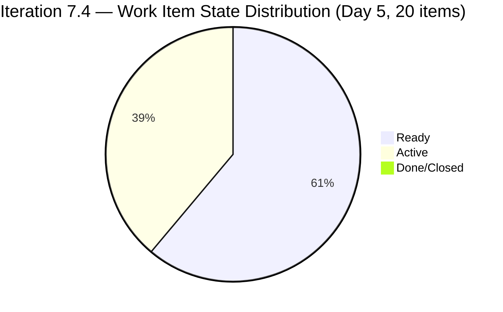
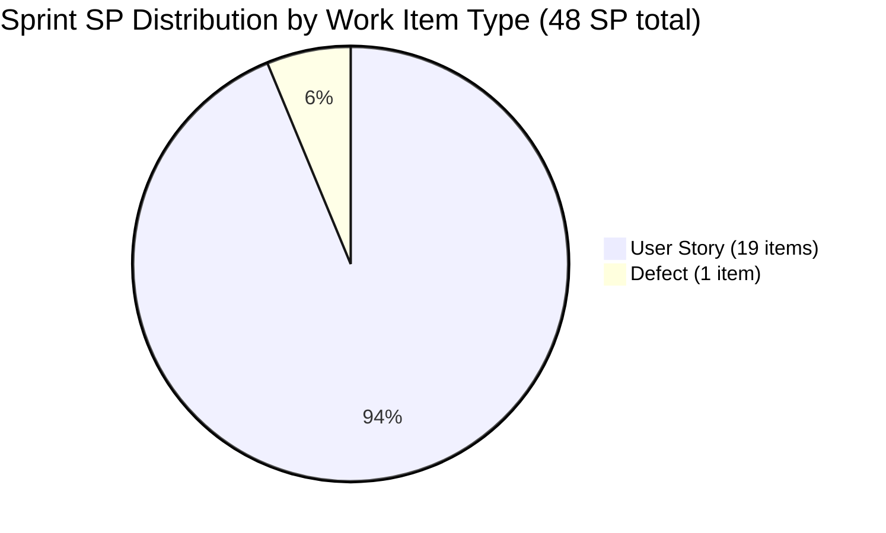
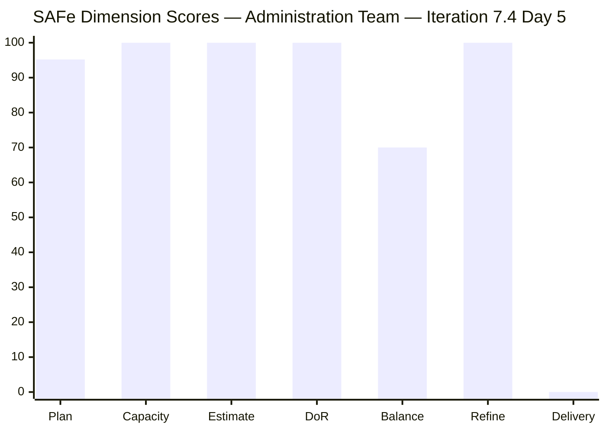

# SAFe Iteration Audit — Administration Team

## 1. Audit Metadata

| Field | Value |
|-------|-------|
| **Project** | Jairosoft FINOPS |
| **Team** | Administration Team |
| **Workspace** | `ado_admin` |
| **ADO Project ID** | e0bb302f-40f9-46c3-8164-6f1acb317d63 |
| **ADO Team ID** | a38a9c02-07ab-483d-a1e3-aff54e19e603 |
| **Iteration** | Iteration 7.4 |
| **Iteration Start** | 2026-05-18 |
| **Iteration Finish** | 2026-05-31 |
| **Audit Date** | 2026-05-22 (PHT) |
| **Audit Day** | Day 5 of 14 |
| **Prior Audit** | AUDIT_20260521_0900.md (Day 4, Iteration 7.4, 80.7 — Low Risk) |
| **Overall Score** | **80.7 / 100** |
| **Risk Band** | **Low Risk** |

---

## 2. Executive Summary

The Administration Team holds steady at **80.7 / 100 (Low Risk)** on Day 5 of Iteration 7.4. The structural score is unchanged from Day 4; all seven dimension values are stable. The visible backlog remains at 21 items, with 20 committed to Iteration 7.4.

**Positive movement on Day 5:** Active work is accelerating. Three additional items flipped to Active state today — 202366 (Philgeps renewal for 2026), 204136 (3 vendors for flag pole), and 204536 (Gcash business registration) — bringing the total Active count to **7 items**. Mark Colina updated items as late as 22:44 PHT, confirming sustained engagement through the full workday.

**Notable title updates today:** Items 204391 and 204394 had their titles revised to better reflect their actual scope:
- 204391: renamed from "Utilities payables for Cebu and Davao May 24-26, 2026" → **"Car payment (Fortuner) and Meal Payment for Davao"** — this is a significant reclassification; the description still references utilities, which creates a title/description mismatch.
- 204394: renamed from "Utilities payables for Cebu and Davao May 27-30, 2026" → **"Utilities payables for Cebu"** — scope narrowed to Cebu only.
- 204387: title now reads "Payables - Internet for Davao and Cebu office May 20-30, 2026" — the date range suffix was added, partially differentiating it from 203556.

**Persistent critical risks unchanged:**

1. **Overcommitment persists.** 20 items / 48 SP vs. Mark's realistic ~10–14 SP throughput. Running 3–5× over capacity.

2. **Partial duplicate resolution on Internet Payables.** Items 203556 and 204387 remain both Active. The title of 204387 now includes "May 20-30, 2026," suggesting an attempt to scope-differentiate, but both items are still Active simultaneously. A clear cancellation or closure of the period-matched item is needed.

3. **Delivery Predictability = 0.0.** No items closed through Day 5. Mark must close at least 1 item before Day 7 to establish velocity.

4. **Title/description mismatch on 204391.** The title was changed to "Car payment (Fortuner) and Meal Payment for Davao" but the description still describes utilities payables. This creates an audit/compliance risk if the item is reviewed during an internal audit.

---

## 3. Previous Audit Delta

**Prior audit:** AUDIT_20260521_0900.md — Iteration 7.4, Day 4, Score 80.7 / 100 (Low Risk)

| Dimension | Day 4 | Day 5 | Delta | Driver |
|-----------|-------|-------|-------|--------|
| Iteration Planning | 95.2 | **95.2** | 0.0 | No items added or removed from 7.4; 20/21 stable |
| Team Capacity | 100.0 | **100.0** | 0.0 | Mark at 5 hrs/day; no change |
| Estimation | 100.0 | **100.0** | 0.0 | All 20 sprint items estimated; no change |
| DoR Compliance | 100.0 | **100.0** | 0.0 | All 20 items pass Description + AC thresholds |
| Work Item Balance | 70.0 | **70.0** | 0.0 | 19 US + 1 Defect = 95% User Story; structural |
| Backlog Refinement | 100.0 | **100.0** | 0.0 | All 21 items fresh; 0 stale; 0 untouched in 7.4 |
| Delivery Predictability | 0.0 | **0.0** | 0.0 | Day 5 — early sprint; no Closed/Done items yet |
| **Overall** | **80.7** | **80.7** | **0.0** | Structurally stable; active count increased to 7 |

**Key Day 5 changes:**
- Items 202366, 204136, 204536 transitioned to Active state (new today).
- Item 204391 title changed to "Car payment (Fortuner) and Meal Payment for Davao" — description not updated to match.
- Item 204394 title changed to "Utilities payables for Cebu."
- Item 204387 title updated with date range "May 20-30, 2026" — partial differentiation from 203556.
- Total Active items: 7 (up from 4 on Day 4): 202366, 203556, 204135, 204136, 204387, 204536, 204675.

---

## 4. Current Iteration Snapshot

| Attribute | Value |
|-----------|-------|
| Active Iteration | Iteration 7.4 |
| Sprint Duration | 2026-05-18 to 2026-05-31 (14 days) |
| Audit Day | **Day 5** |
| Current Iteration Root Items | **20** |
| Total Visible Backlog Root Items | **21** |
| Sprint Load % | **95.2%** |
| Total Committed Story Points | **48 SP** |
| Closed Story Points | **0 SP** |
| Active Items | 7 (202366, 203556, 204135, 204136, 204387, 204536, 204675) |
| Ready Items | 11 |
| Active Team Members | 1 (Mark Colina) |
| Capacity Configured | Yes — 5 hrs/day (1 Deployment + 2 Documentation + 2 Requirements) |
| Days Off | 0 |
| Items Outside 7.4 | 1 (203717 in Iteration 7.5) |

---

## 5. Work Item Analysis

### 5.1 Current Iteration Items — Iteration 7.4 (20 items)

| ID | Title | Type | State | SP | DoR | Changed |
|----|-------|------|-------|----|-----|---------|
| 202366 | Philgeps renewal for 2026 | User Story | **Active** | 3 | ✅ | 2026-05-21 |
| 203555 | Government (EGOV) payables May 18-25, 2026 | User Story | Ready | 4 | ✅ | 2026-05-18 |
| 203556 | Payables - Internet for Davao and Cebu office | User Story | **Active** | 4 | ✅ | 2026-05-20 |
| 203557 | Utilities payables for Cebu and Davao | User Story | Ready | 4 | ✅ | 2026-05-18 |
| 203558 | Condo dues (Cebu) payables | User Story | Ready | 3 | ✅ | 2026-05-18 |
| 203693 | Admin CR sink cabinet | Defect | Ready | 3 | ✅ | 2026-05-18 |
| 203716 | Procure Signage Materials | User Story | Ready | 2 | ✅ | 2026-05-18 |
| 204135 | 3 vendors for panaflex signage | User Story | Active | 1 | ✅ | 2026-05-21 |
| 204136 | 3 vendors for flag pole | User Story | **Active** | 1 | ✅ | 2026-05-21 |
| 204305 | Philgeps renewal payment | User Story | Ready | 1 | ✅ | 2026-05-18 |
| 204363 | Government (EGOV) payables May 26-31, 2026 | User Story | Ready | 2 | ✅ | 2026-05-19 |
| 204367 | Government (EGOV) payables May 20, 2026 | User Story | Ready | 2 | ✅ | 2026-05-21 |
| 204380 | Government (EGOV) payables May 28-31, 2026 | User Story | Ready | 2 | ✅ | 2026-05-21 |
| 204387 | Payables - Internet for Davao and Cebu office May 20-30, 2026 | User Story | **Active** | 2 | ✅ | 2026-05-21 |
| 204391 | Car payment (Fortuner) and Meal Payment for Davao ⚠️ | User Story | Ready | 2 | ✅ | 2026-05-21 |
| 204394 | Utilities payables for Cebu | User Story | Ready | 2 | ✅ | 2026-05-21 |
| 204448 | Condo dues (Cebu) payables | User Story | Ready | 2 | ✅ | 2026-05-18 |
| 204452 | Professional fee payables | User Story | Ready | 3 | ✅ | 2026-05-18 |
| 204536 | Gcash business registration for Jairosoft Inc. | User Story | **Active** | 2 | ✅ | 2026-05-21 |
| 204675 | Davao Admin Adhoc Support May 18-31, 2026 cutoff | User Story | Active | 3 | ✅ | 2026-05-21 |

**Total committed SP: 48**

⚠️ Item 204391: Title was updated today to "Car payment (Fortuner) and Meal Payment for Davao" but the description still describes utilities payables. The title/description mismatch needs to be resolved.

### 5.2 Items Outside Iteration 7.4

| ID | Title | Type | Iteration | Notes |
|----|-------|------|-----------|-------|
| 203717 | Installation of Street Signage | User Story | 7.5 | Staged for next sprint; updated 2026-05-19 |

### 5.3 Duplicate Work Item Flag — Partially Addressed

| Pair | IDs | Titles | State | Status |
|------|-----|--------|-------|--------|
| Internet Payables | 203556 & 204387 | "Payables - Internet for Davao and Cebu office" / "Payables - Internet for Davao and Cebu office May 20-30, 2026" | Both Active | **Partially differentiated** — date range added to 204387; both still Active |

The addition of "May 20-30, 2026" to item 204387 is a positive step. However, 203556 still has no date range and both items remain Active simultaneously. If they cover different billing periods, item 203556 should be updated to specify its billing window (e.g., "May 1-19, 2026") or closed if already paid.

---

## 6. SAFe Compliance Scorecard

| Dimension | Score | Evidence | Notes |
|-----------|-------|----------|-------|
| 1. Iteration Planning | 95.2 | 20 of 21 visible items in Iteration 7.4 | 1 item (203717) correctly staged in 7.5 |
| 2. Team Capacity | 100.0 | Mark Colina: 5 hrs/day across 3 activity types; 0 days off | Single-contributor team; fully configured |
| 3. Estimation | 100.0 | All 20 sprint items have SP > 0 (range: 1–4 SP) | Full estimation compliance |
| 4. DoR Compliance | 100.0 | All 20 sprint items pass Description ≥ 30 chars + AC ≥ 20 chars | Full DoR compliance; 204391 title mismatch flagged separately |
| 5. Work Item Balance | 70.0 | 19 User Story + 1 Defect; US = 95% (> 60% threshold); −30 penalty | Structural; team's operational nature drives US dominance |
| 6. Backlog Refinement | 100.0 | All 21 visible items changed ≥ 2026-05-18; 0 stale; 0 untouched in 7.4 | Excellent backlog health |
| 7. Delivery Predictability | 0.0 | 0 SP closed of 48 SP committed; Day 5 of 14 | Early sprint — annotated; 7 items Active |
| **Overall** | **80.7** | | **Low Risk** |

---

## 7. Dimension Findings

### 7.1 Iteration Planning — 95.2 (Low Risk)
20 of 21 visible backlog items are committed to Iteration 7.4. Item 203717 (Installation of Street Signage, 3 SP) remains appropriately staged to 7.5. The planning ratio is structurally high and reflects a tightly bounded team backlog — an operational necessity for a single-member team.

### 7.2 Team Capacity — 100.0 (Low Risk)
Mark Colina is configured with 5 hrs/day across Deployment (1), Documentation (2), and Requirements (2). No days off. Capacity is fully configured. The 5 hrs/day allocation is realistic for an operations-heavy team; however, with 48 SP committed, the sprint remains deeply overcommitted relative to any realistic throughput model.

### 7.3 Estimation — 100.0 (Low Risk)
All 20 sprint items carry Story Points in the range 1–4 SP. Estimation discipline is consistent and excellent. Points appear calibrated to operational effort (routine payables at 2 SP, complex compliance items at 3–4 SP).

### 7.4 DoR Compliance — 100.0 (Low Risk)
All 20 sprint items pass both the Description (≥ 30 non-whitespace characters) and Acceptance Criteria (≥ 20 non-whitespace characters) thresholds. Item quality remains high. **Exception flag:** Item 204391's description was not updated when the title changed to "Car payment (Fortuner) and Meal Payment for Davao" — the description still references utilities payables. While the item passes the DoR character threshold, the content mismatch should be corrected.

### 7.5 Work Item Balance — 70.0 (Moderate Risk)
19 User Stories + 1 Defect = 95% User Story dominant type. The -30 penalty is structural for this team's operational charter. No Spikes or Enablers are present. This is acceptable given the team's administrative nature, but maintaining at least one non-US type per sprint (e.g., a Defect for facility issues, or an Enabler for process improvement) would prevent this recurring penalty.

### 7.6 Backlog Refinement — 100.0 (Low Risk)
All 21 visible backlog items have ChangedDate on or after 2026-05-18 (many updated again today, 2026-05-21). No 45-day stale items, no 90-day stale items, no 180-day stale items. No untouched sprint items. Backlog health is excellent.

### 7.7 Delivery Predictability — 0.0 (annotated — early sprint, Day 5)
No items are Closed or Done. Seven items are Active, which is the highest Active count to date and a positive signal of work in progress. Mark's pattern — starting items but not yet closing them — is typical for operations-style work where items involve multiple external interactions (vendor canvassing, government portals, payment processing). The first closures are expected by Day 6–8 when processing completes and receipts are received.

**Key early closure candidates:**
- 204367 (EGOV May 20) — payment date already passed; should be closed if paid.
- 204135 & 204136 (vendor canvassing) — Active since Day 3–4; closure pending vendor response receipt.
- 204536 (Gcash registration) — newly Active; monitor.

---

## 8. Risks and Bottlenecks

| # | Risk | Severity | Status |
|---|------|----------|--------|
| 1 | Sprint overcommitment: 48 SP vs. ~10 SP realistic throughput | High | Persistent since Day 1; structural |
| 2 | Duplicate Internet Payables (203556 & 204387) both Active | Moderate | Partially addressed (date suffix added); needs closure |
| 3 | Title/description mismatch on 204391 (Car payment vs. Utilities) | Moderate | New today; must be corrected before item is processed |
| 4 | No items closed through Day 5 | Moderate | Emerging risk; EGOV May 20 (204367) is overdue for closure |
| 5 | Single contributor (Mark) — bus factor = 1 | High | Structural / ongoing |
| 6 | User Story dominance (95%) — Work Item Balance structural penalty | Low | Structural; expected given team charter |

---

## 9. Prioritized Recommendations

1. **[Today] Fix item 204391 title/description mismatch.** The title "Car payment (Fortuner) and Meal Payment for Davao" does not match the description, which still describes "utilities payables." Update the description to accurately reflect car payment and meal allowance for Davao. This is an audit compliance risk.

2. **[Today] Close item 204367 (EGOV payables May 20, 2026).** The payment date has passed (May 20). If the EGOV payment was processed, this item should be moved to Done immediately and a receipt attached. Closing 2 SP today pushes Delivery Predictability from 0 to 4.2%.

3. **[Day 6] Resolve Internet Payables duplicate.** Add a billing period suffix to 203556 (e.g., "May 1-19, 2026") and confirm whether it has already been paid. If paid, close it. If 204387 covers the same period, cancel one of them explicitly.

4. **[Day 7] Right-size the sprint.** Move 6–8 lower-priority items to Iteration 7.5 or Backlog to align committed SP (~10 SP) with Mark's realistic throughput. Candidates: 204394, 204448, 204380, 204363 (all future-dated payables that can wait for 7.5).

5. **[Ongoing] Establish close-out habit for EGOV payables.** Each payable item (203555 through 204380) should be closed the same day payment is processed, with receipt attached. This will organically accumulate Delivery Predictability points.

---

## 10. Evidence Gaps and Limitations

| Gap | Impact | Mitigation |
|-----|--------|------------|
| 204391 description not updated to match new title | Scope of work is ambiguous; audit risk | Update description immediately |
| Duplicate Internet Payables not fully resolved | Double-payment risk still present | Confirm billing periods and close/cancel one |
| No closed items through Day 5 — velocity unverified | Delivery Predictability = 0; throughput baseline absent | First closures expected Day 6–8 |
| Tasks (child level) not assessed | Granular work tracking not evaluated | Out of scope for rubric |
| Single-contributor team limits statistical confidence | All metrics reflect one person | Acknowledged; structural constraint |

---

## Mermaid Visualizations

