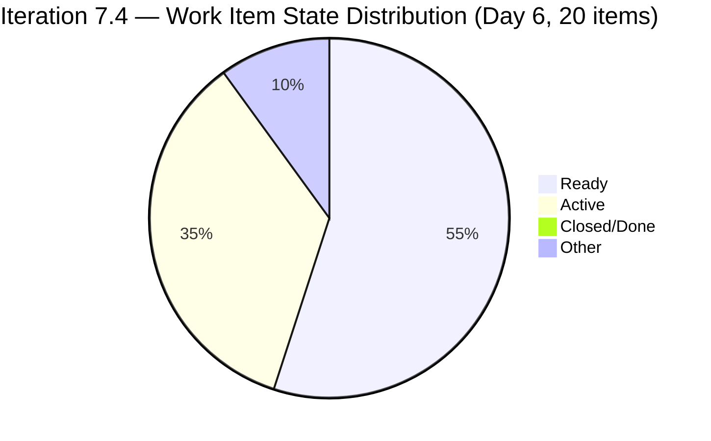
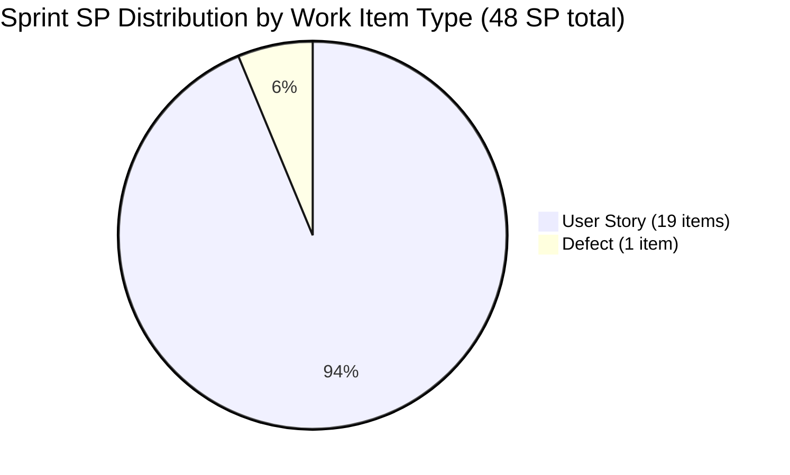

# SAFe Iteration Audit — Administration Team

## 1. Audit Metadata

| Field | Value |
|-------|-------|
| **Project** | Jairosoft FINOPS |
| **Team** | Administration Team |
| **Workspace** | `ado_admin` |
| **ADO Project ID** | e0bb302f-40f9-46c3-8164-6f1acb317d63 |
| **ADO Team ID** | a38a9c02-07ab-483d-a1e3-aff54e19e603 |
| **Iteration** | Iteration 7.4 |
| **Iteration Start** | 2026-05-18 |
| **Iteration Finish** | 2026-05-31 |
| **Audit Date** | 2026-05-23 (PHT) |
| **Audit Day** | Day 6 of 14 |
| **Prior Audit** | AUDIT_20260522_0900.md (Day 5, Iteration 7.4, 80.7 — Low Risk) |
| **Overall Score** | **80.7 / 100** |
| **Risk Band** | **Low Risk** |

---

## 2. Executive Summary

The Administration Team holds steady at **80.7 / 100 (Low Risk)** on Day 6 of Iteration 7.4. All seven dimension scores remain structurally unchanged from Day 5; the visible backlog is stable at 21 items with 20 committed to the current sprint.

**Notable Day 6 updates (items changed 2026-05-22):** Mark Colina continued active item management through the afternoon on May 22, with four items receiving title and date-scope refinements:
- **203556** (Active): Confirmed active internet payables — changed at 13:15.
- **204675** (Active): Davao Admin Adhoc Support — changed at 13:42, now has a comment (commentVersionRef 5221585), suggesting progress documentation.
- **203557**: Title now reads "Utilities payables for Cebu and Davao May 20, 2026" — date anchor added for clarity.
- **203558**: Title now reads "Condo dues (Cebu) payables May 15, 2026" — date anchor added.
- **204394**: Title now reads "Utilities payables for Cebu May 28-31, 2026" — period scope finalized.
- **204448**: Title now reads "Condo dues (Cebu) payables May 26, 2026" — date anchor added.

**Critical issue remains unresolved:** Item 204391 still carries the title "Car payment (Fortuner) and Meal Payment for Davao" but its description continues to reference utilities payables (electricity, water, internet). The title/description mismatch flagged on Day 5 persists on Day 6.

**Delivery Predictability = 0.0** through Day 6. No items have been closed yet. With 8 days remaining in the sprint, Mark needs to begin closing items. The EGOV payables for May 20 (item 204367) is the most overdue — the payment date has already passed.

---

## 3. Previous Audit Delta

**Prior audit:** AUDIT_20260522_0900.md — Iteration 7.4, Day 5, Score 80.7 / 100 (Low Risk)

| Dimension | Day 5 | Day 6 | Delta | Driver |
|-----------|-------|-------|-------|--------|
| Iteration Planning | 95.2 | **95.2** | 0.0 | 20/21 items stable; no scope changes |
| Team Capacity | 100.0 | **100.0** | 0.0 | Mark at 5 hrs/day; unchanged |
| Estimation | 100.0 | **100.0** | 0.0 | All 20 sprint items estimated; unchanged |
| DoR Compliance | 100.0 | **100.0** | 0.0 | All 20 items pass Description + AC thresholds |
| Work Item Balance | 70.0 | **70.0** | 0.0 | 19 US + 1 Defect = 95% US; structural |
| Backlog Refinement | 100.0 | **100.0** | 0.0 | All 21 items fresh; 0 stale; 0 untouched |
| Delivery Predictability | 0.0 | **0.0** | 0.0 | No items Closed/Done through Day 6 |
| **Overall** | **80.7** | **80.7** | **0.0** | Structurally stable |

**Key Day 6 changes (items changed 2026-05-22):**
- Item 203557 title updated: "Utilities payables for Cebu and Davao May 20, 2026"
- Item 203558 title updated: "Condo dues (Cebu) payables May 15, 2026"
- Item 204394 title updated: "Utilities payables for Cebu May 28-31, 2026"
- Item 204448 title updated: "Condo dues (Cebu) payables May 26, 2026"
- Item 204675 received a new comment (5221585) — progress documentation noted
- Active items remain: 202366, 203556, 204135, 204136, 204387, 204536, 204675 (7 items — unchanged count)

---

## 4. Current Iteration Snapshot

| Attribute | Value |
|-----------|-------|
| Active Iteration | Iteration 7.4 |
| Sprint Duration | 2026-05-18 to 2026-05-31 (14 days) |
| Audit Day | **Day 6** |
| Current Iteration Root Items | **20** |
| Total Visible Backlog Root Items | **21** |
| Sprint Load % | **95.2%** |
| Total Committed Story Points | **48 SP** |
| Closed Story Points | **0 SP** |
| Active Items | 7 (202366, 203556, 204135, 204136, 204387, 204536, 204675) |
| Ready Items | 11 |
| New Closed Items Today | 0 |
| Active Team Members | 1 (Mark Colina) |
| Capacity Configured | Yes — 5 hrs/day (1 Deployment + 2 Documentation + 2 Requirements) |
| Days Off | 0 |
| Items Outside 7.4 | 1 (203717 in Iteration 7.5) |

---

## 5. Work Item Analysis

### 5.1 Current Iteration Items — Iteration 7.4 (20 items)

| ID | Title | Type | State | SP | DoR | Changed |
|----|-------|------|-------|----|-----|---------|
| 202366 | Philgeps renewal for 2026 | User Story | Active | 3 | ✅ | 2026-05-21 |
| 203555 | Government (EGOV) payables May 18 - 25, 2026 | User Story | Ready | 4 | ✅ | 2026-05-18 |
| 203556 | Payables - Internet for Davao and Cebu office | User Story | Active | 4 | ✅ | **2026-05-22** |
| 203557 | Utilities payables for Cebu and Davao May 20, 2026 | User Story | Ready | 4 | ✅ | **2026-05-22** |
| 203558 | Condo dues (Cebu) payables May 15, 2026 | User Story | Ready | 3 | ✅ | **2026-05-22** |
| 203693 | Admin CR sink cabinet | Defect | Ready | 3 | ✅ | 2026-05-18 |
| 203716 | Procure Signage Materials | User Story | Ready | 2 | ✅ | 2026-05-18 |
| 204135 | 3 vendors for panaflex signage | User Story | Active | 1 | ✅ | 2026-05-21 |
| 204136 | 3 vendors for flag pole | User Story | Active | 1 | ✅ | 2026-05-21 |
| 204305 | Philgeps renewal payment | User Story | Ready | 1 | ✅ | 2026-05-18 |
| 204363 | Government (EGOV) payables May 26 - 31, 2026 | User Story | Ready | 2 | ✅ | 2026-05-19 |
| 204367 | Government (EGOV) payables May 20, 2026 | User Story | Ready | 2 | ✅ | 2026-05-21 |
| 204380 | Government (EGOV) payables May 28-31, 2026 | User Story | Ready | 2 | ✅ | 2026-05-21 |
| 204387 | Payables - Internet for Davao and Cebu office May 20-30, 2026 | User Story | Active | 2 | ✅ | 2026-05-21 |
| 204391 | Car payment (Fortuner) and Meal Payment for Davao ⚠️ | User Story | Ready | 2 | ✅ | 2026-05-21 |
| 204394 | Utilities payables for Cebu May 28-31, 2026 | User Story | Ready | 2 | ✅ | **2026-05-22** |
| 204448 | Condo dues (Cebu) payables May 26, 2026 | User Story | Ready | 2 | ✅ | **2026-05-22** |
| 204452 | Professional fee payables | User Story | Ready | 3 | ✅ | 2026-05-18 |
| 204536 | Gcash business registration for Jairosoft Inc. | User Story | Active | 2 | ✅ | 2026-05-21 |
| 204675 | Davao Admin Adhoc Support May 18-31, 2026 cutoff | User Story | Active | 3 | ✅ | **2026-05-22** |

**Total committed SP: 48**

⚠️ **Item 204391:** Title "Car payment (Fortuner) and Meal Payment for Davao" does not match the description, which still describes utility payables (electricity, water, internet). This mismatch persists from Day 5. Requires immediate correction.

### 5.2 Items Outside Iteration 7.4

| ID | Title | Type | Iteration | Notes |
|----|-------|------|-----------|-------|
| 203717 | Installation of Street Signage | User Story | 7.5 | Correctly staged for next sprint |

### 5.3 Pending Quality Issues

| Issue | Item | Status |
|-------|------|--------|
| Title/description mismatch | 204391 | Unresolved (Day 5 → Day 6) |
| Dual Active internet payables | 203556 & 204387 | Partially differentiated by date suffix; both Active |

---

## 6. SAFe Compliance Scorecard

| Dimension | Score | Evidence | Notes |
|-----------|-------|----------|-------|
| 1. Iteration Planning | 95.2 | 20 of 21 visible items in Iteration 7.4 | 1 item (203717) correctly staged in 7.5 |
| 2. Team Capacity | 100.0 | Mark Colina: 5 hrs/day across 3 activity types; 0 days off | Single-contributor team; fully configured |
| 3. Estimation | 100.0 | All 20 sprint items have SP > 0 (range: 1–4 SP) | Full estimation compliance |
| 4. DoR Compliance | 100.0 | All 20 sprint items pass Description ≥ 30 chars + AC ≥ 20 chars | 204391 title mismatch is a content flag, not a DoR threshold failure |
| 5. Work Item Balance | 70.0 | 19 User Story + 1 Defect; US = 95% (> 60%); −30 penalty | Structural; administrative nature of team |
| 6. Backlog Refinement | 100.0 | All 21 visible items changed ≥ 2026-05-18; 0 stale; 0 untouched in 7.4 | 4 items received title updates on May 22 |
| 7. Delivery Predictability | 0.0 | 0 SP closed of 48 SP committed; Day 6 of 14 | Not annotated early sprint (Day 6 ≥ Day 5); urgency increasing |
| **Overall** | **80.7** | | **Low Risk** |

---

## 7. Dimension Findings

### 7.1 Iteration Planning — 95.2 (Low Risk)
20 of 21 visible backlog items are committed to Iteration 7.4. The ratio reflects a well-loaded single-contributor sprint. Item 203717 remains appropriately staged in 7.5.

### 7.2 Team Capacity — 100.0 (Low Risk)
Mark Colina is fully configured at 5 hrs/day (Deployment 1, Documentation 2, Requirements 2) with zero days off. Capacity configuration is complete and unchanged.

### 7.3 Estimation — 100.0 (Low Risk)
All 20 sprint items carry Story Points (range 1–4 SP). Estimation discipline is consistent. No changes from Day 5.

### 7.4 DoR Compliance — 100.0 (Low Risk)
All 20 sprint items pass both character thresholds (Description ≥ 30, AC ≥ 20). The four items that received title updates on May 22 (203557, 203558, 204394, 204448) retain valid DoR content. Item 204391's description-title mismatch is a content quality flag, not a character threshold failure — but must be corrected before the item is processed for payment.

### 7.5 Work Item Balance — 70.0 (Moderate Risk)
19 User Stories + 1 Defect = 95% User Story share. The -30 dominant-type penalty is structural for the Administration Team. No Spikes present.

### 7.6 Backlog Refinement — 100.0 (Low Risk)
All 21 visible backlog items have been changed within the last 5 days. Four items received date-scope title refinements on 2026-05-22, further confirming active backlog management. No stale items detected.

### 7.7 Delivery Predictability — 0.0 (Urgent — Day 6)
No items are Closed or Done through Day 6. The "early-sprint" annotation no longer applies. With 8 days remaining, zero closures signals increasing delivery risk. Seven items are Active, but none have been pushed to Done.

**Priority closure candidates:**
- **204367 (EGOV May 20)**: The payment date has passed. If paid, close immediately.
- **204135 & 204136 (vendor canvassing)**: Active since Day 3-4. Vendor responses should be available by Day 6. If the comparative summary is complete, close.
- **203556 (Internet payables)**: Active since Day 1. If paid, close with receipt.
- **204536 (Gcash registration)**: Newly active — monitor for completion signal.

---

## 8. Risks and Bottlenecks

| # | Risk | Severity | Status |
|---|------|----------|--------|
| 1 | Sprint overcommitment: 48 SP vs. ~10 SP realistic throughput (4.8× over) | High | Persistent structural; 8 days remain |
| 2 | Zero closures through Day 6 — Delivery Predictability = 0 | High | Escalating; early-sprint annotation expired |
| 3 | Title/description mismatch on 204391 | Moderate | Unresolved Day 5 → Day 6; payment audit risk |
| 4 | Dual Active internet payables (203556 & 204387) | Moderate | Partially differentiated; double-payment risk remains |
| 5 | 204367 (EGOV May 20) — payment date passed; item still Ready | Moderate | Should be Closed or action documented |
| 6 | Single contributor (Mark) — bus factor = 1 | High | Structural / ongoing |

---

## 9. Prioritized Recommendations

1. **[Today — Urgent] Close item 204367 (EGOV payables May 20, 2026).** The May 20 payment window has passed. If the EGOV transaction was processed, move this item to Done and attach the receipt. This is the fastest path to non-zero Delivery Predictability (+2 SP / 4.2%).

2. **[Today] Fix item 204391 description.** Update the description from "utilities payables" to accurately describe the car payment (Fortuner) and meal payment for Davao. This item cannot safely be processed for finance review while the description contradicts the title.

3. **[Day 7] Close vendor canvassing items.** Items 204135 (panaflex signage) and 204136 (flag pole) have been Active since Day 3-4. If three vendor quotations have been received and the comparative summary is ready, close both items (+2 SP total / 4.2% each).

4. **[Day 7] Resolve dual internet payables.** Determine whether 203556 and 204387 cover different billing periods. Add an explicit billing window to 203556 (e.g., "May 1-19, 2026") or close/cancel one. Leaving both Active through Day 7 increases double-payment exposure.

5. **[Days 7-10] Right-size sprint for remaining capacity.** Move 6-8 lower-priority items (204363, 204394, 204448, 204380) to Iteration 7.5. This reduces the overcommitment ratio and focuses Mark's remaining days on items with imminent payment deadlines.

---

## 10. Evidence Gaps and Limitations

| Gap | Impact | Mitigation |
|-----|--------|------------|
| 204391 description not updated to match title | Scope of item ambiguous; payment processing risk | Update description immediately |
| 204675 comment content not accessed | Unknown whether progress note documents completion steps | Read comment to assess closure timeline |
| No closed items through Day 6 — velocity unconfirmed | Delivery Predictability = 0; throughput baseline absent | First closures needed by Day 7 |
| Duplicate Internet Payables (203556 & 204387) not fully resolved | Double-payment risk | Confirm billing periods and close/cancel one |
| Tasks (child level) not assessed | Granular tracking not evaluated | Out of scope for rubric |

---

## Mermaid Visualizations





```mermaid
bar
    title SAFe Dimension Scores — Administration Team — Iteration 7.4 Day 6
    x-axis [Plan, Capacity, Estimate, DoR, Balance, Refine, Delivery]
    y-axis 0 --> 100
    bar [95.2, 100, 100, 100, 70, 100, 0]
```
