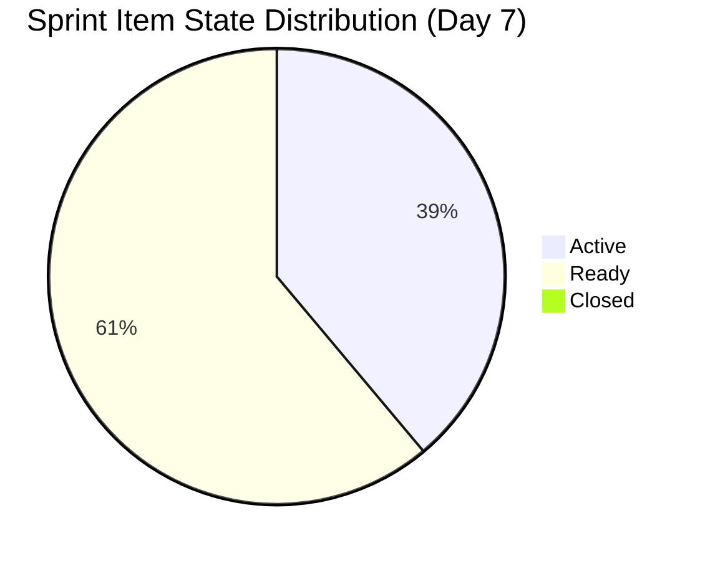
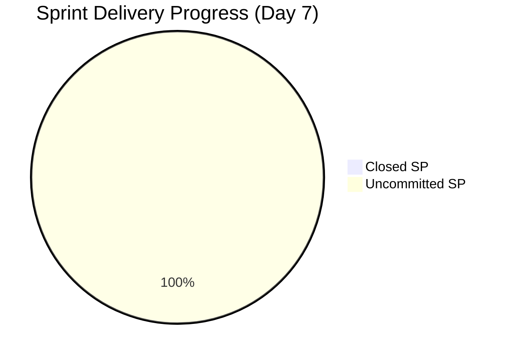

# SAFe Iteration Audit — Administration Team

## 1. Audit Metadata

| Field | Value |
|-------|-------|
| **Project** | Jairosoft FINOPS |
| **Team** | Administration Team |
| **Workspace** | `ado_admin` |
| **ADO Project ID** | e0bb302f-40f9-46c3-8164-6f1acb317d63 |
| **ADO Team ID** | a38a9c02-07ab-483d-a1e3-aff54e19e603 |
| **Iteration** | Iteration 7.4 |
| **Iteration Start** | 2026-05-18 |
| **Iteration Finish** | 2026-05-31 |
| **Audit Date** | 2026-05-24 (PHT) |
| **Audit Day** | Day 7 of 14 |
| **Prior Audit** | AUDIT_20260523_0900.md (Day 6, Iteration 7.4, 80.7 — Low Risk) |
| **Overall Score** | **80.7 / 100** |
| **Risk Band** | **Low Risk** |

---

## 2. Executive Summary

The Administration Team holds at **80.7 / 100 (Low Risk)** on Day 7 of Iteration 7.4. All seven dimension scores are structurally unchanged from Day 6. The visible backlog remains stable at 21 items with 20 committed to the current sprint (95.2% load).

**No new closures detected through Day 7.** Delivery Predictability remains at 0.0. The sprint is now at its midpoint (Day 7 of 14), and this is the critical window for Mark Colina to begin closing items. The most overdue concern is item **204367** (EGOV payables May 20, 2026) — the payment date has passed and the item remains in Ready state.

**Positive signals:** The Active item count (7 items: 202366, 203556, 204135, 204136, 204387, 204536, 204675) indicates work is in progress. All items continue to carry complete descriptions and acceptance criteria (DoR = 100%).

**Key risk:** Zero closures at the sprint midpoint on a 48 SP commitment signals significant delivery risk. Past iteration patterns (Iteration 6.5: 61.3% delivery) suggest over-commitment is a recurring issue. Mark must convert Active items to Closed to break the pattern.

---

## 3. Previous Audit Delta

**Prior audit:** AUDIT_20260523_0900.md — Iteration 7.4, Day 6, Score 80.7 / 100 (Low Risk)

| Dimension | Day 6 | Day 7 | Delta | Driver |
|-----------|-------|-------|-------|--------|
| Iteration Planning | 95.2 | **95.2** | 0.0 | 20/21 items stable; no scope changes |
| Team Capacity | 100.0 | **100.0** | 0.0 | Mark at 5 hrs/day; unchanged |
| Estimation | 100.0 | **100.0** | 0.0 | All 20 sprint items estimated; unchanged |
| DoR Compliance | 100.0 | **100.0** | 0.0 | All 20 items pass Description + AC thresholds |
| Work Item Balance | 70.0 | **70.0** | 0.0 | 19 US + 1 Defect = 95% US; structural |
| Backlog Refinement | 100.0 | **100.0** | 0.0 | All 21 items fresh; 0 stale; 0 untouched |
| Delivery Predictability | 0.0 | **0.0** | 0.0 | No items Closed/Done through Day 7 |
| **Overall** | **80.7** | **80.7** | **0.0** | Structurally stable — no closures yet |

**Key Day 7 observations:**
- No new work item changes detected since Day 6 (2026-05-22 was last change date for most active items).
- Item 204391 ("Car payment (Fortuner) and Meal Payment for Davao") title/description mismatch persists — flagged since Day 5, still unresolved.
- Item 203717 ("Installation of Street Signage") remains in Iteration 7.5 path (not in current sprint scope).

---

## 4. Current Iteration Snapshot

| Attribute | Value |
|-----------|-------|
| Active Iteration | Iteration 7.4 |
| Sprint Duration | 2026-05-18 to 2026-05-31 (14 days) |
| Audit Day | **Day 7 (Sprint Midpoint)** |
| Current Iteration Root Items | **20** |
| Total Visible Backlog Root Items | **21** |
| Sprint Load % | **95.2%** |
| Total Committed Story Points | **48 SP** |
| Closed Story Points | **0 SP** |
| Active Items | 7 (202366, 203556, 204135, 204136, 204387, 204536, 204675) |
| Ready Items | 11 |
| Closed Items | 0 |
| Active Team Members | 1 (Mark Colina) |
| Capacity Configured | Yes — 5 hrs/day; 0 days off |
| Remaining Days | **7** |

---

## 5. Work Item Analysis

### Current Iteration Root Items (20 items, 48 SP)

| ID | Title | Type | State | SP | ChangedDate |
|----|-------|------|-------|----|-------------|
| 202366 | Philgeps renewal for 2026 | User Story | Active | 3 | 2026-05-21 |
| 203555 | Government (EGOV) payables May 18 - 25, 2026 | User Story | Ready | 4 | 2026-05-18 |
| 203556 | Payables - Internet for Davao and Cebu office | User Story | Active | 4 | 2026-05-22 |
| 203557 | Utilities payables for Cebu and Davao May 20, 2026 | User Story | Ready | 4 | 2026-05-22 |
| 203558 | Condo dues (Cebu) payables May 15, 2026 | User Story | Ready | 3 | 2026-05-22 |
| 203693 | Admin CR sink cabinet | Defect | Ready | 3 | 2026-05-18 |
| 203716 | Procure Signage Materials | User Story | Ready | 2 | 2026-05-18 |
| 204135 | 3 vendors for panaflex signage | User Story | Active | 1 | 2026-05-21 |
| 204136 | 3 vendors for flag pole | User Story | Active | 1 | 2026-05-21 |
| 204305 | Philgeps renewal payment | User Story | Ready | 1 | 2026-05-18 |
| 204363 | Government (EGOV) payables May 26 - 31, 2026 | User Story | Ready | 2 | 2026-05-19 |
| 204367 | Government (EGOV) payables May 20, 2026 | User Story | Ready | 2 | 2026-05-21 |
| 204380 | Government (EGOV) payables May 28-31, 2026 | User Story | Ready | 2 | 2026-05-21 |
| 204387 | Payables - Internet for Davao and Cebu office May 20-30, 2026 | User Story | Active | 2 | 2026-05-21 |
| 204391 | Car payment (Fortuner) and Meal Payment for Davao | User Story | Ready | 2 | 2026-05-21 |
| 204394 | Utilities payables for Cebu May 28-31, 2026 | User Story | Ready | 2 | 2026-05-22 |
| 204448 | Condo dues (Cebu) payables May 26, 2026 | User Story | Ready | 2 | 2026-05-22 |
| 204452 | Professional fee payables | User Story | Ready | 3 | 2026-05-18 |
| 204536 | Gcash business registration for Jairosoft Inc. | User Story | Active | 2 | 2026-05-21 |
| 204675 | Davao Admin Adhoc Support May 18-31, 2026 cutoff | User Story | Active | 3 | 2026-05-22 |

**Backlog Item Not in Sprint:**
| ID | Title | Type | State | SP | IterationPath |
|----|-------|------|-------|----|--------------|
| 203717 | Installation of Street Signage | User Story | Ready | 3 | Iteration 7.5 |

### State Distribution

| State | Count | % |
|-------|-------|---|
| Active | 7 | 35.0% |
| Ready | 11 | 55.0% |
| Closed / Done | 0 | 0.0% |
| Ready for Dev | 0 | 0.0% |
| New | 0 | 0.0% |

### Known Issues

- **Item 204391** title/description mismatch (persistent Day 5–7): Title = "Car payment (Fortuner) and Meal Payment for Davao"; Description references utilities (electricity, water, internet). Needs correction.
- **Item 204367** (EGOV payables May 20): Payment date passed; still in Ready state. Risk of penalty/non-compliance if not settled.

---

## 6. SAFe Compliance Scorecard

| Dimension | Score | Evidence | Notes |
|-----------|-------|----------|-------|
| Iteration Planning | 95.2 | 20 of 21 visible backlog items in sprint | 1 item (203717) parked in 7.5 |
| Team Capacity | 100.0 | Mark Colina configured at 5 hrs/day; 0 days off | Sole contributor; bus factor risk |
| Estimation | 100.0 | All 20 sprint items have Story Points > 0 | Total: 48 SP committed |
| DoR Compliance | 100.0 | All 20 items have Description ≥ 30 chars + AC ≥ 20 chars | Strong item quality |
| Work Item Balance | 70.0 | 19 US / 1 Defect; US = 95% (dominant > 60% → −30) | No Spike types present |
| Backlog Refinement | 100.0 | All 21 visible items changed ≥ 2026-05-18; 0 stale; 0 untouched | Excellent hygiene |
| Delivery Predictability | 0.0 | 0 SP closed of 48 SP committed — sprint midpoint | Critical — no closures through Day 7 |
| **Overall** | **80.7** | Average of 7 dimensions | **Low Risk** |

---

## 7. Dimension Findings

### Iteration Planning (95.2)
Strong sprint loading. 20 of 21 visible backlog items are committed to Iteration 7.4. Item 203717 ("Installation of Street Signage") is correctly parked in 7.5 for post-completion work. The 95.2% load is appropriate and reflects good planning coverage.

### Team Capacity (100.0)
Mark Colina is configured at 5 hours/day with no days off for the iteration. Capacity is fully aligned with the single active contributor. **Structural concern:** single-contributor dependency continues to represent an organizational bus factor risk. No mitigation action has been taken since this was first flagged.

### Estimation (100.0)
All 20 sprint items carry Story Points. The range spans 1 SP (204135, 204136, 204305) to 4 SP (203555, 203556, 203557). Total commitment is 48 SP. Story point calibration remains a concern given persistent over-commitment patterns from prior PIs.

### DoR Compliance (100.0)
Every sprint item has a substantive description and acceptance criteria that exceed the minimum thresholds. This is a consistent strength of the Administration Team and reflects Mark's item preparation discipline.

### Work Item Balance (70.0)
The sprint contains 19 User Stories and 1 Defect (203693 — Admin CR sink cabinet). The 95% User Story concentration triggers the dominant-type penalty (−30). This is a structural limitation given the administrative nature of the team's work, but the team should consider whether operational defects/issues are being properly typed as discrete work items rather than lumped into User Stories.

### Backlog Refinement (100.0)
All 21 visible backlog items were modified within the last 45 days. Zero items are stale at the 90-day or 180-day thresholds. All 20 sprint items were first modified on or after the iteration start date (2026-05-18), giving 0 untouched items. This is the team's strongest structural dimension.

### Delivery Predictability (0.0)
**Critical dimension.** At the sprint midpoint (Day 7), zero of 48 committed Story Points have been closed. Seven items are Active, suggesting in-progress work, but none has crossed the finish line. Historical pattern from Iteration 6.5 (61.3% delivery) suggests the team regularly commits more than it closes. With 7 days remaining, closing even 24 SP would achieve 50% delivery and raise this score to 50.0, pushing overall to ~87.2 (firmly Low Risk).

**Priority closures for Day 8–10:**
1. 204367 — EGOV payables May 20 (date passed; Ready → close immediately)
2. 203558 — Condo dues May 15 (date passed; Ready → close)
3. 203716 — Procure Signage Materials (2 SP, Ready)
4. 204305 — PhilGEPS renewal payment (1 SP, Ready)

---

## 8. Risks and Bottlenecks

| Risk | Severity | Status |
|------|----------|--------|
| Zero closures at sprint midpoint | High | Active — 0 SP closed of 48 committed |
| EGOV payables May 20 overdue (204367) | High | Active — payment date passed, item still Ready |
| Condo dues May 15 overdue (203558) | High | Active — payment date passed, item still Ready |
| Single contributor (Mark) bus factor | Moderate | Persistent — no mitigation taken |
| Item 204391 title/description mismatch | Low | Persistent since Day 5 — unresolved |
| 48 SP commitment historically over-capacity | Moderate | Pattern from PI 6; no adjustment made |

---

## 9. Prioritized Recommendations

1. **[URGENT] Close overdue payment items today (Day 7):** Items 204367 (EGOV May 20) and 203558 (Condo dues May 15) have passed their payment dates. These must be closed in ADO to reflect completion and prevent audit penalties.

2. **[HIGH] Close 2–4 Ready items by Day 9:** Items 203716 (2 SP), 204305 (1 SP), 204363 (2 SP), 204452 (3 SP) are all in Ready state. Moving these to Closed would bring Delivery Predictability to 16.7–25.0 and push the overall score above 85.

3. **[MEDIUM] Resolve item 204391 title/description mismatch:** Update either the title to reflect utilities or the description to align with the actual car payment/meal scope. This has persisted for 3 audit days and risks audit confusion.

4. **[LOW] Document Mark's critical dependencies:** Identify and document backup procedures for at least one other person to perform Mark's administrative functions in the event of absence.

---

## 10. Evidence Gaps and Limitations

- **Delivery Predictability** relies on State = Closed/Done in ADO. If Mark completes work without updating ADO state, the score will not reflect actual delivery.
- **Capacity data** from `work_get_iteration_capacities` returns team-level capacity (5 hrs/day for Admin Team) but does not break down by activity category or individual days off calendar.
- **Item 204391** description content does not match its title — this may be a copy-paste error from item 203557 (identical description text). The actual scope of this item (car payment + meal) is not documented in the description, representing a minor DoR gap that was not penalized due to text length thresholds being met.
- **Backlog staleness for item 203717** (Iteration 7.5): ChangedDate = 2026-05-19, which is within the fresh window. This item is properly excluded from current_iteration_root_items.

---

## Mermaid Diagrams

### Score Breakdown — Day 7 vs. Day 6

```mermaid
xychart-beta
    title "Administration Team — Iteration 7.4 Score Comparison (Day 6 vs Day 7)"
    x-axis ["Iter Planning", "Team Capacity", "Estimation", "DoR Compliance", "Work Balance", "Backlog Refine", "Delivery Predict"]
    y-axis "Score" 0 --> 100
    bar [95.2, 100, 100, 100, 70, 100, 0]
    bar [95.2, 100, 100, 100, 70, 100, 0]
```

