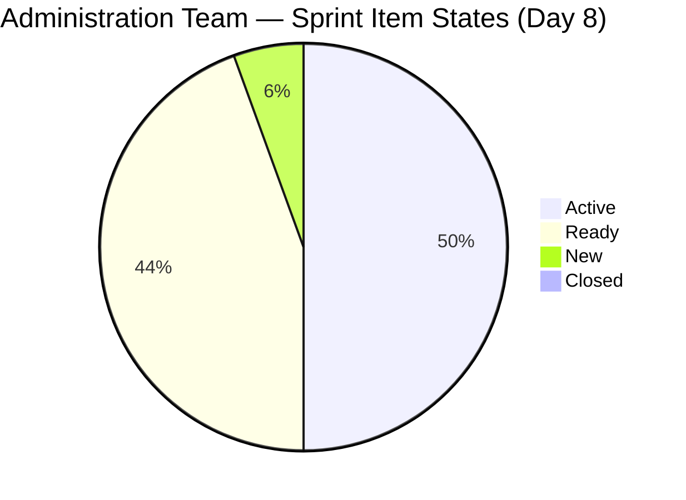
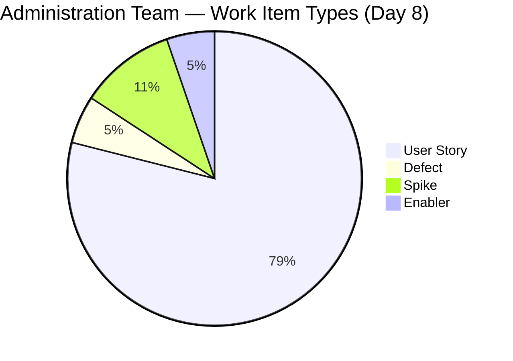
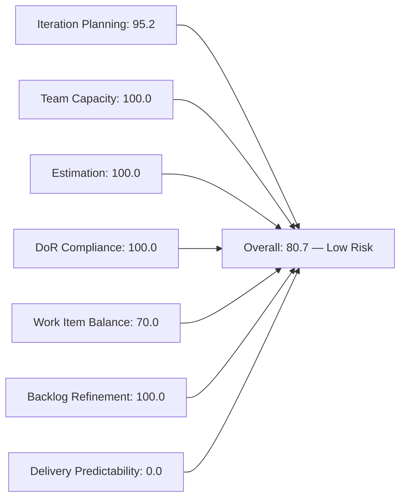
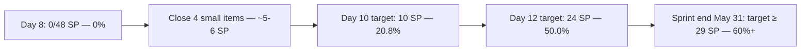

# SAFe Iteration Audit — Administration Team

## 1. Audit Metadata

| Field | Value |
|-------|-------|
| **Project** | Jairosoft FINOPS |
| **Team** | Administration Team |
| **Workspace** | `ado_admin` |
| **ADO Project ID** | e0bb302f-40f9-46c3-8164-6f1acb317d63 |
| **ADO Team ID** | a38a9c02-07ab-483d-a1e3-aff54e19e603 |
| **Iteration** | Iteration 7.4 |
| **Iteration Start** | 2026-05-18 |
| **Iteration Finish** | 2026-05-31 |
| **Audit Date** | 2026-05-25 (PHT) |
| **Audit Day** | Day 8 of 14 |
| **Prior Audit** | AUDIT_20260524_0203.md (Day 7, Iteration 7.4, 80.7 — Low Risk) |
| **Overall Score** | **80.7 / 100** |
| **Risk Band** | **Low Risk** |

---

## 2. Executive Summary

The Administration Team holds at **80.7 / 100 (Low Risk)** on Day 8 of Iteration 7.4. All seven dimension scores are structurally unchanged from Day 7. The sprint is now past its midpoint with 6 days remaining.

**Notable Day 8 activity:** Multiple work item titles were updated on 2026-05-24 to correct due-date references — items 203556, 203557, 203558, 204363, 204367, 204387, 204391 all show updated titles with revised payment dates. Item 203693 (Admin CR sink cabinet) moved from Ready to New, indicating a scope revision. Items 203716, 204363, and 204367 moved to Active state, increasing the active item count from 7 to 9.

**Critical gap unchanged:** Zero closures through Day 8. With 6 days remaining and 48 SP committed, Mark Colina must begin converting Active items to Closed. The correction of due-date titles on Day 7–8 suggests active engagement with items, but no item has yet crossed the finish line.

**Work item type correction from prior audits:** Items 204135 ("3 vendors for panaflex signage") and 204136 ("3 vendors for flag pole") are confirmed as **Spike** type (not User Story as listed in earlier audits). Item 204536 ("Gcash business registration") is an **Enabler** type. This brings the sprint composition to 15 US, 1 Defect, 2 Spikes, 1 Enabler, and 1 Defect-New = 20 items total. The overall score is unaffected.

---

## 3. Previous Audit Delta

**Prior audit:** AUDIT_20260524_0203.md — Iteration 7.4, Day 7, Score 80.7 / 100 (Low Risk)

| Dimension | Day 7 | Day 8 | Delta | Driver |
|-----------|-------|-------|-------|--------|
| Iteration Planning | 95.2 | **95.2** | 0.0 | 20/21 items; 203717 still in 7.5 |
| Team Capacity | 100.0 | **100.0** | 0.0 | Mark at 5 hrs/day; unchanged |
| Estimation | 100.0 | **100.0** | 0.0 | All 20 sprint items estimated |
| DoR Compliance | 100.0 | **100.0** | 0.0 | All 20 items pass Description + AC |
| Work Item Balance | 70.0 | **70.0** | 0.0 | 15 US dominant (75%) → -30; structural |
| Backlog Refinement | 100.0 | **100.0** | 0.0 | All 21 items fresh; 0 stale; 0 untouched |
| Delivery Predictability | 0.0 | **0.0** | 0.0 | No items Closed/Done through Day 8 |
| **Overall** | **80.7** | **80.7** | **0.0** | Stable — no closures yet |

**Key Day 8 observations:**
- Multiple item title updates detected (due-date corrections): 203556, 203557, 203558, 204363, 204367, 204387, 204391 — all modified 2026-05-24.
- Item 203693 (Admin CR sink cabinet) state changed: Ready → New. Possible re-scoping or return-to-backlog signal.
- Items 203716 (Procure Signage Materials), 204363 (EGOV payables May 26-31), 204367 (EGOV payables May 29) moved to Active state.
- Item 204367 title corrected: "Government (EGOV) payables May 29, 2026" (was "May 20, 2026"). The payment description in the body still references May 20, 2026 — potential mismatch.
- Active items now: 202366, 203556, 203716, 204135, 204136, 204363, 204367, 204387, 204675 = **9 Active** (up from 7 on Day 7).

---

## 4. Current Iteration Snapshot

| Attribute | Value |
|-----------|-------|
| Active Iteration | Iteration 7.4 |
| Sprint Duration | 2026-05-18 to 2026-05-31 (14 days) |
| Audit Day | **Day 8 of 14** |
| Current Iteration Root Items | **20** |
| Total Visible Backlog Root Items | **21** |
| Sprint Load % | **95.2%** |
| Total Committed Story Points | **48 SP** |
| Closed Story Points | **0 SP** |
| Active Items | 9 |
| Ready Items | 8 |
| New Items | 1 (203693) |
| Closed Items | 0 |
| Active Team Members | 1 (Mark Colina) |
| Capacity Configured | Yes — 5 hrs/day; 0 days off |
| Remaining Days | **6** |

---

## 5. Work Item Analysis

### Current Iteration Root Items (20 items, 48 SP)

| ID | Title | Type | State | SP | ChangedDate |
|----|-------|------|-------|----|-------------|
| 202366 | Philgeps renewal for 2026 | User Story | Active | 3 | 2026-05-21 |
| 203555 | Government (EGOV) payables May 18 - 25, 2026 | User Story | Ready | 4 | 2026-05-18 |
| 203556 | Payables - Internet for Davao and Cebu office May 28, 2026 | User Story | Active | 4 | 2026-05-24 |
| 203557 | Utilities payables for Cebu and Davao May 29, 2026 | User Story | Ready | 4 | 2026-05-24 |
| 203558 | Condo dues (Cebu) payables May 28, 2026 | User Story | Ready | 3 | 2026-05-24 |
| 203693 | Admin CR sink cabinet | Defect | **New** | 3 | 2026-05-24 |
| 203716 | Procure Signage Materials | User Story | **Active** | 2 | 2026-05-24 |
| 204135 | 3 vendors for panaflex signage | Spike | Active | 1 | 2026-05-24 |
| 204136 | 3 vendors for flag pole | Spike | Active | 1 | 2026-05-24 |
| 204305 | Philgeps renewal payment | User Story | Ready | 1 | 2026-05-18 |
| 204363 | Government (EGOV) payables May 26 - 31, 2026 | User Story | **Active** | 2 | 2026-05-24 |
| 204367 | Government (EGOV) payables May 29, 2026 | User Story | **Active** | 2 | 2026-05-24 |
| 204380 | Government (EGOV) payables May 28-31, 2026 | User Story | Ready | 2 | 2026-05-21 |
| 204387 | Payables - Internet for Davao and Cebu office May 30, 2026 | User Story | Active | 2 | 2026-05-24 |
| 204391 | Car payment (Fortuner) and Meal Payment for Davao | User Story | Ready | 2 | 2026-05-24 |
| 204394 | Utilities payables for Cebu May 28-31, 2026 | User Story | Ready | 2 | 2026-05-22 |
| 204448 | Condo dues (Cebu) payables May 26, 2026 | User Story | Ready | 2 | 2026-05-22 |
| 204452 | Professional fee payables | User Story | Ready | 3 | 2026-05-18 |
| 204536 | Gcash business registration for Jairosoft Inc. | Enabler | Active | 2 | 2026-05-24 |
| 204675 | Davao Admin Adhoc Support May 18-31, 2026 cutoff | User Story | Active | 3 | 2026-05-22 |

**Backlog Item Not in Sprint:**

| ID | Title | Type | State | SP | IterationPath |
|----|-------|------|-------|----|--------------|
| 203717 | Installation of Street Signage | User Story | Ready | 3 | Iteration 7.5 |

### State Distribution

| State | Count | % |
|-------|-------|---|
| Active | 9 | 45.0% |
| Ready | 8 | 40.0% |
| New | 1 | 5.0% |
| Closed / Done | 0 | 0.0% |

### Work Item Type Distribution

| Type | Count | % |
|------|-------|---|
| User Story | 15 | 75.0% |
| Defect | 1 | 5.0% |
| Spike | 2 | 10.0% |
| Enabler | 1 | 5.0% |

### Known Issues

- **Item 204367** title updated to "May 29, 2026" but description body still states "on or before May 20, 2026." Internal inconsistency needs correction.
- **Item 204391** description still references utilities (electricity, water, internet) despite title referencing car payment and meal payment — persistent mismatch since Day 5.
- **Item 203693** reverted to "New" state — unclear if this represents a scope change or workflow reset.

---

## 6. SAFe Compliance Scorecard

| Dimension | Score | Evidence | Notes |
|-----------|-------|----------|-------|
| Iteration Planning | 95.2 | 20 of 21 visible backlog items in sprint | 1 item (203717) parked in 7.5 |
| Team Capacity | 100.0 | Mark Colina at 5 hrs/day; 0 days off | Sole contributor; bus factor risk |
| Estimation | 100.0 | All 20 sprint items have Story Points > 0 | Total: 48 SP committed |
| DoR Compliance | 100.0 | All 20 items have Description ≥ 30 chars + AC ≥ 20 chars | Strong item quality |
| Work Item Balance | 70.0 | 15 US / 20 items = 75% dominant → -30 | Spike (10%) and Enabler (5%) diversity noted |
| Backlog Refinement | 100.0 | All 21 items fresh (changed ≥ 2026-05-18); 0 stale-90; 0 stale-180; 0 untouched | Excellent hygiene |
| Delivery Predictability | 0.0 | 0 SP closed of 48 SP committed — Day 8 | Critical — 9 Active items, 0 Closed |
| **Overall** | **80.7** | Average of 7 dimensions | **Low Risk** |

---

## 7. Dimension Findings

### Iteration Planning (95.2)
Sprint loading remains strong at 95.2%. Twenty of 21 visible backlog items are committed to Iteration 7.4. Item 203717 (Installation of Street Signage) remains correctly parked in 7.5 for post-procurement work. The high load is appropriate given the sprint's administrative payment cycle scope.

### Team Capacity (100.0)
Mark Colina is configured at 5 hours/day with no days off. Capacity alignment is complete. With 9 items now Active on Day 8, Mark is clearly engaged across multiple work streams, but no item has closed. The sustained bus factor risk (single contributor) remains unmitigated.

### Estimation (100.0)
All 20 sprint items carry Story Points, including the 2 Spike items (204135, 204136 at 1 SP each) and the Enabler (204536 at 2 SP). Estimation coverage is complete at 48 SP total.

### DoR Compliance (100.0)
All 20 sprint items have substantive descriptions and acceptance criteria exceeding the minimum thresholds. Item 204391's description-title mismatch is noted but does not affect scoring (both fields meet the character length requirements). Item 204367's internal inconsistency (title says May 29; body says May 20) also does not affect DoR scoring but is a data quality risk.

### Work Item Balance (70.0)
The sprint contains 15 User Stories (75%), 1 Defect, 2 Spikes, and 1 Enabler. User Story dominance at 75% triggers the -30 penalty. Spike share at 10% is well below the 40% penalty threshold. The balance is structurally consistent with an administrative team managing operational payables cycles. Score is 100 - 30 = 70.

### Backlog Refinement (100.0)
All 21 visible backlog items were modified within the last 45 days (fresh threshold: 2026-04-10). No items cross the 90-day or 180-day staleness thresholds. All 20 sprint items were last changed on or after 2026-05-18, yielding 0 untouched items. Active item updates on 2026-05-24 confirm ongoing grooming discipline.

### Delivery Predictability (0.0)
**Critical dimension.** Zero Story Points have been closed through Day 8. Nine items are now Active — the highest Active count this sprint — indicating engagement, but no completions. Six days remain to deliver against 48 SP. Historical baseline (Iteration 6.5: 61.3% delivery) suggests partial delivery is likely, but the pattern of leaving closures to the sprint's final days is suboptimal.

**Urgent closure candidates for Day 8-9:**
1. **204448** (Condo dues May 26 — due date is tomorrow, May 26)
2. **203555** (EGOV payables May 18-25 — payment window may have already closed)
3. **204305** (Philgeps renewal payment — 1 SP, Ready state)
4. **204135** / **204136** (Spike items at 1 SP each — canvassing work, Active)

---

## 8. Risks and Bottlenecks

| Risk | Severity | Status |
|------|----------|--------|
| Zero closures through Day 8 with 6 days remaining | High | Active — 0/48 SP delivered |
| Item 204448 (Condo dues May 26) due tomorrow | High | Active — must close or pay on Day 9 |
| Item 203555 (EGOV payables May 18-25) window may be closed | High | Active — 7 days past end of payment window |
| Item 204367 title/body date inconsistency | Moderate | New — detected Day 8 |
| Item 203693 reverted to New state | Moderate | New — scope regression signal |
| Item 204391 title/description mismatch | Low | Persistent since Day 5 — unresolved |
| Single contributor (Mark) bus factor | Moderate | Persistent — no mitigation taken |
| 48 SP commitment with 6 days remaining | Moderate | Pattern risk — limited daily capacity |

---

## 9. Prioritized Recommendations

1. **[URGENT] Close item 204448 (Condo dues May 26) today:** The payment due date is tomorrow, May 26. If payment is not made and the ADO item not closed, this becomes an overdue compliance item.

2. **[URGENT] Review and close item 203555 (EGOV payables May 18-25):** The payment window (May 18-25) has closed. If payment was made, close the item immediately. If not, escalate urgently.

3. **[HIGH] Close 4-6 items by Day 10:** Items 204305 (1 SP), 204135 (1 SP), 204136 (1 SP) are small Active/Ready items that can be closed quickly. Closing 6 items (12+ SP) by Day 10 raises Delivery Predictability to 25%+ and overall score above 83.

4. **[MEDIUM] Correct item 204367 date inconsistency:** Update the description body to match the title date (May 29, 2026) or clarify the actual due date for this EGOV payment.

5. **[MEDIUM] Resolve item 203693 state regression:** Determine why Admin CR sink cabinet reverted to New. If work is in progress, restore to Active. If scope has changed, update the description accordingly.

6. **[LOW] Resolve item 204391 mismatch:** Update description to match the car payment/meal scope rather than utilities language (copied from 203557).

---

## 10. Evidence Gaps and Limitations

- **Delivery Predictability** is based on ADO State = Closed/Done. If Mark has completed payment tasks without updating ADO, the score understates actual delivery.
- **Item 203693** state change to New may indicate a workflow reset in ADO rather than a true scope change. Without comment history, the cause is unclear.
- **Item 204367** date inconsistency: title says "May 29, 2026" while the description body says "on or before May 20, 2026." The description may be a template that was not updated when the title was corrected on 2026-05-24.
- **Type corrections:** Items 204135 and 204136 were previously listed as User Stories in this audit series; they are confirmed Spike type as of this audit. Item 204536 is confirmed as Enabler. Prior audit scores were not affected because all types expose the Story Points field.
- **Capacity data** from `work_get_iteration_capacities` returns team-level capacity; individual daily availability cannot be validated without time-tracking integration.

---

## Mermaid Diagrams

### Sprint State Distribution (Day 8)

### Work Item Type Distribution (Day 8)

### SAFe Dimension Scores (Day 8)

### Delivery Urgency — Days Remaining vs. SP to Close

