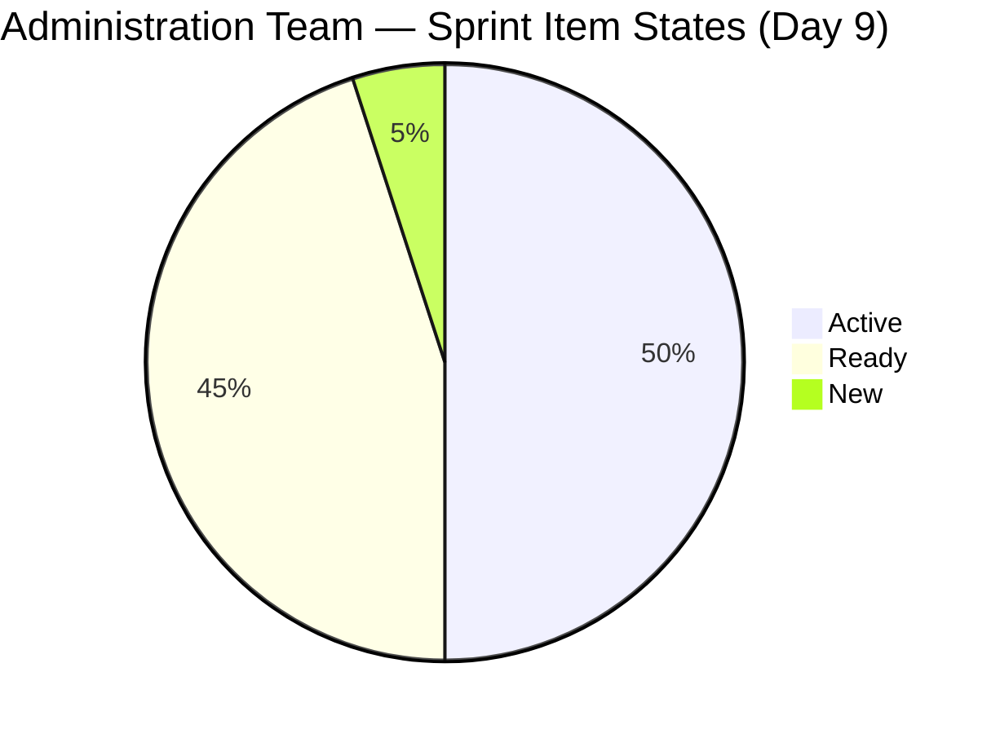
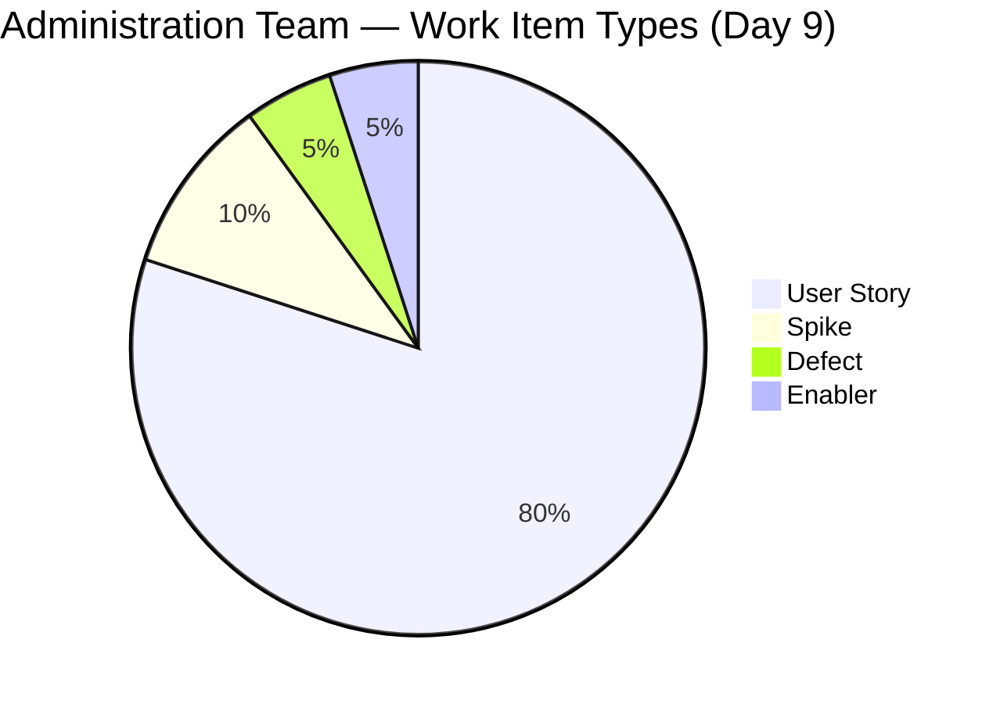
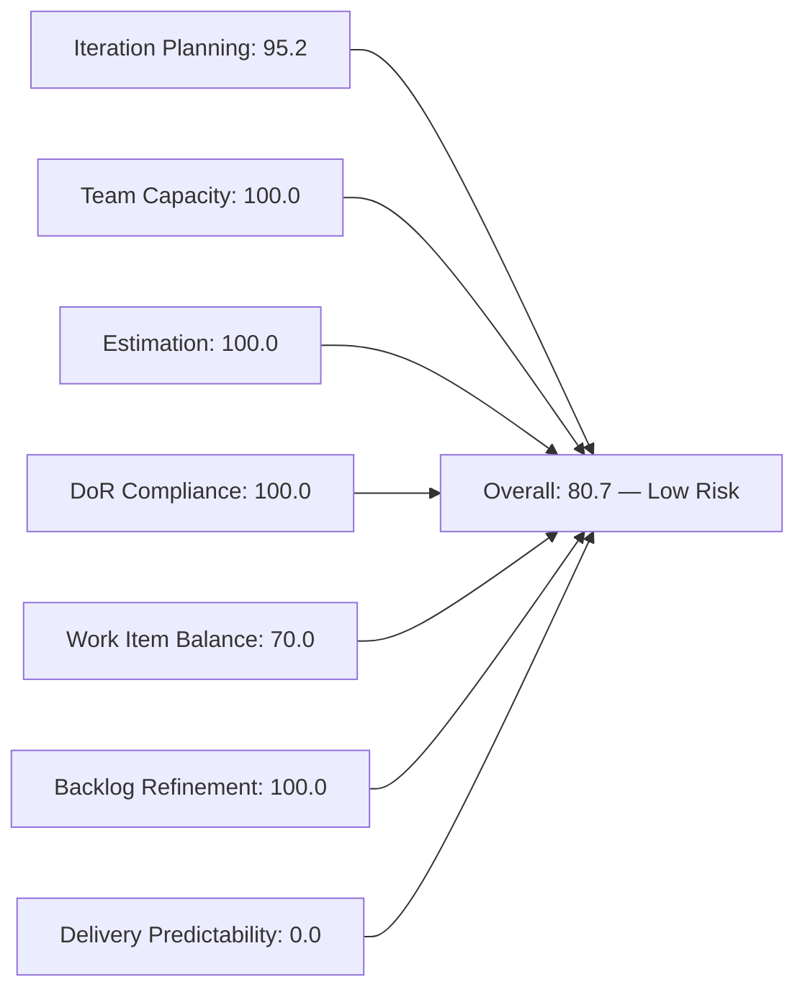
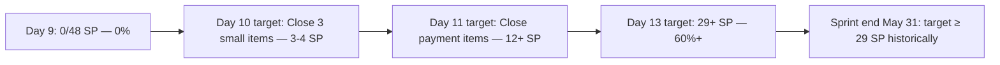
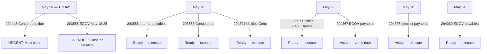

# SAFe Iteration Audit — Administration Team

## 1. Audit Metadata

| Field | Value |
|-------|-------|
| **Project** | Jairosoft FINOPS |
| **Team** | Administration Team |
| **Workspace** | `ado_admin` |
| **ADO Project ID** | e0bb302f-40f9-46c3-8164-6f1acb317d63 |
| **ADO Team ID** | a38a9c02-07ab-483d-a1e3-aff54e19e603 |
| **Iteration** | Iteration 7.4 |
| **Iteration Start** | 2026-05-18 |
| **Iteration Finish** | 2026-05-31 |
| **Audit Date** | 2026-05-26 (PHT) |
| **Audit Day** | Day 9 of 14 |
| **Prior Audit** | AUDIT_20260525_0900.md (Day 8, Iteration 7.4, 80.7 — Low Risk) |
| **Overall Score** | **80.7 / 100** |
| **Risk Band** | **Low Risk** |

---

## 2. Executive Summary

The Administration Team holds at **80.7 / 100 (Low Risk)** on Day 9 of Iteration 7.4 — unchanged from Day 8. All seven dimension scores remain structurally stable. The sprint now has **5 days remaining** (May 27–31) with zero closures to date.

**Key Day 9 development:** Item **203555** (Government EGOV payables May 18–25, 2026) was updated on 2026-05-25T18:46 — its state changed from Ready to **Ready** (no state transition but field update detected), confirming Mark is actively monitoring payables due items. The payment window for this item (May 18–25) has now fully closed; if payment was made, the item must be closed in ADO immediately.

**Critical threshold reached:** Day 9 with 0 SP closed of 48 SP committed. With only 5 days remaining, Mark must begin closing completed items today. The pattern from Iteration 6.5 (61.3% delivery, most closures in final 2 days) is at risk of repeating. The sprint has **condo dues (204448) due today (May 26)** — this item must close today or payment is overdue.

**No structural changes:** The visible backlog remains at 21 items; 20 are in the sprint; item 203717 (Installation of Street Signage) remains correctly parked in Iteration 7.5.

---

## 3. Previous Audit Delta

**Prior audit:** AUDIT_20260525_0900.md — Iteration 7.4, Day 8, Score 80.7 / 100 (Low Risk)

| Dimension | Day 8 | Day 9 | Delta | Driver |
|-----------|-------|-------|-------|--------|
| Iteration Planning | 95.2 | **95.2** | 0.0 | 20/21 items; 203717 still in 7.5 |
| Team Capacity | 100.0 | **100.0** | 0.0 | Mark at 5 hrs/day; 0 days off |
| Estimation | 100.0 | **100.0** | 0.0 | All 20 sprint items have SP > 0 |
| DoR Compliance | 100.0 | **100.0** | 0.0 | All 20 items pass Description + AC |
| Work Item Balance | 70.0 | **70.0** | 0.0 | US dominant (75%) → -30; structural |
| Backlog Refinement | 100.0 | **100.0** | 0.0 | All 21 items fresh; 0 stale; 0 untouched |
| Delivery Predictability | 0.0 | **0.0** | 0.0 | Zero closures through Day 9 |
| **Overall** | **80.7** | **80.7** | **0.0** | Stable — no closures yet |

**Key Day 9 observations:**
- Item 203555 (EGOV payables May 18–25) updated 2026-05-25T18:46 — state remains Ready; payment window has closed. Urgent close or escalation required.
- Item 204448 (Condo dues May 26) has a due date of today (May 26) — must be closed today.
- No new state transitions detected across any of the 20 sprint items.
- Active item count remains 10; Closed remains 0.

---

## 4. Current Iteration Snapshot

| Attribute | Value |
|-----------|-------|
| Active Iteration | Iteration 7.4 |
| Sprint Duration | 2026-05-18 to 2026-05-31 (14 days) |
| Audit Day | **Day 9 of 14** |
| Current Iteration Root Items | **20** |
| Total Visible Backlog Root Items | **21** |
| Sprint Load % | **95.2%** |
| Total Committed Story Points | **48 SP** |
| Closed Story Points | **0 SP** |
| Active Items | 10 |
| Ready Items | 9 |
| New Items | 1 (203693) |
| Closed Items | 0 |
| Active Team Members | 1 (Mark Colina) |
| Capacity Configured | Yes — 5 hrs/day; 0 days off |
| Remaining Days | **5** |

---

## 5. Work Item Analysis

### Current Iteration Root Items (20 items, 48 SP)

| ID | Title | Type | State | SP | ChangedDate |
|----|-------|------|-------|----|-------------|
| 202366 | Philgeps renewal for 2026 | User Story | Active | 3 | 2026-05-21 |
| 203555 | Government (EGOV) payables May 18 - 25, 2026 | User Story | Ready | 4 | **2026-05-25** |
| 203556 | Payables - Internet for Davao and Cebu office May 28, 2026 | User Story | Active | 4 | 2026-05-24 |
| 203557 | Utilities payables for Cebu and Davao May 29, 2026 | User Story | Ready | 4 | 2026-05-24 |
| 203558 | Condo dues (Cebu) payables May 28, 2026 | User Story | Ready | 3 | 2026-05-24 |
| 203693 | Admin CR sink cabinet | Defect | New | 3 | 2026-05-24 |
| 203716 | Procure Signage Materials | User Story | Active | 2 | 2026-05-24 |
| 204135 | 3 vendors for panaflex signage | Spike | Active | 1 | 2026-05-24 |
| 204136 | 3 vendors for flag pole | Spike | Active | 1 | 2026-05-24 |
| 204305 | Philgeps renewal payment | User Story | Ready | 1 | 2026-05-18 |
| 204363 | Government (EGOV) payables May 26 - 31, 2026 | User Story | Active | 2 | 2026-05-24 |
| 204367 | Government (EGOV) payables May 29, 2026 | User Story | Active | 2 | 2026-05-24 |
| 204380 | Government (EGOV) payables May 28-31, 2026 | User Story | Ready | 2 | 2026-05-21 |
| 204387 | Payables - Internet for Davao and Cebu office May 30, 2026 | User Story | Active | 2 | 2026-05-24 |
| 204391 | Car payment (Fortuner) and Meal Payment for Davao | User Story | Ready | 2 | 2026-05-24 |
| 204394 | Utilities payables for Cebu May 28-31, 2026 | User Story | Ready | 2 | 2026-05-22 |
| 204448 | Condo dues (Cebu) payables May 26, 2026 | User Story | Ready | 2 | 2026-05-22 |
| 204452 | Professional fee payables | User Story | Ready | 3 | 2026-05-18 |
| 204536 | Gcash business registration for Jairosoft Inc. | Enabler | Active | 2 | 2026-05-24 |
| 204675 | Davao Admin Adhoc Support May 18-31, 2026 cutoff | User Story | Active | 3 | 2026-05-22 |

**Backlog Item Not in Sprint:**

| ID | Title | Type | State | SP | IterationPath |
|----|-------|------|-------|----|--------------|
| 203717 | Installation of Street Signage | User Story | Ready | 3 | Iteration 7.5 |

### State Distribution

| State | Count | % |
|-------|-------|---|
| Active | 10 | 50.0% |
| Ready | 9 | 45.0% |
| New | 1 | 5.0% |
| Closed / Done | 0 | 0.0% |

### Work Item Type Distribution

| Type | Count | % |
|------|-------|---|
| User Story | 16 | 80.0% |
| Defect | 1 | 5.0% |
| Spike | 2 | 10.0% |
| Enabler | 1 | 5.0% |

### Known Issues (Persistent)

- **Item 204367** title says "May 29, 2026" but description body states "on or before May 20, 2026" — internal inconsistency persists since Day 7.
- **Item 204391** description references utilities (electricity, water, internet) despite the title being about car payment and meal payment — content mismatch persists since Day 5.
- **Item 203693** remains in "New" state — state regression from "Ready" that occurred on Day 7 has not been resolved.
- **Item 203555** payment window (May 18–25) has closed — requires urgent confirmation and closure or escalation.

---

## 6. SAFe Compliance Scorecard

| Dimension | Score | Evidence | Notes |
|-----------|-------|----------|-------|
| Iteration Planning | 95.2 | 20 of 21 visible backlog items in sprint | 1 item (203717) correctly parked in 7.5 |
| Team Capacity | 100.0 | Mark Colina at 5 hrs/day; 0 days off | Sole contributor; bus factor risk persists |
| Estimation | 100.0 | All 20 sprint items have Story Points > 0 | Total: 48 SP committed |
| DoR Compliance | 100.0 | All 20 items have Description ≥ 30 chars + AC ≥ 20 chars | Strong item quality |
| Work Item Balance | 70.0 | 16 US / 20 items = 80% dominant → -30 | Spike (10%) and Enabler (5%) diversity noted |
| Backlog Refinement | 100.0 | All 21 items fresh (changed ≥ 2026-05-18); 0 stale-90; 0 stale-180; 0 untouched | Item 203555 updated 2026-05-25 |
| Delivery Predictability | 0.0 | 0 SP closed of 48 SP committed — Day 9 | Critical — 10 Active, 0 Closed in 9 days |
| **Overall** | **80.7** | Average of 7 dimensions | **Low Risk** |

---

## 7. Dimension Findings

### Iteration Planning (95.2)
Sprint loading remains strong at 95.2%. Twenty of 21 visible backlog items are committed to Iteration 7.4. Item 203717 (Installation of Street Signage) remains correctly parked in 7.5, contingent on signage material procurement (203716) completing first. No change from Day 8.

### Team Capacity (100.0)
Mark Colina is configured at 5 hours/day with no days off. Capacity alignment is complete. With 10 items in Active state, Mark is engaged across multiple work streams but has not closed any item through Day 9. The bus factor risk (single contributor) remains unmitigated with 5 days to sprint end.

### Estimation (100.0)
All 20 sprint items carry Story Points. The total committed load of 48 SP against Mark's 5 hrs/day capacity over a 14-day sprint implies high throughput expectations. No estimation changes since Day 1.

### DoR Compliance (100.0)
All 20 sprint items maintain compliant descriptions and acceptance criteria. The known description-title mismatches on items 204367 and 204391 are flagged but do not affect scoring (both fields satisfy the character thresholds). Item 203693's description and AC are substantive despite its "New" state regression.

### Work Item Balance (70.0)
Sprint composition: 16 User Stories (80%), 1 Defect, 2 Spikes, 1 Enabler. User Story dominance at 80% triggers the -30 penalty. No structural change is possible mid-sprint. The balance reflects the administrative payment cycle nature of the team's work.

### Backlog Refinement (100.0)
All 21 visible backlog items have been modified within the 45-day fresh window (since 2026-04-11). Item 203555 was updated on 2026-05-25, confirming active monitoring. No items are stale at the 90-day or 180-day thresholds. All 20 sprint items were last changed on or after 2026-05-18 (0 untouched).

### Delivery Predictability (0.0)
**Critical dimension.** Zero Story Points have been closed through Day 9. Ten items remain in Active state, representing 50% of the sprint in execution, but no transitions to Closed. Five days remain to deliver against 48 SP.

The historical Iteration 6.5 baseline (61.3% delivery = ~29 SP) suggests Mark typically executes payment closures in concentrated bursts at sprint end. However, several items have hard due dates in the next 5 days:
- **204448** (Condo dues May 26) — due today
- **203555** (EGOV payables May 18–25) — payment window closed; must close in ADO now
- **204363** (EGOV payables May 26–31) — active window open now
- **203556, 204387** (Internet payables May 28 and 30) — due this week
- **203557, 204394** (Utilities due May 29 and May 28–31) — due this week

**Path to score improvement with 5 days remaining:**
- Close 3 small items today (204448 + 204305 + 204135 = 4 SP) → Delivery = 4/48 = 8.3% → Overall = 82.1
- Close 6 more items (10 SP) by Day 11 → Delivery = 14/48 = 29.2% → Overall = ~82.0
- Close 12 items by Day 13 (29 SP) → Delivery = 60.4% → Overall = ~89.3 (Low Risk, strong)

---

## 8. Risks and Bottlenecks

| Risk | Severity | Status |
|------|----------|--------|
| Zero closures through Day 9 with 5 days remaining | **Critical** | Active — 0/48 SP delivered |
| Item 204448 (Condo dues May 26) — due today | **Critical** | Must close today or payment is overdue |
| Item 203555 (EGOV payables May 18–25) — payment window closed | **High** | Active — 8 days past end of payment window |
| Item 204363 (EGOV payables May 26–31) — window opens today | **High** | Active — must execute and close this week |
| Multiple payment items due May 28–31 (7 items, 19 SP) | **High** | Active — bunched end-of-sprint workload |
| Item 203693 in "New" state — workflow regression unresolved | **Moderate** | Persistent since Day 7 |
| Item 204367 title/body date inconsistency | **Moderate** | Persistent since Day 8 |
| Single contributor (Mark) bus factor | **Moderate** | Persistent — no mitigation |

---

## 9. Prioritized Recommendations

1. **[CRITICAL] Close item 204448 (Condo dues May 26) today:** Payment is due today, May 26. Mark must confirm payment, obtain receipt, and close the ADO item immediately. If not done by EOD, this becomes an overdue compliance item.

2. **[CRITICAL] Resolve item 203555 (EGOV payables May 18–25):** The May 18–25 payment window closed yesterday. If payment was made, close the item and attach receipt documentation. If payment was not made, escalate immediately to Mark's supervisor — government late payment penalties may apply.

3. **[HIGH] Close 4–6 small items by Day 10:** Items 204305 (1 SP, Ready), 204135 (1 SP, Active), 204136 (1 SP, Active) are minimal-effort items that can close quickly. Closing these three (3 SP) raises Delivery Predictability from 0.0% to 6.3% and overall to 81.6. Target 4 SP closed by Day 10 EOD.

4. **[HIGH] Correct item 204367 date inconsistency:** Update the description body to state "May 29, 2026" (matching the title). The current description still says "on or before May 20, 2026." This creates ambiguity about when the actual payment obligation falls.

5. **[MEDIUM] Resolve item 203693 (Admin CR sink cabinet) state regression:** Determine why this item regressed to "New" and restore it to an appropriate state. If procurement work is underway, restore to Active. If the item has been deferred, update accordingly.

6. **[MEDIUM] Fix item 204391 description mismatch:** Update the acceptance criteria from utilities language to match the car payment (Fortuner) and meal payment scope. The current AC was copied from item 203557 and does not match the title.

7. **[LOW] Plan Day 11–13 closure sprint:** Mark should pre-plan which payment items will close on which days so that the final 3 days (May 29–31) are not overwhelmed by 7+ simultaneous payment closures. Creating a simple checklist of payment due dates vs. ADO close schedule would help.

---

## 10. Evidence Gaps and Limitations

- **Delivery Predictability** is based on ADO State = Closed/Done. If Mark has completed payment tasks without updating ADO item states, the actual delivery may exceed 0.0%. Mark's activity pattern suggests late-sprint ADO updates rather than real-time tracking.
- **Item 203555** (EGOV May 18–25): The ChangedDate of 2026-05-25 suggests field-level activity but the State = Ready. Whether the actual payment was made or not cannot be determined from ADO data alone.
- **Item 203693** state regression cause: Without comment history access in this audit, the root cause of the Ready→New regression on Day 7 cannot be determined. It may represent an intentional re-scoping or an accidental workflow reset.
- **Item 204367** internal inconsistency: The title was corrected to "May 29" on 2026-05-24, but the description body still references "May 20, 2026." This mismatch has persisted 3 days; the description is likely a template that was not updated.
- **Capacity data** returns team-level figures (5 hrs/day for Administration Team); individual daily allocation within Mark's schedule cannot be validated without time-tracking integration.

---

## Mermaid Diagrams

### Sprint State Distribution (Day 9)

### Work Item Type Distribution

### SAFe Dimension Scores (Day 9)

### Delivery Urgency — Remaining Days vs. Required SP

### Payment Due Date Timeline (Remaining Sprint)

