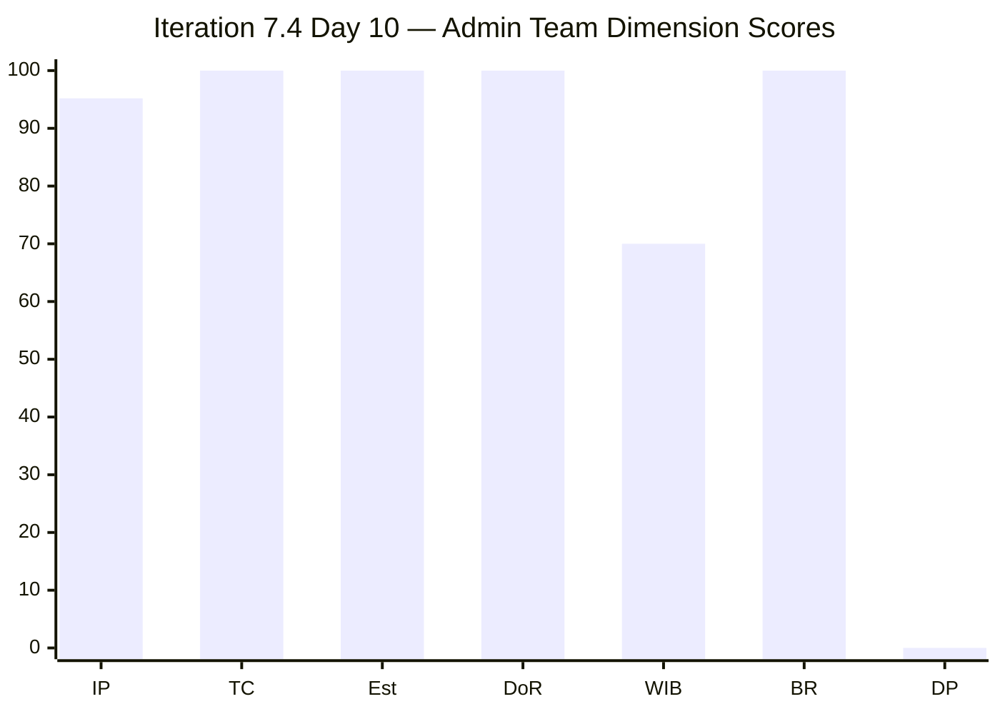
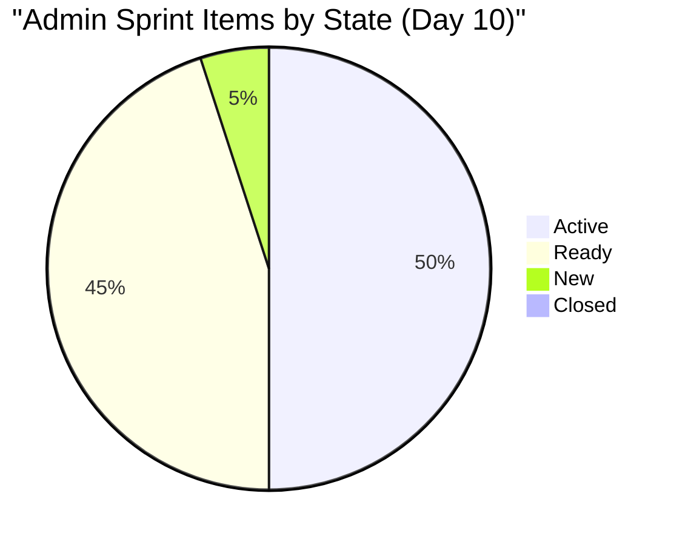
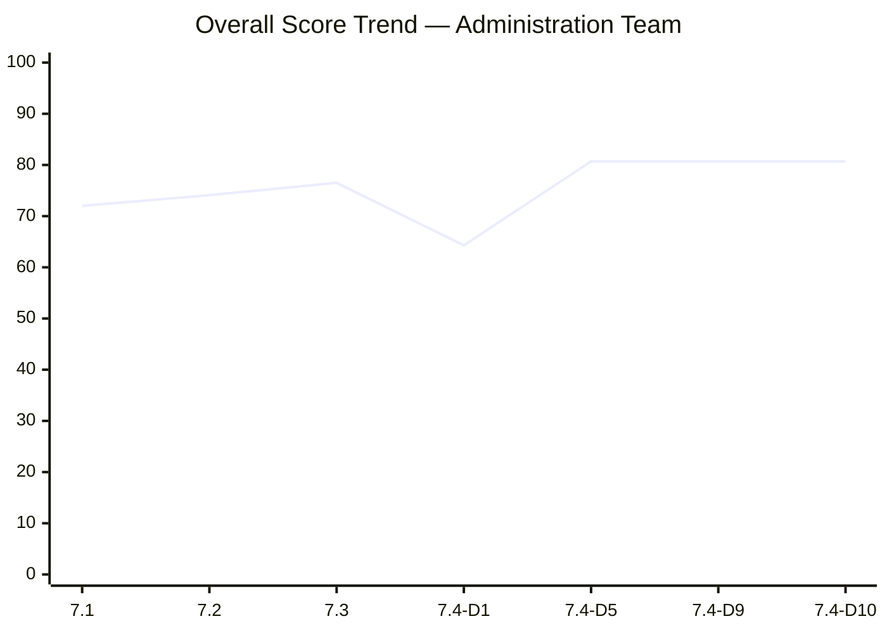

# SAFe Iteration Audit — Administration Team

## 1. Audit Metadata

| Field | Value |
|-------|-------|
| **Project** | Jairosoft FINOPS |
| **Team** | Administration Team |
| **Workspace** | `ado_admin` |
| **ADO Project ID** | e0bb302f-40f9-46c3-8164-6f1acb317d63 |
| **ADO Team ID** | a38a9c02-07ab-483d-a1e3-aff54e19e603 |
| **Iteration** | Iteration 7.4 |
| **Iteration Start** | 2026-05-18 |
| **Iteration Finish** | 2026-05-31 |
| **Audit Date** | 2026-05-27 (UTC) |
| **Audit Day** | Day 10 of 14 |
| **Prior Audit** | AUDIT_20260526_0204.md (Day 9, Iteration 7.4, 80.7 — Low Risk) |
| **Overall Score** | **80.7 / 100** |
| **Risk Band** | **Low Risk** |

---

## 2. Executive Summary

The Administration Team holds at **80.7 / 100 (Low Risk)** on Day 10 of Iteration 7.4 — structurally unchanged from Day 9. All seven dimensions remain at the same scores. With **4 days remaining** (May 28–31), the team continues to carry **0 SP closed** of 48 SP committed, maintaining the persistent delivery risk that has been flagged since Day 6.

**Critical window:** The sprint closes May 31. Mark Colina must convert active items to Closed states immediately. The payment item 203555 (Government EGOV payables May 18–25) had its payment window close 9 days ago — this item must be audited for actual payment completion and closed in ADO. Item 204448 (Condo dues May 26) is similarly overdue for closure.

**No structural changes detected:** The visible backlog remains at 21 items; 20 are in the sprint; item 203717 remains in Iteration 7.5. No new items, no state transitions detected since May 26. The Delivery Predictability dimension will remain at 0.0 until Mark closes work items — this single dimension is suppressing the score by approximately 6.9 points from what would otherwise be an 87.6 score.

**Pattern risk:** Iteration 6.5 saw a last-minute delivery collapse (61.3% SP delivered, down from projected 80%+). With 4 days left and 0 SP closed, the risk of a similar outcome is elevated.

---

## 3. Previous Audit Delta

**Prior audit:** AUDIT_20260526_0204.md — Iteration 7.4, Day 9, Score 80.7 / 100 (Low Risk)

| Dimension | Day 9 | Day 10 | Delta | Driver |
|-----------|-------|--------|-------|--------|
| Iteration Planning | 95.2 | **95.2** | 0.0 | 20/21 items; 203717 still in 7.5 |
| Team Capacity | 100.0 | **100.0** | 0.0 | Mark at 5 hrs/day; 0 days off |
| Estimation | 100.0 | **100.0** | 0.0 | All 20 sprint items have SP > 0 |
| DoR Compliance | 100.0 | **100.0** | 0.0 | All 20 items pass Description + AC |
| Work Item Balance | 70.0 | **70.0** | 0.0 | US dominant (80%) → -30; structural |
| Backlog Refinement | 100.0 | **100.0** | 0.0 | All 21 items fresh; 0 stale |
| Delivery Predictability | 0.0 | **0.0** | 0.0 | Zero closures through Day 10 |
| **Overall** | **80.7** | **80.7** | **0.0** | Stable — no closures or structural changes |

**Day 10 observations:**
- No state transitions detected since Day 9. Last observed changes were on 2026-05-25 (item 203555 field update) and 2026-05-24 (multiple items updated).
- Item 203555 (EGOV payables May 18–25) payment window has now been closed for 9 days. Requires immediate ADO closure or escalation.
- Item 204448 (Condo dues May 26) was due yesterday — must be closed today.
- 20 items remain Active or Ready with 0 Closed.

---

## 4. Current Iteration Snapshot

| Attribute | Value |
|-----------|-------|
| Active Iteration | Iteration 7.4 |
| Sprint Duration | 2026-05-18 to 2026-05-31 (14 days) |
| Audit Day | **Day 10 of 14** |
| Current Iteration Root Items | **20** |
| Total Visible Backlog Root Items | **21** |
| Sprint Load % | **95.2%** |
| Total Committed Story Points | **48 SP** |
| Closed Story Points | **0 SP** |
| Active Items | 10 |
| Ready Items | 9 |
| New Items | 1 (203693) |
| Closed Items | 0 |
| Active Team Members | 1 (Mark Colina) |
| Capacity Configured | Yes — 5 hrs/day; 0 days off |
| Remaining Days | **4** |

---

## 5. Work Item Analysis

### Current Sprint Items (Iteration 7.4) — 20 items, 48 SP

| ID | Title | Type | State | SP | Changed |
|----|-------|------|-------|----|---------|
| 202366 | Philgeps renewal for 2026 | User Story | Active | 3 | 2026-05-21 |
| 203555 | Government (EGOV) payables May 18–25, 2026 | User Story | Ready | 4 | 2026-05-25 |
| 203556 | Payables - Internet for Davao and Cebu May 28, 2026 | User Story | Active | 4 | 2026-05-24 |
| 203557 | Utilities payables for Cebu and Davao May 29, 2026 | User Story | Ready | 4 | 2026-05-24 |
| 203558 | Condo dues (Cebu) payables May 28, 2026 | User Story | Ready | 3 | 2026-05-24 |
| 203693 | Admin CR sink cabinet | Defect | New | 3 | 2026-05-24 |
| 203716 | Procure Signage Materials | User Story | Active | 2 | 2026-05-24 |
| 204135 | 3 vendors for panaflex signage | Spike | Active | 1 | 2026-05-24 |
| 204136 | 3 vendors for flag pole | Spike | Active | 1 | 2026-05-24 |
| 204305 | Philgeps renewal payment | User Story | Ready | 1 | 2026-05-18 |
| 204363 | Government (EGOV) payables May 26–31, 2026 | User Story | Active | 2 | 2026-05-24 |
| 204367 | Government (EGOV) payables May 29, 2026 | User Story | Active | 2 | 2026-05-24 |
| 204380 | Government (EGOV) payables May 28–31, 2026 | User Story | Ready | 2 | 2026-05-21 |
| 204387 | Payables - Internet for Davao and Cebu May 30, 2026 | User Story | Active | 2 | 2026-05-24 |
| 204391 | Car payment (Fortuner) and Meal Payment for Davao | User Story | Ready | 2 | 2026-05-24 |
| 204394 | Utilities payables for Cebu May 28–31, 2026 | User Story | Ready | 2 | 2026-05-22 |
| 204448 | Condo dues (Cebu) payables May 26, 2026 | User Story | Ready | 2 | 2026-05-22 |
| 204452 | Professional fee payables | User Story | Ready | 3 | 2026-05-18 |
| 204536 | Gcash business registration for Jairosoft Inc. | Enabler | Active | 2 | 2026-05-24 |
| 204675 | Davao Admin Adhoc Support May 18–31, 2026 cutoff | User Story | Active | 3 | 2026-05-22 |

**Not in sprint:** 203717 (Installation of Street Signage, Iteration 7.5)

### Item Type Distribution

| Type | Count | % |
|------|-------|---|
| User Story | 16 | 80.0% |
| Spike | 2 | 10.0% |
| Defect | 1 | 5.0% |
| Enabler | 1 | 5.0% |

### State Distribution

| State | Count | SP |
|-------|-------|----|
| Active | 10 | 21 |
| Ready | 9 | 23 |
| New | 1 | 3 |
| Closed | 0 | 0 |

---

## 6. SAFe Compliance Scorecard

| Dimension | Score | Evidence | Notes |
|-----------|-------|----------|-------|
| Iteration Planning | 95.2 | 20 of 21 visible backlog items in Iteration 7.4 | 203717 correctly staged in 7.5 |
| Team Capacity | 100.0 | Mark Colina: 5 hrs/day (Deployment 1, Documentation 2, Requirements 2); 0 days off | Single contributor; bus factor risk |
| Estimation | 100.0 | All 20 sprint items have Story Points > 0 | Full coverage |
| DoR Compliance | 100.0 | All 20 items have Description ≥30 chars AND Acceptance Criteria ≥20 chars | Strong DoR adherence |
| Work Item Balance | 70.0 | User Story dominant at 80% (>60%) → -30 penalty; no Spike > 40%; no User Story absence | Structural; payables-focused sprint |
| Backlog Refinement | 100.0 | All 21 items changed since 2026-05-18 (within 45 days); 0 stale_90; 0 stale_180; 0 untouched | Excellent refinement hygiene |
| Delivery Predictability | 0.0 | 0 SP Closed of 48 SP committed; Day 10 of 14 | **Critical — no closures in 10 days** |
| **Overall** | **80.7** | Average of 7 dimensions | Low Risk threshold maintained but delivery clock ticking |

---

## 7. Dimension Findings

### Iteration Planning (95.2 — Strong)
The team has effectively staged 20 of 21 backlog items into Iteration 7.4. Item 203717 (Street Signage Installation, 3 SP) is appropriately scheduled for Iteration 7.5. Sprint load is appropriately heavy given the operational nature of the payables-driven backlog.

### Team Capacity (100.0 — Strong)
Mark Colina is the sole team member with 5 hours per day configured across Deployment, Documentation, and Requirements activities. Capacity configuration is fully aligned with sprint work. The bus factor of 1 remains a persistent structural risk.

### Estimation (100.0 — Strong)
All 20 sprint items carry Story Points ranging from 1 to 4. This represents a sustained improvement from earlier PI7 iterations where estimation gaps were common.

### DoR Compliance (100.0 — Strong)
All 20 current iteration items carry substantive descriptions and acceptance criteria. This marks a significant improvement from Iterations 6.x where 30–40% of items lacked AC.

### Work Item Balance (70.0 — Moderate)
User Stories represent 80% of the sprint backlog — above the 60% dominance threshold that triggers a -30 penalty. This reflects the nature of an administration team whose work is primarily process-driven payables and compliance tasks. The 2 Spikes (vendor canvassing) and 1 Defect (sink cabinet) add type diversity but the imbalance is structurally tied to the team's domain.

### Backlog Refinement (100.0 — Strong)
Every visible backlog item was modified within the last 45 days. There are no items older than 90 or 180 days. None of the current sprint items were untouched since sprint start. This dimension reflects active backlog grooming.

### Delivery Predictability (0.0 — Critical)
**This is the sprint's primary risk.** Zero story points have been closed through Day 10 of 14. With only 4 working days remaining (May 28–31), closing 48 SP is unlikely unless Mark processes multiple closures in rapid succession. At the PI 6.5 rate (61.3%), ~29 SP would be expected by May 31 if the prior pattern holds — but only if closures begin immediately.

**Overdue items that should close this sprint:**
- 203555: EGOV payables May 18–25 — payment window closed 9 days ago
- 204448: Condo dues May 26 — due date was yesterday

---

## 8. Risks and Bottlenecks

| Risk | Severity | Likelihood | Mitigation |
|------|----------|------------|------------|
| Zero deliveries through Day 10 | Critical | High | Mark must begin closing completed items today; prioritize paid payables first |
| 203555 overdue closure (EGOV May 18–25) | High | Confirmed | If payment was made, close immediately; if not made, escalate to Ramon |
| 204448 overdue (Condo dues May 26) | High | Confirmed | Close if payment made; escalate if not |
| Bus factor = 1 (Mark Colina) | High | Structural | No mitigation this sprint; PI-level staffing concern |
| Pattern repeat from Iteration 6.5 | Moderate | Moderate | Last-minute rush in final 2 days; acceptable only if total ≥ 70% of committed SP |
| PI-end sprint (7.5 item visible in backlog) | Low | Low | 203717 properly staged; no cross-iteration leakage |

---

## 9. Prioritized Recommendations

1. **[IMMEDIATE] Close 203555 today** — The May 18–25 EGOV payables window has passed. If payment was executed, close the work item immediately. If not, escalate.
2. **[IMMEDIATE] Close 204448 today** — Condo dues (Cebu) were due May 26. Same action required.
3. **[TODAY] Begin closing Ready items** — Items 203557, 203558, 204305, 204380, 204391, 204394, 204452 are all in Ready state. Mark should process closures for any where the underlying task is complete.
4. **[THIS WEEK] Target minimum 29 SP closed before May 31** — This matches the 6.5 delivery rate (61.3%) and represents the minimum acceptable outcome to avoid a Critical delivery rating.
5. **[PROCESS] Decouple ADO state from payment execution** — Multiple payables items have due dates that have passed without ADO state changes. Mark should update ADO as payments are made, not at end of sprint.
6. **[PI PLANNING] Address bus factor** — Explore cross-training or adding a second Admin Team member in PI 8 planning.

---

## 10. Evidence Gaps and Limitations

- **Delivery tracking gap:** ADO state does not reflect real-world payment execution. Items may be "complete" in practice while remaining Open in ADO. Mark's ADO hygiene is the primary evidence limiter for this team.
- **Item 203717** (not in sprint): Confirmed in Iteration 7.5 via API — excluded from all calculations.
- **No task-level data fetched:** Child tasks are excluded per the definition of `visible_root_backlog_items`. Root-level items only are used for scoring.
- **Single-contributor team:** All data reflects Mark Colina's work. Team-level patterns are individual patterns.

---

## Appendix: Mermaid Visualizations

### Score Breakdown

### Sprint State Distribution

### Score Trend (Iterations 7.x)

> **Risk Band Reference:** Low ≥ 80 (green) | Moderate 60–79.9 (yellow) | High 40–59.9 (orange) | Critical < 40 (red)
