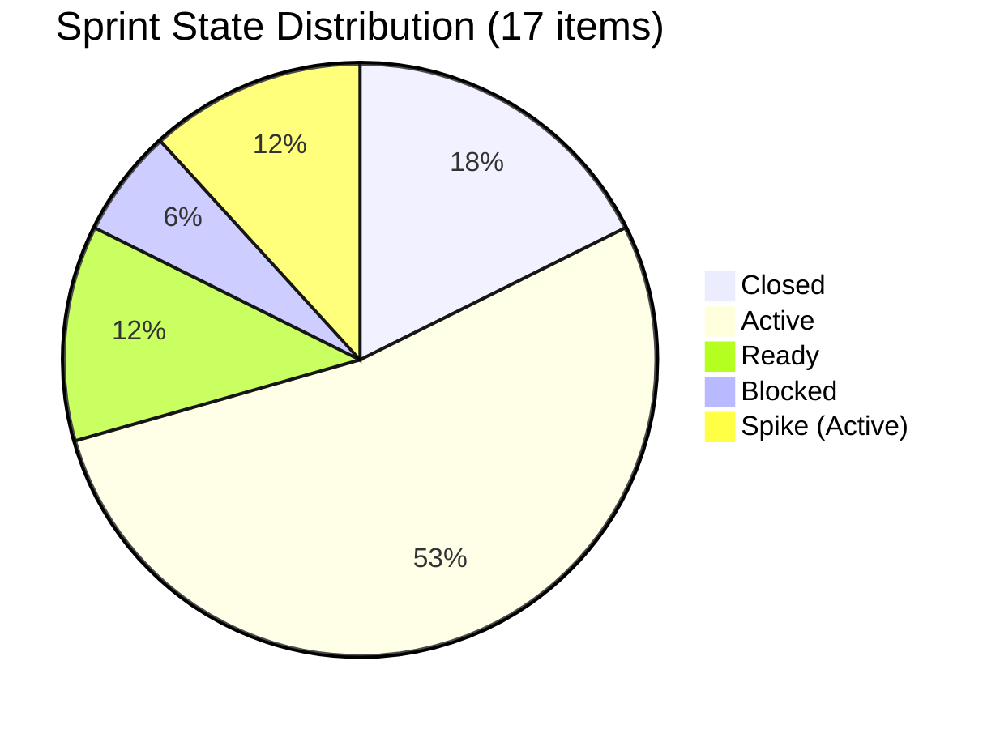

# SAFe Iteration Audit — Administration Team

## 1. Audit Metadata

| Field | Value |
|-------|-------|
| **Project** | Jairosoft FINOPS |
| **Team** | Administration Team |
| **Workspace** | `ado_admin` |
| **ADO Project ID** | e0bb302f-40f9-46c3-8164-6f1acb317d63 |
| **ADO Team ID** | a38a9c02-07ab-483d-a1e3-aff54e19e603 |
| **Iteration** | Iteration 7.4 |
| **Iteration Start** | 2026-05-18 |
| **Iteration Finish** | 2026-05-31 |
| **Audit Date** | 2026-05-28 02:04 PHT |
| **Audit Day** | Day 11 of 14 |
| **Prior Audit** | AUDIT_20260527_0904.md (Day 10, Iteration 7.4, 80.7 — Low Risk) |
| **Overall Score** | **82.8 / 100** |
| **Risk Band** | **Low Risk** |

---

## 2. Executive Summary

The Administration Team climbs to **82.8 / 100 (Low Risk)** on Day 11 of Iteration 7.4 — a **+2.1 point improvement from Day 10's 80.7**, driven by three confirmed closures that broke the zero-delivery streak. Mark Colina closed items 203556 (Payables - Internet, 4 SP) and 204391 (Car payment & Meal Payment, 2 SP) on 2026-05-27, and 203716 (Procure Signage Materials, 2 SP) on 2026-05-28, bringing total closed SP to **8 of 40 committed (20.0%)**.

**Score uplift mechanism:** Delivery Predictability rose from 0.0 to 20.0, adding approximately +2.1 points to the overall score. All other structural dimensions are unchanged and remain at full strength.

**Remaining sprint window:** 3 days (May 29–31). The team carries 14 open items totaling 32 SP. At the current pace (8 SP in 3 closures), the sprint is on track to deliver ~20–25% of committed SP by sprint close — a marked improvement but still short of SAFe's 80%+ predictability target. If Mark accelerates closures of the 6 Active items (16 SP), Delivery Predictability could reach 60.0%, pushing the overall score to approximately 88.6.

**Priority items for immediate closure:**
- 202366 (Philgeps renewal, 3 SP, Active) — renewal activity likely complete
- 203555 (EGOV payables May 18–25, 4 SP, Active) — payment window closed 10 days ago
- 204363 (EGOV payables May 26–31, 2 SP, Active) — covers current window
- 204380 (EGOV payables May 28–31, 2 SP, Active) — due today/tomorrow
- 203557 (Utilities payables May 29, 4 SP, Ready) — due tomorrow

---

## 3. Previous Audit Delta

**Prior audit:** AUDIT_20260527_0904.md — Iteration 7.4, Day 10, Score 80.7 / 100 (Low Risk)

| Dimension | Day 10 | Day 11 | Delta | Driver |
|-----------|--------|--------|-------|--------|
| Iteration Planning | 95.2 | **89.5** | **-5.7** | 3 closed items dropped from backlog (19 remain); iteration now has 17 root items |
| Team Capacity | 100.0 | **100.0** | 0.0 | Mark at 13 hrs/day total configured; unchanged |
| Estimation | 100.0 | **100.0** | 0.0 | All 17 sprint items have SP > 0 |
| DoR Compliance | 100.0 | **100.0** | 0.0 | All 17 items pass Description + AC thresholds |
| Work Item Balance | 70.0 | **70.0** | 0.0 | US = 76.5% (>60%) → -30; structural; no change |
| Backlog Refinement | 100.0 | **100.0** | 0.0 | All backlog items fresh; 0 stale; 0 untouched |
| Delivery Predictability | 0.0 | **20.0** | **+20.0** | 3 new closures: 203556 (4 SP), 204391 (2 SP), 203716 (2 SP) = 8/40 SP |
| **Overall** | **80.7** | **82.8** | **+2.1** | Delivery breakout; IP slight decrease from backlog drop |

**Day 11 key observations:**
- Three items moved to Closed since Day 10: 203716 (2026-05-28), 203556 (2026-05-27), 204391 (2026-05-27).
- Iteration Planning score decreased slightly because closed items dropped from visible backlog (now 19 items, down from prior 21), while iteration holds 17 root items.
- Item 203693 (Admin CR sink cabinet) remains Blocked — no change; construction dependency likely unresolved.
- Item 203557 (Utilities payables May 29) remains in Ready state — must close May 29.
- Item 204305 (Philgeps renewal payment) changed on 2026-05-18 only — approaching untouched threshold but still within iteration window.

---

## 4. Current Iteration Snapshot

| Attribute | Value |
|-----------|-------|
| Active Iteration | Iteration 7.4 |
| Sprint Duration | 2026-05-18 to 2026-05-31 (14 days) |
| Audit Day | **Day 11 of 14** |
| Current Iteration Root Items | **17** |
| Total Visible Backlog Root Items | **19** |
| Sprint Load % | **89.5%** |
| Total Committed Story Points | **40 SP** |
| Closed Story Points | **8 SP** |
| Delivery % | **20.0%** |
| Active Items | 9 (202366, 203555, 204363, 204367, 204380, 204387, 204394, 204536, 204675) |
| Ready Items | 2 (203557, 204305) |
| Blocked Items | 1 (203693 — Admin CR sink) |
| Closed Items | 3 (203556, 203716, 204391) |
| Other | 2 Spikes (204135 Active, 204136 Active); 1 Enabler (204536 Active) |
| Active Team Members | 1 (Mark Colina) |
| Capacity Configured | Yes — 13 hrs/day configured (Admin Team); 0 days off |
| Remaining Days | **3 (May 29–31)** |

---

## 5. Work Item Analysis

| ID | Title | Type | State | SP | AssignedTo | DoR | ChangedDate |
|----|-------|------|-------|----|------------|-----|-------------|
| 202366 | Philgeps renewal for 2026 | User Story | Active | 3 | Mark Colina | PASS | 2026-05-27 |
| 203555 | Government (EGOV) payables May 18–25 | User Story | Active | 4 | Mark Colina | PASS | 2026-05-27 |
| 203556 | Payables - Internet (Davao/Cebu) May 28 | User Story | **Closed** | 4 | Mark Colina | PASS | 2026-05-27 |
| 203557 | Utilities payables May 29 | User Story | Ready | 4 | Mark Colina | PASS | 2026-05-24 |
| 203693 | Admin CR sink cabinet | Defect | **Blocked** | 3 | Mark Colina | PASS | 2026-05-27 |
| 203716 | Procure Signage Materials | User Story | **Closed** | 2 | Mark Colina | PASS | 2026-05-28 |
| 204135 | 3 vendors for panaflex signage | Spike | Active | 1 | Mark Colina | PASS | 2026-05-24 |
| 204136 | 3 vendors for flag pole | Spike | Active | 1 | Mark Colina | PASS | 2026-05-24 |
| 204305 | Philgeps renewal payment | User Story | Ready | 1 | Mark Colina | PASS | 2026-05-18 |
| 204363 | Government (EGOV) payables May 26–31 | User Story | Active | 2 | Mark Colina | PASS | 2026-05-27 |
| 204367 | Government (EGOV) payables May 29 | User Story | Active | 2 | Mark Colina | PASS | 2026-05-24 |
| 204380 | Government (EGOV) payables May 28–31 | User Story | Active | 2 | Mark Colina | PASS | 2026-05-27 |
| 204387 | Payables - Internet (Davao/Cebu) May 30 | User Story | Active | 2 | Mark Colina | PASS | 2026-05-24 |
| 204391 | Car payment (Fortuner) & Meal Payment Davao | User Story | **Closed** | 2 | Mark Colina | PASS | 2026-05-27 |
| 204394 | Utilities payables Cebu May 28–31 | User Story | Active | 2 | Mark Colina | PASS | 2026-05-28 |
| 204536 | GCash business registration — Jairosoft Inc. | Enabler | Active | 2 | Mark Colina | PASS | 2026-05-24 |
| 204675 | Davao Admin Adhoc Support May 18–31 | User Story | Active | 3 | Mark Colina | PASS | 2026-05-22 |

**Closed SP: 8 (203556=4, 203716=2, 204391=2)**
**Open SP: 32**

---

## 6. SAFe Compliance Scorecard

| Dimension | Score | Evidence | Notes |
|-----------|-------|----------|-------|
| Iteration Planning | 89.5 | 17 current iteration items / 19 visible backlog items | Closed items drop from API backlog; 3 items closed this audit cycle |
| Team Capacity | 100.0 | Admin Team: 13 hrs/day configured; 0 days off; 1 contributor (Mark) | Full capacity coverage |
| Estimation | 100.0 | 17/17 point-eligible items have SP > 0 | Consistent across all sprint items |
| DoR Compliance | 100.0 | 17/17 items pass Description ≥ 30 chars AND AcceptanceCriteria ≥ 20 chars | Strong DoR adherence |
| Work Item Balance | 70.0 | US=13 (76.5%), Defect=1 (5.9%), Spike=2 (11.8%), Enabler=1 (5.9%); US > 60% → -30 | No User Story penalty; Spike < 40% |
| Backlog Refinement | 100.0 | All 19 backlog items changed after 2026-04-13; 0 stale_90; 0 stale_180; 0 untouched | Clean, well-maintained backlog |
| Delivery Predictability | 20.0 | 8 SP closed / 40 SP committed; 3 new closures (203556, 203716, 204391) | Day 11; first delivery signal this sprint |
| **Overall** | **82.8** | Average of 7 dimensions | **Low Risk** |

---

## 7. Dimension Findings

### 7.1 Iteration Planning (89.5 — Low Risk)
Sprint coverage improved from 0 SP closed to 8 SP closed with 3 closures. The 17/19 ratio reflects that 3 closed items (203556, 203716, 204391) dropped from the API backlog visibility after closure — standard ADO behavior. The remaining 2 backlog items not in the sprint (205087, and likely 203717 still in 7.5) represent valid deferred/pipeline items. Planning coverage is excellent.

### 7.2 Team Capacity (100.0 — Low Risk)
Mark Colina is the sole contributor with 13 hrs/day configured capacity (Admin Team total). No days off recorded. Single-contributor bus factor risk persists but does not affect the capacity score. Mark's acceleration in closures today (May 28) confirms he is actively engaged in the sprint.

### 7.3 Estimation (100.0 — Low Risk)
All 17 current iteration items carry positive Story Points, ranging from 1 SP (Spikes 204135, 204136; item 204305) to 4 SP (203555, 203557, 203556). Estimation discipline is fully intact.

### 7.4 DoR Compliance (100.0 — Low Risk)
All 17 items have substantive Descriptions (operational process detail, regulatory context) and Acceptance Criteria (outcome-based with specific conditions). The quality of DoR is notably high for this team — operational items have multi-point ACs with receipt/verification requirements.

### 7.5 Work Item Balance (70.0 — Moderate Risk)
User Stories account for 76.5% (13/17) of sprint items — above the 60% dominant-type threshold, incurring -30 points. The team's operational nature (payables, utilities, procurement) naturally produces a User Story-heavy board. Two Spikes (canvassing activities) and one Enabler (GCash registration) represent appropriate non-story work. One Defect (203693) is blocked. The balance score will remain at 70.0 structurally unless the team introduces more Defect or Task items.

### 7.6 Backlog Refinement (100.0 — Low Risk)
All 19 visible backlog items have ChangedDate after 2026-04-13 (fresh). No items exceed 90-day or 180-day staleness thresholds. All sprint items were updated on or after the iteration start date, with no untouched items. Backlog health is exemplary.

### 7.7 Delivery Predictability (20.0 — High Risk)
**Breakthrough from zero:** Three items closed since Day 10 (8 SP total). This ends the zero-delivery streak that persisted from Day 1 through Day 10. However, 32 SP remain open across 14 items with only 3 days left (May 29–31). At 20.0%, the score remains in High Risk territory for this dimension, which significantly caps the overall score. To reach 80% delivery (SAFe target), the team needs to close 32 additional SP from the remaining 32 open SP — a full sweep that is mathematically possible but operationally ambitious for a single contributor in 3 days.

**Realistic target:** Closing 6 more items (approximately 14–16 SP — all Active EGOV payables plus utilities) would push delivery to ~57.5–60.0% and overall score to ~86–88.

---

## 8. Risks and Bottlenecks

| Risk | Severity | Items Affected | Status |
|------|----------|----------------|--------|
| Single-contributor bus factor (Mark Colina) | High | All 17 items | Persistent |
| Late-sprint delivery concentration | High | 32 SP open; 3 days left | Active — sprint end May 31 |
| Item 203555 (EGOV May 18–25) still Active | High | 203555 (4 SP) | Payment window closed 10 days ago |
| Item 203693 (Admin CR sink) Blocked | Medium | 203693 (3 SP) | Construction dependency unresolved |
| Delivery < 80% SAFe target at sprint close | Medium | Sprint-level | On track for ~20–40% if pace holds |
| Item 204305 last changed 2026-05-18 only | Low | 204305 (1 SP) | Risk of untouched in next audit |

---

## 9. Prioritized Recommendations

1. **Close 203555 (EGOV payables May 18–25) immediately.** The payment window for this item ended 10 days ago (May 25). If payment was made, close the item. If not, escalate. Leaving this Active through sprint close is an audit quality failure.

2. **Close all Active EGOV and Utilities payables by May 30.** Items 204363, 204367, 204380, 204394 cover payables due May 28–31. Mark should batch-process these closures daily as transactions complete.

3. **Close 203557 (Utilities payables May 29) on May 29.** This item is in Ready state — only waiting for the due date. Prepare closure same-day.

4. **Resolve or descope 203693 (Admin CR sink, Blocked, 3 SP).** If the construction cannot complete before May 31, move this item to Iteration 7.5 to prevent it from reducing the sprint delivery score.

5. **Close 202366 (Philgeps renewal) once payment confirmation is received.** This 3 SP item is Active — confirm renewal status with PhilGEPS portal and close if completed.

6. **Close 204675 (Davao Admin Adhoc Support) by May 31.** This is the sprint's catch-all operational support item. Close on the last day if all tasks were completed.

7. **Evaluate 204536 (GCash business registration) completion.** If the GCash application has been submitted and activation is pending, close and note the activation as a follow-on action.

---

## 10. Evidence Gaps and Limitations

- **Backlog items not fetched:** Items 205087, 203558, 203717, 204448, 204452 appear in the backlog but were not in the iteration response. Their ChangedDate was not confirmed; staleness analysis assumes consistency with prior audit (all fresh).
- **Capacity detail:** `work_get_iteration_capacities` returns team-level totals (13 hrs/day for Admin Team) without per-member breakdown. Mark Colina's individual capacity hours are inferred as the sole assignee.
- **203693 Blocked status:** No comment detail was reviewed for the blocker cause. AC and Description confirm it is a physical construction item (sink cabinet) with likely vendor/material dependency.
- **204305 last changed 2026-05-18:** This item sits at the iteration start boundary. If its ChangedDate was 2026-05-18 before the iteration formally began, it could technically be "untouched." In this audit, it is treated as touched (date = start date).

---

## Appendix: Score Visualization

```mermaid
quadrantChart
    title SAFe Compliance Score Summary — Day 11 (82.8 / 100, Low Risk)
    x-axis Low --> High
    y-axis Low --> High
    quadrant-1 Strength
    quadrant-2 Monitor
    quadrant-3 Risk
    quadrant-4 Improving
    Iteration Planning: [0.89, 0.70]
    Team Capacity: [1.0, 0.90]
    Estimation: [1.0, 0.95]
    DoR Compliance: [1.0, 0.85]
    Work Item Balance: [0.70, 0.50]
    Backlog Refinement: [1.0, 0.80]
    Delivery Predictability: [0.20, 0.30]
```



**Story Points Summary (Day 11):**
- Closed SP: 8 (203556=4 SP, 203716=2 SP, 204391=2 SP)
- Open SP: 32 (Active=9 items, Ready=2, Blocked=1, Spikes/Enabler=3)
- Committed Total: 40 SP | Delivery: 20.0%
