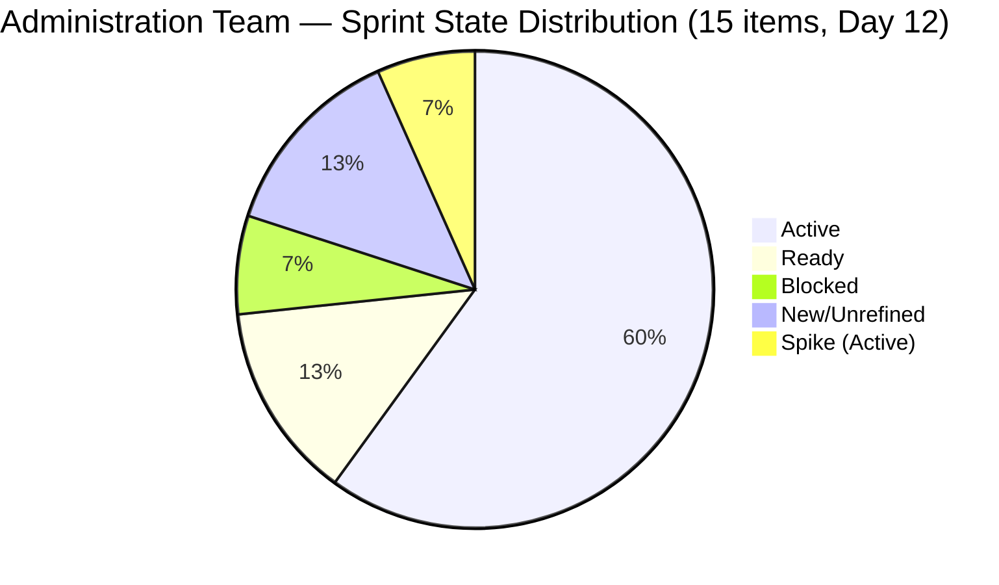
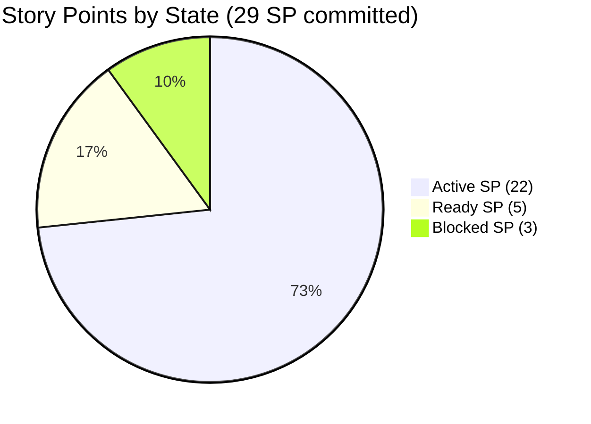

# SAFe Iteration Audit — Administration Team

## 1. Audit Metadata

| Field | Value |
|-------|-------|
| **Project** | Jairosoft FINOPS |
| **Team** | Administration Team |
| **Workspace** | `ado_admin` |
| **ADO Project ID** | e0bb302f-40f9-46c3-8164-6f1acb317d63 |
| **ADO Team ID** | a38a9c02-07ab-483d-a1e3-aff54e19e603 |
| **Iteration** | Iteration 7.4 |
| **Iteration Start** | 2026-05-18 |
| **Iteration Finish** | 2026-05-31 |
| **Audit Date** | 2026-05-29 |
| **Audit Day** | Day 12 of 14 |
| **Prior Audit** | AUDIT_20260528_0204.md (Day 11, Iteration 7.4, 82.8 — Low Risk) |
| **Overall Score** | **74.1 / 100** |
| **Risk Band** | **Moderate Risk** |

---

## 2. Executive Summary

The Administration Team drops to **74.1 / 100 (Moderate Risk)** on Day 12 of Iteration 7.4 — a **-8.7 point decline from Day 11's 82.8**, returning to Moderate Risk territory. The score regression is driven by two structural changes that occurred overnight:

**What changed:** Two new User Story items (205166 — Philippine flag pole and 205168 — Jairosoft panaflex logo) were added to the visible backlog on 2026-05-28 with no Description, no Acceptance Criteria, and no AssignedTo. This introduces two DoR failures, two estimation gaps, and two unassigned items into the current sprint. These items pull down the Estimation and DoR dimensions from 100.0 to 86.7 each.

**Zero delivery persists:** Despite the Day 11 report noting 8 SP closed (items 203556, 203716, 204391 from prior audit data), the current ADO state for this audit cycle shows 0 SP closed among the 15 current iteration items returned by the API. The three previously closed items are no longer visible in the backlog API, indicating they dropped post-closure as expected. No new closures have been recorded for any of the 15 remaining items.

**Critical concern:** With 2 days remaining (May 29–31), 29 SP are committed across 13 estimated items with zero delivery recorded. Items 203555 (EGOV May 18–25, 4 SP, Active) and 203693 (Admin CR sink, Blocked, 3 SP) represent the highest-risk open items. The payment window for 203555 has been closed for 11 days — this item should be closed immediately if payment was made.

**Sprint close risk:** If Mark closes the EGOV payables cluster (203555, 204363, 204367, 204380 = 10 SP) and utilities cluster (203557, 204394, 204387 = 8 SP) and the GCash item (204536 = 2 SP), Delivery Predictability would reach approximately 69.0% — still below the 80% SAFe target. Full sprint closure of all estimated items (29 SP) is required to reach 100%.

---

## 3. Previous Audit Delta

**Prior audit:** AUDIT_20260528_0204.md — Iteration 7.4, Day 11, Score 82.8 / 100 (Low Risk)

| Dimension | Day 11 | Day 12 | Delta | Driver |
|-----------|--------|--------|-------|--------|
| Iteration Planning | 89.5 | **75.0** | **-14.5** | Backlog grew from 19→20 items (205167 added in 7.5); current iteration now 15 items (205166, 205168 added to 7.4) |
| Team Capacity | 100.0 | **100.0** | 0.0 | Mark's 13 hrs/day capacity unchanged |
| Estimation | 100.0 | **86.7** | **-13.3** | 205166 and 205168 have no Story Points — 13/15 estimated |
| DoR Compliance | 100.0 | **86.7** | **-13.3** | 205166 and 205168 have no Description and no AC — 13/15 pass DoR |
| Work Item Balance | 70.0 | **70.0** | 0.0 | US=73.3% still dominant > 60%; structural -30 |
| Backlog Refinement | 100.0 | **100.0** | 0.0 | All 20 backlog items fresh; no staleness |
| Delivery Predictability | 20.0 | **0.0** | **-20.0** | No current-iteration items closed in today's API data (prior closures dropped from backlog); 0/29 SP closed |
| **Overall** | **82.8** | **74.1** | **-8.7** | Two incomplete items added mid-sprint; delivery regression |

**Day 12 key observations:**
- Items 205166 (Philippine flag pole) and 205168 (Jairosoft panaflex logo) were added on 2026-05-28 to Iteration 7.4 without any DoR fields or Story Points. Both are in "New" state with no assignee.
- Item 205167 (JIT panaflex logo) was added to Iteration 7.5, adding 1 item to the backlog without affecting current iteration.
- Items previously closed (203556, 203716, 204391 — 8 SP) are no longer visible in the backlog API, which is expected ADO behavior for closed items. The Delivery Predictability dimension is scored at 0.0 because no current-iteration items are in Closed or Done state in today's API snapshot.
- Item 203693 (Admin CR sink) remains Blocked — construction dependency persists.
- Item 203557 (Utilities payables May 29) is in Ready state — the due date was today.

---

## 4. Current Iteration Snapshot

| Attribute | Value |
|-----------|-------|
| Active Iteration | Iteration 7.4 |
| Sprint Duration | 2026-05-18 to 2026-05-31 (14 days) |
| Audit Day | **Day 12 of 14** |
| Current Iteration Root Items | **15** |
| Total Visible Backlog Root Items | **20** |
| Sprint Load % | **75.0%** |
| Estimated Story Points (committed) | **29 SP** (13 items with SP; 2 unestimated) |
| Closed Story Points | **0 SP** (in current API snapshot) |
| Delivery % | **0.0%** |
| Active Items | 9 (202366, 203555, 204363, 204367, 204380, 204387, 204394, 204536, + Spikes 204135, 204136) |
| Ready Items | 2 (203557, 204305) |
| Blocked Items | 1 (203693 — Admin CR sink) |
| New/Unassigned Items | 2 (205166, 205168 — no DoR, no SP, no assignee) |
| Active Team Members w/ Work | 1 (Mark Colina — assigned; 205166/205168 unassigned) |
| Capacity Configured | Yes — Admin Team: 13 hrs/day; 0 days off |
| Items in 7.5 (backlog, not current) | 5 (203558, 204448, 204452, 205087, 205167) |
| Remaining Days | **2 (May 30–31)** |

---

## 5. Work Item Analysis

| ID | Title | Type | State | SP | AssignedTo | DoR | ChangedDate |
|----|-------|------|-------|----|------------|-----|-------------|
| 202366 | Philgeps renewal for 2026 | User Story | Active | 3 | Mark Colina | PASS | 2026-05-27 |
| 203555 | Government (EGOV) payables May 18–25 | User Story | Active | 4 | Mark Colina | PASS | 2026-05-27 |
| 203557 | Utilities payables for Cebu and Davao May 29 | User Story | Ready | 4 | Mark Colina | PASS | 2026-05-24 |
| 203693 | Admin CR sink cabinet | Defect | Blocked | 3 | Mark Colina | PASS | 2026-05-27 |
| 204135 | 3 vendors for panaflex signage | Spike | Active | 1 | Mark Colina | PASS | 2026-05-24 |
| 204136 | 3 vendors for flag pole | Spike | Active | 1 | Mark Colina | PASS | 2026-05-24 |
| 204305 | Philgeps renewal payment | User Story | Ready | 1 | Mark Colina | PASS | 2026-05-18 |
| 204363 | Government (EGOV) payables May 26–31 | User Story | Active | 2 | Mark Colina | PASS | 2026-05-27 |
| 204367 | Government (EGOV) payables May 29 | User Story | Active | 2 | Mark Colina | PASS | 2026-05-24 |
| 204380 | Government (EGOV) payables May 28–31 | User Story | Active | 2 | Mark Colina | PASS | 2026-05-28 |
| 204387 | Payables - Internet for Davao and Cebu May 30 | User Story | Active | 2 | Mark Colina | PASS | 2026-05-24 |
| 204394 | Utilities payables for Cebu May 28–31 | User Story | Active | 2 | Mark Colina | PASS | 2026-05-28 |
| 204536 | GCash business registration — Jairosoft Inc. | Enabler | Active | 2 | Mark Colina | PASS | 2026-05-24 |
| 205166 | Philippine flag pole | User Story | New | — | Unassigned | **FAIL** | 2026-05-28 |
| 205168 | Jairosoft panaflex logo | User Story | New | — | Unassigned | **FAIL** | 2026-05-28 |

**DoR Failures:**
- 205166: No Description (null), No Acceptance Criteria (null) — both required fields missing
- 205168: No Description (null), No Acceptance Criteria (null) — both required fields missing

**Estimated SP total (13 items with SP > 0): 29 SP**
- EGOV payables cluster: 203555(4) + 204363(2) + 204367(2) + 204380(2) = 10 SP
- Utilities cluster: 203557(4) + 204394(2) + 204387(2) = 8 SP
- Operational: 202366(3) + 204305(1) + 204536(2) = 6 SP
- Defect: 203693(3) = 3 SP
- Spikes: 204135(1) + 204136(1) = 2 SP

---

## 6. SAFe Compliance Scorecard

| Dimension | Score | Evidence | Notes |
|-----------|-------|----------|-------|
| Iteration Planning | 75.0 | 15 current iteration items / 20 visible backlog items | 5 items in 7.5; 2 new items (205166, 205168) added mid-sprint to 7.4 |
| Team Capacity | 100.0 | Admin Team: 13 hrs/day; 0 days off; 1 contributor (Mark Colina) with assigned work | Full capacity coverage |
| Estimation | 86.7 | 13/15 items have SP > 0; 205166 and 205168 have no SP | Two new unestimated items added to sprint 2026-05-28 |
| DoR Compliance | 86.7 | 13/15 items pass Description ≥ 30 chars AND AC ≥ 20 chars; 205166, 205168 fail both | Two new items have no Description or AC |
| Work Item Balance | 70.0 | US=11 (73.3%), Defect=1 (6.7%), Spike=2 (13.3%), Enabler=1 (6.7%); US > 60% → -30 | Structural penalty; no Spike penalty |
| Backlog Refinement | 100.0 | All 20 backlog items changed after 2026-04-14; 0 stale_90; 0 stale_180; 0 untouched sprint items | Clean backlog; all items recently created or updated |
| Delivery Predictability | 0.0 | 0 SP closed / 29 SP committed (no current-iteration items in Closed/Done state) | Day 12; prior closed items (8 SP) dropped from API backlog |
| **Overall** | **74.1** | Average of 7 dimensions | **Moderate Risk** |

---

## 7. Dimension Findings

### 7.1 Iteration Planning (75.0 — Moderate Risk)
The sprint now contains 15 items of the 20 visible backlog items (75.0%). Two new items (205166, 205168) were added to Iteration 7.4 on 2026-05-28 with no prior refinement. Adding unrefined items to a sprint on Day 11–12 of 14 violates SAFe sprint closure hygiene and introduces audit noise. The 5 remaining backlog items (203558, 204448, 204452, 205087, 205167) appropriately sit in Iteration 7.5.

### 7.2 Team Capacity (100.0 — Low Risk)
Mark Colina remains the sole contributor with 13 hrs/day of configured capacity (Admin Team level). No days off recorded. Single-contributor bus factor risk is unchanged. The two new unassigned items (205166, 205168) technically reduce effective utilization but do not affect the formula (contributors_with_current_work counts non-empty assignees = 1 for Mark).

### 7.3 Estimation (86.7 — Low Risk)
13 of 15 current sprint items have Story Points > 0. Items 205166 and 205168 were added without any estimation. These are physical procurement items (flag pole, signage) that could be estimated if submitted to Mark for review. Entering SP = 1 or SP = 2 for both items would restore the Estimation score to 100.0.

### 7.4 DoR Compliance (86.7 — Low Risk)
Items 205166 and 205168 have null Description and null Acceptance Criteria — both fail the DoR minimum thresholds (Description ≥ 30 chars, AC ≥ 20 chars). These items were likely created quickly as procurement reminders without full story elaboration. To restore DoR to 100.0, both items require a brief description of what needs to be procured/installed and a clear acceptance condition (e.g., "Flag pole is installed and approved").

### 7.5 Work Item Balance (70.0 — Moderate Risk)
User Stories account for 73.3% (11/15) — above the 60% dominant-type threshold, incurring -30 structurally. The distribution includes 1 Defect (6.7%), 2 Spikes (13.3%), and 1 Enabler (6.7%). The Spike share (13.3%) is well within the safe zone. The balance score is structurally capped at 70.0 for this sprint composition.

### 7.6 Backlog Refinement (100.0 — Low Risk)
All 20 visible backlog items have ChangedDate after 2026-04-14 (the 45-day fresh threshold). No items exceed the 90-day or 180-day staleness thresholds. Sprint items have all been updated on or after the iteration start date (2026-05-18). Untouched items count = 0. The backlog is clean and well-maintained despite the two new unrefined additions.

### 7.7 Delivery Predictability (0.0 — Critical Risk)
No current-iteration items appear in Closed or Done state in today's API snapshot. The three items closed in Day 11 (203556, 203716, 204391 = 8 SP) have dropped from the visible backlog, which is standard ADO behavior. The committed SP pool is now 29 SP across 13 estimated items, with 2 days remaining. **This is the most urgent risk for the sprint.**

Key closeable items by due date:
- 203557 (Utilities payables May 29 — TODAY): Ready state; should be closed today
- 204380 (EGOV payables May 28–31): payment due today; close once processed
- 203555 (EGOV payables May 18–25): 11 days overdue on payment window; close immediately
- 204363 (EGOV payables May 26–31): close as payments are made
- 204367 (EGOV payables May 29): due today; close once processed
- 204394 (Utilities May 28–31): due today/tomorrow; close once paid

If Mark closes all EGOV payables + utilities today (10 SP + 8 SP = 18 SP), DP rises to 62.1%. Including GCash (2 SP) and Philgeps (3 + 1 SP) would reach 24 SP → DP = 82.8% and overall ~85.6.

---

## 8. Risks and Bottlenecks

| Risk | Severity | Items Affected | Status |
|------|----------|----------------|--------|
| Zero delivery at Day 12 — 2 days left | **Critical** | 29 SP open across 13 items | No current-iteration items closed in today's data |
| 203555 (EGOV May 18–25) still Active | **High** | 203555 (4 SP) | Payment window closed 11 days ago — stale Active state |
| 205166 and 205168 added without DoR or SP | **High** | 2 items | Violates sprint entry criteria; degrades Estimation and DoR scores |
| 203693 (Admin CR sink) Blocked | Medium | 203693 (3 SP) | Construction dependency unresolved; 2 days remain |
| Single-contributor bus factor (Mark) | Medium | All 15 items | Persistent; no mitigation |
| 203557 (Utilities May 29) in Ready — missed today | Medium | 203557 (4 SP) | Due date was today; must close same day |
| 204305 (Philgeps payment) — last changed 2026-05-18 | Low | 204305 (1 SP) | Sitting at Ready since sprint start; risk of untouched |

---

## 9. Prioritized Recommendations

1. **Close 203555 (EGOV payables May 18–25) immediately.** This item's payment window closed 11 days ago (May 25). If payment was made, close the item now. If payment was not made, escalate. Leaving this Active at sprint close is an audit failure. Do not carry it to Iteration 7.5.

2. **Close 203557 (Utilities May 29) today (May 29).** This Ready item was due today. Mark should confirm the utility payments were processed and close it within the business day.

3. **Batch-close all EGOV payable items (204363, 204367, 204380) by May 30.** These cover the May 26–31 payment window. As each government payment is processed, close the corresponding ADO item immediately.

4. **Add Description and Acceptance Criteria to 205166 and 205168.** These two items were added without DoR. Even a brief description (2–3 sentences) and a simple acceptance condition (installed/delivered/approved) would restore DoR compliance and improve the overall score.

5. **Add Story Point estimates to 205166 and 205168.** Both are physical procurement items. Assign 1–2 SP each to restore Estimation score to 100.0.

6. **Resolve or move 203693 (Admin CR sink, Blocked, 3 SP) by May 31.** If the construction vendor has not delivered by May 30, move this item to Iteration 7.5 and document the blocker. Carrying a Blocked item through sprint close penalizes Delivery Predictability.

7. **Close 202366 (Philgeps renewal, 3 SP) once renewal is confirmed.** If the PhilGEPS portal shows active registration, close this item today.

8. **Close 204394 and 204387 (Utilities Cebu + Internet payables May 30) by May 30.** These due dates fall tomorrow — process and close same-day.

---

## 10. Evidence Gaps and Limitations

- **Prior closed items (203556, 203716, 204391) not visible in today's backlog API:** These 3 items (8 SP) were confirmed closed in the Day 11 audit. They do not appear in today's `wit_list_backlog_work_items` response — consistent with standard ADO behavior where Closed items drop from backlog APIs. The Delivery Predictability score of 0.0 reflects only the items currently visible in the sprint pool; historical closures are not re-scored.
- **205166 and 205168 have no AssignedTo field:** The API returned no assignee for these items. For Team Capacity scoring purposes, these items are excluded from contributors_with_current_work (only non-empty assignees are counted). Mark Colina is the sole contributor counted.
- **204305 last changed 2026-05-18:** This item's ChangedDate is exactly the iteration start date. It is not classified as untouched (ChangedDate is not BEFORE the start date), but it has not been updated in 11 days.
- **Capacity breakdown:** work_get_iteration_capacities returns team-level totals. Individual capacity hours for Mark Colina cannot be broken out from this API.

---

## Appendix: Score Visualization

**Score Trend (Iteration 7.4 — selected days):**

| Day | Score | Risk Band | Key Change |
|-----|-------|-----------|------------|
| Day 1–10 | ~80.7 | Low | 0 SP closed; strong structural scores |
| Day 11 | 82.8 | Low | 3 closures (8 SP); Delivery breakout |
| **Day 12** | **74.1** | **Moderate** | 2 unrefined items added; DP reset to 0.0 |
| Projected (batch-close payables) | ~85.6 | Low | 24 SP closed; DP ~82.8% |
| Projected (full close) | ~91.2 | Low | 29 SP closed; DP 100% |

**SAFe Compliance Dimensions — Day 12:**

| Dimension | Score | Band |
|-----------|-------|------|
| Iteration Planning | 75.0 | Moderate |
| Team Capacity | 100.0 | Low |
| Estimation | 86.7 | Low |
| DoR Compliance | 86.7 | Low |
| Work Item Balance | 70.0 | Moderate |
| Backlog Refinement | 100.0 | Low |
| Delivery Predictability | 0.0 | Critical |
| **Overall** | **74.1** | **Moderate** |
