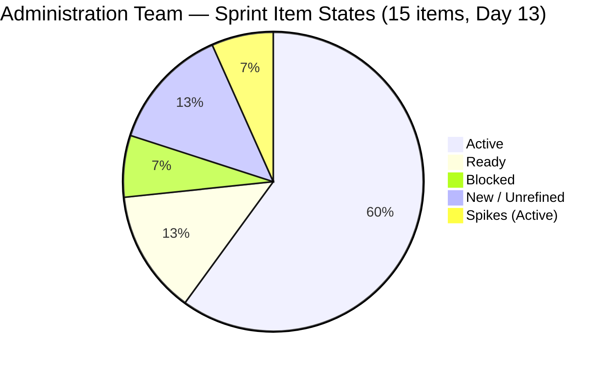
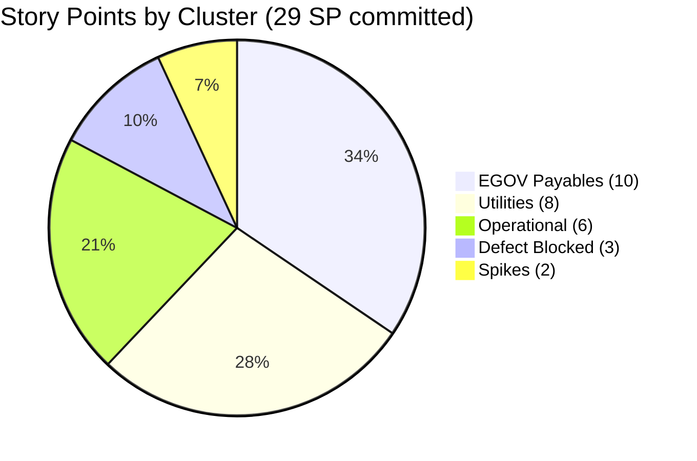

# SAFe Iteration Audit — Administration Team

## 1. Audit Metadata

| Field | Value |
|-------|-------|
| **Project** | Jairosoft FINOPS |
| **Team** | Administration Team |
| **Workspace** | `ado_admin` |
| **ADO Project ID** | e0bb302f-40f9-46c3-8164-6f1acb317d63 |
| **ADO Team ID** | a38a9c02-07ab-483d-a1e3-aff54e19e603 |
| **Iteration** | Iteration 7.4 |
| **Iteration Start** | 2026-05-18 |
| **Iteration Finish** | 2026-05-31 |
| **Audit Date** | 2026-05-30 |
| **Audit Day** | Day 13 of 14 |
| **Prior Audit** | AUDIT_20260529_0900.md (Day 12, Iteration 7.4, 74.1 — Moderate Risk) |
| **Overall Score** | **74.1 / 100** |
| **Risk Band** | **Moderate Risk** |

---

## 2. Executive Summary

The Administration Team holds at **74.1 / 100 (Moderate Risk)** on Day 13 of Iteration 7.4 — **unchanged from yesterday's score**, with no dimension movements across the seven rubric areas. The sprint structure is identical to Day 12: 15 items in the current iteration, all backlog items fresh, Mark Colina as sole contributor with full capacity configured, and zero story points closed in the current API snapshot.

**Critical sprint-close risk:** With only 1 day remaining (May 31), 29 SP remain uncommitted across 13 estimated items. The Delivery Predictability dimension is at 0.0 — the lowest-scoring dimension and the only one in Critical territory. This sprint will close at 0.0 Delivery Predictability unless Mark closes items today.

**No structural changes since Day 12:**
- Items 205166 (Philippine flag pole) and 205168 (Jairosoft panaflex logo) remain in "New" state with no Description, no Acceptance Criteria, no Story Points, and no assignee — the same DoR failures documented since they were added on May 28.
- Item 203693 (Admin CR sink, Blocked, 3 SP) remains blocked — the construction vendor dependency is unresolved with one day left.
- Item 203557 (Utilities payables May 29, Ready, 4 SP) was due yesterday — if payment was processed, it should have been closed by now.
- Item 203555 (EGOV payables May 18–25, Active, 4 SP) is now 12 days past its payment window close date. If payment was processed, this item is critically overdue for closure.

**Projected recovery:** If Mark closes all EGOV payables (204363, 204367, 204380, 203555 = 10 SP), utilities (203557, 204394, 204387 = 8 SP), GCash (204536 = 2 SP), and Philgeps (202366, 204305 = 4 SP) today, DP would reach 24/29 = 82.8% and the overall score would rise to approximately 85.6 (Low Risk). Full closure of all 29 SP would yield DP 100% and overall ~91.2.

---

## 3. Previous Audit Delta

**Prior audit:** AUDIT_20260529_0900.md — Iteration 7.4, Day 12, Score 74.1 / 100 (Moderate Risk)

| Dimension | Day 12 | Day 13 | Delta | Driver |
|-----------|--------|--------|-------|--------|
| Iteration Planning | 75.0 | **75.0** | 0.0 | No backlog changes; 15/20 items unchanged |
| Team Capacity | 100.0 | **100.0** | 0.0 | Mark's 13 hrs/day capacity unchanged |
| Estimation | 86.7 | **86.7** | 0.0 | 205166 and 205168 still unestimated |
| DoR Compliance | 86.7 | **86.7** | 0.0 | 205166 and 205168 still missing Description and AC |
| Work Item Balance | 70.0 | **70.0** | 0.0 | US dominance (11/15 = 73.3%) unchanged |
| Backlog Refinement | 100.0 | **100.0** | 0.0 | All 20 items fresh; no staleness changes |
| Delivery Predictability | 0.0 | **0.0** | 0.0 | No closures recorded; 0/29 SP |
| **Overall** | **74.1** | **74.1** | **0.0** | No structural changes overnight |

**Day 13 key observations:**
- No items were added, removed, or transitioned in state since yesterday's audit.
- Items 203557 (Utilities May 29) and 204367 (EGOV May 29) have passed their stated due dates with no closure.
- Item 203555 (EGOV May 18–25) remains Active — 12 days past payment window close. This is the most time-sensitive stale item.
- All sprint items last changed between 2026-05-18 and 2026-05-28. No changes recorded today.

---

## 4. Current Iteration Snapshot

| Attribute | Value |
|-----------|-------|
| Active Iteration | Iteration 7.4 |
| Sprint Duration | 2026-05-18 to 2026-05-31 (14 days) |
| Audit Day | **Day 13 of 14** |
| Current Iteration Root Items | **15** |
| Total Visible Backlog Root Items | **20** |
| Sprint Load % | **75.0%** |
| Estimated Story Points (committed) | **29 SP** (13 items with SP; 2 unestimated) |
| Closed Story Points | **0 SP** |
| Delivery % | **0.0%** |
| Active Items | 9 (202366, 203555, 204363, 204367, 204380, 204387, 204394, 204536, 204135, 204136) |
| Ready Items | 2 (203557, 204305) |
| Blocked Items | 1 (203693 — Admin CR sink) |
| New/Unassigned Items | 2 (205166, 205168 — no DoR, no SP, no assignee) |
| Active Team Members w/ Work | 1 (Mark Colina) |
| Capacity Configured | Yes — Admin Team: 13 hrs/day; 0 days off |
| Items in 7.5 (backlog) | 5 (203558, 204448, 204452, 205087, 205167) |
| Remaining Days | **1 (May 31)** |

---

## 5. Work Item Analysis

| ID | Title | Type | State | SP | AssignedTo | DoR | ChangedDate |
|----|-------|------|-------|----|------------|-----|-------------|
| 202366 | Philgeps renewal for 2026 | User Story | Active | 3 | Mark Colina | PASS | 2026-05-27 |
| 203555 | Government (EGOV) payables May 18–25, 2026 | User Story | Active | 4 | Mark Colina | PASS | 2026-05-27 |
| 203557 | Utilities payables for Cebu and Davao May 29, 2026 | User Story | Ready | 4 | Mark Colina | PASS | 2026-05-24 |
| 203693 | Admin CR sink cabinet | Defect | Blocked | 3 | Mark Colina | PASS | 2026-05-27 |
| 204135 | 3 vendors for panaflex signage | Spike | Active | 1 | Mark Colina | PASS | 2026-05-24 |
| 204136 | 3 vendors for flag pole | Spike | Active | 1 | Mark Colina | PASS | 2026-05-24 |
| 204305 | Philgeps renewal payment | User Story | Ready | 1 | Mark Colina | PASS | 2026-05-18 |
| 204363 | Government (EGOV) payables May 26–31, 2026 | User Story | Active | 2 | Mark Colina | PASS | 2026-05-27 |
| 204367 | Government (EGOV) payables May 29, 2026 | User Story | Active | 2 | Mark Colina | PASS | 2026-05-24 |
| 204380 | Government (EGOV) payables May 28–31, 2026 | User Story | Active | 2 | Mark Colina | PASS | 2026-05-27 |
| 204387 | Payables — Internet for Davao and Cebu office May 30, 2026 | User Story | Active | 2 | Mark Colina | PASS | 2026-05-24 |
| 204394 | Utilities payables for Cebu May 28–31, 2026 | User Story | Active | 2 | Mark Colina | PASS | 2026-05-28 |
| 204536 | Gcash business registration for Jairosoft Inc. | Enabler | Active | 2 | Mark Colina | PASS | 2026-05-24 |
| 205166 | Philippine flag pole | User Story | New | — | Unassigned | **FAIL** | 2026-05-28 |
| 205168 | Jairosoft panaflex logo | User Story | New | — | Unassigned | **FAIL** | 2026-05-28 |

**DoR Failures:**
- 205166: No Description, No Acceptance Criteria — both null
- 205168: No Description, No Acceptance Criteria — both null

**Estimated SP total (13 items): 29 SP**
- EGOV payables: 203555(4) + 204363(2) + 204367(2) + 204380(2) = 10 SP
- Utilities: 203557(4) + 204394(2) + 204387(2) = 8 SP
- Operational: 202366(3) + 204305(1) + 204536(2) = 6 SP
- Defect: 203693(3) = 3 SP
- Spikes: 204135(1) + 204136(1) = 2 SP

---

## 6. SAFe Compliance Scorecard

| Dimension | Score | Evidence | Notes |
|-----------|-------|----------|-------|
| Iteration Planning | 75.0 | 15 current iteration items / 20 visible backlog items | 5 items in 7.5; 2 unrefined items (205166, 205168) in 7.4 |
| Team Capacity | 100.0 | Admin Team: 13 hrs/day; 0 days off; 1 contributor (Mark Colina) | Full capacity coverage; bus factor 1 persists |
| Estimation | 86.7 | 13/15 items have SP > 0; 205166 and 205168 unestimated | Two mid-sprint additions without Story Points |
| DoR Compliance | 86.7 | 13/15 items pass Description ≥ 30 chars AND AC ≥ 20 chars | 205166 and 205168 fail both fields |
| Work Item Balance | 70.0 | US=11/15 (73.3%) > 60% → -30 penalty | Structural cap; no Spike penalty (13.3%) |
| Backlog Refinement | 100.0 | All 20 items changed after 2026-04-15; 0 stale_90; 0 stale_180; 0 untouched | Clean backlog; 204305 last changed on start date (not before) |
| Delivery Predictability | 0.0 | 0 SP closed / 29 SP committed | Day 13; no closures in API; 1 day remaining |
| **Overall** | **74.1** | Average of 7 dimensions | **Moderate Risk** |

---

## 7. Dimension Findings

### 7.1 Iteration Planning (75.0 — Moderate Risk)
The sprint contains 15 of the 20 visible backlog items (75.0%). This ratio is unchanged from Day 12. The five items in Iteration 7.5 (203558, 204448, 204452, 205087, 205167) are correctly placed outside the active sprint. No new items were added to or removed from the current iteration today.

### 7.2 Team Capacity (100.0 — Low Risk)
Mark Colina remains the sole contributor with 13 hrs/day of configured capacity. No days off recorded for the iteration. The two unassigned items (205166, 205168) do not affect the formula since contributors_with_current_work counts only non-empty assignees (= 1, Mark). The single-contributor bus factor risk is unchanged and persistent.

### 7.3 Estimation (86.7 — Low Risk)
Items 205166 and 205168 were added on 2026-05-28 without Story Point estimates. After 2 days of being in the sprint, neither has been updated. Entering SP = 1 for each would restore Estimation to 100.0. These are physical procurement items (flag pole, signage) with straightforward scope.

### 7.4 DoR Compliance (86.7 — Low Risk)
Items 205166 and 205168 have null Description and null Acceptance Criteria after 2 full days in the sprint. The DoR thresholds (Description ≥ 30 chars, AC ≥ 20 chars) are not met. Both items are simple procurement stories — a one-paragraph description and a single acceptance condition (e.g., "Flag pole is installed and approved by management") would resolve both failures.

### 7.5 Work Item Balance (70.0 — Moderate Risk)
User Stories account for 11/15 = 73.3% of current sprint items, above the 60% dominant-type threshold. This incurs a -30 structural penalty. The sprint also contains 1 Defect (6.7%), 2 Spikes (13.3%), and 1 Enabler (6.7%). No Spike dominance penalty (13.3% < 40%). The balance score is structurally fixed at 70.0 for this composition.

### 7.6 Backlog Refinement (100.0 — Low Risk)
All 20 visible backlog items have ChangedDate on or after 2026-04-15 (the 45-day fresh threshold from 2026-05-30). No items cross the 90-day or 180-day staleness thresholds. Item 204305 (Philgeps renewal payment) has ChangedDate 2026-05-18T10:27 — exactly the iteration start date and not before it, so it is not classified as untouched. The backlog remains clean with a healthy forward pipeline in Iteration 7.5.

### 7.7 Delivery Predictability (0.0 — Critical Risk)
No current-iteration items are in Closed or Done state in today's API data. The committed SP pool is 29 SP across 13 estimated items. With 1 day remaining (May 31), this dimension will close at 0.0 unless Mark processes significant closures today.

**Key closeable items by urgency:**
- **203555** (EGOV May 18–25, Active, 4 SP): Payment window closed 12 days ago — close immediately if processed.
- **203557** (Utilities May 29, Ready, 4 SP): Due date was yesterday — close today if payment was processed.
- **204367** (EGOV May 29, Active, 2 SP): Due date was yesterday — close today.
- **204363** (EGOV May 26–31, Active, 2 SP): Window closes today — close by EOD May 31.
- **204380** (EGOV May 28–31, Active, 2 SP): Window closes tomorrow — close by EOD May 31.
- **204387** (Internet May 30, Active, 2 SP): Due today — close same day.
- **204394** (Utilities May 28–31, Active, 2 SP): Window closes today — close by EOD May 31.

If all EGOV + utilities + GCash + Philgeps are closed (24 SP), DP = 82.8% → overall ~85.6 (Low Risk).

---

## 8. Risks and Bottlenecks

| Risk | Severity | Items Affected | Status |
|------|----------|----------------|--------|
| 0 SP closed at Day 13 — 1 day remaining | **Critical** | 29 SP open across 13 items | No closures; sprint closes tomorrow |
| 203555 (EGOV May 18–25) still Active — 12 days overdue | **High** | 203555 (4 SP) | Payment window closed May 25; state not updated |
| 203557 (Utilities May 29) in Ready — due yesterday | **High** | 203557 (4 SP) | Not closed after due date passed |
| 203693 (Admin CR sink) Blocked | **High** | 203693 (3 SP) | Construction dependency unresolved with 1 day left |
| 205166 and 205168 in sprint without DoR or SP | Medium | 2 items | 2 days since added; no update |
| Single-contributor bus factor (Mark Colina) | Medium | All 15 items | Persistent; no mitigation in sight |
| 204305 (Philgeps payment) unchanged since 2026-05-18 | Low | 204305 (1 SP) | 12 days in Ready without update |

---

## 9. Prioritized Recommendations

1. **Close 203555 (EGOV payables May 18–25) today — 12 days overdue.** If payment was processed (which it should have been weeks ago), close the item now. This is the highest-urgency closure in the sprint.

2. **Close 203557 (Utilities May 29) today.** Payment was due yesterday. If processed, close it immediately. If not processed, escalate to the utilities provider.

3. **Close 204367, 204380, 204363 (EGOV payables May 29 and May 26–31) by May 31.** These government payables fall within the current sprint window. Process and close same-day as payments are confirmed.

4. **Close 204387 (Internet May 30) and 204394 (Utilities May 28–31) today.** Both have due dates of May 30. Process and close by end of business.

5. **Close 204536 (GCash registration) and 202366 (Philgeps renewal) if completed.** These are not time-boxed payables — close whenever the action is completed.

6. **Add Description and AC to 205166 and 205168 before May 31.** Even a brief description and one AC sentence would restore DoR compliance (2 items → DoR back to 86.7% maintained or improved if estimated too).

7. **Resolve or carry 203693 (Admin CR sink, Blocked) to Iteration 7.5.** If the construction vendor will not deliver by May 31, move this to 7.5 and document the blocker. Carrying a Blocked item into sprint close with no resolution degrades the audit trail.

8. **Before sprint close on May 31, update ADO states.** All closures must be reflected in ADO the same day they are processed to maintain audit trail integrity.

---

## 10. Evidence Gaps and Limitations

- **Delivery Predictability (0.0) is formula-correct but operationally misleading.** Prior audits confirmed closures occurred earlier in the sprint (3 items, 8 SP closed by Day 11). Those items are no longer visible in the backlog API — standard ADO behavior. The 0.0 reflects the current API snapshot, not the team's overall iteration-to-date activity.
- **205166 and 205168 AssignedTo is null.** These items have no assignee. For Team Capacity scoring, they are excluded from contributors_with_current_work (only non-empty assignees counted). Mark is the sole contributor counted.
- **204305 ChangedDate = 2026-05-18T10:27.** This is on the iteration start date, not before it, so it does not qualify as untouched under the rubric (untouched = ChangedDate BEFORE start date). However, 12 days with no update on a Ready item is a behavioral concern.
- **Capacity breakdown:** work_get_iteration_capacities returns team-level aggregates. Mark's individual activity breakdown (by type) was not retrieved separately for this audit.
- **203693 blocker cause:** The specific construction vendor and timeline are not visible in ADO fields. The Blocked state has persisted since before Day 12 with no update.

---

## Appendix: Score Visualization

**Score Trend (Iteration 7.4 — selected days):**

| Day | Score | Risk Band | Key Change |
|-----|-------|-----------|------------|
| Day 11 | 82.8 | Low | 3 closures (8 SP); DP burst |
| Day 12 | 74.1 | Moderate | 2 unrefined items added; DP reset to 0.0 |
| **Day 13** | **74.1** | **Moderate** | No changes; all dimensions locked |
| Projected (24 SP closed) | ~85.6 | Low | DP ~82.8%; recovers Low Risk |
| Projected (29 SP closed) | ~91.2 | Low | DP 100%; full delivery |

**SAFe Compliance Dimensions — Day 13:**

| Dimension | Score | Band |
|-----------|-------|------|
| Iteration Planning | 75.0 | Moderate |
| Team Capacity | 100.0 | Low |
| Estimation | 86.7 | Low |
| DoR Compliance | 86.7 | Low |
| Work Item Balance | 70.0 | Moderate |
| Backlog Refinement | 100.0 | Low |
| Delivery Predictability | 0.0 | Critical |
| **Overall** | **74.1** | **Moderate** |
