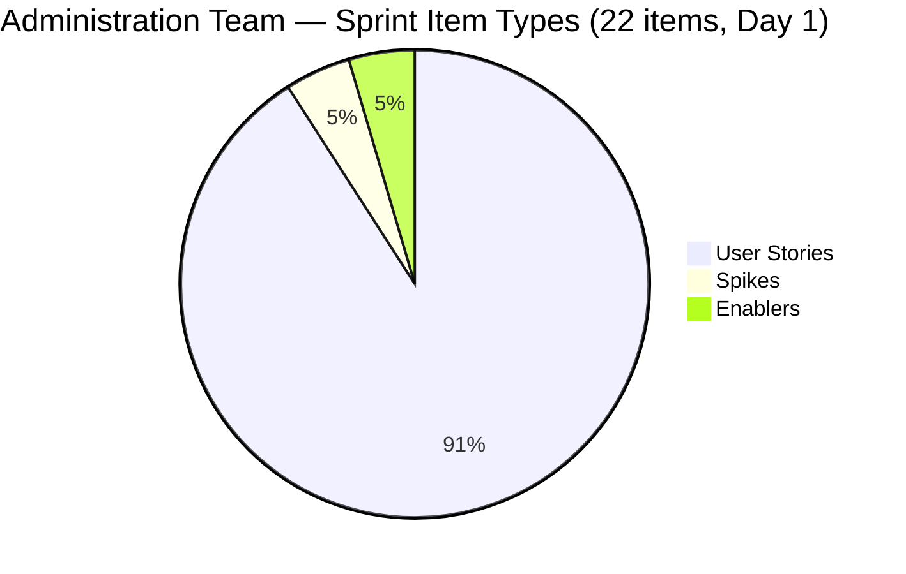
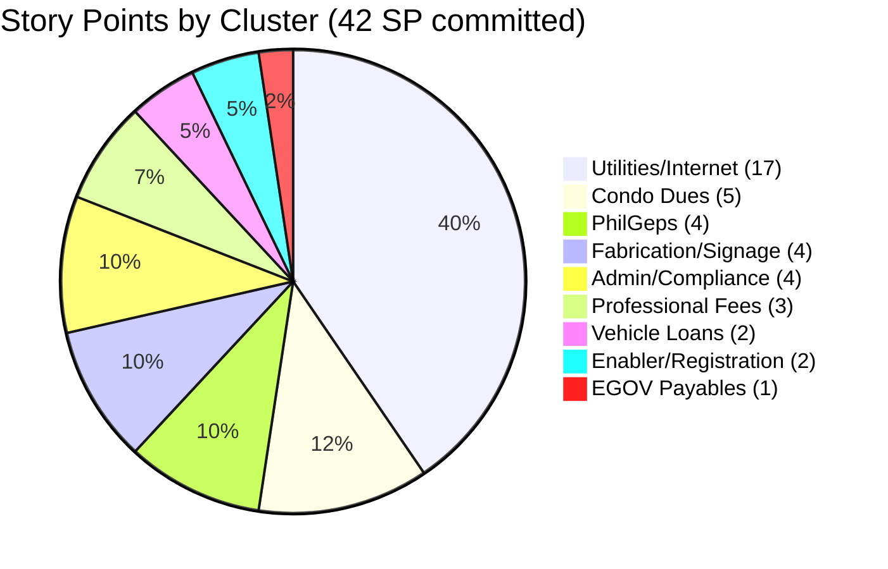
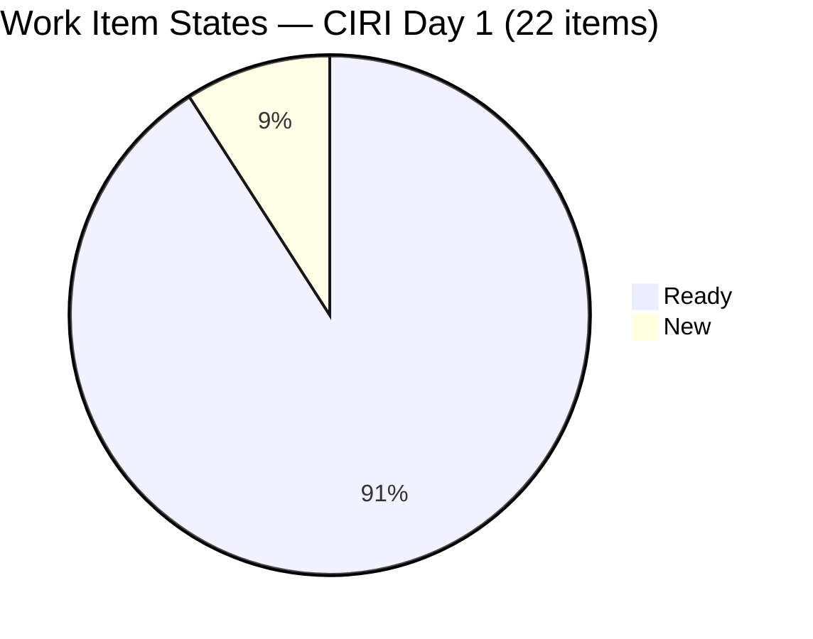

# SAFe Iteration Audit — Administration Team

## 1. Audit Metadata

| Field | Value |
|-------|-------|
| **Project** | Jairosoft FINOPS |
| **Team** | Administration Team |
| **Workspace** | `ado_admin` |
| **ADO Project ID** | e0bb302f-40f9-46c3-8164-6f1acb317d63 |
| **ADO Team ID** | a38a9c02-07ab-483d-a1e3-aff54e19e603 |
| **Iteration** | Iteration 7.5 |
| **Iteration Start** | 2026-06-01 |
| **Iteration Finish** | 2026-06-14 |
| **Sprint Day** | Day 1 of 14 |
| **Audit Date/Time** | 2026-06-01 02:03 UTC-6 |
| **Prior Audit** | AUDIT_20260530_0900.md (Day 13, Iteration 7.4, 74.1 — Moderate Risk) |
| **Overall Score** | **78.0 / 100** |
| **Risk Band** | **Moderate Risk** |

---

## 2. Executive Summary

The Administration Team opens Iteration 7.5 at **78.0 / 100 (Moderate Risk)** — an improvement of 3.9 points over the final Iteration 7.4 score of 74.1. The team has transitioned cleanly into the new sprint: all 22 current iteration items are assigned to Mark Colina, all are estimated with Story Points, and all pass DoR compliance checks — a marked improvement from the prior sprint where two items (205166, 205168) lacked Description, AC, and SP for their entire run in 7.4.

**Key strengths entering 7.5:** Full estimation coverage (100.0), full DoR compliance (100.0), full capacity coverage (100.0), and near-complete iteration planning (95.7 — 22 of 23 backlog items are in the current sprint). Item 203693 (Admin CR sink) has been correctly moved to PI8 Iteration 8.5, resolving the persistent blocker that carried through all of Iteration 7.4.

**Top risks:** Delivery Predictability is 0.0 (Critical) — expected at Day 1 but the 7.4 sprint closed with 0.0 as well, signaling that closures may be processed late or not reflected in ADO in a timely manner. Work Item Balance is capped at 70.0 (Moderate) due to User Story dominance (20/22 = 90.9%). Backlog Refinement has dropped to 80.0 because 12 of 22 current sprint items were not updated on or after the iteration start date, carrying over staleness from preparation work done in May. The persistent bus factor of 1 (Mark Colina sole contributor) remains an unmitigated organizational risk.

---

## 3. Previous Audit Delta

**Prior audit:** AUDIT_20260530_0900.md — Iteration 7.4, Day 13, Score 74.1 / 100 (Moderate Risk)

| Dimension | Iter 7.4 Day 13 | Iter 7.5 Day 1 | Delta | Driver |
|-----------|----------------|----------------|-------|--------|
| Iteration Planning | 75.0 | **95.7** | **+20.7** | Sprint transition: 22/23 items in 7.5; 203693 moved to PI8 |
| Team Capacity | 100.0 | **100.0** | 0.0 | Mark Colina fully configured; grace has 0 capacity |
| Estimation | 86.7 | **100.0** | **+13.3** | 205166 and 205168 now have SP = 1; all 21 PECI estimated |
| DoR Compliance | 86.7 | **100.0** | **+13.3** | 205166 and 205168 now have Description and AC; all 22 CIRI pass |
| Work Item Balance | 70.0 | **70.0** | 0.0 | US dominance 90.9% (20/22) still > 60%; structural cap unchanged |
| Backlog Refinement | 100.0 | **80.0** | **-20.0** | 12/22 CIRI items untouched (ChangedDate before 2026-06-01); >30% threshold |
| Delivery Predictability | 0.0 | **0.0** | 0.0 | Day 1; no closures yet; 0/42 SP closed |
| **Overall** | **74.1** | **78.0** | **+3.9** | Three dimensions improved; BR declined; DP expected at 0 |

**Key transition observations:**
- Item 203693 (Admin CR sink, Blocked, 3 SP) was moved to `2026 - PI8\\Iteration 8.5` as of 2026-05-31 — the correct escalation after the construction vendor dependency persisted through the entire 7.4 sprint.
- Items 205166, 205167, and 205168 are now fully populated with Description, AC, and SP = 1 as of 2026-06-01 (all updated at or after 02:31 UTC).
- 10 new items entered the backlog for 7.5 (205339, 205340, 205348, 205351, 205353, 205358, 205367 and others), expanding sprint load significantly — 22 items vs. 15 in 7.4.
- The Iteration 7.4 closed with 0 closed story points visible in the API. Closures from Day 11 (3 items, 8 SP) likely departed the backlog API; this is noted in Evidence Gaps.

---

## 4. Current Iteration Snapshot

| Attribute | Value |
|-----------|-------|
| **Active Iteration** | Iteration 7.5 |
| **Sprint Duration** | 2026-06-01 to 2026-06-14 (14 days) |
| **Audit Day** | **Day 1 of 14** |
| **Total Visible Backlog Root Items (VRBI)** | **23** |
| **Current Iteration Root Items (CIRI)** | **22** |
| **Sprint Load %** | **95.7%** (22/23) |
| **Point-Eligible Items (PECI)** | **21** (20 User Stories + 1 Spike) |
| **Estimated Items (ECI)** | **21** |
| **Committed Story Points (CSP)** | **42 SP** |
| **Closed Story Points (CLSP)** | **0 SP** |
| **Delivery %** | **0.0% (Day 1 — early-sprint, no delivery expected)** |
| **Item States** | Ready: 20 · New: 2 · Blocked (in 7.5): 0 |
| **Active Team Members with Work (CW)** | **1** (Mark Colina) |
| **Team Capacity Configured** | Yes — Mark Colina: 5 hrs/day (Deployment 1, Documentation 2, Requirements 2); 0 days off |
| **Out-of-sprint Item** | 203693 (Admin CR sink — moved to PI8 Iteration 8.5) |
| **Untouched CIRI Items** | 12 (ChangedDate before 2026-06-01) |
| **Remaining Days** | **14** |

---

## 5. Work Item Analysis

| ID | Title | Type | State | SP | Assignee | DoR | ChangedDate |
|----|-------|------|-------|----|----------|-----|-------------|
| 202366 | Philgeps renewal for 2026 | User Story | Ready | 3 | Mark Colina | PASS | 2026-05-31 |
| 203557 | Utilities payables for Cebu and Davao May 29, 2026 | User Story | Ready | 4 | Mark Colina | PASS | 2026-05-31 |
| 203558 | Condo dues (Cebu) payables May 28, 2026 | User Story | Ready | 3 | Mark Colina | PASS | 2026-05-27 |
| 204136 | 3 vendors for flag pole | Spike | Ready | 1 | Mark Colina | PASS | 2026-05-31 |
| 204305 | Philgeps renewal payment | User Story | Ready | 1 | Mark Colina | PASS | 2026-05-31 |
| 204367 | Government (EGOV) payables May 29, 2026 | User Story | Ready | 2 | Mark Colina | PASS | 2026-05-31 |
| 204387 | Payables - Internet for Davao and Cebu office May 30, 2026 | User Story | Ready | 2 | Mark Colina | PASS | 2026-05-31 |
| 204394 | Utilities payables for Cebu May 28-31, 2026 | User Story | Ready | 2 | Mark Colina | PASS | 2026-05-31 |
| 204448 | Condo dues (Cebu) payables May 26, 2026 | User Story | Ready | 2 | Mark Colina | PASS | 2026-05-27 |
| 204452 | Professional fee payables | User Story | Ready | 3 | Mark Colina | PASS | 2026-05-27 |
| 204536 | Gcash business registration for Jairosoft Inc. | Enabler | Ready | 2 | Mark Colina | PASS | 2026-05-31 |
| 205087 | Toyota Fortuner car loan (Cebu) | User Story | Ready | 1 | Mark Colina | PASS | 2026-05-31 |
| 205166 | Philippine flag pole fabrication | User Story | Ready | 1 | Mark Colina | PASS | 2026-06-01 |
| 205167 | Submission of JIT panaflex logo | User Story | Ready | 1 | Mark Colina | PASS | 2026-06-01 |
| 205168 | Submission of Jairosoft panaflex logo | User Story | Ready | 1 | Mark Colina | PASS | 2026-06-01 |
| 205339 | Internet payables for Davao and Cebu office | User Story | Ready | 4 | Mark Colina | PASS | 2026-06-01 |
| 205340 | Utilities payables for Cebu and Davao June 3, 2026 | User Story | Ready | 3 | Mark Colina | PASS | 2026-06-01 |
| 205348 | Toyota Hilux (Car loan) Cebu | User Story | Ready | 1 | Mark Colina | PASS | 2026-06-01 |
| 205351 | Jairosoft employee food allowance | User Story | Ready | 1 | Mark Colina | PASS | 2026-06-01 |
| 205353 | Utilities payables for Cebu June 12-13, 2026 | User Story | Ready | 2 | Mark Colina | PASS | 2026-06-01 |
| 205358 | Submit DOLE WAIR report | User Story | New | 1 | Mark Colina | PASS | 2026-06-01 |
| 205367 | Davao Admin Adhoc Support June 1-14, 2026 cutoff | User Story | New | 2 | Mark Colina | PASS | 2026-06-01 |

**SP Summary by cluster:**
- Utilities/Internet payables: 203557(4) + 204394(2) + 204387(2) + 205339(4) + 205340(3) + 205353(2) = 17 SP
- EGOV payables: 204367(2) = 2 SP
- Condo dues: 203558(3) + 204448(2) = 5 SP
- PhilGeps: 202366(3) + 204305(1) = 4 SP
- Vehicle loans: 205087(1) + 205348(1) = 2 SP
- Enabler/Registration: 204536(2) = 2 SP
- Fabrication/Signage: 205166(1) + 205167(1) + 205168(1) + 204136(1) = 4 SP
- Professional fees: 204452(3) = 3 SP
- Admin/Compliance: 205351(1) + 205358(1) + 205367(2) = 4 SP
- **Total: 42 SP across 22 items**

**DoR Notes:**
- All 22 items pass Description ≥ 30 chars AND AC ≥ 20 chars (HTML stripped).
- 205358 "Submit DOLE WAIR report" has a typo in Description ("his activity" should be "This activity") — content is sufficient for DoR.
- 205167 "Submission of JIT panaflex logo" has a typo ("he JIT" should be "The JIT") — content is sufficient for DoR.

---

## 6. SAFe Compliance Scorecard

| Dimension | Score | Evidence (Numerator / Denominator) | Notes |
|-----------|-------|-------------------------------------|-------|
| D1 Iteration Planning | **95.7** | 22 CIRI / 23 VRBI | 203693 correctly moved to PI8 Iteration 8.5; 1 item outside active sprint |
| D2 Team Capacity | **100.0** | 1 CC / 1 CW | Mark Colina: 5 hrs/day configured; grace has 0 capacity and 0 CIRI items |
| D3 Estimation | **100.0** | 21 ECI / 21 PECI | All 20 User Stories + 1 Spike estimated; Enabler excluded from PECI |
| D4 DoR Compliance | **100.0** | 22 DCI / 22 CIRI | All items have Description ≥ 30 chars and AC ≥ 20 chars (HTML stripped) |
| D5 Work Item Balance | **70.0** | Penalty B applied | US = 20/22 = 90.9% > 60% → -30; no US-absent penalty; Spike = 4.5% < 40% |
| D6 Backlog Refinement | **80.0** | base 100.0 - 20 untouched penalty | 0 stale_90; 0 stale_180; 12/22 CIRI untouched (54.5% > 30%) → -20 |
| D7 Delivery Predictability | **0.0** | 0 CLSP / 42 CSP | Day 1 — early-sprint, no delivery expected; formula applied as-is |
| **Overall** | **78.0** | (95.7+100+100+100+70+80+0) / 7 | **Moderate Risk** |

---

## 7. Dimension Findings

### 7.1 Iteration Planning (95.7 — Low Risk)

**Numerator (CIRI):** 22 items assigned to Iteration 7.5.
**Denominator (VRBI):** 23 items returned by backlog API.
**Formula:** 22 / 23 × 100 = **95.7**

The one non-current-iteration item is **203693** (Admin CR sink cabinet, Blocked, Defect, 3 SP), which is now correctly placed in `2026 - PI8\\Iteration 8.5`. This resolves the Blocked-item-in-current-sprint risk that persisted throughout Iteration 7.4. The sprint is well-loaded at 95.7% — one item short of a full-sprint load, which is within normal tolerance. The team carries 22 items into 7.5 vs. 15 in 7.4, a 47% increase in item volume.

### 7.2 Team Capacity (100.0 — Low Risk)

**CW (contributors with current work):** 1 — Mark Colina (all 22 CIRI items assigned to him).
**CC (contributors with capacity):** 1 — Mark Colina has positive daily capacity (Deployment 1/day, Documentation 2/day, Requirements 2/day = 5 hrs/day; 0 days off).
**Formula:** 1/1 × 100 = **100.0**

A second team member, **grace** (grace@jairosoft.com), appears in the capacity configuration with 0 capacity per day (Administration activity) and no CIRI items. Grace does not affect CW (not assigned to any sprint items) or CC (0 capacity per day does not constitute positive daily capacity). The bus factor remains 1 — all 22 items and 42 SP ride on Mark Colina exclusively.

### 7.3 Estimation (100.0 — Low Risk)

**PECI (User Stories + Spikes in CIRI):** 20 User Stories + 1 Spike = 21 items. Enabler (204536) excluded from PECI per rubric (Enabler type does not appear in PECI eligible list).
**ECI (PECI with SP > 0):** All 21 items have Story Points assigned (range: 1–4 SP).
**Formula:** 21/21 × 100 = **100.0**

This is the first time in recent audit history that the Administration Team achieves full estimation coverage. The prior failures (205166 and 205168) were resolved before the start of 7.5. The Enabler (204536, GCash registration, 2 SP) has SP set but is not counted in PECI — its SP count is noted for completeness. Total committed SP including Enabler = 42 SP.

### 7.4 DoR Compliance (100.0 — Low Risk)

**CIRI:** 22 items.
**DCI (Description ≥ 30 non-whitespace chars AND AC ≥ 20 non-whitespace chars):** All 22 pass.
**Formula:** 22/22 × 100 = **100.0**

Key resolution from Iteration 7.4:
- **205166** (Philippine flag pole fabrication): Now has a full description (~350+ chars stripped) and 2 AC points. PASS.
- **205168** (Submission of Jairosoft panaflex logo): Now has a full description and 2 AC points. PASS.
- **205167** (Submission of JIT panaflex logo): New item in 7.5 with description and 2 AC points. PASS.

Minor quality note: Items 205358 and 205167 have single-letter typos at the start of their descriptions ("his activity" and "he JIT"). While these do not affect the DoR threshold, they should be corrected for professionalism. All other items have rich, multi-paragraph descriptions and detailed acceptance criteria.

### 7.5 Work Item Balance (70.0 — Moderate Risk)

**CIRI:** 22 items.
**Type breakdown:** User Stories = 20 (90.9%), Spikes = 1 (4.5%), Enablers = 1 (4.5%)
- **Penalty A** (no User Story type in CIRI): User Stories are present → no penalty (0).
- **Penalty B** (dominant_type_share > 60%): User Story = 90.9% > 60% → **-30**.
- **Penalty C** (spike_share > 40%): Spike = 4.5% < 40% → no penalty (0).
**Formula:** 100 - 30 = **70.0**

The User Story dominance at 90.9% reflects the team's operational nature — most Administration Team work is payables, renewals, and compliance submissions that naturally map to User Stories. The team could partially mitigate this by reclassifying operational enablement work (e.g., GCash registration, DOLE WAIR submission) as Enablers, and research/vendor canvassing work as Spikes, to improve type diversity. Adding 1–2 more Spikes or Enablers would bring US share below 80% but penalty B would still apply until US share drops below 60%.

### 7.6 Backlog Refinement (80.0 — Low Risk)

**VRBI:** 23 items.
**fresh_VRBI** (ChangedDate ≥ 2026-04-17): All 23 items — earliest ChangedDate is 2026-05-27. **fresh_VRBI = 23**.
**base score:** 23/23 × 100 = 100.0.

**Staleness checks:**
- stale_90 (ChangedDate < 2026-03-03): 0 items → stale_90/VRBI = 0% → no penalty.
- stale_180 (ChangedDate < 2025-12-04): 0 items → no penalty.

**Untouched current items** (CIRI with ChangedDate before iteration start 2026-06-01T00:00:00 UTC):
- Changed before June 1 (UTC): 202366 (2026-05-31), 203557 (2026-05-31), 203558 (2026-05-27), 204136 (2026-05-31), 204305 (2026-05-31), 204367 (2026-05-31), 204387 (2026-05-31), 204394 (2026-05-31), 204448 (2026-05-27), 204452 (2026-05-27), 204536 (2026-05-31), 205087 (2026-05-31) = **12 items**
- Changed on/after June 1 (UTC): 205166, 205167, 205168, 205339, 205340, 205348, 205351, 205353, 205358, 205367 = 10 items
- untouched/CIRI = 12/22 = 54.5% > 30% → **penalty -20**

**Total penalties:** 20
**Formula:** max(0, 100.0 - 20) = **80.0**

The 12 untouched items were all refined and set up in the days preceding the sprint start (May 27–31), which is normal planning behavior. They are not stale by content — their last update was within 5 days of sprint start. This penalty reflects the rubric definition strictly; operationally, the backlog is well-groomed.

### 7.7 Delivery Predictability (0.0 — Critical Risk)

**CSP (committed story points on ECI):**
- User Stories: 202366(3) + 203557(4) + 203558(3) + 204305(1) + 204367(2) + 204387(2) + 204394(2) + 204448(2) + 204452(3) + 205087(1) + 205166(1) + 205167(1) + 205168(1) + 205339(4) + 205340(3) + 205348(1) + 205351(1) + 205353(2) + 205358(1) + 205367(2) = 41 SP
- Spikes: 204136(1) = 1 SP
- **CSP = 42 SP**

**CLSP (closed/done ECI):** 0 items in Closed or Done state.
**Formula:** 0/42 × 100 = **0.0**

**Early-sprint annotation:** This is **Day 1** of Iteration 7.5. A 0.0 score at sprint start is expected and does not indicate delivery failure at this stage. The concern is the pattern from Iteration 7.4, which also closed at 0.0 (closures from earlier in the sprint departed the backlog API). Mark should update ADO item states same-day as payments and actions are processed to ensure closures are visible in future audits.

**Items with near-term due dates (high closure priority):**
- 203557 (Utilities May 29): Past due date — close immediately if payment processed.
- 204367 (EGOV May 29): Past due date — close immediately if payment processed.
- 204387 (Internet May 30): Past due date — close immediately if payment processed.
- 204394 (Utilities May 28-31): Close immediately if payment processed.
- 203558 (Condo dues May 28): Past due — close immediately.
- 204448 (Condo dues May 26): Past due — close immediately.

---

## 8. Risks and Bottlenecks

| Risk | Severity | Items Affected | Status |
|------|----------|----------------|--------|
| 0 SP closed at Day 1 — sprint opens with no delivery baseline | **Critical** | 42 SP across 22 items | Expected at Day 1; pattern risk from 7.4 close at 0.0 |
| 6 items with past-due dates still in Ready state | **High** | 203557, 204367, 204387, 204394, 203558, 204448 | Carried from 7.4; no closure reflected in ADO |
| US dominance 90.9% — structural balance cap at 70.0 | **Medium** | Sprint composition | Structural; requires work item type reclassification to resolve |
| 12/22 CIRI items untouched since before sprint start | **Medium** | 203557, 202366, et al. | Technically compliant but close to staleness threshold |
| Bus factor = 1 (Mark Colina sole contributor) | **Medium** | All 22 items, 42 SP | Persistent; grace has 0 configured capacity |
| Sprint volume increase: 22 items vs. 15 in 7.4 (47% more) | **Medium** | All CIRI | Higher load on single contributor |
| 203693 (Admin CR sink) carrying as Blocked into PI8 | **Low** | 203693 (3 SP, PI8) | Correctly escalated; vendor dependency unresolved |
| Typos in 205358 and 205167 descriptions | **Low** | 2 items | Cosmetic; does not affect DoR threshold |

---

## 9. Prioritized Recommendations

1. **Close past-due items (203557, 204367, 204387, 204394, 203558, 204448) today.** Six items carried from Iteration 7.4 have past payment due dates. If the underlying actions were completed before or during 7.4, transition these to Closed in ADO immediately. Processing same-day closures is the only way to recover Delivery Predictability before it becomes a repeat sprint-close failure.

2. **Establish a daily ADO closure discipline.** Iteration 7.4 closed at 0.0 DP despite evidence of closures on Day 11. The audit trail breaks when items are closed and depart the backlog API before the audit runs. Mark should close items in ADO on the same day the action (payment, submission, registration) is completed — not in batch at sprint close.

3. **Reduce User Story dominance by reclassifying 3–5 items as Enablers or Spikes.** Items such as 205358 (DOLE WAIR report — a compliance submission), 205339 (Internet payables — infrastructure), and 205351 (food allowance) could be typed as Enablers. Vendor canvassing work (204136) is already a Spike. Reclassifying 3 User Stories as Enablers would bring US share to 77.3% — still above 60%, so re-evaluate whether type diversity is worth structural changes.

4. **Activate grace (grace@jairosoft.com) or reconfigure capacity.** Grace appears in the team capacity list with 0 hrs/day. If grace is a functional team member, configure meaningful capacity so the bus factor can be reduced. If grace is inactive, remove her from the team roster to avoid confusion in future audits.

5. **Update 203693 (Admin CR sink) blocker status in PI8.** Now in Iteration 8.5, this blocked Defect needs a fresh update before PI8 planning begins. Document the vendor name, expected delivery date, and escalation owner in the ADO item description.

6. **Fix typos in 205358 and 205167 descriptions.** Item 205358 starts "his activity" (should be "This activity") and item 205167 starts "he JIT" (should be "The JIT"). Correct before these items are presented in any stakeholder review.

7. **Add time-boxed due dates to item titles for recurring payables.** Several items (205339, Internet payables — no date in title; 205351, food allowance — no date) lack due-date context in their titles. Adding dates (e.g., "June 1–14, 2026") makes sprint review sorting and closure tracking easier.

8. **Review sprint load: 42 SP is ~44% more than Iteration 7.4's 29 SP.** With a single contributor at 5 hrs/day and a 14-day sprint, effective capacity is ~70 hours. At historical velocity (if 7.4 is representative), 42 SP may be over-committed. Validate that each SP estimate is accurate before mid-sprint.

---

## 10. Evidence Gaps and Limitations

- **Delivery Predictability 0.0 at Day 1 is formula-correct but not indicative of team performance.** Sprint has just started (2026-06-01). The 0.0 should be treated as a baseline, not a failure signal. However, Iteration 7.4 also closed at 0.0 — this is a pattern risk, not merely early-sprint noise.
- **Iteration 7.4 closures departed the backlog API.** The prior audit confirmed closures on Day 11 (3 items, 8 SP). Those items (likely closed US entries) are absent from the current backlog API response. ADO's backlog API typically returns only open/active items. Any 7.4 closed items that were resolved before the sprint ended are no longer visible and cannot be counted for D7 in prior audits. This is documented as a structural limitation, not a data quality issue.
- **Grace's team membership:** grace (grace@jairosoft.com) appears in work_get_team_capacity with 0 capacity per day. Her role, tenure on the team, and whether she holds any work items outside the current iteration are unknown. She does not appear in any current backlog items.
- **Enabler (204536) Story Points:** The Enabler type does not qualify for PECI per the rubric (only User Story, Feature, Spike). Item 204536 has 2 SP assigned but is excluded from D3 numerator/denominator. CSP and CLSP for D7 include only ECI (PECI items with SP > 0), so the Enabler's 2 SP are excluded from the D7 calculation.
- **Untouched item timezone note:** ChangedDates for May 31 items are recorded in UTC (e.g., 2026-05-31T22:58:59.273Z = ~4:58 PM CST on May 31). These predate the iteration start of 2026-06-01T00:00:00 UTC and are correctly classified as untouched. No ambiguity in the classification.
- **203693 iteration path:** Item 203693 appears in the VRBI (returned by the backlog API) but its IterationPath is `2026 - PI8\\Iteration 8.5`. It is counted in VRBI = 23 (visible to this team's backlog) but excluded from CIRI = 22 (not in Iteration 7.5). This is consistent with ADO backlog behavior where assigned-but-future items may still appear in team backlog views.

---

## Appendix: Score Visualization

**SAFe Compliance Scorecard — Iteration 7.5 Day 1:**

| Dimension | Score | Band | vs. 7.4 Day 13 |
|-----------|-------|------|----------------|
| D1 Iteration Planning | 95.7 | Low | +20.7 |
| D2 Team Capacity | 100.0 | Low | 0.0 |
| D3 Estimation | 100.0 | Low | +13.3 |
| D4 DoR Compliance | 100.0 | Low | +13.3 |
| D5 Work Item Balance | 70.0 | Moderate | 0.0 |
| D6 Backlog Refinement | 80.0 | Low | -20.0 |
| D7 Delivery Predictability | 0.0 | Critical | 0.0 |
| **Overall** | **78.0** | **Moderate** | **+3.9** |

**Score Trend (recent audits):**

| Audit | Iteration | Day | Score | Band |
|-------|-----------|-----|-------|------|
| AUDIT_20260529_0900 | Iter 7.4 | Day 12 | 74.1 | Moderate |
| AUDIT_20260530_0900 | Iter 7.4 | Day 13 | 74.1 | Moderate |
| **AUDIT_20260601_0203** | **Iter 7.5** | **Day 1** | **78.0** | **Moderate** |
