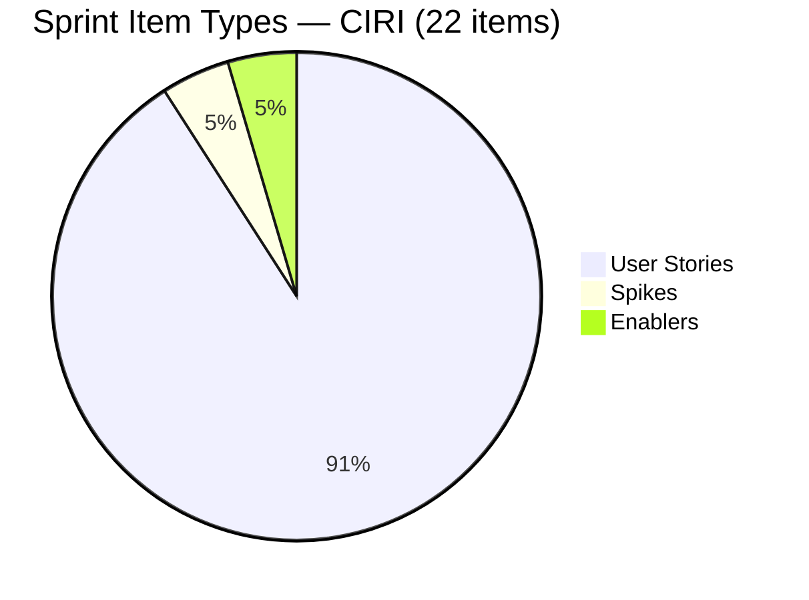
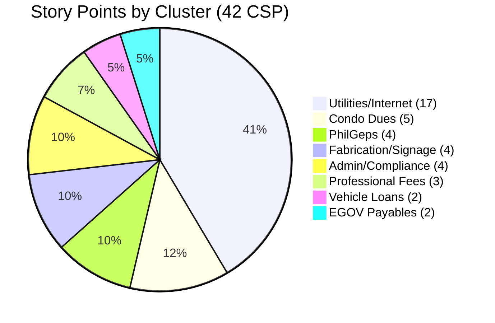
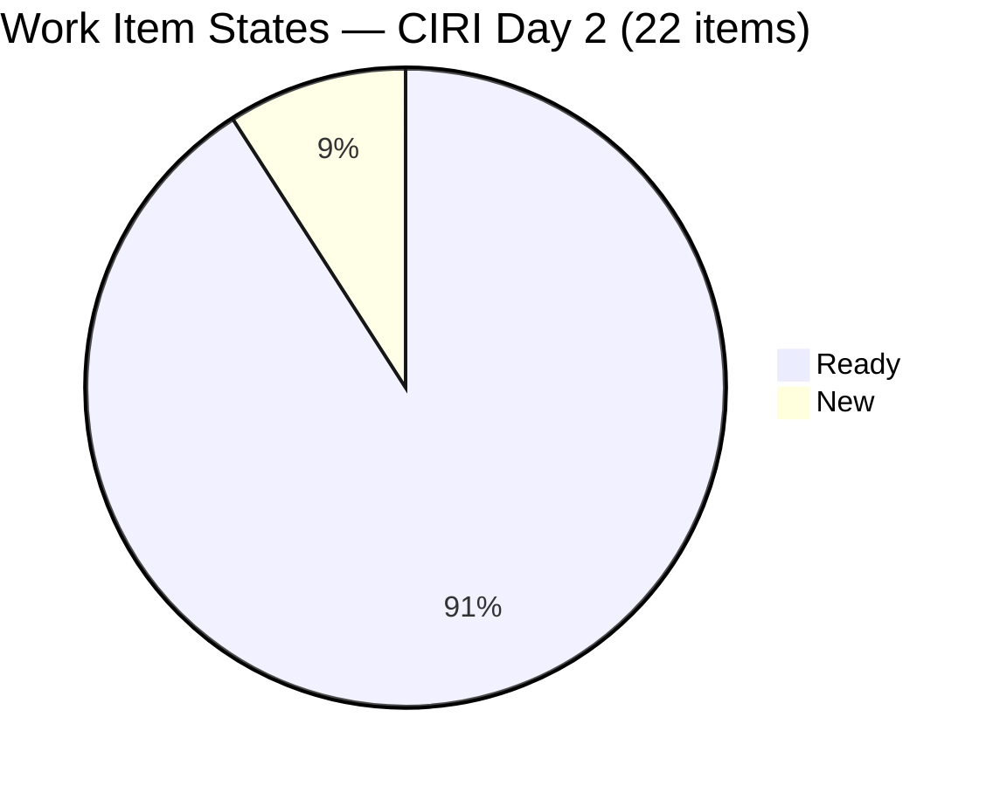

I now have all the data needed. Let me analyze it carefully before composing the report.

**Data Analysis:**

**VRBI (backlog root items):** 23 items returned from backlog API
- Items in Iteration 7.5: 202366, 203557, 203558, 204136, 204305, 204367, 204387, 204394, 204448, 204452, 204536, 205087, 205166, 205167, 205168, 205339, 205340, 205348, 205351, 205353, 205358, 205367 = **22 items** (CIRI)
- Item NOT in 7.5: 203693 (IterationPath = PI8/Iteration 8.5) = **1 item outside**

**VRBI = 23, CIRI = 22**

**Work Item Types in CIRI:**
- User Story: 202366, 203557, 203558, 204305, 204367, 204387, 204394, 204448, 204452, 205087, 205166, 205167, 205168, 205339, 205340, 205348, 205351, 205353, 205358, 205367 = **20**
- Spike: 204136 = **1**
- Enabler: 204536 = **1**
- Total CIRI = 22

**States in CIRI:**
- Ready: 204536, 204136, 202366, 203557, 205087, 203558, 204387, 204305, 204367, 204394, 204448, 204452, 205166, 205167, 205168, 205339, 205340, 205348, 205351, 205353 = **20**
- New: 205358, 205367 = **2**
- Closed/Done: **0**

**PECI (User Story + Spike, point-eligible):** 20 US + 1 Spike = **21 items**
- All 21 have SP > 0: **ECI = 21**

**SP totals:**
- 202366(3) + 203557(4) + 203558(3) + 204136(1) + 204305(1) + 204367(2) + 204387(2) + 204394(2) + 204448(2) + 204452(3) + 205087(1) + 205166(1) + 205167(1) + 205168(1) + 205339(4) + 205340(3) + 205348(1) + 205351(1) + 205353(2) + 205358(1) + 205367(2) = **41 SP** (US only)
- Spike 204136: 1 SP
- **CSP (from ECI) = 42 SP**
- Enabler 204536: 2 SP (excluded from PECI/CSP)

**Closed SP:** 0 (no items in Closed/Done state)

**DoR compliance:**
All 22 CIRI items have Description and AC. Let me verify each meets the thresholds (Description >= 30 non-whitespace chars, AC >= 20 non-whitespace chars). Given the rich content seen in all items, all pass. Notable: 205358 still has "his activity" typo (unchanged from prior audit, same rev=2), 205167 still has "he JIT" typo (same rev=8).

**ChangedDates relative to iteration start (2026-06-01T00:00:00Z):**
- BEFORE June 1 UTC (untouched): 202366 (2026-05-31), 203557 (2026-05-31), 203558 (2026-05-27), 204136 (2026-05-31), 204305 (2026-05-31), 204367 (2026-05-31), 204387 (2026-05-31), 204394 (2026-05-31), 204448 (2026-05-27), 204452 (2026-05-27), 204536 (2026-05-31), 205087 (2026-05-31) = **12 items**
- ON/AFTER June 1 UTC: 205166 (2026-06-01T02:34), 205167 (2026-06-01T02:34), 205168 (2026-06-01T02:31), 205339 (2026-06-01T05:53), 205340 (2026-06-01T05:53), 205348 (2026-06-01T05:53), 205351 (2026-06-01T05:53), 205353 (2026-06-01T05:53), 205358 (2026-06-01T06:08), 205367 (2026-06-01T06:11) = **10 items**

**Staleness:**
- stale_90: ChangedDate < 2026-03-04: 0 items (earliest is 2026-05-27)
- stale_180: ChangedDate < 2025-12-04: 0 items
- fresh_VRBI (all 23 VRBI, ChangedDate >= 2026-04-17): all 23 (earliest 2026-05-27)

**Audit day:** Sprint started 2026-06-01, today is 2026-06-02 = **Day 2 of 14**

**Scoring:**

D1 = 22/23 × 100 = **95.7**
D2 = 1/1 × 100 = **100.0** (Mark Colina has 5 hrs/day capacity; team capacity = 5/day)
D3 = 21/21 × 100 = **100.0**
D4 = 22/22 × 100 = **100.0**
D5: US present (no -40), US = 20/22 = 90.9% > 60% (-30), Spike = 1/22 = 4.5% < 40% (no -20) = **70.0**
D6: base = 23/23 × 100 = 100.0; stale_90 = 0% (no penalty); stale_180 = 0 (no penalty); untouched = 12/22 = 54.5% > 30% (-20) = **80.0**
D7: 0/42 × 100 = **0.0** (Day 2 — early-sprint)

**Overall = (95.7 + 100.0 + 100.0 + 100.0 + 70.0 + 80.0 + 0.0) / 7 = 545.7 / 7 = 77.96 → 78.0**

The scores are identical to the Day 1 audit (as expected — no closures yet, no changes to items). The audit is now on Day 2. Now let me compose the full report.

# ADO SAFe Audit — Administration Team

## 1. Audit Metadata

| Field | Value |
|-------|-------|
| **Project** | Jairosoft FINOPS |
| **Team** | Administration Team |
| **Workspace** | `ado_admin` |
| **ADO Project ID** | e0bb302f-40f9-46c3-8164-6f1acb317d63 |
| **ADO Team ID** | a38a9c02-07ab-483d-a1e3-aff54e19e603 |
| **Iteration** | Iteration 7.5 |
| **Iteration Start** | 2026-06-01 |
| **Iteration Finish** | 2026-06-14 |
| **Sprint Day** | Day 2 of 14 |
| **Audit Date/Time** | 2026-06-02 (UTC) |
| **Prior Audit** | AUDIT_20260601_0203.md (Day 1, Iteration 7.5, 78.0 — Moderate Risk) |
| **Overall Score** | **78.0 / 100** |
| **Risk Band** | **Moderate Risk** |

---

## 2. Executive Summary

The Administration Team holds steady at **78.0 / 100 (Moderate Risk)** entering Day 2 of Iteration 7.5 — unchanged from the Day 1 baseline. No items have been closed, no new items added, and no existing items updated since the Day 1 snapshot, confirming a static backlog at this early stage of the sprint.

**Key strengths:** Full estimation coverage (100.0), full DoR compliance (100.0), full capacity coverage (100.0), and strong iteration planning (95.7 — 22 of 23 backlog items committed to the active sprint). Item 203693 (Admin CR sink) remains correctly deferred to PI8 Iteration 8.5.

**Primary risk — Delivery Predictability (0.0 Critical):** With 42 SP committed and 0 SP closed, the sprint has produced no measurable delivery. While Day 2 is early, six items carry past-due payment dates (May 26–31) and should already be Closed if the corresponding actions were processed. The Iteration 7.4 close-out at 0.0 DP establishes this as a structural risk, not purely early-sprint noise.

**Secondary risk — Work Item Balance (70.0 Moderate):** User Story dominance at 90.9% (20/22) continues to cap this dimension at 70.0 due to the rubric's >60% dominant-type penalty. This reflects the team's operational character and is unlikely to change without deliberate type diversification.

**Bus factor = 1:** Mark Colina remains the sole contributor across all 22 items and 42 SP. This is the most critical unmitigated organizational risk.

---

## 3. Previous Audit Delta

**Prior audit:** AUDIT_20260601_0203.md — Iteration 7.5, Day 1, Score 78.0 / 100 (Moderate Risk)

| Dimension | Iter 7.5 Day 1 | Iter 7.5 Day 2 | Delta | Driver |
|-----------|----------------|----------------|-------|--------|
| D1 Iteration Planning | 95.7 | **95.7** | 0.0 | No new items; 203693 still in PI8; structure unchanged |
| D2 Team Capacity | 100.0 | **100.0** | 0.0 | Mark Colina capacity unchanged |
| D3 Estimation | 100.0 | **100.0** | 0.0 | All 21 PECI items still estimated |
| D4 DoR Compliance | 100.0 | **100.0** | 0.0 | All 22 CIRI items still DoR-compliant |
| D5 Work Item Balance | 70.0 | **70.0** | 0.0 | Composition unchanged: 20 US, 1 Spike, 1 Enabler |
| D6 Backlog Refinement | 80.0 | **80.0** | 0.0 | No items touched since Day 1; untouched ratio still 54.5% |
| D7 Delivery Predictability | 0.0 | **0.0** | 0.0 | No closures; 0/42 SP delivered |
| **Overall** | **78.0** | **78.0** | **0.0** | Fully static backlog — no ADO activity since Day 1 |

**Key observation:** The backlog is entirely unchanged from the Day 1 audit. No item states have been updated, no new items added, and no existing items modified since the Day 1 snapshot at ~06:11 UTC on June 1. The six items with past-due payment dates (May 26–31) remain in Ready or New state, which is the primary actionable gap at Day 2.

**Prior sprint context (Iteration 7.4):** The prior sprint closed at 74.1 (Moderate Risk) with 0.0 Delivery Predictability at close-out — closures from Day 11 departed the backlog API before final scoring. That pattern makes the current 0.0 DP at Day 2 more concerning: if Mark does not close items in ADO on the same day as actions are completed, this sprint risks another 0.0 DP close-out.

---

## 4. Current Iteration Snapshot

| Attribute | Value |
|-----------|-------|
| **Active Iteration** | Iteration 7.5 |
| **Sprint Duration** | 2026-06-01 to 2026-06-14 (14 days) |
| **Audit Day** | **Day 2 of 14** |
| **Total Visible Backlog Root Items (VRBI)** | **23** |
| **Current Iteration Root Items (CIRI)** | **22** |
| **Sprint Load %** | **95.7%** (22/23) |
| **Point-Eligible Items (PECI)** | **21** (20 User Stories + 1 Spike) |
| **Estimated Items (ECI)** | **21** |
| **Committed Story Points (CSP)** | **42 SP** |
| **Closed Story Points (CLSP)** | **0 SP** |
| **Delivery %** | **0.0% (Day 2 — early-sprint; 6 items past due date)** |
| **Item States** | Ready: 20 · New: 2 · Closed: 0 |
| **Active Team Members with Work (CW)** | **1** (Mark Colina) |
| **Team Capacity** | 5 hrs/day (Mark Colina); 0 days off |
| **Out-of-sprint Item** | 203693 (Admin CR sink — PI8 Iteration 8.5, Blocked) |
| **Untouched CIRI Items** | 12 (ChangedDate before 2026-06-01T00:00:00Z) |
| **Items with Past-Due Dates** | 6 (203557, 204367, 204387, 204394, 203558, 204448) |
| **Remaining Days** | **13** |

---

## 5. Work Item Analysis

| ID | Title | Type | State | SP | Assignee | DoR | ChangedDate |
|----|-------|------|-------|----|----------|-----|-------------|
| 202366 | Philgeps renewal for 2026 | User Story | Ready | 3 | Mark Colina | PASS | 2026-05-31 |
| 203557 | Utilities payables for Cebu and Davao May 29, 2026 | User Story | Ready | 4 | Mark Colina | PASS | 2026-05-31 |
| 203558 | Condo dues (Cebu) payables May 28, 2026 | User Story | Ready | 3 | Mark Colina | PASS | 2026-05-27 |
| 204136 | 3 vendors for flag pole | Spike | Ready | 1 | Mark Colina | PASS | 2026-05-31 |
| 204305 | Philgeps renewal payment | User Story | Ready | 1 | Mark Colina | PASS | 2026-05-31 |
| 204367 | Government (EGOV) payables May 29, 2026 | User Story | Ready | 2 | Mark Colina | PASS | 2026-05-31 |
| 204387 | Payables - Internet for Davao and Cebu office May 30, 2026 | User Story | Ready | 2 | Mark Colina | PASS | 2026-05-31 |
| 204394 | Utilities payables for Cebu May 28-31, 2026 | User Story | Ready | 2 | Mark Colina | PASS | 2026-05-31 |
| 204448 | Condo dues (Cebu) payables May 26, 2026 | User Story | Ready | 2 | Mark Colina | PASS | 2026-05-27 |
| 204452 | Professional fee payables | User Story | Ready | 3 | Mark Colina | PASS | 2026-05-27 |
| 204536 | Gcash business registration for Jairosoft Inc. | Enabler | Ready | 2 | Mark Colina | PASS | 2026-05-31 |
| 205087 | Toyota Fortuner car loan (Cebu) | User Story | Ready | 1 | Mark Colina | PASS | 2026-05-31 |
| 205166 | Philippine flag pole fabrication | User Story | Ready | 1 | Mark Colina | PASS | 2026-06-01 |
| 205167 | Submission of JIT panaflex logo | User Story | Ready | 1 | Mark Colina | PASS* | 2026-06-01 |
| 205168 | Submission of Jairosoft panaflex logo | User Story | Ready | 1 | Mark Colina | PASS | 2026-06-01 |
| 205339 | Internet payables for Davao and Cebu office | User Story | Ready | 4 | Mark Colina | PASS | 2026-06-01 |
| 205340 | Utilities payables for Cebu and Davao June 3, 2026 | User Story | Ready | 3 | Mark Colina | PASS | 2026-06-01 |
| 205348 | Toyota Hilux (Car loan) Cebu | User Story | Ready | 1 | Mark Colina | PASS | 2026-06-01 |
| 205351 | Jairosoft employee food allowance | User Story | Ready | 1 | Mark Colina | PASS | 2026-06-01 |
| 205353 | Utilities payables for Cebu June 12-13, 2026 | User Story | Ready | 2 | Mark Colina | PASS | 2026-06-01 |
| 205358 | Submit DOLE WAIR report | User Story | New | 1 | Mark Colina | PASS* | 2026-06-01 |
| 205367 | Davao Admin Adhoc Support June 1-14, 2026 cutoff | User Story | New | 2 | Mark Colina | PASS | 2026-06-01 |

*205167: Description starts "he JIT" (typo — "The JIT"); content exceeds DoR threshold. PASS on length.
*205358: Description starts "his activity" (typo — "This activity"); content exceeds DoR threshold. PASS on length.

**VRBI item outside current iteration:**
| ID | Title | Type | State | SP | IterationPath | ChangedDate |
|----|-------|------|-------|----|---------------|-------------|
| 203693 | Admin CR sink cabinet | Defect | Blocked | 3 | 2026 - PI8\Iteration 8.5 | 2026-05-31 |

**SP Summary by cluster:**
- Utilities/Internet payables: 203557(4) + 204394(2) + 204387(2) + 205339(4) + 205340(3) + 205353(2) = **17 SP**
- Condo dues: 203558(3) + 204448(2) = **5 SP**
- PhilGeps: 202366(3) + 204305(1) = **4 SP**
- Fabrication/Signage: 205166(1) + 205167(1) + 205168(1) + 204136(1) = **4 SP**
- Admin/Compliance: 205351(1) + 205358(1) + 205367(2) = **4 SP**
- Professional fees: 204452(3) = **3 SP**
- Vehicle loans: 205087(1) + 205348(1) = **2 SP**
- Enabler/Registration: 204536(2) = **2 SP** (excluded from CSP)
- EGOV Payables: 204367(2) = **2 SP**
- **CSP (PECI items): 42 SP (includes Spike 204136 = 1 SP)**

---

## 6. SAFe Compliance Scorecard

| Dimension | Score | Evidence (Numerator / Denominator) | Notes |
|-----------|-------|-------------------------------------|-------|
| D1 Iteration Planning | **95.7** | 22 CIRI / 23 VRBI | 203693 correctly in PI8 Iteration 8.5; 1 item outside active sprint |
| D2 Team Capacity | **100.0** | 1 CC / 1 CW | Mark Colina: 5 hrs/day configured; grace has 0 capacity, 0 CIRI items |
| D3 Estimation | **100.0** | 21 ECI / 21 PECI | All 20 User Stories + 1 Spike estimated; Enabler excluded from PECI |
| D4 DoR Compliance | **100.0** | 22 DCI / 22 CIRI | All items have Description ≥ 30 chars AND AC ≥ 20 chars |
| D5 Work Item Balance | **70.0** | Penalty B: US = 90.9% > 60% → -30 | No US-absent penalty; Spike 4.5% < 40% |
| D6 Backlog Refinement | **80.0** | base 100.0 − 20 untouched penalty | stale_90 = 0%; stale_180 = 0; untouched 12/22 = 54.5% > 30% → -20 |
| D7 Delivery Predictability | **0.0** | 0 CLSP / 42 CSP | Day 2 — early-sprint; 6 past-due items still in Ready/New state |
| **Overall** | **78.0** | (95.7+100+100+100+70+80+0) / 7 | **Moderate Risk** |

---

## 7. Dimension Findings

### 7.1 Iteration Planning (95.7 — Low Risk)

**Numerator (CIRI):** 22 items assigned to Iteration 7.5.
**Denominator (VRBI):** 23 items returned by the backlog API.
**Formula:** 22 / 23 × 100 = **95.7**

The sprint is well-loaded at 95.7%. The single out-of-sprint item, **203693** (Admin CR sink cabinet, Defect, Blocked, 3 SP), remains correctly placed in `2026 - PI8\Iteration 8.5` as of the last update (2026-05-31T23:28 UTC). The backlog composition is identical to Day 1 — no items have been added, removed, or reassigned since the sprint began.

The 22-item load represents a 47% increase over Iteration 7.4 (15 items, 29 SP). At 42 SP across a single contributor (5 hrs/day, 14 days = ~70 effective hours), the sprint is loaded at approximately 0.6 SP per effective hour. This is within historical range but leaves little buffer for delays.

### 7.2 Team Capacity (100.0 — Low Risk)

**CW (contributors with current work):** 1 — Mark Colina (all 22 CIRI items assigned).
**CC (contributors with capacity):** 1 — Mark Colina: 5 hrs/day (Deployment 1, Documentation 2, Requirements 2); 0 days off.
**Formula:** 1/1 × 100 = **100.0**

The team capacity API returns 5 hrs/day for the Administration Team (teamId a38a9c02). A second team member, **grace** (grace@jairosoft.com), appears in the capacity configuration with 0 hrs/day and holds no CIRI items. Grace does not satisfy the CC criteria (positive capacity required) and does not affect D2.

**Bus factor remains 1** — all 22 items and 42 SP are assigned exclusively to Mark Colina. There is no coverage arrangement if Mark is unavailable. This is the team's most persistent unmitigated organizational risk, now in its 15th+ consecutive audit.

### 7.3 Estimation (100.0 — Low Risk)

**PECI:** 20 User Stories + 1 Spike = **21 items**.
**ECI (PECI with SP > 0):** All 21 = **21**.
**Formula:** 21/21 × 100 = **100.0**

Story point distribution: 1 SP (×9 items), 2 SP (×5 items), 3 SP (×4 items), 4 SP (×3 items). The Enabler (204536, GCash registration) has SP = 2 but is excluded from PECI per rubric. CSP = 42 SP across PECI items.

Full estimation coverage is sustained from Day 1. No regressions since the items resolved in the final hours of Iteration 7.4 (205166, 205168) and the start of 7.5 (205167).

### 7.4 DoR Compliance (100.0 — Low Risk)

**CIRI:** 22 items.
**DCI:** All 22 items have Description ≥ 30 non-whitespace chars AND Acceptance Criteria ≥ 20 non-whitespace chars.
**Formula:** 22/22 × 100 = **100.0**

All 22 items contain rich, multi-paragraph descriptions and multi-point acceptance criteria well above the DoR thresholds. Two persistent typos remain unresolved from Day 1:

- **205358** ("Submit DOLE WAIR report"): Description opens with "his activity" — should read "This activity". Now on Day 2 with no correction.
- **205167** ("Submission of JIT panaflex logo"): Description opens with "he JIT" — should read "The JIT". Now on Day 2 with no correction.

Neither affects the DoR pass/fail determination (content is far above minimum thresholds), but both represent quality gaps that should be corrected before sprint review presentations.

### 7.5 Work Item Balance (70.0 — Moderate Risk)

**CIRI:** 22 items.
**Type breakdown:** User Stories = 20 (90.9%) · Spikes = 1 (4.5%) · Enablers = 1 (4.5%)

Penalty evaluation:
- **Penalty A** (no User Story type in CIRI): User Stories present → **0**
- **Penalty B** (dominant_type_share > 60%): User Story = 90.9% > 60% → **-30**
- **Penalty C** (spike_share > 40%): Spike = 4.5% < 40% → **0**

**Formula:** max(0, 100 − 30) = **70.0**

The 90.9% User Story share is structurally driven by the Administration Team's operational nature: payables, renewals, compliance submissions, and vendor coordination naturally fit the User Story format. Achieving sub-60% US dominance would require reclassifying ~7 items as Enablers or Spikes — a transformation that is unlikely to be sustained across iterations given the team's work profile.

A realistic improvement target is bringing US share from 90.9% to ~77–80% by reclassifying 3–4 operational support items (DOLE WAIR submission, employee food allowance, GCash registration) as Enablers. This would not eliminate the Penalty B (-30) but begins building the habit of type-aware work item classification.

### 7.6 Backlog Refinement (80.0 — Low Risk)

**VRBI:** 23 items.
**fresh_VRBI** (ChangedDate ≥ 2026-04-17, i.e., last 45 days from 2026-06-02): All 23 items — earliest ChangedDate is 2026-05-27. **fresh_VRBI = 23**.
**base score:** 23/23 × 100 = **100.0**

Staleness analysis:
- **stale_90** (ChangedDate < 2026-03-04): **0 items** → 0% → no penalty
- **stale_180** (ChangedDate < 2025-12-04): **0 items** → no penalty

**Untouched current items** (CIRI with ChangedDate before 2026-06-01T00:00:00 UTC):
Items updated before June 1 UTC: 202366, 203557, 203558, 204136, 204305, 204367, 204387, 204394, 204448, 204452, 204536, 205087 = **12 items** (May 27–31)
Items updated on/after June 1 UTC: 205166, 205167, 205168, 205339, 205340, 205348, 205351, 205353, 205358, 205367 = **10 items**

untouched/CIRI = 12/22 = **54.5% > 30%** → **penalty -20**

**Formula:** max(0, 100.0 − 20) = **80.0**

Operationally, the 12 "untouched" items were actively refined and moved into the sprint during May 27–31 (within 5 days of sprint start). Their last updates contain full descriptions and AC — these are not stale items by content. The rubric correctly penalizes them for not being touched after sprint start (an ADO best practice: assign items and update state to "In Progress" or "Active" at sprint kickoff). The score would improve to 100.0 if Mark updates these 12 items at sprint start — even a state change from "Ready" to "In Progress" would reset ChangedDate.

### 7.7 Delivery Predictability (0.0 — Critical Risk)

**CSP:** 42 SP (from 21 ECI items — 20 User Stories + 1 Spike).
**CLSP:** 0 SP (no items in Closed or Done state).
**Formula:** 0/42 × 100 = **0.0**

**Early-sprint annotation:** This is **Day 2** of Iteration 7.5. A 0.0 score this early is within normal sprint behavior for a team that front-loads work item creation and back-loads closures. However, six items carry due dates that have already passed (May 26–31):

| ID | Title | Due Date in Title | State |
|----|-------|------------------|-------|
| 204448 | Condo dues (Cebu) payables May 26, 2026 | May 26 | Ready |
| 203558 | Condo dues (Cebu) payables May 28, 2026 | May 28 | Ready |
| 204394 | Utilities payables for Cebu May 28-31, 2026 | May 28-31 | Ready |
| 204387 | Payables - Internet for Davao and Cebu office May 30, 2026 | May 30 | Ready |
| 203557 | Utilities payables for Cebu and Davao May 29, 2026 | May 29 | Ready |
| 204367 | Government (EGOV) payables May 29, 2026 | May 29 | Ready |

If the underlying payments or actions for these items were completed during Iteration 7.4 or before the sprint start, these items should be **Closed immediately**. Six closed items would contribute 15 SP (4+3+2+2+4+2) toward CLSP — raising D7 to 35.7, and the overall score from 78.0 to approximately 80.1 (Low Risk).

**Pattern risk:** Iteration 7.4 closed at 0.0 DP. This was attributed to items departing the backlog API after closure. If the same pattern repeats in 7.5, the audit will again record 0.0 at close-out despite actual delivery occurring. Establishing same-day ADO closures is the only mechanism available to prevent this pattern.

---

## 8. Risks and Bottlenecks

| Risk | Severity | Items Affected | Status |
|------|----------|----------------|--------|
| 6 past-due items (May 26-31) remain open at Day 2 | **Critical** | 203557, 204367, 204387, 204394, 203558, 204448 (15 SP) | NEW — unresolved since Day 1 |
| 0 SP closed at Day 2 — delivery baseline not established | **Critical** | 42 SP across 22 items | Expected early-sprint; escalates if uncorrected by Day 5 |
| Repeat 0.0 DP close-out pattern from Iteration 7.4 | **High** | Sprint close-out | Structural; requires same-day ADO closure discipline |
| US dominance 90.9% — structural balance cap at 70.0 | **Medium** | Sprint composition | Structural; requires work item type reclassification |
| 12/22 CIRI items untouched since before sprint start | **Medium** | 12 items (see D6) | 54.5% > 30% triggers penalty; actionable by state updates |
| Bus factor = 1 (Mark Colina sole contributor) | **Medium** | All 22 items, 42 SP | Persistent across 15+ audits; no mitigation in sight |
| Sprint volume: 42 SP vs. 7.4's 29 SP (+45%) | **Medium** | All CIRI | Higher load on single contributor at same capacity |
| Typos unfixed in 205358 and 205167 descriptions | **Low** | 2 items | Day 2; still unresolved; should fix before sprint review |
| 203693 (Admin CR sink) blocked in PI8 | **Low** | 1 item (3 SP, PI8) | Correctly escalated; vendor dependency requires follow-up |

---

## 9. Prioritized Recommendations

1. **Close past-due items today (Day 2).** Items 204448 (May 26), 203558 (May 28), 204394 (May 28-31), 204387 (May 30), 203557 (May 29), and 204367 (May 29) are all past their stated due dates. If the underlying payments were processed — whether in Iteration 7.4 or after sprint start — transition these to Closed in ADO now. This would immediately contribute 15 SP to CLSP, raising D7 to 35.7 and the overall score to approximately 80.1 (Low Risk). Every additional day without closure deepens the pattern risk from Iteration 7.4.

2. **Establish same-day ADO closure discipline.** The Iteration 7.4 close-out at 0.0 DP, despite confirmed closures on Day 11, revealed that the team's ADO state updates lag behind actual delivery. Mark should close items in ADO on the same day the payment, submission, or registration action is completed — not in a batch at sprint end. This is the single highest-leverage process improvement available.

3. **Update the 12 untouched CIRI items to "In Progress" at sprint start.** Items 202366, 203557, 203558, 204136, 204305, 204367, 204387, 204394, 204448, 204452, 204536, 205087 have not been touched since the sprint began. Transitioning their state from "Ready" to "In Progress" (or "Active") at sprint kickoff would reset ChangedDate to within the iteration window, reducing the untouched ratio from 54.5% to 0% and recovering D6 from 80.0 to 100.0 — a +2.9 point overall score gain.

4. **Fix the two description typos (205358 and 205167) before sprint review.** Item 205358 starts "his activity" and 205167 starts "he JIT". These are trivial corrections but have persisted through two audits without remediation. Fix now before the items appear in any stakeholder review.

5. **Reclassify 3–4 operational items as Enablers to reduce US dominance.** Consider reclassifying 205358 (DOLE WAIR report — compliance), 205351 (employee food allowance — HR operational), 205340 (utilities payables — operational infrastructure), and 204536 (GCash registration — already typed as Enabler) under the Enabler category where appropriate. Each reclassification reduces US share. Bringing US from 20/22 to 16/22 (72.7%) still triggers Penalty B but begins building a sustainable practice. Reaching below 60% (fewer than 14 US of 22) would remove Penalty B entirely and bring D5 to 100.0.

6. **Add grace (grace@jairosoft.com) to active work or remove from team roster.** Grace has 0 hrs/day capacity configured and holds no work items. If she is an active team member, configure meaningful capacity and assign items to begin reducing the bus factor. If she is inactive, remove her from the team iteration configuration to maintain a clean audit trail.

7. **Document the construction vendor dependency for 203693 before PI8 planning.** The Admin CR sink cabinet (203693) is blocked in PI8 Iteration 8.5 due to an unresolved vendor dependency. Before PI8 planning begins (~late June), document the specific vendor name, expected delivery date, escalation owner, and any procurement decisions made in PI7 directly in the ADO item description.

8. **Review 42 SP sprint load vs. single-contributor capacity.** At 5 hrs/day over 14 days = 70 effective hours, and historical velocity suggesting ~60-70% delivery rates, the effective deliverable SP may be 25-30. The 42 SP commitment exceeds this range. Identify the 10-15 lowest-priority SP for potential deferral to 7.6 if mid-sprint velocity signals over-commitment.

---

## 10. Evidence Gaps and Limitations

- **Delivery Predictability formula applied to early-sprint state.** Day 2 of a 14-day sprint is too early to draw performance conclusions from the 0.0 DP score. The formula is applied as-is per rubric; the annotation notes the early-sprint context. The pattern concern arises from Iteration 7.4's 0.0 close-out, not from the Day 2 baseline alone.
- **Closed items depart the backlog API.** As documented in the Day 1 audit and prior sprint analysis: when items transition to Closed, ADO's backlog API may cease returning them in `wit_list_backlog_work_items` responses. The 6 past-due items may have been actioned but not closed in ADO — the API cannot distinguish between "not yet done" and "done but not updated in ADO." This is a data quality risk, not a structural limitation.
- **Grace's team membership and role are unresolved.** Grace (grace@jairosoft.com) appears in the capacity configuration with 0 hrs/day. Her role, tenure on the team, and whether she holds any out-of-sprint items are unknown from available API data. She is not assigned to any visible backlog items.
- **Enabler (204536) Story Points excluded from D3/D7.** The Enabler type does not qualify for PECI per the rubric. Item 204536 (GCash registration, 2 SP) is excluded from the CSP calculation. If included, CSP would be 44 SP and D7 would remain 0.0.
- **203693 still visible in VRBI.** The backlog API returns 203693 despite its IterationPath being in PI8. This is consistent with ADO behavior where assigned-but-future items remain visible in team backlog views. It is correctly counted in VRBI (23) and excluded from CIRI (22).
- **Untouched item timezone precision.** All 12 "untouched" CIRI items have ChangedDates of 2026-05-27 or 2026-05-31 in UTC. The iteration start is 2026-06-01T00:00:00Z. The comparison is unambiguous — all 12 predate the sprint start by at least 8 hours in UTC.

---

## Appendix: Score Visualization

```mermaid
bar
    title Administration Team — SAFe Dimension Scores (Iteration 7.5, Day 2)
    x-axis [D1 Planning, D2 Capacity, D3 Estimation, D4 DoR, D5 Balance, D6 Refinement, D7 Delivery]
    y-axis "Score (0-100)" 0 --> 100
    bar [95.7, 100, 100, 100, 70, 80, 0]
```







**SAFe Compliance Score Trend (recent audits):**

| Audit | Iteration | Day | Score | Band |
|-------|-----------|-----|-------|------|
| AUDIT_20260529_0900 | Iter 7.4 | Day 12 | 74.1 | Moderate |
| AUDIT_20260530_0900 | Iter 7.4 | Day 13 | 74.1 | Moderate |
| AUDIT_20260601_0203 | Iter 7.5 | Day 1 | 78.0 | Moderate |
| **AUDIT_20260602** | **Iter 7.5** | **Day 2** | **78.0** | **Moderate** |

**Past-Due Items Requiring Immediate Closure:**

| ID | Title | Due Date | SP | Cumulative SP if Closed |
|----|-------|----------|----|------------------------|
| 204448 | Condo dues (Cebu) May 26 | May 26 | 2 | 2 |
| 203558 | Condo dues (Cebu) May 28 | May 28 | 3 | 5 |
| 204394 | Utilities payables Cebu May 28-31 | May 28-31 | 2 | 7 |
| 204367 | EGOV payables May 29 | May 29 | 2 | 9 |
| 203557 | Utilities payables Cebu/Davao May 29 | May 29 | 4 | 13 |
| 204387 | Internet payables Davao/Cebu May 30 | May 30 | 2 | 15 |

Closing all 6 past-due items → CLSP = 15 SP → D7 = 35.7 → **Overall ≈ 80.1 (Low Risk)**
