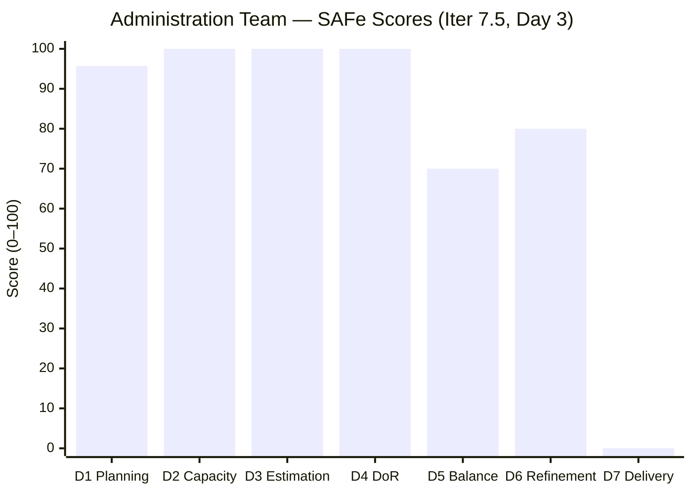
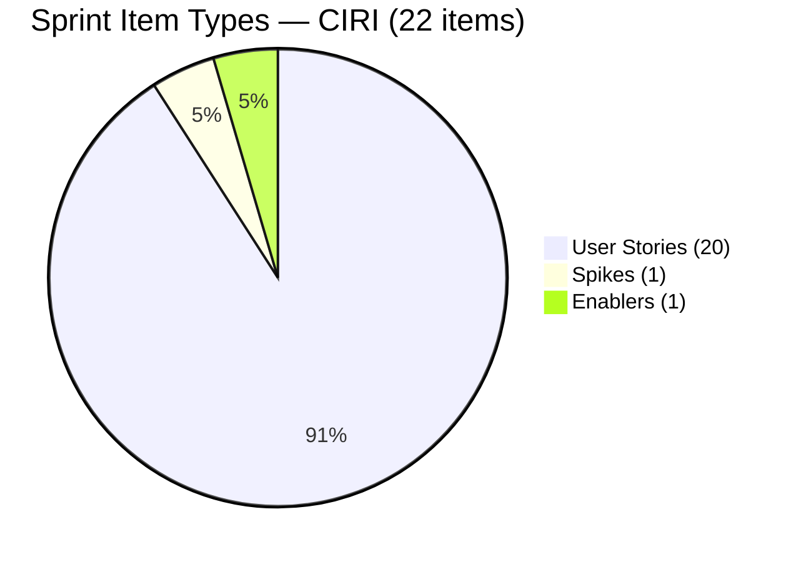
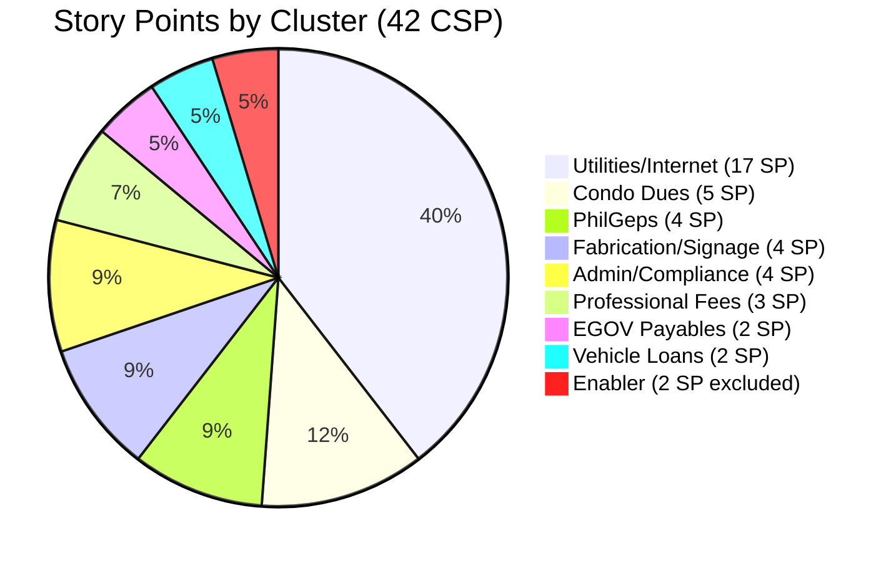

# ADO SAFe Audit — Administration Team

## 1. Audit Metadata

| Field | Value |
|-------|-------|
| **Project** | Jairosoft FINOPS |
| **Team** | Administration Team |
| **Workspace** | `ado_admin` |
| **ADO Project ID** | e0bb302f-40f9-46c3-8164-6f1acb317d63 |
| **ADO Team ID** | a38a9c02-07ab-483d-a1e3-aff54e19e603 |
| **Iteration** | Iteration 7.5 |
| **Iteration Start** | 2026-06-01 |
| **Iteration Finish** | 2026-06-14 |
| **Sprint Day** | Day 3 of 14 |
| **Audit Date/Time** | 2026-06-03 02:08 UTC |
| **Prior Audit** | AUDIT_20260602_0907.md (Day 2, Iteration 7.5, 78.0 — Moderate Risk) |
| **Overall Score** | **78.0 / 100** |
| **Risk Band** | **Moderate Risk** |

---

## 2. Executive Summary

The Administration Team remains at **78.0 / 100 (Moderate Risk)** entering Day 3 of Iteration 7.5 — unchanged for the third consecutive day. No items have been closed, no states updated, and no new items added since the sprint opened on June 1. The backlog is structurally identical to the Day 1 and Day 2 snapshots.

**Key strengths:** Perfect scores in Estimation (100.0), DoR Compliance (100.0), and Team Capacity (100.0). Strong iteration planning at 95.7 (22 of 23 backlog items committed to the active sprint). All 22 sprint items carry rich, multi-paragraph descriptions and measurable acceptance criteria.

**Primary risk — Delivery Predictability (0.0):** 42 SP committed, 0 SP closed. Three full sprint days have elapsed with zero ADO closure events. Six items carry past-due payment dates (May 26–31) and should have been closed on or before those dates. Continued inaction will make this sprint's 0.0 DP outcome structurally identical to Iteration 7.4's close-out.

**Secondary risk — Work Item Balance (70.0):** User Story dominance at 90.9% continues to trigger the rubric's Penalty B (-30). This reflects the Administration Team's operational nature and is unlikely to change without deliberate reclassification of support items.

**Bus factor = 1:** Mark Colina remains the sole contributor across all 22 items and 42 SP. No mitigation has been implemented across consecutive audits.

---

## 3. Previous Audit Delta

**Prior audit:** AUDIT_20260602_0907.md — Iteration 7.5, Day 2, Score 78.0 / 100 (Moderate Risk)

| Dimension | Day 2 | Day 3 | Delta | Driver |
|-----------|-------|-------|-------|--------|
| D1 Iteration Planning | 95.7 | **95.7** | 0.0 | No change in CIRI or VRBI; 203693 still in PI8 |
| D2 Team Capacity | 100.0 | **100.0** | 0.0 | Mark Colina 5 hrs/day; structure unchanged |
| D3 Estimation | 100.0 | **100.0** | 0.0 | All 21 PECI items still estimated |
| D4 DoR Compliance | 100.0 | **100.0** | 0.0 | All 22 CIRI items pass DoR thresholds |
| D5 Work Item Balance | 70.0 | **70.0** | 0.0 | Composition unchanged: 20 US, 1 Spike, 1 Enabler |
| D6 Backlog Refinement | 80.0 | **80.0** | 0.0 | 12/22 CIRI items still untouched since before sprint start |
| D7 Delivery Predictability | 0.0 | **0.0** | 0.0 | No closures; 0/42 SP delivered through Day 3 |
| **Overall** | **78.0** | **78.0** | **0.0** | Fully static backlog — no ADO activity since Day 1 |

**Observation:** The backlog has been completely static for 72+ hours. No work item state changes, no new items, and no ADO activity have been recorded since the sprint-opening updates on June 1 (the last changes were at 2026-06-01T06:11 UTC). The six past-due items (May 26–31) persist in Ready or New state three days past their stated deadlines.

**Prior sprint context (Iteration 7.4):** The final Iteration 7.4 audit closed at 74.1 (Moderate Risk) with 0.0 Delivery Predictability at close-out. That sprint pattern — items completed but not closed in ADO before audit — is repeating in 7.5. Three days without a single closure event intensifies this pattern risk from medium to high.

---

## 4. Current Iteration Snapshot

| Attribute | Value |
|-----------|-------|
| **Active Iteration** | Iteration 7.5 |
| **Sprint Duration** | 2026-06-01 to 2026-06-14 (14 days) |
| **Audit Day** | **Day 3 of 14** |
| **Total Visible Backlog Root Items (VRBI)** | **23** |
| **Current Iteration Root Items (CIRI)** | **22** |
| **Sprint Load %** | **95.7%** |
| **Point-Eligible Items (PECI)** | **21** (20 User Stories + 1 Spike) |
| **Estimated Items (ECI)** | **21** |
| **Committed Story Points (CSP)** | **42 SP** |
| **Closed Story Points (CLSP)** | **0 SP** |
| **Delivery %** | **0.0%** |
| **Item States** | Ready: 20 · New: 2 · Closed: 0 |
| **Active Team Members (CW)** | **1** (Mark Colina) |
| **Team Capacity** | 5 hrs/day (Deployment 1, Documentation 2, Requirements 2); 0 days off |
| **Out-of-sprint Item** | 203693 (Admin CR sink — PI8 Iter 8.5, Blocked) |
| **Untouched CIRI Items** | 12 (ChangedDate before 2026-06-01T00:00:00Z) |
| **Past-Due Items Still Open** | 6 (due dates May 26–31) |
| **Days Elapsed** | 3 of 14 (21.4% complete) |
| **Remaining Days** | 11 |

---

## 5. Work Item Analysis

| ID | Title | Type | State | SP | Assignee | DoR | ChangedDate |
|----|-------|------|-------|----|----------|-----|-------------|
| 202366 | Philgeps renewal for 2026 | User Story | Ready | 3 | Mark Colina | PASS | 2026-05-31 |
| 203557 | Utilities payables for Cebu and Davao May 29, 2026 | User Story | Ready | 4 | Mark Colina | PASS | 2026-05-31 |
| 203558 | Condo dues (Cebu) payables May 28, 2026 | User Story | Ready | 3 | Mark Colina | PASS | 2026-05-27 |
| 204136 | 3 vendors for flag pole | Spike | Ready | 1 | Mark Colina | PASS | 2026-05-31 |
| 204305 | Philgeps renewal payment | User Story | Ready | 1 | Mark Colina | PASS | 2026-05-31 |
| 204367 | Government (EGOV) payables May 29, 2026 | User Story | Ready | 2 | Mark Colina | PASS | 2026-05-31 |
| 204387 | Payables - Internet for Davao and Cebu office May 30, 2026 | User Story | Ready | 2 | Mark Colina | PASS | 2026-05-31 |
| 204394 | Utilities payables for Cebu May 28-31, 2026 | User Story | Ready | 2 | Mark Colina | PASS | 2026-05-31 |
| 204448 | Condo dues (Cebu) payables May 26, 2026 | User Story | Ready | 2 | Mark Colina | PASS | 2026-05-27 |
| 204452 | Professional fee payables | User Story | Ready | 3 | Mark Colina | PASS | 2026-05-27 |
| 204536 | Gcash business registration for Jairosoft Inc. | Enabler | Ready | 2 | Mark Colina | PASS | 2026-05-31 |
| 205087 | Toyota Fortuner car loan (Cebu) | User Story | Ready | 1 | Mark Colina | PASS | 2026-05-31 |
| 205166 | Philippine flag pole fabrication | User Story | Ready | 1 | Mark Colina | PASS | 2026-06-01 |
| 205167 | Submission of JIT panaflex logo | User Story | Ready | 1 | Mark Colina | PASS* | 2026-06-01 |
| 205168 | Submission of Jairosoft panaflex logo | User Story | Ready | 1 | Mark Colina | PASS | 2026-06-01 |
| 205339 | Internet payables for Davao and Cebu office | User Story | Ready | 4 | Mark Colina | PASS | 2026-06-01 |
| 205340 | Utilities payables for Cebu and Davao June 3, 2026 | User Story | Ready | 3 | Mark Colina | PASS | 2026-06-01 |
| 205348 | Toyota Hilux (Car loan) Cebu | User Story | Ready | 1 | Mark Colina | PASS | 2026-06-01 |
| 205351 | Jairosoft employee food allowance | User Story | Ready | 1 | Mark Colina | PASS | 2026-06-01 |
| 205353 | Utilities payables for Cebu June 12-13, 2026 | User Story | Ready | 2 | Mark Colina | PASS | 2026-06-01 |
| 205358 | Submit DOLE WAIR report | User Story | New | 1 | Mark Colina | PASS* | 2026-06-01 |
| 205367 | Davao Admin Adhoc Support June 1-14, 2026 cutoff | User Story | New | 2 | Mark Colina | PASS | 2026-06-01 |

*205167: Description opens with "he JIT" (typo — "The JIT"); content exceeds DoR threshold. PASS on length.
*205358: Description opens with "his activity" (typo — "This activity"); content exceeds DoR threshold. PASS on length.

**Note:** Today (June 3) is the due date for item 205340 ("Utilities payables for Cebu and Davao June 3, 2026"). This item should be closed today if the payment is processed.

**Out-of-sprint item:**

| ID | Title | Type | State | SP | IterationPath | ChangedDate |
|----|-------|------|-------|----|---------------|-------------|
| 203693 | Admin CR sink cabinet | Defect | Blocked | 3 | 2026-PI8\Iteration 8.5 | 2026-05-31 |

**Past-due items (due date in title has passed):**

| ID | Title | Due Date | SP | Days Past Due |
|----|-------|----------|----|---------------|
| 204448 | Condo dues (Cebu) payables May 26, 2026 | May 26 | 2 | 8 |
| 203558 | Condo dues (Cebu) payables May 28, 2026 | May 28 | 3 | 6 |
| 204394 | Utilities payables for Cebu May 28-31, 2026 | May 28-31 | 2 | 3–6 |
| 203557 | Utilities payables for Cebu and Davao May 29, 2026 | May 29 | 4 | 5 |
| 204367 | Government (EGOV) payables May 29, 2026 | May 29 | 2 | 5 |
| 204387 | Payables - Internet for Davao and Cebu office May 30, 2026 | May 30 | 2 | 4 |
| 205340 | Utilities payables for Cebu and Davao June 3, 2026 | June 3 | 3 | **due today** |

---

## 6. SAFe Compliance Scorecard

| Dimension | Score | Evidence (Numerator / Denominator) | Notes |
|-----------|-------|-------------------------------------|-------|
| D1 Iteration Planning | **95.7** | 22 CIRI / 23 VRBI | 203693 correctly deferred to PI8 Iter 8.5 |
| D2 Team Capacity | **100.0** | 1 CC / 1 CW | Mark Colina: 5 hrs/day configured; grace = 0 hrs/day, no CIRI items |
| D3 Estimation | **100.0** | 21 ECI / 21 PECI | All 20 User Stories + 1 Spike estimated; Enabler excluded from PECI |
| D4 DoR Compliance | **100.0** | 22 DCI / 22 CIRI | All items have Description ≥ 30 and AC ≥ 20 stripped chars |
| D5 Work Item Balance | **70.0** | US = 20/22 = 90.9% > 60% → Penalty B -30 | No US-absent penalty; Spike 4.5% < 40% |
| D6 Backlog Refinement | **80.0** | base 100.0 − 20 (untouched penalty) | stale_90 = 0; stale_180 = 0; untouched 12/22 = 54.5% > 30% |
| D7 Delivery Predictability | **0.0** | 0 CLSP / 42 CSP | Day 3 — 7 items with past-due or today-due dates still open |
| **Overall** | **78.0** | (95.7+100+100+100+70+80+0)/7 | **Moderate Risk** |

---

## 7. Dimension Findings

### 7.1 Iteration Planning (95.7 — Low Risk)

**VRBI:** 23 items (backlog API).
**CIRI:** 22 items in `Jairosoft FINOPS\2026-PI7\Iteration 7.5`.
**Formula:** round(22 / 23 × 100, 1) = **95.7**

Sprint load is excellent at 95.7%. Item 203693 (Admin CR sink cabinet, Defect, Blocked, 3 SP) remains correctly staged in `2026-PI8\Iteration 8.5` with last update 2026-05-31. The sprint structure is unchanged from Day 1.

The 22-item sprint at 42 SP across a single contributor represents a 45% volume increase over Iteration 7.4 (15 items, 29 SP). At 5 hrs/day over 14 days (70 effective hours), the sprint is committed at ~0.6 SP/effective hour. This is historically aggressive for this team.

---

### 7.2 Team Capacity (100.0 — Low Risk)

**CW:** 1 — Mark Colina (all 22 CIRI items).
**CC:** 1 — Mark Colina: Deployment 1 hr/day + Documentation 2 hrs/day + Requirements 2 hrs/day = **5 hrs/day**. No days off.
**Formula:** round(1 / 1 × 100, 1) = **100.0**

Grace (grace@jairosoft.com) appears in the capacity configuration with Administration activity at 0 hrs/day and holds no CIRI items. She does not satisfy CC criteria (positive capacity required) and does not affect D2.

**Bus factor = 1:** Mark Colina is the sole contributor across all 22 items and 42 SP. No succession or backup plan is documented. This remains the team's most persistent unmitigated organizational risk.

---

### 7.3 Estimation (100.0 — Low Risk)

**PECI:** 20 User Stories + 1 Spike = **21 items**.
**ECI:** All 21 carry SP > 0 (range: 1–4 SP).
**Formula:** round(21 / 21 × 100, 1) = **100.0**

SP distribution: 1 SP (×9), 2 SP (×5), 3 SP (×4), 4 SP (×3). CSP = 42 SP. Enabler 204536 (GCash registration, 2 SP) is excluded from PECI per rubric definition. Estimation discipline is sustained across Day 3.

---

### 7.4 DoR Compliance (100.0 — Low Risk)

**CIRI:** 22 items.
**DCI:** 22 — all pass Description ≥ 30 non-whitespace chars AND Acceptance Criteria ≥ 20 non-whitespace chars.
**Formula:** round(22 / 22 × 100, 1) = **100.0**

Two persistent typos remain unresolved for the third consecutive day:
- **205358** ("Submit DOLE WAIR report"): Description opens with "his activity" — should be "This activity". Rev=2, unchanged since 2026-06-01.
- **205167** ("Submission of JIT panaflex logo"): Description opens with "he JIT" — should be "The JIT". Rev=8, unchanged since 2026-06-01.

Both pass the DoR length thresholds. Neither should appear uncorrected in a sprint review.

---

### 7.5 Work Item Balance (70.0 — Moderate Risk)

**CIRI type distribution (22 items):**
- User Story: 20 (90.9%)
- Spike: 1 (4.5%)
- Enabler: 1 (4.5%)

| Penalty | Check | Result |
|---------|-------|--------|
| A (no User Story in CIRI) | 20 US present | 0 |
| B (dominant type > 60%) | US = 90.9% > 60% | **−30** |
| C (spike share > 40%) | Spike = 4.5% < 40% | 0 |

**Formula:** max(0, 100 − 30) = **70.0**

The 90.9% US dominance is structurally driven by the Admin Team's operational work pattern (payables, renewals, compliance). Achieving sub-60% US share would require reclassifying approximately 7 items as Enablers or Spikes — a sustainable approach only if these categories are applied consistently across iterations.

---

### 7.6 Backlog Refinement (80.0 — Low Risk)

**Fresh window:** ChangedDate ≥ 2026-04-19 (45 days before 2026-06-03).
**Fresh VRBI:** 23/23 — all items last changed 2026-05-27 or later.
**Stale_90** (ChangedDate < 2026-03-04): 0 items → no penalty.
**Stale_180** (ChangedDate < 2025-12-05): 0 items → no penalty.

**Untouched CIRI** (ChangedDate before 2026-06-01T00:00:00Z):
- Changed May 27: 203558, 204448, 204452 = 3 items
- Changed May 31: 202366, 203557, 204136, 204305, 204367, 204387, 204394, 204536, 205087 = 9 items
- Total untouched = **12 items** (unchanged since Day 1)

Untouched ratio: 12/22 = 54.5% > 30% → **penalty −20**.

**Formula:** max(0, 100.0 − 20) = **80.0**

The 12 untouched items were actively refined in May 27–31 (within 5 days of sprint start) and carry full DoR content — they are not stale by content, only by the rubric's ChangedDate-after-sprint-start criterion. Transitioning their state from "Ready" to "In Progress" at sprint kickoff would reset ChangedDate and eliminate this penalty.

---

### 7.7 Delivery Predictability (0.0 — Critical Risk)

**CSP:** 42 SP (21 PECI items).
**CLSP:** 0 SP — no items in Closed or Done state.
**Formula:** round(0 / 42 × 100, 1) = **0.0**

By Day 3, a 0.0 Delivery Predictability score is escalating beyond early-sprint tolerance. Seven items now have due dates on or before today (June 3): the original six past-due items plus 205340 (due today). If payments corresponding to May 26–31 due dates were completed during Iteration 7.4 or prior to sprint start, those items should already be Closed in ADO.

**Delivery scenario analysis:**

| Scenario | Items Closed | CLSP | D7 | Overall |
|----------|-------------|------|----|---------|
| Current (Day 3) | 0 | 0 SP | 0.0 | 78.0 |
| Close 6 past-due items | 6 | 15 SP | 35.7 | 80.1 |
| Close 7 (incl. today's) | 7 | 18 SP | 42.9 | 81.3 |
| Close all 22 | 22 | 42 SP | 100.0 | 92.2 |

The difference between 78.0 (current) and 80.1 (Low Risk threshold) is 6 item closures representing 15 SP already past due.

---

## 8. Risks and Bottlenecks

| Risk | Severity | Items Affected | Status |
|------|----------|----------------|--------|
| 7 items with due dates May 26 – June 3 remain open | **Critical** | 204448, 203558, 204394, 203557, 204367, 204387, 205340 (19 SP) | Escalating — Day 3 with no closures |
| 0 SP delivered at Day 3 — pattern risk from Iter 7.4 | **High** | All 42 SP | No ADO closure events across 3 full sprint days |
| Same-day ADO closure discipline missing | **High** | Structural | Root cause of 0.0 DP close-outs across multiple iterations |
| US dominance 90.9% — balance cap at 70.0 | **Medium** | Sprint composition | Structural; reclassification of 3–4 items would help |
| 12/22 CIRI items untouched since before sprint start | **Medium** | D6 penalty -20 | Actionable: state transition to "In Progress" resolves it |
| Bus factor = 1 (Mark Colina) | **Medium** | All 22 items, 42 SP | Persistent across 15+ audits; no mitigation in sight |
| Sprint volume 42 SP vs Iter 7.4's 29 SP (+45%) | **Medium** | All CIRI | Higher load on single contributor at same capacity |
| Typos unfixed in 205358 and 205167 | **Low** | 2 items | Day 3; still unresolved; fix before sprint review |
| 203693 blocked in PI8 | **Low** | 1 item (PI8) | Vendor dependency; document before PI8 planning |

---

## 9. Prioritized Recommendations

1. **Close all past-due items today (Day 3) — critical.** Items 204448 (May 26), 203558 (May 28), 204394 (May 28-31), 203557 (May 29), 204367 (May 29), 204387 (May 30), and 205340 (June 3 — due today) account for 19 SP. If the underlying payments or obligations have been fulfilled, transitioning these to Closed in ADO immediately contributes 19 SP to CLSP, raising D7 to 45.2 and the overall score to approximately 84.7 (Low Risk).

2. **Establish same-day ADO closure as a non-negotiable practice.** Three consecutive audit days with 0 SP delivered demonstrate a structural process gap. The underlying payments are almost certainly occurring (these are time-bound financial obligations) but are not being reflected in ADO. Mark should close items in ADO on the same day the payment, submission, or action is completed — not at sprint end.

3. **Move the 12 untouched CIRI items to "In Progress" today.** Items 202366, 203557, 203558, 204136, 204305, 204367, 204387, 204394, 204448, 204452, 204536, 205087 have not received any ADO update since before the sprint began. Transitioning them to "In Progress" or "Active" resets their ChangedDate to within the sprint window, drops the untouched ratio from 54.5% to 0%, removes the -20 Backlog Refinement penalty, and raises D6 from 80.0 to 100.0 (+2.9 overall points).

4. **Fix the two description typos in 205358 and 205167 before Day 5.** "his activity" → "This activity" (205358) and "he JIT" → "The JIT" (205167). These are copy-paste corrections that take under 30 seconds each. They have persisted across three audit days without remediation.

5. **Reclassify 3–4 operational items as Enablers to reduce US dominance below 80%.** Consider reclassifying 205358 (DOLE WAIR compliance report), 205351 (employee food allowance — HR operational), and one of the recurring payables as Enabler types. Each reclassification brings US share closer to the 60% threshold where Penalty B is eliminated. Reaching 13 or fewer User Stories out of 22 removes the penalty entirely and raises D5 to 100.0.

6. **Configure grace (grace@jairosoft.com) as an active contributor or remove her from team capacity.** Grace currently has 0 hrs/day configured and holds no work items. If she is available to help with administrative work, assigning even 2–3 items reduces bus-factor concentration. If she is inactive, removing her from the capacity configuration removes ambiguity in future audits.

7. **Document the vendor dependency for 203693 before PI8 planning begins.** The Admin CR sink cabinet (Defect, Blocked, PI8 Iter 8.5) has an unresolved vendor dependency. Before PI8 sprint planning (~late June), document the vendor name, expected delivery timeline, procurement status, and escalation owner directly in the ADO item description.

8. **Review sprint load vs. single-contributor capacity at Day 5.** With 5 hrs/day over 14 days = 70 effective hours and historical delivery rates of 60–70%, the realistically deliverable SP is approximately 26–30 SP. The 42 SP commitment exceeds this range. If mid-sprint velocity is insufficient by Day 5, identify the 10–15 lowest-priority SP for potential deferral to Iteration 7.6.

---

## 10. Evidence Gaps and Limitations

- **Closed items depart the backlog API.** When items transition to Closed in ADO, the backlog API (`wit_list_backlog_work_items`) may stop returning them. If Mark has closed items outside the visible sprint window, those closures would not appear in this audit. The 0.0 DP score reflects ADO-visible evidence only, not actual business outcomes.
- **Grace's role is unresolved.** Grace appears in team capacity with 0 hrs/day Administration activity. Her organizational role, active engagement status, and whether she holds items outside the visible backlog are unknown from API data.
- **Enabler 204536 excluded from D3/D7.** GCash registration (2 SP) is an Enabler type and excluded from PECI. CSP = 42 SP (PECI-eligible items only). If included, CSP = 44 SP and D7 remains 0.0.
- **203693 remains visible in VRBI.** The blocked Defect (PI8 Iter 8.5) is returned by the backlog API as one of 23 VRBI items. It is correctly excluded from CIRI (22) because its IterationPath does not match the active iteration.
- **Untouched item timezone boundary.** All 12 untouched CIRI items have ChangedDate of 2026-05-27 or 2026-05-31 UTC — unambiguously before the 2026-06-01T00:00:00Z sprint start. The comparison is definitive.
- **Day 3 early-sprint annotation.** The 0.0 Delivery Predictability score is applied as-is per the rubric. The early-sprint annotation applies through Day 5. From Day 6 onward, 0.0 DP becomes a direct performance signal requiring escalation.

---

## Appendix: Score Visualization

**Score Trend — Recent Audits:**

| Audit | Iteration | Day | Score | Band |
|-------|-----------|-----|-------|------|
| AUDIT_20260529_0900 | Iter 7.4 | Day 12 | 74.1 | Moderate |
| AUDIT_20260601_0203 | Iter 7.5 | Day 1 | 78.0 | Moderate |
| AUDIT_20260602_0907 | Iter 7.5 | Day 2 | 78.0 | Moderate |
| **AUDIT_20260603_0208** | **Iter 7.5** | **Day 3** | **78.0** | **Moderate** |

**Past-Due Items — Immediate Action Required:**

| ID | Title | Due Date | SP | Days Overdue |
|----|-------|----------|----|-------------|
| 204448 | Condo dues (Cebu) May 26 | May 26 | 2 | 8 |
| 203558 | Condo dues (Cebu) May 28 | May 28 | 3 | 6 |
| 204394 | Utilities payables Cebu May 28-31 | May 28-31 | 2 | 3–6 |
| 203557 | Utilities payables Cebu/Davao May 29 | May 29 | 4 | 5 |
| 204367 | EGOV payables May 29 | May 29 | 2 | 5 |
| 204387 | Internet payables Davao/Cebu May 30 | May 30 | 2 | 4 |
| 205340 | Utilities payables Cebu/Davao June 3 | June 3 | 3 | **due today** |

Closing all 7 → CLSP = 19 SP → D7 = 45.2 → **Overall ≈ 84.7 (Low Risk)**
