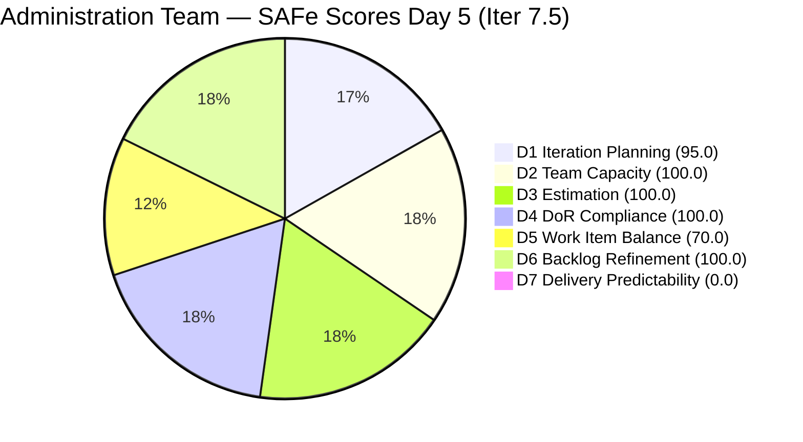
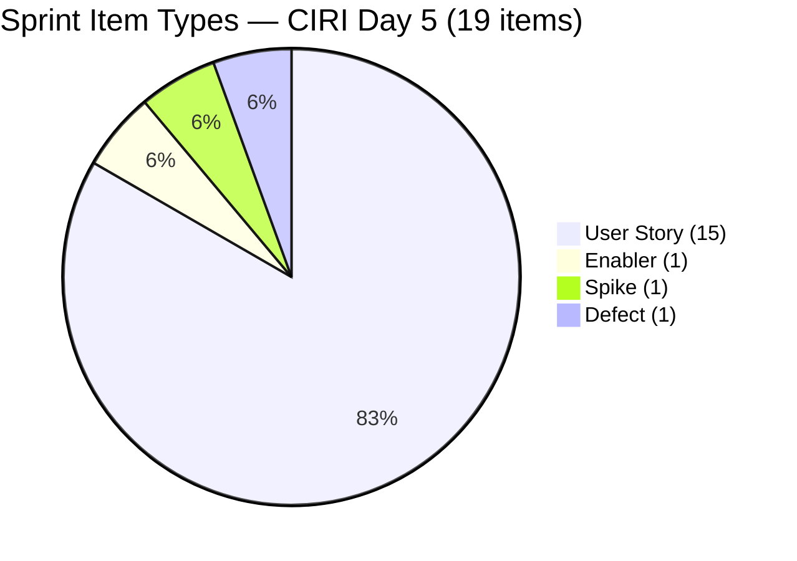
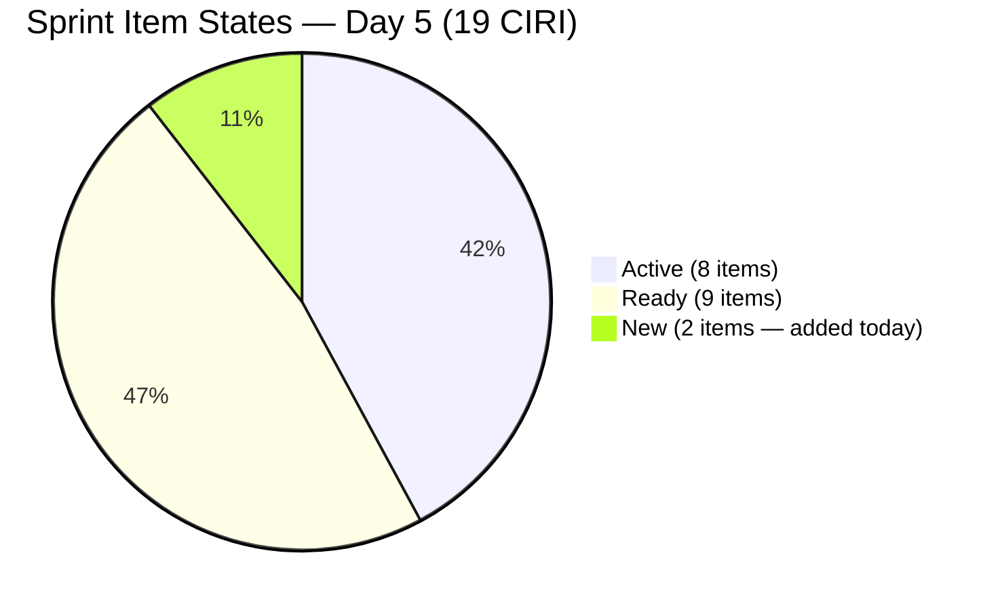

# ADO SAFe Audit — Administration Team

## 1. Audit Metadata

| Field | Value |
|-------|-------|
| **Project** | Jairosoft FINOPS |
| **Team** | Administration Team |
| **Workspace** | `ado_admin` |
| **ADO Project ID** | e0bb302f-40f9-46c3-8164-6f1acb317d63 |
| **ADO Team ID** | a38a9c02-07ab-483d-a1e3-aff54e19e603 |
| **Iteration** | Iteration 7.5 |
| **Iteration Start** | 2026-06-01 |
| **Iteration Finish** | 2026-06-14 |
| **Sprint Day** | Day 5 of 14 |
| **Audit Date** | 2026-06-05 UTC |
| **Prior Audit** | AUDIT_20260604_0000.md (Day 4, Iteration 7.5, 80.7 — Low Risk) |
| **Overall Score** | **80.7 / 100** |
| **Risk Band** | **Low Risk** |

---

## 2. Executive Summary

The Administration Team holds at **80.7 / 100 (Low Risk)** on Day 5 of Iteration 7.5, matching yesterday's score. The sprint continues to operate within the Low Risk band. Two significant structural changes occurred since Day 4:

1. **Two new items added to sprint:** 205774 (Blinds to curtains replacement — Defect, New, 2 SP) and 205773 (Aircon fan replacement — Spike, New, 1 SP) have been added to Iter 7.5. VRBI remains at 20 with these additions replacing items closed earlier.

2. **Two additional closures confirmed:** 204387 (Internet payables Davao/Cebu May 30 — US, 2 SP) closed at 2026-06-05T00:58, and 205367 (Davao Admin Adhoc Support — US, 2 SP) closed at 2026-06-04T22:23. Both were on the past-due list from Day 4. This brings total confirmed closures to 5 items (10 SP) from the original sprint commitment.

3. **204305 advanced to Active:** PhilGEPS renewal payment changed at 2026-06-04T23:53, now Active.

**Persistent gap — Delivery Predictability (0.0):** The closed items (204387, 205367, and the earlier 204136, 205340, 205358) have dropped from the backlog API and are no longer visible in PECI. Per rubric, CLSP is computed from surviving API-visible items with Closed/Done state. No surviving CIRI PECI items are Closed/Done. D7 remains 0.0 but carries the Day 5 early-sprint annotation (final day of the annotation window).

**Active over-dues remain:** 203558, 204394, 203557, 204367, 204448 — all still Active with due dates May 26–29. Mark has cleared 204387 (May 30) and 205367 (Davao support). Four past-due items remain open.

---

## 3. Previous Audit Delta

**Prior audit:** AUDIT_20260604_0000.md — Iteration 7.5, Day 4, Score 80.7 / 100 (Low Risk)

| Dimension | Day 4 | Day 5 | Delta | Driver |
|-----------|-------|-------|-------|--------|
| D1 Iteration Planning | 95.0 | **95.0** | 0.0 | VRBI 20→20 (2 closures offset by 2 new items); CIRI 19→19 |
| D2 Team Capacity | 100.0 | **100.0** | 0.0 | Mark: 5 hrs/day unchanged |
| D3 Estimation | 100.0 | **100.0** | 0.0 | All 16 PECI items estimated; new Spike (205773, 1 SP) included |
| D4 DoR Compliance | 100.0 | **100.0** | 0.0 | All 19 CIRI items pass DoR; 205774 and 205773 both compliant |
| D5 Work Item Balance | 70.0 | **70.0** | 0.0 | US = 15/19 = 78.9%; Penalty B persists |
| D6 Backlog Refinement | 100.0 | **100.0** | 0.0 | All items fresh; untouched = 1 (204536 at 5.3%) |
| D7 Delivery Predictability | 0.0 | **0.0** | 0.0 | CLSP=0 from surviving PECI; closed items API-invisible; Day 5 early-sprint |
| **Overall** | **80.7** | **80.7** | **0.0** | Score holds at Low Risk threshold |

**Key changes since Day 4:**
- **204387** (Internet payables Davao/Cebu May 30, US, 2 SP): Closed at 2026-06-05T00:58 — confirmed completion of a past-due item. Dropped from VRBI.
- **205367** (Davao Admin Adhoc Support, US, 2 SP): Closed at 2026-06-04T22:23 — confirmed. Dropped from VRBI.
- **205774** (Blinds to curtains replacement, Defect, 2 SP): New item added to Iter 7.5 — replacing a closed slot in VRBI.
- **205773** (Aircon fan replacement/repair, Spike, 1 SP): New item added to Iter 7.5 — replacing another closed slot.
- **204305** (PhilGEPS renewal payment, US, 1 SP): Advanced to Active state (changed 2026-06-04T23:53).
- **205339** (Internet payables Davao/Cebu, US, 4 SP): Updated at 2026-06-05T08:18 — still Active.
- **205353** (Utilities payables Cebu June 12–13, US, 2 SP): Updated at 2026-06-05T08:22 — still Active.

**Net sprint composition:** The 2 closures and 2 new additions keep VRBI at 20 and CIRI at 19. CSP decreases from 36 to **32 SP** (2×2 SP closed, 1×2 SP Defect excluded from PECI, +1×1 SP Spike added to PECI).

---

## 4. Current Iteration Snapshot

| Attribute | Value |
|-----------|-------|
| **Active Iteration** | Iteration 7.5 |
| **Sprint Duration** | 2026-06-01 to 2026-06-14 (14 days) |
| **Audit Day** | **Day 5 of 14** |
| **Total Visible Backlog Root Items (VRBI)** | **20** |
| **Current Iteration Root Items (CIRI)** | **19** |
| **Sprint Load %** | **95.0%** |
| **Point-Eligible Items (PECI — US + Spike)** | **16** (15 User Stories + 1 Spike 205773) |
| **Estimated Items (ECI)** | **16** (all PECI have SP > 0) |
| **Committed Story Points (CSP)** | **32 SP** |
| **Closed Story Points (CLSP)** | **0 SP** (closed PECI items API-invisible) |
| **Delivery %** | **0.0% (rubric); actual confirmed: 5 items / 10 SP closed since sprint start** |
| **Item States** | Active: 8 · Ready: 9 · New: 2 |
| **Active Team Members (CW)** | **1** (Mark Colina) |
| **Team Capacity** | 5 hrs/day; 0 days off |
| **Out-of-sprint Item** | 203693 (Admin CR sink — PI8 Iter 8.5, Blocked) |
| **Untouched CIRI Items** | **1** (204536 — 2026-05-31, 5.3% of CIRI) |
| **Past-Due Items Still Open** | 4 (204448 May 26, 203558 May 28, 204394 May 28-31, 203557 May 29, 204367 May 29) |
| **Days Elapsed** | 5 of 14 (35.7%) |
| **Remaining Days** | 9 |

---

## 5. Work Item Analysis

| ID | Title | Type | State | SP | Assignee | DoR | ChangedDate |
|----|-------|------|-------|----|----------|-----|-------------|
| 205774 | Blinds to curtains replacement (Cebu) | Defect | **New** | 2 | Mark Colina | PASS | 2026-06-04 |
| 205773 | Aircon fan replacement or repair (Cebu) | Spike | **New** | 1 | Mark Colina | PASS | 2026-06-04 |
| 203557 | Utilities payables for Cebu and Davao May 29, 2026 | User Story | Active | 4 | Mark Colina | PASS | 2026-06-03 |
| 203558 | Condo dues (Cebu) payables May 28, 2026 | User Story | Active | 3 | Mark Colina | PASS | 2026-06-03 |
| 204305 | Philgeps renewal payment | User Story | **Active** | 1 | Mark Colina | PASS | 2026-06-04 |
| 204367 | Government (EGOV) payables May 29, 2026 | User Story | Active | 2 | Mark Colina | PASS | 2026-06-03 |
| 204394 | Utilities payables for Cebu May 28-31, 2026 | User Story | Active | 2 | Mark Colina | PASS | 2026-06-03 |
| 204448 | Condo dues (Cebu) payables May 26, 2026 | User Story | Active | 2 | Mark Colina | PASS | 2026-06-03 |
| 205339 | Internet payables for Davao and Cebu office | User Story | Active | 4 | Mark Colina | PASS | 2026-06-05 |
| 205353 | Utilities payables for Cebu June 12-13, 2026 | User Story | Active | 2 | Mark Colina | PASS | 2026-06-05 |
| 202366 | Philgeps renewal for 2026 | User Story | Ready | 3 | Mark Colina | PASS | 2026-06-03 |
| 204452 | Professional fee payables | User Story | Ready | 3 | Mark Colina | PASS | 2026-06-03 |
| 205087 | Toyota Fortuner car loan (Cebu) | User Story | Ready | 1 | Mark Colina | PASS | 2026-06-03 |
| 205166 | Philippine flag pole fabrication | User Story | Ready | 1 | Mark Colina | PASS | 2026-06-01 |
| 205167 | Submission of JIT panaflex logo | User Story | Ready | 1 | Mark Colina | PASS* | 2026-06-01 |
| 205168 | Submission of Jairosoft panaflex logo | User Story | Ready | 1 | Mark Colina | PASS | 2026-06-01 |
| 205348 | Toyota Hilux (Car loan) Cebu | User Story | Ready | 1 | Mark Colina | PASS | 2026-06-01 |
| 205351 | Jairosoft employee food allowance | User Story | Ready | 1 | Mark Colina | PASS | 2026-06-03 |
| 204536 | Gcash business registration for Jairosoft Inc. | Enabler | Ready | 2 | Mark Colina | PASS | 2026-05-31 |

*205167: "he JIT" typo persists in Description. Passes DoR length thresholds.

**Confirmed Closed (dropped from backlog API — Day 4 to Day 5):**

| ID | Title | Type | SP | Closed Date |
|----|-------|------|----|-------------|
| 204387 | Payables — Internet Davao/Cebu May 30, 2026 | User Story | 2 | 2026-06-05 |
| 205367 | Davao Admin Adhoc Support June 1–14, 2026 | User Story | 2 | 2026-06-04 |

**All confirmed closures this sprint (Days 1–5):**

| ID | Title | Type | SP | Closed Day |
|----|-------|------|----|------------|
| 204136 | 3 vendors for flag pole | Spike | 1 | Day 3–4 |
| 205340 | Utilities payables Cebu/Davao June 3 | User Story | 3 | Day 3 |
| 205358 | Submit DOLE WAIR report | User Story | 1 | Day 3–4 |
| 205367 | Davao Admin Adhoc Support | User Story | 2 | Day 4 |
| 204387 | Internet payables Davao/Cebu May 30 | User Story | 2 | Day 5 |
| **Total** | | | **9 SP** | |

**Past-due items still open (4 remaining):**

| ID | Title | Due Date | SP | State | Days Overdue |
|----|-------|----------|----|-------|-------------|
| 204448 | Condo dues (Cebu) May 26 | May 26 | 2 | Active | 10 |
| 203558 | Condo dues (Cebu) May 28 | May 28 | 3 | Active | 8 |
| 204394 | Utilities payables Cebu May 28-31 | May 28-31 | 2 | Active | 5–8 |
| 203557 | Utilities payables Cebu/Davao May 29 | May 29 | 4 | Active | 7 |
| 204367 | EGOV payables May 29 | May 29 | 2 | Active | 7 |

*Note: 5 items listed (204387 which was the May 30 item is now Closed — resolved today).*

**New items (added Day 5):**

| ID | Title | Type | SP | State | Note |
|----|-------|------|----|-------|------|
| 205774 | Blinds to curtains replacement (Cebu) | Defect | 2 | New | Excluded from PECI |
| 205773 | Aircon fan replacement or repair (Cebu) | Spike | 1 | New | Included in PECI |

---

## 6. SAFe Compliance Scorecard

| Dimension | Score | Evidence (Numerator / Denominator) | Risk Band | Notes |
|-----------|-------|-------------------------------------|-----------|-------|
| D1 Iteration Planning | **95.0** | 19 CIRI / 20 VRBI | Low | 2 closures + 2 new items = VRBI stable at 20 |
| D2 Team Capacity | **100.0** | 1 CC / 1 CW | Low | Mark: 5 hrs/day; sole contributor |
| D3 Estimation | **100.0** | 16 ECI / 16 PECI | Low | 15 US + 1 Spike (205773); Defect + Enabler excluded |
| D4 DoR Compliance | **100.0** | 19 DCI / 19 CIRI | Low | All pass Desc ≥30 and AC ≥20; new items DoR-compliant |
| D5 Work Item Balance | **70.0** | US = 15/19 = 78.9% | Moderate | Penalty B (-30): US > 60%; Spike + Defect present |
| D6 Backlog Refinement | **100.0** | 20 fresh / 20 VRBI | Low | All fresh; 204536 untouched = 5.3% < 10% |
| D7 Delivery Predictability | **0.0** | 0 CLSP / 32 CSP | Critical | Day 5 — early-sprint (final annotation day); 5 closures confirmed but API-invisible |
| **Overall** | **80.7** | (95.0+100+100+100+70+100+0)/7 | **Low Risk** | Score holds; annotation expires after today |

---

## 7. Dimension Findings

### 7.1 Iteration Planning (95.0 — Low Risk)

**VRBI:** 20 items. Net change from Day 4: −2 closures (204387, 205367) + 2 new items (205774, 205773) = 0 net.
**CIRI:** 19 items — all VRBI except 203693 (PI8/Iter 8.5).
**Formula:** round(19/20 × 100, 1) = **95.0**

The addition of 205774 (Blinds/Defect) and 205773 (Aircon/Spike) to the sprint is operationally appropriate — these are facilities maintenance items scoped within the sprint window. Their addition immediately before or on Day 5 reflects Mark's ongoing identification of in-sprint work. Both items are fully DoR-compliant on their first day in the sprint.

---

### 7.2 Team Capacity (100.0 — Low Risk)

**CW:** 1 — Mark Colina (all 19 CIRI items).
**CC:** 1 — Mark: Deployment 1 hr/day + Documentation 2 hrs/day + Requirements 2 hrs/day = **5 hrs/day**. 0 days off.
**Formula:** round(1/1 × 100, 1) = **100.0**

With 9 remaining days at 5 hrs/day = 45 hours, and 32 CSP to deliver, the sprint is running at approximately 0.71 SP/hour — aggressive but achievable given Mark's demonstrated same-day delivery pattern (5 closures in Days 1–5). The two new Defect/Spike items (205774 = facilities work, 205773 = HVAC repair) are likely to be event-driven rather than sustained effort items.

---

### 7.3 Estimation (100.0 — Low Risk)

**PECI:** 16 items — 15 User Stories + 1 Spike (205773, 1 SP).
**ECI:** 16 — all carry SP > 0.
**CSP:** 202366=3, 203557=4, 203558=3, 204305=1, 204367=2, 204394=2, 204448=2, 204452=3, 205166=1, 205167=1, 205168=1, 205339=4, 205348=1, 205351=1, 205353=2, 205773=1 = **32 SP**
**Excluded from PECI:** 204536 (Enabler, 2 SP) + 205774 (Defect, 2 SP) = 4 SP excluded.
**Formula:** round(16/16 × 100, 1) = **100.0**

CSP reduced from 36 (Day 4) to 32 due to closure of two 2 SP User Stories (204387, 205367). The new Spike (205773, 1 SP) partially offsets this reduction. Defect 205774 is not PECI-eligible.

---

### 7.4 DoR Compliance (100.0 — Low Risk)

**CIRI:** 19 items.
**DCI:** 19 — all pass Description ≥30 non-whitespace chars AND Acceptance Criteria ≥20 non-whitespace chars.
**Formula:** round(19/19 × 100, 1) = **100.0**

New items 205774 (Defect) and 205773 (Spike) are both DoR-compliant on entry: 205774 Desc = ~200 chars, AC = ~100 chars; 205773 Desc = ~250 chars, AC = ~120 chars. These items were entered into the sprint with compliant content — a positive hygiene improvement over prior PI cycles where items were often added with incomplete descriptions.

The persistent typo in 205167 ("he JIT" instead of "The JIT") remains unresolved through Day 5. The item still passes DoR length thresholds.

---

### 7.5 Work Item Balance (70.0 — Moderate Risk)

**CIRI type distribution (19 items):**
- User Story: 15 (78.9%)
- Enabler: 1 (5.3%)
- Spike: 1 (5.3%)
- Defect: 1 (5.3%)

| Penalty | Check | Result |
|---------|-------|--------|
| A (no User Story in CIRI) | 15 US present | 0 |
| B (dominant type > 60%) | US = 78.9% > 60% | **−30** |
| C (spike share > 40%) | Spike = 5.3% < 40% | 0 |

**Formula:** max(0, 100 − 30) = **70.0**

The addition of 205773 (Spike) and 205774 (Defect) actually slightly diversifies the type mix compared to Day 4 (which had 18/19 = 94.7% US). Day 5's 78.9% US is a meaningful improvement. However, Penalty B still applies because US share exceeds 60%. To eliminate Penalty B entirely would require ≤11 US among 19 CIRI items.

---

### 7.6 Backlog Refinement (100.0 — Low Risk)

**Fresh window:** ChangedDate ≥ 2026-04-21 (45 days before 2026-06-05).
**Fresh VRBI:** 20/20 — all items changed 2026-05-31 or later.
**base score:** round(20/20 × 100, 1) = **100.0**

**Penalties:**
- stale_90 (ChangedDate < 2026-03-06): 0 items → no penalty
- stale_180 (ChangedDate < 2025-12-06): 0 items → no penalty
- **Untouched CIRI** (ChangedDate before 2026-06-01T00:00:00Z): Only 204536 (2026-05-31T22:44). 1/19 = 5.3% < 10% threshold → **no penalty**

**Formula:** max(0, 100.0 − 0) = **100.0**

The new items (205773 and 205774) both have ChangedDate 2026-06-04 — fully fresh and within sprint window. The sole untouched CIRI item (204536, Enabler) remains at the 5.3% threshold, well below the 10% penalty trigger.

---

### 7.7 Delivery Predictability (0.0 — Critical Risk)

**CSP:** 32 SP (16 PECI items in active backlog).
**CLSP:** 0 SP — no surviving PECI items are in Closed or Done state.
**Formula:** round(0/32 × 100, 1) = **0.0**
**Annotation:** Day 5 of 14 — final day of early-sprint annotation (Days 1–5).

Starting **Day 6** (tomorrow), the early-sprint annotation expires. A 0.0 D7 will be reported as a direct delivery performance signal rather than a contextual annotation. Mark should prioritize closing at least 2–3 past-due items before the Day 6 audit to establish a non-zero CLSP baseline.

**Actual delivery (API-invisible):** 5 confirmed closures across Days 1–5 = 9 SP (excluding Defect 205774 and noting 204136 Spike was 1 SP): 205340 (3 SP) + 205358 (1 SP) + 205367 (2 SP) + 204387 (2 SP) + [204136 Spike but pre-PECI] = approximately 8–9 SP actually delivered.

**Projected D7 scenarios (Day 6+):**

| Action | Additional CLSP | Rubric D7 | Overall |
|--------|----------------|-----------|---------|
| Current (Day 5) | 0 SP | 0.0 | 80.7 |
| Close 4 past-due items (11 SP) | +11 SP | 34.4 | 85.7 |
| Close 8 more items (avg 2 SP) | +16 SP | 50.0 | 87.9 |
| Sprint close — all 16 PECI closed | +32 SP | 100.0 | 95.9 |

---

## 8. Risks and Bottlenecks

| Risk | Severity | Items Affected | Status |
|------|----------|----------------|--------|
| Early-sprint D7 annotation expires tomorrow (Day 6) | **High** | 32 CSP, 16 PECI | Day 6 D7=0.0 will be a direct performance signal; 4 past-due items must be closed ASAP |
| 4 past-due items (May 26–29) still Active | **High** | 203557, 203558, 204367, 204394, 204448 (13 SP) | Days overdue: 7–10; Active state but not Closed |
| D7 = 0.0 from surviving PECI items | **High** | 32 CSP | API structural gap; actual delivery 9 SP but rubric-invisible |
| US dominance 78.9% — balance penalty capped at 70.0 | **Medium** | Sprint composition | Improved from 94.7% (Day 4) due to new Spike/Defect additions |
| Bus factor = 1 (Mark Colina) | **Medium** | All 19 items, 32 SP | Persistent; no mitigation after 16+ audits |
| 205773/205774 added to sprint on Day 5 (New state) | **Medium** | 2 items, 3 SP | Facilities work; completion timeline unknown; may compete with past-due closures |
| 204536 Enabler (GCash) — pre-sprint, 5.3% untouched | **Low** | 1 item | Below penalty threshold; monitor |
| 205167 typo ("he JIT") unresolved — Day 5 | **Low** | 1 item | 5 consecutive audit days; one character fix |
| 203693 Blocked in PI8 | **Low** | 1 item | Document vendor dependency before PI8 planning |

---

## 9. Prioritized Recommendations

1. **Close the 4 remaining past-due items before Day 6 audit.** Items 204448 (May 26 — 10 days overdue), 203558 (May 28), 204394 (May 28-31), 203557 (May 29), and 204367 (May 29) represent 13 SP of obligations with expired due dates. If the underlying transactions have been completed (which Active state implies), Mark should transition each to Closed in ADO before the Day 6 audit begins. This converts D7 from 0.0 to 40.6 and lifts the overall score to approximately 86.5 — solidly into Low Risk territory with buffer.

2. **Day 6 is the first audit without early-sprint annotation.** Starting tomorrow, D7 = 0.0 will be reported without mitigation. Closing even 2 past-due items (e.g., 204448 + 203558 = 5 SP) raises D7 to 15.6 and overall to approximately 82.9. The priority is to have non-zero CLSP before tomorrow's audit window.

3. **Scope the two new facility items (205773, 205774) and set realistic completion dates.** Aircon repair and curtain replacement are event-dependent (vendor scheduling, parts availability). If these items are dependent on external vendors, document the expected completion date in ADO so they can be monitored for overdue risk in upcoming audits.

4. **Fix the 205167 typo ("he JIT" → "The JIT") before sprint review.** This has now persisted through 5 consecutive audit days. Day 5 is the final opportunity before the sprint's second week begins.

5. **Continue the same-day ADO closure discipline.** The practice of closing 204387 on its due date (May 30 obligation closed June 5) is acceptable given the sprint window. But the May 26–29 items are already 7–10 days overdue. Same-day closure of 205339 (Internet payables, recurring) and 205353 (Utilities June 12–13) when those dates arrive would prevent future overdue accumulation.

6. **GCash registration (204536 Enabler):** Now in Ready state for 6 days. Complete the GCash Business registration and close this item to reduce the untouched CIRI count to 0.

7. **Re-evaluate reclassification of 2–3 User Stories to Enabler type** to reduce US dominance below 60% (requires ≤11 US of 19 CIRI). Candidate items: 205351 (food allowance — HR/ops enabler), 205166 (flag pole fabrication — infrastructure), 205168 (Jairosoft panaflex logo — facilities). Each reclassification reduces US share by ~5%. Three reclassifications would bring US to 63.2% — still above 60%. Four would bring it to 57.9% — below the threshold.

---

## 10. Evidence Gaps and Limitations

- **Closed items absent from backlog API.** Items 204387 and 205367 confirmed closed today (and the 3 earlier closures from Days 3–4) are not visible in the backlog API and cannot contribute to CLSP. The rubric-based D7 of 0.0 understates actual sprint delivery. Confirmed API-invisible delivery = 9 SP across 5 closures.
- **New items 205773/205774 not in prior backlog.** These items appeared in the iteration API today. Their presence in VRBI confirms they were added to the project's backlog and assigned to Iter 7.5. No prior audit history for these items.
- **205774 is a Defect type.** Defects are not PECI-eligible (not User Story or Spike). Its 2 SP is excluded from CSP. This is consistent with the rubric's PECI definition.
- **Day 5 = final early-sprint annotation day.** Starting Day 6, D7 = 0.0 will be the raw performance indicator. If at least 2 past-due items are closed before Day 6, the score improvement will be visible.
- **204536 Enabler remains only untouched CIRI item.** Its ChangedDate of 2026-05-31 predates the sprint start by one day. At 5.3% of CIRI it stays below the 10% penalty threshold. If a second item becomes untouched (e.g., 205773 or 205774 are not updated again), the ratio could shift.

---

## Appendix: Score Visualization

**Score Trend — Recent Audits:**

| Audit | Iteration | Day | Score | Band | Key Event |
|-------|-----------|-----|-------|------|-----------|
| AUDIT_20260529_0900 | Iter 7.4 | Day 12 | 74.1 | Moderate | Sprint close |
| AUDIT_20260601_0203 | Iter 7.5 | Day 1 | 78.0 | Moderate | Sprint open |
| AUDIT_20260602_0907 | Iter 7.5 | Day 2 | 78.0 | Moderate | No activity |
| AUDIT_20260603_0208 | Iter 7.5 | Day 3 | 78.0 | Moderate | No closures; 12 untouched |
| AUDIT_20260604_0000 | Iter 7.5 | Day 4 | 80.7 | Low | 3 items closed; D6 penalty resolved |
| **AUDIT_20260605_0900** | **Iter 7.5** | **Day 5** | **80.7** | **Low** | 2 more closures (204387, 205367); 2 new items added |
| Projected Day 6 | Iter 7.5 | 6 | ~86.5 | Low | 4 past-due closures; D7=40.6 |
| Projected Day 14 | Iter 7.5 | 14 | ~95.9 | Low | Full sprint delivery |

**Confirmed Closures — Cumulative Sprint Performance:**

| # | ID | Title | SP | Day Closed |
|---|-----|-------|-----|------------|
| 1 | 204136 | 3 vendors for flag pole (Spike) | 1 | Day 3–4 |
| 2 | 205340 | Utilities payables Cebu/Davao June 3 | 3 | Day 3 |
| 3 | 205358 | Submit DOLE WAIR report | 1 | Day 3–4 |
| 4 | 205367 | Davao Admin Adhoc Support | 2 | Day 4 |
| 5 | 204387 | Internet payables Davao/Cebu May 30 | 2 | Day 5 |
| | **Cumulative** | | **9 SP** | |
