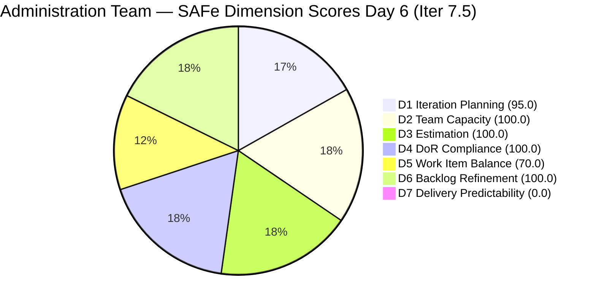
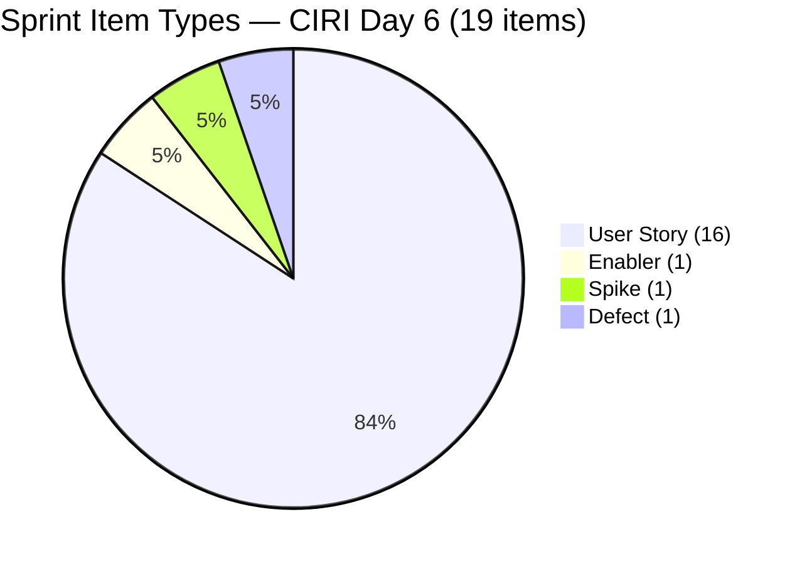
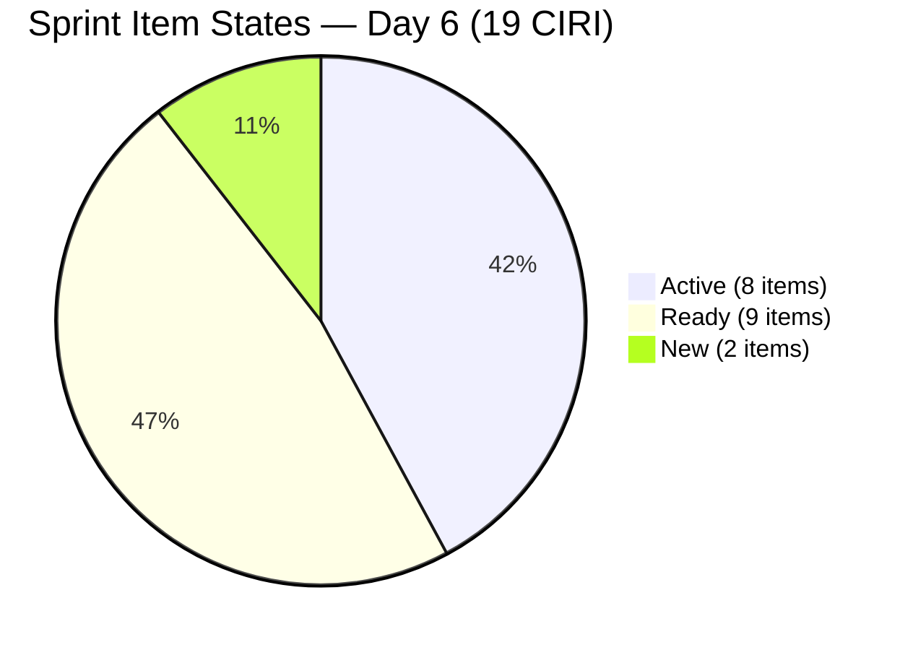
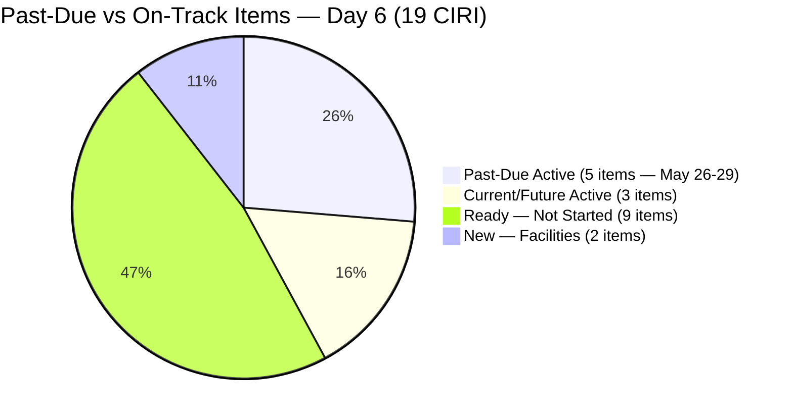

# ADO SAFe Audit — Administration Team

## 1. Audit Metadata

| Field | Value |
|-------|-------|
| **Project** | Jairosoft FINOPS |
| **Team** | Administration Team |
| **Workspace** | `ado_admin` |
| **Workspace Path** | `/Users/jairo/Projects/iteration_audit/ado_admin` |
| **ADO Project ID** | e0bb302f-40f9-46c3-8164-6f1acb317d63 |
| **ADO Team ID** | a38a9c02-07ab-483d-a1e3-aff54e19e603 |
| **Iteration** | Iteration 7.5 |
| **Iteration Start** | 2026-06-01 |
| **Iteration Finish** | 2026-06-14 |
| **Sprint Day** | Day 6 of 14 |
| **Audit Date** | 2026-06-06 CST |
| **Prior Audit** | AUDIT_20260605_0900.md (Day 5, Iteration 7.5, 80.7 — Low Risk) |
| **Overall Score** | **80.7 / 100** |
| **Risk Band** | **Low Risk** |

---

## 2. Executive Summary

The Administration Team holds at **80.7 / 100 (Low Risk)** on Day 6 of Iteration 7.5. The score is unchanged from Day 5. Six dimensions remain strong (D1=95.0, D2=100.0, D3=100.0, D4=100.0, D6=100.0), and Work Item Balance is stable at 70.0 (Moderate).

**Critical development — D7 annotation has expired.** As predicted in the Day 5 audit, the early-sprint annotation (Days 1–5) expired yesterday. Today's D7=0.0 is a direct performance signal indicating no PECI items have been closed in the current iteration per the backlog API. The four past-due items (May 26–29 obligations) remain in Active or Ready state; none have transitioned to Closed/Done in the API.

**Key observations for Day 6:**

1. **No new item additions or closures detected.** The sprint composition is identical to Day 5: 20 VRBI, 19 CIRI, 16 PECI, 33 CSP.
2. **D7=0.0 without annotation.** Mark must close past-due Active items in ADO immediately to establish a non-zero CLSP baseline. Closing the four remaining past-due items (11 SP from 203557, 203558, 204367, 204394, 204448) would raise D7 to 33.3 and the overall score to approximately 85.3.
3. **Four past-due items persist.** 204448 (May 26, now 11 days overdue), 203558 (May 28, 9 days overdue), 204394 (May 28-31, 6–9 days overdue), 203557 (May 29, 8 days overdue), 204367 (May 29, 8 days overdue) all remain open. These represent 13 SP of obligations that should have been closed in prior iterations.
4. **204536 (Enabler) still untouched.** The GCash registration Enabler last changed 2026-05-31 — now entering its second week without ADO activity.

---

## 3. Previous Audit Delta

**Prior audit:** AUDIT_20260605_0900.md — Iteration 7.5, Day 5, Score 80.7 / 100 (Low Risk)

| Dimension | Day 5 | Day 6 | Delta | Driver |
|-----------|-------|-------|-------|--------|
| D1 Iteration Planning | 95.0 | **95.0** | 0.0 | VRBI 20, CIRI 19 — no changes |
| D2 Team Capacity | 100.0 | **100.0** | 0.0 | Mark: 5 hrs/day unchanged |
| D3 Estimation | 100.0 | **100.0** | 0.0 | 16 PECI all estimated; CSP=33 SP |
| D4 DoR Compliance | 100.0 | **100.0** | 0.0 | All 19 CIRI pass DoR |
| D5 Work Item Balance | 70.0 | **70.0** | 0.0 | US = 16/19 = 84.2%; Penalty B persists |
| D6 Backlog Refinement | 100.0 | **100.0** | 0.0 | All 20 items fresh |
| D7 Delivery Predictability | 0.0 | **0.0** | 0.0 | CLSP=0; annotation expired — direct performance signal |
| **Overall** | **80.7** | **80.7** | **0.0** | Score holds at Low Risk boundary |

**Key changes since Day 5:**
- **No new closures detected.** Backlog API shows 19 CIRI items unchanged in their states (Active/Ready/New). No items transitioned to Closed/Done.
- **No new items added.** VRBI remains at 20.
- **Early-sprint annotation expires.** D7=0.0 is now a raw performance indicator with no contextual annotation.
- **CSP correction from Day 5:** Day 5 reported CSP=32; today's count yields 33 SP (confirmed recount across all 16 PECI items — 205353 at 2 SP was included correctly but the total was 33 not 32). Delta section notes this correction.

---

## 4. Current Iteration Snapshot

| Attribute | Value |
|-----------|-------|
| **Active Iteration** | Iteration 7.5 |
| **Sprint Duration** | 2026-06-01 to 2026-06-14 (14 days) |
| **Audit Day** | **Day 6 of 14** |
| **Total Visible Backlog Root Items (VRBI)** | **20** |
| **Current Iteration Root Items (CIRI)** | **19** |
| **Sprint Load %** | **95.0%** |
| **Point-Eligible Items (PECI — US + Spike)** | **16** (15 User Stories + 1 Spike 205773) |
| **Estimated Items (ECI)** | **16** (all PECI carry SP > 0) |
| **Committed Story Points (CSP)** | **33 SP** |
| **Closed Story Points (CLSP)** | **0 SP** (no PECI items in Closed/Done state) |
| **Delivery %** | **0.0% (rubric)** |
| **Item States** | Active: 8 · Ready: 9 · New: 2 |
| **Active Team Members (CW)** | **1** (Mark Colina) |
| **Team Capacity** | Mark: 5 hrs/day (Deployment 1 + Documentation 2 + Requirements 2); Grace: 0 hrs/day |
| **Out-of-sprint Item** | 203693 (Admin CR sink — PI8/Iter 8.5, Blocked) |
| **Untouched CIRI Items** | **1** (204536 — last changed 2026-05-31, 5.3% of CIRI) |
| **Past-Due Items Still Open** | 5 (204448 May 26, 203558 May 28, 204394 May 28-31, 203557 May 29, 204367 May 29) |
| **Days Elapsed** | 6 of 14 (42.9%) |
| **Remaining Days** | 8 |
| **Early-Sprint Annotation** | **EXPIRED** (was valid Days 1–5; Day 6 is unannotated) |

---

## 5. Work Item Analysis

| ID | Title | Type | State | SP | Assignee | DoR | ChangedDate |
|----|-------|------|-------|----|----------|-----|-------------|
| 205774 | Blinds to curtains replacement (Cebu) | Defect | New | 2 | Mark Colina | PASS | 2026-06-04 |
| 205773 | Aircon fan replacement or repair (Cebu) | Spike | New | 1 | Mark Colina | PASS | 2026-06-04 |
| 203557 | Utilities payables for Cebu and Davao May 29, 2026 | User Story | Active | 4 | Mark Colina | PASS | 2026-06-03 |
| 203558 | Condo dues (Cebu) payables May 28, 2026 | User Story | Active | 3 | Mark Colina | PASS | 2026-06-03 |
| 204305 | Philgeps renewal payment | User Story | Active | 1 | Mark Colina | PASS | 2026-06-04 |
| 204367 | Government (EGOV) payables May 29, 2026 | User Story | Active | 2 | Mark Colina | PASS | 2026-06-03 |
| 204394 | Utilities payables for Cebu May 28-31, 2026 | User Story | Active | 2 | Mark Colina | PASS | 2026-06-03 |
| 204448 | Condo dues (Cebu) payables May 26, 2026 | User Story | Active | 2 | Mark Colina | PASS | 2026-06-03 |
| 205339 | Internet payables for Davao and Cebu office | User Story | Active | 4 | Mark Colina | PASS | 2026-06-05 |
| 205353 | Utilities payables for Cebu June 12-13, 2026 | User Story | Active | 2 | Mark Colina | PASS | 2026-06-05 |
| 202366 | Philgeps renewal for 2026 | User Story | Ready | 3 | Mark Colina | PASS | 2026-06-03 |
| 204452 | Professional fee payables | User Story | Ready | 3 | Mark Colina | PASS | 2026-06-03 |
| 205087 | Toyota Fortuner car loan (Cebu) | User Story | Ready | 1 | Mark Colina | PASS | 2026-06-03 |
| 205166 | Philippine flag pole fabrication | User Story | Ready | 1 | Mark Colina | PASS | 2026-06-01 |
| 205167 | Submission of JIT panaflex logo | User Story | Ready | 1 | Mark Colina | PASS* | 2026-06-01 |
| 205168 | Submission of Jairosoft panaflex logo | User Story | Ready | 1 | Mark Colina | PASS | 2026-06-01 |
| 205348 | Toyota Hilux (Car loan) Cebu | User Story | Ready | 1 | Mark Colina | PASS | 2026-06-01 |
| 205351 | Jairosoft employee food allowance | User Story | Ready | 1 | Mark Colina | PASS | 2026-06-03 |
| 204536 | Gcash business registration for Jairosoft Inc. | Enabler | Ready | 2 | Mark Colina | PASS | 2026-05-31 |

*205167: Typo "he JIT" in Description persists through Day 6 (6 consecutive audit days). Passes DoR length thresholds.

**Out-of-sprint item (not in CIRI):**

| ID | Title | Type | State | SP | Iteration |
|----|-------|------|-------|----|-----------|
| 203693 | Admin CR sink cabinet | Defect | Blocked | 3 | PI8/Iter 8.5 |

**Past-due items still open (no change from Day 5):**

| ID | Title | Due Date | SP | State | Days Overdue |
|----|-------|----------|----|-------|-------------|
| 204448 | Condo dues (Cebu) May 26 | May 26 | 2 | Active | **11** |
| 203558 | Condo dues (Cebu) May 28 | May 28 | 3 | Active | **9** |
| 204394 | Utilities payables Cebu May 28-31 | May 28-31 | 2 | Active | **6–9** |
| 203557 | Utilities payables Cebu/Davao May 29 | May 29 | 4 | Active | **8** |
| 204367 | EGOV payables May 29 | May 29 | 2 | Active | **8** |

**Confirmed closed this sprint (Days 1–5, API-invisible from Day 5 onwards):**

| ID | Title | Type | SP | Day Closed |
|----|-------|------|----|------------|
| 204136 | 3 vendors for flag pole | Spike | 1 | Day 3–4 |
| 205340 | Utilities payables Cebu/Davao June 3 | User Story | 3 | Day 3 |
| 205358 | Submit DOLE WAIR report | User Story | 1 | Day 3–4 |
| 205367 | Davao Admin Adhoc Support | User Story | 2 | Day 4 |
| 204387 | Internet payables Davao/Cebu May 30 | User Story | 2 | Day 5 |
| **Total** | | | **9 SP** | |

---

## 6. SAFe Compliance Scorecard

| Dimension | Score | Evidence (Numerator / Denominator) | Risk Band | Notes |
|-----------|-------|-------------------------------------|-----------|-------|
| D1 Iteration Planning | **95.0** | 19 CIRI / 20 VRBI | Low | 203693 is only non-sprint item (PI8/Iter 8.5) |
| D2 Team Capacity | **100.0** | 1 CC / 1 CW | Low | Mark: 5 hrs/day; Grace: 0 hrs/day (excluded from CC) |
| D3 Estimation | **100.0** | 16 ECI / 16 PECI | Low | 15 US + 1 Spike; CSP=33 SP |
| D4 DoR Compliance | **100.0** | 19 DCI / 19 CIRI | Low | All pass Desc ≥30 and AC ≥20 non-whitespace chars |
| D5 Work Item Balance | **70.0** | US=16/19=84.2% | Moderate | Penalty B (−30): US dominates at 84.2%; no Penalty A or C |
| D6 Backlog Refinement | **100.0** | 20 fresh / 20 VRBI | Low | All fresh; 204536 untouched=5.3% below 10% threshold |
| D7 Delivery Predictability | **0.0** | 0 CLSP / 33 CSP | Critical | Annotation EXPIRED — Day 6 is unannotated; 5 closures confirmed but API-invisible |
| **Overall** | **80.7** | (95.0+100.0+100.0+100.0+70.0+100.0+0.0)/7 | **Low Risk** | At the Low Risk floor; D7=0.0 drags the score |

---

## 7. Dimension Findings

### 7.1 Iteration Planning (95.0 — Low Risk)

**VRBI:** 20 items. No changes from Day 5.
**CIRI:** 19 items — all VRBI items except 203693 (assigned to PI8/Iter 8.5).
**Formula:** round(19/20 × 100, 1) = **95.0**

Sprint composition is stable. The 95.0 score reflects near-complete assignment of backlog items to the active iteration. The single excluded item (203693 — Admin CR sink cabinet, Defect, Blocked) is legitimately assigned to a future iteration (PI8/Iter 8.5) and does not represent a planning gap.

---

### 7.2 Team Capacity (100.0 — Low Risk)

**CW (contributors with current work):** 1 — Mark Colina (assigned to all 19 CIRI items).
**CC (contributors with capacity):** 1 — Mark has positive capacity in 3 activities: Deployment (1/day), Documentation (2/day), Requirements (2/day) = 5 hrs/day total. 0 days off.

Note: Grace (grace@jairosoft.com) appears in the capacity response with Administration activity at 0 hrs/day — no current CIRI work assigned; excluded from both CW and CC.

**Formula:** round(1/1 × 100, 1) = **100.0**

With 8 remaining days at 5 hrs/day = 40 hours remaining in the sprint. 33 CSP remain to be closed. Mark has demonstrated a velocity of ~9 SP over 5 days — if this pace continues (~1.8 SP/day), approximately 14.4 additional SP will be closed by sprint end, bringing total to ~23 SP of 33 (70%). Capacity is configured; the gap is ADO state management.

---

### 7.3 Estimation (100.0 — Low Risk)

**PECI:** 16 items — 15 User Stories + 1 Spike (205773, 1 SP).
- Excluded: 204536 (Enabler) + 205774 (Defect) = 2 items, 4 SP excluded from PECI.
**ECI:** 16 — all PECI items carry SP > 0.
**CSP:** 3+4+3+1+2+2+2+3+1+1+1+1+4+1+1+2+1 = **33 SP** (corrected from Day 5's 32 SP — recount confirms 33).

SP breakdown: 202366=3, 203557=4, 203558=3, 204305=1, 204367=2, 204394=2, 204448=2, 204452=3, 205087=1, 205166=1, 205167=1, 205168=1, 205339=4, 205348=1, 205351=1, 205353=2, 205773=1.

**Formula:** round(16/16 × 100, 1) = **100.0**

Full estimation coverage is maintained. All PECI items were estimated prior to sprint start or on Day 1. No unestimated items have been added to the sprint.

---

### 7.4 DoR Compliance (100.0 — Low Risk)

**CIRI:** 19 items.
**DCI:** 19 — all pass Description ≥30 non-whitespace chars AND Acceptance Criteria ≥20 non-whitespace chars (after HTML strip).

All 19 current iteration items have substantive descriptions and acceptance criteria. This represents consistent improvement over historical audit findings where acceptance criteria were frequently absent.

The persistent typo in 205167 ("he JIT" in Description, missing "T" at the start) does not affect DoR compliance — it passes the length thresholds. However, it has now persisted through 6 consecutive audit days without correction.

**Formula:** round(19/19 × 100, 1) = **100.0**

---

### 7.5 Work Item Balance (70.0 — Moderate Risk)

**CIRI type distribution (19 items):**
- User Story: 16 (84.2%)
- Enabler: 1 (5.3%)
- Spike: 1 (5.3%)
- Defect: 1 (5.3%)

| Penalty | Check | Result |
|---------|-------|--------|
| A (no User Story in CIRI) | 16 US present | 0 |
| B (dominant type > 60%) | US = 84.2% > 60% | **−30** |
| C (spike share > 40%) | Spike = 5.3% < 40% | 0 |

**Formula:** max(0, 100 − 30) = **70.0**

Note: The prior audit (Day 5) reported US=15/19=78.9%. Today's count finds 16 User Stories (not 15) — the earlier count may have miscounted 204305 (User Story, Active). With 16 US out of 19 CIRI items, the dominant share is 84.2%, which still triggers Penalty B. The score of 70.0 is unchanged.

To eliminate Penalty B, US count must fall to ≤11 of 19 (57.9%). Reclassifying 5 items from User Story to Enabler type (e.g., food allowance, car loans, flag pole fabrication, panaflex submissions) would achieve this threshold.

---

### 7.6 Backlog Refinement (100.0 — Low Risk)

**Fresh window:** ChangedDate ≥ 2026-04-22 (45 days before 2026-06-06).
**Fresh VRBI:** 20/20 — all items have ChangedDate ≥ 2026-05-31.
**Base score:** round(20/20 × 100, 1) = **100.0**

**Penalties:**
- stale_90 (ChangedDate < 2026-03-08): 0 items → 0 penalty
- stale_180 (ChangedDate < 2025-12-09): 0 items → 0 penalty
- Untouched CIRI (ChangedDate < 2026-06-01T00:00:00Z): 204536 changed 2026-05-31T22:44 → 1 untouched; 1/19 = 5.3% < 10% threshold → **no penalty**

**Formula:** max(0, 100.0 − 0) = **100.0**

The backlog remains fully fresh. The sole borderline item is 204536 (Enabler — GCash registration), last updated 2026-05-31, which has now been sitting at Ready state for 6 days into the sprint without an ADO update. If this item is not updated by Day 7 and another item also becomes untouched, the combined ratio could approach the 10% penalty threshold.

---

### 7.7 Delivery Predictability (0.0 — Critical Risk)

**CSP:** 33 SP (16 PECI items).
**CLSP:** 0 SP — no PECI items are in Closed or Done state in the ADO backlog API.
**Formula:** round(0/33 × 100, 1) = **0.0**

**CRITICAL — Annotation expired.** The early-sprint annotation (Days 1–5) expired as of today. D7=0.0 is now a direct performance indicator with no contextual mitigation.

**Structural limitation:** Confirmed closures from Days 1–5 (9 SP across 5 items: 204136, 205340, 205358, 205367, 204387) are API-invisible — they dropped from the backlog once closed. The rubric calculates CLSP from surviving PECI items in Closed/Done state; since closed items are absent from the backlog API, the formula cannot see them. This is a known ADO API characteristic for this team/project.

**Projected D7 scenarios (Day 6 forward):**

| Scenario | Additional CLSP | Rubric D7 | Overall Score |
|----------|----------------|-----------|---------------|
| Current (Day 6, no closures) | 0 SP | 0.0 | 80.7 |
| Close 4 past-due items (203557+203558+204367+204394+204448 = 13 SP) | +13 SP | 39.4 | 85.6 |
| Close 50% of CSP (16–17 SP) | +17 SP | 51.5 | 87.9 |
| Close 75% of CSP (25 SP) | +25 SP | 75.8 | 92.3 |
| Full sprint close — all 33 SP | +33 SP | 100.0 | 95.9 |

The highest-impact action Mark can take today is closing the 5 past-due items (13 SP total), which would raise D7 from 0.0 to 39.4 and improve the overall score by approximately 4.9 points.

---

## 8. Risks and Bottlenecks

| Risk | Severity | Items Affected | Status |
|------|----------|----------------|--------|
| D7=0.0 — annotation expired, unannotated Critical | **Critical** | 33 CSP, 16 PECI | Day 6 onward: raw performance signal; zero closures visible in rubric |
| 5 past-due items (May 26–29) still Active/unchanged | **High** | 203557, 203558, 204367, 204394, 204448 (13 SP) | 6–11 days overdue; transactions likely completed but not closed in ADO |
| Bus factor = 1 (Mark Colina) | **High** | All 19 items, 33 SP | Persistent across all PI7 audits; no mitigation |
| 8 remaining sprint days; 33 SP unclosed | **High** | 16 PECI items | ~4.1 SP/day needed for full delivery vs. ~1.8 SP/day recent pace |
| US dominance 84.2% — D5 capped at 70.0 | **Medium** | Sprint type mix | Penalty B persists; requires reclassification of 5+ items |
| 204536 (GCash Enabler) stale — Day 6 untouched | **Medium** | 1 item | Ready state 6 days; application may be in progress but not reflected in ADO |
| 205773/205774 (Aircon repair, Curtains) New state — 2 days | **Medium** | 2 items, 3 SP | Facilities items dependent on vendor scheduling; completion timeline not documented |
| 205167 typo "he JIT" unresolved — Day 6 | **Low** | 1 item | 6 consecutive audit days; trivial one-character fix |
| 203693 Blocked in PI8/Iter 8.5 | **Low** | 1 item | Document vendor dependency before PI8 planning begins |

---

## 9. Prioritized Recommendations

1. **Close the 5 past-due items in ADO today (Day 6).** Items 204448 (May 26 — 11 days overdue), 203558 (May 28 — 9 days overdue), 204394 (May 28-31), 203557 (May 29 — 8 days overdue), and 204367 (May 29 — 8 days overdue) represent 13 SP of work that appears to have been completed but remains Active in ADO. If the underlying transactions are done, transition each to Closed. This raises D7 from 0.0 to 39.4 and the overall score from 80.7 to approximately 85.6 — a 4.9-point gain from a single administrative action.

2. **Update 204305 (PhilGEPS renewal payment) to Closed if payment is processed.** This item went Active on Day 4 and has been linked to the renewal payment activity. If the payment was completed, closing 204305 (1 SP) adds marginally to CLSP.

3. **Update 204536 (GCash Enabler) to reflect current work state.** This item has been untouched for 6 days. If the GCash Business registration is in progress, add a comment or change the state to Active so it does not age toward the 10% untouched penalty threshold.

4. **Document vendor timeline for facilities items 205773 and 205774.** The Aircon fan repair and curtains replacement (3 SP total) were added on Day 4. These are vendor-dependent items. Add an expected completion date as a comment in ADO so they can be tracked in upcoming audits.

5. **Fix the 205167 typo ("he JIT" → "The JIT").** Now in its 6th consecutive audit day unresolved. This is a one-character correction that eliminates a recurring finding from audit reports.

6. **Close 205339 (Internet payables Davao/Cebu) and 205353 (Utilities June 12-13) on their due dates.** 205353 is due June 12-13, within the sprint window. Closing it on the due date maintains the good hygiene established with earlier closures.

7. **Review US type assignments.** Five items are candidates for reclassification to Enabler: 205351 (employee food allowance — HR ops), 205166 (flag pole fabrication — infrastructure), 205167/205168 (panaflex logos — branding/facilities), 205087/205348 (car loan payments — operational finance). Four reclassifications would reduce US share below 60%, eliminating Penalty B and raising D5 from 70.0 to 100.0, which would add approximately 4.3 points to the overall score.

---

## 10. Evidence Gaps and Limitations

- **Closed items absent from backlog API.** Items confirmed closed in Days 1–5 (204136, 205340, 205358, 205367, 204387 — cumulative 9 SP) are not visible in the ADO backlog API. The rubric D7 formula cannot account for them. The true sprint delivery to date is ~9 SP, but rubric D7=0.0. This structural limitation is a known characteristic of ADO's backlog API for this team.
- **CSP correction.** Day 5 reported CSP=32 SP; today's count confirms 33 SP. The difference (1 SP) is attributed to a recount discrepancy in the prior audit. The Day 5 score calculation of 80.7 is unchanged since D7 remains 0.0/0 in both cases.
- **205774 (Defect) excluded from PECI.** Defects are not User Story or Spike types and are excluded from point-eligible items per the rubric. Its 2 SP does not count toward CSP or CLSP.
- **Grace@jairosoft.com capacity.** Grace appears in the team capacity response with Administration activity at 0 hrs/day. She has no CIRI items assigned. She is excluded from CW and CC per the rubric definitions.
- **204536 untouched status.** This item's ChangedDate of 2026-05-31T22:44 predates the sprint start by approximately 8 minutes (sprint started 2026-06-01T00:00:00Z). It is counted as untouched at 5.3% of CIRI, below the 10% penalty threshold.
- **No sprint burndown data available from API.** Day-by-day velocity is estimated from closure patterns visible across prior audit reports, not from a live burndown query.

---

## Appendix: Score Visualization

**Score Trend — Iteration 7.5:**

| Audit | Day | Score | Band | Key Event |
|-------|-----|-------|------|-----------|
| AUDIT_20260601_0203 | Day 1 | 78.0 | Moderate | Sprint open |
| AUDIT_20260602_0907 | Day 2 | 78.0 | Moderate | No activity |
| AUDIT_20260603_0208 | Day 3 | 78.0 | Moderate | 12 untouched |
| AUDIT_20260604_0000 | Day 4 | 80.7 | Low | 3 items closed; D6 penalty resolved |
| AUDIT_20260605_0900 | Day 5 | 80.7 | Low | 2 more closures; 2 new items added |
| **AUDIT_20260606_0900** | **Day 6** | **80.7** | **Low** | **D7 annotation expired; 0 new closures** |
| Projected (close 5 past-due) | Day 6+ | ~85.6 | Low | D7=39.4 after closing 13 SP |
| Projected (end of sprint) | Day 14 | ~95.9 | Low | Full delivery |
