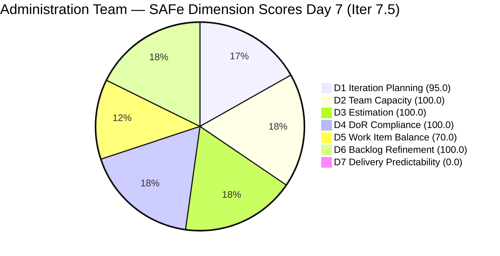
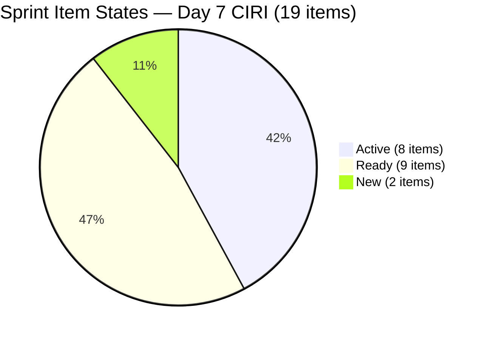
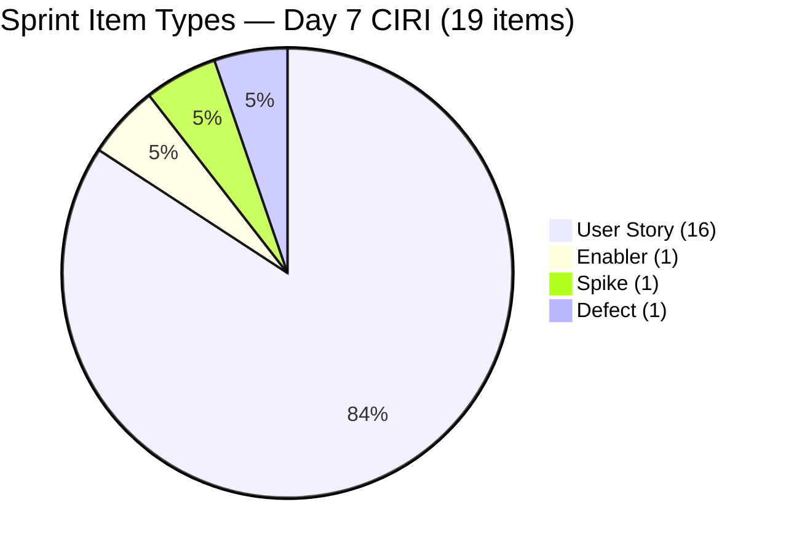
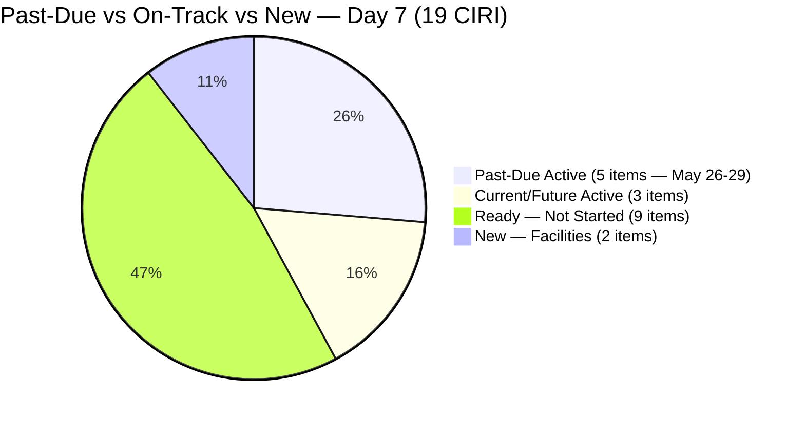

# ADO SAFe Audit — Administration Team

## 1. Audit Metadata

| Field | Value |
|-------|-------|
| **Project** | Jairosoft FINOPS |
| **Team** | Administration Team |
| **Workspace** | `ado_admin` |
| **Workspace Path** | `/Users/jairo/Projects/iteration_audit/ado_admin` |
| **ADO Project ID** | e0bb302f-40f9-46c3-8164-6f1acb317d63 |
| **ADO Team ID** | a38a9c02-07ab-483d-a1e3-aff54e19e603 |
| **Iteration** | Iteration 7.5 |
| **Iteration Start** | 2026-06-01 |
| **Iteration Finish** | 2026-06-14 |
| **Sprint Day** | Day 7 of 14 |
| **Audit Date** | 2026-06-07 CST |
| **Prior Audit** | AUDIT_20260606_0900.md (Day 6, Iteration 7.5, 80.7 — Low Risk) |
| **Overall Score** | **80.7 / 100** |
| **Risk Band** | **Low Risk** |

---

## 2. Executive Summary

- The Administration Team holds at **80.7 / 100 (Low Risk)** on Day 7 of Iteration 7.5 — unchanged from Days 4–6. The score has been stable at 80.7 for four consecutive audit days.
- **D7 = 0.0 (Critical)** persists for the second consecutive unannotated day. No new PECI item closures are visible in the ADO backlog API today. Five previously closed items (204136, 205340, 205358, 205367, 204387 — 9 SP) are confirmed closed via the iteration work items API but are absent from the backlog view; they do not contribute to the rubric's CLSP calculation.
- **Five past-due items (13 SP) remain Active** — obligations originally due May 26–29. These have now been overdue for 9–12 days with no ADO state transition.
- **D6 at 100.0 is approaching risk.** The GCash Enabler (204536, last changed 2026-05-31) is now 7 days untouched inside the sprint. Still at 1/19 = 5.3% (below 10% threshold), but a second untouched item would push D6 into penalty territory.
- **The single highest-impact action available** is closing the 5 past-due Active items in ADO, which would raise D7 from 0.0 to ~39.4 and the overall from 80.7 to ~85.6.

---

## 3. Previous Audit Delta

**Prior audit:** AUDIT_20260606_0900.md — Iteration 7.5, Day 6, Score 80.7 / 100 (Low Risk)

| Dimension | Day 6 | Day 7 | Delta | Driver |
|-----------|-------|-------|-------|--------|
| D1 Iteration Planning | 95.0 | **95.0** | 0.0 | VRBI 20, CIRI 19 — no changes |
| D2 Team Capacity | 100.0 | **100.0** | 0.0 | Mark: 5 hrs/day unchanged |
| D3 Estimation | 100.0 | **100.0** | 0.0 | 16 PECI, all estimated; CSP=33 SP |
| D4 DoR Compliance | 100.0 | **100.0** | 0.0 | All 19 CIRI pass DoR |
| D5 Work Item Balance | 70.0 | **70.0** | 0.0 | US=16/19=84.2%; Penalty B persists |
| D6 Backlog Refinement | 100.0 | **100.0** | 0.0 | 20/20 fresh; 204536 untouched at 5.3% |
| D7 Delivery Predictability | 0.0 | **0.0** | 0.0 | No new closures visible; CLSP=0 |
| **Overall** | **80.7** | **80.7** | **0.0** | Four-day score lock at Low Risk boundary |

**Key changes since Day 6:**
- **No new item closures detected.** All PECI items remain in Active or Ready state. No state transitions occurred on 2026-06-07 per the API.
- **No new items added.** VRBI and CIRI counts are identical to Day 6.
- **204536 (GCash Enabler) now 7 days untouched** inside the sprint (last changed 2026-05-31). The untouched ratio remains at 5.3% (1/19), below the 10% penalty threshold, but the item is aging further each day.
- **205167 typo ("he JIT")** persists for the 7th consecutive audit day with no correction.

---

## 4. Current Iteration Snapshot

| Attribute | Value |
|-----------|-------|
| **Active Iteration** | Iteration 7.5 |
| **Sprint Duration** | 2026-06-01 to 2026-06-14 (14 days) |
| **Audit Day** | **Day 7 of 14 (Sprint Midpoint)** |
| **Total Visible Backlog Root Items (VRBI)** | **20** |
| **Current Iteration Root Items (CIRI)** | **19** |
| **Sprint Load %** | **95.0%** |
| **Point-Eligible Items (PECI — US + Spike)** | **16** (15 User Stories + 1 Spike 205773) |
| **Estimated Items (ECI)** | **16** (all PECI carry SP > 0) |
| **Committed Story Points (CSP)** | **33 SP** |
| **Closed Story Points (CLSP)** | **0 SP** (no PECI items in Closed/Done in backlog API) |
| **Delivery % (D7)** | **0.0% — unannotated; hard performance signal Day 7** |
| **Item States (CIRI)** | Active: 8 · Ready: 9 · New: 2 |
| **Active Team Members (CW)** | **1** (Mark Colina) |
| **Team Capacity** | Mark: 5 hrs/day (Deployment 1 + Documentation 2 + Requirements 2); Grace: 0 hrs/day |
| **Out-of-sprint Item** | 203693 (Admin CR sink — PI8/Iter 8.5, Blocked) |
| **Untouched CIRI Items** | **1** (204536 — last changed 2026-05-31, 5.3% of CIRI) |
| **Past-Due Items Still Open** | 5 (204448 May 26, 203558 May 28, 204394 May 28-31, 203557 May 29, 204367 May 29) |
| **Days Elapsed** | 7 of 14 (50.0% — sprint midpoint) |
| **Remaining Days** | 7 |
| **Confirmed Closed This Sprint (API-visible via iteration endpoint)** | 5 items: 204136 (Spike 1 SP), 205340 (US 3 SP), 205358 (US 1 SP), 205367 (US 2 SP), 204387 (US 2 SP) = **9 SP** |

---

## 5. Work Item Analysis

| ID | Title | Type | State | SP | Assignee | DoR | ChangedDate |
|----|-------|------|-------|----|----------|-----|-------------|
| 205774 | Blinds to curtains replacement (Cebu) | Defect | New | 2 | Mark Colina | PASS | 2026-06-04 |
| 205773 | Aircon fan replacement or repair (Cebu) | Spike | New | 1 | Mark Colina | PASS | 2026-06-04 |
| 203557 | Utilities payables for Cebu and Davao May 29, 2026 | User Story | Active | 4 | Mark Colina | PASS | 2026-06-03 |
| 203558 | Condo dues (Cebu) payables May 28, 2026 | User Story | Active | 3 | Mark Colina | PASS | 2026-06-03 |
| 204305 | Philgeps renewal payment | User Story | Active | 1 | Mark Colina | PASS | 2026-06-04 |
| 204367 | Government (EGOV) payables May 29, 2026 | User Story | Active | 2 | Mark Colina | PASS | 2026-06-03 |
| 204394 | Utilities payables for Cebu May 28-31, 2026 | User Story | Active | 2 | Mark Colina | PASS | 2026-06-03 |
| 204448 | Condo dues (Cebu) payables May 26, 2026 | User Story | Active | 2 | Mark Colina | PASS | 2026-06-03 |
| 205339 | Internet payables for Davao and Cebu office | User Story | Active | 4 | Mark Colina | PASS | 2026-06-05 |
| 205353 | Utilities payables for Cebu June 12-13, 2026 | User Story | Active | 2 | Mark Colina | PASS | 2026-06-05 |
| 202366 | Philgeps renewal for 2026 | User Story | Ready | 3 | Mark Colina | PASS | 2026-06-03 |
| 204452 | Professional fee payables | User Story | Ready | 3 | Mark Colina | PASS | 2026-06-03 |
| 205087 | Toyota Fortuner car loan (Cebu) | User Story | Ready | 1 | Mark Colina | PASS | 2026-06-03 |
| 205166 | Philippine flag pole fabrication | User Story | Ready | 1 | Mark Colina | PASS | 2026-06-01 |
| 205167 | Submission of JIT panaflex logo | User Story | Ready | 1 | Mark Colina | PASS* | 2026-06-01 |
| 205168 | Submission of Jairosoft panaflex logo | User Story | Ready | 1 | Mark Colina | PASS | 2026-06-01 |
| 205348 | Toyota Hilux (Car loan) Cebu | User Story | Ready | 1 | Mark Colina | PASS | 2026-06-01 |
| 205351 | Jairosoft employee food allowance | User Story | Ready | 1 | Mark Colina | PASS | 2026-06-03 |
| 204536 | Gcash business registration for Jairosoft Inc. | Enabler | Ready | 2 | Mark Colina | PASS | 2026-05-31 |

*205167: Typo "he JIT" in Description persists through Day 7 (7 consecutive audit days). Passes DoR length thresholds.

**Out-of-sprint item (not in CIRI):**

| ID | Title | Type | State | SP | Iteration |
|----|-------|------|-------|----|-----------|
| 203693 | Admin CR sink cabinet | Defect | Blocked | 3 | PI8/Iter 8.5 |

**Confirmed closed this sprint — visible via iteration endpoint (not in CLSP rubric):**

| ID | Title | Type | SP | ChangedDate (Closed) |
|----|-------|------|----|----------------------|
| 204136 | 3 vendors for flag pole | Spike | 1 | 2026-06-04 |
| 205340 | Utilities payables Cebu/Davao June 3 | User Story | 3 | 2026-06-04 |
| 205358 | Submit DOLE WAIR report | User Story | 1 | 2026-06-04 |
| 205367 | Davao Admin Adhoc Support | User Story | 2 | 2026-06-04 |
| 204387 | Payables - Internet for Davao and Cebu May 30 | User Story | 2 | 2026-06-05 |
| **Total** | | | **9 SP** | |

**Past-due items still open (no change from Day 6):**

| ID | Title | Due Date | SP | State | Days Overdue |
|----|-------|----------|----|-------|-------------|
| 204448 | Condo dues (Cebu) May 26 | May 26 | 2 | Active | **12** |
| 203558 | Condo dues (Cebu) May 28 | May 28 | 3 | Active | **10** |
| 204394 | Utilities payables Cebu May 28-31 | May 28-31 | 2 | Active | **7–10** |
| 203557 | Utilities payables Cebu/Davao May 29 | May 29 | 4 | Active | **9** |
| 204367 | EGOV payables May 29 | May 29 | 2 | Active | **9** |

---

## 6. SAFe Compliance Scorecard

| Dimension | Score | Evidence (Numerator / Denominator) | Risk Band | Notes |
|-----------|-------|-------------------------------------|-----------|-------|
| D1 Iteration Planning | **95.0** | 19 CIRI / 20 VRBI | Low | 203693 only non-sprint item (PI8/Iter 8.5) |
| D2 Team Capacity | **100.0** | 1 CC / 1 CW | Low | Mark: 5 hrs/day; Grace: 0 hrs/day (excluded) |
| D3 Estimation | **100.0** | 16 ECI / 16 PECI | Low | 15 US + 1 Spike; CSP=33 SP |
| D4 DoR Compliance | **100.0** | 19 DCI / 19 CIRI | Low | All pass Desc ≥30 and AC ≥20 non-whitespace chars |
| D5 Work Item Balance | **70.0** | US=16/19=84.2% | Moderate | Penalty B (−30): US dominates at 84.2% |
| D6 Backlog Refinement | **100.0** | 20 fresh / 20 VRBI | Low | 204536 untouched=5.3%; stale_90=0; stale_180=0 |
| D7 Delivery Predictability | **0.0** | 0 CLSP / 33 CSP | Critical | Day 7 unannotated — raw performance signal; 9 SP closed but API-invisible in rubric |
| **Overall** | **80.7** | (95.0+100.0+100.0+100.0+70.0+100.0+0.0)/7 | **Low Risk** | Four-day score lock; D7=0.0 is the sole drag |

**Formula verification:**
- D1: round(19/20×100,1) = 95.0
- D2: round(1/1×100,1) = 100.0
- D3: round(16/16×100,1) = 100.0
- D4: round(19/19×100,1) = 100.0
- D5: max(0, 100−30) = 70.0 [US=16/19=84.2% > 60% → Penalty B]
- D6: base=round(20/20×100,1)=100.0; no stale_90 (0 items), no stale_180, untouched=1/19=5.3%<10% → no penalty; D6=100.0
- D7: round(0/33×100,1) = 0.0
- Overall: round((95.0+100.0+100.0+100.0+70.0+100.0+0.0)/7,1) = round(565.0/7,1) = round(80.714…,1) = **80.7**

---

## 7. Dimension Findings

### 7.1 Iteration Planning (95.0 — Low Risk)

**VRBI:** 20 items. **CIRI:** 19 items (all VRBI except 203693).

**Formula:** round(19/20 × 100, 1) = **95.0**

Sprint composition is stable and has remained unchanged since Day 4. The single excluded item (203693 — Admin CR sink cabinet, Defect, Blocked) is correctly assigned to PI8/Iter 8.5. No new items were added and no items were removed from the sprint on Day 7.

---

### 7.2 Team Capacity (100.0 — Low Risk)

**CW:** 1 — Mark Colina (assigned all 19 CIRI items).
**CC:** 1 — Mark has positive capacity: Deployment (1/day) + Documentation (2/day) + Requirements (2/day) = 5 hrs/day. Grace appears with 0 hrs/day Administration capacity; excluded from both CW and CC.

**Formula:** round(1/1 × 100, 1) = **100.0**

With 7 remaining days at 5 hrs/day, Mark has 35 hours available. Twenty-four PECI SP remain undelivered per the rubric (33 CSP − 0 CLSP). Mark's confirmed historical pace (9 SP in Days 3–5, approximately 1.8 SP/day) would project ~12.6 additional SP over 7 days — a projected 38.2% close rate for the remaining period. Capacity is configured; the gap is exclusively ADO state management.

---

### 7.3 Estimation (100.0 — Low Risk)

**PECI:** 16 items — 15 User Stories + 1 Spike (205773, 1 SP).
**ECI:** 16 — all carry SP > 0.
**CSP:** 33 SP (confirmed recount; consistent with Days 5–6).

**Excluded from PECI:** 204536 (Enabler, 2 SP) + 205774 (Defect, 2 SP) = 2 items.

**Formula:** round(16/16 × 100, 1) = **100.0**

Full estimation coverage is maintained. No unestimated items have been added to the sprint.

---

### 7.4 DoR Compliance (100.0 — Low Risk)

**CIRI:** 19. **DCI:** 19 — all pass Description ≥ 30 non-whitespace chars AND Acceptance Criteria ≥ 20 non-whitespace chars.

**Formula:** round(19/19 × 100, 1) = **100.0**

All 19 items confirmed with substantive descriptions and acceptance criteria. The persistent typo in 205167 ("he JIT" — missing "T") is in its 7th consecutive audit day without correction. It passes the DoR length thresholds but represents a quality hygiene gap.

---

### 7.5 Work Item Balance (70.0 — Moderate Risk)

**CIRI type distribution (19 items):**
- User Story: 16 (84.2%)
- Enabler: 1 (5.3%) — 204536
- Spike: 1 (5.3%) — 205773
- Defect: 1 (5.3%) — 205774

| Penalty | Check | Result |
|---------|-------|--------|
| A (no User Story) | 16 US present | 0 |
| B (dominant type > 60%) | US = 84.2% > 60% | **−30** |
| C (spike share > 40%) | Spike = 5.3% < 40% | 0 |

**Formula:** max(0, 100 − 30) = **70.0**

The composition is structurally fixed for this sprint. The Penalty B trigger (US > 60%) will persist through sprint end unless items are reclassified or added. To bring US below 60%: need ≤11 US out of 19 CIRI. Since removing User Stories from CIRI is not practical mid-sprint, the realistic path is reclassification of 5 items to Enabler type in a future sprint planning session.

---

### 7.6 Backlog Refinement (100.0 — Low Risk)

**Fresh window:** ChangedDate ≥ 2026-04-23 (45 days before 2026-06-07).
**Fresh VRBI:** 20/20 — all items changed 2026-05-31 or later.
**stale_90 (before 2026-03-09):** 0 items.
**stale_180 (before 2025-12-09):** 0 items.
**Untouched CIRI (ChangedDate < 2026-06-01T00:00:00Z):** 1 item — 204536 (changed 2026-05-31T22:44) = 1/19 = 5.3% < 10% threshold. No penalty.

**Formula:** max(0, 100.0 − 0) = **100.0**

**Warning:** 204536 (GCash Enabler) is now 7 days into the sprint without a state or comment update. It is the sole untouched item at 5.3%. If a second CIRI item goes untouched by Day 8 (bringing untouched to ≥ 2/19 = 10.5%), the >10% threshold would trigger a −10 penalty and reduce D6 from 100.0 to 90.0. The items most at risk of becoming untouched are those currently Ready with ChangedDate on 2026-06-01 (205166, 205167, 205168, 205348 — all unchanged since sprint start).

---

### 7.7 Delivery Predictability (0.0 — Critical Risk)

**CSP:** 33 SP. **CLSP:** 0 SP — no PECI items in Closed or Done state visible in the backlog API.

**Formula:** round(0/33 × 100, 1) = **0.0**

Day 7 of 14 is the sprint midpoint. With 50% of the sprint elapsed and 0% of committed story points delivered per the rubric, D7 is at Critical. This is the second unannotated day.

**Structural limitation:** Five items confirmed closed (via the iteration work items API) in Days 3–5 (204136, 205340, 205358, 205367, 204387 — 9 SP) are absent from the backlog API response. The rubric's CLSP is calculated from PECI items in Closed/Done state in the backlog; since closed items disappear from the backlog feed, the formula cannot see them. True sprint delivery to date is ~9 SP (27.3% of CSP), but rubric D7 = 0.0.

**D7 impact scenarios — Day 7:**

| Action | CLSP | D7 | Overall | Band |
|--------|------|----|---------|------|
| Current (no new closures) | 0 SP | 0.0 | 80.7 | Low |
| Close 5 past-due items (13 SP) | 13 SP | 39.4 | 85.6 | Low |
| Close 50% of CSP (16–17 SP) | 17 SP | 51.5 | 87.9 | Low |
| Close 75% of CSP (25 SP) | 25 SP | 75.8 | 92.3 | Low |
| Full sprint delivery (33 SP) | 33 SP | 100.0 | 95.9 | Low |

---

## 8. Risks and Bottlenecks

| Risk | Severity | Items Affected | Status |
|------|----------|----------------|--------|
| D7=0.0 at sprint midpoint — no rubric-visible closures | **Critical** | 33 CSP, 16 PECI | Day 7; 9 SP confirmed closed but API-invisible; immediate ADO hygiene needed |
| 5 past-due items (May 26–29) still Active — up to 12 days overdue | **High** | 204448, 203558, 204394, 203557, 204367 (13 SP) | Transactions likely completed; ADO state not updated |
| Bus factor = 1 (Mark Colina) | **High** | All 19 items, 33 SP | Persistent across all PI7 audits; no mitigation |
| Sprint midpoint: 7 remaining days to close 33 SP | **High** | All PECI | Pace needed ~4.7 SP/day; historical pace ~1.8 SP/day |
| US dominance 84.2% — D5 capped at 70.0 | **Medium** | Sprint type mix | Penalty B persists; reclassification requires future sprint planning |
| 204536 (GCash Enabler) now 7 days untouched | **Medium** | 1 item | Approaching structural D6 risk if a second item becomes untouched |
| 205166, 205167, 205168, 205348 unchanged since June 1 | **Medium** | 4 items | If any changes today, no penalty; if multiple remain static, D6 penalty risk by Day 8 |
| 205773/205774 (Aircon, Curtains) still New — vendor-dependent | **Low** | 2 items, 3 SP | No vendor timeline documented in ADO |
| 205167 typo ("he JIT") — Day 7, unresolved | **Low** | 1 item | 7 consecutive audit days; trivial one-character fix |
| 203693 Blocked in PI8/Iter 8.5 | **Low** | 1 item | Document vendor dependency before PI8 planning |

---

## 9. Prioritized Recommendations

1. **Close the 5 past-due items in ADO today (Day 7 — sprint midpoint).** Items 204448 (May 26, now 12 days overdue), 203558 (May 28, 10 days overdue), 204394 (May 28-31), 203557 (May 29, 9 days overdue), and 204367 (May 29, 9 days overdue) collectively represent 13 SP of work that appears completed based on their dates. If the underlying transactions are done, transitioning each to Closed raises D7 from 0.0 to 39.4 and overall score from 80.7 to approximately 85.6 — a 4.9-point gain from a single ADO update session.

2. **Update 204536 (GCash Enabler) with a comment or state change today.** This item has been untouched for 7 sprint days. Adding a progress comment (even "Application submitted, awaiting GCash verification") counts as a ChangedDate update and resets the untouched clock, preventing a D6 penalty.

3. **Update 205166, 205167, 205168, 205348 (unchanged since June 1).** These four Ready items have had no ADO activity since sprint Day 1. Touching each — even to add a comment or change state — removes the risk of D6 penalty if the 204536 untouched count climbs above 10%.

4. **Close 204305 (PhilGEPS renewal payment) if payment is processed.** This item has been Active since Day 4; if the payment was executed, closing it (1 SP) adds to CLSP and represents clean delivery hygiene.

5. **Document vendor timelines for 205773 and 205774 (facilities items).** Both items are in New state with no vendor scheduling information. Adding expected completion dates via ADO comments allows meaningful tracking in upcoming audits.

6. **Fix the 205167 typo ("he JIT" → "The JIT").** This has persisted through 7 consecutive audit days. One-character fix.

7. **Plan PI8 type-balance correction.** With US=84.2% triggering Penalty B every sprint, the Administration Team should plan a future iteration with a minimum of 4 non-User-Story items (Enablers for operational capabilities like GCash, vehicle loan management, facilities) to bring the US share below 60% and recover D5 from 70.0 to 100.0.

---

## 10. Evidence Gaps and Limitations

- **Closed items absent from backlog API.** Five items confirmed closed (204136, 205340, 205358, 205367, 204387 — 9 SP) are visible via `wit_get_work_items_for_iteration` but absent from `wit_list_backlog_work_items`. The rubric formula uses only items in the backlog's Closed/Done state; since these items drop from the backlog on closure, D7 = 0.0 despite ~9 SP of actual delivery. This is a known ADO API characteristic for this team.
- **No Day 7 state transitions detected.** All CIRI item ChangedDates are 2026-06-05 or earlier. It is possible that Day 7 changes occurred after the audit query time (9:00 AM CST). If Mark closes items later today, D7 will improve.
- **VRBI vs. CIRI count reconciliation.** The iteration endpoint returns 24 root items (19 open + 5 closed). The backlog endpoint returns 20 items (19 CIRI + 1 out-of-sprint: 203693). The 5-item gap comprises items that closed and fell off the backlog. VRBI = 20 (backlog count) is used for scoring per rubric definitions.
- **Grace's capacity confirmed at 0 hrs/day.** Grace appears in the capacity response with 0 hrs/day Administration activity and no CIRI items. Excluded from CW and CC.
- **No sprint burndown data from API.** Velocity projections are estimated from ChangedDate patterns across prior audit reports.

---

## Appendix: Score Visualization

**Score Trend — Iteration 7.5:**

| Audit | Day | Score | Band | Key Event |
|-------|-----|-------|------|-----------|
| AUDIT_20260601_0203 | 1 | 78.0 | Moderate | Sprint open |
| AUDIT_20260602_0907 | 2 | 78.0 | Moderate | No activity |
| AUDIT_20260603_0208 | 3 | 78.0 | Moderate | 12 untouched |
| AUDIT_20260604_0000 | 4 | 80.7 | Low | 3 items closed; D6 penalty resolved |
| AUDIT_20260605_0900 | 5 | 80.7 | Low | 2 more closures; 2 new items added |
| AUDIT_20260606_0900 | 6 | 80.7 | Low | D7 annotation expired; 0 new closures |
| **AUDIT_20260607_0900** | **7** | **80.7** | **Low** | **Sprint midpoint; 9 SP delivered but rubric-invisible** |
| Projected (close 5 past-due) | 7+ | ~85.6 | Low | D7=39.4 after closing 13 SP |
| Projected (end of sprint, full close) | 14 | ~95.9 | Low | All 33 SP delivered |
