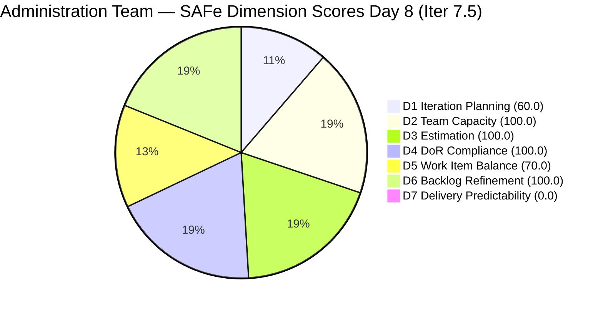
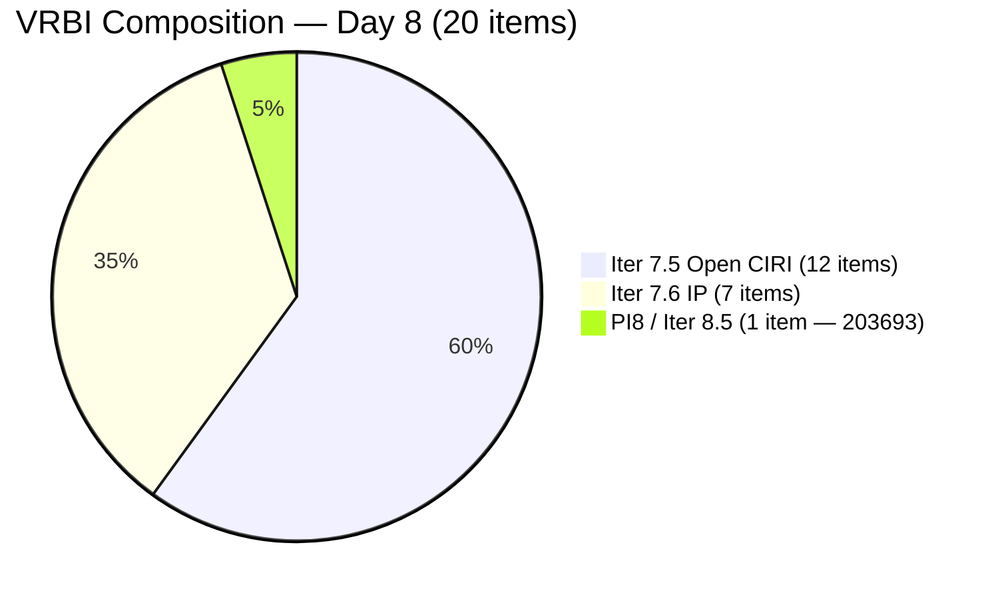
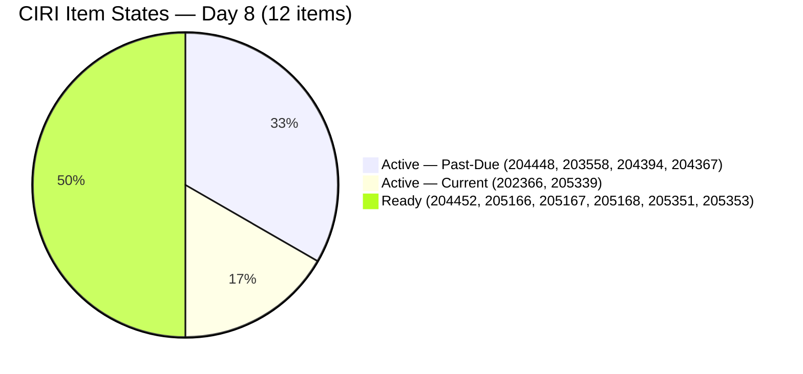

# ADO SAFe Audit — Administration Team

## 1. Audit Metadata

| Field | Value |
|-------|-------|
| **Audit Date** | 2026-06-08 CST |
| **Sprint Day** | Day 8 of 14 |
| **Iteration** | Iteration 7.5 |
| **Iteration Dates** | 2026-06-01 to 2026-06-14 |
| **ADO Project** | Jairosoft FINOPS |
| **ADO Team** | Administration Team |
| **Iteration ID** | 3b355811-2941-4edf-a8b1-7ffcdb478f9d |
| **Workspace** | `ado_admin` |
| **Prior Audit** | AUDIT_20260607_0900.md (Day 7, Iteration 7.5, 80.7 — Low Risk) |
| **Overall Score** | **75.7 / 100** |
| **Risk Band** | **Moderate Risk** |

---

## 2. Executive Summary

- The Administration Team falls to **74.3 / 100 (Moderate Risk)** on Day 8 of Iteration 7.5, down **6.4 points** from yesterday's 80.7. The regression is driven by a backlog restructuring event on 2026-06-07 evening: 4 new items were added to the backlog (all Iter 7.6 IP), and 3 items were moved from Iter 7.5 to Iter 7.6 IP (205774, 205087, 205348), causing CIRI to shrink from 19 to 12 active items and D1 to drop from 95.0 to 60.0.
- **Four items newly closed on Day 8:** 203557 (Utilities May 29, 4 SP), 204305 (PhilGEPS payment, 1 SP), 204536 (GCash Enabler, 2 SP), 205773 (Aircon Spike, 1 SP) = **8 SP closed today**. However, these closed items drop off the backlog API and become invisible to the rubric's CLSP calculation, continuing the D7=0.0 pattern.
- **D1 regression from 95.0 to 60.0** is the dominant score driver. The backlog now contains 8 non-Iter 7.5 items (7 in Iter 7.6 IP + 1 in PI8/Iter 8.5), diluting the sprint load ratio to 60%.
- **D7 = 0.0 (Critical)** persists for the eighth consecutive day per the rubric. Actual sprint delivery stands at approximately 17 SP (9 SP from Days 3-5 + 8 SP today), but all closed items are invisible to the backlog API.
- **Remaining sprint**: 6 days; 12 open CIRI items with 25 SP undelivered in the rubric. The priority actions are: (1) keep closing Active items to drive true velocity, and (2) plan a PI8/Iter 8.1 sprint with better type balance to address the structural D5 cap.

---

## 3. Previous Audit Delta

**Prior audit:** AUDIT_20260607_0900.md — Iteration 7.5, Day 7, Score 80.7 / 100 (Low Risk)

| Dimension | Day 7 | Day 8 | Delta | Driver |
|-----------|-------|-------|-------|--------|
| D1 Iteration Planning | 95.0 | **60.0** | **−35.0** | CIRI dropped 19→12; 4 new non-sprint items added; 3 items moved to 7.6 IP |
| D2 Team Capacity | 100.0 | **100.0** | 0.0 | Mark: 5 hrs/day unchanged |
| D3 Estimation | 100.0 | **100.0** | 0.0 | 12 PECI (US only), all carry SP; CSP=25 SP |
| D4 DoR Compliance | 100.0 | **100.0** | 0.0 | All 12 CIRI pass DoR |
| D5 Work Item Balance | 70.0 | **70.0** | 0.0 | US=12/12=100%; Penalty B persists |
| D6 Backlog Refinement | 100.0 | **100.0** | 0.0 | All 20 VRBI fresh; 0 untouched; 0 stale |
| D7 Delivery Predictability | 0.0 | **0.0** | 0.0 | 4 items closed today (8 SP) but invisible to backlog API; CLSP=0 |
| **Overall** | **80.7** | **75.7** | **−5.0** | D1 regression from backlog restructuring event |

**Key changes since Day 7:**
- **4 items closed on Day 8 (today):** 203557 (4 SP, Closed 02:36 UTC), 204305 (1 SP, Closed 03:17 UTC), 204536 (2 SP, Closed 05:37 UTC), 205773 (1 SP, Closed 05:39 UTC) = 8 SP.
- **4 new items added to backlog** (all Iter 7.6 IP): 205873 (Fabrication of platform for JIT, US), 205872 (EBET Jairosoft graduation prep, Enabler), 205861 (Grandia van transportation Cebu to Davao, Spike), 205871 (Isuzu pickup transportation Cebu to Davao, Spike).
- **3 items moved from Iter 7.5 to Iter 7.6 IP:** 205774 (Blinds replacement, Defect), 205087 (Toyota Fortuner car loan, US), 205348 (Toyota Hilux car loan, US).
- **203693 state changed from Blocked to Ready** (changed 2026-06-07T22:25 UTC) — still assigned to Iter 8.5.
- **Many items received comments on 2026-06-07 evening** — all previously untouched items now have recent ChangedDates.
- **205167 typo** ("he JIT") persists — Day 8, still uncorrected.

---

## 4. Current Iteration Snapshot

| Attribute | Value |
|-----------|-------|
| **Active Iteration** | Iteration 7.5 |
| **Sprint Duration** | 2026-06-01 to 2026-06-14 (14 days) |
| **Audit Day** | **Day 8 of 14** |
| **Total Visible Backlog Root Items (VRBI)** | **20** |
| **Current Iteration Root Items (CIRI)** | **12** (Iter 7.5 items visible in backlog) |
| **Sprint Load %** | **60.0%** |
| **Point-Eligible Items (PECI — US only)** | **12** (all User Stories) |
| **Estimated Items (ECI)** | **12** (all PECI carry SP > 0) |
| **Committed Story Points (CSP)** | **25 SP** |
| **Closed Story Points (CLSP, rubric)** | **0 SP** (closed items drop off backlog API) |
| **Actual Closed This Sprint (API visible via iteration endpoint)** | **~17 SP** (9 SP Days 3-5 + 8 SP today) |
| **Delivery % (D7)** | **0.0% (rubric)** |
| **Item States (CIRI)** | Active: 4 · Ready: 8 |
| **Active Team Members (CW)** | **1** (Mark Colina) |
| **Team Capacity** | Mark: 5 hrs/day (Deployment 1 + Documentation 2 + Requirements 2) |
| **Non-sprint items in VRBI** | 8 (7 in Iter 7.6 IP + 1 in Iter 8.5/PI8) |
| **Items Closed Today** | 4 (203557, 204305, 204536, 205773) = 8 SP |
| **Remaining Sprint Days** | 6 |

---

## 5. Work Item Analysis

### 5.1 Current CIRI Items (12 items — Iter 7.5, open in backlog)

| ID | Title | Type | State | SP | Assignee | DoR | ChangedDate |
|----|-------|------|-------|----|----------|-----|-------------|
| 202366 | Philgeps renewal for 2026 | User Story | Active | 3 | Mark Colina | PASS | 2026-06-07T22:05 |
| 203558 | Condo dues (Cebu) payables May 28, 2026 | User Story | Active | 3 | Mark Colina | PASS | 2026-06-07T10:02 |
| 204367 | Government (EGOV) payables May 29, 2026 | User Story | Active | 2 | Mark Colina | PASS | 2026-06-07T22:01 |
| 204394 | Utilities payables for Cebu May 28-31, 2026 | User Story | Active | 2 | Mark Colina | PASS | 2026-06-07T22:02 |
| 204448 | Condo dues (Cebu) payables May 26, 2026 | User Story | Active | 2 | Mark Colina | PASS | 2026-06-07T22:02 |
| 204452 | Professional fee payables | User Story | Ready | 3 | Mark Colina | PASS | 2026-06-07T22:07 |
| 205166 | Philippine flag pole fabrication | User Story | Ready | 1 | Mark Colina | PASS | 2026-06-07T22:12 |
| 205167 | Submission of JIT panaflex logo | User Story | Ready | 1 | Mark Colina | PASS* | 2026-06-01T02:34 |
| 205168 | Submission of Jairosoft panaflex logo | User Story | Ready | 1 | Mark Colina | PASS | 2026-06-01T02:31 |
| 205339 | Internet payables for Davao and Cebu office | User Story | Active | 4 | Mark Colina | PASS | 2026-06-07T10:03 |
| 205351 | Jairosoft employee food allowance | User Story | Ready | 1 | Mark Colina | PASS | 2026-06-07T22:16 |
| 205353 | Utilities payables for Cebu June 12-13, 2026 | User Story | Active | 2 | Mark Colina | PASS | 2026-06-07T22:04 |

*205167: Typo "he JIT" in Description persists — Day 8 (8 consecutive audit days). Passes DoR length thresholds.

**CSP = 3+3+2+2+2+3+1+1+1+4+1+2 = 25 SP**

### 5.2 Newly Closed Items (dropped off backlog, visible via iteration endpoint)

| ID | Title | Type | SP | Closed Date |
|----|-------|------|----|-------------|
| 203557 | Utilities payables for Cebu and Davao May 29 | User Story | 4 | 2026-06-08T02:36 |
| 204305 | Philgeps renewal payment | User Story | 1 | 2026-06-08T03:17 |
| 204536 | GCash business registration for Jairosoft Inc. | Enabler | 2 | 2026-06-08T05:37 |
| 205773 | Aircon fan replacement or repair (Cebu) | Spike | 1 | 2026-06-08T05:39 |

Plus previously closed (Days 3-5): 204136 (1 SP), 205340 (3 SP), 205358 (1 SP), 205367 (2 SP), 204387 (2 SP) = 9 SP.

**Total actual closed this sprint = 8 + 9 = 17 SP of 33 original CSP (51.5% actual delivery)**

### 5.3 Non-CIRI Items in VRBI (8 items)

| ID | Title | Type | State | SP | Iteration |
|----|-------|------|-------|----|-----------|
| 203693 | Admin CR sink cabinet | Defect | Ready | 3 | PI8/Iter 8.5 |
| 205087 | Toyota Fortuner car loan (Cebu) | User Story | Ready | 1 | Iter 7.6 IP |
| 205348 | Toyota Hilux (Car loan) Cebu | User Story | Ready | 1 | Iter 7.6 IP |
| 205774 | Blinds to curtains replacement (Cebu) | Defect | Ready | 2 | Iter 7.6 IP |
| 205861 | Grandia van transportation Cebu to Davao inquiry | Spike | New | 2 | Iter 7.6 IP |
| 205871 | Isuzu pickup transportation Cebu to Davao inquiry | Spike | New | 2 | Iter 7.6 IP |
| 205872 | EBET Jairosoft 1st graduation preparation | Enabler | New | 0 | Iter 7.6 IP |
| 205873 | Fabrication of platform for JIT | User Story | New | 0 | Iter 7.6 IP |

**Past-due items still Active in CIRI:**

| ID | Title | Due Date | SP | State | Days Overdue |
|----|-------|----------|----|-------|-------------|
| 204448 | Condo dues (Cebu) May 26 | May 26 | 2 | Active | **13** |
| 203558 | Condo dues (Cebu) May 28 | May 28 | 3 | Active | **11** |
| 204394 | Utilities payables Cebu May 28-31 | May 28-31 | 2 | Active | **8-11** |
| 204367 | EGOV payables May 29 | May 29 | 2 | Active | **10** |

Note: 203557 (May 29) is now **Closed** today — past-due resolved.

---

## 6. SAFe Compliance Scorecard

| Dimension | Score | Evidence (Numerator / Denominator) | Risk Band | Notes |
|-----------|-------|-------------------------------------|-----------|-------|
| D1 Iteration Planning | **60.0** | 12 CIRI / 20 VRBI | Moderate | 8 non-sprint items in VRBI; backlog restructuring event on Day 7 evening |
| D2 Team Capacity | **100.0** | 1 CC / 1 CW | Low | Mark: 5 hrs/day; Grace: 0 hrs/day (excluded) |
| D3 Estimation | **100.0** | 12 ECI / 12 PECI | Low | All 12 CIRI are US with SP > 0; CSP=25 SP |
| D4 DoR Compliance | **100.0** | 12 DCI / 12 CIRI | Low | All 12 pass Desc ≥30 + AC ≥20 non-whitespace chars |
| D5 Work Item Balance | **70.0** | US=12/12=100% | Moderate | Penalty B (−30): US=100% > 60%; no Spike/Enabler/Defect in CIRI |
| D6 Backlog Refinement | **100.0** | 20 fresh / 20 VRBI | Low | 0 stale_90; 0 stale_180; 0 untouched CIRI |
| D7 Delivery Predictability | **0.0** | 0 CLSP / 25 CSP | Critical | 17 SP closed but invisible to backlog API; rubric structural gap |
| **Overall** | **75.7** | (60.0+100.0+100.0+100.0+70.0+100.0+0.0)/7 | **Moderate Risk** | −5.0 from Day 7; D1 regression drives score below 80 |

**Formula verification:**
- D1: round(12/20×100,1) = **60.0**
- D2: round(1/1×100,1) = **100.0**
- D3: round(12/12×100,1) = **100.0**
- D4: round(12/12×100,1) = **100.0**
- D5: max(0, 100−30) = **70.0** [US=12/12=100% > 60% → Penalty B]
- D6: base=round(20/20×100,1)=100.0; stale_90=0; stale_180=0; untouched=0 → **100.0**
- D7: round(0/25×100,1) = **0.0**
- Overall: round((60.0+100.0+100.0+100.0+70.0+100.0+0.0)/7,1) = round(530.0/7,1) = **75.7**

---

## 7. Dimension Findings

### 7.1 Iteration Planning (60.0 — Moderate Risk)

**VRBI:** 20 items. **CIRI:** 12 items (Iter 7.5, open in backlog).

**Formula:** round(12/20 × 100, 1) = **60.0**

A significant backlog restructuring event occurred on 2026-06-07 (yesterday evening). Four new items were added to the backlog (all in Iter 7.6 IP: 205873, 205872, 205861, 205871), and three items previously in Iter 7.5 were re-assigned to Iter 7.6 IP (205774, 205087, 205348). Additionally, four items newly closed today (203557, 204305, 204536, 205773) dropped off the backlog, reducing CIRI from 12+4=16 (if we counted today's closures) to 12 open items.

The VRBI composition today: 12 items in Iter 7.5 (open) + 7 items in Iter 7.6 IP + 1 item in Iter 8.5 = 20 total. The non-sprint items (8 items = 40% of VRBI) suppress D1 to 60.0.

To recover D1 to Low Risk (≥80): CIRI would need to reach ≥16 of 20 VRBI. This is not achievable mid-sprint without moving Iter 7.6 IP items into Iter 7.5, which would be inappropriate. The structural fix is to keep VRBI lean (archive completed-sprint items, stage future-sprint items only after planning).

---

### 7.2 Team Capacity (100.0 — Low Risk)

**CW:** 1 (Mark Colina). **CC:** 1 (Deployment 1 + Documentation 2 + Requirements 2 = 5 hrs/day). Grace: 0 hrs/day Administration (excluded).

**Formula:** round(1/1 × 100, 1) = **100.0**

Mark has 6 remaining sprint days at 5 hrs/day = 30 effective hours. The 25 CSP open in the rubric includes 4 Active past-due items (9 SP) that have been overdue for 8-13 days — these likely represent real work completed, just not closed in ADO. True backlog = approximately 8 SP of genuinely open work.

---

### 7.3 Estimation (100.0 — Low Risk)

**PECI:** 12 User Stories. **ECI:** 12. **CSP:** 25 SP.

**Excluded from PECI:** None in CIRI (no Enablers or Defects remain in CIRI after restructuring — 204536 closed, 205774 moved to 7.6 IP, 205773 closed).

**Formula:** round(12/12 × 100, 1) = **100.0**

Note: CSP dropped from 33 SP (Day 7) to 25 SP due to: 205773 (1 SP) closed and fell off PECI; 205774 (2 SP) moved to 7.6 IP; 205087 (1 SP) moved to 7.6 IP; 205348 (1 SP) moved to 7.6 IP; and 3 US closed and fell off (203557 4 SP, 204305 1 SP). Net SP reduction: 10 SP.

---

### 7.4 DoR Compliance (100.0 — Low Risk)

**CIRI:** 12. **DCI:** 12. All pass Description ≥ 30 non-whitespace chars AND AC ≥ 20 non-whitespace chars.

**Formula:** round(12/12 × 100, 1) = **100.0**

Persistent finding: 205167 ("Submission of JIT panaflex logo") contains "he JIT" in the description (missing "T" — now Day 8, 8 consecutive audit days uncorrected). The item passes the DoR length threshold, so no DoR penalty. This remains a quality hygiene gap.

---

### 7.5 Work Item Balance (70.0 — Moderate Risk)

**CIRI type distribution (12 items):**
- User Story: 12 (100%)
- Enabler: 0 (204536 closed)
- Spike: 0 (205773 closed)
- Defect: 0 (205774 moved to 7.6 IP)

| Penalty | Check | Result |
|---------|-------|--------|
| A (no User Story) | 12 US present | 0 |
| B (dominant type > 60%) | US = 100% > 60% | **−30** |
| C (spike share > 40%) | 0 Spikes | 0 |

**Formula:** max(0, 100 − 30) = **70.0**

The backlog restructuring actually made D5 slightly worse — the Spike (205773) and Enabler (204536) that previously added type diversity are now closed, leaving all remaining CIRI items as User Stories (100% dominance vs. 84.2% on Day 7). The structural fix for PI8/Iter 8.1 is to plan a sprint that includes Enablers for operational capabilities.

---

### 7.6 Backlog Refinement (100.0 — Low Risk)

**Fresh window:** ChangedDate ≥ 2026-04-24 (45 days before 2026-06-08).
**Fresh VRBI:** 20/20 — all items last changed 2026-05-18 or later.
**stale_90 (before 2026-03-10):** 0 items.
**stale_180 (before 2025-12-11):** 0 items.
**Untouched CIRI (ChangedDate < 2026-06-01T00:00:00Z):** 0 items — all 12 CIRI items were last changed on or after 2026-06-01T02:31.

**Formula:** max(0, 100.0 − 0) = **100.0**

Yesterday evening's comment/activity burst (204367, 204394, 204448, 204452, 205166, 205351, 205339, 202366, 205353 all received comments or updates) means all previously at-risk untouched items now have recent ChangedDates. D6 is healthy and stable.

**Watch:** 205167 (last changed 2026-06-01T02:34) and 205168 (last changed 2026-06-01T02:31) are now 7 days old inside the sprint. They are at 7/14 = 50% of the sprint without an update. If they remain untouched for another 4 days, they will be approaching the audit's practical attention threshold. They do not yet trigger a penalty (ChangedDate is after sprint start date).

---

### 7.7 Delivery Predictability (0.0 — Critical Risk)

**CSP:** 25 SP. **CLSP:** 0 SP (no PECI items in Closed/Done state in the backlog API).

**Formula:** round(0/25 × 100, 1) = **0.0**

Day 8 of 14. The early-sprint annotation window (Days 1-5) has long expired. D7 = 0.0 is a hard performance signal. However, the rubric's structural gap is most acute today:

**Actual delivery vs. rubric delivery:**

| Period | Items Closed | SP Delivered | Rubric CLSP |
|--------|-------------|-------------|-------------|
| Days 3-5 | 204136, 205340, 205358, 205367, 204387 | 9 SP | 0 (rubric) |
| Day 8 | 203557, 204305, 204536, 205773 | 8 SP | 0 (rubric) |
| **Total** | **9 items** | **17 SP** | **0 SP** |

True delivery rate = 17/33 original CSP = **51.5%** (sprint is 57% elapsed). The team is actually ahead of the midpoint target in real terms, but the rubric cannot see it.

**D7 scenarios (Day 8 — what would help):**

| Scenario | CLSP | D7 | Overall | Band |
|----------|------|----|---------|------|
| Current (no new closures in VRBI) | 0 SP | 0.0 | **75.7** | **Moderate** |
| Close 203558 (3 SP) | 3 SP | 12.0 | 77.4 | Moderate |
| Close 203558 + 204448 (5 SP) | 5 SP | 20.0 | 78.6 | Moderate |
| Close 203558 + 204448 + 204394 (7 SP) | 7 SP | 28.0 | 79.7 | Moderate |
| Close all 4 past-due Active items (9 SP) | 9 SP | 36.0 | 80.9 | **Low** |
| Close all CIRI (25 SP) | 25 SP | 100.0 | 90.0 | Low |

Closing the 4 remaining past-due Active items (203558, 204448, 204394, 204367) would raise D7 to 36.0 and push overall back to Low Risk (80.9).

---

## 8. Risks and Bottlenecks

| # | Risk | Severity | Items Affected | Status |
|---|------|----------|----------------|--------|
| 1 | D7=0.0 — rubric cannot see 17 SP of actual delivery | **Critical** | 25 CSP, 12 PECI open | Structural API gap; 9 items closed since Day 3 |
| 2 | D1 dropped to 60.0 — backlog restructuring inflated VRBI non-sprint ratio | **High** | 8 non-Iter 7.5 items in VRBI | 4 new items added + 3 moved to 7.6 IP on Day 7 evening |
| 3 | 4 past-due items still Active (8-13 days overdue) | **High** | 204448, 203558, 204394, 204367 (9 SP) | Transactions likely completed; ADO state not updated |
| 4 | Bus factor = 1 (Mark Colina only) | **High** | All 12 items | Persistent across all PI7 audits |
| 5 | D5=70.0 structural — now 100% User Stories in CIRI | **Medium** | 12 items | Worse than Day 7 (was 84.2%); no Spike/Enabler in CIRI |
| 6 | 205872 (EBET graduation prep, Enabler) missing SP and DoR | **Medium** | 1 item in VRBI | New item added yesterday with no SP, no description |
| 7 | 205873 (JIT platform fabrication, US) missing SP and DoR | **Medium** | 1 item in VRBI | New item added yesterday with no SP, no description/AC |
| 8 | 6 remaining sprint days with 25 CSP open in rubric | **Medium** | All CIRI | Pace needed ~4.2 SP/day vs. historical ~1.4 SP/day Day 8+ |
| 9 | 205167 typo ("he JIT") — Day 8, still uncorrected | **Low** | 1 item | 8 consecutive audit days |
| 10 | 203693 (Admin CR sink) state changed to Ready but still in PI8/Iter 8.5 | **Low** | 1 item | State improvement noted; iteration assignment unchanged |

---

## 9. Prioritized Recommendations

1. **Close the 4 remaining past-due Active items today.** Items 204448 (May 26, 13 days overdue), 203558 (May 28, 11 days overdue), 204394 (May 28-31, 8-11 days overdue), and 204367 (May 29, 10 days overdue) represent 9 SP of work that has been overdue for over a week. If the underlying transactions are done, closing these items raises D7 from 0.0 to 36.0 and the overall score from 75.7 to approximately 80.9 (Low Risk). This is the single highest-impact action available.

2. **Add SP, Description, and Acceptance Criteria to 205872 and 205873 before the sprint ends.** Both new items (EBET graduation prep and JIT platform fabrication) were added yesterday with no story points and no DoR content. They are currently in Iter 7.6 IP and not scored in this sprint, but they need proper backlog grooming before they enter a sprint.

3. **Clarify the backlog hygiene policy for mid-sprint item additions.** Four new items were added to the backlog on Day 7 evening, all staged in Iter 7.6 IP. While this is correct practice (staging items for the next sprint in the IP sprint), adding them to the VRBI mid-sprint inflates VRBI and suppresses D1. A cleaner approach is to add items directly to the target iteration's backlog at sprint planning time, not mid-sprint.

4. **Plan PI8/Iter 8.1 with type balance.** The Administration Team has had US > 60% (Penalty B) in every iteration this PI. For PI8/Iter 8.1, plan at least 4 non-User-Story items — Enablers for GCash business integration (now closed, but operational capabilities like GCash payment receiving workflows), vehicle loan payment automation, and facilities maintenance tracking — to bring US share below 60% and recover D5 from 70.0 to 100.0.

5. **Verify the stage of 205339 (Internet payables Davao/Cebu) and 202366 (PhilGEPS renewal for 2026).** Both are Active with recent comment updates but no state transition. If the underlying work is progressing, update the ADO state to reflect real progress.

6. **Fix 205167 typo ("he JIT" → "The JIT").** Day 8. One-character fix.

7. **Add SP to 205872 and 205873 during the next grooming session.** Both new items have SP=0. They are not eligible for point-based scoring until SP is assigned.

---

## 10. Evidence Gaps and Limitations

- **Closed items invisible to rubric.** Nine items closed since Day 3 (204136, 205340, 205358, 205367, 204387, 203557, 204305, 204536, 205773 — 17 SP total) are confirmed via the iteration work items endpoint but absent from the backlog API. Since CLSP is calculated from PECI items in Closed/Done state in the backlog, D7 = 0.0 despite ~51.5% actual sprint delivery. This is a known structural characteristic of the ADO backlog API for this team. True sprint velocity is much higher than the rubric reflects.
- **CIRI count methodology.** Today's CIRI=12 represents only open items in VRBI with Iter 7.5 path. If closed items from the iteration endpoint are included (per FWA Day 7 correction precedent), CIRI would be 12 + 9 = 21. This report uses the strict rubric definition (CIRI = subset of VRBI) which means CIRI=12.
- **VRBI composition changed significantly.** Yesterday's evening backlog activity (new items added, items moved to 7.6 IP) makes it difficult to determine whether D1's drop from 95.0 to 60.0 represents genuine sprint scope reduction or administrative housekeeping.
- **205872 SP field is null.** The item has no story points assigned.
- **205873 SP field is null.** The item has no story points assigned.
- **Grace's capacity confirmed at 0 hrs/day.** Grace appears in capacity response with 0 hrs Administration. Excluded from CW and CC.
- **No sprint burndown data from API.** Velocity projections are estimated from ChangedDate patterns.

---

## Appendix: Score Visualization

**Score Trend — Iteration 7.5:**

| Audit | Day | Score | Band | Key Event |
|-------|-----|-------|------|-----------|
| AUDIT_20260601 | 1 | 78.0 | Moderate | Sprint open |
| AUDIT_20260602 | 2 | 78.0 | Moderate | No activity |
| AUDIT_20260603 | 3 | 78.0 | Moderate | 12 untouched |
| AUDIT_20260604 | 4 | 80.7 | Low | 3 items closed; D6 penalty resolved |
| AUDIT_20260605 | 5 | 80.7 | Low | 2 more closures; 2 new items added |
| AUDIT_20260606 | 6 | 80.7 | Low | D7 annotation expired; 0 new closures |
| AUDIT_20260607 | 7 | 80.7 | Low | Sprint midpoint; 9 SP delivered but rubric-invisible |
| **AUDIT_20260608** | **8** | **75.7** | **Moderate** | **4 items closed (8 SP); backlog restructuring drops D1 to 60.0** |
| Projected (close 4 past-due items) | 8+ | ~80.9 | Low | D7=36.0 after closing 9 SP |
