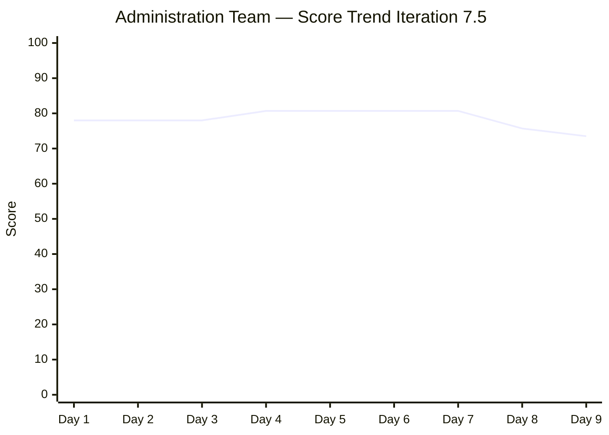
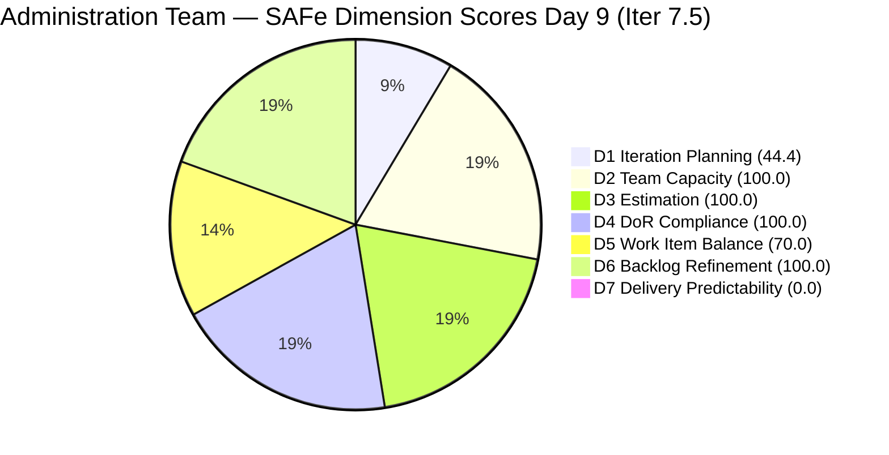
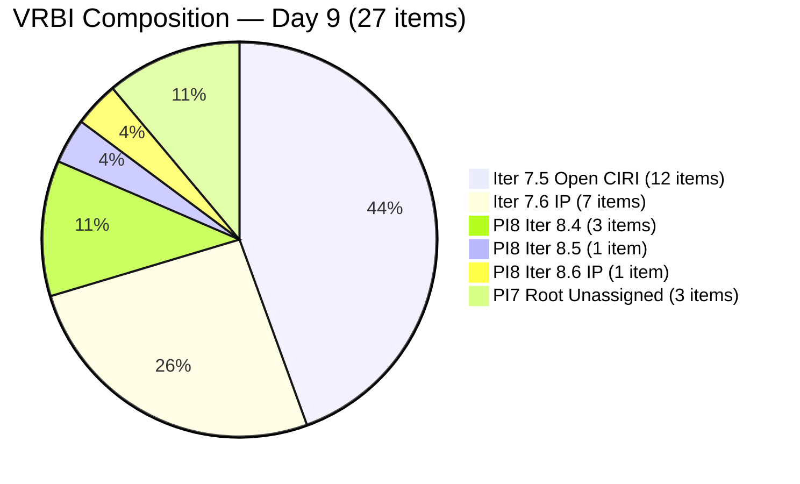

# ADO SAFe Audit — Administration Team

## 1. Audit Metadata

| Field | Value |
|-------|-------|
| **Audit Date** | 2026-06-09 CST |
| **Sprint Day** | Day 9 of 14 |
| **Iteration** | Iteration 7.5 |
| **Iteration Dates** | 2026-06-01 to 2026-06-14 |
| **ADO Project** | Jairosoft FINOPS |
| **ADO Project ID** | e0bb302f-40f9-46c3-8164-6f1acb317d63 |
| **ADO Team** | Administration Team |
| **ADO Team ID** | a38a9c02-07ab-483d-a1e3-aff54e19e603 |
| **Iteration ID** | 3b355811-2941-4edf-a8b1-7ffcdb478f9d |
| **Workspace** | `ado_admin` |
| **Prior Audit** | AUDIT_20260608_0900.md (Day 8, Iteration 7.5, 75.7 — Moderate Risk) |
| **Overall Score** | **73.5 / 100** |
| **Risk Band** | **Moderate Risk** |

---

## 2. Executive Summary

- The Administration Team falls to **73.5 / 100 (Moderate Risk)** on Day 9 of Iteration 7.5, down **2.2 points** from Day 8's 75.7. The regression is driven entirely by a second consecutive backlog expansion event: 7 new items were added to the VRBI on 2026-06-08 evening, increasing VRBI from 20 to 27 and pushing D1 from 60.0 down to 44.4 — the lowest Iteration Planning score this sprint.
- **Two positive developments on Day 9:** (1) The persistent typo in item 205167 ("he JIT") has been corrected — description was updated at 2026-06-08T22:50, resolving a quality hygiene flag that persisted for 8 consecutive audit days. (2) Items 205167 and 205168 received new comments/updates, extending their ChangedDates and keeping D6 healthy.
- **D1 is now High Risk (44.4).** The VRBI now contains 15 non-sprint items (Iter 7.6 IP, PI8 Iter 8.4, PI8 Iter 8.6 IP, and unassigned PI7 root items), compared to 12 sprint items (Iter 7.5). The VRBI has become a planning artifact repository rather than a focused sprint board.
- **D7 = 0.0 persists (Day 9, Critical).** No new closures detected. The 4 past-due Active items (203558, 204448, 204394, 204367) remain unclosed — now overdue for 9-12+ days. True sprint delivery stands at approximately 17 SP but all closed items remain invisible to the backlog API.
- **Five remaining sprint days.** With 12 open CIRI items (25 CSP) and mounting VRBI bloat, the priority actions are: (1) close all 4 overdue Active items today to unlock D7, and (2) immediately halt further backlog additions until sprint close.

---

## 3. Previous Audit Delta

**Prior audit:** AUDIT_20260608_0900.md — Iteration 7.5, Day 8, Score 75.7 / 100 (Moderate Risk)

| Dimension | Day 8 | Day 9 | Delta | Driver |
|-----------|-------|-------|-------|--------|
| D1 Iteration Planning | 60.0 | **44.4** | **−15.6** | VRBI grew 20→27; 7 new items added to backlog 2026-06-08 evening |
| D2 Team Capacity | 100.0 | **100.0** | 0.0 | Mark: 5 hrs/day unchanged |
| D3 Estimation | 100.0 | **100.0** | 0.0 | 12 PECI (US only), all carry SP; CSP=25 SP |
| D4 DoR Compliance | 100.0 | **100.0** | 0.0 | All 12 CIRI pass DoR; 205167 typo now fixed |
| D5 Work Item Balance | 70.0 | **70.0** | 0.0 | US=12/12=100%; Penalty B persists |
| D6 Backlog Refinement | 100.0 | **100.0** | 0.0 | All 27 VRBI fresh; 0 stale; 0 untouched CIRI |
| D7 Delivery Predictability | 0.0 | **0.0** | 0.0 | No new closures; 4 overdue Active items still open |
| **Overall** | **75.7** | **73.5** | **−2.2** | D1 regression from second consecutive VRBI expansion |

**Key changes since Day 8:**
- **7 new items added to VRBI (2026-06-08 evening):**
  - 192221 — Purchase additional Corrugated Sheet and installation Day 1 (US, PI8/Iter 8.4, 2 SP)
  - 193412 — Implementation of aircon repair 2nd floor (US, PI8/Iter 8.4, 2 SP)
  - 197023 — Installation of corrugated sheet at Fire Exit (US, PI8/Iter 8.4, 3 SP)
  - 197029 — Parking with roof for 2 vehicles (US, PI8/Iter 8.6 IP, 3 SP)
  - 197111 — Recanvass for Jockey pump materials needed (US, PI7 root, 1 SP)
  - 197113 — Purchase materials for Jockey pump (US, PI7 root, 1 SP)
  - 197115 — Implementation of installing jockey pump (US, PI7 root, 4 SP)
- **205167 typo corrected.** Description updated 2026-06-08T22:50 — the persistent "he JIT" error is now fixed.
- **205167 and 205168 ChangedDates refreshed.** Both items now have 2026-06-08T22:50/22:51 ChangedDates, reducing untouched age risk.
- **No item state transitions.** All 12 CIRI items retain same states as Day 8.
- **205087 and 205348** (Iter 7.6 IP) also received updates (2026-06-08T22:17 and 22:18).

---

## 4. Current Iteration Snapshot

| Attribute | Value |
|-----------|-------|
| **Active Iteration** | Iteration 7.5 |
| **Sprint Duration** | 2026-06-01 to 2026-06-14 (14 days) |
| **Audit Day** | **Day 9 of 14** |
| **Total Visible Backlog Root Items (VRBI)** | **27** |
| **Current Iteration Root Items (CIRI)** | **12** (Iter 7.5 items visible in backlog) |
| **Sprint Load %** | **44.4%** |
| **Point-Eligible Items (PECI — US only)** | **12** (all User Stories) |
| **Estimated Items (ECI)** | **12** (all PECI carry SP > 0) |
| **Committed Story Points (CSP)** | **25 SP** |
| **Closed Story Points (CLSP, rubric)** | **0 SP** (closed items drop off backlog API) |
| **Actual Closed This Sprint (iteration endpoint)** | **~17 SP** (9 SP Days 3-5 + 8 SP Day 8) |
| **Delivery % (D7, rubric)** | **0.0%** |
| **Item States (CIRI)** | Active: 6 · Ready: 6 |
| **Active Team Members (CW)** | **1** (Mark Colina) |
| **Team Capacity** | Mark: 5 hrs/day (Deployment 1 + Documentation 2 + Requirements 2) |
| **Non-sprint items in VRBI** | **15** (7 in Iter 7.6 IP + 3 in PI8/Iter 8.4 + 1 in PI8/Iter 8.6 IP + 3 in PI7 root unassigned) |
| **Remaining Sprint Days** | 5 |

---

## 5. Work Item Analysis

### 5.1 Current CIRI Items (12 items — Iter 7.5, open in backlog)

| ID | Title | Type | State | SP | Assignee | DoR | ChangedDate |
|----|-------|------|-------|----|----------|-----|-------------|
| 202366 | Philgeps renewal for 2026 | User Story | Active | 3 | Mark Colina | PASS | 2026-06-07T22:05 |
| 203558 | Condo dues (Cebu) payables May 28, 2026 | User Story | Active | 3 | Mark Colina | PASS | 2026-06-07T10:02 |
| 204367 | Government (EGOV) payables May 29, 2026 | User Story | Active | 2 | Mark Colina | PASS | 2026-06-07T22:01 |
| 204394 | Utilities payables for Cebu May 28-31, 2026 | User Story | Active | 2 | Mark Colina | PASS | 2026-06-07T22:02 |
| 204448 | Condo dues (Cebu) payables May 26, 2026 | User Story | Active | 2 | Mark Colina | PASS | 2026-06-07T22:02 |
| 204452 | Professional fee payables | User Story | Ready | 3 | Mark Colina | PASS | 2026-06-07T22:07 |
| 205166 | Philippine flag pole fabrication | User Story | Ready | 1 | Mark Colina | PASS | 2026-06-07T22:12 |
| 205167 | Submission of JIT panaflex logo | User Story | Ready | 1 | Mark Colina | PASS | 2026-06-08T22:50 |
| 205168 | Submission of Jairosoft panaflex logo | User Story | Ready | 1 | Mark Colina | PASS | 2026-06-08T22:51 |
| 205339 | Internet payables for Davao and Cebu office | User Story | Active | 4 | Mark Colina | PASS | 2026-06-07T10:03 |
| 205351 | Jairosoft employee food allowance | User Story | Ready | 1 | Mark Colina | PASS | 2026-06-07T22:16 |
| 205353 | Utilities payables for Cebu June 12-13, 2026 | User Story | Active | 2 | Mark Colina | PASS | 2026-06-07T22:04 |

**CSP = 3+3+2+2+2+3+1+1+1+4+1+2 = 25 SP**

Positive note: 205167 typo ("he JIT") is confirmed corrected in description as of 2026-06-08T22:50.

### 5.2 Past-Due Items (still Active in CIRI)

| ID | Title | Due Date | SP | State | Days Overdue |
|----|-------|----------|----|-------|-------------|
| 204448 | Condo dues (Cebu) May 26 | May 26 | 2 | Active | **14** |
| 203558 | Condo dues (Cebu) May 28 | May 28 | 3 | Active | **12** |
| 204394 | Utilities payables Cebu May 28-31 | May 28-31 | 2 | Active | **9-12** |
| 204367 | EGOV payables May 29 | May 29 | 2 | Active | **11** |

### 5.3 New VRBI Items (added 2026-06-08 evening)

| ID | Title | Type | State | SP | Iteration |
|----|-------|------|-------|----|-----------|
| 197111 | Recanvass for Jockey pump materials needed | User Story | New | 1 | PI7 root (unassigned) |
| 197113 | Purchase materials for Jockey pump | User Story | New | 1 | PI7 root (unassigned) |
| 197115 | Implementation of installing jockey pump | User Story | New | 4 | PI7 root (unassigned) |
| 192221 | Purchase additional Corrugated Sheet and installation Day 1 | User Story | New | 2 | PI8/Iter 8.4 |
| 193412 | Implementation of aircon repair 2nd floor | User Story | New | 2 | PI8/Iter 8.4 |
| 197023 | Installation of corrugated sheet at Fire Exit | User Story | New | 3 | PI8/Iter 8.4 |
| 197029 | Parking with roof for 2 vehicles | User Story | New | 3 | PI8/Iter 8.6 IP |

Note: 197111, 197113, 197115 have iteration path "Jairosoft FINOPS\2026-PI7" (PI7 root, no specific iteration assigned) — these are backlog items without sprint assignment.

### 5.4 Complete Non-CIRI VRBI (15 items)

| ID | Title | Type | Iteration |
|----|-------|------|-----------|
| 197111 | Recanvass for Jockey pump materials | US | PI7 root |
| 197113 | Purchase materials for Jockey pump | US | PI7 root |
| 197115 | Installation of jockey pump | US | PI7 root |
| 192221 | Corrugated Sheet installation Day 1 | US | PI8/Iter 8.4 |
| 193412 | Aircon repair 2nd floor | US | PI8/Iter 8.4 |
| 197023 | Corrugated sheet at Fire Exit | US | PI8/Iter 8.4 |
| 197029 | Parking with roof for 2 vehicles | US | PI8/Iter 8.6 IP |
| 203693 | Admin CR sink cabinet | Defect | PI8/Iter 8.5 |
| 205087 | Toyota Fortuner car loan (Cebu) | US | Iter 7.6 IP |
| 205348 | Toyota Hilux (Car loan) Cebu | US | Iter 7.6 IP |
| 205774 | Blinds to curtains replacement (Cebu) | Defect | Iter 7.6 IP |
| 205861 | Grandia van transportation inquiry | Spike | Iter 7.6 IP |
| 205871 | Isuzu pickup transportation inquiry | Spike | Iter 7.6 IP |
| 205872 | EBET Jairosoft graduation preparation | Enabler | Iter 7.6 IP |
| 205873 | Fabrication of platform for JIT | US | Iter 7.6 IP |

---

## 6. SAFe Compliance Scorecard

| Dimension | Score | Evidence (Numerator / Denominator) | Risk Band | Notes |
|-----------|-------|-------------------------------------|-----------|-------|
| D1 Iteration Planning | **44.4** | 12 CIRI / 27 VRBI | High | VRBI grew 20→27; 7 new non-sprint items added on Day 8 evening |
| D2 Team Capacity | **100.0** | 1 CC / 1 CW | Low | Mark: 5 hrs/day; Grace: 0 hrs/day (excluded) |
| D3 Estimation | **100.0** | 12 ECI / 12 PECI | Low | All 12 CIRI are US with SP > 0; CSP=25 SP |
| D4 DoR Compliance | **100.0** | 12 DCI / 12 CIRI | Low | All 12 pass; 205167 typo corrected on Day 9 |
| D5 Work Item Balance | **70.0** | US=12/12=100% | Moderate | Penalty B (−30): US=100% > 60%; structural cap |
| D6 Backlog Refinement | **100.0** | 27 fresh / 27 VRBI | Low | 0 stale_90; 0 stale_180; 0 untouched CIRI |
| D7 Delivery Predictability | **0.0** | 0 CLSP / 25 CSP | Critical | 17 SP closed (actual) but invisible to backlog API; rubric gap persists |
| **Overall** | **73.5** | (44.4+100+100+100+70+100+0)/7 | **Moderate Risk** | −2.2 from Day 8; D1 regression drives score further below 75 |

**Formula verification:**
- D1: round(12/27×100,1) = round(44.444,1) = **44.4**
- D2: round(1/1×100,1) = **100.0**
- D3: round(12/12×100,1) = **100.0**
- D4: round(12/12×100,1) = **100.0**
- D5: max(0, 100−30) = **70.0** [US=12/12=100% > 60% → Penalty B]
- D6: base=round(27/27×100,1)=100.0; stale_90=0; stale_180=0; untouched=0 → **100.0**
- D7: round(0/25×100,1) = **0.0**
- Overall: round((44.4+100.0+100.0+100.0+70.0+100.0+0.0)/7,1) = round(514.4/7,1) = round(73.486,1) = **73.5**

---

## 7. Dimension Findings

### 7.1 Iteration Planning (44.4 — High Risk)

**VRBI:** 27 items. **CIRI:** 12 items (Iter 7.5, open in backlog).

**Formula:** round(12/27 × 100, 1) = **44.4**

This is the lowest D1 score this sprint. The VRBI has now accumulated 15 non-sprint items across four different iteration contexts (Iter 7.6 IP, PI8/Iter 8.4, PI8/Iter 8.5, PI8/Iter 8.6 IP, and PI7 root unassigned). The second consecutive evening of large backlog additions has pushed D1 below the High Risk threshold (< 60).

The 3 new PI7-root items (197111, 197113, 197115 — Jockey pump sequence) are particularly notable: they have no iteration path beyond "Jairosoft FINOPS\2026-PI7", meaning they are unassigned to any sprint. Adding unscheduled work to the active backlog mid-sprint is a SAFe anti-pattern — these items should be staged in a future iteration before appearing in the VRBI.

To recover D1 to Low Risk (≥80): CIRI would need to reach ≥22 of 27 VRBI — impossible mid-sprint without inappropriate scope addition. The structural fix for PI8 planning is to maintain a clean VRBI that contains only the active sprint items plus the immediate next iteration's planned items.

### 7.2 Team Capacity (100.0 — Low Risk)

**CW:** 1 (Mark Colina). **CC:** 1 (5 hrs/day — Deployment 1 + Documentation 2 + Requirements 2).

**Formula:** round(1/1 × 100, 1) = **100.0**

Mark has 5 remaining sprint days at 5 hrs/day = 25 effective hours. The 25 CSP open in the rubric includes 4 Active past-due items (9 SP overdue 9-14 days). True open work is approximately 16 SP from the remaining 8 Ready/Active items (excluding the 4 past-due ones if those transactions are done).

### 7.3 Estimation (100.0 — Low Risk)

**PECI:** 12 User Stories (all CIRI items). **ECI:** 12. **CSP:** 25 SP.

**Formula:** round(12/12 × 100, 1) = **100.0**

Note: All 7 new VRBI items (non-CIRI) have SP assigned (1-4 SP each). However, 205872 (EBET graduation prep, Enabler, Iter 7.6 IP) still has no SP or DoR — it is in VRBI but not in CIRI and does not affect D3.

### 7.4 DoR Compliance (100.0 — Low Risk)

**CIRI:** 12. **DCI:** 12 — all pass Description ≥ 30 non-whitespace chars AND AC ≥ 20 non-whitespace chars.

**Formula:** round(12/12 × 100, 1) = **100.0**

**Positive development:** 205167 ("Submission of JIT panaflex logo") — the persistent "he JIT" typo in the description has been corrected. Description was updated 2026-06-08T22:50. This quality hygiene issue that persisted for 8 consecutive audit days is now resolved.

205168 also received an update (2026-06-08T22:51). Both items continue to pass DoR length thresholds.

### 7.5 Work Item Balance (70.0 — Moderate Risk)

**CIRI type distribution (12 items):** User Story = 12 (100%)

| Penalty | Check | Result |
|---------|-------|--------|
| A (no User Story) | 12 US present | 0 |
| B (dominant type > 60%) | US = 100% > 60% | **−30** |
| C (spike share > 40%) | 0 Spikes | 0 |

**Formula:** max(0, 100 − 30) = **70.0**

Structural cap for the duration of Iter 7.5. No Enablers, Spikes, or Defects remain in CIRI. Fix for PI8/Iter 8.1: explicitly plan at least 2-3 non-User-Story items (Enablers for process improvements, Spikes for infrastructure investigations).

### 7.6 Backlog Refinement (100.0 — Low Risk)

**Fresh window:** ChangedDate ≥ 2026-04-25 (45 days before 2026-06-09).
**Fresh VRBI:** 27/27 — all items last changed on or after 2026-05-18 (oldest is 204502 at 2026-05-18). All 7 new items changed 2026-06-08T22:36–22:52.
**stale_90 (before 2026-03-11):** 0 items.
**stale_180 (before 2025-12-12):** 0 items.
**Untouched CIRI (ChangedDate < 2026-06-01T00:00:00Z):** 0 items — all 12 CIRI items were last changed 2026-06-01 or later.

**Formula:** max(0, 100.0 − 0) = **100.0**

The backlog is actively managed — comments and updates keep all VRBI items within the 45-day fresh window. However, the health of D6 is somewhat artificial: many items are being "touched" via comments rather than substantive work (state transitions, SP updates, DoR improvements).

**Watch:** 203558 (last changed 2026-06-07T10:02) and 205339 (last changed 2026-06-07T10:03) are now 48+ hours without update. Neither crosses the untouched threshold (ChangedDate < sprint start), but their Active state without progress is an operational concern.

### 7.7 Delivery Predictability (0.0 — Critical Risk)

**CSP:** 25 SP. **CLSP:** 0 SP (no PECI items in Closed/Done state in the backlog API).

**Formula:** round(0/25 × 100, 1) = **0.0**

Day 9 of 14. The early-sprint annotation window expired on Day 5. D7 = 0.0 is a persistent structural signal. Actual delivery (~17 SP, 51.5% of original 33 CSP) is substantially higher than the rubric reflects.

**D7 recovery scenarios — Day 9 (5 days remaining):**

| Action | CLSP | D7 | Overall | Band |
|--------|------|----|---------|------|
| Current (no new closures) | 0 SP | 0.0 | **73.5** | **Moderate** |
| Close 204448 (2 SP) | 2 SP | 8.0 | 74.6 | Moderate |
| Close 204448 + 203558 (5 SP) | 5 SP | 20.0 | 76.4 | Moderate |
| Close all 4 past-due Active (9 SP) | 9 SP | 36.0 | 78.6 | Moderate |
| Close all 4 past-due + 204452 (12 SP) | 12 SP | 48.0 | 80.1 | **Low** |
| Close all CIRI (25 SP) | 25 SP | 100.0 | 90.6 | Low |

Closing the 4 past-due Active items + 204452 (Professional fees) raises overall to ~80.1 (Low Risk). 5 days remain.

---

## 8. Risks and Bottlenecks

| # | Risk | Severity | Items Affected | Status |
|---|------|----------|----------------|--------|
| 1 | D1=44.4 — VRBI bloat from 2 consecutive backlog expansion events | **Critical** | 15 non-sprint items in VRBI | Days 7-8 added 11 non-sprint items; VRBI grew from 19 to 27 |
| 2 | D7=0.0 — rubric cannot see 17 SP of actual delivery | **Critical** | 25 CSP open, 0 CLSP | Structural API gap; 9 items closed since Day 3 |
| 3 | 4 past-due items still Active (9-14 days overdue) | **High** | 204448, 203558, 204394, 204367 (9 SP) | Not closed despite 14 days elapsed; ADO hygiene gap |
| 4 | 3 unassigned PI7 root items in VRBI (197111, 197113, 197115) | **High** | 6 SP — Jockey pump sequence | No sprint assignment; added mid-sprint; planning anti-pattern |
| 5 | Bus factor = 1 (Mark Colina only) | **High** | All 12 items | Persistent across all PI7 audits |
| 6 | D5=70.0 structural — US=100% | **Medium** | 12 items | Structural cap; no Spike/Enabler/Defect in CIRI |
| 7 | 205872 (EBET graduation prep) still has no SP or DoR | **Medium** | 1 item in VRBI | Day 10 with no content; needs grooming before Iter 7.6 IP |
| 8 | 5 remaining sprint days with 25 CSP open in rubric | **Medium** | All CIRI | Closing 4 past-due items is the highest-leverage action |
| 9 | 202366 (PhilGEPS renewal) no progress update since 2026-06-07 | **Low** | 1 item, 3 SP | Active with no visible state transition |
| 10 | 197029 (Parking roof) and PI8/8.4 items added to VRBI during active sprint | **Low** | 4 items | Future PI items should not appear in current sprint VRBI |

---

## 9. Prioritized Recommendations

1. **Close the 4 remaining past-due Active items today.** Items 204448 (14 days overdue), 203558 (12 days overdue), 204394 (9-12 days overdue), and 204367 (11 days overdue) represent 9 SP of transactions that have been overdue for over 1-2 weeks. If the underlying work is done, close these items now. Closing all four plus 204452 (Professional fees) raises overall to approximately 80.1 (Low Risk). This is the single highest-leverage action remaining.

2. **Immediately stop adding items to the VRBI until sprint close.** Over the past two evenings, 11 non-sprint items were added to the backlog (Days 7-8). This has driven D1 from 95.0 on Day 7 to 44.4 today — a 50.6-point collapse in 2 days. Future-sprint items should be staged in their target iteration's backlog, not in the current active backlog. The PI8 items (192221, 193412, 197023, 197029) and unassigned PI7 items (197111, 197113, 197115) are not sprint-relevant.

3. **Assign iteration paths to 197111, 197113, 197115 (Jockey pump sequence).** These 3 US items currently sit at the PI7 root level with no specific sprint assignment. They should be assigned to PI8/Iter 8.1 (or later) before the start of PI8 planning. Leaving them unassigned creates backlog confusion and suppresses D1.

4. **Add SP, Description, and Acceptance Criteria to 205872 (EBET graduation prep).** This Enabler has been in VRBI for 2 days with no content — no SP, no description, no AC. It will fail DoR if it enters a sprint. Groom it during the remaining sprint days.

5. **Close 205353 (Utilities June 12-13) by Day 11.** This item's due date is June 12-13 — within the current sprint. Mark should ensure payment is processed by June 12 and the item is closed the same day.

6. **Plan PI8/Iter 8.1 with type balance.** For all future iterations, ensure CIRI includes at least 2-3 non-User-Story items (Enablers or Spikes). The Administration Team has had US > 60% in every iteration this PI, causing a persistent D5 cap at 70.0.

---

## 10. Evidence Gaps and Limitations

- **Closed items invisible to rubric.** Nine items closed since Day 3 (17 SP total) are confirmed via the iteration work items endpoint but absent from the backlog API. D7 = 0.0 despite ~51.5% actual sprint delivery. This is a known structural characteristic.
- **CIRI count = 12 (backlog only).** Strict rubric definition used. Augmented CIRI (adding closed items from iteration endpoint) = 21 items. D1 under augmented = round(21/27×100,1) = 77.8. This report uses strict rubric (CIRI = subset of VRBI).
- **197111, 197113, 197115 iteration classification.** These items have path "Jairosoft FINOPS\2026-PI7" — this is the PI7 root container, not a specific iteration. Classified as non-CIRI for D1 calculation.
- **205872 fields confirmed null.** No SP, no description, no AC fields populated as of Day 9.
- **Grace capacity confirmed at 0 hrs/day Administration (excluded from CW/CC).**
- **No sprint burndown from API.** Velocity projections estimated from ChangedDate patterns.

---

## Appendix: Score Visualization

**Score Trend — Iteration 7.5:**

| Audit | Day | Score | Band | Key Event |
|-------|-----|-------|------|-----------|
| AUDIT_20260601 | 1 | 78.0 | Moderate | Sprint open |
| AUDIT_20260602 | 2 | 78.0 | Moderate | No activity |
| AUDIT_20260603 | 3 | 78.0 | Moderate | 12 untouched |
| AUDIT_20260604 | 4 | 80.7 | Low | 3 items closed; D6 penalty resolved |
| AUDIT_20260605 | 5 | 80.7 | Low | 2 more closures; 2 new items added |
| AUDIT_20260606 | 6 | 80.7 | Low | D7 annotation expired; 0 new closures |
| AUDIT_20260607 | 7 | 80.7 | Low | Sprint midpoint; 9 SP delivered but rubric-invisible |
| AUDIT_20260608 | 8 | 75.7 | Moderate | 4 items closed (8 SP); backlog restructuring drops D1 to 60.0 |
| **AUDIT_20260609** | **9** | **73.5** | **Moderate** | **7 new VRBI items; D1 drops to 44.4 (High Risk); 205167 typo fixed** |
