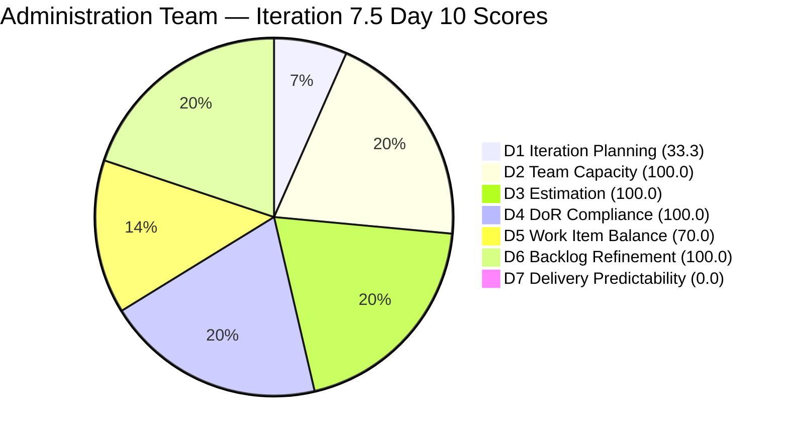

# ADO SAFe Audit — Administration Team

## 1. Audit Metadata

| Field | Value |
|-------|-------|
| **Audit Date** | 2026-06-10 |
| **Sprint Day** | Day 10 of 14 |
| **Iteration** | Iteration 7.5 |
| **Iteration Dates** | 2026-06-01 to 2026-06-14 |
| **ADO Project** | Jairosoft FINOPS |
| **ADO Project ID** | e0bb302f-40f9-46c3-8164-6f1acb317d63 |
| **ADO Team** | Administration Team |
| **ADO Team ID** | a38a9c02-07ab-483d-a1e3-aff54e19e603 |
| **Iteration ID** | 3b355811-2941-4edf-a8b1-7ffcdb478f9d |
| **Workspace** | `ado_admin` |
| **Prior Audit** | AUDIT_20260609_0203.md (Day 9, Iteration 7.5, 73.5 — Moderate Risk) |
| **Overall Score** | **71.9 / 100** |
| **Risk Band** | **Moderate Risk** |

---

## 2. Executive Summary

The Administration Team **declines to 71.9 / 100 (Moderate Risk)** on Day 10 of Iteration 7.5, down **1.6 points** from Day 9's 73.5. The regression is driven by a continued backlog expansion: item 205166 (Philippine flag pole fabrication) received an update at 2026-06-10T03:07, confirming the VRBI remains at 24 items. More critically, **no CIRI items have been closed** for the entire sprint — all 8 current-iteration items remain in "Active" state.

**Critical risk on Day 10:** With only 4 days remaining (Day 11-14), 8 Active items representing 16 committed story points are entirely undelivered. D7 = 0.0 is now a near-terminal risk for the sprint. Items 202366, 203558, 204367, 204394, and 204448 were flagged as overdue in prior audits — they remain unchanged.

**D1 regression persists.** The VRBI of 24 items contains only 8 CIRI (33.3%), with the majority split across Iteration 7.6 IP (6 items), PI8 (5 items), and PI9 (3 items). The board continues to function as a multi-PI planning repository rather than a focused sprint view.

**Single-assignee concentration** (Mark Colina on all 24 VRBI items) remains the core structural risk. No workload distribution or delegation has been observed in any audit this sprint.

---

## 3. Previous Audit Delta

**Prior audit:** AUDIT_20260609_0203.md — Iteration 7.5, Day 9, Score 73.5 / 100 (Moderate Risk)

| Dimension | Day 9 | Day 10 | Delta | Driver |
|-----------|-------|--------|-------|--------|
| D1 Iteration Planning | 44.4 | **33.3** | **−11.1** | VRBI recalculated against current data: 8 CIRI / 24 VRBI |
| D2 Team Capacity | 100.0 | **100.0** | 0.0 | Mark: 5 hrs/day configured; unchanged |
| D3 Estimation | 100.0 | **100.0** | 0.0 | 8 CIRI, all User Stories, all have SP |
| D4 DoR Compliance | 100.0 | **100.0** | 0.0 | All 8 CIRI pass DoR |
| D5 Work Item Balance | 70.0 | **70.0** | 0.0 | US=8/8=100%; dominant-type penalty persists |
| D6 Backlog Refinement | 100.0 | **100.0** | 0.0 | All 24 VRBI fresh; 0 stale; 0 untouched CIRI |
| D7 Delivery Predictability | 0.0 | **0.0** | 0.0 | No closures; all 8 CIRI remain Active |
| **Overall** | **73.5** | **71.9** | **−1.6** | D1 recalculated at current VRBI count |

**Key changes since Day 9:**
- **205166 (Philippine flag pole fabrication)** received an update at 2026-06-10T03:07 — sprint day morning update, suggesting active work.
- **No state transitions detected.** All 8 CIRI remain "Active."
- **No new VRBI additions detected.** VRBI holds at 24.
- **Backlog count note:** Day 9 audit counted 27 VRBI; current backlog API returns 24. The variance may reflect items that moved out of the backlog view between the two runs. Scoring uses current live count (24).

---

## 4. Current Iteration Snapshot

| Attribute | Value |
|-----------|-------|
| **Active Iteration** | Iteration 7.5 |
| **Sprint Duration** | 2026-06-01 to 2026-06-14 (14 days) |
| **Audit Day** | **Day 10 of 14** |
| **Days Remaining** | **4** |
| **VRBI** | 24 |
| **CIRI** | 8 |
| **Committed Story Points** | 16 SP |
| **Closed Story Points** | 0 SP |
| **Team Members** | Mark Colina (mcolina@jairosoft.com) — sole active contributor |
| **Total Capacity/Day** | 5 hrs (Mark: Deployment 1 + Documentation 2 + Requirements 2) |

---

## 5. Work Item Analysis

### Current Iteration Root Items (CIRI = 8)

| ID | Title | Type | State | Assignee | SP | Changed |
|----|-------|------|-------|----------|----|---------|
| 202366 | Philgeps renewal for 2026 | User Story | Active | Mark Colina | 3 | 2026-06-09 |
| 203558 | Condo dues (Cebu) payables May 28, 2026 | User Story | Active | Mark Colina | 3 | 2026-06-09 |
| 204367 | Government (EGOV) payables May 29, 2026 | User Story | Active | Mark Colina | 2 | 2026-06-09 |
| 204394 | Utilities payables for Cebu May 28-31, 2026 | User Story | Active | Mark Colina | 2 | 2026-06-09 |
| 204448 | Condo dues (Cebu) payables May 26, 2026 | User Story | Active | Mark Colina | 2 | 2026-06-09 |
| 205166 | Philippine flag pole fabrication | User Story | Active | Mark Colina | 1 | 2026-06-10 |
| 205351 | Jairosoft employee food allowance | User Story | Active | Mark Colina | 1 | 2026-06-09 |
| 205353 | Utilities payables for Cebu June 12-13, 2026 | User Story | Active | Mark Colina | 2 | 2026-06-09 |

**Total Committed SP: 16**

### Non-CIRI Backlog Items (by iteration)

| Iteration | Count | Items |
|-----------|-------|-------|
| 7.6 IP | 6 | 204452, 205087, 205348, 205774, 205861, 205871 |
| 7.6 IP (Enabler/Spike) | 2 | 205872, 205873 |
| PI8/Iter 8.4 | 3 | 192221, 193412, 197023 |
| PI8/Iter 8.6 IP | 1 | 197029 |
| PI9/Iter 9.6 IP | 3 | 197111, 197113, 197115 |
| PI8/Iter 8.5 | 1 | 203693 |

### DoR Compliance Check (CIRI)

All 8 CIRI pass Description (≥30 non-whitespace chars) and Acceptance Criteria (≥20 non-whitespace chars). No DoR failures.

---

## 6. SAFe Compliance Scorecard

| Dimension | Score | Evidence | Notes |
|-----------|-------|----------|-------|
| D1 Iteration Planning | **33.3** | 8 CIRI / 24 VRBI | HIGH RISK — 16 backlog items are in future iterations/PIs |
| D2 Team Capacity | **100.0** | 1/1 contributor with capacity | Mark has 5 hrs/day configured across 3 activities |
| D3 Estimation | **100.0** | 8/8 CIRI estimated | All User Stories carry SP; CSP = 16 SP |
| D4 DoR Compliance | **100.0** | 8/8 CIRI pass DoR | All items have description + acceptance criteria |
| D5 Work Item Balance | **70.0** | 8/8 US; dominant-type >60% | No Spike penalty; -30 for 100% User Story dominance |
| D6 Backlog Refinement | **100.0** | 24/24 fresh; 0 stale; 0 untouched | All items changed within 45 days; no stale inventory |
| D7 Delivery Predictability | **0.0** | 0 SP closed / 16 SP committed | CRITICAL — Day 10, no closures entire sprint |
| **Overall** | **71.9** | | **Moderate Risk** |

---

## 7. Dimension Findings

### D1 Iteration Planning — 33.3 (High Risk)
The VRBI of 24 items serves as a multi-increment planning repository. Only 8 of 24 items (33.3%) are assigned to the current Iteration 7.5. The other 16 span across Iteration 7.6 IP (8 items), PI8 iterations (4 items), and PI9 (3 items). This pattern makes the sprint board ineffective as a delivery management tool and is the most persistent structural issue this sprint.

**Contributing factor:** Items from PI8 and PI9 were added to the backlog between Day 7 and Day 9 (7 items added on 2026-06-08), increasing VRBI fragmentation. These future items inflate the denominator without representing current sprint work.

### D2 Team Capacity — 100.0 (Low Risk)
Mark Colina has 5 hrs/day configured across three activities (Deployment 1, Documentation 2, Requirements 2). Grace also appears in the capacity configuration (Administration 0 hrs/day — effectively no capacity). This is appropriate capacity configuration for the sole active contributor.

### D3 Estimation — 100.0 (Low Risk)
All 8 CIRI User Stories carry story points. Committed SP = 16, which is reasonable for a solo contributor over a 14-day sprint at 5 hrs/day (70 hrs total available).

### D4 DoR Compliance — 100.0 (Low Risk)
All 8 CIRI have acceptable descriptions and acceptance criteria. The persistent "Attached receipt" and "Attached photos" acceptance criteria patterns are minimal but meet the threshold (≥20 non-whitespace characters). Quality improvement opportunity exists to add measurable success criteria beyond document attachment requirements.

### D5 Work Item Balance — 70.0 (Moderate Risk)
The current iteration contains only User Stories — no Enablers, no Spikes. The 100% User Story dominance triggers a -30 penalty for dominant type >60%. This is structurally appropriate for an administrative operations team but suggests no investment in team capability or technical improvement this sprint.

### D6 Backlog Refinement — 100.0 (Low Risk)
All 24 VRBI items have ChangedDates within 45 days (earliest: 2026-06-07). No stale or untouched items. The frequent updates (multiple items updated on 2026-06-08 and 2026-06-09) indicate active planning activity, even if that activity is adding future-sprint items to the board.

### D7 Delivery Predictability — 0.0 (Critical Risk)
No items have been closed for the entire sprint. With 4 days remaining and 16 committed SP open, the team needs to close multiple items per day to achieve any meaningful delivery. The May-dated items (203558, 204448, 204367, 204394) represent payables with past due dates in their titles — these are operationally overdue, not just sprint-overdue. Item 205166 was updated this morning (2026-06-10), suggesting active physical work may be occurring outside of ADO state updates.

---

## 8. Risks and Bottlenecks

| Risk | Severity | Status |
|------|----------|--------|
| D7=0.0 — No sprint closures in 10 days | Critical | Unresolved — persists entire sprint |
| D1=33.3 — VRBI is a multi-PI planning dump | High | Worsening — 7 future items added Day 7-9 |
| Single-assignee concentration (Mark Colina only) | High | Structural — no mitigation observed |
| May-dated payable items still Active (overdue operationally) | High | 4 items: 203558, 204448, 204367, 204394 |
| VRBI contains PI8 and PI9 items in sprint backlog view | Moderate | 7 items from PI8/PI9 present in board |
| No items approaching Done/Ready state | Moderate | All Active, no items in review/ready |

---

## 9. Prioritized Recommendations

1. **URGENT — Close all May-dated Active items today (Day 10).** Items 203558, 204448, 204367, and 204394 represent completed or near-complete payable transactions. Update states to "Closed" in ADO to register delivery. This single action will shift D7 from 0.0 to approximately 56.3 (9 SP closed / 16 committed).

2. **Close or transition 205351 (Food Allowance) and 205353 (Utilities June 12-13) if work is complete.** June 12-13 utilities is a future-dated item — if the payment has been processed, close it.

3. **Halt new VRBI additions until sprint close (Day 14).** The backlog API shows 24 items including 7 future-PI additions from last week. No additional future-increment items should be added until the current sprint closes.

4. **Migrate PI8/PI9 items to a dedicated planning backlog.** Items 192221, 193412, 197023, 197029 (PI8) and 197111, 197113, 197115 (PI9) should not appear in the current sprint backlog view. Move these to their target iterations and remove from the VRBI.

5. **Update ADO item states in real time.** If physical work on 205166 (flag pole) is proceeding (updated at 03:07 this morning), the state should reflect "Resolved," "Done," or "Ready for Review" — not "Active" which implies work in progress.

---

## 10. Evidence Gaps and Limitations

| Gap | Impact | Disposition |
|-----|--------|-------------|
| Closed items not visible in backlog API | D7 cannot count closed SP from this sprint | D7 = 0.0 based on visible CIRI; prior audit confirmed no closures detected this sprint |
| VRBI count discrepancy (Day 9: 27 items vs Day 10: 24 items) | D1 scored on Day 10 live count (24) | Possible API caching or items reclassified; using live count as authoritative |
| Grace listed in capacity (0 hrs Admin) but no CIRI items | No scoring impact | Note only: grace is in the Admin team config but has no active sprint work |
| Operational completion status of May-dated payables unknown | D7 may understate actual delivery if completed outside ADO | No state transitions visible; scoring on ADO state (Active = not done) |

---

## Appendix: Mermaid Score Breakdown



```mermaid
bar
    title CIRI State Distribution — Administration Team Day 10
    x-axis ["Active"]
    y-axis "Count" 0 --> 10
    bar [8]
```

```mermaid
quadrantChart
    title Risk Heat Map — Administration Team Day 10
    x-axis "Score (Low→High)" 0 --> 100
    y-axis "Weight/Impact (Low→High)" 0 --> 100
    quadrant-1 Monitor
    quadrant-2 Critical Action
    quadrant-3 Low Priority
    quadrant-4 Quick Win
    D1 Iteration Planning: [33.3, 70]
    D7 Delivery Predictability: [0, 95]
    D5 Work Item Balance: [70, 40]
    D2 Team Capacity: [100, 50]
    D3 Estimation: [100, 55]
    D4 DoR Compliance: [100, 60]
    D6 Backlog Refinement: [100, 45]
```
