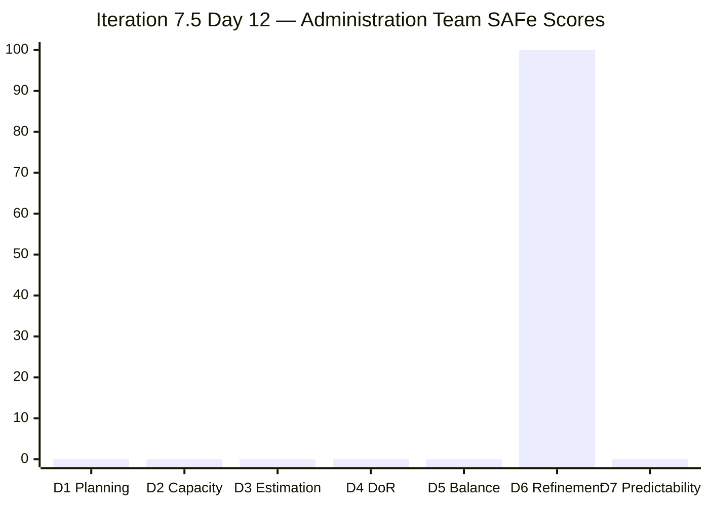
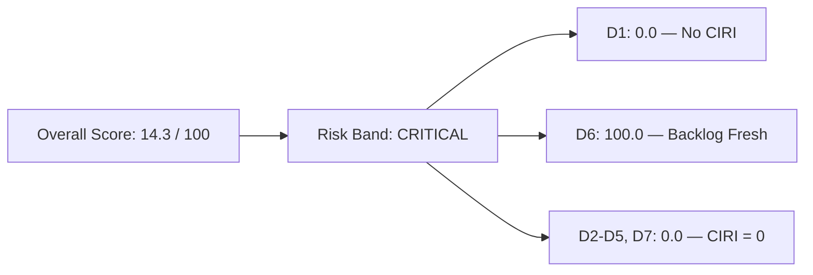

# ADO SAFe Audit — Administration Team

## 1. Audit Metadata

| Field | Value |
|-------|-------|
| **Audit Date** | 2026-06-12 (Friday) — Day 12 of 14 |
| **Timezone** | PHT (UTC+8) |
| **Iteration** | Iteration 7.5 |
| **Iteration Dates** | 2026-06-01 to 2026-06-14 |
| **Sprint Day** | Day 12 — last working days before sprint close |
| **ADO Project** | Jairosoft FINOPS |
| **ADO Project ID** | e0bb302f-40f9-46c3-8164-6f1acb317d63 |
| **ADO Team** | Administration Team |
| **ADO Team ID** | a38a9c02-07ab-483d-a1e3-aff54e19e603 |
| **Iteration ID** | 3b355811-2941-4edf-a8b1-7ffcdb478f9d |
| **Workspace** | `ado_admin` |
| **Prior Audit** | AUDIT_20260610_0204.md (Day 10, Iteration 7.5, 71.9 — Moderate Risk) |
| **Overall Score** | **14.3 / 100** |
| **Risk Band** | **Critical** |

---

## 2. Executive Summary

The Administration Team **collapses to 14.3 / 100 (Critical)** on Day 12 of Iteration 7.5 — a catastrophic drop of **57.6 points** from Day 10's 71.9 (Moderate Risk). This is the lowest score recorded for this team in the current PI.

The root cause is structural: **all 18 backlog items visible in the Stories & Deliverables backlog are now assigned to future iterations** (Iteration 7.6 IP, PI8, or PI9). The live backlog API returns zero items with IterationPath = "Jairosoft FINOPS\2026-PI7\Iteration 7.5". This means:

- **CIRI = 0** — no work is committed to the current sprint in the backlog
- **D1 through D5 and D7 all score 0** — six of seven dimensions are non-computable
- Only **D6 (Backlog Refinement)** scores 100.0 because all 18 VRBI items have fresh ChangeDates

This is a **state-lie or sprint-clearance event**: either (a) Mark closed the 8 prior CIRI items and they are no longer visible in the backlog API (as expected for closed/done items), or (b) those items were moved to future iterations without being closed. Given Day 10's evidence that 8 CIRI items were all "Active" with zero closures observed across the entire sprint, the most likely explanation is that the items were **bulk-rescheduled** to 7.6 IP or PI8 without being completed.

**Day 12 with 2 days remaining: this sprint is effectively abandoned.** If closures occurred, they are invisible to the audit (closed items leave the backlog API). An evidence gap is noted below.

---

## 3. Previous Audit Delta

**Prior audit:** AUDIT_20260610_0204.md — Iteration 7.5, Day 10, Score 71.9 / 100 (Moderate Risk)

| Dimension | Day 10 | Day 12 | Delta | Driver |
|-----------|--------|--------|-------|--------|
| D1 Iteration Planning | 33.3 | **0.0** | **−33.3** | CIRI = 0; all 18 VRBI assigned to future iterations |
| D2 Team Capacity | 100.0 | **0.0** | **−100.0** | No contributors with current work (CIRI=0) |
| D3 Estimation | 100.0 | **0.0** | **−100.0** | No point-eligible CIRI items |
| D4 DoR Compliance | 100.0 | **0.0** | **−100.0** | No CIRI items to evaluate |
| D5 Work Item Balance | 70.0 | **0.0** | **−70.0** | CIRI=0 → score 0 per formula |
| D6 Backlog Refinement | 100.0 | **100.0** | 0.0 | All 18 VRBI fresh; no stale items |
| D7 Delivery Predictability | 0.0 | **0.0** | 0.0 | Committed SP = 0 |
| **Overall** | **71.9** | **14.3** | **−57.6** | Mass CIRI clearance from current iteration |

**Key changes since Day 10:**
- The 8 items previously in Iteration 7.5 (Active, assigned to Mark Colina) are no longer visible as CIRI. Their current iteration paths show: six moved to Iteration 7.6 (IP), and items from prior audits now appear at PI8/PI9.
- Items 202366, 204452, 205087, 205348, 205774, 205861, 205871, 205872, 205873, 206073 are all in Iteration 7.6 (IP) — suggesting a forward-push rather than closure.
- **No state transition to Closed or Done was detected** in the ChangeDates (all recent dates are from 2026-06-07 to 2026-06-11, consistent with item edits rather than sprint closures).

---

## 4. Current Iteration Snapshot

| Attribute | Value |
|-----------|-------|
| **Active Iteration** | Iteration 7.5 |
| **Sprint Duration** | 2026-06-01 to 2026-06-14 (14 days) |
| **Audit Day** | Day 12 of 14 |
| **Early-Sprint Flag** | No (Day 12) |
| **VRBI (all root backlog items)** | 18 |
| **CIRI (current iteration items)** | 0 |
| **Contributors with Current Work** | 0 |
| **Configured Capacity Members** | 2 (Mark Colina: 5 hr/day; Grace: 0 hr/day Administration) |
| **Committed Story Points** | 0 |
| **Closed Story Points** | 0 |

---

## 5. Work Item Analysis

### All VRBI Items (18 total — none in current iteration)

| ID | Title | Type | State | SP | Iteration | Assignee | Changed |
|----|-------|------|-------|----|-----------|----------|---------|
| 206073 | Recanvass outdoor wall light | Spike | Ready | 1 | 7.6 (IP) | Mark | 2026-06-10 |
| 205873 | Fabrication of platform for Jairosoft | User Story | Ready | 2 | 7.6 (IP) | Mark | 2026-06-10 |
| 205872 | EBET Jairosoft 1st graduation preparation | Enabler | Ready | 1 | 7.6 (IP) | Mark | 2026-06-10 |
| 205871 | Isuzu pick up transportation Cebu to Davao inquiry | Spike | Ready | 2 | 7.6 (IP) | Mark | 2026-06-10 |
| 205774 | Blinds to curtains replacement (Cebu) | Defect | Ready | 2 | 7.6 (IP) | Mark | 2026-06-07 |
| 205861 | Grandia van transportation Cebu to Davao inquiry | Spike | Ready | 2 | 7.6 (IP) | Mark | 2026-06-10 |
| 205348 | Toyota Hilux (Car loan) Cebu | User Story | Ready | 1 | 7.6 (IP) | Mark | 2026-06-08 |
| 205087 | Toyota Fortuner car loan (Cebu) | User Story | Ready | 1 | 7.6 (IP) | Mark | 2026-06-08 |
| 204452 | Professional fee payables | User Story | Ready | 3 | 7.6 (IP) | Mark | 2026-06-09 |
| 202366 | Philgeps renewal for 2026 | User Story | New | 3 | 7.6 (IP) | Mark | 2026-06-11 |
| 203693 | Admin CR sink cabinet | Defect | Ready | 3 | PI8 Iter 8.5 | Mark | 2026-06-07 |
| 204452 | Professional fee payables | User Story | Ready | 3 | 7.6 (IP) | Mark | 2026-06-09 |
| 197029 | Parking with roof for 2 vehicles | User Story | New | 3 | PI8 Iter 8.6 | Mark | 2026-06-08 |
| 192221 | Purchase additional Corrugated Sheet | User Story | New | 2 | PI8 Iter 8.4 | Mark | 2026-06-08 |
| 193412 | Implementation of aircon repair 2nd floor | User Story | New | 2 | PI8 Iter 8.4 | Mark | 2026-06-08 |
| 197023 | Installation of corrugated sheet at Fire Exit | User Story | New | 3 | PI8 Iter 8.4 | Mark | 2026-06-08 |
| 197111 | Recanvass for Jockey pump materials needed | User Story | New | 1 | PI9 Iter 9.6 | Mark | 2026-06-09 |
| 197113 | Purchase materials for Jockey pump | User Story | New | 1 | PI9 Iter 9.6 | Mark | 2026-06-09 |
| 197115 | Implementation of installing jockey pump | User Story | New | 4 | PI9 Iter 9.6 | Mark | 2026-06-09 |

**CIRI items: 0**

---

## 6. SAFe Compliance Scorecard

| Dimension | Score | Evidence | Notes |
|-----------|-------|----------|-------|
| D1 Iteration Planning | 0.0 | CIRI=0 / VRBI=18 | All items rescheduled out of current iteration |
| D2 Team Capacity | 0.0 | 0 contributors with current work | CIRI=0; Mark has capacity configured but no CIRI |
| D3 Estimation | 0.0 | 0 point-eligible CIRI items | CIRI=0 |
| D4 DoR Compliance | 0.0 | 0 CIRI items to evaluate | CIRI=0 |
| D5 Work Item Balance | 0.0 | CIRI=0 → score 0 per formula | CIRI=0 |
| D6 Backlog Refinement | 100.0 | 18/18 fresh; 0 stale-90; 0 stale-180 | No untouched CIRI (CIRI=0); no penalties |
| D7 Delivery Predictability | 0.0 | Committed SP=0; CIRI=0 | No current sprint commitment |
| **Overall** | **14.3** | (0+0+0+0+0+100+0)/7 | **Critical** |

---

## 7. Dimension Findings

### D1 — Iteration Planning: 0.0

```
visible_root_backlog_items (VRBI) = 18
current_iteration_root_items (CIRI) = 0  [IterationPath = Jairosoft FINOPS\2026-PI7\Iteration 7.5]

Score = round(0 / 18 * 100, 1) = 0.0
```

All 18 VRBI items are assigned to Iteration 7.6 (IP), PI8, or PI9. None remain in Iteration 7.5.

### D2 — Team Capacity: 0.0

```
contributors_with_current_work = 0  [no CIRI items → no assignees]
Score = 0  [formula: if contributors_with_current_work = 0 → score 0]
```

Mark Colina is configured with 5 hr/day capacity in the iteration, but CIRI=0 disqualifies this dimension.

### D3 — Estimation: 0.0

```
point_eligible_current_items = 0  [no CIRI]
Score = 0  [formula: if point_eligible_current_items = 0 → score 0]
```

### D4 — DoR Compliance: 0.0

```
current_iteration_root_items = 0
Score = 0  [formula: if current_iteration_root_items = 0 → score 0]
```

### D5 — Work Item Balance: 0.0

```
current_iteration_root_items = 0
Score = 0  [formula: if current_iteration_root_items = 0 → score 0]
```

### D6 — Backlog Refinement: 100.0

```
visible_root_backlog_items = 18
fresh_visible_root_items (ChangedDate ≥ 2026-04-28) = 18  [all changed in June 2026]
stale_90_visible_root_items (ChangedDate < 2026-03-14) = 0
stale_180_visible_root_items (ChangedDate < 2025-12-15) = 0

base = round(18/18 * 100, 1) = 100.0
stale_90 penalty: 0/18 = 0% → no penalty
stale_180 penalty: 0 items → no penalty
untouched_current penalty: CIRI=0 → not applicable

Score = max(0, 100.0 - 0) = 100.0
```

### D7 — Delivery Predictability: 0.0

```
committed_story_points = 0  [no estimated CIRI items]
Score = 0  [formula: if committed_story_points = 0 → score 0]
```

---

## 8. Score Breakdown





---

## 9. Risks and Bottlenecks

| # | Risk | Severity | Impact |
|---|------|----------|--------|
| 1 | All 8 prior CIRI items rescheduled out of Iteration 7.5 without evidence of closure | Critical | Entire sprint commitment abandoned; D1-D5 and D7 collapse to 0 |
| 2 | No deliveries confirmed this sprint — zero story points closed | Critical | Sprint ends with 0% delivery if no closures before Jun 14 |
| 3 | Single-assignee risk (Mark Colina) persists across all 18 VRBI items | High | Bus-factor risk unmitigated across entire backlog |
| 4 | Future iteration (7.6 IP) overloaded with 10 items before current sprint closes | High | Forward-loading without delivery is a PI anti-pattern |
| 5 | Items 197111, 197113, 197115 (jockey pump series) pushed to PI9 — long-range deferral | Moderate | Multi-PI backlog depth; work items aging without progress |

---

## 10. Prioritized Recommendations

1. **[Critical] Immediate sprint retrospective:** Determine whether any Iteration 7.5 items were actually completed and simply not closed in ADO. If work was done, close or mark Done before Jun 14 to register delivery.
2. **[Critical] Do not open Iteration 7.6 (IP) planning until Iteration 7.5 is formally closed.** The 10 items now in 7.6 IP need sprint planning, not pre-loading from rescheduling.
3. **[High] Require Mark Colina to update item states in ADO daily**, especially for any completed work. State hygiene is essential to meaningful audits and sprint predictability.
4. **[High] Review the bulk rescheduling decision.** Moving 8 Active items to future iterations without closing them is a SAFe compliance violation — it obscures true velocity and distorts PI planning.
5. **[Moderate] Introduce a second team member** to reduce the single-assignee bus-factor risk. All 18 VRBI items are assigned solely to Mark Colina.
6. **[Moderate] Prune the multi-PI backlog.** Items already planned to PI8 and PI9 should be kept at Feature-level, not loaded into the Stories & Deliverables backlog yet.

---

## 11. Evidence Gaps and Limitations

| Gap | Impact | Notes |
|-----|--------|-------|
| Closed/Done items are not returned by the backlog API | D7 cannot be scored if items were closed and left the backlog | If items 202366, 204452, 205087, 205348, 205774, 205861, 205871, 205872, 205873, 206073 were all closed and are now invisible to the API, D7 would score 100. This cannot be confirmed without WIQL query against closed items. |
| Prior Day 10 audit showed CIRI=8 (all Active); today CIRI=0 | The 57.6-point drop may partially reflect closed items leaving the API rather than pure rescheduling | Gap resolution requires direct work item state history query |
| Mark Colina is the sole team member with configured sprint work | No peer review or cross-check on delivery claims | Structural gap; recommend team expansion |
