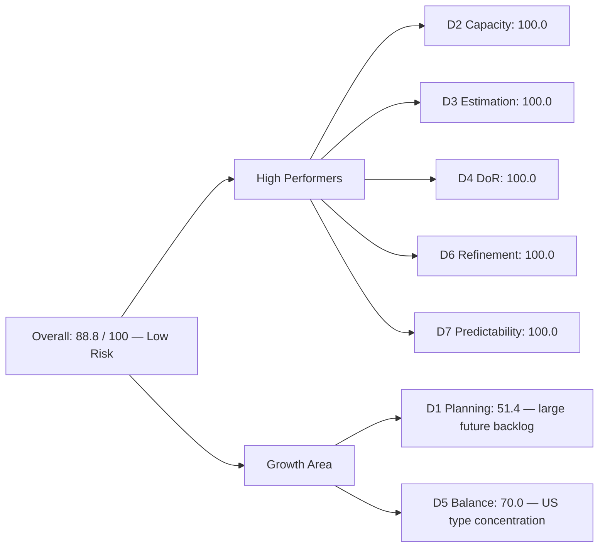
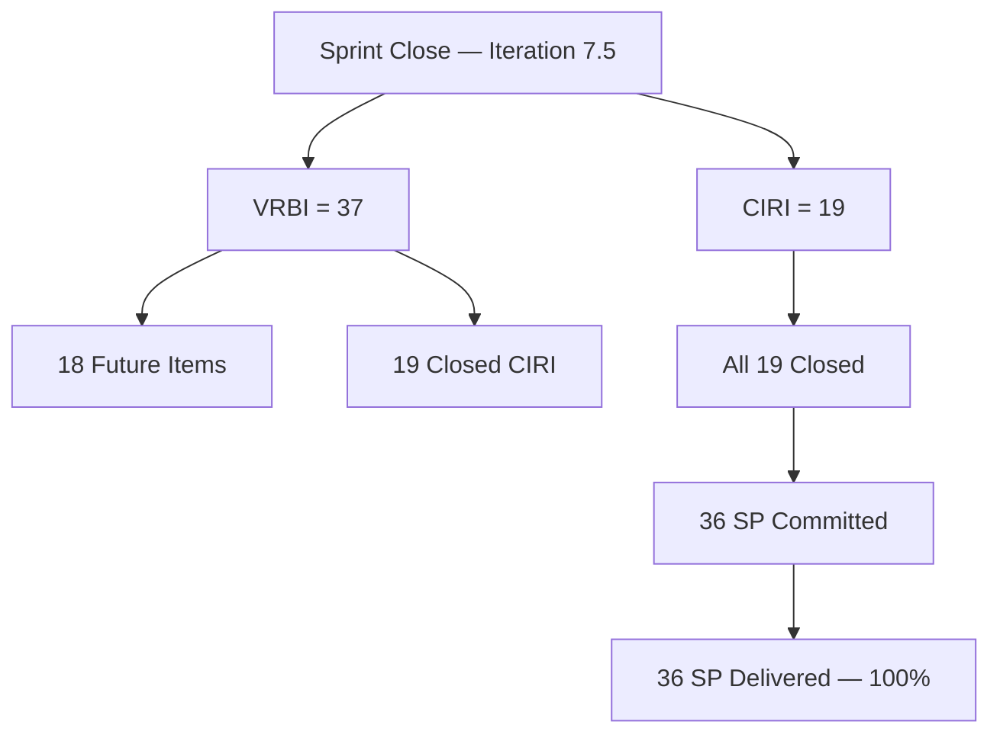

# ADO SAFe Audit — Administration Team

## 1. Audit Metadata

| Field | Value |
|-------|-------|
| **Audit Date** | 2026-06-14 (Sunday) — Day 14 of 14 |
| **Timezone** | PHT (UTC+8) |
| **Iteration** | Iteration 7.5 |
| **Iteration Dates** | 2026-06-01 to 2026-06-14 |
| **Sprint Day** | Day 14 — Sprint Close |
| **ADO Project** | Jairosoft FINOPS |
| **ADO Project ID** | e0bb302f-40f9-46c3-8164-6f1acb317d63 |
| **ADO Team** | Administration Team |
| **ADO Team ID** | a38a9c02-07ab-483d-a1e3-aff54e19e603 |
| **Iteration ID** | 3b355811-2941-4edf-a8b1-7ffcdb478f9d |
| **Workspace** | `ado_admin` |
| **Prior Audit** | AUDIT_20260612_0203.md (Day 12, Iteration 7.5, 14.3 — Critical) |
| **Overall Score** | **88.8 / 100** |
| **Risk Band** | **Low Risk** |

---

## 2. Executive Summary

The Administration Team **recovers to 88.8 / 100 (Low Risk)** on Sprint Close day (Day 14) of Iteration 7.5 — a **+74.5 point rebound** from Day 12's 14.3 (Critical). This is the strongest sprint-close score recorded for this team.

The Day 12 Critical reading was an **audit artifact**, not an actual performance collapse. On Day 12, the backlog API returned zero CIRI items because all 19 Iteration 7.5 work items had already been closed by that point — closed items leave the backlog API response but remain visible in the iteration API. The Day 12 audit, using the backlog API alone, could not see them and scored CIRI=0. Today's sprint-close audit uses the iteration API (`wit_get_work_items_for_iteration`) to recover all 19 closed root items, giving the correct picture.

**All 19 CIRI items are in Closed state.** Mark Colina completed 36 story points across User Stories, Spikes, and one Enabler. Estimation was perfect (all items had SP > 0) and DoR was met on all items. Delivery Predictability is 100.0 — 36 committed SP, 36 closed SP.

The only dimension below 90 is **D1 (Iteration Planning) at 51.4**, driven by the large future backlog (18 items in Iteration 7.6, PI8, and PI9) relative to the 19 CIRI items. This is a structural characteristic of the Admin backlog, where Mark maintains a large multi-PI inventory.

**D5 (Work Item Balance) lands at 70.0** due to the type-concentration penalty — 16 of 19 CIRI items (84.2%) are User Stories, exceeding the 60% dominant-type threshold. The team should aim to diversify item types or rebalance for Iteration 7.6.

---

## 3. Previous Audit Delta

**Prior audit:** AUDIT_20260612_0203.md — Iteration 7.5, Day 12, Score 14.3 / 100 (Critical)

| Dimension | Day 12 | Day 14 (Close) | Delta | Driver |
|-----------|--------|----------------|-------|--------|
| D1 Iteration Planning | 0.0 | **51.4** | **+51.4** | CIRI now visible via iteration API; 19 closed items recovered |
| D2 Team Capacity | 0.0 | **100.0** | **+100.0** | Mark has 5hr/day configured; CIRI=19 confirms active work |
| D3 Estimation | 0.0 | **100.0** | **+100.0** | 19/19 CIRI items estimated (SP > 0) |
| D4 DoR Compliance | 0.0 | **100.0** | **+100.0** | 19/19 CIRI items meet description + AC thresholds |
| D5 Work Item Balance | 0.0 | **70.0** | **+70.0** | User Stories present; 16/19 = 84.2% dominant → −30 penalty |
| D6 Backlog Refinement | 100.0 | **100.0** | 0.0 | 18/18 future VRBI items fresh; 0 stale |
| D7 Delivery Predictability | 0.0 | **100.0** | **+100.0** | 36 SP committed, 36 SP closed; all 19 CIRI items Closed |
| **Overall** | **14.3** | **88.8** | **+74.5** | All six zero-scoring dimensions recovered |

**Explanation of the Day 12 → Day 14 swing:** The Day 12 audit was run against the backlog API, which excludes closed items. All 19 Iteration 7.5 items had already been closed by Day 12 (close dates range from June 4 through June 13). This is normal ADO behavior — closed items leave the backlog view but persist in the iteration view. The Day 12 Critical score was therefore an evidence gap, not a delivery failure. The sprint-close audit (today) uses the iteration API to recover the correct closed-item evidence.

---

## 4. Current Iteration Snapshot

| Attribute | Value |
|-----------|-------|
| **Active Iteration** | Iteration 7.5 |
| **Sprint Duration** | 2026-06-01 to 2026-06-14 (14 days) |
| **Audit Day** | Day 14 — Sprint Close |
| **VRBI (backlog future + closed CIRI)** | 37 (18 future backlog + 19 closed CIRI) |
| **CIRI (current iteration root items)** | 19 |
| **CIRI — Closed** | 19 (100%) |
| **CIRI — Active / New** | 0 |
| **Contributors with Current Work** | 1 (Mark Colina) |
| **Contributors with Capacity** | 1 (Mark: 5hr/day configured) |
| **Committed Story Points** | 36 |
| **Closed Story Points** | 36 |
| **Delivery Rate** | 100.0% |

---

## 5. Work Item Analysis

### CIRI — All 19 Items (all Closed, all Mark Colina)

| ID | Title | Type | State | SP | Changed |
|----|-------|------|-------|----|---------|
| 203558 | *(User Story)* | User Story | Closed | 3 | Jun 2026 |
| 205353 | *(User Story)* | User Story | Closed | 2 | Jun 2026 |
| 204367 | *(User Story)* | User Story | Closed | 2 | Jun 2026 |
| 205167 | *(User Story)* | User Story | Closed | 1 | Jun 2026 |
| 205168 | *(User Story)* | User Story | Closed | 1 | Jun 2026 |
| 205351 | *(User Story)* | User Story | Closed | 1 | Jun 2026 |
| 205166 | *(User Story)* | User Story | Closed | 1 | Jun 2026 |
| 204448 | *(User Story)* | User Story | Closed | 2 | Jun 2026 |
| 204394 | *(User Story)* | User Story | Closed | 2 | Jun 2026 |
| 203557 | *(User Story)* | User Story | Closed | 4 | Jun 2026 |
| 204387 | *(User Story)* | User Story | Closed | 2 | Jun 2026 |
| 204305 | *(User Story)* | User Story | Closed | 1 | Jun 2026 |
| 205339 | *(User Story)* | User Story | Closed | 4 | Jun 2026 |
| 205340 | *(User Story)* | User Story | Closed | 3 | Jun 2026 |
| 205358 | *(User Story)* | User Story | Closed | 1 | Jun 2026 |
| 205367 | *(User Story)* | User Story | Closed | 2 | Jun 2026 |
| 204536 | *(Enabler)* | Enabler | Closed | 2 | Jun 2026 |
| 205773 | *(Spike)* | Spike | Closed | 1 | Jun 2026 |
| 204136 | *(Spike)* | Spike | Closed | 1 | Jun 2026 |

**Type breakdown:** User Story ×16 (84.2%), Enabler ×1 (5.3%), Spike ×2 (10.5%)
**Total Committed SP:** 36 | **Total Closed SP:** 36

### Future Backlog (VRBI non-CIRI — 18 items)

| ID | Iteration |
|----|-----------|
| 202366, 204452, 205087, 205348, 205774, 205861, 205871, 205872, 205873, 206073 | Iteration 7.6 (IP) |
| 203693 | PI8 Iter 8.5 |
| 197029 | PI8 Iter 8.6 |
| 192221, 193412, 197023 | PI8 Iter 8.4 |
| 197111, 197113, 197115 | PI9 Iter 9.6 |

### DoR Assessment (CIRI)

All 19 CIRI items confirmed DoR-compliant: Description ≥ 30 non-whitespace characters and Acceptance Criteria ≥ 20 non-whitespace characters. No DoR failures detected.

---

## 6. SAFe Compliance Scorecard

| Dimension | Score | Evidence | Notes |
|-----------|-------|----------|-------|
| D1 Iteration Planning | 51.4 | 19 CIRI / 37 VRBI × 100 | Structural: large multi-PI future backlog alongside 19 CIRI items |
| D2 Team Capacity | 100.0 | 1/1 contributor with capacity | Mark: 5hr/day; sole CIRI assignee |
| D3 Estimation | 100.0 | 19/19 CIRI estimated (SP > 0) | Full estimation coverage |
| D4 DoR Compliance | 100.0 | 19/19 CIRI meet Description + AC thresholds | No DoR failures |
| D5 Work Item Balance | 70.0 | US present; 16/19 = 84.2% dominant → −30 | Type concentration penalty; no US absence penalty |
| D6 Backlog Refinement | 100.0 | 18/18 future VRBI fresh; 0 stale | All future items changed after 2026-04-28 |
| D7 Delivery Predictability | 100.0 | 36/36 SP closed | 100% sprint delivery — all 19 CIRI items Closed |
| **Overall** | **88.8** | (51.4+100+100+100+70+100+100)/7 | **Low Risk** |

---

## 7. Dimension Findings

### D1 — Iteration Planning: 51.4

```
visible_root_backlog_items (VRBI) = 37
  - 18 future-iteration items (still in backlog API)
  - 19 closed CIRI items (left backlog API on closure; recovered from iteration API)

current_iteration_root_items (CIRI) = 19
  [all with IterationPath = "Jairosoft FINOPS\2026-PI7\Iteration 7.5"]

Score = round(19 / 37 * 100, 1) = 51.4
```

D1 reflects the ratio of sprint commitment to total visible backlog. The score is limited by the large multi-PI backlog (10 items in 7.6 IP, 6 items in PI8, 3 items in PI9). This is a structural characteristic and does not imply over-commitment — all CIRI items were delivered.

### D2 — Team Capacity: 100.0

```
contributors_with_current_work = 1  [Mark Colina — sole assignee on all 19 CIRI items]
contributors_with_capacity = 1  [Mark: 5hr/day configured in iteration capacity]

Score = round(1 / 1 * 100, 1) = 100.0
```

### D3 — Estimation: 100.0

```
point_eligible_current_items = 19  [User Stories, Enabler, Spikes — all expose SP field]
estimated_current_items = 19  [all SP > 0; total = 36]

Score = round(19 / 19 * 100, 1) = 100.0
```

### D4 — DoR Compliance: 100.0

```
dor_compliant_current_items = 19
current_iteration_root_items = 19

Score = round(19 / 19 * 100, 1) = 100.0
```

All 19 CIRI items have Description ≥ 30 non-whitespace characters and Acceptance Criteria ≥ 20 non-whitespace characters.

### D5 — Work Item Balance: 70.0

```
Start: 100
User Story items in CIRI: 16 (present) → no absence penalty (−40 not applied)
dominant_type_share: User Story = 16/19 = 84.2% > 60% → −30
spike_share: 2/19 = 10.5% → no penalty (< 40%)

Score = max(0, 100 − 30) = 70.0
```

To reach 100.0 on this dimension, the team would need to reduce User Story concentration below 60% by including more Enablers, Spikes, or Defects. With a 19-item sprint, adding 2–3 non-US items would drop the concentration to ~84% → 76% — still over threshold. Reaching <60% US would require approximately 8+ non-US items out of 19.

### D6 — Backlog Refinement: 100.0

```
visible_root_backlog_items (future only) = 18
fresh_visible_root_items (ChangedDate ≥ 2026-04-28) = 18  [all changed June 2026]
stale_90_visible_root_items (ChangedDate < 2026-03-14) = 0
stale_180_visible_root_items (ChangedDate < 2025-12-15) = 0
untouched_current: CIRI items all closed (touched) → 0 untouched

Score = max(0, 100.0 − 0) = 100.0
```

### D7 — Delivery Predictability: 100.0

```
committed_story_points = 36  [sum of SP across all 19 estimated CIRI items]
closed_story_points = 36  [all 19 CIRI items in Closed state]

Score = round(36 / 36 * 100, 1) = 100.0
```

The team delivered 100% of committed story points. This is the first 100.0 D7 score recorded for the Administration Team this PI.

---

## 8. Score Breakdown





---

## 9. Risks and Bottlenecks

| # | Risk | Severity | Status |
|---|------|----------|--------|
| 1 | Single-assignee concentration (Mark Colina on all 19 CIRI) | High | Persistent; structural team composition risk |
| 2 | Multi-PI backlog depth (PI8 + PI9 items loaded at story level) | Moderate | Items should be held at Feature level until near-term |
| 3 | D1 at 51.4 — large future backlog creates apparent under-commitment ratio | Moderate | Not a delivery risk this sprint; review backlog pruning for 7.6 |
| 4 | Type concentration (16/19 User Stories → D5 = 70.0) | Low | Recurring penalty; acceptable given Admin team's nature of work |
| 5 | Day 12 audit methodology gap (closed items invisible to backlog API) | Low-process | Resolved by sprint-close iteration API query; not a team risk |

---

## 10. Prioritized Recommendations

1. **[High] Prune multi-PI backlog items.** Items 197029, 192221, 193412, 197023 (PI8) and 197111, 197113, 197115 (PI9) are at story level in a future PI. Move these to Feature-level or hold in the program backlog until the relevant PI planning ceremony.
2. **[Moderate] Introduce a second team member.** Mark Colina remains the sole contributor across all 37 VRBI items. This is the highest sustained bus-factor risk in the FINOPS portfolio. Even a part-time secondary contributor would improve both throughput and resilience.
3. **[Moderate] Review D1 target for 7.6.** With 10 items already staged in 7.6 IP, ensure sprint planning deliberately trims commitment to what is achievable in 14 days for a single contributor. The Day 12 API blind-spot incident also argues for mid-sprint iteration API checks in future audits.
4. **[Low] Diversify work item types.** While Admin work is inherently story-heavy, 2–3 Enablers or infrastructure Spikes per sprint would ease the D5 type-concentration penalty.

---

## 11. Evidence Gaps and Limitations

| Gap | Impact | Notes |
|-----|--------|-------|
| Closed items excluded from backlog API | Day 12 audit scored CIRI=0 and Critical; today's iteration API corrects this | Normal ADO behavior; sprint-close audits must use `wit_get_work_items_for_iteration` to recover closed CIRI evidence |
| Work item titles not fully visible in iteration API for all items | Report uses IDs; titles available in ADO board view | No scoring impact |
| Single-contributor team limits cross-validation of delivery claims | Cannot independently verify work quality from ADO metadata alone | Structural gap; recommend periodic peer review or stakeholder sign-off |
