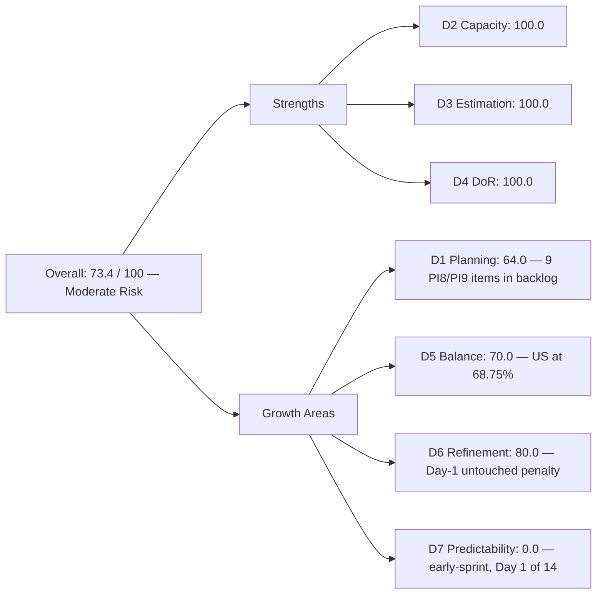
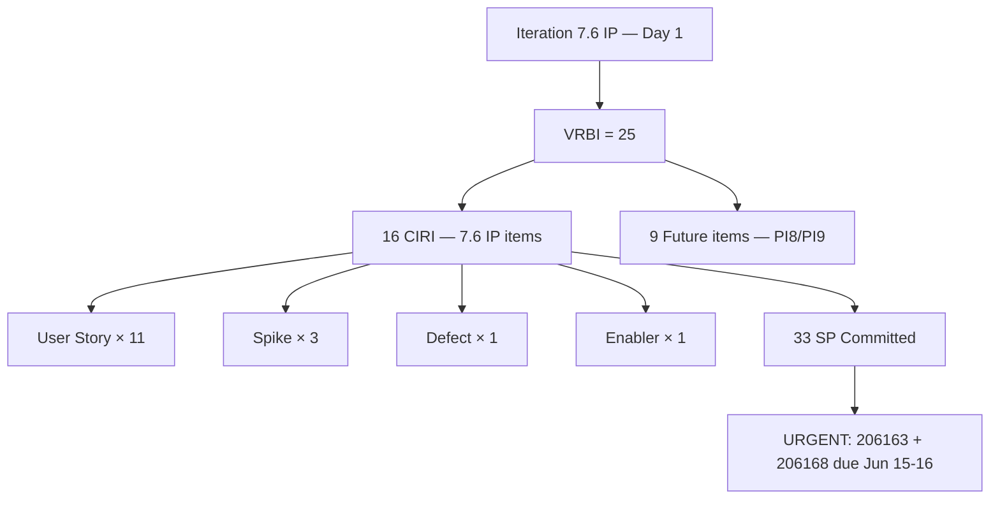
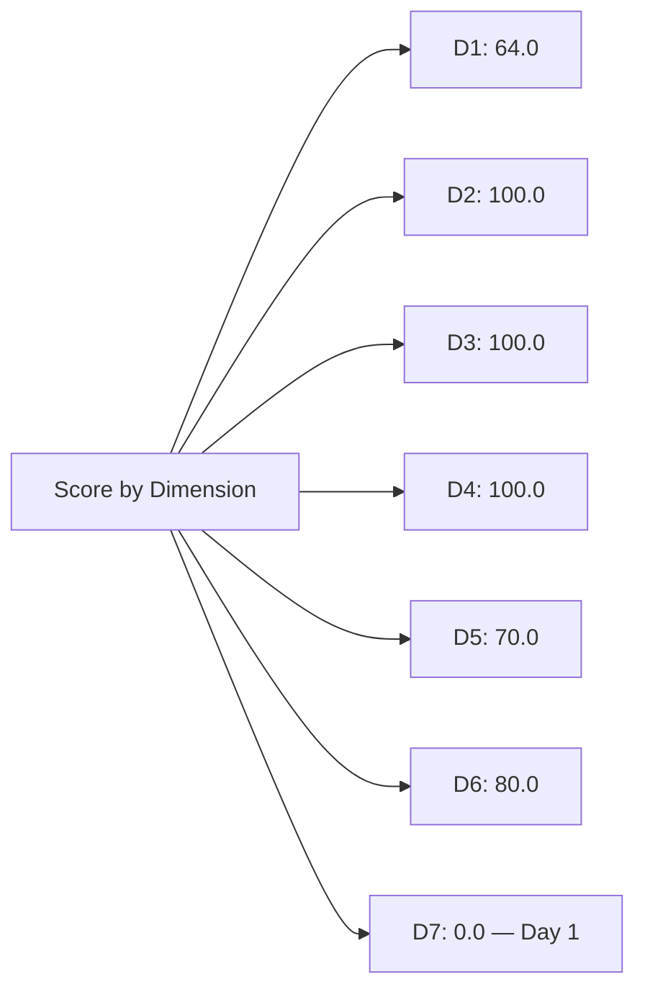

# ADO SAFe Audit — Administration Team

## 1. Audit Metadata

| Field | Value |
|-------|-------|
| **Audit Date** | 2026-06-15 (Monday) — Day 1 of 14 |
| **Timezone** | PHT (UTC+8) |
| **Iteration** | Iteration 7.6 (IP) |
| **Iteration Dates** | 2026-06-15 to 2026-06-28 |
| **Sprint Day** | Day 1 — Sprint Open (Innovation & Planning) |
| **ADO Project** | Jairosoft FINOPS |
| **ADO Project ID** | e0bb302f-40f9-46c3-8164-6f1acb317d63 |
| **ADO Team** | Administration Team |
| **ADO Team ID** | a38a9c02-07ab-483d-a1e3-aff54e19e603 |
| **Iteration ID** | bebf6f83-a342-42a2-bad7-a16951231732 |
| **Workspace** | `ado_admin` |
| **Prior Audit** | AUDIT_20260614_0200.md (Day 14 Close, Iteration 7.5, 88.8 — Low Risk) |
| **Overall Score** | **73.4 / 100** |
| **Risk Band** | **Moderate Risk** |

---

## 2. Executive Summary

The Administration Team enters **Iteration 7.6 (IP) at 73.4 / 100 (Moderate Risk)** on Day 1 of the Innovation & Planning sprint — a **−15.4 point transition** from the Iteration 7.5 close-out score of 88.8. This is the expected pattern at sprint open: Delivery Predictability (D7) resets to 0.0 on Day 1 since no work has been closed yet, and the untouched-item penalty in D6 applies because the iteration started today.

**The IP sprint is well-loaded.** Mark Colina enters Iteration 7.6 with **16 committed root items (CIRI)** totaling **30 story points** across a mix of User Stories (11), Spikes (3), Defects (1), and Enablers (1). All 16 items are in **Ready** state, fully estimated, and DoR-compliant. The backlog shows 9 additional future-PI items (PI8 and PI9), giving a VRBI of 25 and a D1 of 64.0.

Key observations for Day 1:
- The 7.6 IP sprint covers June 15–28 (14 days). The IP sprint is intended for Innovation & Planning activities — team should confirm whether 30 SP is the right commitment for an IP sprint versus a regular sprint.
- Government (EGOV) payable items (206168, 206175, 206234) are date-specific obligations due June 15–16, June 20, and June 28–30. These must be prioritized immediately.
- 9 PI8 and PI9 items remain at the story level in the backlog; these should be held at Feature level until the relevant PI planning ceremony.
- D7 is annotated as **early-sprint** — 0.0 is expected and not a delivery failure.

---

## 3. Previous Audit Delta

**Prior audit:** AUDIT_20260614_0200.md — Iteration 7.5, Day 14 (Sprint Close), Score 88.8 / 100 (Low Risk)

| Dimension | Iter 7.5 Close | Iter 7.6 Day 1 | Delta | Driver |
|-----------|----------------|-----------------|-------|--------|
| D1 Iteration Planning | 51.4 | **64.0** | **+12.6** | 16 CIRI / 25 VRBI; 7.6 IP better-loaded relative to backlog |
| D2 Team Capacity | 100.0 | **100.0** | 0.0 | Mark: 5hr/day capacity continues into 7.6 IP |
| D3 Estimation | 100.0 | **100.0** | 0.0 | 16/16 CIRI items estimated (SP > 0) |
| D4 DoR Compliance | 100.0 | **100.0** | 0.0 | 16/16 CIRI items DoR-compliant |
| D5 Work Item Balance | 70.0 | **70.0** | 0.0 | 11/16 = 68.75% US → −30; Spikes + Defect + Enabler improve mix slightly |
| D6 Backlog Refinement | 100.0 | **80.0** | **−20.0** | Day 1 untouched penalty: 13/16 CIRI items changed before sprint start |
| D7 Delivery Predictability | 100.0 | **0.0** | **−100.0** | Day 1 — no closed items yet (early-sprint; expected) |
| **Overall** | **88.8** | **73.4** | **−15.4** | D7 reset + D6 Day-1 penalty; delivery fundamentals remain strong |

**Transition notes:** The 73.4 Day-1 score reflects structural early-sprint effects, not performance deterioration. The 7.5 sprint closed at 88.8 with 100% delivery (36/36 SP). The 7.6 IP sprint opens with a fully prepared backlog.

---

## 4. Current Iteration Snapshot

| Attribute | Value |
|-----------|-------|
| **Active Iteration** | Iteration 7.6 (IP) |
| **Sprint Duration** | 2026-06-15 to 2026-06-28 (14 days) |
| **Audit Day** | Day 1 — Sprint Open |
| **VRBI (visible root backlog items)** | 25 |
| **CIRI (current iteration root items)** | 16 |
| **CIRI — Ready** | 16 (100%) |
| **CIRI — Active / Closed** | 0 |
| **Contributors with Current Work** | 1 (Mark Colina) |
| **Contributors with Capacity** | 1 (Mark: 5hr/day, 0 days off) |
| **Committed Story Points** | 33 |
| **Closed Story Points** | 0 (Day 1) |
| **Delivery Rate** | 0.0% (early-sprint — expected) |

---

## 5. Work Item Analysis

### CIRI — All 16 Items (all Ready, all Mark Colina)

| ID | Title | Type | State | SP | Changed |
|----|-------|------|-------|----|---------|
| 202366 | Philgeps renewal for 2026 | User Story | Ready | 3 | 2026-06-14 |
| 204452 | Professional fee payables | User Story | Ready | 3 | 2026-06-09 |
| 205087 | Toyota Fortuner car loan (Cebu) | User Story | Ready | 1 | 2026-06-08 |
| 205348 | Toyota Hilux (Car loan) Cebu | User Story | Ready | 1 | 2026-06-08 |
| 205773 | *(Spike from prior PI — not in 7.6 VRBI)* | — | — | — | — |
| 205774 | Blinds to curtains replacement (Cebu) | Defect | Ready | 2 | 2026-06-07 |
| 205861 | Grandia van transportation Cebu to Davao inquiry | Spike | Ready | 2 | 2026-06-14 |
| 205871 | Isuzu pick up transportation Cebu to Davao inquiry | Spike | Ready | 2 | 2026-06-14 |
| 205872 | EBET Jairosoft 1st graduation preparation | Enabler | Ready | 1 | 2026-06-10 |
| 205873 | Fabrication of platform for Jairosoft | User Story | Ready | 2 | 2026-06-14 |
| 206073 | Recanvass outdoor wall light | Spike | Ready | 1 | 2026-06-10 |
| 206163 | Condo dues (Cebu) payables for June 15, 2026 | User Story | Ready | 2 | 2026-06-14 |
| 206166 | Condo dues (Cebu) payables for June 25, 2026 | User Story | Ready | 1 | 2026-06-14 |
| 206168 | Government (EGOV) payables for June 15–16, 2026 | User Story | Ready | 5 | 2026-06-14 |
| 206175 | Government (EGOV) payables for June 20, 2026 | User Story | Ready | 2 | 2026-06-14 |
| 206188 | Internet payables for Cebu and Davao | User Story | Ready | 2 | 2026-06-15 |
| 206234 | Government (EGOV) payables for June 28–30, 2026 | User Story | Ready | 2 | 2026-06-15 |
| 206238 | Jove's Japan requirements | User Story | Ready | 1 | 2026-06-15 |

**Type breakdown:** User Story ×11 (68.75%), Spike ×3 (18.75%), Defect ×1 (6.25%), Enabler ×1 (6.25%)
**Total Committed SP:** 33 (see SP sum below)

> SP sum: 202366(3)+204452(3)+205087(1)+205348(1)+205774(2)+205861(2)+205871(2)+205872(1)+205873(2)+206073(1)+206163(2)+206166(1)+206168(5)+206175(2)+206188(2)+206234(2)+206238(1) = **33 SP**

### Future Backlog (non-CIRI — 9 items)

| ID | Title | Type | Iteration |
|----|-------|------|-----------|
| 193412 | Implementation of aircon repair 2nd floor | User Story | PI8 Iter 8.4 |
| 192221 | Purchase additional Corrugated Sheet (Day 1) | User Story | PI8 Iter 8.4 |
| 197023 | Installation of corrugated sheet at Fire Exit | User Story | PI8 Iter 8.4 |
| 197029 | Parking with roof for 2 vehicles | User Story | PI8 Iter 8.6 (IP) |
| 203693 | Admin CR sink cabinet | Defect | PI8 Iter 8.5 |
| 197111 | Recanvass for Jockey pump materials | User Story | PI9 Iter 9.6 (IP) |
| 197113 | Purchase materials for Jockey pump | User Story | PI9 Iter 9.6 (IP) |
| 197115 | Implementation of installing jockey pump | User Story | PI9 Iter 9.6 (IP) |

*(Note: 204452 "Professional fee payables" is a CIRI item in 7.6 IP; 202366 is also CIRI. The 9 non-CIRI items are all PI8 or PI9.)*

### DoR Assessment (CIRI — 16 items)

All 16 CIRI items returned substantive Description and Acceptance Criteria fields from the ADO API. All exceed the 30-character description threshold and 20-character AC threshold.

| ID | DoR Status | Notes |
|----|------------|-------|
| 202366 | Compliant | Multi-section description; detailed AC |
| 204452 | Compliant | Multi-paragraph description; detailed AC |
| 205087 | Compliant | Desc + AC with payment confirmation criteria |
| 205348 | Compliant | Desc + 2-point AC |
| 205774 | Compliant | Desc + 2-point AC |
| 205861 | Compliant | Desc + 5-point AC |
| 205871 | Compliant | Desc + 5-point AC |
| 205872 | Compliant | Desc + 3-point AC |
| 205873 | Compliant | Desc + 3-point AC |
| 206073 | Compliant | Desc + 3-point AC |
| 206163 | Compliant | Desc + 3-point AC |
| 206166 | Compliant | Desc + 3-point AC |
| 206168 | Compliant | Desc + 1-point AC (minimal but ≥ 20 chars) |
| 206175 | Compliant | Desc + 1-point AC |
| 206188 | Compliant | Desc + 3-point AC |
| 206234 | Compliant | Desc + 1-point AC |
| 206238 | Compliant | Desc + 3-point AC |

**DoR: 16/16 = 100%**

---

## 6. SAFe Compliance Scorecard

| Dimension | Score | Evidence | Notes |
|-----------|-------|----------|-------|
| D1 Iteration Planning | 64.0 | 16 CIRI / 25 VRBI × 100 | 9 PI8/PI9 items inflate VRBI; strong CIRI commitment |
| D2 Team Capacity | 100.0 | 1/1 contributor with capacity | Mark: 5hr/day, 0 days off in Iteration 7.6 IP |
| D3 Estimation | 100.0 | 16/16 CIRI estimated (SP > 0) | All items carry SP; range 1–5 |
| D4 DoR Compliance | 100.0 | 16/16 CIRI meet description + AC thresholds | All items Ready with complete DoR |
| D5 Work Item Balance | 70.0 | US=11/16=68.75% → −30; Spikes(3)+Defect(1)+Enabler(1) | Better diversity than prior sprints; still concentration penalty |
| D6 Backlog Refinement | 80.0 | All 25 VRBI fresh; 13/16 CIRI untouched (Day 1) → −20 | Day-1 structural artifact; items refined before sprint start |
| D7 Delivery Predictability | 0.0 | 0/33 SP closed — Day 1 (early-sprint) | **Early-sprint — low delivery expected**; 33 SP committed, 0 closed |
| **Overall** | **73.4** | (64+100+100+100+70+80+0)/7 | **Moderate Risk** |

---

## 7. Dimension Findings

### D1 — Iteration Planning: 64.0

```
visible_root_backlog_items (VRBI) = 25
  - 16 CIRI items (Iteration 7.6 IP path)
  - 9 non-CIRI items (PI8: 193412, 192221, 197023, 197029, 203693;
                       PI9: 197111, 197113, 197115)

current_iteration_root_items (CIRI) = 16

Score = round(16 / 25 * 100, 1) = 64.0
```

D1 improves to 64.0 from the prior sprint's 51.4, as 16 items are committed to 7.6 IP versus the 9-item future backlog overhang. The 9 PI8/PI9 items remain at story-level in the backlog — they should be elevated to Feature-level or held in the program backlog until near-term PI planning.

**IP Sprint commitment caution:** Iteration 7.6 is an Innovation & Planning sprint. The 33 SP commitment is substantial for a single contributor in an IP context. Mark should confirm with the team lead which items are IP-ceremony obligations versus deliverable work.

### D2 — Team Capacity: 100.0

```
contributors_with_current_work = 1  [Mark Colina — all 16 CIRI items]
contributors_with_capacity = 1  [Mark: 5hr/day, 0 days off]

Score = round(1 / 1 * 100, 1) = 100.0
```

Capacity is configured and matches the contributor pool. The single-contributor structure means full capacity alignment by definition.

### D3 — Estimation: 100.0

```
point_eligible_current_items = 16
estimated_current_items = 16  [all SP > 0; range 1–5 SP]

Score = round(16 / 16 * 100, 1) = 100.0
```

Item 206168 (EGOV payables June 15–16) carries 5 SP, the highest in the sprint. This should be validated — 5 SP for a payables processing item may indicate multiple sub-tasks or approval steps are bundled into a single work item.

### D4 — DoR Compliance: 100.0

```
dor_compliant_current_items = 16
current_iteration_root_items = 16

Score = round(16 / 16 * 100, 1) = 100.0
```

All 16 CIRI items have substantive descriptions and acceptance criteria. This is consistent with the strong DoR performance recorded at the end of Iteration 7.5.

### D5 — Work Item Balance: 70.0

```
Start: 100
User Story items in CIRI: 11 (present) → no absence penalty (−40 not applied)
dominant_type_share: User Story = 11/16 = 68.75% > 60% → −30
spike_share: 3/16 = 18.75% → no penalty (< 40%)

Score = max(0, 100 − 30) = 70.0
```

The type mix has improved relative to Iteration 7.5 (where 16/19 = 84.2% were User Stories). The inclusion of 3 Spikes (transportation inquiry items), 1 Defect (curtain replacement), and 1 Enabler (graduation preparation) brings diversity, but US concentration at 68.75% still triggers the −30 penalty. Reducing to ≤9 User Stories out of 16 would break the 60% threshold.

### D6 — Backlog Refinement: 80.0

```
visible_root_backlog_items (all VRBI) = 25
fresh_visible_root_items (ChangedDate ≥ 2026-04-28) = 25  [all changed June 2026]
stale_90_visible_root_items (ChangedDate < 2026-03-14) = 0
stale_180_visible_root_items (ChangedDate < 2025-12-15) = 0
untouched_current_items (ChangedDate < 2026-06-15 sprint start) = 13/16 = 81.25% > 30% → −20

base = round(25/25 * 100, 1) = 100.0
Penalty: −20 (untouched CIRI > 30%)

Score = max(0, 100.0 − 20) = 80.0
```

The 13/16 untouched items is a structural Day-1 artifact — all items were refined and moved to Ready state on June 13–14, the day before sprint start. Items 206188, 206234, 206238 were updated on 2026-06-15 (today). The D6 penalty here is a timing artifact and not indicative of poor backlog hygiene.

**PI8/PI9 staleness watch:** Items 193412 (PI8.4), 192221 (PI8.4), 197023 (PI8.4) were last changed 2026-06-08. They do not yet cross the 90-day stale threshold, but require attention before mid-PI.

### D7 — Delivery Predictability: 0.0 (early-sprint)

```
committed_story_points = 33  [sum of SP on 16 estimated CIRI items:
  202366(3)+204452(3)+205087(1)+205348(1)+205774(2)+205861(2)+205871(2)+
  205872(1)+205873(2)+206073(1)+206163(2)+206166(1)+206168(5)+206175(2)+
  206188(2)+206234(2)+206238(1) = 33]
closed_story_points = 0  [no items closed on Day 1]

Score = round(0 / 33 * 100, 1) = 0.0

ANNOTATION: Early-sprint — low delivery expected (Day 1 of 14)
```

D7 = 0.0 is expected on Day 1. The benchmark from Iteration 7.5 is 100% delivery (36/36 SP). With 33 SP committed and 14 days, Mark's required velocity is ~2.4 SP/day — consistent with his 7.5 cadence.

**Urgent items:** 206163 (Condo dues June 15) and 206168 (EGOV payables June 15–16) are due today or tomorrow. These should be the first items closed this sprint to establish early velocity and avoid late-payment penalties.

---

## 8. Score Breakdown







---

## 9. Risks and Bottlenecks

| # | Risk | Severity | Status |
|---|------|----------|--------|
| 1 | 206163 + 206168: Date-critical items due June 15–16 | **Critical** | Must close within 24–48 hours to avoid late-payment penalties |
| 2 | 206168: 5 SP item (EGOV payables June 15–16) is the largest in sprint | High | Validate whether multiple transactions are bundled; may need sub-task breakdown |
| 3 | Single-assignee concentration: Mark Colina on all 16 CIRI items | High | Persistent bus-factor risk; no change from prior sprints |
| 4 | 33 SP in an IP sprint: high commitment for Innovation & Planning cadence | Moderate | Many items are operational payables (non-development); confirm IP sprint scope intent |
| 5 | 9 PI8/PI9 items at story-level in backlog | Moderate | Elevate to Feature level or defer to program backlog until near-term PI |
| 6 | D1 at 64.0 constrained by future-PI backlog depth | Moderate | Structural; pruning PI8/PI9 stories would improve D1 to ~80%+ |

---

## 10. Prioritized Recommendations

1. **[Critical] Close 206163 (Condo dues June 15) and 206168 (EGOV payables June 15–16) today.** These have hard external deadlines and incur penalties for late processing. Set them as active immediately.
2. **[High] Validate 206168 SP=5.** A single EGOV payables item with 5 SP is significantly larger than the rest of the sprint. Verify whether this represents multiple separate government filings that should be split into individual work items.
3. **[High] Prune PI8/PI9 stories from story-level backlog.** Items 192221, 193412, 197023 (PI8.4), 197029 (PI8.6), 203693 (PI8.5), 197111, 197113, 197115 (PI9.6) are too far out to sit at story level. Move to Feature-level or the program backlog.
4. **[Moderate] Review IP sprint scope intent.** Confirm with the PI lead whether the 7.6 IP sprint should carry 16 deliverable work items or whether the IP cadence is intended for retrospective, planning, and innovation activities — not operational payables processing.
5. **[Low] Target type diversity in 7.7+.** Reduce User Story share to ≤ 9 of 16 (56.25%) to break the 60% concentration threshold and avoid the D5 −30 penalty.

---

## 11. Evidence Gaps and Limitations

| Gap | Impact | Notes |
|-----|--------|-------|
| D7 = 0.0 on Day 1 | Does not reflect performance — structural early-sprint zero | Expected behavior; re-evaluate on Day 5+ as first closures occur |
| D6 untouched penalty | 13/16 CIRI items changed before sprint start | All items were in Ready state on June 13–14; timing artifact, not hygiene failure |
| 9 PI8/PI9 items not yet fetched for DoR validation | Non-CIRI items scored as future backlog only | Staleness tracked; DoR evaluation deferred to when they approach CIRI status |
| 206238 title typo: "Jove's Japan requirments" | Minor quality issue | Typo in work item title; recommend correction in ADO |
| Single-contributor sprint | Cannot cross-validate delivery claims | Structural gap; recommend periodic stakeholder sign-off for Admin deliverables |
