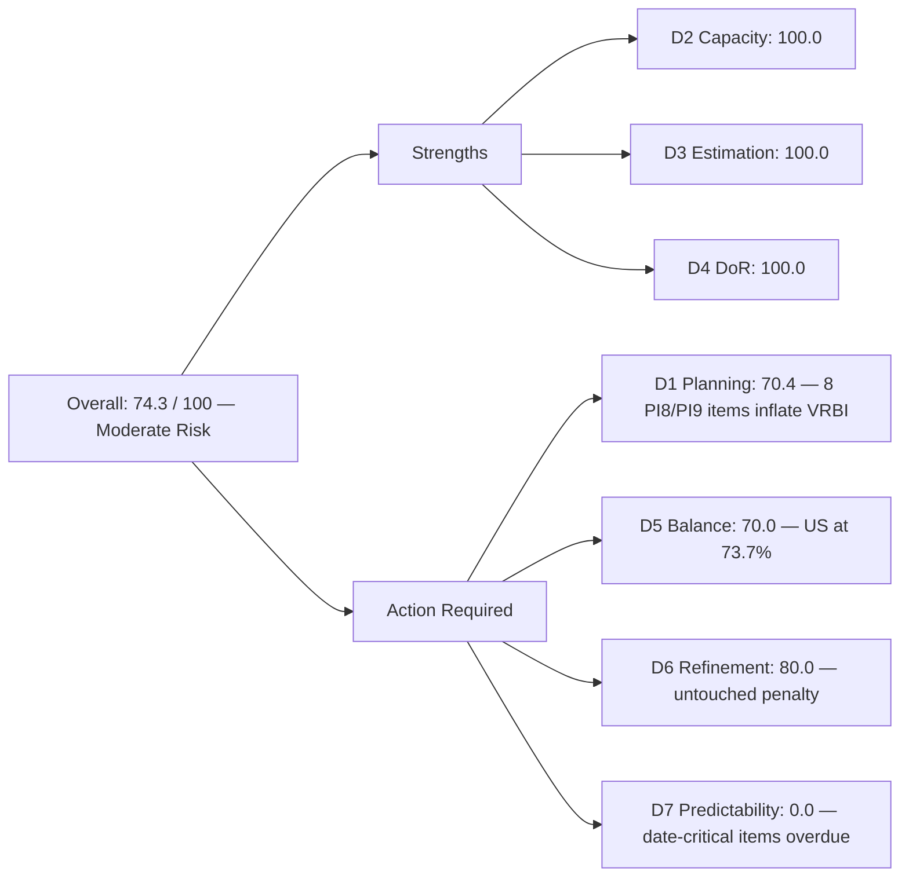
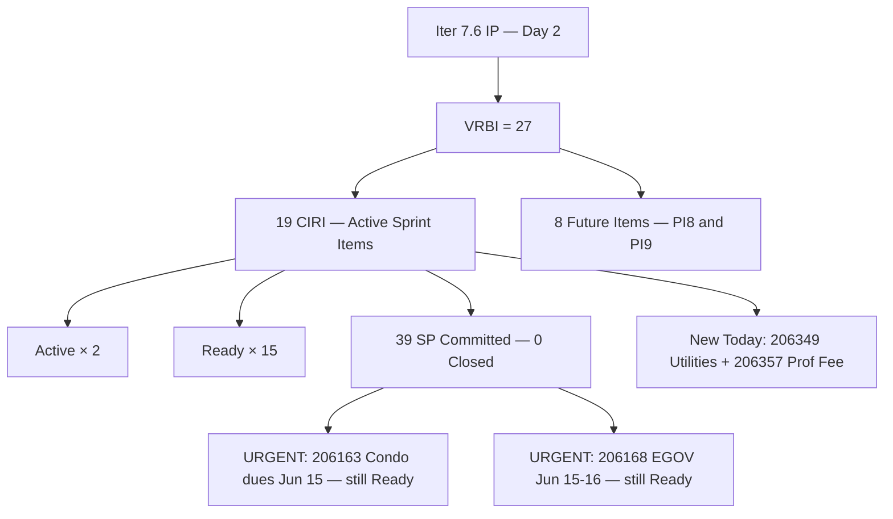
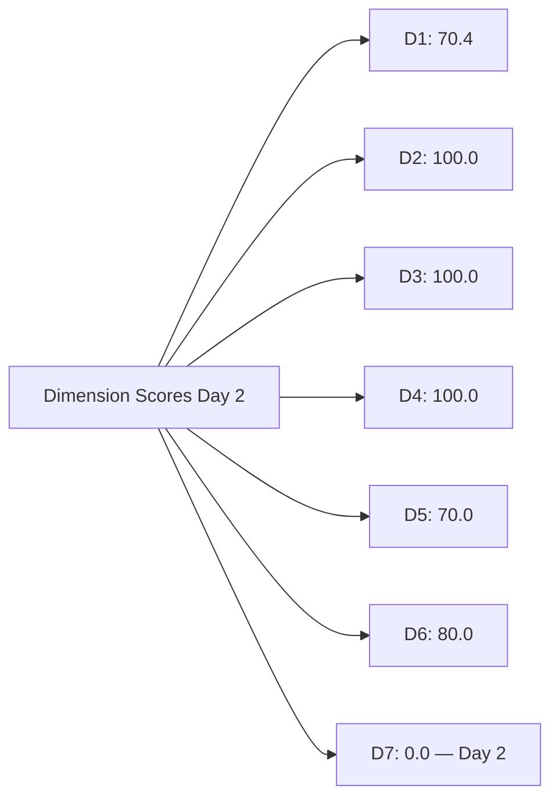

# ADO SAFe Audit — Administration Team

## 1. Audit Metadata

| Field | Value |
|-------|-------|
| **Audit Date** | 2026-06-16 (Tuesday) — Day 2 of 14 |
| **Timezone** | PHT (UTC+8) |
| **Iteration** | Iteration 7.6 (IP) |
| **Iteration Dates** | 2026-06-15 to 2026-06-28 |
| **Sprint Day** | Day 2 — Sprint Active |
| **ADO Project** | Jairosoft FINOPS |
| **ADO Project ID** | e0bb302f-40f9-46c3-8164-6f1acb317d63 |
| **ADO Team** | Administration Team |
| **ADO Team ID** | a38a9c02-07ab-483d-a1e3-aff54e19e603 |
| **Iteration ID** | bebf6f83-a342-42a2-bad7-a16951231732 |
| **Workspace** | `ado_admin` |
| **Prior Audit** | AUDIT_20260615_0200.md (Day 1 Open, Iteration 7.6 IP, 73.4 — Moderate Risk) |
| **Overall Score** | **74.3 / 100** |
| **Risk Band** | **Moderate Risk** |

---

## 2. Executive Summary

The Administration Team enters **Day 2 of Iteration 7.6 (IP) at 74.3 / 100 (Moderate Risk)** — a marginal **+0.9 point improvement** from yesterday's Day 1 score of 73.4. The improvement is driven by a growing CIRI: two new work items were added to the sprint overnight (206349 — Utilities payables, and 206357 — Professional fee for IC), expanding the committed load from 16 to 19 items and from 33 to **39 story points**.

**Sprint activity is underway.** Mark Colina has transitioned two items to Active state: 205873 (Fabrication of platform for Jairosoft) and 206238 (Jove's Japan requirements), confirming that work is in progress by Day 2. This is a positive sign; velocity should accumulate across the sprint.

**Date-critical items are overdue for execution.** 206163 (Condo dues June 15) and 206168 (EGOV payables June 15–16) both carry hard external deadlines that were due yesterday (Day 1) and must be resolved immediately today. These items remain in Ready state with no evidence of closure — this is the most urgent finding in today's audit.

**D7 remains 0.0 on Day 2** (no items Closed or Done), which is concerning given the date-specific obligations. D6 scores 80.0 due to the Day-1 untouched penalty still applying. D5 carries a structural −30 for US concentration at 73.7%.

---

## 3. Previous Audit Delta

**Prior audit:** AUDIT_20260615_0200.md — Iteration 7.6 IP, Day 1, Score 73.4 / 100 (Moderate Risk)

| Dimension | Day 1 | Day 2 | Delta | Driver |
|-----------|-------|-------|-------|--------|
| D1 Iteration Planning | 64.0 | **70.4** | **+6.4** | 2 new CIRI items added (206349, 206357); VRBI grows 25→27, CIRI grows 16→19 |
| D2 Team Capacity | 100.0 | **100.0** | 0.0 | Mark: 5hr/day unchanged |
| D3 Estimation | 100.0 | **100.0** | 0.0 | New items 206349 (SP=3) and 206357 (SP=2) both estimated |
| D4 DoR Compliance | 100.0 | **100.0** | 0.0 | 206349 and 206357 both have complete description and AC |
| D5 Work Item Balance | 70.0 | **70.0** | 0.0 | US grows from 11→14 of 19; 73.7% concentration still triggers −30 |
| D6 Backlog Refinement | 80.0 | **80.0** | 0.0 | New items freshly created on Jun 15; untouched CIRI penalty persists (13/19) |
| D7 Delivery Predictability | 0.0 | **0.0** | 0.0 | No Closed/Done items by Day 2 — date-critical items must be resolved today |
| **Overall** | **73.4** | **74.3** | **+0.9** | Modest improvement driven by D1 growth; D7 = 0 remains a concern |

**Significant changes since Day 1:**
- **206349** (Utilities payables for Cebu and Davao, June 3, 2026): New User Story, SP=3, Ready, created 2026-06-15
- **206357** (Professional fee payment for IC): New User Story, SP=2, Ready, created 2026-06-15
- **205873** (Fabrication of platform): State changed from Ready → **Active** (Jun 15 22:28)
- **206238** (Jove's Japan requirements): State changed from Ready → **Active** (Jun 15 22:26)

---

## 4. Current Iteration Snapshot

| Attribute | Value |
|-----------|-------|
| **Active Iteration** | Iteration 7.6 (IP) |
| **Sprint Duration** | 2026-06-15 to 2026-06-28 (14 days) |
| **Audit Day** | Day 2 |
| **VRBI (visible root backlog items)** | 27 |
| **CIRI (current iteration root items)** | 19 |
| **CIRI — Ready** | 15 |
| **CIRI — Active** | 2 (205873, 206238) |
| **CIRI — Closed/Done** | 0 |
| **Non-CIRI (future PI items)** | 8 (PI8: ×5, PI9: ×3) |
| **Contributors with Current Work** | 1 (Mark Colina) |
| **Contributors with Capacity** | 1 (Mark: 5hr/day, 0 days off) |
| **Committed Story Points** | 39 |
| **Closed Story Points** | 0 (Day 2) |
| **Delivery Rate** | 0.0% — early-sprint (annotated) |

---

## 5. Work Item Analysis

### CIRI — All 19 Items (all Mark Colina)

| ID | Title | Type | State | SP | Changed |
|----|-------|------|-------|----|---------|
| 202366 | Philgeps renewal for 2026 | User Story | Ready | 3 | 2026-06-14 |
| 204452 | Professional fee payables | User Story | Ready | 3 | 2026-06-09 |
| 205087 | Toyota Fortuner car loan (Cebu) | User Story | Ready | 1 | 2026-06-08 |
| 205348 | Toyota Hilux (Car loan) Cebu | User Story | Ready | 1 | 2026-06-08 |
| 205774 | Blinds to curtains replacement (Cebu) | Defect | Ready | 2 | 2026-06-07 |
| 205861 | Grandia van transportation Cebu to Davao inquiry | Spike | Ready | 2 | 2026-06-14 |
| 205871 | Isuzu pick up transportation Cebu to Davao inquiry | Spike | Ready | 2 | 2026-06-14 |
| 205872 | EBET Jairosoft 1st graduation preparation | Enabler | Ready | 1 | 2026-06-10 |
| 205873 | Fabrication of platform for Jairosoft | User Story | **Active** | 2 | **2026-06-15** |
| 206073 | Recanvass outdoor wall light | Spike | Ready | 1 | 2026-06-10 |
| 206163 | Condo dues (Cebu) payables for June 15, 2026 | User Story | Ready | 2 | 2026-06-14 |
| 206166 | Condo dues (Cebu) payables for June 25, 2026 | User Story | Ready | 1 | 2026-06-14 |
| 206168 | Government (EGOV) payables for June 15–16, 2026 | User Story | Ready | 5 | 2026-06-14 |
| 206175 | Government (EGOV) payables for June 20, 2026 | User Story | Ready | 2 | 2026-06-14 |
| 206188 | Internet payables for Cebu and Davao | User Story | Ready | 2 | 2026-06-15 |
| 206234 | Government (EGOV) payables for June 28–30, 2026 | User Story | Ready | 2 | 2026-06-15 |
| 206238 | Jove's Japan requirements | User Story | **Active** | 1 | **2026-06-15** |
| 206349 | Utilities payables for Cebu and Davao June 3, 2026 | User Story | Ready | 3 | **2026-06-15 (new)** |
| 206357 | Professional fee payment for IC | User Story | Ready | 2 | **2026-06-15 (new)** |

**Type breakdown:** User Story ×14 (73.7%), Spike ×3 (15.8%), Defect ×1 (5.3%), Enabler ×1 (5.3%)
**Total Committed SP:** 39

> SP verification: 3+3+1+1+2+2+2+1+2+1+2+1+5+2+2+2+1+3+2 = **39 SP**

### Future Backlog — Non-CIRI (8 items)

| ID | Title | Type | PI/Iteration | Changed |
|----|-------|------|--------------|---------|
| 192221 | Purchase additional Corrugated Sheet Day 1 | User Story | PI8 Iter 8.4 | 2026-06-08 |
| 193412 | Implementation of aircon repair 2nd floor | User Story | PI8 Iter 8.4 | 2026-06-08 |
| 197023 | Installation of corrugated sheet at Fire Exit | User Story | PI8 Iter 8.4 | 2026-06-08 |
| 197029 | Parking with roof for 2 vehicles | User Story | PI8 Iter 8.6 (IP) | 2026-06-08 |
| 203693 | Admin CR sink cabinet | Defect | PI8 Iter 8.5 | 2026-06-07 |
| 197111 | Recanvass for Jockey pump materials needed | User Story | PI9 Iter 9.6 (IP) | 2026-06-09 |
| 197113 | Purchase materials for Jockey pump | User Story | PI9 Iter 9.6 (IP) | 2026-06-09 |
| 197115 | Implementation of installing jockey pump | User Story | PI9 Iter 9.6 (IP) | 2026-06-09 |

### DoR Assessment (CIRI — 19 items)

All 19 CIRI items were verified for Description ≥ 30 non-whitespace characters and Acceptance Criteria ≥ 20 non-whitespace characters.

| ID | DoR Status | Notes |
|----|------------|-------|
| 202366 | Compliant | Multi-section description; multi-point AC |
| 204452 | Compliant | Detailed professional fee process; 3-point AC |
| 205087 | Compliant | Car loan description + 3-point AC |
| 205348 | Compliant | Car loan description + 2-point AC |
| 205774 | Compliant | Blinds/curtains replacement; 2-point AC |
| 205861 | Compliant | Van inquiry; 5-point AC |
| 205871 | Compliant | Pickup inquiry; 5-point AC |
| 205872 | Compliant | Graduation prep; 3-point AC |
| 205873 | Compliant | Platform fabrication; 3-point AC |
| 206073 | Compliant | Recanvass process; 3-point AC |
| 206163 | Compliant | Condo dues context; 3-point AC |
| 206166 | Compliant | Condo dues context; 3-point AC |
| 206168 | Compliant | EGOV payables; 1-point AC (≥ 20 chars) |
| 206175 | Compliant | EGOV payables; 1-point AC |
| 206188 | Compliant | Internet utility; 3-point AC |
| 206234 | Compliant | EGOV payables; 1-point AC |
| 206238 | Compliant | Japan requirements; 3-point AC |
| 206349 | Compliant | Utility payables; 3-point AC |
| 206357 | Compliant | IC professional fee; multi-point AC |

**DoR: 19/19 = 100%**

---

## 6. SAFe Compliance Scorecard

| Dimension | Score | Evidence | Notes |
|-----------|-------|----------|-------|
| D1 Iteration Planning | 70.4 | 19 CIRI / 27 VRBI × 100 | +6.4 from Day 1; 2 new items added; 8 future-PI items still inflate VRBI |
| D2 Team Capacity | 100.0 | 1/1 contributor with capacity | Mark: 5hr/day, 0 days off for Iteration 7.6 IP |
| D3 Estimation | 100.0 | 19/19 CIRI estimated (SP > 0) | New items 206349 (3) + 206357 (2) both estimated |
| D4 DoR Compliance | 100.0 | 19/19 CIRI meet description + AC thresholds | All items including new additions are DoR-compliant |
| D5 Work Item Balance | 70.0 | US=14/19=73.7% > 60% → −30; Spike×3, Defect×1, Enabler×1 | US concentration grew with 3 new US items; still triggers penalty |
| D6 Backlog Refinement | 80.0 | All 27 VRBI fresh; untouched CIRI = 13/19 = 68.4% > 30% → −20 | Same structural penalty as Day 1; 6 items updated since sprint start |
| D7 Delivery Predictability | 0.0 | 0/39 SP closed — Day 2 (early-sprint) | **Early-sprint — low delivery expected**; date-critical items 206163 + 206168 overdue |
| **Overall** | **74.3** | (70.4+100+100+100+70+80+0)/7 | **Moderate Risk** |

---

## 7. Dimension Findings

### D1 — Iteration Planning: 70.4

```
visible_root_backlog_items (VRBI) = 27
  - 19 CIRI items (Iteration 7.6 IP path)
  - 8 non-CIRI items (PI8: 192221, 193412, 197023, 197029, 203693; PI9: 197111, 197113, 197115)

current_iteration_root_items (CIRI) = 19
  [Added since Day 1: 206349, 206357]

Score = round(19 / 27 * 100, 1) = 70.4
```

D1 improves to 70.4 from yesterday's 64.0. The addition of 206349 (Utilities payables, SP=3) and 206357 (Professional fee for IC, SP=2) during Day 1 reflects mid-sprint backlog growth — a common pattern in operational (non-software) teams where payable obligations are identified on a rolling basis. The 8 future-PI items at story-level remain unchanged and continue to constrain D1. Removing or elevating them would raise D1 above 80.

**Note:** 206349 title references "June 3, 2026" — a date in the past. Verify if this is a backlog payment obligation with a retroactive due date or a data entry issue.

### D2 — Team Capacity: 100.0

```
contributors_with_current_work = 1  [Mark Colina — all 19 CIRI items]
contributors_with_capacity = 1  [Mark: 5hr/day, 0 days off — team ID a38a9c02]

Score = round(1 / 1 * 100, 1) = 100.0
```

Capacity configuration confirmed for the Administration Team in Iteration 7.6 IP. No change from Day 1.

### D3 — Estimation: 100.0

```
point_eligible_current_items = 19
estimated_current_items = 19  [SP range: 1–5; new items: 206349=3, 206357=2]

Score = round(19 / 19 * 100, 1) = 100.0
```

Both new items (206349, 206357) were created with story point estimates immediately. Consistent estimation discipline from Mark.

### D4 — DoR Compliance: 100.0

```
dor_compliant_current_items = 19
current_iteration_root_items = 19

Score = round(19 / 19 * 100, 1) = 100.0
```

All 19 CIRI items including the two new additions meet the description and acceptance criteria thresholds. 206349 has a 3-paragraph description and 3-point AC; 206357 has a clear professional fee process description and a 3-point AC listing required documents.

### D5 — Work Item Balance: 70.0

```
Start: 100
User Story items in CIRI: 14 (present) → no absence penalty (−40 not applied)
dominant_type_share: User Story = 14/19 = 73.7% > 60% → −30
spike_share: 3/19 = 15.8% → no penalty (< 40%)

Score = max(0, 100 − 30) = 70.0
```

The User Story concentration grew from 68.75% (yesterday) to 73.7% (today) as 206349 and 206357 are both User Stories. This widens the gap from the 60% threshold. To resolve D5, at least 2–3 of the 19 items would need to be non-US types (Spike, Defect, or Enabler) to break below 60% — requiring 12 or fewer User Stories. Given the operational nature of the Admin backlog, a targeted classification audit is recommended.

### D6 — Backlog Refinement: 80.0

```
visible_root_backlog_items (VRBI) = 27
fresh_visible_root_items (ChangedDate ≥ 2026-05-02) = 27  [all changed May-June 2026]
stale_90_visible_root_items (ChangedDate < 2026-03-18) = 0
stale_180_visible_root_items (ChangedDate < 2025-12-19) = 0

untouched_current_items (ChangedDate < 2026-06-15):
  Items changed BEFORE June 15: 202366(Jun 14), 204452(Jun 9), 205087(Jun 8), 205348(Jun 8),
  205774(Jun 7), 205861(Jun 14), 205871(Jun 14), 205872(Jun 10), 206073(Jun 10),
  206163(Jun 14), 206166(Jun 14), 206168(Jun 14), 206175(Jun 14) = 13 untouched
  Items changed ON/AFTER June 15: 205873, 206188, 206234, 206238, 206349, 206357 = 6 touched

untouched_count = 13/19 = 68.4% > 30% → −20

base = round(27/27 * 100, 1) = 100.0
Penalty: −20
Score = max(0, 100.0 − 20) = 80.0
```

The D6 untouched penalty persists from Day 1. The 6 items updated on June 15 are positive evidence of sprint activation. As Mark progresses items from Ready → Active → Closed, more items will receive ChangedDate updates, gradually reducing the untouched share. By Day 5, if at least 10 CIRI items have been touched, the penalty would fall below the 30% threshold.

**PI8 staleness watch:** Non-CIRI items 203693 (PI8.5) was last changed Jun 7; PI8.4 items last changed Jun 8. All remain fresh (within 45 days). No stale penalty applies today, but these items approach the 45-day fresh threshold at end of June.

### D7 — Delivery Predictability: 0.0 (early-sprint)

```
committed_story_points = 39  [19 estimated CIRI items; SP range 1–5]
  202366(3)+204452(3)+205087(1)+205348(1)+205774(2)+205861(2)+205871(2)+
  205872(1)+205873(2)+206073(1)+206163(2)+206166(1)+206168(5)+206175(2)+
  206188(2)+206234(2)+206238(1)+206349(3)+206357(2) = 39

closed_story_points = 0  [no items in Closed or Done state]

Score = round(0 / 39 * 100, 1) = 0.0

ANNOTATION: Early-sprint — low delivery expected (Day 2 of 14)
```

No items closed by Day 2. The two Active items (205873, 206238) indicate work began but no closures have occurred. **The most pressing concern is 206163 (Condo dues June 15) and 206168 (EGOV payables June 15–16) — both remain in Ready state with hard deadlines that have already passed.** If these were processed on June 15 and not yet closed in ADO, Mark should close them immediately to reflect actual delivery and establish opening velocity.

Required velocity with 39 SP over 12 remaining days (Day 2 of 14 → 12 days remain): ~3.25 SP/day. This is significantly higher than Mark's historical cadence. The backlog growth from 33 to 39 SP mid-sprint needs capacity validation.

---

## 8. Score Breakdown







---

## 9. Risks and Bottlenecks

| # | Risk | Severity | Status |
|---|------|----------|--------|
| 1 | 206163 (Condo dues June 15) + 206168 (EGOV payables June 15–16): deadline passed, items still Ready | **Critical** | These must be closed in ADO immediately if payments were processed yesterday; if not yet processed, they are in breach |
| 2 | 39 SP in IP sprint for single contributor (Mark): required velocity ~3.25 SP/day | High | Exceeds Mark's historical cadence; backlog growth (206349, 206357) mid-sprint added 5 SP without capacity review |
| 3 | 206349 title references "June 3, 2026" — past date | High | Verify: is this a retroactive payment? If so, it should already be closed. If it's a data error, correct the title |
| 4 | Single-assignee concentration: Mark on all 19 CIRI items | High | Persistent bus-factor risk; unchanged since PI6 |
| 5 | D7 = 0.0 on Day 2 with date-critical items not closed | Moderate | Normal for early-sprint except when date obligations have passed; risk of late-payment penalties on 206163 + 206168 |
| 6 | D5 at 70.0: US concentration grew to 73.7% | Moderate | Adding 3 new User Stories (206349, 206357 + prior US items) widened the concentration gap |
| 7 | 8 future-PI items at story-level in backlog | Moderate | PI8/PI9 stories suppress D1; elevate to Feature-level or defer to program backlog |
| 8 | 206168: 5 SP for single payables processing task | Low | Largest item in sprint — validate if it represents bundled filings requiring decomposition |

---

## 10. Prioritized Recommendations

1. **[Critical] Close 206163 and 206168 in ADO immediately.** Condo dues (June 15) and EGOV payables (June 15–16) deadlines have passed. If payments were processed yesterday, update ADO state to Closed with receipt attachment noted in AC. If not yet processed, execute payment today and close in ADO.
2. **[Critical] Verify 206349 date anomaly.** The item title states "June 3, 2026" — a date 13 days before the current sprint started. Confirm whether this is (a) a retroactive payment due June 3 that should be closed immediately, (b) a June 30 payment with a title typo, or (c) an error requiring correction.
3. **[High] Review sprint commitment with 39 SP.** The sprint opened at 33 SP and two new items added 6 SP (206349, 206357). Mark's historical delivery cadence should be validated against the 39 SP target before mid-sprint. If capacity is insufficient, defer 206349 or 206357 to PI8.
4. **[High] Close Active items (205873, 206238) before Day 5.** Both are in Active state — ensure acceptance criteria are being tracked and these items close by Day 4–5 to establish early velocity.
5. **[Moderate] Prune PI8/PI9 stories.** The 8 non-CIRI items (192221, 193412, 197023, 197029, 203693, 197111, 197113, 197115) at story-level are too far out for the current PI. Move to Feature-level or program backlog to improve D1 above 80.
6. **[Low] Reclassify items for D5.** Work with the Admin PO to review whether any of the 14 User Stories are better classified as Enablers or Tasks, breaking the 73.7% concentration threshold.

---

## 11. Evidence Gaps and Limitations

| Gap | Impact | Notes |
|-----|--------|-------|
| D7 = 0.0 on Day 2 | Partially expected for early-sprint but date-critical items should be closed | 206163 + 206168 deadlines passed on June 15; ADO closures may be lagging actual payment |
| 206349 "June 3" date anomaly | Cannot confirm correct due date without verbal confirmation | Title may be a typo; verify with Mark Colina |
| Single-contributor sprint | Delivery evidence relies solely on ADO state transitions | No peer review mechanism; stakeholder sign-off on Admin payables recommended |
| D6 untouched penalty (13/19) | Day-2 structural artifact | 6 items updated since sprint start; penalty will naturally decrease as sprint progresses |
| PI8/PI9 non-CIRI items not scored for DoR | DoR validation deferred for future-PI items | Items flagged for staleness tracking; DoR evaluation begins at PI planning approach |
