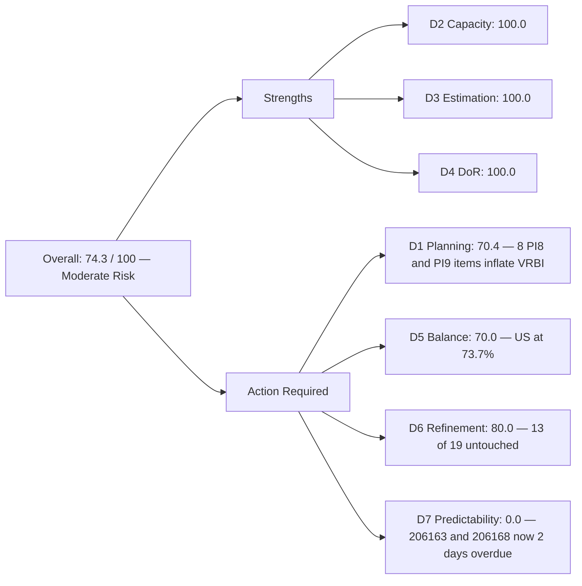
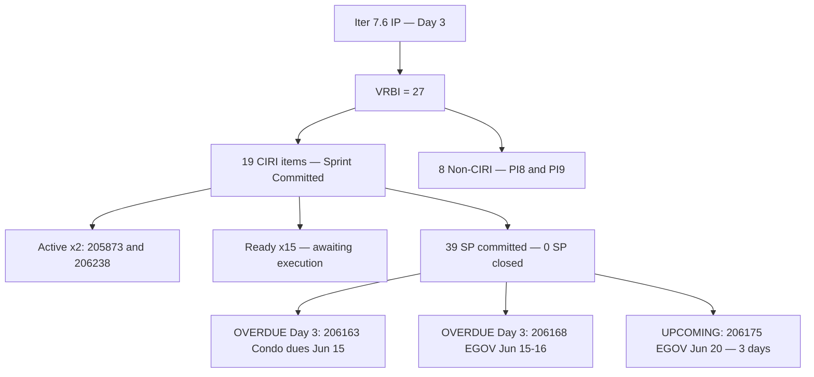
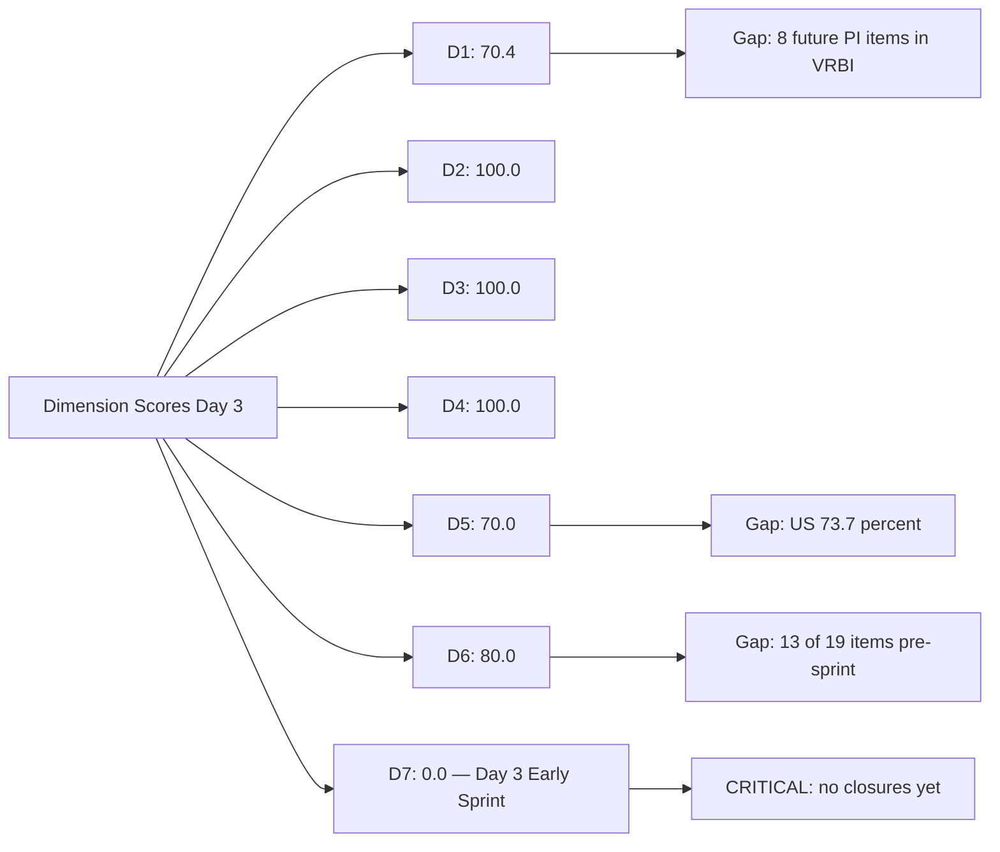

# ADO SAFe Audit — Administration Team

## 1. Audit Metadata

| Field | Value |
|-------|-------|
| **Audit Date** | 2026-06-17 (Wednesday) — Day 3 of 14 |
| **Timezone** | PHT (UTC+8) |
| **Iteration** | Iteration 7.6 (IP) |
| **Iteration Dates** | 2026-06-15 to 2026-06-28 |
| **Sprint Day** | Day 3 — Sprint Active |
| **ADO Project** | Jairosoft FINOPS |
| **ADO Project ID** | e0bb302f-40f9-46c3-8164-6f1acb317d63 |
| **ADO Team** | Administration Team |
| **ADO Team ID** | a38a9c02-07ab-483d-a1e3-aff54e19e603 |
| **Iteration ID** | bebf6f83-a342-42a2-bad7-a16951231732 |
| **Workspace** | `ado_admin` |
| **Prior Audit** | AUDIT_20260616_0205.md (Day 2, Iteration 7.6 IP, 74.3 — Moderate Risk) |
| **Overall Score** | **74.3 / 100** |
| **Risk Band** | **Moderate Risk** |

---

## 2. Executive Summary

The Administration Team holds at **74.3 / 100 (Moderate Risk)** on Day 3 of Iteration 7.6 (IP) — **no change in overall score** from yesterday's Day 2 score of 74.3. The backlog composition is identical: 27 visible root backlog items, 19 committed to the current iteration, all estimated, all DoR-compliant.

**Delivery gap is becoming an urgent concern.** The sprint entered Day 3 with zero story points closed. Items 206163 (Condo dues June 15) and 206168 (EGOV payables June 15–16) both carried hard external deadlines on Day 1 and Day 2 of the sprint. They remain in Ready state through Day 3, now **48+ hours past their stated deadlines.** If these payments have been executed, Mark must close these items in ADO immediately. If payments have not been processed, there is a compliance breach that must be escalated.

The two Active items — 205873 (Fabrication of platform) and 206238 (Jove's Japan requirements) — remain in Active state with no new state transitions recorded. Mark needs to drive at least one closure today to establish sprint velocity and validate the 39 SP commitment.

**The 206349 date anomaly (title references "June 3, 2026") remains unresolved.** This item's past-dated title may indicate a retroactive payment obligation that should already be closed. Clarification from Mark is required.

D6 carries a persistent untouched penalty of −20 (13 of 19 CIRI items not touched since before sprint start). As Mark activates and closes items, this penalty will naturally decrease.

---

## 3. Previous Audit Delta

**Prior audit:** AUDIT_20260616_0205.md — Iteration 7.6 IP, Day 2, Score 74.3 / 100 (Moderate Risk)

| Dimension | Day 2 | Day 3 | Delta | Driver |
|-----------|-------|-------|-------|--------|
| D1 Iteration Planning | 70.4 | **70.4** | 0.0 | VRBI=27, CIRI=19 — no changes to backlog |
| D2 Team Capacity | 100.0 | **100.0** | 0.0 | Mark: 5hr/day, 0 days off — unchanged |
| D3 Estimation | 100.0 | **100.0** | 0.0 | 19/19 estimated — no changes |
| D4 DoR Compliance | 100.0 | **100.0** | 0.0 | 19/19 compliant — no changes |
| D5 Work Item Balance | 70.0 | **70.0** | 0.0 | US=14/19=73.7% — no type changes |
| D6 Backlog Refinement | 80.0 | **80.0** | 0.0 | Untouched penalty unchanged (13/19 pre-sprint ChangedDate) |
| D7 Delivery Predictability | 0.0 | **0.0** | 0.0 | No Closed/Done items through Day 3 — early-sprint annotated |
| **Overall** | **74.3** | **74.3** | **0.0** | Score stable; no ADO state transitions recorded overnight |

**Significant changes since Day 2:**
- **No new items added or removed from backlog**
- **No state transitions** detected on any CIRI item
- 205873 (Fabrication of platform) and 206238 (Jove's Japan requirements) remain in Active state — unchanged since 2026-06-15
- Date-critical items 206163 and 206168 remain in Ready state — now 48+ hours past deadline

---

## 4. Current Iteration Snapshot

| Attribute | Value |
|-----------|-------|
| **Active Iteration** | Iteration 7.6 (IP) |
| **Sprint Duration** | 2026-06-15 to 2026-06-28 (14 days) |
| **Audit Day** | Day 3 |
| **VRBI (visible root backlog items)** | 27 |
| **CIRI (current iteration root items)** | 19 |
| **CIRI — Ready** | 15 |
| **CIRI — Active** | 2 (205873, 206238) |
| **CIRI — Closed/Done** | 0 |
| **Non-CIRI (future PI items)** | 8 (PI8: ×5, PI9: ×3) |
| **Contributors with Current Work** | 1 (Mark Colina) |
| **Contributors with Capacity** | 1 (Mark: 5hr/day, 0 days off) |
| **Committed Story Points** | 39 |
| **Closed Story Points** | 0 |
| **Delivery Rate** | 0.0% — early-sprint (Day 3 of 14, annotated) |

---

## 5. Work Item Analysis

### CIRI — All 19 Items (all Mark Colina)

| ID | Title | Type | State | SP | Changed |
|----|-------|------|-------|----|---------|
| 202366 | Philgeps renewal for 2026 | User Story | Ready | 3 | 2026-06-14 |
| 204452 | Professional fee payables | User Story | Ready | 3 | 2026-06-09 |
| 205087 | Toyota Fortuner car loan (Cebu) | User Story | Ready | 1 | 2026-06-08 |
| 205348 | Toyota Hilux (Car loan) Cebu | User Story | Ready | 1 | 2026-06-08 |
| 205774 | Blinds to curtains replacement (Cebu) | Defect | Ready | 2 | 2026-06-07 |
| 205861 | Grandia van transportation Cebu to Davao inquiry | Spike | Ready | 2 | 2026-06-14 |
| 205871 | Isuzu pick up transportation Cebu to Davao inquiry | Spike | Ready | 2 | 2026-06-14 |
| 205872 | EBET Jairosoft 1st graduation preparation | Enabler | Ready | 1 | 2026-06-10 |
| 205873 | Fabrication of platform for Jairosoft | User Story | **Active** | 2 | 2026-06-15 |
| 206073 | Recanvass outdoor wall light | Spike | Ready | 1 | 2026-06-10 |
| 206163 | Condo dues (Cebu) payables for June 15, 2026 | User Story | Ready | 2 | 2026-06-14 |
| 206166 | Condo dues (Cebu) payables for June 25, 2026 | User Story | Ready | 1 | 2026-06-14 |
| 206168 | Government (EGOV) payables for June 15–16, 2026 | User Story | Ready | 5 | 2026-06-14 |
| 206175 | Government (EGOV) payables for June 20, 2026 | User Story | Ready | 2 | 2026-06-14 |
| 206188 | Internet payables for Cebu and Davao | User Story | Ready | 2 | 2026-06-15 |
| 206234 | Government (EGOV) payables for June 28–30, 2026 | User Story | Ready | 2 | 2026-06-15 |
| 206238 | Jove's Japan requirements | User Story | **Active** | 1 | 2026-06-15 |
| 206349 | Utilities payables for Cebu and Davao June 3, 2026 | User Story | Ready | 3 | 2026-06-15 |
| 206357 | Professional fee payment for IC | User Story | Ready | 2 | 2026-06-15 |

**Type breakdown:** User Story ×14 (73.7%), Spike ×3 (15.8%), Defect ×1 (5.3%), Enabler ×1 (5.3%)
**Total Committed SP:** 39
> SP: 3+3+1+1+2+2+2+1+2+1+2+1+5+2+2+2+1+3+2 = **39 SP**

### Future Backlog — Non-CIRI (8 items)

| ID | Title | Type | PI/Iteration | Changed |
|----|-------|------|--------------|---------|
| 192221 | Purchase additional Corrugated Sheet Day 1 | User Story | PI8 Iter 8.4 | 2026-06-08 |
| 193412 | Implementation of aircon repair 2nd floor | User Story | PI8 Iter 8.4 | 2026-06-08 |
| 197023 | Installation of corrugated sheet at Fire Exit | User Story | PI8 Iter 8.4 | 2026-06-08 |
| 197029 | Parking with roof for 2 vehicles | User Story | PI8 Iter 8.6 (IP) | 2026-06-08 |
| 203693 | Admin CR sink cabinet | Defect | PI8 Iter 8.5 | 2026-06-07 |
| 197111 | Recanvass for Jockey pump materials | User Story | PI9 Iter 9.6 (IP) | 2026-06-09 |
| 197113 | Purchase materials for Jockey pump | User Story | PI9 Iter 9.6 (IP) | 2026-06-09 |
| 197115 | Implementation of installing jockey pump | User Story | PI9 Iter 9.6 (IP) | 2026-06-09 |

### DoR Assessment (CIRI — 19 items)

All 19 CIRI items meet Description ≥ 30 non-whitespace characters AND Acceptance Criteria ≥ 20 non-whitespace characters.

**DoR: 19/19 = 100%** — unchanged from Day 2.

---

## 6. SAFe Compliance Scorecard

| Dimension | Score | Evidence | Notes |
|-----------|-------|----------|-------|
| D1 Iteration Planning | 70.4 | 19 CIRI / 27 VRBI × 100 | 8 future-PI items (PI8/PI9) inflate VRBI; score unchanged from Day 2 |
| D2 Team Capacity | 100.0 | 1/1 contributor with capacity | Mark: 5hr/day, 0 days off — no change |
| D3 Estimation | 100.0 | 19/19 estimated (SP > 0) | All items carry story points; unchanged |
| D4 DoR Compliance | 100.0 | 19/19 CIRI meet description + AC | Persistent DoR strength; unchanged |
| D5 Work Item Balance | 70.0 | US=14/19=73.7% > 60% → −30 | No type changes; concentration penalty persists |
| D6 Backlog Refinement | 80.0 | 27/27 VRBI fresh; untouched CIRI = 13/19 = 68.4% → −20 | 6 items touched since sprint start; penalty structurally persists until Mark activates/closes more items |
| D7 Delivery Predictability | 0.0 | 0/39 SP closed — Day 3 (early-sprint) | **Early-sprint — low delivery expected**; date-critical items 206163 + 206168 now 2 days overdue |
| **Overall** | **74.3** | (70.4+100+100+100+70+80+0)/7 | **Moderate Risk** |

---

## 7. Dimension Findings

### D1 — Iteration Planning: 70.4

```
visible_root_backlog_items (VRBI) = 27
  - 19 CIRI items (Iteration 7.6 IP path)
  - 8 non-CIRI (PI8: 192221, 193412, 197023, 197029, 203693; PI9: 197111, 197113, 197115)

current_iteration_root_items (CIRI) = 19

Score = round(19 / 27 × 100, 1) = 70.4
```

D1 holds at 70.4 — no backlog changes since Day 2. The 8 future-PI items remain the primary drag on this dimension. Moving these items from story-level to Feature-level in the program backlog, or deferring them to PI planning, would raise D1 above 80. A clean D1 target (≥80) requires reducing VRBI to ≤23 or increasing CIRI to ≥22.

### D2 — Team Capacity: 100.0

```
contributors_with_current_work = 1  [Mark Colina — all 19 CIRI items]
contributors_with_capacity = 1  [Mark: Deployment 1hr/day + Documentation 2hr/day + Requirements 2hr/day = 5hr/day]

Score = round(1 / 1 × 100, 1) = 100.0
```

Mark has full capacity configured in ADO. No change required.

### D3 — Estimation: 100.0

```
point_eligible_current_items = 19
estimated_current_items = 19  [SP range: 1–5]

Score = round(19 / 19 × 100, 1) = 100.0
```

Consistent estimation discipline. All 19 items carry story point estimates.

### D4 — DoR Compliance: 100.0

```
dor_compliant_current_items = 19
current_iteration_root_items = 19

Score = round(19 / 19 × 100, 1) = 100.0
```

All 19 CIRI items pass both the description (≥30 chars) and acceptance criteria (≥20 chars) thresholds. This remains the Administration Team's strongest compliance indicator.

### D5 — Work Item Balance: 70.0

```
Start: 100
User Story items in CIRI: 14 (present) → no −40 absence penalty
dominant_type_share: User Story = 14/19 = 73.7% > 60% → −30
spike_share: 3/19 = 15.8% < 40% → no penalty

Score = max(0, 100 − 30) = 70.0
```

The 73.7% User Story concentration continues to trigger the dominant-type penalty. No type changes were recorded. The only practical path to resolving D5 in this sprint is reclassifying some User Stories (e.g., payables processing items) as Tasks or Enablers where the operational context better fits those types.

### D6 — Backlog Refinement: 80.0

```
visible_root_backlog_items (VRBI) = 27
fresh_visible_root_items (ChangedDate ≥ 2026-05-03) = 27  [all changed May–June 2026]
stale_90_visible_root_items (ChangedDate < 2026-03-19) = 0
stale_180_visible_root_items (ChangedDate < 2025-12-20) = 0

untouched_current_items (ChangedDate < 2026-06-15 iteration start):
  Pre-sprint ChangedDate items: 202366, 204452, 205087, 205348, 205774, 205861,
  205871, 205872, 206073, 206163, 206166, 206168, 206175 = 13 items
  Post-sprint ChangedDate items: 205873, 206188, 206234, 206238, 206349, 206357 = 6 items

untouched_count = 13/19 = 68.4% > 30% → −20

base = round(27/27 × 100, 1) = 100.0
Penalty: −20
Score = max(0, 100.0 − 20) = 80.0
```

The untouched penalty persists at Day 3. Closing even 2–3 items today would update their ChangedDate and reduce the untouched fraction. If Mark closes 206163 and 206168 (the date-critical items), the untouched count drops from 13 to 11 (57.9% — still above 30%). Full penalty removal requires ≤5 items untouched (≤26.3%).

### D7 — Delivery Predictability: 0.0 (early-sprint)

```
committed_story_points = 39
  202366(3)+204452(3)+205087(1)+205348(1)+205774(2)+205861(2)+205871(2)+
  205872(1)+205873(2)+206073(1)+206163(2)+206166(1)+206168(5)+206175(2)+
  206188(2)+206234(2)+206238(1)+206349(3)+206357(2) = 39

closed_story_points = 0  [no items in Closed or Done state]

Score = round(0 / 39 × 100, 1) = 0.0

ANNOTATION: Early-sprint — low delivery expected (Day 3 of 14)
```

No closures through Day 3. With 39 SP and 11 remaining sprint days after today, the required velocity is **3.55 SP/day** — substantially above Mark's historical capacity. The two date-critical items (206163 + 206168 = 7 SP combined) must be closed today. If Mark closes both today, D7 rises to 17.9%, signaling meaningful early delivery.

**Calendar pressure by item:**
- 206163 (Condo dues Jun 15) — deadline was Day 1; now Day 3 past-due
- 206168 (EGOV payables Jun 15–16) — deadline was Day 1–2; now Day 3 past-due
- 206175 (EGOV payables Jun 20) — 3 days from now; becoming urgent
- 206349 ("Jun 3" date anomaly) — past-dated; must verify

---

## 8. Score Breakdown and Trend







---

## 9. Risks and Bottlenecks

| # | Risk | Severity | Status |
|---|------|----------|--------|
| 1 | 206163 (Condo dues Jun 15) + 206168 (EGOV Jun 15–16): 2 days past deadline, still in Ready state | **Critical** | If payments executed, close in ADO today with receipt reference. If not executed, compliance breach — escalate immediately |
| 2 | Zero SP closed through Day 3: required velocity 3.55 SP/day for remaining 11 days | **Critical** | Historically above Mark's demonstrated pace (~2.5–3 SP/day); risk of sprint under-delivery |
| 3 | 206349 title references "June 3, 2026" — a date 14 days before sprint start | **High** | Third consecutive day unresolved; retroactive payment should already be closed; title may be a typo for "June 30" |
| 4 | 206175 (EGOV payables Jun 20) due in 3 days — currently Ready | **High** | Must be executed and closed by June 20; becoming urgent |
| 5 | Single assignee (Mark) on all 19 CIRI items with 39 SP load | **High** | Bus-factor risk unchanged since PI6; no delegation or peer coverage |
| 6 | D7 = 0.0 through Day 3 without date-critical closures | Moderate | IP sprint usually permits lighter delivery pace, but external payment deadlines do not respect sprint rhythm |
| 7 | D5 at 70.0: US concentration 73.7% | Moderate | Structural; no quick path to resolution within this sprint |
| 8 | 8 PI8/PI9 items at story-level suppressing D1 | Moderate | Items are approaching the 45-day freshness boundary by end of June |

---

## 10. Prioritized Recommendations

1. **[Critical] Close 206163 and 206168 in ADO immediately.** These items are 2 days past their stated deadlines. If payments were processed June 15–16, update the ADO state to Closed today, attach receipt references in the comments, and mark the acceptance criteria as met. This is the single highest-impact action available: closing 7 SP moves D7 to 17.9%.
2. **[Critical] Verify and resolve 206349 date anomaly.** "Utilities payables for Cebu and Davao June 3, 2026" references a past date. Determine if: (a) it is a retroactive June 3 payment — if so, close now; (b) the title contains a typo (June 3 vs June 30) — if so, correct the title; or (c) this is a misclassified item. Resolve before Day 5.
3. **[High] Execute and close 206175 (EGOV Jun 20) by June 20.** This item has a hard external deadline in 3 days. Ensure the EGOV filing is queued for execution today or tomorrow.
4. **[High] Activate at least 3 additional Ready items today.** 205873 and 206238 are already Active. Adding 206163, 206168, and 206175 to Active state before closing them will reduce the D6 untouched penalty and demonstrate sprint progress.
5. **[Moderate] Prune PI8/PI9 stories.** Move 192221, 193412, 197023, 197029, 203693, 197111, 197113, 197115 to Feature-level or program backlog. This raises D1 from 70.4 to 100.0 (19 CIRI / 19 VRBI).
6. **[Low] Review type classification.** Evaluate whether any of the 14 User Stories should be reclassified as Enablers (e.g., graduation preparation, government regulatory filings) to reduce the US concentration below the 60% threshold.

---

## 11. Evidence Gaps and Limitations

| Gap | Impact | Notes |
|-----|--------|-------|
| No ADO closures recorded | D7 = 0.0 may be lagging actual payment execution | If Mark has processed 206163 and 206168 but not updated ADO state, D7 is understated |
| 206349 date ambiguity | Cannot confirm correct payment due date | Requires confirmation from Mark Colina |
| Single-contributor sprint | Delivery evidence depends entirely on ADO state transitions | No peer review; payment execution confirmation relies on Mark's ADO updates |
| D6 untouched penalty structural until Day 5+ | −20 penalty will persist until CIRI items are activated/closed | Naturally resolves as sprint progresses |
| PI8/PI9 non-CIRI items: staleness approaching | 203693 (Jun 7), PI8 items (Jun 8) approach the 45-day fresh cutoff in late June | Flag for post-sprint backlog maintenance |
