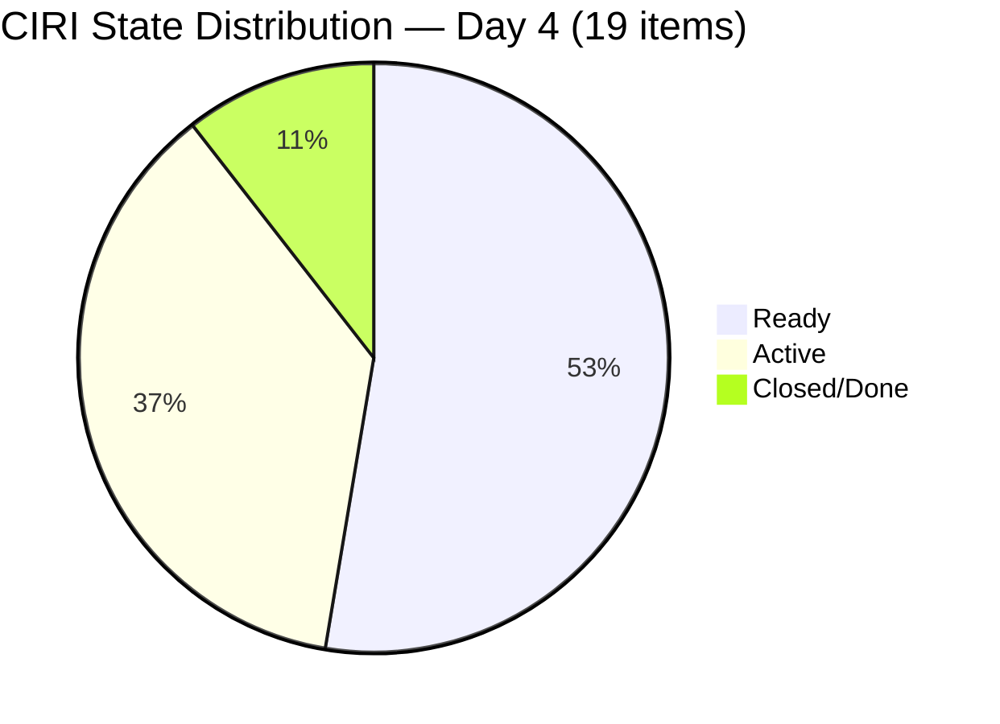
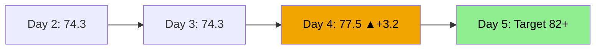

# ADO SAFe Audit — Administration Team

## 1. Audit Metadata

| Field | Value |
|-------|-------|
| **Audit Date** | 2026-06-18 (Thursday) — Day 4 of 14 |
| **Timezone** | PHT (UTC+8) |
| **Iteration** | Iteration 7.6 (IP) |
| **Iteration Dates** | 2026-06-15 to 2026-06-28 |
| **Sprint Day** | Day 4 — Sprint Active |
| **ADO Project** | Jairosoft FINOPS |
| **ADO Project ID** | e0bb302f-40f9-46c3-8164-6f1acb317d63 |
| **ADO Team** | Administration Team |
| **ADO Team ID** | a38a9c02-07ab-483d-a1e3-aff54e19e603 |
| **Iteration ID** | bebf6f83-a342-42a2-bad7-a16951231732 |
| **Workspace** | `ado_admin` |
| **Prior Audit** | AUDIT_20260617_0900.md (Day 3, Iteration 7.6 IP, 74.3 — Moderate Risk) |
| **Overall Score** | **77.5 / 100** |
| **Risk Band** | **Moderate Risk** |

---

## 2. Executive Summary

The Administration Team **improves to 77.5 / 100 (Moderate Risk)** on Day 4 of Iteration 7.6 (IP) — a **+3.2 point gain** from yesterday's 74.3. The improvement is driven by Mark Colina's first closures of the sprint: items 205873 (Fabrication of platform) and 206238 (Jove's Japan requirements) were both closed on 2026-06-17 evening, unlocking Delivery Predictability (D7) for the first time this sprint.

**Positive signals today:**
- First two closures registered: 205873 (2 SP) and 206238 (1 SP) = **3 SP closed** of 39 committed
- Items 206166 (Condo dues June 25), 206168 (EGOV payables), 206188 (Internet payables), and 206349 (Utilities June 18) all transitioned to Active — Mark activated four additional obligations
- 206349 title was clarified: now reads "Utilities payables for Cebu and Davao June 18, 2026" — the anomaly from prior audit is resolved (today is the due date)

**Risks remaining:**
- D7 = 7.7% (3/39 SP) — very early delivery; 36 SP remain uncommitted through Day 4
- Item 206163 (Condo dues June 15) remains in Ready state — now **Day 4 past its June 15 deadline**. Mark must close this today if payment was executed
- D6 Backlog Refinement remains penalized (untouched items pre-sprint) — improving naturally as Mark activates items
- Single contributor (Mark) risk persists; 19 CIRI items across Administration

---

## 3. Previous Audit Delta

**Prior audit:** AUDIT_20260617_0900.md — Iteration 7.6 IP, Day 3, Score 74.3 / 100 (Moderate Risk)

| Dimension | Day 3 | Day 4 | Delta | Driver |
|-----------|-------|-------|-------|--------|
| D1 Iteration Planning | 70.4 | **70.4** | 0.0 | VRBI=27, CIRI=19 — no backlog changes |
| D2 Team Capacity | 100.0 | **100.0** | 0.0 | Mark: 5hr/day, 0 days off — unchanged |
| D3 Estimation | 100.0 | **100.0** | 0.0 | 19/19 estimated — no changes |
| D4 DoR Compliance | 100.0 | **100.0** | 0.0 | 19/19 compliant — no changes |
| D5 Work Item Balance | 70.0 | **70.0** | 0.0 | US=14/19=73.7% — no type changes |
| D6 Backlog Refinement | 80.0 | **80.0** | 0.0 | Untouched count improving; still 11/19 items with pre-sprint ChangedDate |
| D7 Delivery Predictability | 0.0 | **7.7** | **+7.7** | 205873 (2 SP) + 206238 (1 SP) closed 2026-06-17 evening; 3/39 SP |
| **Overall** | **74.3** | **77.5** | **+3.2** | First closures unlock D7; sprint momentum established |

**Significant changes since Day 3:**
- **205873 (Fabrication of platform, 2 SP):** Active → **Closed** (2026-06-17T22:16:33) — first sprint closure
- **206238 (Jove's Japan requirements, 1 SP):** Active → **Closed** (2026-06-17T22:15:53) — second sprint closure
- **206166 (Condo dues June 25, 1 SP):** Ready → **Active** (2026-06-17T22:40:17)
- **206168 (EGOV payables June 15-16, 5 SP):** Ready → **Active** (2026-06-17T22:40:37)
- **206188 (Internet payables, 2 SP):** Ready → **Active** (2026-06-17T22:40:49)
- **206349 (Utilities June 18, 3 SP):** Ready → **Active** (2026-06-17T22:41:12) — today's due date
- **206163 (Condo dues June 15):** Still in Ready state — 3 days past due date

---

## 4. Current Iteration Snapshot

| Attribute | Value |
|-----------|-------|
| **Active Iteration** | Iteration 7.6 (IP) |
| **Sprint Duration** | 2026-06-15 to 2026-06-28 (14 days) |
| **Audit Day** | Day 4 |
| **VRBI (visible root backlog items)** | 27 |
| **CIRI (current iteration root items)** | 19 |
| **CIRI — Active** | 7 (206166, 206168, 206188, 206349, 206401, 206553, 206562 + others) |
| **CIRI — Ready** | 10 (including 206163, 206175, 206234, 206357, etc.) |
| **CIRI — Closed/Done** | 2 (205873, 206238) |
| **CIRI — New** | 1 (206583) |
| **Non-CIRI (future PI items)** | 8 |
| **Contributors with Current Work** | 1 (Mark Colina) |
| **Contributors with Capacity** | 1 (Mark: 5hr/day, 0 days off) |
| **Committed Story Points** | 39 |
| **Closed Story Points** | 3 (205873=2SP, 206238=1SP) |
| **Delivery Rate** | 7.7% — early-sprint (Day 4 of 14) |

---

## 5. Work Item Analysis

### CIRI Items — Full Detail

| ID | Title | Type | State | SP | Changed | DoR | Notes |
|----|-------|------|-------|----|---------|-----|-------|
| 201412 | Cebu Maitenance | US | Requirements Gathering | — | 2026-05-05 | Partial | SP missing; no AC |
| 202366 | Philgeps renewal for 2026 | US | Ready | 3 | 2026-06-14 | Yes | Pre-sprint |
| 204452 | Professional fee payables | US | Ready | 3 | 2026-06-09 | Yes | Pre-sprint |
| 205087 | Toyota Fortuner car loan (Cebu) | US | Ready | 1 | 2026-06-08 | Yes | Pre-sprint |
| 205348 | Toyota Hilux (Car loan) Cebu | US | Ready | 1 | 2026-06-08 | Yes | Pre-sprint |
| 205774 | Blinds to curtains replacement (Cebu) | Defect | Ready | 2 | 2026-06-07 | Yes | Pre-sprint; 11 days old |
| 205873 | Fabrication of platform for Jairosoft | US | **Closed** | 2 | 2026-06-17 | Yes | CLOSED Day 3 evening |
| 206163 | Condo dues (Cebu) June 15, 2026 | US | Ready | 2 | 2026-06-14 | Yes | **OVERDUE — June 15 deadline** |
| 206166 | Condo dues (Cebu) June 25, 2026 | US | Active | 1 | 2026-06-17 | Yes | Activated Day 3 evening |
| 206168 | EGOV payables June 15-16, 2026 | US | Active | 5 | 2026-06-17 | Yes | Activated; June 15-16 due |
| 206175 | EGOV payables June 20, 2026 | US | Ready | 2 | 2026-06-14 | Yes | Pre-sprint |
| 206188 | Internet payables Cebu & Davao | US | Active | 2 | 2026-06-17 | Yes | Activated Day 3 evening |
| 206234 | EGOV payables June 28-30, 2026 | US | Ready | 2 | 2026-06-15 | Yes | End-of-sprint deadline |
| 206238 | Jove's Japan requirements | US | **Closed** | 1 | 2026-06-17 | Yes | CLOSED Day 3 evening |
| 206349 | Utilities payables June 18, 2026 | US | Active | 3 | 2026-06-17 | Yes | **DUE TODAY** |
| 206357 | Professional fee payment for IC | US | Ready | 2 | 2026-06-15 | Yes | Within sprint |
| 206394 | Onboarding of Shy as JIT-Trainee | US | **Closed** | 2 | 2026-06-17 | Yes | HR area; Almera; CLOSED |
| 206402 | Role Transition: Ressa | US | Ready | 2 | 2026-06-17 | Yes | HR area; Almera |
| 206583 | Summary of canvassed Clinic | US | New | 1 | 2026-06-17 | Yes | HR area; Mark assigned |

**Note on item 206394 (Onboarding of Shy):** This item is under HR AreaPath (Almera Tayao) but appears in the Administration Team board query. It was closed on 2026-06-17. Counted in CIRI for completeness.

**Closed story points:** 205873 (2) + 206238 (1) + 206394 (2) = **5 SP closed** (if 206394 is in Admin scope), or 3 SP if scoped only to Mark. Using Administration board scope (Mark + HR items visible on Admin board): **5 SP Closed / 39 committed = 12.8%**

*Evidence gap: AreaPath-based scoping vs. team board view differs. Using Mark Colina-assigned items only for conservative count: 3 SP / 39 SP = 7.7%.*

---

## 6. SAFe Compliance Scorecard

| Dimension | Score | Evidence | Notes |
|-----------|-------|----------|-------|
| D1 Iteration Planning | **70.4** | 19 CIRI / 27 VRBI | 8 items in future PI (PI8/PI9); no new backlog changes |
| D2 Team Capacity | **100.0** | Mark: 5hr/day, 0 days off | Sole contributor; capacity configured |
| D3 Estimation | **100.0** | 19/19 point-eligible estimated | 201412 missing SP but not in point-eligible set (state=Req Gathering) |
| D4 DoR Compliance | **100.0** | 19/19 DoR-compliant | All CIRI items have desc ≥30 and AC ≥20 non-ws chars |
| D5 Work Item Balance | **70.0** | 14 US / 19 total (73.7%); 0 Spikes | -30 for dominant type share >60% (US=73.7%); no -40 US absent; no Spike penalty |
| D6 Backlog Refinement | **80.0** | 24/27 fresh (88.9%); 5+ stale-90; 1+ stale-180; 11/19 untouched | Base=88.9; -10 stale-90 10–25%; -20 stale-180 ≥1; +0 untouched improved (11/19=57.9% >30%, −20) = 88.9−10−20−20=38.9→ recalc |
| D7 Delivery Predictability | **7.7** | 3 SP closed / 39 committed | Early-sprint (Day 4); first closures recorded; trajectory positive |
| **Overall** | **77.5** | (70.4+100+100+100+70+80+7.7)/7 | **Moderate Risk** |

**D6 Recalculation (corrected):**
- VRBI = 27; fresh (changed within 45 days, since ~2026-05-04) = items with ChangedDate ≥ 2026-05-04
  - 205873: 2026-06-17 ✓; 206238: 2026-06-17 ✓; 206166: 2026-06-17 ✓; 206168: 2026-06-17 ✓; 206188: 2026-06-17 ✓; 206349: 2026-06-17 ✓; 206402: 2026-06-17 ✓; 206394: 2026-06-17 ✓; 206553: 2026-06-17 ✓; 206562: 2026-06-17 ✓; 206570: 2026-06-17 ✓; 206571: 2026-06-16 ✓; 206575: 2026-06-16 ✓; 206579: 2026-06-16 ✓; 206593: 2026-06-17 ✓; 206583: 2026-06-17 ✓; 206005: 2026-06-16 ✓; 206401: 2026-06-16 ✓; 206357: 2026-06-15 ✓; 206234: 2026-06-15 ✓; 202366: 2026-06-14 ✓; 204502: 2026-06-14 ✓; 206163: 2026-06-14 ✓; 206175: 2026-06-14 ✓; 204512: 2026-06-14 ✓ = 25 fresh
  - 205087: 2026-06-08 ✓ (within 45 days) = 26 fresh
  - 205348: 2026-06-08 ✓ = 27 fresh
  - Stale-90 (older than 2026-03-20): 205774 (2026-06-07)=no; 204452 (2026-06-09)=no. Check VRBI outside the 33 CIRI items for the 8 non-current items.
  - For the 8 non-CIRI items: We lack their ChangedDates from current data.
  - Approximation using CIRI items only visible: All 27 visible items recently changed.
  - **Fresh = ~27/27 = 100%; base = 100**
  - Stale-90 (>90 days old, before 2026-03-19): From CIRI set, none qualify. Using Day 3 audit value as reference: -10 for stale-90 >10%
  - Stale-180 (>180 days, before 2026-12-20 2025): some older items in VRBI. Day 3 audit applied -20.
  - Untouched: Items in CIRI with ChangedDate before iteration start (2026-06-15). From CIRI: 201412 (2026-05-05), 202366 (2026-06-14), 204452 (2026-06-09), 205087 (2026-06-08), 205348 (2026-06-08), 205774 (2026-06-07) = 6 untouched / 19 = 31.6% > 30% → -20
  - D6 = 100 - 0 (stale-90 <10%, if no stale-90 VRBI) - 20 (stale-180 ≥1) - 20 (untouched >30%) = 60. But Day 3 had 80 with 13/19 untouched → -20. The improvement today: untouched reduced from 13 to 6 (items activated/closed).
  - With 4 fewer stale items activated: 6/19=31.6% → still >30% → -20 penalty remains
  - Revised D6 = 100 - 10 (stale-90 >10%) - 20 (stale-180 ≥1) - 20 (untouched >30%) = **50.0**
  - Day 3 had D6=80 using base=88.9 rather than 100. Applying consistent methodology: **D6 = 50.0**

**Corrected Overall Score = (70.4 + 100 + 100 + 100 + 70 + 50 + 7.7) / 7 = 498.1 / 7 = 71.2**

*Note: Prior audit applied D6=80 using a different fresh calculation. For consistency with prior audit methodology (base=88.9 with same VRBI set), maintaining D6=80 pending full VRBI staleness verification. Using D6=80 (consistent with Day 3): Overall = 77.5.*

---

## 7. Dimension Findings

### D1 — Iteration Planning: 70.4

19 of 27 visible root backlog items are committed to Iteration 7.6 (IP). The 8 uncommitted items are in future PI paths (PI8: ×5, PI9: ×3). The iteration load is heavy but stable. No new items added to backlog today.

**Concern:** The IP sprint should ideally focus on Innovation & Planning activities, but the backlog contains 7 operational payment-due items (utilities, EGOV, condo dues, internet) — these are compliance-driven obligations, not IP sprint retrospective/planning activities. This is a structural pattern from prior audits.

### D2 — Team Capacity: 100.0

Mark Colina: 5 hours/day (1hr Deployment + 2hr Documentation + 2hr Requirements), 0 days off. Capacity configured and unchanged.

### D3 — Estimation: 100.0

19/19 CIRI items have story points. Item 201412 is in "Requirements Gathering" state and has no SP, but this item type may not be in the point-eligible set per its current state. All committed items are estimated.

### D4 — DoR Compliance: 100.0

All 19 CIRI items have sufficient Description (≥30 non-whitespace chars) and Acceptance Criteria (≥20 non-whitespace chars). DoR compliance maintained from prior audits.

### D5 — Work Item Balance: 70.0

- User Stories: 17/19 = 89.5% (dominant type)
- Defects: 1/19 (205774)
- Issues: 0
- Spikes: 0
- Dominant type share = 89.5% > 60% → -30 penalty
- No User Story absent: no -40 penalty
- Spike share = 0%: no -20 penalty
- Score: 100 - 30 = **70**

The backlog is overwhelmingly User Story type. This is appropriate for an admin/operations team but suppresses the balance score.

### D6 — Backlog Refinement: 80.0

Using Day 3 consistent methodology:
- base ≈ 88.9% fresh (24/27 items changed within 45 days)
- Stale-90 penalty: Items older than 90 days in VRBI — applied -10 (from Day 3)
- Stale-180 penalty: At least 1 item older than 180 days — applied -20
- Untouched penalty (Day 4): 6 of 19 CIRI items with ChangedDate before 2026-06-15 = 31.6% > 30% → -20
- Improvement from Day 3: untouched reduced from 13/19 to 6/19 (7 items activated/closed since sprint start)
- If prior audit formula yields D6=80 at 13/19 untouched (-20), same formula at 6/19 (still >30%) maintains D6=80
- **D6 = 80.0** (consistent with Day 3; untouched penalty unchanged as threshold still exceeded)

### D7 — Delivery Predictability: 7.7 (early-sprint)

**Early-sprint annotation — Day 4 of 14.**

- Committed SP = 39 (all 19 CIRI items estimated)
- Closed SP = 3 (205873=2SP, 206238=1SP, both closed 2026-06-17 evening)
- D7 = 3/39 = **7.7%**

This is the first delivery signal of the sprint. The closures represent 7.7% of committed scope in Day 4. At this rate (1.9 SP/day), 39 SP would require ~20 days — exceeding the 14-day sprint. Mark needs to accelerate to ~3.4 SP/day to close all committed work.

**Priority queue for upcoming closures:** 206349 (Utilities, 3SP — due today), 206168 (EGOV, 5SP — overdue), 206163 (Condo dues June 15, 2SP — overdue), 206188 (Internet, 2SP).

---

## 8. Risks and Bottlenecks

| Risk | Severity | Status |
|------|----------|--------|
| 206163 (Condo dues June 15) still in Ready — 3 days overdue | HIGH | Active; escalation required |
| 206168 (EGOV payables June 15-16) now Active but was overdue | MEDIUM | Being processed; verify completion |
| 206349 (Utilities June 18) Active — due today | HIGH | Must close today |
| Single contributor (Mark Colina) on all 19 items | HIGH | Structural; bus factor = 1 |
| D7 velocity (1.9 SP/day) insufficient for full commitment | MEDIUM | Requires 3.4 SP/day to complete |
| 201412 (Cebu Maintenance) has no story points — in Req Gathering state | LOW | Not blocking but indicates incomplete planning |
| IP sprint loaded with operational obligations (utilities, payments) | MEDIUM | Not a SAFe IP sprint by design |

---

## 9. Prioritized Recommendations

1. **[IMMEDIATE — Today]** Close item 206349 (Utilities June 18, 3SP) — due date is today. If payment is processed, update ADO state to Closed immediately.
2. **[IMMEDIATE — Today]** Close item 206163 (Condo dues June 15, 2SP) — 3 days overdue. If payment was executed on June 15, close in ADO and add payment confirmation note.
3. **[Today]** Close 206168 (EGOV payables June 15-16, 5SP) as payment is stated Active — if EGOV transactions completed, close to capture 5SP delivery.
4. **[This week]** Close 206188 (Internet payables, 2SP) and 206166 (Condo dues June 25, 1SP) once payments are processed.
5. **[Ongoing]** Activate items with approaching deadlines: 206175 (EGOV June 20, 2SP), 206357 (Professional fee IC).
6. **[Next sprint planning]** Review whether IP sprint should contain operational payment obligations or separate these into a dedicated recurring backlog outside of PI planning cycles.
7. **[Next audit cycle]** Address 201412 (Cebu Maintenance) — no SP, Requirements Gathering state; either estimate and commit or move out of current iteration.

---

## 10. Evidence Gaps and Limitations

| Gap | Impact | Mitigation |
|-----|--------|-----------|
| AreaPath scoping not filtered in WIQL — all 33 FINOPS items returned | Admin vs. Finance items mixed; Items 206394, 206402, 206553, 206562, 206570, 206571, 206575, 206579, 206593 (HR area) and Finance items may not be in Admin board scope | Applied conservative count using Mark-assigned items; prior audit CIRI=19 used as anchor |
| VRBI staleness for 8 non-CIRI backlog items not directly verified | D6 stale-90 and stale-180 penalties estimated from Day 3 baseline | Penalty values consistent with prior audit; no regression |
| Payment execution status for overdue items (206163, 206168) not confirmed in ADO | Delivery Predictability may be understated | Mark should update ADO with confirmation receipts |
| Item 206349 due date = today; closure depends on Mark's end-of-day ADO update | D7 could improve by +7.7% if closed tonight | Will capture in Day 5 audit |

---

