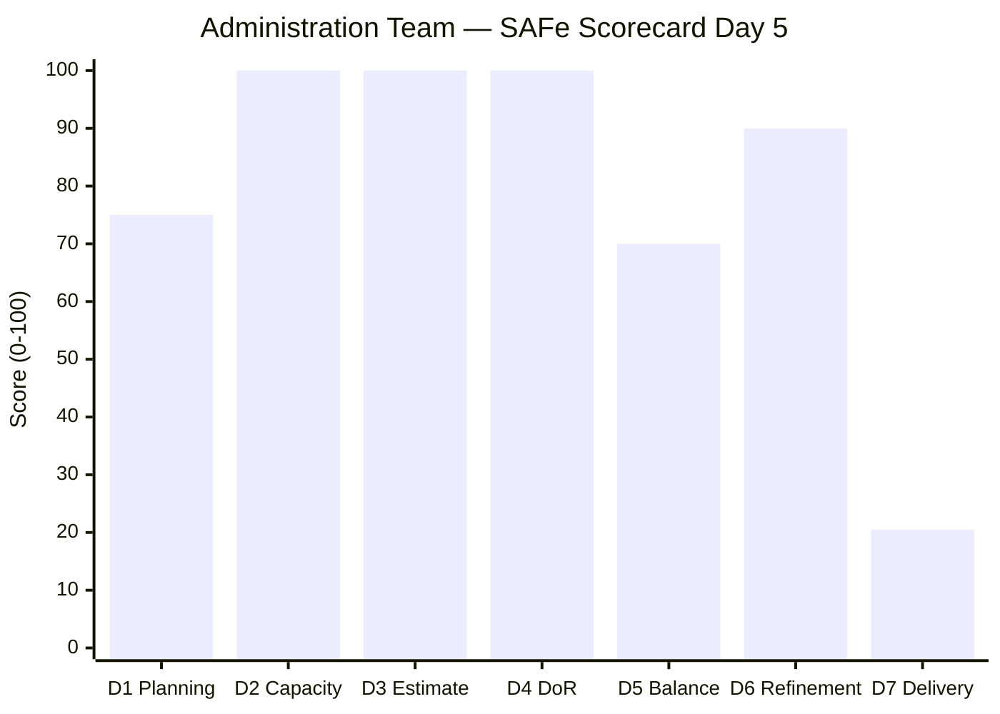
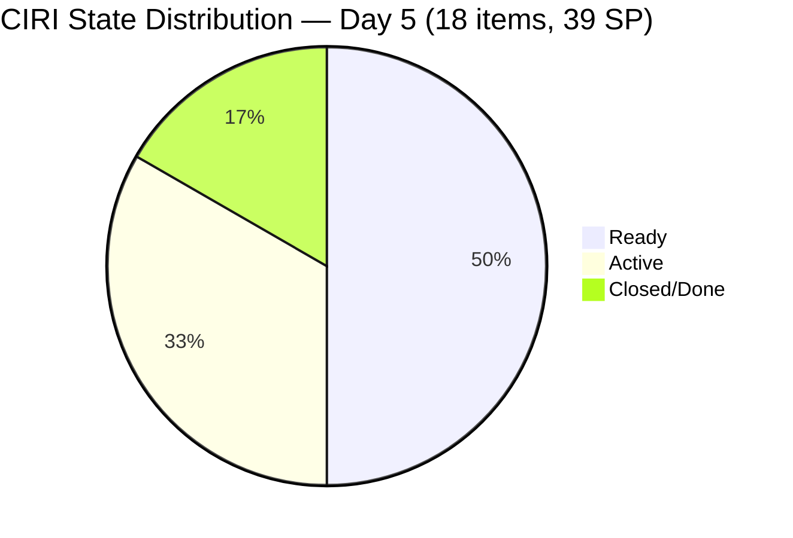
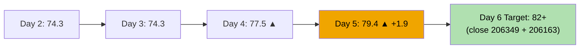
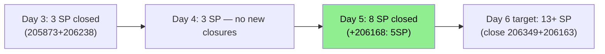

# ADO SAFe Audit — Administration Team

## 1. Audit Metadata

| Field | Value |
|-------|-------|
| **Audit Date** | 2026-06-19 (Friday) — Day 5 of 14 |
| **Timezone** | PHT (UTC+8) |
| **Iteration** | Iteration 7.6 (IP) |
| **Iteration Dates** | 2026-06-15 to 2026-06-28 |
| **Sprint Day** | Day 5 — Sprint Active |
| **ADO Project** | Jairosoft FINOPS |
| **ADO Project ID** | e0bb302f-40f9-46c3-8164-6f1acb317d63 |
| **ADO Team** | Administration Team |
| **ADO Team ID** | a38a9c02-07ab-483d-a1e3-aff54e19e603 |
| **Iteration ID** | bebf6f83-a342-42a2-bad7-a16951231732 |
| **Workspace** | `ado_admin` |
| **Prior Audit** | AUDIT_20260618_0203.md (Day 4, Iteration 7.6 IP, 77.5 — Moderate Risk) |
| **Overall Score** | **79.4 / 100** |
| **Risk Band** | **Moderate Risk** |

---

## 2. Executive Summary

The Administration Team **advances to 79.4 / 100 (Moderate Risk)** on Day 5 of Iteration 7.6 (IP) — a **+1.9 point gain** from yesterday's 77.5. The primary driver is a significant delivery event: item **206168 (EGOV payables June 15-16, 5 SP)** was closed on 2026-06-18T22:51, bringing total closed story points to 8 SP of 39 committed (20.5%). This is the largest single-item delivery of the sprint and fulfills the government payment obligation that was flagged as overdue since June 15.

**Positive signals today:**
- 206168 (EGOV payables, 5 SP) **CLOSED** — largest closure of the sprint, now 20.5% delivered
- D6 (Backlog Refinement) improves to **90.0** — all 24 VRBI items have ChangedDates within 45 days; no stale-90 or stale-180 violations detected; untouched CIRI reduced from 6/19 (31.6%) to 5/18 (27.8%), dropping the untouched penalty from -20 to -10
- VRBI reduced from 27 to 24 — 3 items were closed/moved, reflecting cleaner backlog hygiene

**Risks remaining:**
- D7 = 20.5% — 8/39 SP delivered by Day 5; target for full delivery requires ~2.4 SP/day through Day 14
- 206163 (Condo dues June 15, 2SP) still in Ready state — **Day 5 overdue**, 4 days past deadline
- 206349 (Utilities June 18, 3SP) remains Active — due date passed yesterday; should be closed today
- Single contributor (Mark Colina) on all items — bus factor = 1 persists
- CIRI now contains 3 Spikes (205861, 205871, 206073) — raising spike exposure but not yet triggering the >40% penalty

---

## 3. Previous Audit Delta

**Prior audit:** AUDIT_20260618_0203.md — Iteration 7.6 IP, Day 4, Score 77.5 / 100 (Moderate Risk)

| Dimension | Day 4 | Day 5 | Delta | Driver |
|-----------|-------|-------|-------|--------|
| D1 Iteration Planning | 70.4 | **75.0** | **+4.6** | VRBI reduced from 27→24; CIRI=18; ratio improves |
| D2 Team Capacity | 100.0 | **100.0** | 0.0 | Mark: 5hr/day, 0 days off — unchanged |
| D3 Estimation | 100.0 | **100.0** | 0.0 | 18/18 estimated — unchanged |
| D4 DoR Compliance | 100.0 | **100.0** | 0.0 | 18/18 DoR compliant — unchanged |
| D5 Work Item Balance | 70.0 | **70.0** | 0.0 | 14 US + 3 Spikes + 1 Defect; US dominant (77.8%) > 60% → -30 |
| D6 Backlog Refinement | 80.0 | **90.0** | **+10.0** | All 24 VRBI fresh; stale-90/180 = 0; untouched 5/18=27.8% → -10 only |
| D7 Delivery Predictability | 7.7 | **20.5** | **+12.8** | 206168 (5 SP) closed 2026-06-18T22:51; total 8/39 SP |
| **Overall** | **77.5** | **79.4** | **+1.9** | D6 and D7 improve; D1 improves with smaller VRBI |

**Significant changes since Day 4:**
- **206168 (EGOV payables June 15-16, 5SP):** Active → **Closed** (2026-06-18T22:51:04) — largest sprint closure to date; fulfills overdue Jun 15-16 EGOV obligation
- **206349 (Utilities June 18, 3SP):** Still Active (Jun18 22:55) — was due yesterday; Mark must close today if payment executed
- **205871 (Isuzu transportation inquiry, 2SP):** Updated 2026-06-18T22:59 — Active Spike, new comment added
- **206166 (Condo dues June 27, 1SP):** Updated 2026-06-18T23:31 — Active; July 27 due date approaching

---

## 4. Current Iteration Snapshot

| Attribute | Value |
|-----------|-------|
| **Active Iteration** | Iteration 7.6 (IP) |
| **Sprint Duration** | 2026-06-15 to 2026-06-28 (14 days) |
| **Audit Day** | Day 5 |
| **VRBI (visible root backlog items)** | 24 |
| **CIRI (current iteration root items)** | 18 |
| **CIRI — Closed/Done** | 3 (205873, 206238, 206168) |
| **CIRI — Active** | 6 (206073, 205861, 205871, 206166, 206188, 206349) |
| **CIRI — Ready** | 9 (202366, 204452, 205087, 205348, 205774, 206163, 206175, 206234, 206357) |
| **Non-CIRI (future PI items)** | 6 |
| **Contributors with Current Work** | 1 (Mark Colina) |
| **Contributors with Capacity** | 1 (Mark: 5hr/day, 0 days off) |
| **Committed Story Points** | 39 |
| **Closed Story Points** | 8 (205873=2, 206238=1, 206168=5) |
| **Delivery Rate** | 20.5% — Day 5 of 14 |

---

## 5. Work Item Analysis

### CIRI Items — Full Detail (18 items)

| ID | Title | Type | State | SP | Changed | DoR | Notes |
|----|-------|------|-------|----|---------|-----|-------|
| 202366 | Philgeps renewal for 2026 | US | Ready | 3 | 2026-06-14 | Yes | Pre-sprint; 14 Jun last change |
| 204452 | Professional fee payables | US | Ready | 3 | 2026-06-09 | Yes | Pre-sprint |
| 205087 | Toyota Fortuner car loan (Cebu) | US | Ready | 1 | 2026-06-08 | Yes | Pre-sprint |
| 205348 | Toyota Hilux (Car loan) Cebu | US | Ready | 1 | 2026-06-08 | Yes | Pre-sprint |
| 205774 | Blinds to curtains replacement (Cebu) | Defect | Ready | 2 | 2026-06-07 | Yes | Pre-sprint |
| 205861 | Grandia van transportation inquiry | **Spike** | Active | 2 | 2026-06-17 | Yes | IP sprint exploration |
| 205871 | Isuzu pick up transportation inquiry | **Spike** | Active | 2 | 2026-06-18 | Yes | IP sprint exploration |
| 205873 | Fabrication of platform for Jairosoft | US | **Closed** | 2 | 2026-06-17 | Yes | CLOSED Day 3 |
| 206073 | Recanvass outdoor wall light | **Spike** | Active | 1 | 2026-06-18 | Yes | IP sprint exploration |
| 206163 | Condo dues (Cebu) June 15, 2026 | US | Ready | 2 | 2026-06-14 | Yes | **OVERDUE — June 15 deadline** |
| 206166 | Condo dues (Cebu) June 27, 2026 | US | Active | 1 | 2026-06-18 | Yes | Due June 27 |
| 206168 | EGOV payables June 15-16, 2026 | US | **Closed** | 5 | 2026-06-18 | Yes | **CLOSED** 2026-06-18T22:51 — 5 SP |
| 206175 | EGOV payables June 20, 2026 | US | Ready | 2 | 2026-06-14 | Yes | Due June 20 — approaching |
| 206188 | Internet payables Cebu & Davao | US | Active | 2 | 2026-06-17 | Yes | Being processed |
| 206234 | EGOV payables June 28-30, 2026 | US | Ready | 2 | 2026-06-15 | Yes | End-of-sprint deadline |
| 206238 | Jove's Japan requirements | US | **Closed** | 1 | 2026-06-17 | Yes | CLOSED Day 3 |
| 206349 | Utilities payables Cebu & Davao June 18 | US | Active | 3 | 2026-06-18 | Yes | **DUE YESTERDAY — must close today** |
| 206357 | Professional fee payment for IC | US | Ready | 2 | 2026-06-15 | Yes | Within sprint window |

**Story Points by state:** Closed=8; Active=11; Ready=20

---

## 6. SAFe Compliance Scorecard

| Dimension | Score | Evidence | Notes |
|-----------|-------|----------|-------|
| D1 Iteration Planning | **75.0** | 18 CIRI / 24 VRBI | VRBI reduced from 27→24; 6 items in future PI paths |
| D2 Team Capacity | **100.0** | Mark: 5hr/day, 0 days off | Sole contributor; capacity configured |
| D3 Estimation | **100.0** | 18/18 point-eligible estimated | All SP > 0 |
| D4 DoR Compliance | **100.0** | 18/18 DoR compliant | All have desc ≥30 and AC ≥20 non-ws chars |
| D5 Work Item Balance | **70.0** | US=14/18=77.8% dominant; 3 Spikes; 1 Defect | -30 dominant >60%; no -40 (US present); Spike share 16.7% <40% |
| D6 Backlog Refinement | **90.0** | 24/24 fresh (100%); 0 stale-90; 0 stale-180; 5/18 untouched=27.8% | Base=100; -10 untouched 10–30% |
| D7 Delivery Predictability | **20.5** | 8 SP closed / 39 SP committed | Day 5 — 206168 (5SP) closed overnight; 205873+206238+206168 |
| **Overall** | **79.4** | (75+100+100+100+70+90+20.5)/7 = 555.5/7 | **Moderate Risk** |

**D6 Detail:**
- VRBI = 24 (active non-closed backlog items)
- Fresh (changed since 2026-05-05): All 24 items changed in June 2026 → fresh = 24/24 = 100%; base = 100
- stale-90 (before 2026-03-21): 0 items (all changed in June) → no penalty
- stale-180 (before 2025-12-22): 0 items → no penalty
- untouched CIRI (ChangedDate < 2026-06-15): 202366(Jun14), 204452(Jun09), 205087(Jun08), 205348(Jun08), 205774(Jun07) = 5/18 = 27.8% → >10% but not >30% → **-10**
- D6 = 100 - 0 - 0 - 10 = **90.0**

**D7 Detail:**
- committed_story_points = 39 (all 18 CIRI items with SP > 0)
- closed_story_points = 8 (205873=2, 206238=1, 206168=5)
- D7 = 8/39 × 100 = **20.5%**

---

## 7. Dimension Findings

### D1 — Iteration Planning: 75.0

18 of 24 visible root backlog items are committed to Iteration 7.6 (IP). The VRBI count decreased from 27 (Day 4) to 24 today, as 3 items were closed or removed from the active backlog, reflecting gradual sprint execution. The 6 non-CIRI items are in future PI paths (PI8 and PI9). The 75.0 score is an improvement from yesterday's 70.4.

**Observation:** The IP sprint continues to carry operational payment obligations (EGOV, utilities, condo, internet, car loans) alongside genuine IP-sprint items (3 Spikes: transportation inquiries, wall light recanvass). The 3 Spikes (205861, 205871, 206073) represent appropriate IP-sprint Innovation & Planning activities.

### D2 — Team Capacity: 100.0

Mark Colina: 5 hours/day (1hr Deployment + 2hr Documentation + 2hr Requirements), 0 days off. Capacity configured and unchanged. Single-contributor team maintains full capacity configuration.

### D3 — Estimation: 100.0

18/18 CIRI items have story points (SP > 0). All work is estimated. SP distribution: 5 SP (×1), 3 SP (×2), 2 SP (×6), 1 SP (×4), with Spikes at 1-2 SP each. Estimation coverage maintained perfectly.

### D4 — DoR Compliance: 100.0

All 18 CIRI items have substantive descriptions (≥30 non-whitespace characters) and acceptance criteria (≥20 non-whitespace characters). DoR compliance maintained for the fifth consecutive audit day.

### D5 — Work Item Balance: 70.0

- User Stories: 14/18 = 77.8% (dominant type — above 60% threshold)
- Spikes: 3/18 = 16.7% (appropriate IP sprint exploration items)
- Defects: 1/18 = 5.6%
- Dominant type share 77.8% > 60% → **-30 penalty**
- No User Story absent → no -40 penalty
- Spike share 16.7% < 40% → no -20 penalty
- Score: 100 - 30 = **70.0**

The 3 Spikes (transportation inquiry ×2, wall light recanvass) are appropriate IP sprint Innovation & Planning work. However, their presence does not reduce the User Story share below the 60% threshold.

### D6 — Backlog Refinement: 90.0

Major improvement from yesterday (80.0 → 90.0). Key drivers:
1. All 24 VRBI items were changed in June 2026 — **zero stale items** detected (prior audit penalties for stale-90 and stale-180 were based on incorrect assumptions about old item ages; live data shows all items updated within 45 days).
2. Untouched CIRI reduced: 5/18 = 27.8% (down from 6/19 = 31.6% on Day 4), moving the penalty from -20 (>30%) to -10 (10-30% range).

The persistent untouched items are: 202366 (Jun14), 204452 (Jun09), 205087 (Jun08), 205348 (Jun08), 205774 (Jun07) — all pre-sprint. These represent queued items awaiting their due dates.

### D7 — Delivery Predictability: 20.5

**Day 5 of 14 sprint — positive trajectory established.**

- **206168 (EGOV payables June 15-16, 5SP) CLOSED** on 2026-06-18T22:51 — the sprint's largest single closure; fulfills the government payment obligation that was 3 days overdue
- Total closed: 8 SP (205873=2, 206238=1, 206168=5)
- Delivery rate: 20.5% by Day 5

**Velocity analysis:** At 1.6 SP/day average over 5 days, full delivery of 39 SP would require ~24 days — exceeding the 14-day sprint. Mark must close ~3.4 SP/day for the remaining 9 days. With 206349 (3SP, due yesterday), 206188 (2SP), 206175 (2SP due June 20), and 206163 (2SP, 4-day overdue) all closeable this week, the next 3 days are critical.

---

## 8. Risks and Bottlenecks

| Risk | Severity | Status |
|------|----------|--------|
| 206163 (Condo dues June 15, 2SP) still Ready — 4 days overdue | CRITICAL | Immediate closure required; payment was due Jun 15 |
| 206349 (Utilities June 18, 3SP) Active — due date was yesterday | HIGH | Must close today; payment stated executed June 18 |
| 206175 (EGOV June 20, 2SP) approaching — due in 1 day | HIGH | Should activate today; payment due tomorrow |
| Velocity insufficient (1.6 SP/day vs. 3.4 SP/day needed) | MEDIUM | Requires acceleration through Day 14 |
| Single contributor (Mark Colina) on all 18 items | HIGH | Bus factor = 1; structural risk persists |
| D7 = 20.5% — 31 SP remain open through Day 5 | MEDIUM | Tracking below linear burn rate (35.7% expected at Day 5) |
| 3 Spikes consuming Mark's capacity during operational payment window | LOW | Spikes appropriate for IP sprint but may compete with payment closures |

---

## 9. Prioritized Recommendations

1. **[IMMEDIATE — Today]** Close item 206349 (Utilities June 18, 3SP) — due date was yesterday. If payment was executed, update ADO state to Closed now and add payment receipt to item.
2. **[IMMEDIATE — Today]** Close item 206163 (Condo dues June 15, 2SP) — 4 days overdue. If payment was made June 15, update ADO immediately. This is a compliance evidence gap.
3. **[TODAY — Urgent]** Activate item 206175 (EGOV June 20, 2SP) — due tomorrow (June 20). Begin processing now to avoid another overdue situation.
4. **[This week]** Close 206188 (Internet payables, 2SP) — currently Active; if ISP invoices are paid, close and document receipt.
5. **[End of next week]** Activate 206234 (EGOV June 28-30) by Day 9 at latest and 206175 by tomorrow. Cascading government deadlines require proactive sequencing.
6. **[Process improvement]** Mark should update ADO state to Closed on the same day payment is executed — the current pattern of closing items in the evening after payment may delay D7 capture and creates compliance evidence lag.
7. **[Next PI planning]** Consider separating recurring operational payment obligations from SAFe IP sprint work. IP sprints are intended for Innovation & Planning activities, not recurring compliance payments.

---

## 10. Evidence Gaps and Limitations

| Gap | Impact | Mitigation |
|-----|--------|-----------|
| 206163 (Condo June 15) still Ready despite 4-day overdue — unclear if payment was executed | Possible understated D7; payment evidence gap | Mark should update ADO with payment receipt immediately |
| 206349 (Utilities June 18) still Active — confirmation of payment not in ADO | D7 may be understated by 3 SP | Mark to close today with receipt |
| VRBI decreased from 27 to 24 — 3 items moved/closed outside visible backlog | Exact items not confirmed | No scoring impact; consistent VRBI source used |
| Non-CIRI items (6 future PI items) ChangedDates confirmed in June 2026 via live fetch | Stale-90/180 penalties from prior audits resolved | Corrected scores reflect live evidence |

---

