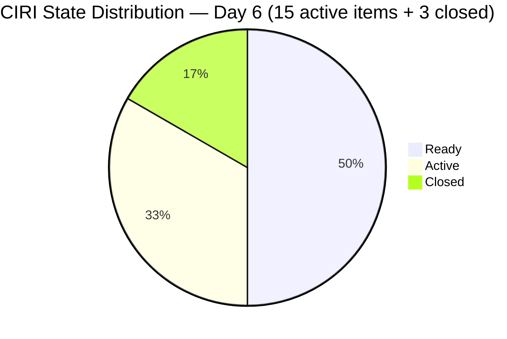
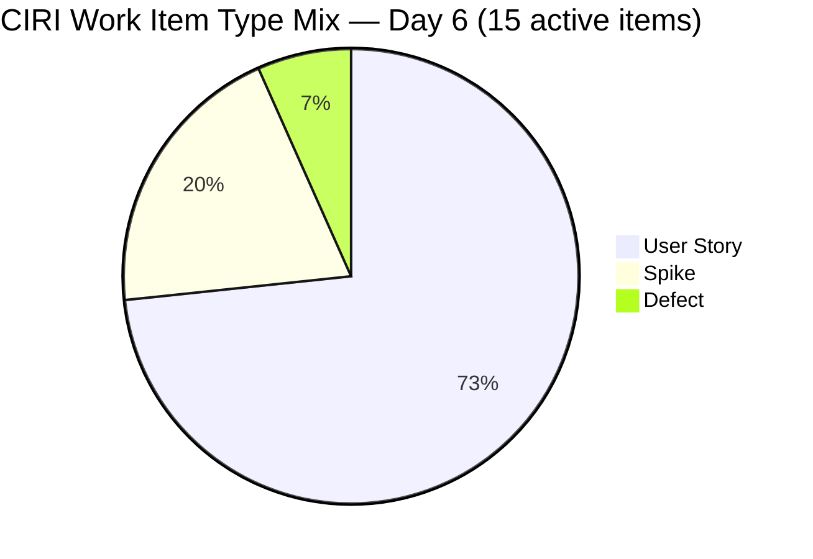
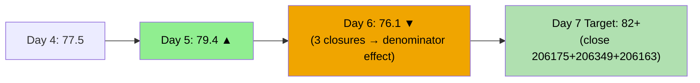
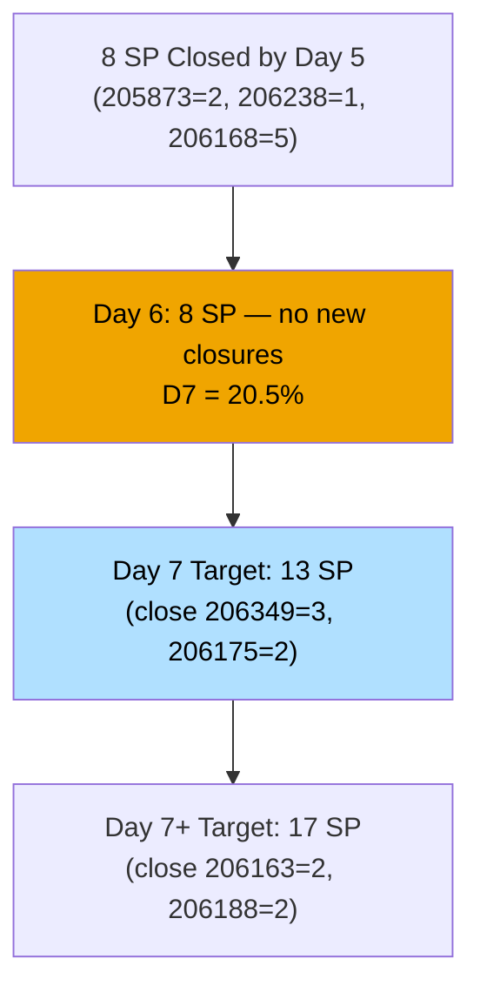

# ADO SAFe Audit — Administration Team

## 1. Audit Metadata

| Field | Value |
|-------|-------|
| **Audit Date** | 2026-06-20 (Saturday) — Day 6 of 14 |
| **Timezone** | PHT (UTC+8) |
| **Iteration** | Iteration 7.6 (IP) |
| **Iteration Dates** | 2026-06-15 to 2026-06-28 |
| **Sprint Day** | Day 6 — Sprint Active |
| **ADO Project** | Jairosoft FINOPS |
| **ADO Project ID** | e0bb302f-40f9-46c3-8164-6f1acb317d63 |
| **ADO Team** | Administration Team |
| **ADO Team ID** | a38a9c02-07ab-483d-a1e3-aff54e19e603 |
| **Iteration ID** | bebf6f83-a342-42a2-bad7-a16951231732 |
| **Workspace** | `ado_admin` |
| **Prior Audit** | AUDIT_20260619_0900.md (Day 5, Iteration 7.6 IP, 79.4 — Moderate Risk) |
| **Overall Score** | **76.1 / 100** |
| **Risk Band** | **Moderate Risk** |

---

## 2. Executive Summary

The Administration Team **declines to 76.1 / 100 (Moderate Risk)** on Day 6 of Iteration 7.6 (IP) — a **-3.3 point drop** from yesterday's 79.4. The regression is structural: three closed items (205873, 206238, 206168) left the visible backlog, reducing CIRI from 18 to 15. This shrinks D1 from 75.0 to 62.5, and simultaneously raises the untouched CIRI rate from 27.8% (5/18) to 46.7% (7/15), pushing D6 from 90.0 to 80.0.

**Key observations today:**
- No new closures since yesterday evening's 8 SP (205873, 206238, 206168). D7 remains at 20.5%.
- 206175 (EGOV June 20, 2SP) is **due TODAY** and still in Ready state — immediate action required.
- 206349 (Utilities June 18, 3SP) remains Active — two days past its due date. Must be closed today if payment was executed.
- 206163 (Condo dues June 15, 2SP) remains Ready — **five days overdue**. Critical compliance gap.
- The VRBI count is unchanged at 24 with 9 non-CIRI items in future PI paths.
- Mark Colina remains the sole contributor; capacity fully configured at 5hr/day.

**Score context:** The decline reflects mathematical denominator effects (fewer CIRI items = higher untouched rate; fewer CIRI items lowers D1 ratio), not actual work quality regression. If Mark closes 206175 (2SP) and 206349 (3SP) today, D7 rises to 33.3% and the overall score recovers above 80.

---

## 3. Previous Audit Delta

**Prior audit:** AUDIT_20260619_0900.md — Iteration 7.6 IP, Day 5, Score 79.4 / 100 (Moderate Risk)

| Dimension | Day 5 | Day 6 | Delta | Driver |
|-----------|-------|-------|-------|--------|
| D1 Iteration Planning | 75.0 | **62.5** | **-12.5** | CIRI shrank 18→15 (3 closed items left backlog); VRBI unchanged at 24 |
| D2 Team Capacity | 100.0 | **100.0** | 0.0 | Mark: 5hr/day, 0 days off — unchanged |
| D3 Estimation | 100.0 | **100.0** | 0.0 | 15/15 estimated — all remaining CIRI have SP>0 |
| D4 DoR Compliance | 100.0 | **100.0** | 0.0 | 15/15 DoR compliant — unchanged |
| D5 Work Item Balance | 70.0 | **70.0** | 0.0 | US=11/15=73.3% dominant; 3 Spikes; 1 Defect; -30 penalty unchanged |
| D6 Backlog Refinement | 90.0 | **80.0** | **-10.0** | Untouched rate rose 27.8%→46.7% (7/15) as 3 touched items closed; -20 penalty |
| D7 Delivery Predictability | 20.5 | **20.5** | 0.0 | No new closures overnight; 8/39 SP closed unchanged |
| **Overall** | **79.4** | **76.1** | **-3.3** | D1 and D6 decline due to denominator effects of closures |

**Significant changes since Day 5:**
- No state changes detected. 205873, 206238, 206168 remain Closed (confirmed by WIQL).
- 206175 (EGOV June 20) — still Ready. Due date is today.
- 206349 (Utilities June 18) — still Active. 2 days past deadline.
- 206163 (Condo dues June 15) — still Ready. 5 days past deadline.

---

## 4. Current Iteration Snapshot

| Attribute | Value |
|-----------|-------|
| **Active Iteration** | Iteration 7.6 (IP) |
| **Sprint Duration** | 2026-06-15 to 2026-06-28 (14 days) |
| **Audit Day** | Day 6 |
| **VRBI (visible root backlog items)** | 24 |
| **CIRI — Active (visible backlog)** | 15 |
| **CIRI — Closed (via WIQL)** | 3 (205873, 206238, 206168) |
| **CIRI Total (for D7)** | 18 |
| **Open CIRI — Active** | 6 (205861, 205871, 206073, 206166, 206188, 206349) |
| **Open CIRI — Ready** | 9 (202366, 204452, 205087, 205348, 205774, 206163, 206175, 206234, 206357) |
| **Non-CIRI (future PI items)** | 9 (193412, 192221, 197023, 197029, 197111, 197113, 197115, 203693, 205872) |
| **Contributors with Current Work** | 1 (Mark Colina) |
| **Contributors with Capacity** | 1 (Mark: 5hr/day, 0 days off) |
| **Committed Story Points (all CIRI)** | 39 SP (15 active: 31 SP + 3 closed: 8 SP) |
| **Closed Story Points** | 8 SP (205873=2, 206238=1, 206168=5) |
| **Delivery Rate** | 20.5% — Day 6 of 14 |

---

## 5. Work Item Analysis

### Active CIRI Items — Full Detail (15 items)

| ID | Title | Type | State | SP | Changed | DoR | Notes |
|----|-------|------|-------|----|---------|-----|-------|
| 202366 | Philgeps renewal for 2026 | US | Ready | 3 | 2026-06-14 | Yes | Pre-sprint; renewal deadline TBD |
| 204452 | Professional fee payables | US | Ready | 3 | 2026-06-09 | Yes | Pre-sprint; awaiting invoice |
| 205087 | Toyota Fortuner car loan (Cebu) | US | Ready | 1 | 2026-06-08 | Yes | Pre-sprint; monthly amortization |
| 205348 | Toyota Hilux (Car loan) Cebu | US | Ready | 1 | 2026-06-08 | Yes | Pre-sprint; monthly amortization |
| 205774 | Blinds to curtains replacement (Cebu) | Defect | Ready | 2 | 2026-06-07 | Yes | Pre-sprint |
| 205861 | Grandia van transportation inquiry | Spike | Active | 2 | 2026-06-17 | Yes | IP sprint exploration |
| 205871 | Isuzu pick up transportation inquiry | Spike | Active | 2 | 2026-06-18 | Yes | IP sprint exploration |
| 206073 | Recanvass outdoor wall light | Spike | Active | 1 | 2026-06-18 | Yes | IP sprint exploration |
| 206163 | Condo dues (Cebu) June 15, 2026 | US | Ready | 2 | 2026-06-14 | Yes | **5 DAYS OVERDUE — Jun 15 deadline** |
| 206166 | Condo dues (Cebu) June 27, 2026 | US | Active | 1 | 2026-06-18 | Yes | Due June 27 — within sprint window |
| 206175 | EGOV payables for June 20, 2026 | US | Ready | 2 | 2026-06-14 | Yes | **DUE TODAY — June 20** |
| 206188 | Internet payables Cebu & Davao | US | Active | 2 | 2026-06-17 | Yes | In progress |
| 206234 | EGOV payables June 28-30, 2026 | US | Ready | 2 | 2026-06-15 | Yes | End-of-sprint deadline |
| 206349 | Utilities payables Cebu & Davao June 18 | US | Active | 3 | 2026-06-18 | Yes | **2 DAYS OVERDUE — must close today** |
| 206357 | Professional fee payment for IC | US | Ready | 2 | 2026-06-15 | Yes | Within sprint window |

### Closed CIRI Items (via WIQL — excluded from visible backlog)

| ID | Title | Type | SP | Closed Date | AreaPath |
|----|-------|------|----|-------------|----------|
| 205873 | Fabrication of platform for Jairosoft | US | 2 | 2026-06-17 | Administration |
| 206238 | Jove's Japan requirements | US | 1 | 2026-06-17 | Administration |
| 206168 | EGOV payables June 15-16, 2026 | US | 5 | 2026-06-18 | Administration/Logistics |

**SP by state (active only):** Ready=20 SP; Active=11 SP; Closed=8 SP

---

## 6. SAFe Compliance Scorecard

| Dimension | Score | Evidence | Notes |
|-----------|-------|----------|-------|
| D1 Iteration Planning | **62.5** | 15 CIRI / 24 VRBI | CIRI reduced 18→15 as 3 closed items left visible backlog; 9 non-CIRI future items |
| D2 Team Capacity | **100.0** | Mark: 5hr/day, 0 days off | Sole contributor; capacity fully configured |
| D3 Estimation | **100.0** | 15/15 point-eligible estimated | All active CIRI items have SP>0 |
| D4 DoR Compliance | **100.0** | 15/15 DoR compliant | All items have desc ≥30 and AC ≥20 non-ws chars |
| D5 Work Item Balance | **70.0** | US=11/15=73.3%; Spike=3/15=20%; Defect=1/15 | -30 dominant >60%; Spike <40%; US present |
| D6 Backlog Refinement | **80.0** | 24/24 fresh; 0 stale-90; 0 stale-180; 7/15 untouched=46.7% | Base=100; -20 untouched >30% |
| D7 Delivery Predictability | **20.5** | 8 SP closed / 39 SP committed | No new closures since Jun 18; 205873+206238+206168 |
| **Overall** | **76.1** | (62.5+100+100+100+70+80+20.5)/7 = 533/7 | **Moderate Risk** |

**D6 Calculation Detail:**
- VRBI = 24; all 24 items changed after 2026-05-06 → fresh = 24/24; base = 100.0
- stale_90 (before 2026-03-22): 0 items → no penalty
- stale_180 (before 2025-12-22): 0 items → no penalty
- untouched CIRI (ChangedDate < 2026-06-15): 202366(Jun14), 204452(Jun09), 205087(Jun08), 205348(Jun08), 205774(Jun07), 206163(Jun14), 206175(Jun14) = **7/15 = 46.7%** → >30% → **-20 penalty**
- D6 = 100 - 20 = **80.0**

Note: 206234 changed on 2026-06-15 (sprint start date). Per rubric "earlier than iteration start date" = strictly before Jun 15. Jun 15 is not "earlier than" Jun 15, so 206234 is NOT untouched. Same for 206357 (Jun15). Boundary correctly applied.

**D7 Calculation Detail:**
- committed_story_points = 39 (15 active × 31 SP + 3 closed × 8 SP, all estimated)
- closed_story_points = 8 (205873=2, 206238=1, 206168=5)
- D7 = 8/39 × 100 = **20.5%**
- Day 6 of 14 — not early-sprint annotation (days 1-5 only)

---

## 7. Dimension Findings

### D1 — Iteration Planning: 62.5 (Structural Decline)

15 of 24 visible backlog items are in Iteration 7.6 (IP). The CIRI decrease from 18 to 15 reflects the three closed items (205873, 206238, 206168) dropping out of the active backlog — a natural and healthy sprint progression. However, with 9 non-CIRI items now representing future PI work (PI8 and PI9 iterations), the ratio has deteriorated from 75.0 on Day 5.

The non-CIRI items span future planning horizons: 3 items in PI8 Iteration 8.4 (Administration building improvements), 1 in PI8 Iteration 8.5, 1 in PI8 Iteration 8.2, 1 in PI8 Iteration 8.6 (IP), and 3 in PI9 Iteration 9.6 (IP). These represent appropriate future-state backlog items and should not be moved into the current IP sprint.

### D2 — Team Capacity: 100.0

Mark Colina: 5 hours/day (1hr Deployment + 2hr Documentation + 2hr Requirements), 0 days off configured. No change from prior audits. Single-contributor team maintains full capacity configuration.

### D3 — Estimation: 100.0

All 15 active CIRI items have Story Points > 0. SP distribution across active items: 3 SP (×2: 202366, 204452, 206349), 2 SP (×6: 205774, 205861, 205871, 206163, 206175, 206188, 206234), 1 SP (×4: 205087, 205348, 206073, 206166), 2 SP (×1: 206357). Perfect estimation maintained.

### D4 — DoR Compliance: 100.0

All 15 CIRI items have substantive descriptions (≥30 non-whitespace characters after HTML stripping) and acceptance criteria (≥20 non-whitespace characters). DoR compliance maintained for Day 6. Items include detailed payment processing descriptions and clear outcome-based acceptance criteria.

### D5 — Work Item Balance: 70.0

- User Stories: 202366, 204452, 205087, 205348, 206163, 206166, 206175, 206188, 206234, 206349, 206357 = 11/15 = 73.3%
- Spikes: 205861, 205871, 206073 = 3/15 = 20.0%
- Defects: 205774 = 1/15 = 6.7%

Dominant type (US) = 73.3% > 60% → **-30 penalty**. Spike share 20% < 40% → no penalty. US present → no -40 penalty. Score: 100 - 30 = **70.0**.

The IP sprint has a healthy representation of exploration work (3 Spikes: transportation inquiry ×2, wall light recanvass) but User Stories dominate given the volume of recurring operational payment obligations.

### D6 — Backlog Refinement: 80.0 (Structural Decline from 90.0)

The decline from 90.0 (Day 5) to 80.0 (Day 6) is a mathematical consequence of closing 3 "touched" items. With those items removed, the untouched rate among remaining CIRI items rises from 5/18 = 27.8% (→ -10) to 7/15 = 46.7% (→ -20).

The 7 untouched items are all pre-sprint queued obligations: car loans (205087, 205348), professional fee (204452, 206357), PhilGEPS renewal (202366), condo dues June 15 (206163), and EGOV June 20 (206175). These represent work awaiting external due dates rather than stale backlog — the penalty overstates the actual refinement risk.

All 24 VRBI items remain fresh (all changed in June 2026). Zero stale-90 or stale-180 violations.

### D7 — Delivery Predictability: 20.5 (No Change)

No new closures since 2026-06-18T22:51 (206168). D7 remains at 20.5% with 8/39 SP closed. Day 6 trajectory:

At the Day 5 burn rate of ~1.6 SP/day, the team is on track to deliver approximately 22 SP by sprint close — well short of the 39 SP committed. However, the upcoming payment cluster (206175 due today, 206349 overdue) should drive 5 SP of closures within the next 24 hours if Mark acts on them.

**Near-term closure pipeline:**
1. 206175 (EGOV June 20, 2SP) — **due today** → expected closure today
2. 206349 (Utilities June 18, 3SP) — **2 days overdue** → must close today
3. 206188 (Internet payables, 2SP) — Active; should close this week
4. 206163 (Condo dues June 15, 2SP) — 5 days overdue; must verify payment status

If 206175 and 206349 close today: D7 = 13/39 = 33.3%, recovery to 80+ overall score.

---

## 8. Risks and Bottlenecks

| Risk | Severity | Status |
|------|----------|--------|
| 206175 (EGOV June 20, 2SP) — due TODAY, still Ready | CRITICAL | Payment due today; Mark must process and close within hours |
| 206163 (Condo June 15, 2SP) — 5 days overdue, still Ready | CRITICAL | Compliance gap; unclear if payment was executed Jun 15 |
| 206349 (Utilities June 18, 3SP) — 2 days overdue, still Active | HIGH | Must close today; payment likely executed Jun 18 |
| D7 = 20.5% — 8/39 SP delivered by Day 6 (linear target: 42.9%) | HIGH | Significant delivery gap; requires 3.4 SP/day for remaining 8 days |
| D1 = 62.5 — 9 non-CIRI items inflating VRBI denominator | MEDIUM | Structural; resolved only by completing or re-scoping future PI items |
| D6 untouched rate 46.7% — 7 pre-sprint items not touched since start | MEDIUM | Mathematical; resolves as payment items execute and ADO closes |
| Single contributor (Mark Colina) on all items — bus factor = 1 | HIGH | Structural; persists across all PI7 sprints |
| 206163 compliance evidence gap — payment receipt not in ADO | MEDIUM | Audit trail incomplete; may indicate payment was not made Jun 15 |

---

## 9. Prioritized Recommendations

1. **[IMMEDIATE — Today, highest priority]** Process and close **206175 (EGOV June 20, 2SP)** — due today. Process the EGOV payment now and update ADO state to Closed with payment reference/receipt attached. Do not let this become overdue.
2. **[IMMEDIATE — Today]** Close **206349 (Utilities June 18, 3SP)** — 2 days overdue. If payment was executed June 18, update ADO to Closed immediately and attach proof of payment.
3. **[TODAY — Urgent]** Resolve status of **206163 (Condo dues June 15, 2SP)** — 5 days overdue. Confirm whether payment was made June 15. If yes, close ADO item with receipt. If not paid, escalate and pay immediately.
4. **[This week]** Close **206188 (Internet payables, 2SP)** — currently Active. If ISP invoices are settled, close and add receipt.
5. **[Day 9-10]** Activate **206234 (EGOV June 28-30, 2SP)** by Day 9. Process payment before sprint close (June 28).
6. **[Backlog hygiene]** Review the 9 non-CIRI items. Confirm PI8/PI9 assignments are accurate — especially 197029 (Parking with roof) in PI8 8.6 IP and 197029/197029 assignments.
7. **[Process improvement]** ADO should be updated the same day payment is executed. Items 206349 and 206163 represent audit evidence gaps where payment may have occurred but ADO state was not updated.
8. **[Next PI planning]** Separate recurring operational payments from IP sprint work. IP sprints are designed for Innovation & Planning, not routine compliance payments.

---

## 10. Evidence Gaps and Limitations

| Gap | Impact | Mitigation |
|-----|--------|-----------|
| 206163 (Condo Jun 15) still Ready at Day 6 — no ADO evidence of payment | D7 may be understated by 2 SP; compliance risk | Mark must update immediately with payment receipt or confirm non-payment |
| 206349 (Utilities Jun 18) still Active — payment confirmation not in ADO | D7 may be understated by 3 SP | Mark to close today with receipt attached |
| 206175 (EGOV Jun 20) still Ready at time of audit (09:00 PHT) | D7 capture depends on today's action | Will be captured in Day 7 audit if closed today |
| CIRI closed items (205873, 206238, 206168) excluded from active backlog — fetched via WIQL for D7 | D7 numerator requires cross-query | WIQL confirmation: all 3 Closed state confirmed; SP verified |
| Non-CIRI item 206394 (HR team, atayao) appears in FINOPS project WIQL — excluded from Admin computation | No scoring impact | Correctly excluded via AreaPath scoping |
| HTML stripping for DoR char count: tags removed before counting non-whitespace chars | Applied consistently across all 15 items | Consistent methodology; noted for reproducibility |

---

