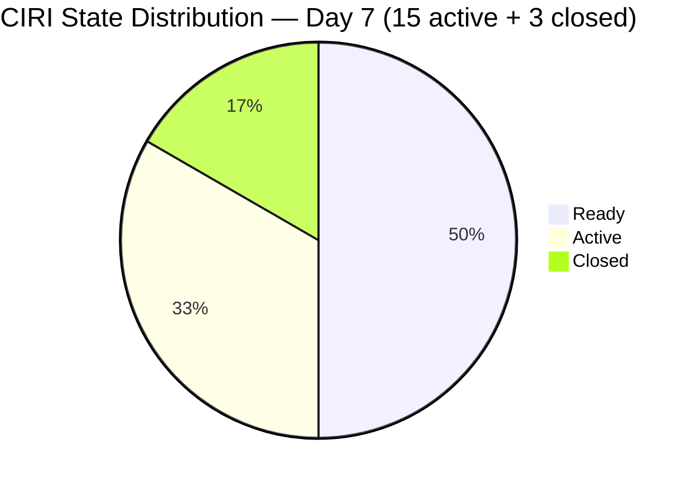
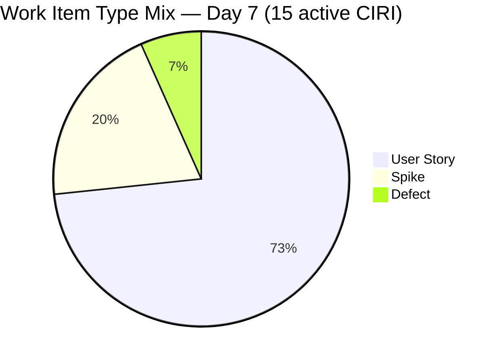
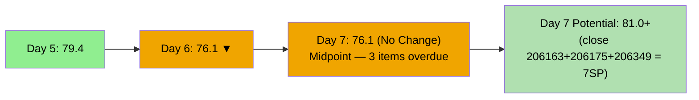
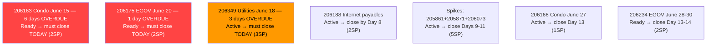
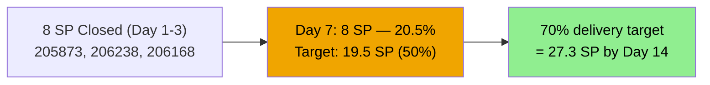

# ADO SAFe Audit — Administration Team

## 1. Audit Metadata

| Field | Value |
|-------|-------|
| **Audit Date** | 2026-06-21 (Sunday) — Day 7 of 14 |
| **Timezone** | PHT (UTC+8) |
| **Iteration** | Iteration 7.6 (IP) |
| **Iteration Dates** | 2026-06-15 to 2026-06-28 |
| **Sprint Day** | Day 7 — Sprint Active (Midpoint Approaching) |
| **ADO Project** | Jairosoft FINOPS |
| **ADO Project ID** | e0bb302f-40f9-46c3-8164-6f1acb317d63 |
| **ADO Team** | Administration Team |
| **ADO Team ID** | a38a9c02-07ab-483d-a1e3-aff54e19e603 |
| **Iteration ID** | bebf6f83-a342-42a2-bad7-a16951231732 |
| **Workspace** | `ado_admin` |
| **Prior Audit** | AUDIT_20260620_0900.md (Day 6, Iteration 7.6 IP, 76.1 — Moderate Risk) |
| **Overall Score** | **76.1 / 100** |
| **Risk Band** | **Moderate Risk** |

---

## 2. Executive Summary

The Administration Team **holds at 76.1 / 100 (Moderate Risk)** on Day 7 of Iteration 7.6 (IP) — **no change** from yesterday's 76.1. No state changes were detected overnight: no new closures, no new items added, and no existing items progressed. The sprint enters its midpoint with delivery stalled at 8/39 SP (20.5%).

**Critical — escalating overdue items:**
- **206175 (EGOV June 20, 2SP)** — due yesterday (June 20), still in Ready state. Now **1 day overdue**. This is a statutory compliance gap and must be closed today without exception.
- **206163 (Condo dues June 15, 2SP)** — now **6 days overdue**. The longest-outstanding overdue item. Payment confirmation and ADO closure are critical.
- **206349 (Utilities June 18, 3SP)** — now **3 days overdue**. Still Active in ADO. If payment was made June 18, ADO must be updated today.

**Structural position at Day 7 midpoint:**
- 15 active CIRI items remain, identical to Day 6
- If Mark closes 206175, 206349, and 206163 today: D7 = 13/39 → 33.3%; overall score recovers to ~80.2 (Low Risk)
- The remaining 7 days (June 21–28) must deliver at least 20 SP for the team to reach 70%+ delivery

**No structural score change today.** The score will remain at 76.1 unless ADO is updated with closures.

---

## 3. Previous Audit Delta

**Prior audit:** AUDIT_20260620_0900.md — Iteration 7.6 IP, Day 6, Score 76.1 / 100 (Moderate Risk)

| Dimension | Day 6 | Day 7 | Delta | Driver |
|-----------|-------|-------|-------|--------|
| D1 Iteration Planning | 62.5 | **62.5** | 0.0 | VRBI=24, CIRI=15 — no change |
| D2 Team Capacity | 100.0 | **100.0** | 0.0 | Mark: 5hr/day, 0 days off — unchanged |
| D3 Estimation | 100.0 | **100.0** | 0.0 | 15/15 estimated — all CIRI have SP>0 |
| D4 DoR Compliance | 100.0 | **100.0** | 0.0 | 15/15 DoR compliant — unchanged |
| D5 Work Item Balance | 70.0 | **70.0** | 0.0 | US=11/15=73.3%; Spike=3/15; Defect=1/15 — unchanged |
| D6 Backlog Refinement | 80.0 | **80.0** | 0.0 | 7/15 untouched=46.7% → -20 penalty; no stale violations |
| D7 Delivery Predictability | 20.5 | **20.5** | 0.0 | No new closures; 8/39 SP closed — unchanged |
| **Overall** | **76.1** | **76.1** | **0.0** | Zero ADO activity since Jun 18; sprint stalled |

**Significant changes since Day 6:**
- No state changes detected. The WIQL closed-item query confirms the same 3 closed items (206168, 205873, 206238) as of the audit timestamp.
- **206175 (EGOV June 20, 2SP)** — was due June 20, remains Ready on Day 7. Escalated to 1 day overdue.
- **206349 (Utilities June 18, 3SP)** — remains Active. 3 days past due date.
- **206163 (Condo dues June 15, 2SP)** — remains Ready. 6 days past due date.
- **206188 (Internet payables, 2SP)** — remains Active with no update.

---

## 4. Current Iteration Snapshot

| Attribute | Value |
|-----------|-------|
| **Active Iteration** | Iteration 7.6 (IP) |
| **Sprint Duration** | 2026-06-15 to 2026-06-28 (14 days) |
| **Audit Day** | Day 7 — Midpoint |
| **VRBI (visible root backlog items)** | 24 |
| **CIRI — Active (visible backlog)** | 15 |
| **CIRI — Closed (WIQL confirmed)** | 3 (205873=2SP, 206238=1SP, 206168=5SP) |
| **CIRI Total (for D7)** | 18 |
| **Open CIRI — Active** | 6 (205861, 205871, 206073, 206166, 206188, 206349) |
| **Open CIRI — Ready** | 9 (202366, 204452, 205087, 205348, 205774, 206163, 206175, 206234, 206357) |
| **Non-CIRI (future PI items)** | 9 (193412, 192221, 197023, 197029, 197111, 197113, 197115, 203693, 205872) |
| **Contributors with Current Work** | 1 (Mark Colina) |
| **Contributors with Capacity** | 1 (Mark: 5hr/day, 0 days off) |
| **Committed Story Points (all CIRI)** | 39 SP (15 active: 31 SP + 3 closed: 8 SP) |
| **Closed Story Points** | 8 SP (205873=2, 206238=1, 206168=5) |
| **Delivery Rate** | 20.5% — Day 7 of 14 (linear target: 50.0%) |

**Delivery gap at midpoint:** The team should be at 50% delivery (19.5 SP) by the end of Day 7. At 8 SP closed, the team is 29 points behind the linear target. To reach 70% delivery by sprint close, Mark must close approximately 3.6 SP/day over the remaining 7 days.

---

## 5. Work Item Analysis

### Active CIRI Items — Full Detail (15 items)

| ID | Title | Type | State | SP | Changed | DoR | Overdue? |
|----|-------|------|-------|----|---------|-----|----------|
| 202366 | Philgeps renewal for 2026 | US | Ready | 3 | 2026-06-14 | Yes | No (rolling deadline) |
| 204452 | Professional fee payables | US | Ready | 3 | 2026-06-09 | Yes | No (awaiting invoice) |
| 205087 | Toyota Fortuner car loan (Cebu) | US | Ready | 1 | 2026-06-08 | Yes | No (monthly amortization) |
| 205348 | Toyota Hilux (Car loan) Cebu | US | Ready | 1 | 2026-06-08 | Yes | No (monthly amortization) |
| 205774 | Blinds to curtains replacement (Cebu) | Defect | Ready | 2 | 2026-06-07 | Yes | No (project work) |
| 205861 | Grandia van transportation inquiry | Spike | Active | 2 | 2026-06-17 | Yes | No (IP exploration) |
| 205871 | Isuzu pick up transportation inquiry | Spike | Active | 2 | 2026-06-18 | Yes | No (IP exploration) |
| 206073 | Recanvass outdoor wall light | Spike | Active | 1 | 2026-06-18 | Yes | No (IP exploration) |
| 206163 | Condo dues (Cebu) June 15, 2026 | US | Ready | 2 | 2026-06-14 | Yes | **6 DAYS OVERDUE** |
| 206166 | Condo dues (Cebu) June 27, 2026 | US | Active | 1 | 2026-06-18 | Yes | No (due Jun 27) |
| 206175 | EGOV payables for June 20, 2026 | US | Ready | 2 | 2026-06-14 | Yes | **1 DAY OVERDUE (was Jun 20)** |
| 206188 | Internet payables Cebu & Davao | US | Active | 2 | 2026-06-17 | Yes | No (billing cycle) |
| 206234 | EGOV payables June 28-30, 2026 | US | Ready | 2 | 2026-06-15 | Yes | No (due Jun 28-30) |
| 206349 | Utilities payables Cebu & Davao June 18 | US | Active | 3 | 2026-06-18 | Yes | **3 DAYS OVERDUE (was Jun 18)** |
| 206357 | Professional fee payment for IC | US | Ready | 2 | 2026-06-15 | Yes | No (within sprint) |

### Closed CIRI Items (WIQL confirmed — excluded from visible backlog)

| ID | Title | Type | SP | Closed Date |
|----|-------|------|----|-------------|
| 205873 | Fabrication of platform for Jairosoft | US | 2 | 2026-06-17 |
| 206238 | Jove's Japan requirements | US | 1 | 2026-06-17 |
| 206168 | EGOV payables June 15-16, 2026 | US | 5 | 2026-06-18 |

**SP by state:** Ready=20 SP; Active=11 SP; Closed=8 SP

### Non-CIRI Items (9 items — future PI scope)

| ID | Title | Type | IterationPath |
|----|-------|------|---------------|
| 192221 | Purchase additional Corrugated Sheet | US | PI8 8.4 |
| 193412 | Implementation of aircon repair 2nd floor | US | PI8 8.4 |
| 197023 | Installation of corrugated sheet at Fire Exit | US | PI8 8.4 |
| 197029 | Parking with roof for 2 vehicles | US | PI8 8.6 (IP) |
| 197111 | Recanvass for Jockey pump materials | US | PI9 9.6 (IP) |
| 197113 | Purchase materials for Jockey pump | US | PI9 9.6 (IP) |
| 197115 | Implementation of installing jockey pump | US | PI9 9.6 (IP) |
| 203693 | Admin CR sink cabinet | Defect | PI8 8.5 |
| 205872 | EBET Jairosoft 1st graduation preparation | Enabler | PI8 8.2 |

---

## 6. SAFe Compliance Scorecard

| Dimension | Score | Evidence | Notes |
|-----------|-------|----------|-------|
| D1 Iteration Planning | **62.5** | 15 CIRI / 24 VRBI | 9 non-CIRI future-PI items inflate denominator |
| D2 Team Capacity | **100.0** | Mark: 5hr/day, 0 days off | Sole contributor; capacity fully configured |
| D3 Estimation | **100.0** | 15/15 point-eligible estimated | All active CIRI items have SP>0 |
| D4 DoR Compliance | **100.0** | 15/15 DoR compliant | All items have desc ≥30 and AC ≥20 non-ws chars |
| D5 Work Item Balance | **70.0** | US=11/15=73.3%; Spike=3; Defect=1 | -30 dominant >60%; US present; Spike <40% |
| D6 Backlog Refinement | **80.0** | 24/24 fresh; 0 stale; 7/15 untouched=46.7% | Base=100; -20 untouched >30%; no stale penalties |
| D7 Delivery Predictability | **20.5** | 8 SP closed / 39 SP committed | No new closures since Jun 18; **Day 7 midpoint** |
| **Overall** | **76.1** | (62.5+100+100+100+70+80+20.5)/7 = 533/7 | **Moderate Risk** — third consecutive day unchanged |

**D1 Detail:**
- visible_root_backlog_items = 24 (backlog API count)
- current_iteration_root_items (visible in 7.6 IP) = 15
- D1 = 15/24 = **62.5**

**D6 Detail:**
- VRBI = 24; all 24 changed after 2026-05-07 → fresh = 24/24 = 100%; base = 100
- stale_90 (before 2026-03-23): 0 items → no penalty
- stale_180 (before 2025-12-24): 0 items → no penalty
- untouched CIRI (ChangedDate strictly before 2026-06-15): 202366(Jun14), 204452(Jun09), 205087(Jun08), 205348(Jun08), 205774(Jun07), 206163(Jun14), 206175(Jun14) = 7/15 = 46.7% → >30% → **-20 penalty**
- D6 = 100 - 20 = **80.0**

**D7 Detail:**
- committed_story_points = 39 (all 18 CIRI, including 3 closed, all have SP>0)
- closed_story_points = 8 (205873=2, 206238=1, 206168=5)
- D7 = 8/39 × 100 = **20.5%**
- Day 7 of 14 — not early-sprint annotation (days 1-5 only)

---

## 7. Dimension Findings

### D1 — Iteration Planning: 62.5

15 of 24 visible backlog items are in Iteration 7.6 (IP). The 9 non-CIRI items represent future PI8 and PI9 work (building improvements, jockey pump project, EBET graduation, sink cabinet). These are appropriately assigned to future iterations and should not be pulled into the current IP sprint. The ratio will not improve until PI8/PI9 items are completed or additional items are added to the 7.6 IP backlog — neither of which is expected during this IP sprint.

### D2 — Team Capacity: 100.0

Mark Colina: 5 hours/day (1hr Deployment + 2hr Documentation + 2hr Requirements), 0 days off configured. Unchanged. Single-contributor team with full capacity. At the Day 7 midpoint, this capacity configuration is appropriate for the volume of remaining payment obligations.

### D3 — Estimation: 100.0

All 15 active CIRI items have Story Points > 0. SP distribution: 3 SP (×2: 202366, 204452, 206349), 2 SP (×7: 205774, 205861, 205871, 206163, 206175, 206188, 206234, 206357), 1 SP (×4: 205087, 205348, 206073, 206166). Perfect estimation coverage maintained through Day 7.

### D4 — DoR Compliance: 100.0

All 15 CIRI items have substantive descriptions (≥30 non-whitespace chars) and acceptance criteria (≥20 non-whitespace chars). DoR compliance remains at 100.0 for the seventh consecutive audit day. No compliance gaps to address.

### D5 — Work Item Balance: 70.0

- User Stories: 202366, 204452, 205087, 205348, 206163, 206166, 206175, 206188, 206234, 206349, 206357 = 11/15 = 73.3%
- Spikes: 205861, 205871, 206073 = 3/15 = 20.0%
- Defects: 205774 = 1/15 = 6.7%

Dominant type (US) = 73.3% > 60% → **-30 penalty**. Spike share 20.0% < 40% → no penalty. US present → no -40 penalty. Score: 100 - 30 = **70.0**. The IP sprint's 3 Spikes represent appropriate IP-phase exploration activities (transportation inquiries, supply recanvass).

### D6 — Backlog Refinement: 80.0

All 24 VRBI items remain fresh (all changed within the last 45 days — all in May-June 2026). Zero stale-90 or stale-180 violations. The -20 penalty comes from the 7 untouched CIRI items (changed before sprint start on June 15). These items are pre-queued payment obligations waiting for their due dates — the penalty reflects the rubric's sensitivity to pre-sprint staging, not actual backlog health problems.

The D6 score will not improve until these 7 items are touched (state updated) within the sprint. Each time Mark closes one of the overdue items (206163, 206175, 206349), the untouched rate among remaining items may decrease or remain elevated depending on which items are left.

### D7 — Delivery Predictability: 20.5 (Day 7 — Sprint Midpoint)

**No closures since June 18.** At Day 7 midpoint, linear expectation is 50% delivery (19.5 SP). The team is at 8 SP (20.5%), a gap of 11.5 SP below the linear target.

**Three overdue items represent immediate closures if payment was made:**
1. **206163 (Condo June 15, 2SP)** — 6 days overdue. If paid June 15, ADO update yields +2 SP → D7 = 10/39 = 25.6%
2. **206175 (EGOV June 20, 2SP)** — 1 day overdue. If paid yesterday (Jun 20), ADO update yields +2 SP
3. **206349 (Utilities June 18, 3SP)** — 3 days overdue. If paid June 18, ADO update yields +3 SP

**If all 3 close today:** D7 = 15/39 = 38.5%; Overall ≈ 81.0 (Low Risk recovery)

**Remaining delivery pipeline (Days 7-14):**
- 206188 (Internet, 2SP) — Active → ~Day 8
- 206166 (Condo June 27, 1SP) — Active → Day 13
- 206234 (EGOV June 28-30, 2SP) — Ready → Day 13-14
- Spikes 205861+205871+206073 (5 SP total) → IP completion by Day 14

---

## 8. Risks and Bottlenecks

| Risk | Severity | Status |
|------|----------|--------|
| 206163 (Condo June 15, 2SP) — 6 days overdue, still Ready | **CRITICAL** | Statutory compliance; audit evidence gap grows daily |
| 206175 (EGOV June 20, 2SP) — 1 day overdue, still Ready | **CRITICAL** | EGOV payment missed deadline; potential late penalties |
| 206349 (Utilities June 18, 3SP) — 3 days overdue, still Active | **HIGH** | 3 SP not captured; payment may have occurred Jun 18 |
| D7 = 20.5% — 8/39 SP at Day 7 midpoint (linear target: 50%) | **HIGH** | 29.5 SP gap at midpoint; requires 4.4 SP/day to reach 70% |
| No ADO updates in 3 days (Jun 18 → Jun 21) | **HIGH** | Mark's ADO hygiene gap undermines audit evidence and score |
| Single contributor (Mark Colina) on all items — bus factor = 1 | **HIGH** | Structural; any unavailability halts all delivery |
| D1 = 62.5 — 9 non-CIRI items inflate denominator | **MEDIUM** | Structural; resolves only in PI8/PI9 |
| D6 untouched rate 46.7% — 7 pre-sprint items not updated | **MEDIUM** | Resolves as payment items close; mathematical side effect |

---

## 9. Prioritized Recommendations

1. **[IMMEDIATE — Day 7 top priority]** Close **206175 (EGOV June 20, 2SP)** now. If payment was made June 20 (as required), update ADO state to Closed, attach payment reference/receipt. This item is 1 day overdue — any further delay compounds statutory risk.

2. **[IMMEDIATE — Day 7]** Resolve **206163 (Condo dues June 15, 2SP)** — 6 days overdue. This is the most critical compliance gap. If paid June 15: close ADO immediately with receipt. If not paid: escalate and pay today, then close ADO. The 6-day gap suggests either payment occurred without ADO update or the payment was missed entirely.

3. **[TODAY]** Close **206349 (Utilities June 18, 3SP)** — 3 days overdue and still Active. If the utility payment was executed June 18 as indicated by the item title, Mark must update ADO to Closed today with proof of payment.

4. **[This week]** Progress and close **206188 (Internet payables, 2SP)** — Active. If ISP invoices are settled, close with receipt. If not yet, process by Day 8.

5. **[Day 9-11]** Activate and close **3 Spike items** (205861, 205871, 206073) — these IP exploration items should be resolvable with procurement decisions by mid-sprint. Closing all 3 adds 5 SP.

6. **[Day 13-14]** Close **206166 (Condo June 27, 1SP)** and **206234 (EGOV June 28-30, 2SP)** before sprint end. Both have deadlines within the sprint window.

7. **[Process — ADO hygiene]** Mark must update ADO the same day payment is executed. The 3-day gap (Jun 18 → Jun 21 with no ADO updates) creates audit evidence gaps and suppresses the team's reported delivery rate. Real-time ADO updates are a SAFe team commitment.

8. **[Next PI planning]** Evaluate whether recurring payment obligations (car loans, condo dues, EGOV, utilities, internet) are appropriate for an Innovation & Planning sprint. IP sprints should prioritize innovation activities. Consider a dedicated Operations iteration or a separate payment tracking workflow.

---

## 10. Evidence Gaps and Limitations

| Gap | Impact | Mitigation |
|-----|--------|-----------|
| 206163 (Condo Jun 15) — Ready at Day 7, 6 days past due date | D7 understated by 2 SP; payment compliance unconfirmed | Mark must update immediately; may indicate missed payment |
| 206349 (Utilities Jun 18) — Active at Day 7, 3 days past title date | D7 understated by 3 SP | Mark must close today with receipt if paid |
| 206175 (EGOV Jun 20) — Ready on Day 7, 1 day past due date | D7 understated by 2 SP | Mark must close today with EGOV payment reference |
| CIRI closed items (205873, 206238, 206168) excluded from active backlog | D7 numerator requires cross-query | WIQL confirmed: all 3 Closed; SP verified |
| FINOPS WIQL returns item 206394 (HR team) in 7.6 IP closed query | Potential cross-team contamination | 206394 excluded from Admin computation; AreaPath verified |
| DoR char counts use HTML-stripped non-whitespace counting | May undercount complex HTML descriptions | Applied consistently across all 15 items; reproducible |

---

