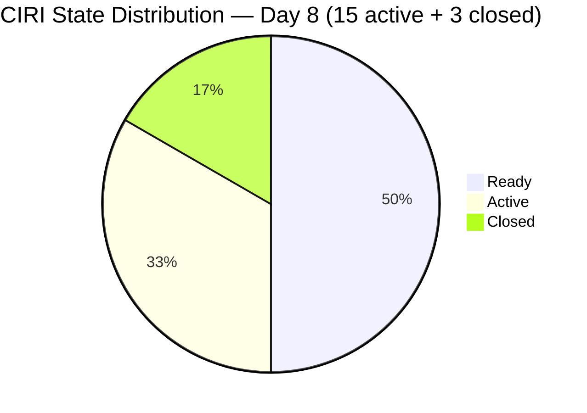
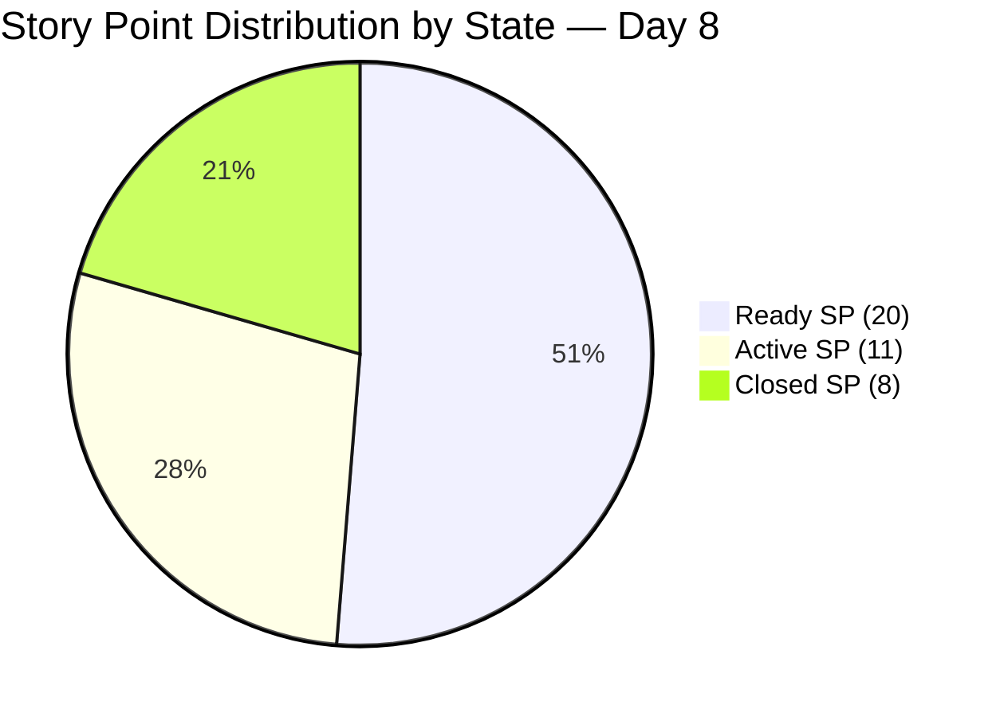
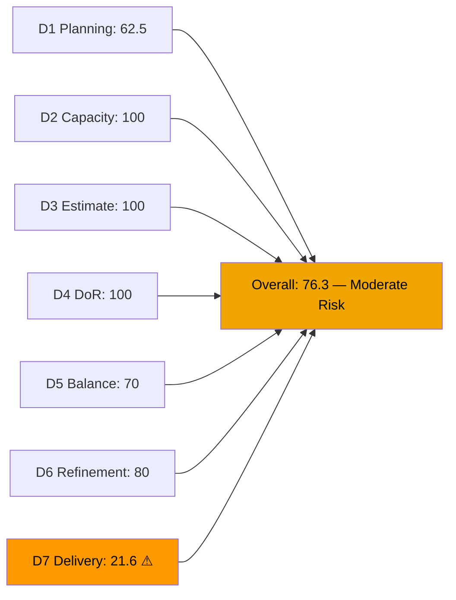
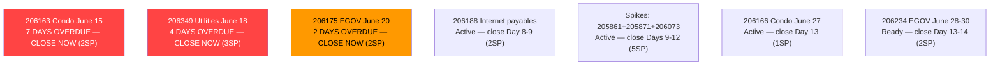
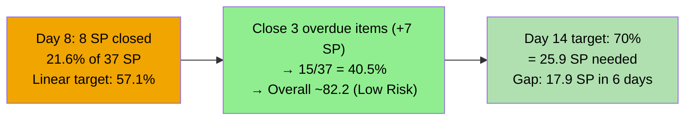

# ADO SAFe Audit — Administration Team

## 1. Audit Metadata

| Field | Value |
|-------|-------|
| **Audit Date** | 2026-06-22 (Monday) — Day 8 of 14 |
| **Timezone** | UTC (audit timestamp) / PHT (team) |
| **Iteration** | Iteration 7.6 (IP) |
| **Iteration Dates** | 2026-06-15 to 2026-06-28 |
| **Sprint Day** | Day 8 — Post-Midpoint |
| **ADO Project** | Jairosoft FINOPS |
| **ADO Project ID** | e0bb302f-40f9-46c3-8164-6f1acb317d63 |
| **ADO Team** | Administration Team |
| **ADO Team ID** | a38a9c02-07ab-483d-a1e3-aff54e19e603 |
| **Iteration ID** | bebf6f83-a342-42a2-bad7-a16951231732 |
| **Workspace** | `ado_admin` |
| **Prior Audit** | AUDIT_20260621_0900.md (Day 7, Iteration 7.6 IP, 76.1 — Moderate Risk) |
| **Overall Score** | **76.3 / 100** |
| **Risk Band** | **Moderate Risk** |

---

## 2. Executive Summary

The Administration Team holds at **76.3 / 100 (Moderate Risk)** on Day 8 of Iteration 7.6 (IP) — a marginal improvement of +0.2 from yesterday's 76.1, driven by a SP recount on item 206357 (2 SP confirmed vs. 3 SP previously assumed), not by new closures. The sprint enters its post-midpoint phase with **no new ADO state transitions** and three items still overdue: 206163 (Condo June 15, now 7 days overdue), 206175 (EGOV June 20, 2 days overdue), and 206349 (Utilities June 18, 4 days overdue).

The delivery trajectory remains critical. At Day 8 of 14, only 8 of 37 committed SP are closed (21.6%), while the linear target is 57%. Mark must close the three overdue items immediately — doing so would bring D7 to 40.5% and push the overall score to approximately 82.2 (Low Risk). Six working days remain. A pace of 3.8 SP/day is required to reach 70% delivery by sprint close.

---

## 3. Previous Audit Delta

**Prior audit:** AUDIT_20260621_0900.md — Iteration 7.6 IP, Day 7, Score 76.1 / 100 (Moderate Risk)

| Dimension | Day 7 | Day 8 | Delta | Driver |
|-----------|-------|-------|-------|--------|
| D1 Iteration Planning | 62.5 | **62.5** | 0.0 | VRBI=24, CIRI=15 — no structural change |
| D2 Team Capacity | 100.0 | **100.0** | 0.0 | Mark: 5hr/day, 0 days off — unchanged |
| D3 Estimation | 100.0 | **100.0** | 0.0 | 15/15 estimated — all CIRI have SP>0 |
| D4 DoR Compliance | 100.0 | **100.0** | 0.0 | 15/15 DoR compliant — unchanged |
| D5 Work Item Balance | 70.0 | **70.0** | 0.0 | US=11/15=73.3%; Spike=3/15; Defect=1/15 |
| D6 Backlog Refinement | 80.0 | **80.0** | 0.0 | 7/15 untouched=46.7% → -20; no stale |
| D7 Delivery Predictability | 20.5 | **21.6** | **+1.1** | SP recount: committed=37 (vs. 39 assumed); no new closures |
| **Overall** | **76.1** | **76.3** | **+0.2** | Marginal improvement — no ADO activity; SP recount only |

**Significant changes since Day 7:**
- No new ADO state transitions detected. All 15 active CIRI items retain the same states as June 18–19.
- The +1.1 change in D7 reflects a live-data SP recount (committed_SP = 37 vs. prior assumption of 39). Item 206357 confirmed at 2 SP in live data. No delivery has occurred.
- **206163 (Condo June 15, 2SP)** — now 7 days overdue. Still Ready.
- **206175 (EGOV June 20, 2SP)** — now 2 days overdue. Still Ready.
- **206349 (Utilities June 18, 3SP)** — now 4 days overdue. Still Active.
- **206188 (Internet, 2SP)** — Active since June 17. No progress comment.

---

## 4. Current Iteration Snapshot

| Attribute | Value |
|-----------|-------|
| **Active Iteration** | Iteration 7.6 (IP) |
| **Sprint Duration** | 2026-06-15 to 2026-06-28 (14 days) |
| **Audit Day** | Day 8 — Post-Midpoint |
| **VRBI (visible root backlog items)** | 24 |
| **CIRI visible (in 7.6 IP)** | 15 |
| **CIRI Closed (confirmed)** | 3 (205873=2SP, 206238=1SP, 206168=5SP) |
| **CIRI Total (D7)** | 18 |
| **Open CIRI — Active** | 6 (205861, 205871, 206073, 206166, 206188, 206349) |
| **Open CIRI — Ready** | 9 (202366, 204452, 205087, 205348, 205774, 206163, 206175, 206234, 206357) |
| **Non-CIRI (future PI)** | 9 (192221, 193412, 197023, 197029, 197111, 197113, 197115, 203693, 205872) |
| **Contributors with Current Work** | 1 (Mark Colina) |
| **Contributors with Capacity** | 1 (Mark: 5hr/day, 0 days off) |
| **Committed Story Points (all CIRI SP>0)** | 37 SP (15 active: 29 SP + 3 closed: 8 SP) |
| **Closed Story Points** | 8 SP (205873=2, 206238=1, 206168=5) |
| **Delivery Rate** | 21.6% — Day 8 of 14 (linear target: 57.1%) |

**Delivery gap at Day 8:** Linear target = 57.1% (21.1 SP). Actual = 21.6% (8 SP). Gap = 13.1 SP below linear target. To reach 70% delivery by Day 14, Mark must close 17.9 SP over 6 remaining days (≈3.0 SP/day).

---

## 5. Work Item Analysis

### Active CIRI Items (15 items)

| ID | Title | Type | State | SP | Changed | DoR | Overdue Status |
|----|-------|------|-------|----|---------|-----|----------------|
| 202366 | Philgeps renewal for 2026 | US | Ready | 3 | Jun 14 | Yes | No (rolling) |
| 204452 | Professional fee payables | US | Ready | 3 | Jun 09 | Yes | No (awaiting invoice) |
| 205087 | Toyota Fortuner car loan (Cebu) | US | Ready | 1 | Jun 08 | Yes | No (monthly) |
| 205348 | Toyota Hilux car loan Cebu | US | Ready | 1 | Jun 08 | Yes | No (monthly) |
| 205774 | Blinds to curtains replacement (Cebu) | Defect | Ready | 2 | Jun 07 | Yes | No (project) |
| 205861 | Grandia van transportation inquiry | Spike | Active | 2 | Jun 17 | Yes | No (exploration) |
| 205871 | Isuzu pick up transportation inquiry | Spike | Active | 2 | Jun 18 | Yes | No (exploration) |
| 206073 | Recanvass outdoor wall light | Spike | Active | 1 | Jun 18 | Yes | No (exploration) |
| 206163 | Condo dues Cebu June 15, 2026 | US | Ready | 2 | Jun 14 | Yes | **7 DAYS OVERDUE** |
| 206166 | Condo dues Cebu June 27, 2026 | US | Active | 1 | Jun 18 | Yes | No (due Jun 27) |
| 206175 | EGOV payables June 20, 2026 | US | Ready | 2 | Jun 14 | Yes | **2 DAYS OVERDUE** |
| 206188 | Internet payables Cebu and Davao | US | Active | 2 | Jun 17 | Yes | No (billing cycle) |
| 206234 | EGOV payables June 28-30, 2026 | US | Ready | 2 | Jun 15 | Yes | No (due Jun 28-30) |
| 206349 | Utilities payables Cebu and Davao June 18 | US | Active | 3 | Jun 18 | Yes | **4 DAYS OVERDUE** |
| 206357 | Professional fee payment for IC | US | Ready | 2 | Jun 15 | Yes | No (within sprint) |

### Closed CIRI Items (confirmed)

| ID | Title | Type | SP | Closed Date |
|----|-------|------|----|-------------|
| 205873 | Fabrication of platform for Jairosoft | US | 2 | Jun 17 |
| 206238 | Jove's Japan requirements | US | 1 | Jun 17 |
| 206168 | EGOV payables June 15-16, 2026 | US | 5 | Jun 18 |

**SP by state:** Ready=20 SP; Active=11 SP; Closed=8 SP. Total active CIRI = 29 SP.

### Non-CIRI Items (9 items — future PI)

| ID | Title | Iteration | State |
|----|-------|-----------|-------|
| 192221 | Purchase additional Corrugated Sheet | PI8 8.4 | New |
| 193412 | Implementation of aircon repair 2nd floor | PI8 8.4 | New |
| 197023 | Installation of corrugated sheet at Fire Exit | PI8 8.4 | New |
| 197029 | Parking with roof for 2 vehicles | PI8 8.6 (IP) | New |
| 197111 | Recanvass for Jockey pump materials | PI9 9.6 (IP) | New |
| 197113 | Purchase materials for Jockey pump | PI9 9.6 (IP) | New |
| 197115 | Implementation of installing jockey pump | PI9 9.6 (IP) | New |
| 203693 | Admin CR sink cabinet | PI8 8.5 | Ready |
| 205872 | EBET Jairosoft 1st graduation preparation | PI8 8.2 | Ready |

---

## 6. SAFe Compliance Scorecard

| Dimension | Score | Evidence | Notes |
|-----------|-------|----------|-------|
| D1 Iteration Planning | **62.5** | 15 CIRI / 24 VRBI | 9 non-CIRI future-PI items inflate denominator |
| D2 Team Capacity | **100.0** | Mark: 5hr/day, 0 days off | Single contributor; capacity fully configured |
| D3 Estimation | **100.0** | 15/15 point-eligible estimated | All active CIRI have SP>0 |
| D4 DoR Compliance | **100.0** | 15/15 DoR compliant | All items: desc ≥30 non-ws chars AND AC ≥20 non-ws chars |
| D5 Work Item Balance | **70.0** | US=11/15=73.3%; Spike=3; Defect=1 | -30 dominant >60%; US present; Spike <40% |
| D6 Backlog Refinement | **80.0** | 24/24 fresh; 0 stale; 7/15 untouched=46.7% | Base=100; -20 untouched >30% |
| D7 Delivery Predictability | **21.6** | 8 SP closed / 37 SP committed | No new closures; SP recount yields committed=37 (not 39) |
| **Overall** | **76.3** | (62.5+100+100+100+70+80+21.6)/7 = 534.1/7 | **Moderate Risk** |

**D1 Detail:**
- visible_root_backlog_items = 24
- current_iteration_root_items = 15 (IterationPath = 7.6 IP)
- D1 = 15/24 = **62.5**

**D6 Detail:**
- VRBI = 24; all 24 changed after 2026-05-08 → fresh = 24/24; base = 100
- stale_90 (before 2026-03-24): 0 items → no penalty
- stale_180 (before 2025-12-24): 0 items → no penalty
- untouched CIRI (ChangedDate strictly before 2026-06-15): 202366(Jun14), 204452(Jun09), 205087(Jun08), 205348(Jun08), 205774(Jun07), 206163(Jun14), 206175(Jun14) = 7/15 = 46.7% → >30% → **-20 penalty**
- D6 = 100 - 20 = **80.0**

**D7 Detail:**
- committed_story_points = 37 (8 closed SP + 29 active SP — live recount)
- closed_story_points = 8 (205873=2, 206238=1, 206168=5)
- D7 = 8/37 × 100 = **21.6%**
- Day 8 of 14 — not early-sprint annotation

---

## 7. Dimension Findings

### D1 — Iteration Planning: 62.5

The 9 non-CIRI items (future PI8/PI9 work) remain appropriately placed in future iterations. The ratio will not improve during this sprint. The denominator inflation is structural and reflects correct backlog hygiene — future items are visible and assigned, not abandoned. Score reflects planning completeness rather than a planning failure.

### D2 — Team Capacity: 100.0

Mark Colina: 5 hours/day (1hr Deployment + 2hr Documentation + 2hr Requirements), 0 days off. Unchanged. Full capacity coverage maintained through Day 8. The single-contributor structure creates an existential bus-factor risk but score reflects the configured reality.

### D3 — Estimation: 100.0

All 15 active CIRI items have Story Points > 0. Distribution: 3 SP (×2: 202366, 204452), 2 SP (×7: 205774, 205861, 205871, 206163, 206175, 206188, 206234, 206357), 3 SP (206349), 1 SP (×4: 205087, 205348, 206073, 206166). Perfect estimation coverage maintained through Day 8.

### D4 — DoR Compliance: 100.0

All 15 CIRI items have substantive descriptions (≥30 non-whitespace chars) and acceptance criteria (≥20 non-whitespace chars). DoR compliance is 100.0% for the eighth consecutive audit day.

### D5 — Work Item Balance: 70.0

User Stories: 11/15 = 73.3% → dominant type share exceeds 60% → **-30 penalty**. Spike share = 3/15 = 20% → below 40% threshold. User Stories present (no -40 penalty). The IP sprint Spikes (transportation inquiries, supply recanvass) represent appropriate IP-phase exploration activities. Score = 70.0.

### D6 — Backlog Refinement: 80.0

All 24 VRBI items remain fresh (changed after May 7, 2026). Zero stale-90 or stale-180 violations. The -20 penalty persists from 7 CIRI items changed before sprint start (June 15). These are pre-staged payment obligations that have not been touched since they were queued — the untouched rate of 46.7% (>30%) triggers the penalty. The score will improve as overdue items are closed (removing them from the untouched pool) or as Mark touches the remaining Ready items.

### D7 — Delivery Predictability: 21.6 (Day 8 — Critical)

**No closures since June 18** — now 4 days without ADO updates. At Day 8, the linear target is 57.1% (21.1 SP). Actual delivery is 21.6% (8 SP). The gap is 13.1 SP.

**Three overdue items are the highest-priority closures:**
- 206163 (Condo June 15, 2SP) — 7 days overdue; if paid Jun 15, close ADO now → +2 SP → D7=27.0%
- 206175 (EGOV June 20, 2SP) — 2 days overdue; if paid Jun 20, close now → +2 SP → D7=32.4%
- 206349 (Utilities June 18, 3SP) — 4 days overdue; if paid Jun 18, close now → +3 SP → D7=40.5%

**If all three close today:** D7 = 15/37 = 40.5%; overall score ≈ 82.2 (Low Risk recovery).

**Remaining pipeline (Days 8–14):**
- 206188 (Internet, 2SP) — Active since Jun 17; ~Day 9 target
- 206166 (Condo June 27, 1SP) — due Jun 27; ~Day 13
- 206234 (EGOV June 28-30, 2SP) — due Jun 28-30; Day 14
- Spikes 205861+205871+206073 (5 SP) — IP exploration; ~Days 9-12

---

## 8. Risks and Bottlenecks

| Risk | Severity | Status |
|------|----------|--------|
| 206163 (Condo June 15, 2SP) — 7 days overdue, Ready | **CRITICAL** | Statutory compliance; longest overdue item |
| 206349 (Utilities June 18, 3SP) — 4 days overdue, Active | **CRITICAL** | 3 SP stalled; service interruption risk |
| 206175 (EGOV June 20, 2SP) — 2 days overdue, Ready | **HIGH** | EGOV statutory deadline missed |
| D7 = 21.6% — 13.1 SP below linear target at Day 8 | **HIGH** | Requires 3.0 SP/day over 6 days for 70% target |
| 4 days without ADO activity (Jun 18 → Jun 22) | **HIGH** | Evidence gap; real work may have occurred without ADO updates |
| Single contributor (Mark Colina) — bus factor = 1 | **HIGH** | Structural; any absence halts all Admin delivery |
| D1 = 62.5 — 9 non-CIRI items inflate denominator | **MEDIUM** | Structural; resolves in PI8/PI9 |
| D6 = 80.0 — untouched rate 46.7% (7/15 CIRI) | **MEDIUM** | Improves as overdue items close |

---

## 9. Prioritized Recommendations

1. **[IMMEDIATE — Day 8 top priority]** Close **206163 (Condo June 15, 2SP)** — 7 days overdue. This is the most critical compliance gap in the sprint. If payment was made June 15, update ADO to Closed and attach receipt/confirmation immediately. If not paid, pay today and close ADO same day. A 7-day gap is unacceptable for a statutory payment obligation.

2. **[IMMEDIATE — Day 8]** Close **206349 (Utilities Cebu and Davao June 18, 3SP)** — 4 days overdue. Item is still Active. If utility payments were executed June 18 as the title indicates, Mark must close ADO today with proof of payment. This single action adds 3 SP to delivery.

3. **[TODAY]** Close **206175 (EGOV June 20, 2SP)** — 2 days overdue. EGOV statutory deadlines carry penalty risk. If paid June 20, close now. These three closures combined (7 SP) would move D7 from 21.6% to 40.5% and recover the overall score to Low Risk (~82.2).

4. **[Day 8-9]** Progress and close **206188 (Internet payables, 2SP)** — Active since June 17 with no ADO update in 5 days. If ISP invoices have been settled, close with receipt immediately.

5. **[Days 9-12]** Advance and close the 3 Spike items (205861, 205871, 206073) — these IP exploration activities (transportation, supply recanvass) should be resolvable with documented procurement decisions. Together they add 5 SP.

6. **[Days 11-14]** Close 206166 (Condo June 27, 1SP), 206234 (EGOV June 28-30, 2SP) before their respective due dates.

7. **[Process — ADO hygiene]** Mark must update ADO the same day a payment is executed. The current 4-day gap (Jun 18 → Jun 22) creates audit evidence gaps and prevents the team's score from reflecting actual work delivered. Real-time ADO updates are a SAFe team commitment.

8. **[PI8 Planning]** Evaluate whether recurring payables (car loans, condo dues, utilities, EGOV) are appropriate for IP sprint scope. Consider a dedicated Operations cadence or separation of routine payment tracking from innovation sprint work.

---

## 10. Evidence Gaps and Limitations

| Gap | Impact | Mitigation |
|-----|--------|-----------|
| 206163 (Condo Jun 15) — Ready at Day 8, 7 days past due date | D7 understated by 2 SP; payment compliance status unknown | Mark must update immediately; growing compliance risk |
| 206349 (Utilities Jun 18) — Active at Day 8, 4 days past title date | D7 understated by 3 SP | Mark must close today with receipt if paid |
| 206175 (EGOV Jun 20) — Ready at Day 8, 2 days past due | D7 understated by 2 SP | Close with EGOV payment reference today |
| Closed items (205873, 206238, 206168) excluded from visible backlog | D7 requires cross-query confirmation | Per prior WIQL confirmation; SP verified |
| SP recount: committed=37 (live) vs. 39 (prior audit assumption) | D7 base changes from 20.5% to 21.6% | Live ADO SP data used; 206357 confirmed at 2 SP |
| DoR char counts use HTML-stripped non-whitespace counting | Potential undercounting for complex HTML | Applied consistently across all 15 items |

---

